# 第十五章：测试重要部分

编写高质量的软件是一项技术上具有挑战性和昂贵的活动。技术上具有挑战性的部分来自于需要理解和实现多种类型的应用程序测试。而昂贵的部分来自于适当的测试通常产生的代码比我们正在测试的代码更多，这意味着需要更多的时间来完成工作。

与开发人员不同，企业不太关心技术细节，而更关心降低成本。这就是两个世界在质量的代价上发生冲突的地方。虽然两者都理解“技术债务”概念的影响，但很少有人认真对待。网页应用程序是这种冲突的一个很好的例子。足够好的用户体验和设计通常足以满足股东的需求，而软件的许多内部和远离视线的部分则被忽视。

查看有关技术债务概念的更多信息，请访问[`en.wikipedia.org/wiki/Technical_debt`](https://en.wikipedia.org/wiki/Technical_debt)。

我们可以对应用程序应用许多类型的测试，其中一些如下：

+   单元测试

+   功能测试

+   性能测试

+   可用性测试

+   验收测试

说一个比另一个更重要是不公平的，因为每个都涉及应用程序的一个非常不同的部分。PHP 生态系统和工具的当前状态表明“单元”、“功能”和“性能测试”是其中流行的一些。在本章中，我们将快速查看一些适应这些测试类型的工具和库：

+   PHPUnit

+   Behat

+   phpspec

+   jMeter

典型程序员认为经过彻底测试的软件通常只执行了大约 55 到 60％的逻辑路径。使用自动化支持，如覆盖分析器，可以将其提高到大约 85 到 90％。几乎不可能以 100％的逻辑路径测试软件。

- 《软件工程的事实与谬误》一书。

# PHPUnit

PHPUnit 是单元测试框架的代表，其总体思想是为必须满足的孤立代码提供严格的合同。这段代码就是我们所谓的“单元”，在 PHP 中对应于类及其方法。使用“断言”功能，PHPUnit 框架验证这些单元的行为是否符合预期。单元测试的好处在于，它早期发现问题有助于减轻可能不明显的“复合”或“下游”错误。程序的可能路径越多，单元测试覆盖的越好。

# 设置 PHPUnit

PHPUnit 可以作为一个临时命名的“工具”或“库”安装。实际上两者是相同的，只是在安装和使用方式上有所不同。“工具”版本实际上只是一个我们可以通过控制台运行的 PHP“phar”存档，然后提供一组我们可以全局执行的控制台命令。“库”版本则是一组作为 Composer 包打包的 PHPUnit 库，以及一个被转储到项目的`vendor/bin/`目录下的二进制文件。

假设我们正在使用 Ubuntu 16.10（Yakkety Yak）安装，通过以下命令安装 PHPUnit 作为工具非常容易：

```php
wget https://phar.phpunit.de/phpunit.phar
chmod +x phpunit.phar
sudo mv phpunit.phar /usr/local/bin/phpunit
phpunit --version

```

这应该给我们最终的输出，就像以下屏幕截图一样：

！[](assets/04a8301f-9170-475d-9cf6-9f06da6b1be5.png)

PHPUnit 成为一个系统范围内可访问的控制台工具，与任何特定项目无关。

将 PHPUnit 安装为库就像在项目根目录中运行以下控制台命令一样容易：

```php
composer require phpunit/phpunit

```

这应该给我们最终的输出，就像以下屏幕截图一样：

！[](assets/c9cf5e36-7f37-4e8f-be79-813ff7590a43.png)

这将在我们项目的`vendor/phpunit/`目录中安装所有 PHPUnit 库文件，以及在`vendor/bin/`目录下的`phpunit`可执行文件。

# 设置一个示例应用程序

在我们开始编写一些 PHPUnit 测试脚本之前，让我们继续创建一个非常简单的应用程序，仅由几个文件组成。这将使我们能够专注于稍后编写测试的本质。

**测试驱动开发**（**TDD**），例如使用 PHPUnit 进行的开发，鼓励在实现之前编写测试。这样，测试设置了功能的期望，而不是相反。这种方法需要一定水平的经验和纪律，这可能不适合 PHPUnit 的新手。

假设我们正在制作网购功能的一部分，因此首先处理产品和类别实体。我们首先要处理的类是`Product`模型。我们将通过创建`src\Foggyline\Catalog\Model\Product.php`文件来实现这一点，其内容如下：

```php
<?php declare(strict_types=1); namespace Foggyline\Catalog\Model; class Product {
  protected $id;
  protected $title;
  protected $price;
  protected $taxRate;    public function __construct(string $id, string $title, float $price, int $taxRate)
 {  $this->id = $id;
  $this->title = $title;
  $this->price = $price;
  $this->taxRate = $taxRate;
 }    public function getId(): string
 {  return $this->id;
 }  public function getTitle(): string
 {  return $this->title;
 }    public function getPrice(): float
 {  return $this->price;
 }    public function getTaxRate(): int
 {  return $this->taxRate;
 } }

```

`Product`类依赖于构造函数来设置产品的 ID、标题、价格和税率。除此之外，该类没有实际的逻辑，除了简单的 getter 方法。有了`Product`类，让我们继续创建一个`Category`类。我们将把它添加到`src\Foggyline\Catalog\Model\Category.php`文件中，其内容如下：

```php
<?php   declare(strict_types=1);   namespace Foggyline\Catalog\Model; class Category {
  protected $title;
  protected $products;    public function __construct(string $title, array $products)
 {  $this->title = $title;
  $this->products = $products;
 }  public function getTitle(): string
 {  return $this->title;
 }    public function getProducts(): array
  {
  return $this->products;
 } } 

```

`Category`类依赖于构造函数来设置类别标题及其产品。除此之外，它没有其他逻辑，除了两个 getter 方法，这些方法仅返回通过构造函数设置的值。

为了增加一些调味料，为了测试目的，让我们继续创建一个虚拟的`Layer`类，作为`src\Foggyline\Catalog\Model\Layer.php`文件的一部分，其内容如下：

```php
<?php namespace Foggyline\Catalog\Model;   // Just a dummy class, for testing purpose class Layer {
  public function dummy()
 {  $time = time();
  sleep(2);
  $time = time() - $time;
  return $time;
 } }

```

我们将仅将这个类用作示例，稍后进行代码覆盖分析。

有了`Product`和`Category`模型，让我们继续创建`Block\Category\View`类，作为`src\Foggyline\Catalog\Block\Category\View.php`文件的一部分，其内容如下：

```php
<?php   declare(strict_types=1);   namespace Foggyline\Catalog\Block\Category;   use Foggyline\Catalog\Model\Category; class View {
  protected $category;    public function __construct(Category $category)
 {  $this->category = $category;
 }    public function render(): string
 {  $products = '';

  foreach ($this->category->getProducts() as $product) {
  if ($product instanceof \Foggyline\Catalog\Model\Product) {
  $products .= '<div class="product">
 <h1 class="product-title">' . $product->getTitle() . '</h1>
 <div class="product-price">' . number_format($product->getPrice(), 2, ',', '.') . '</h1>
 </div>';
 } }    return '<div class="category">
 <h1 class="category-title">' . $this->category->getTitle() . '</h1>
 <div class="category-products">' . $products . '</div>
 </div>';
 } }

```

我们使用`render()`方法来渲染整个类别页面。页面本身包括类别标题，以及所有产品及其各自的标题和价格的容器。现在我们已经概述了我们真正基本的应用程序类，让我们在`autoload.php`文件中添加一个简单的 PSR4 类型加载器，其内容如下：

```php
<?php   $loader = require __DIR__ . '/vendor/autoload.php'; $loader->addPsr4('Foggyline\\', __DIR__ . '/src/Foggyline');

```

最后，我们将设置应用程序的入口点作为`index.php`文件的一部分，其内容如下：

```php
<?php   require __DIR__ . '/autoload.php';    use Foggyline\Catalog\Model\Product; use Foggyline\Catalog\Model\Category; use Foggyline\Catalog\Block\Category\View as CategoryView;   $category = new Category('Laptops', [
  new Product('RL', 'Red Laptop', 1499.99, 25),
  new Product('YL', 'Yellow Laptop', 2499.99, 25),
  new Product('BL', 'Blue Laptop', 3499.99, 25), ]);   $categoryView = new CategoryView($category); echo $categoryView->render();

```

我们将在其他类型的测试中使用这个非常简单的应用程序，因此值得记住它的文件和结构。

# 编写测试

开始编写 PHPUnit 测试需要掌握一些基本概念，例如以下内容：

+   **setUp()方法**：类似于构造函数，这是我们创建针对测试执行的对象的地方。

+   **tearDown()方法**：类似于析构函数，这是我们清理针对测试执行的对象的地方。

+   **test*()方法**：每个公共方法的名称以 test 开头，例如`testSomething()`，`testItAgain()`等，被视为单个测试。通过在方法的文档块中添加`@test`注释也可以实现相同的效果；尽管这似乎是一个不太常用的情况。

+   **@depends 注释**：这允许表达测试方法之间的依赖关系。

+   **断言**：这是 PHPUnit 的核心，这组方法允许我们推理正确性。

`vendor\phpunit\phpunit\src\Framework\Assert\Functions.php`文件包含了大量的`assert*`函数声明，例如`assertEquals()`，`assertContains()`，`assertLessThan()`等，总共超过 90 个不同的断言函数。

有了这些，让我们继续编写`src\Foggyline\Catalog\Test\Unit\Model\ProductTest.php`文件，其内容如下：

```php
<?php   namespace Foggyline\Catalog\Test\Unit\Model;   use PHPUnit\Framework\TestCase; use Foggyline\Catalog\Model\Product;   class ProductTest extends TestCase {
  protected $product;    public function setUp()
 {  $this->product = new Product('SL', 'Silver Laptop', 4599.99, 25);
 }    public function testTitle()
 {  $this->assertEquals(
  'Silver Laptop',
  $this->product->getTitle()
 ); }  public function testPrice()
 {  $this->assertEquals(
  4599.99,
  $this->product->getPrice()
 ); } }

```

我们的`ProductTest`类使用`setUp()`方法来设置`Product`类的实例。然后，两个`test*()`方法使用 PHPUnit 内置的`assertEquals()`方法来测试产品标题和价格的值。

然后，我们添加了`src\Foggyline\Catalog\Test\Unit\Model\CategoryTest.php`文件，其内容如下：

```php
<?php   namespace Foggyline\Catalog\Test\Unit\Model;   use PHPUnit\Framework\TestCase; use Foggyline\Catalog\Model\Product; use Foggyline\Catalog\Model\Category;   class CategoryTest extends TestCase {
  protected $category;    public function setUp()
 {  $this->category = new Category('Laptops', [
  new Product('TRL', 'Test Red Laptop', 1499.99, 25),
  new Product('TYL', 'Test Yellow Laptop', 2499.99, 25),
 ]); }    public function testTotalProductsCount()
 {  $this->assertCount(2, $this->category->getProducts());
 }  public function testTitle()
 {  $this->assertEquals('Laptops', $this->category->getTitle());
 } }

```

我们的`CategoryTest`类使用`setUp()`方法来设置`Category`类的实例，以及传递给`Category`类构造函数的两个产品。然后，两个`test*()`方法使用 PHPUnit 内置的`assertCount()`和`assertEquals()`方法来测试实例化的值。

然后，我们添加了`src\Foggyline\Catalog\Test\Unit\Block\Category\ViewTest.php`文件，其内容如下：

```php
<?php   namespace Foggyline\Catalog\Test\Unit\Block\Category;   use PHPUnit\Framework\TestCase; use Foggyline\Catalog\Model\Product; use Foggyline\Catalog\Model\Category; use Foggyline\Catalog\Block\Category\View as CategoryView;   class ViewTest extends TestCase {
  protected $category;
  protected $categoryView;    public function setUp()
 {  $this->category = new Category('Laptops', [
  new Product('TRL', 'Test Red Laptop', 1499.99, 25),
  new Product('TYL', 'Test Yellow Laptop', 2499.99, 25),
 ]);  $this->categoryView = new CategoryView($this->category);
 }  public function testCategoryTitle()
 {  $this->assertContains(
  '<h1 class="category-title">Laptops',
  $this->categoryView->render()
 ); }    public function testProductsContainer()
 {  $this->assertContains(
  '<h1 class="product-title">Test Yellow',
  $this->categoryView->render()
 ); } }

```

我们的`ViewTest`类使用`setUp()`方法来设置`Category`类的实例，以及传递给`Category`类构造函数的两个产品。然后，两个`test*()`方法使用 PHPUnit 内置的`assertContains()`方法来测试通过类别视图`render()`方法调用返回的值的存在。

然后，我们添加了`phpunit.xml`文件，其内容如下：

```php
<phpunit bootstrap="autoload.php">
 <testsuites>
 <testsuite name="foggyline">
 <directory>src/Foggyline/*/Test/Unit/*</directory>
 </testsuite>
 </testsuites>
</phpunit>

```

`phpunit.xml`配置文件支持相当丰富的选项列表。使用 PHPUnit 元素的 bootstrap 属性，我们指示 PHPUnit 工具在运行测试之前加载`autoload.php`文件。这确保我们的 PSR4 自动加载程序将启动，并且我们的测试类将在`src/Foggyline`目录中看到我们的类。我们在`testsuites`中定义的`foggyline`测试套件使用 directory 选项以正则表达式形式指定我们单元测试的路径。我们使用的路径是这样的，以便捡起`src/Foggyline/Catalog/Test/Unit/`和可能`src/Foggyline/Checkout/Test/Unit/`目录下的所有文件。

查看[`phpunit.de/manual/current/en/appendixes.configuration.html`](https://phpunit.de/manual/current/en/appendixes.configuration.html)以获取有关`phpunit.xml`配置选项的更多信息。

# 执行测试

运行我们刚刚编写的测试套件就像在项目根目录中执行`phpunit`命令一样简单。

执行时，`phpunit`将查找`phpunit.xml`文件并相应地采取行动。这意味着`phpunit`将知道在哪里查找测试文件。成功执行的测试显示如下屏幕截图所示：


然而，未成功执行的测试显示如下屏幕截图所示：

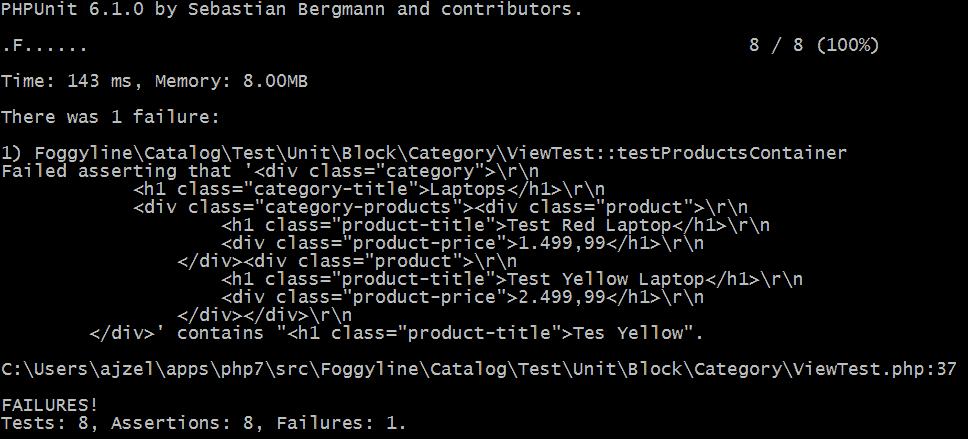

我们可以轻松修改其中一个测试类，就像我们之前对`ViewTest`所做的那样，以触发并观察`phpunit`对失败的反应。

# 代码覆盖率

PHPUnit 的一个很棒的功能是其代码覆盖率报告功能。我们可以通过扩展`phpunit.xml`文件轻松地将代码覆盖率添加到我们的测试套件中，如下所示：

```php
<phpunit bootstrap="autoload.php">
 <testsuites>
 <testsuite name="foggyline">
 <directory>src/Foggyline/*/Test/Unit/*</directory>
 </testsuite>
 </testsuites>
 <filter>
 <whitelist>
 <directory>src/Foggyline/</directory>
 <exclude>
 <file>src/config.php</file>
 <file>src/auth.php</file>
 <directory>src/Foggyline/*/Test/</directory>
 </exclude> 
 </whitelist>
 <logging>
 <log type="coverage-html" target="log/report" lowUpperBound="50" 
        highLowerBound="80"/>
 </logging>
 </filter>
</phpunit>

```

在这里，我们添加了`filter`元素，还有额外的`whitelist`和`logging`元素。现在我们可以再次触发测试，但是，这次稍微修改了命令，如下所示：

```php
phpunit --coverage-html log/report

```

这应该给我们最终的输出，如下屏幕截图所示：


`log/report`目录现在应该填满了 HTML 报告文件。如果我们将其暴露给浏览器，我们可以看到一个生成良好的报告，其中包含有关我们代码库的有价值的信息，如下面的屏幕截图所示：


前面的屏幕截图显示了`src/Foggyline/Catalog/`目录结构中的代码覆盖率百分比。进一步深入到`Model`目录，我们看到我们的`Layer`类的代码覆盖率为 0%，这是预期的，因为我们还没有为它编写任何测试：


进一步深入到实际的`Product`类本身，我们可以看到 PHPUnit 代码覆盖概述了我们的测试覆盖的每一行代码。

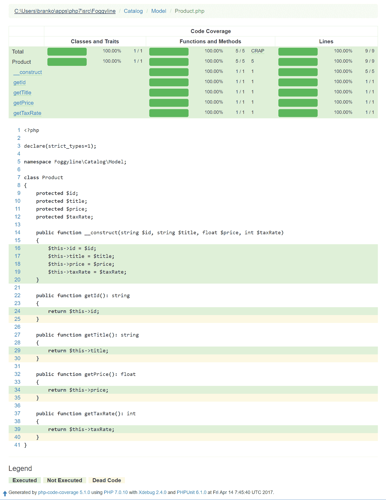

直接查看实际的`Layer`类，我们可以清楚地看到这个类中没有任何代码覆盖：

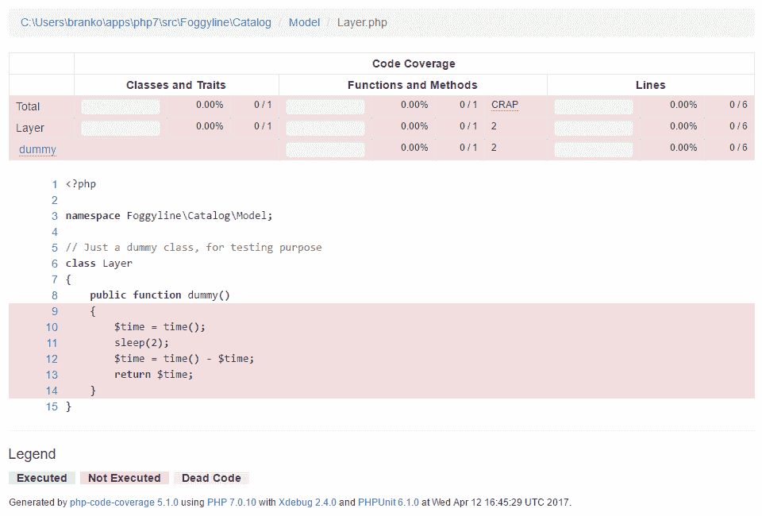

代码覆盖提供了有关我们用测试覆盖的代码量的宝贵的视觉和统计信息。尽管这些信息很容易被误解，但拥有 100%的代码覆盖绝不是我们个别测试质量的衡量标准。编写质量测试需要编写者，也就是开发人员，清楚了解单元测试的确切内容。可以说，我们可以很容易地实现 100%的代码覆盖率，通过 100%的测试，但仍然未能解决某些测试用例或逻辑路径。

# Behat

Behat 是一个基于**行为驱动开发**（**BDD**）概念的开源免费测试框架。包括 Behat 在内的 BDD 框架的巨大好处是，大部分功能文档都被倾入到我们最终测试的实际用户故事中。也就是说，在某种程度上，文档本身就成为了测试。

# 设置 Behat

与 PHPUnit 类似，Behat 可以安装为工具和库。工具版本是`.phar`存档，我们可以从官方 GitHub 存储库下载，而库版本则打包为 Composer 包。

假设我们正在使用 Ubuntu 16.10（Yakkety Yak）安装，通过以下命令安装 Behat 作为工具很容易：

```php
wget https://github.com/Behat/Behat/releases/download/v3.3.0/behat.phar
chmod +x behat.phar
sudo mv behat.phar /usr/local/bin/behat
behat --version 

```

这应该给我们以下输出：


将 Behat 安装为库就像在项目的根目录中运行以下控制台命令一样简单：

```php
composer require behat/behat

```

这应该给我们最终的输出，如下截图所示：

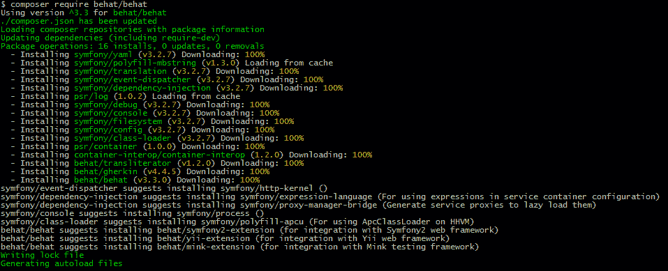

Behat 库现在可以在`vendor/behat`目录下使用，其控制台工具可执行文件在`vendor/bin/behat`文件下。

# 设置一个示例应用程序

Behat 测试的示例应用程序与我们用于 PHPUnit 测试的相同。我们只需通过添加一个额外的类来扩展它。鉴于我们的 PHPUnit 示例应用程序中没有任何真正的“行为”，我们的扩展将包括一个虚拟的购物车功能。

因此，我们将添加`src\Foggyline\Checkout\Model\Cart.php`文件，其内容如下：

```php
<?php declare(strict_types=1);   namespace Foggyline\Checkout\Model;   class Cart implements \Countable {
  protected $productQtyMapping = [];    public function addProduct(\Foggyline\Catalog\Model\Product $product, int $qty): self
  {
  $this->productQtyMapping[$product->getId()]['product'] = $product;
  $this->productQtyMapping[$product->getId()]['qty'] = $qty;
  return $this;
 }  public function removeProduct($productId): self
  {
  if (isset($this->productQtyMapping[$productId])) {
  unset($this->productQtyMapping[$productId]);
 }    return $this;
 }    public function getSubtotal()
 {  $subtotal = 0.0;    foreach ($this->productQtyMapping as $mapping) {
  $subtotal += ($mapping['qty'] * $mapping['product']->getPrice());
 }    return $subtotal;
 }    public function getTotal()
 {  $total = 0.0;    foreach ($this->productQtyMapping as $mapping) {
  $total += ($mapping['qty'] * ($mapping['product']->getPrice() + ($mapping['product']->getPrice() * ($mapping['product']->getTaxRate() / 100))));
 }    return $total;
 }    public function count()
 {  return count($this->productQtyMapping);
 } }

```

保留原始的`index.php`文件不变，让我们继续创建`index_2.php`文件，其内容如下：

```php
<?php   $loader = require __DIR__ . '/vendor/autoload.php'; $loader->addPsr4('Foggyline\\', __DIR__ . '/src/Foggyline'); use Foggyline\Catalog\Model\Product; use \Foggyline\Checkout\Model\Cart;   $cart = new Cart(); $cart->addProduct(new Product('RL', 'Red Laptop', 75.00, 25), 1); $cart->addProduct(new Product('YL', 'Yellow Laptop', 100.00, 25), 1); echo $cart->getSubtotal(), PHP_EOL; echo $cart->getTotal(), PHP_EOL;   $cart->removeProduct('YL'); echo $cart->getSubtotal(), PHP_EOL; echo $cart->getTotal(), PHP_EOL;

```

我们实际上不需要这个来进行测试，但这表明了我们的虚拟购物车如何被利用。

# 编写测试

开始编写 Behat 测试需要掌握一些基本概念，例如以下内容：

+   **Gherkin 语言**：这是一个空格、易读的、特定于业务的语言，用于描述行为，具有通过其*Given-When-Then*概念同时用于项目文档和自动化测试的能力。

+   **特性**：这是一个或多个场景的列表，保存在`*.feature`文件下。默认情况下，Behat 特性应存储在与我们的项目相关的`features/`目录中。

+   **场景**：这些是核心的 Gherkin 结构，由一个或多个步骤组成。

+   **步骤**：这些也被称为*Givens*、*Whens*和*Thens*。对于 Behat 来说，它们应该是不可区分的，但对于开发人员来说，它们应该是为了特定目的而精心选择的。*Given*步骤将系统置于已知状态，然后进行任何用户交互。*When*步骤描述用户执行的关键操作。*Then*步骤观察结果。

有了这些想法，让我们继续编写并启动我们的 Behat 测试。

`vendor\phpunit\phpunit\src\Framework\Assert\Functions.php`文件包含了大量的`asert*`函数声明，比如`assertEquals()`，`assertContains()`，`assertLessThan()`等，总共超过 90 个不同的断言函数。

在我们项目目录的根目录下，如果我们运行`behat --init`控制台命令，它将生成一个`features/`目录，并在其中生成一个`features/bootstrap/FeatureContext.php`文件，内容如下：

```php
<?php   use Behat\Behat\Context\Context; use Behat\Gherkin\Node\PyStringNode; use Behat\Gherkin\Node\TableNode; /**
 * Defines application features from the specific context. */ class FeatureContext implements Context {
  /**
 * Initializes context. * * Every scenario gets its own context instance. * You can also pass arbitrary arguments to the * context constructor through behat.yml. */  public function __construct()
 { } } 

```

新创建的`features/`目录是我们编写测试的地方。暂时忽略新生成的`FeatureContext`，让我们继续创建我们的第一个`.feature`。正如我们之前提到的，Behat 测试是用一种特殊格式称为**Gherkin**编写的。让我们继续编写我们的`features/checkout-cart.feature`文件如下：

```php
Feature: Checkout cart
  In order to buy products
  As a customer
  I need to be able to put products into a cart

  Rules:
  - Each product TAX rate is 25%
  - Delivery for basket under $100 is $10
  - Delivery for basket over $100 is $5

Scenario: Buying a single product under $100
Given there is a "Red Laptop", which costs $75.00 and has a tax rate of 25
When I add the "Red Laptop" to the cart
Then I should have 1 product in the cart
And the overall subtotal cart price should be $75.00
And the delivery cost should be $10.00
And the overall total cart price should be $103.75

Scenario: Buying two products over $100
Given there is a "Red Laptop", which costs $75.00 and has a tax rate of 25
And there is a "Yellow Laptop", which costs $100.00 and has a tax rate of 25
When I add the "Red Laptop" to the cart
And I add the "Yellow Laptop" to the cart
Then I should have 2 product in the cart
And the overall subtotal cart price should be $175.00
And the delivery cost should be $5.00
And the overall total cart price should be $223.75

```

我们可以看到`Given`，`When`和`Then`关键字被使用。然而，也有几个`And`的出现。当有几个`Given`，`When`和`Then`步骤时，我们可以自由使用额外的关键字，比如`And`或`But`来标记一个步骤，从而使我们的场景更流畅地阅读。Behat 不区分这些关键字；它们只是为了开发者进行区分和体验。

现在，我们可以更新我们的`FeatureContext`类与来自`checkout-cart.feature`的测试，也就是步骤。只需要运行以下命令，Behat 工具就会为我们完成这个过程：

```php
behat --dry-run --append-snippets

```

这应该给我们以下输出：


执行此命令后，Behat 会自动将所有缺失的步骤方法附加到我们的`FeatureContext`类中，现在看起来像以下代码块：

```php
<?php   use Behat\Behat\Tester\Exception\PendingException; use Behat\Behat\Context\Context; use Behat\Gherkin\Node\PyStringNode; use Behat\Gherkin\Node\TableNode;   /**
 * Defines application features from the specific context. */ class FeatureContext implements Context {
  /**
 * Initializes context. * * Every scenario gets its own context instance. * You can also pass arbitrary arguments to the * context constructor through behat.yml. */  public function __construct()
 { }    /**
 * @Given there is a :arg1, which costs $:arg2 and has a tax rate of :arg3
 */  public function thereIsAWhichCostsAndHasATaxRateOf($arg1, $arg2, $arg3)
 {  throw new PendingException();
 }    /**
 * @When I add the :arg1 to the cart
 */  public function iAddTheToTheCart($arg1)
 {  throw new PendingException();
 }    /**
 * @Then I should have :arg1 product in the cart
 */  public function iShouldHaveProductInTheCart($arg1)
 {  throw new PendingException();
 }    /**
 * @Then the overall subtotal cart price should be $:arg1
 */  public function theOverallSubtotalCartPriceShouldBe($arg1)
 {  throw new PendingException();
 }    /**
 * @Then the delivery cost should be $:arg1
 */  public function theDeliveryCostShouldBe($arg1)
 {  throw new PendingException();
 }    /**
 * @Then the overall total cart price should be $:arg1
 */  public function theOverallTotalCartPriceShouldBe($arg1)
 {  throw new PendingException();
 } } 

```

现在，我们需要进入并编辑这些存根方法，以反映我们正在针对的类的行为。这意味着用适当的逻辑和断言替换所有的`throw new PendingException()`表达式：

```php
<?php $loader = require __DIR__ . '/../../vendor/autoload.php'; $loader->addPsr4('Foggyline\\', __DIR__ . '/../../src/Foggyline');   use Behat\Behat\Tester\Exception\PendingException; use Behat\Behat\Context\Context; use Behat\Gherkin\Node\PyStringNode; use Behat\Gherkin\Node\TableNode;   use Foggyline\Catalog\Model\Product; use \Foggyline\Checkout\Model\Cart; use \PHPUnit\Framework\Assert; /**
 * Defines application features from the specific context. */ class FeatureContext implements Context {
  protected $cart;
  protected $products = [];    /**
 * Initializes context. * * Every scenario gets its own context instance. * You can also pass arbitrary arguments to the * context constructor through behat.yml. */  public function __construct()
 {  $this->cart = new Cart();
 }    /**
 * @Given there is a :arg1, which costs $:arg2 and has a tax rate of :arg3
 */  public function thereIsAWhichCostsAndHasATaxRateOf($arg1, $arg2, $arg3)
 {  $this->products[$arg1] = new Product($arg1, $arg1, $arg2, $arg3);
 }    /**
 * @When I add the :arg1 to the cart
 */  public function iAddTheToTheCart($arg1)
 {  $this->cart->addProduct($this->products[$arg1], 1);
 }  /**
 * @Then I should have :arg1 product in the cart
 */  public function iShouldHaveProductInTheCart($arg1)
 { Assert::assertCount((int)$arg1, $this->cart);
 }    /**
 * @Then the overall subtotal cart price should be $:arg1
 */  public function theOverallSubtotalCartPriceShouldBe($arg1)
 { Assert::assertEquals($arg1, $this->cart->getSubtotal());
 }    /**
 * @Then the delivery cost should be $:arg1
 */  public function theDeliveryCostShouldBe($arg1)
 { Assert::assertEquals($arg1, $this->cart->getDeliveryCost());
 }    /**
 * @Then the overall total cart price should be $:arg1
 */  public function theOverallTotalCartPriceShouldBe($arg1)
 { Assert::assertEquals($arg1, $this->cart->getTotal());
 } } 

```

注意使用 PHPUnit 框架进行断言。使用 Behat 并不意味着我们必须停止使用 PHPUnit 库。不重用 PHPUnit 中可用的大量断言函数将是一种遗憾。将其添加到项目中很容易，如下代码所示：

```php
composer require phpunit/phpunit

```

# 执行测试

一旦我们解决了`features\bootstrap\FeatureContext.php`文件中的所有存根方法，我们只需在项目根目录中运行`behat`命令来执行测试。这应该给我们以下输出：

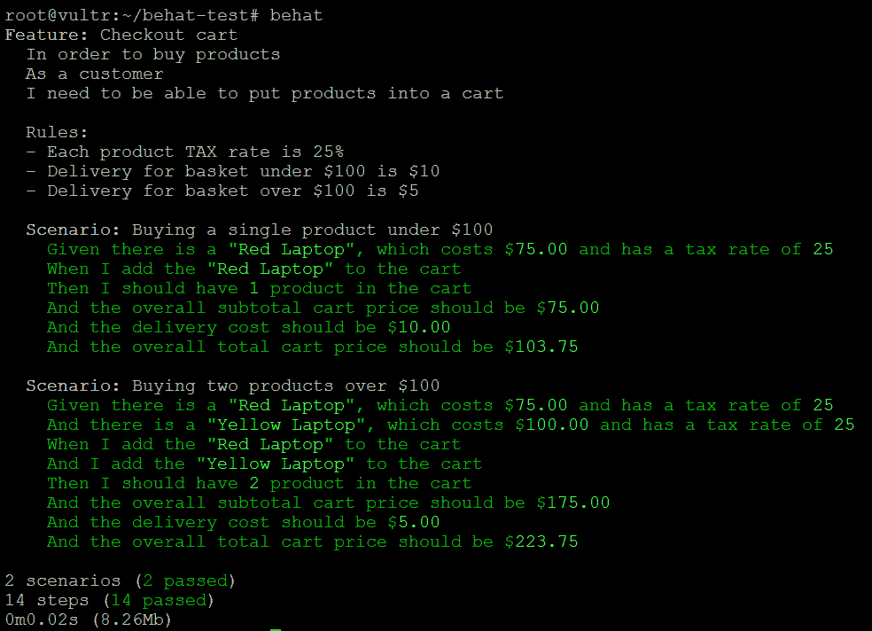

输出表明一共有 2 个场景和 14 个不同的步骤，所有这些步骤都经过确认是有效的。

# phpspec

像 Behat 一样，**phpspec**是一个基于 BDD 概念的开源免费测试框架。然而，它的测试方法与 Behat 大不相同；我们甚至可以说它处于 PHPUnit 和 Behat 之间的某个位置。与 Behat 不同，phpspec 不使用 Gherkin 格式的故事来描述它的测试。这样做，phpspec 将重点放在内部应用行为上，而不是外部行为。与 PHPUnit 类似，phpspec 允许我们实例化对象，调用它的方法，并对结果进行各种断言。它与其他地方的不同之处在于它的“考虑规范”，而不是“考虑测试”的方法。

# 设置 phpspec

与 PHPUnit 和 Behat 一样，phpspec 可以作为一个工具和一个库安装。工具版本是`.phar`存档，我们可以从官方 GitHub 存储库下载它，而库版本则打包为 Composer 包。

假设我们使用的是 Ubuntu 16.10（Yakkety Yak）安装，安装 phpspec 作为一个工具很容易，如下所示的命令：

```php
wget https://github.com/phpspec/phpspec/releases/download/3.2.3/phpspec.phar
chmod +x phpspec.phar
sudo mv phpspec.phar /usr/local/bin/phpspec
phpspec --version

```

这应该给我们以下输出：


将 phpspec 安装为库就像在项目的根目录中运行以下控制台命令一样容易：

```php
composer require phpspec/phpspec

```

这应该给我们最终的输出，看起来像以下的截图：


phpspec 库现在可以在`vendor/phpspec`目录下使用，并且其控制台工具可以在`vendor/bin/phpspec`文件下执行。

# 编写测试

开始编写 phpspec 测试需要掌握一些基本概念，例如：

+   **it_*()和 its_*()方法**：这个对象行为由单个示例组成，每个示例都标有`it_*()`或`its_*()`方法。我们可以在单个规范中定义一个或多个这些方法。每个定义的方法在运行测试时都会触发。

+   **匹配器方法**：这些类似于 PHPUnit 中的断言。它们描述了对象应该如何行为。

+   **对象构造方法**：我们在 phpspec 中描述的每个对象都不是一个单独的变量，而是`$this`。然而，有时获取适当的`$this`变量需要管理构造函数参数。这就是`beConstructedWith()`、`beConstructedThrough()`、`let()`和`letGo()`方法派上用场的地方。

+   **let()方法**：这在每个示例之前运行。

+   **letGo()方法**：这在每个示例之后运行。

匹配器可能是我们接触最多的内容，因此值得知道 phpspec 中有几种不同的匹配器，它们都实现了`src\PhpSpec\Matcher\Matcher.php`文件中声明的`Matcher`接口：

```php
<?php namespace PhpSpec\Matcher; interface Matcher {
  public function supports($name, $subject, array $arguments);
  public function positiveMatch($name, $subject, array $arguments);
  public function negativeMatch($name, $subject, array $arguments);
  public function getPriority(); } 

```

使用`phpspec describe`命令，我们可以为我们即将编写的现有或新的具体类之一创建规范。由于我们已经设置了项目，让我们继续为我们的`Cart`和`Product`类生成规范。

我们将通过在项目的根目录中运行以下两个命令来实现：

```php
phpspec describe Foggyline/Checkout/Model/Cart
phpspec describe Foggyline/Catalog/Model/Product

```

第一条命令生成了`spec/Foggyline/Checkout/Model/CartSpec.php`文件，其初始内容如下：

```php
<?php namespace spec\Foggyline\Checkout\Model; use Foggyline\Checkout\Model\Cart; use PhpSpec\ObjectBehavior; use Prophecy\Argument;   class CartSpec extends ObjectBehavior {
  function it_is_initializable()
 {  $this->shouldHaveType(Cart::class);
 } }

```

第二条命令生成了`spec/Foggyline/Catalog/Model/ProductSpec.php`文件，其初始内容如下：

```php
<?php namespace spec\Foggyline\Catalog\Model;   use Foggyline\Catalog\Model\Product; use PhpSpec\ObjectBehavior; use Prophecy\Argument; class ProductSpec extends ObjectBehavior {
  function it_is_initializable()
 {  $this->shouldHaveType(Product::class);
 } }

```

生成的`CartSpec`和`ProductSpec`类几乎相同。区别在于它们通过`shouldHaveType()`方法调用引用的具体类。接下来，我们将尝试仅为`Cart`和`Product`模型编写一些简单的测试。也就是说，让我们继续修改我们的`CartSpec`和`ProductSpec`类，以反映匹配器的使用：`it_*()`和`its_*()`函数。

我们将使用以下内容修改`spec\Foggyline\Checkout\Model\CartSpec.php`文件：

```php
<?php   namespace spec\Foggyline\Checkout\Model;   use Foggyline\Checkout\Model\Cart; use PhpSpec\ObjectBehavior; use Prophecy\Argument; use Foggyline\Catalog\Model\Product;   class CartSpec extends ObjectBehavior {
  function it_is_initializable()
 {  $this->shouldHaveType(Cart::class);
 }    function it_adds_single_product_to_cart()
 {  $this->addProduct(
  new Product('YL', 'Yellow Laptop', 1499.99, 25),
  2
  );    $this->count()->shouldBeLike(1);
 }    function it_adds_two_products_to_cart()
 {  $this->addProduct(
  new Product('YL', 'Yellow Laptop', 1499.99, 25),
  2
  );

  $this->addProduct(
  new Product('RL', 'Red Laptop', 2499.99, 25),
  2
  );

  $this->count()->shouldBeLike(2);
 } } 

```

我们将修改`spec\Foggyline\Catalog\Model\ProductSpec.php`文件，内容如下：

```php
<?php   namespace spec\Foggyline\Catalog\Model;   use Foggyline\Catalog\Model\Product; use PhpSpec\ObjectBehavior; use Prophecy\Argument;   class ProductSpec extends ObjectBehavior {
  function it_is_initializable()
 {  $this->shouldHaveType(Product::class);
 }  function let()
 {  $this->beConstructedWith(
  'YL', 'Yellow Laptop', 1499.99, 25
  );
 }    function its_price_should_be_like()
 {  $this->getPrice()->shouldBeLike(1499.99);
 }    function its_title_should_be_like()
 {  $this->getTitle()->shouldBeLike('Yellow Laptop');
 } } 

```

在这里，我们正在使用`let()`方法，因为它会在任何`it_*()`或`its_*()`方法执行之前触发。在`let()`方法中，我们使用通常传递给`new Product(...)`表达式的参数调用`beConstructedWith()`。这样就构建了我们的产品实例，并允许所有`it_*()`或`its_*()`方法成功执行。

查看[`www.phpspec.net/en/stable/manual/introduction.html`](http://www.phpspec.net/en/stable/manual/introduction.html)以获取有关高级 phpspec 概念的更多信息。

# 执行测试

此时仅运行`phpspec run`命令可能会失败，并显示类...不存在的消息，因为 phpspec 默认假定存在 PSR-0 映射。为了能够使用到目前为止我们所做的应用程序，我们需要告诉 phpspec 包括我们的`src/Foggyline/*`类。我们可以通过`phpspec.yml`配置文件或使用`--bootstrap`选项来实现。由于我们已经创建了`autoload.php`文件，让我们继续通过引导该文件来运行 phpspec：

```php
phpspec run --bootstrap=autoload.php

```

这将生成以下输出：


我们已经使用`phpspec describe`命令涉及了这两个规范现有的类。我们可以轻松地将不存在的类名传递给相同的命令，如下例所示：

```php
phpspec describe Foggyline/Checkout/Model/Guest/Cart

```

`Guest\Cart`类实际上并不存在于我们的`src/`目录中。phpspec 创建`spec/Foggyline/Checkout/Model/Guest/CartSpec.php`规范文件时没有问题，就像它为`Cart`和`Product`做的那样。然而，现在运行 phpspec 描述会引发一个类...不存在的错误消息，以及交互式生成器，如下输出所示：


因此，`src\Foggyline\Checkout\Model\Guest\Cart.php`文件还会生成，内容如下：

```php
<?php   namespace Foggyline\Checkout\Model\Guest; class Cart { } 

```

虽然这些都是简单的例子，但它表明 phpspec 可以双向工作：

+   根据现有具体类创建规范

+   根据规范生成具体类

现在运行我们的测试应该给我们以下输出：


现在，让我们故意通过将`spec\Foggyline\Catalog\Model\ProductSpec.php`的`its_title_should_be_like()`方法更改为以下代码来失败一个测试：

```php
$this->getTitle()->shouldBeLike('Yellow');

```

现在运行测试应该给我们以下输出：


关于 phpspec 还有很多要说的。像存根、模拟、间谍、模板和扩展等东西进一步丰富了我们的 phpspec 测试体验。然而，本节重点介绍了基础知识，以便让我们开始。

# jMeter

Apache jMeter 是一个用于负载和性能测试的免费开源应用程序。jMeter 的功能跨越了许多不同的应用程序、服务器和协议类型。在 Web 应用程序的上下文中，我们可能会倾向于将其与浏览器进行比较。然而，jMeter 在协议级别上使用 HTTP 和 https。它不渲染 HTML 或执行 JavaScript。虽然 jMeter 主要是一个 GUI 应用程序，但它可以轻松安装并在控制台模式下运行其测试。这使得它成为一个方便的选择工具，可以在 GUI 模式下快速构建我们的测试，然后稍后在服务器控制台上运行它们。

假设我们使用 Ubuntu 16.10（Yakkety Yak）安装，安装 jMeter 作为工具很容易，如下命令行所示：

```php
sudo apt-get -y install jmeter

```

然而，这可能不会给我们 jMeter 的最新版本，如果是这种情况，我们可以从官方 jMeter 下载页面([`jmeter.apache.org/download_jmeter.cgi`](http://jmeter.apache.org/download_jmeter.cgi))获取一个版本：

```php
wget http://ftp.carnet.hr/misc/apache//jmeter/binaries/apache-jmeter-3.2.tgz
tar -xf apache-jmeter-3.2.tgz

```

使用这种第二种安装方法，我们将在`apache-jmeter-3.2/bin/jmeter`找到 jMeter 可执行文件。

# 编写测试

在本章中，我们使用了一个简单的项目，在`src/Foggyline`目录中有几个类，以演示如何使用 PHPUnit、Behat 和 phpspec 进行测试。然而，这些测试无法完全满足这种类型的测试需求。由于我们没有任何 HTML 页面在浏览器中展示，我们使用 jMeter 的重点是启动一个简单的内置 Web 测试计划，以了解其组件以及如何稍后运行它。

为 Web 应用程序编写 jMeter 测试需要对几个关键概念有基本的理解，这些概念如下：

+   **线程组**：这定义了一组用户，他们针对我们的 Web 服务器执行特定的测试用例。GUI 允许我们控制几个线程组选项，如下截图所示：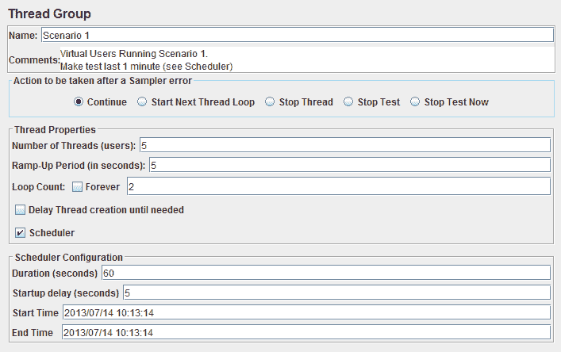

+   **HTTP 请求默认值**：这设置了我们的 HTTP 请求控制器使用的默认值。GUI 允许我们控制几个 HTTP 请求默认选项，如下截图所示：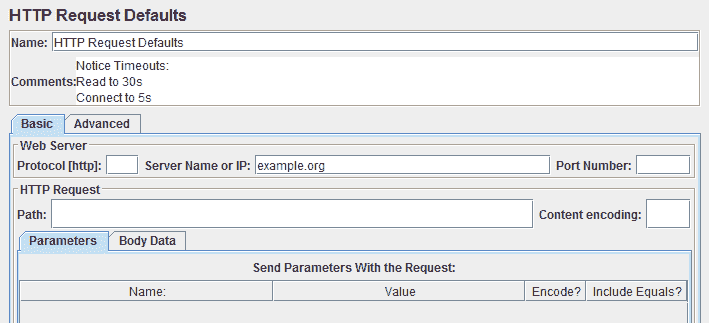

+   **HTTP 请求**：这将 HTTP/HTTPS 请求发送到 Web 服务器。GUI 允许我们控制几个 HTTP 请求选项，如下截图所示：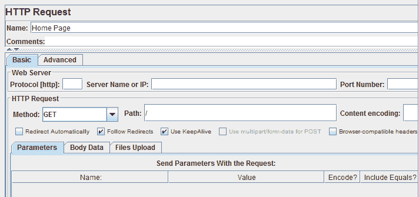

+   **HTTP Cookie 管理器**：这将存储和发送 cookie，就像 Web 浏览器一样。GUI 允许我们控制几个 HTTP Cookie 管理器选项，如下面的屏幕截图所示：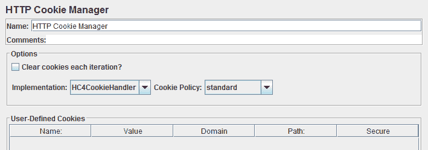

+   **HTTP 头管理器**：这将添加或覆盖 HTTP 请求头。GUI 允许我们控制几个 HTTP 头管理器选项，如下面的屏幕截图所示：

+   **图形结果**：这将生成一个图表，显示出所有样本时间。GUI 允许我们控制几个图形结果选项，如下面的屏幕截图所示：

在生产负载测试期间，我们不应该使用图形结果监听器组件，因为它会消耗大量内存和 CPU 资源。

jMeter 的一个很棒的地方是它已经提供了几种不同的测试计划模板。我们可以通过以下步骤轻松生成 Web 测试计划：

1.  单击主应用程序菜单下的“文件” | “模板...”菜单，如下所示：

这将触发“模板选择”屏幕：

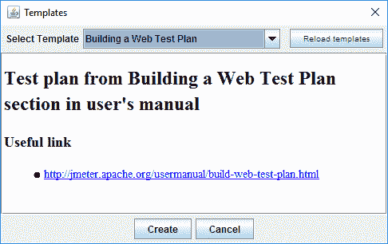

1.  单击“创建”按钮应该启动一个新的测试计划，如下面的屏幕截图所示：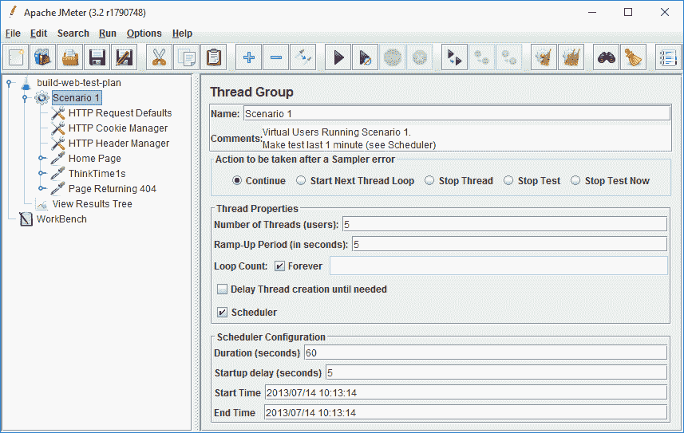

虽然测试本身已经很好了，但在运行之前让我们继续做一些修改：

1.  右键单击“查看结果树”，然后单击“删除”。

1.  右键单击“build-web-test-plan”，然后选择“添加” | “监听器” | “图形结果”，然后将“文件名”设置为`jmeter-result-tests.csv`，如下所示：

1.  单击“场景 1”，然后将“循环计数”编辑为值`2`：

1.  在进行这些修改后，让我们单击主菜单下的“文件” | “保存”，并将我们的测试命名为`web-test-plan.jmx`。

我们的测试现在已经准备就绪。虽然这个测试本身不会在这种情况下对我们自己的服务器进行负载测试，而是[example.org](http://example.org)，但这个练习的价值在于理解如何通过 GUI 工具构建测试，通过控制台运行测试，并生成测试结果日志以供以后检查。

# 执行测试

通过控制台运行 jMeter 测试非常容易，如下命令所示：

```php
jmeter -n -t web-test-plan.jmx

```

`-n`参数，也适用于`--nongui`，表示在 nongui 模式下运行 JMeter。而`-t`参数，也适用于`--testfile`，表示要运行的 jmeter 测试(.jmx)文件。

生成的输出应该如下屏幕截图所示：


快速查看`jmeter-result-tests.csv`文件，可以看到捕获的结构和数据：


虽然这里演示的示例依赖于带有一些小修改的默认测试计划，但 Apache jMeter 的整体能力可以通过多种因素丰富整个测试体验。

# 摘要

在本章中，我们非常简要地涉及了一些最流行的 PHP 应用程序测试类型。测试驱动开发（TDD）和行为驱动开发包括其中非常重要的部分。幸运的是，PHP 生态系统提供了两个优秀的框架，PHPUnit 和 Behat，使这些类型的测试变得容易处理。尽管在根本上不同，PHPUnit 和 Behat 在某种意义上互补，它们确保我们的应用程序在从最小的功能单元到整体功能的逻辑结果方面都经过了测试。另一方面，phpspec 似乎处于这两者之间，试图以自己的统一方式解决这两个挑战。我们还简要介绍了 Apache jMeter，看到了使用简单的 Web 测试计划启动性能测试有多么容易。这使我们能够迈出重要的一步，并确认我们的应用程序不仅能够正常工作，而且能够快速到达用户的期望。

接下来，我们将更仔细地研究调试、跟踪和分析 PHP 应用程序。
