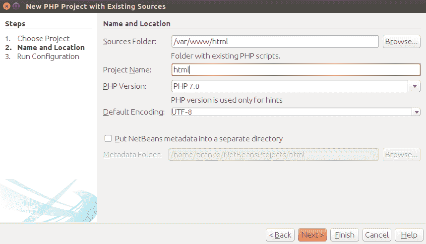
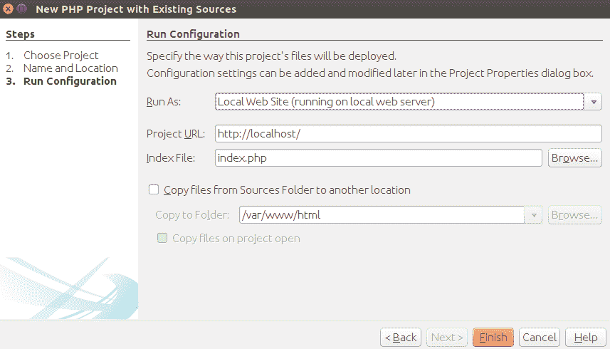
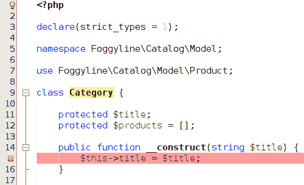
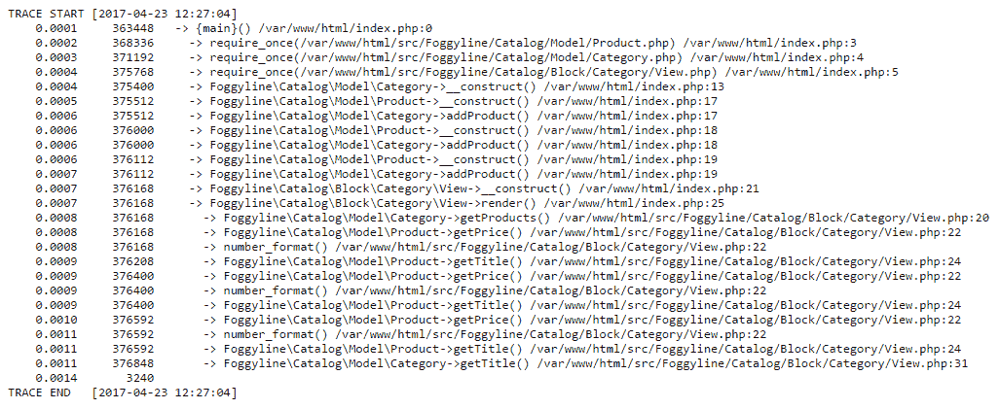
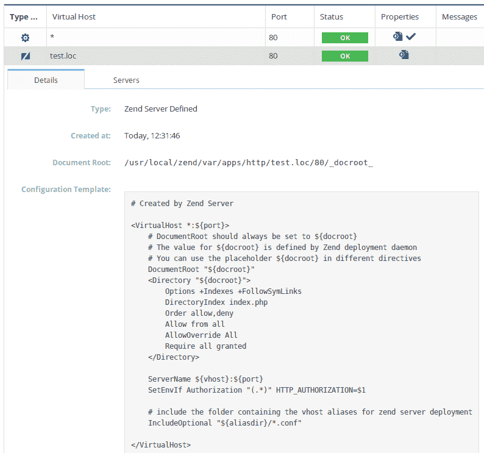
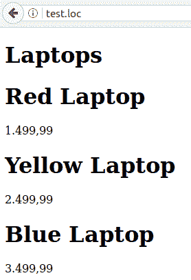
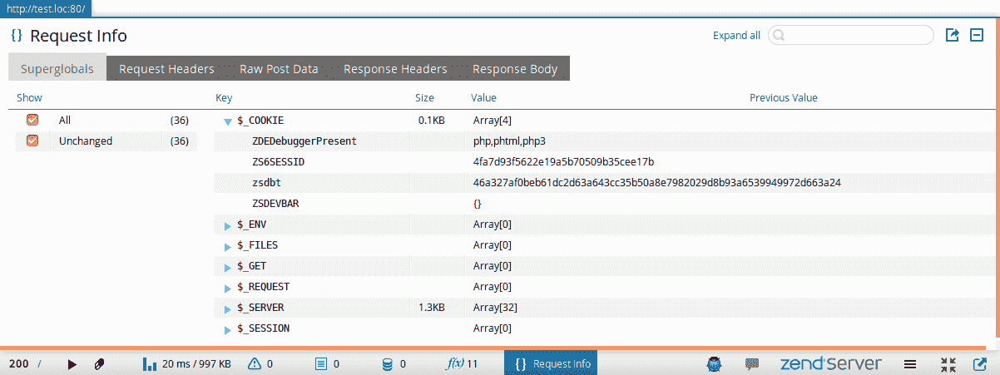

# 第十六章：调试、跟踪和分析

诸如 PHPUnit 和 Behat 之类的工具采用自动化方法来测试软件。它们给了我们很大的保证，即我们的应用程序将按照测试结果交付。然而，测试本身，就像代码本身一样，也会存在缺陷。无论是错误的测试代码还是不完整的测试用例，为某些东西编写完整的测试并不一定意味着我们的代码在没有错误和性能优化的情况下是完美的。

往往在开发周期中会出现意想不到的错误和性能问题，只有偶尔在生产阶段才会重新出现。虽然完美的代码是一个遥不可及的概念，或者至少是一个有争议的话题，但我们确实可以做更多来提高软件的质量。为了完成软件测试的画布，需要在运行时对应用程序进行更系统的过程和深入的洞察。

这就是调试开始的地方。这个术语在开发人员中非常常见，通常指的是以下三个独特的过程：

+   调试：这是检测和修复应用程序错误的过程

+   跟踪：这是记录应用程序的时间顺序相关信息的过程

+   分析：这是记录应用程序性能相关信息的过程

虽然跟踪和分析过程在每次运行应用程序时会自动记录相关信息，但调试过程更多是手动进行的。

在本章中，我们将更仔细地看看处理调试、跟踪和分析功能的两个 PHP 扩展：

+   Xdebug

+   安装

+   调试

+   跟踪

+   分析

+   Zend Z-Ray

+   安装 Zend Server

+   设置虚拟主机

+   使用 Z-Ray

# Xdebug

Xdebug 是一个 PHP 扩展，提供了调试、跟踪和分析的功能。调试器组件使用 DBGp 调试协议来建立 PHP 脚本引擎和调试器 IDE 之间的通信。有几个 IDE 和文本编辑器支持 DBGp 调试协议；以下仅是一些较受欢迎的选择：

+   NetBeans：这是一个免费的跨平台 IDE，可以在[`netbeans.org/`](https://netbeans.org/)上找到

+   Eclipse PDT：这是一个免费的跨平台 IDE，可以在[`eclipse.org/pdt/`](https://eclipse.org/pdt/)上找到

+   PhpStorm：这是一个商业跨平台的 IDE，可以在[`www.jetbrains.com/phpstorm/`](https://www.jetbrains.com/phpstorm/)上找到

+   Zend Studio：这是一个商业跨平台的 IDE，可以在[`www.zend.com/en/products/studio`](http://www.zend.com/en/products/studio)上找到

+   Sublime Text 3：这是一个商业跨平台文本编辑器，可以在[`www.sublimetext.com/3`](https://www.sublimetext.com/3)上找到

+   Notepad++：这是一个免费的 Windows 平台文本编辑器，可以在[`notepad-plus-plus.org/`](https://notepad-plus-plus.org/)上找到

+   Vim：这是一个免费的跨平台文本编辑器，可以在[`www.vim.org/`](http://www.vim.org/)上找到

虽然 DBGp 调试协议支持可能看起来足够作为调试器选择因素，但真正区分这些 IDE 和文本编辑器的是它们对最新版本 PHP 的支持程度。

凭借其尖端的 PHP 支持和创新解决方案，PhpStorm 很可能是专业 PHP 开发人员中最受欢迎的商业选择。考虑到熟练的 PHP 开发人员的平均小时费率，工具的成本似乎并不昂贵，因为它拥有丰富的功能，可以加快开发工作。

为了更好地了解 Xdebug 的功能，让我们继续执行以下步骤：

1.  安装 LAMP 堆栈。

1.  安装 Xdebug 扩展。

1.  安装 NetBeans。

1.  拉取示例 PHP 应用程序作为我们调试的游乐场。

1.  配置调试。

1.  配置跟踪。

1.  配置分析。

# 安装

假设我们有一个全新的 Ubuntu 17.04（Zesty Zapus）安装，通过以下命令安装完整的 LAMP 堆栈和 Xdebug 扩展非常容易：

```php
apt-get update
apt-get -y install lamp-server^
apt-get -y install php-xdebug
sudo service apache2 restart

```

完成此过程后，打开浏览器中的[`localhost/index.html`](http://localhost/index.html)应该会给我们一个默认的 Apache 页面。现在，让我们继续进行一些权限更改：

```php
sudo adduser user_name www-data
sudo chown -R www-data:www-data /var/www
sudo chmod -R g+rwX /var/www

```

请确保将`user_name`替换为系统上实际用户的名称。

进行此权限更新的原因是为了使用户的 NetBeans IDE 能够访问`/var/www/html/`目录，这是我们项目将位于的地方。执行这些命令后，我们需要注销并重新登录，或者重新启动计算机以使权限生效。

现在我们可以在控制台上执行以下命令，然后打开`http://localhost/index.php`以确认 PHP 和 Xdebug 是否正常运行：

```php
rm /var/www/html/index.html
echo "<?php phpinfo(); ?>" > /var/www/html/index.php

```

这应该给我们一个输出，指示 Xdebug 扩展的存在，就像以下屏幕截图一样：


到目前为止，我们只是安装了扩展，但实际上还没有启用其三个核心功能：调试、跟踪和分析。在进行调试之前，让我们快速安装 NetBeans IDE。这将使我们的调试工作更加容易。我们首先需要从[`netbeans.org/downloads/`](https://netbeans.org/downloads/)下载 PHP 的 NetBeans。下载并解压后，我们可以执行以下命令：

```php
chmod +x netbeans-8.2-php-linux-x64.sh
./netbeans-8.2-php-linux-x64.sh

```

值得注意的是，在这里使用 NetBeans IDE 是完全可选的。我们完全可以使用其他免费或商业解决方案。现在是打开 NetBeans IDE 的好时机；单击文件|新建项目|类别[PHP]|项目[具有现有源的 PHP 应用程序]，并将其指向我们的`/var/www/html/`目录，如下面的屏幕截图所示：



在“名称和位置”屏幕上填写所需数据后，单击“下一步”将我们带到“运行配置”设置：



单击“完成”按钮完成项目设置，现在我们应该能够看到我们的`index.php`文件：


最后，让我们执行以下控制台命令来引入我们的示例应用程序：

```php
rm /var/www/html/index.php
cd /var/www/html/
git init
git remote add origin git@github.com:ajzele/MPHP7-CH16.git
git pull origin master

```

NetBeans IDE 应该能够立即在其项目选项卡中捕捉到这些更改。到目前为止，我们实际上还没有进行任何与 Xdebug 的调试、跟踪或分析组件相关的配置或设置。我们只是安装了 LAMP 堆栈、Xdebug 本身、NetBeans IDE 并引入了示例应用程序。现在，让我们继续研究 Xdebug 的调试组件。

# 调试

Xdebug 的调试功能可以通过`xdebug.remote_enable=1`选项轻松启用。对于现代 PHP，通常会有一个特殊的`xdebug.ini`配置文件；否则，我们将编辑默认的`php.ini`文件。在我们的 Ubuntu 安装中，我们将其添加到`/etc/php/7.0/apache2/conf.d/20-xdebug.ini`文件中，如下所示：

```php
zend_extension=xdebug.so
xdebug.remote_enable=1

```

文件修改后，我们需要确保 Apache 服务器已重新启动：

```php
 service apache2 restart 

```

虽然`xdebug.remote_enable`是打开调试功能的必选项，但其他相关选项包括以下内容：

+   `xdebug.extended_info`

+   `xdebug.idekey`

+   `xdebug.remote_addr_header`

+   `xdebug.remote_autostart`

+   `xdebug.remote_connect_back`

+   `xdebug.remote_cookie_expire_time`

+   `xdebug.remote_enable`

+   `xdebug.remote_handler`

+   `xdebug.remote_host`

+   `xdebug.remote_log`

+   `xdebug.remote_mode`

+   `xdebug.remote_port`

有关各个调试器配置选项的补充信息可以在[`xdebug.org/docs/all_settings`](https://xdebug.org/docs/all_settings)下找到。

回到 NetBeans，我们可以把注意力转向调试工具栏：


当我们点击“调试项目”按钮时，NetBeans 会启动一个带有 URL `http://localhost/index.php?XDEBUG_SESSION_START=netbeans-xdebug` 的浏览器，并激活之前禁用的按钮。

“调试”工具栏上的按钮为我们提供了几个调试选项：

+   步入：这告诉调试器进入下一个函数调用并在那里中断。

+   步过：这告诉调试器执行下一个函数并在之后中断。

+   步出：这告诉调试器完成当前函数并在之后中断。

+   运行到光标：这有一点双重作用。当与启用的断点结合使用时，它会直接从一个断点跳转到另一个断点。当断点被禁用时，它会直接跳转到我们放置光标的行。因此，在调试过程开始后，我们可以自由地决定下一个断点的位置，只需将光标放在需要的地方。

“运行到光标”选项似乎是一个明智而直接的第一步。让我们继续并按照以下方式在我们的示例应用程序中设置几个断点：

+   `index.php`：这是六个断点的总数：


+   `src/Foggyline/Catalog/Model/Category.php`：这是一个断点的总数：



+   `src/Foggyline/Catalog/Block/Category/View.php`：这是一个断点的总数：


以下步骤概述了仅使用“运行到光标”按钮进行调试的过程：

1.  点击“调试项目”。这会跳转到`index.php`的第 3 行，并记录以下内容：


1.  点击“运行到光标”。这会跳转到`index.php`的第 11 行，并记录以下内容：


请注意，断点选项卡现在在`index.php:11`旁边显示了一个绿色箭头。

1.  点击“运行到光标”。这会跳转到`src/Foggyline/Catalog/Model/Category.php`的第 15 行，并记录以下内容：


1.  点击“运行到光标”。这会跳转到`index.php`文件的第 15 行，并记录以下内容：


1.  点击“运行到光标”。这会跳转到`index.php`文件的第 18 行，并记录以下内容：


1.  点击“运行到光标”。这会跳转到`index.php`文件的第 23 行，并记录以下内容：


1.  点击“运行到光标”。这会跳转到`index.php`文件的第 25 行，并记录以下内容：


1.  点击“运行到光标”。这会跳转到`src/Foggyline/Catalog/Block/Category/View.php`文件的第 22 行，并记录以下内容：


1.  点击“运行到光标”。这会跳转到`src/Foggyline/Catalog/Block/Category/View.php`文件的第 22 行，并记录以下内容：


1.  点击“运行到光标”。这会跳转到`src/Foggyline/Catalog/Block/Category/View.php`文件的第 22 行，并记录以下内容：


1.  点击“运行到光标”。这会跳转到`index.php`文件的第 27 行，并记录以下内容：


1.  点击“运行到光标”。这会在到达最后一个调试点时跳转到`index.php`文件的第 27 行，并记录以下内容：


现在我们可以点击“完成调试器会话”按钮。

在这个十二步过程中，我们可以清楚地观察到 IDE 的行为以及它成功记录的值。这使得我们可以轻松地针对代码的特定部分进行调试，并观察变量在调试过程中的变化。

请注意，在步骤 10 和 11 之间，我们从未看到变量标签记录第三个产品的值。这是因为变量在我们通过给定的调试断点之后记录，而在这种情况下，它将上下文从`View.php`类文件转移到`index.php`文件。这就是点击“步入”按钮可能会有用的地方，因为它可以使我们在第三个循环的执行期间在`while`的代码内部进一步深入，从而为第三个产品产生值。

我们应该鼓励混合使用所有调试选项，以便正确地达到并读取感兴趣的变量。

# 跟踪

Xdebug 的跟踪功能可以通过`xdebug.auto_trace=1`选项轻松启用。在我们的 Ubuntu 安装中，我们将其添加到`/etc/php/7.0/apache2/conf.d/20-xdebug.ini`文件中如下：

```php
zend_extension=xdebug.so
xdebug.remote_enable=1
xdebug.auto_trace=1

```

修改文件后，我们需要确保重新启动 Apache 服务器：

```php
 service apache2 restart 

```

`xdebug.auto_trace`是打开跟踪功能所需的选项，其他相关选项包括以下内容：

+   `xdebug.collect_assignments`

+   `xdebug.collect_includes`

+   `xdebug.collect_params`

+   `xdebug.collect_return`

+   `xdebug.show_mem_delta`

+   `xdebug.trace_enable_trigger`

+   `xdebug.trace_enable_trigger_value`

+   `xdebug.trace_format`

+   `xdebug.trace_options`

+   `xdebug.trace_output_dir`

+   `xdebug.trace_output_name`

+   `xdebug.var_display_max_children`

+   `xdebug.var_display_max_data`

+   `xdebug.var_display_max_depth`

有关个别*跟踪*配置选项的补充信息可以在[`xdebug.org/docs/execution_trace`](https://xdebug.org/docs/execution_trace)找到。

与我们从 IDE 或文本编辑器控制的调试功能不同，我们无法控制*跟踪*。默认情况下，每次运行应用程序时，*跟踪*功能会在`/tmp`目录下创建一个不同的`trace.%c`文件。在 Web 应用程序的上下文中，这意味着每次在浏览器中刷新页面时，跟踪功能都会为我们创建一个`trace.%c`文件。

我们特定的示例应用程序一旦执行，就会产生一个跟踪文件，就像以下截图一样：



输出本身对于开发人员来说相对容易阅读和理解。当涉及到大型应用程序时，这可能会有些笨重，因为我们最终会得到一个大型的跟踪文件。但是，了解我们正在定位的代码部分，我们可以搜索文件并找到所需的代码出现。假设我们正在寻找代码中`number_format()`函数的使用。快速搜索`number_format`会指向`Category/View.php`的第 22 行，并附有执行时间。这对于整体调试工作是有价值的信息。

# 分析

Xdebug 的分析功能可以通过`xdebug.profiler_enable=1`选项轻松启用。在我们的 Ubuntu 安装中，我们将修改`/etc/php/7.0/apache2/conf.d/20-xdebug.ini`文件如下：

```php
zend_extension=xdebug.so
xdebug.remote_enable=1
xdebug.auto_trace=1
xdebug.profiler_enable=1

```

修改文件后，我们需要确保重新启动 Apache 服务器：

```php
 service apache2 restart 

```

`xdebug.profiler_enable`是打开分析功能所需的选项，其他相关选项包括以下内容：

+   `xdebug.profiler_aggregate`

+   `xdebug.profiler_append`

+   `xdebug.profiler_enable`

+   `xdebug.profiler_enable_trigger`

+   `xdebug.profiler_enable_trigger_value`

+   `xdebug.profiler_output_dir`

+   `xdebug.profiler_output_name`

有关个别分析器配置选项的补充信息可以在[`xdebug.org/docs/profiler`](https://xdebug.org/docs/profiler)找到。

与跟踪类似，我们无法从 IDE 或文本编辑器控制分析功能。默认情况下，每次执行应用程序时，分析功能会在`/tmp`目录下创建一个不同的`cachegrind.out.%p`文件。

我们特定的示例应用程序一旦执行，就会产生一个 cachegrind 文件，就像以下截图（部分输出）一样：

！[](assets/7994b47d-b7f8-41c6-aefa-dfff1832babd.png)

这里包含的信息远不如跟踪文件的可读性高，这没关系，因为两者针对不同类型的信息。cachegrind 文件可以被拉入到诸如 KCachegrind 或 QCacheGrind 之类的应用程序中，然后给我们提供了更加用户友好和可视化的捕获信息的表示：

！[](assets/b35fbde8-3648-4354-8feb-9a0519cc15f0.png)

cachegrind 文件输出提供了重要的与性能相关的信息。我们可以了解应用程序中使用的所有函数，按照在单个函数及其所有子函数中花费的时间进行排序。这使我们能够发现性能瓶颈，即使在毫秒级的时间范围内也是如此。

# Zend Z-Ray

*Rougue Wave Software*公司提供了一个名为 Zend Server 的商业 PHP 服务器。Zend Server 的一个突出特点是其**Z-Ray**扩展。Z-Ray 似乎类似于 Xdebug 的跟踪和分析功能，提供了全面的信息捕获和改进的用户体验。捕获的信息范围从执行时间、错误和警告、数据库查询和函数调用到请求信息。这些信息以一种类似于内置浏览器开发工具的形式提供，使开发人员能够在几秒钟内轻松地检索到关键的分析信息。

Z-Ray 扩展本身是免费的，可以独立于商业可用的 Zend Server 使用。我们可以像安装任何其他 PHP 扩展一样安装它。尽管在撰写本文时，独立的 Z-Ray 扩展仅适用于现在被认为过时的 PHP 5.5 和 5.6 版本。

# 安装 Zend Server

鉴于本书的目标是 PHP 7，我们将获取 Zend Server 的免费试用版本并安装。我们可以通过打开官方 Zend 页面并单击“下载免费试用”按钮来实现这一点：

！[](assets/78bc0714-fda2-4cc6-bc27-514b6edba1d2.png)

假设我们正在使用新的 Ubuntu 17.04 安装，Zend 的下载服务可能会为我们提供一个`tar.gz`存档下载：

！[](assets/5c77d43c-a0c3-46bb-9150-4ff70f482ff0.png)

下载并解压后，我们需要使用以下 PHP 版本参数触发`install_zs.sh`命令：

！[](assets/4a9e93ce-7098-4a5c-b9e5-91b87ae43cbf.png)

安装完成后，控制台会给出有关如何通过浏览器访问服务器管理界面的信息：

！[](assets/dbcbf25d-9fa9-4e37-9207-a732b8fe0d7e.png)

打开`https://localhost:10082/ZendServer`会触发启动 Zend Server 流程的许可协议步骤：

！[](assets/1b684742-0689-434e-ba02-6a91dece3d1c.png)

同意许可协议并单击“下一步”按钮将我们带到启动 Zend Server 流程的配置步骤：

！[](assets/b804dd91-9008-40be-8ae6-ad417d406653.png)

配置步骤提供了三个不同的选项：开发、生产（单服务器）和生产（创建或加入集群）。选择开发选项后，单击“下一步”按钮，将我们带到启动 Zend Server 流程的用户密码步骤：

！[](assets/711c548b-e761-4401-b191-bb96eae458c5.png)

在这里，我们提供管理员和开发者的用户密码。单击“下一步”按钮将我们带到启动 Zend Server 流程的摘要步骤：

！[](assets/454c67c5-5225-4b7e-97e0-e92390885e4e.png)

摘要步骤仅确认我们之前的选择和输入。单击“启动”按钮，我们完成了启动 Zend Server 流程，并进入了入门页面：

！[](assets/a6d9c047-c008-488c-a5b2-0293ad0df0b4.png)

Zend Server 提供了一个丰富的界面，用于管理运行服务器的几乎每个方面。从这里，我们可以管理虚拟主机、应用程序、作业队列、缓存、安全性和其他方面。在我们专注于 Z-Ray 功能之前，我们需要设置我们的测试应用程序。我们将使用与 Xdebug 相同的应用程序，映射到 `test.loc` 域上。

# 设置虚拟主机

我们首先通过在 `/etc/hosts` 文件中添加 `127.0.0.1 test.loc` 行来修改它。

现在将 `test.loc` 主机添加到 hosts 文件后，我们回到 Zend Server，并在应用程序 | 虚拟主机屏幕下点击“添加虚拟主机”按钮。这将带我们进入“添加虚拟主机”过程的“属性”步骤：


在“虚拟主机名称”中输入 `test.loc`，在“端口”中输入 `80`。点击“下一步”按钮将带我们进入“添加虚拟主机”过程的“SSL 配置”步骤：


为了简化操作，让我们只保留“此虚拟主机不使用 SSL”选项，并点击“下一步”按钮。这将带我们进入“添加虚拟主机”过程的“模板”步骤：


同样，让我们只保留“使用默认虚拟主机配置模板”选项，并点击“下一步”按钮。这将带我们进入“添加虚拟主机”过程的“摘要”步骤：


完成虚拟主机设置后，我们点击“完成”按钮。我们的 `test.loc` 虚拟主机现在应该已经创建，显示如下细节：



我们新创建的虚拟主机使用的文档根目录指向 `/usr/local/zend/var/apps/http/test.loc/80/_docroot_` 目录。这就是我们将使用以下 `git clone` 命令转储我们的示例应用程序的地方：

```php
sudo git clone https://github.com/ajzele/MPHP7-CH16.git .

```

前面命令的输出如下：


现在，如果我们在浏览器中访问 `http://test.loc` URL，应该会得到以下输出：



# 使用 Z-Ray

现在我们的测试应用程序已经启动运行，我们终于可以专注于 Z-Ray 功能。在 Zend Server 管理界面中，在 Z-Ray | Mode 下，我们需要确保“Enabled”选项是活动的。现在，如果我们在浏览器中访问 `http://test.loc` URL，我们应该能够在页面底部看到 Z-Ray 工具栏：


工具栏本身由几个关键部分组成，每个部分都收集了特定的指标：

+   页面请求：


+   执行时间和内存峰值：


+   监视事件：


+   错误和警告：


+   数据库查询：


虽然我们的具体示例应用程序没有数据库交互，但以下输出说明了 Z-Ray 捕获了来自资源密集型 Magento 电子商务平台的原始 SQL 数据库查询以及它们的执行时间：


+   函数：


+   请求信息：



Z-Ray 的作用类似于 Xdebug 的跟踪和性能分析功能，直接传递到浏览器中。这使得它对开发人员来说是一个非常方便的工具。捕获 rawSQL 查询为该工具增加了更多价值，因为通常这些查询往往是意想不到的性能瓶颈。

Z-Ray 功能可以轻松地仅针对特定主机启用。这样做的方法是在 Z-Ray | Mode 屏幕下激活选择性选项。这种设置使得对生产站点进行分析变得更加方便。

# 总结

在本节中，我们涉及了我们对整体应用程序测试的三种独特类型的过程。这些过程被称为调试、跟踪和分析，它们为我们提供了对应用程序内部细节的独特和非常信息丰富的视角。虽然跟踪和分析以一种类似无人驾驶的模式为我们收集应用程序性能和执行路径数据，调试则允许我们深入到特定的代码中。无论我们是季节性还是全职软件开发人员，调试、跟踪和分析都是必须掌握的技能。没有它们，解决真正讨厌的错误或编写性能优化的应用程序将成为一个全新的挑战。

前进，我们将更仔细地审视 PHP 应用程序托管、配置和部署的景观和可用选择。
