# 第十七章：托管、配置和部署

托管、配置和部署无疑是三个非常不同的活动，通常与整个应用程序生命周期管理紧密相连。一些类型的托管解决方案几乎不可能实现无缝部署，而其他一些解决方案则使开发人员的体验变得愉快且节省时间。这带我们来到最重要的一点，那就是，*为什么开发人员要费心这些系统操作*？对于这个问题有很多答案。而真正的销售点很简单：市场需要。如今，开发人员陷入了一个超越编码技能本身的多学科活动网络中，甚至涉及到某种程度的系统操作。*不是我的工作*的口号几乎是为我们保留的，这其实没什么，因为对整个应用程序生命周期支持活动有很强的了解，使我们在可能的中断面前更加响应。

在本章中，我们将通过以下几个部分对一些活动进行高层次的概述：

+   选择正确的托管计划

+   自动化配置

+   自动化部署

+   持续集成

# 选择正确的托管计划

为我们的下一个项目选择正确的托管计划可能是一个繁琐的挑战。有许多类型的解决方案可供选择，其中包括以下内容：

+   共享服务器

+   虚拟专用服务器

+   专用服务器

+   PaaS

它们都有各自的*优点*和*缺点*。曾经决策因素主要是由内存、CPU、带宽和磁盘存储等功能主导，但这些功能随着时间的推移变得越来越*便宜*。如今，**自动扩展**和**部署的便利性**也成为同样重要的指标。尽管最终价格起着至关重要的作用，但现代托管解决方案提供了很多物有所值的价格。

# 共享服务器

共享网络托管服务是许多不同用户托管其应用程序的地方。托管提供商通常提供一个经过调整的 Web 服务器，带有 MySQL 或 PostgreSQL 数据库和 FTP 访问。此外，通常还有一个基于 Web 的控制面板系统，如 cPanel、Plesk、H-Sphere 或类似的系统。这使我们能够通过一个漂亮的图形界面，直接从我们的浏览器管理一组有限的功能。

流行的 PC Mag 杂志([`www.pcmag.com`](http://www.pcmag.com))列出了 2017 年最佳网络托管服务的清单如下：

+   HostGator 网络托管：[`www.hostgator.com`](http://www.hostgator.com)

+   1&1 网络托管：[`www.1and1.com`](https://www.1and1.com)

+   InMotion 网络托管：[`www.inmotionhosting.com/`](https://www.inmotionhosting.com/)

+   DreamHost 网络托管：[`www.dreamhost.com`](https://www.dreamhost.com)

+   Godaddy 网络托管：[`www.godaddy.com`](https://www.godaddy.com)

+   Bluehost 网络托管：[`www.bluehost.com`](https://www.bluehost.com)

+   Hostwinds 网络托管：[`www.hostwinds.com`](https://www.hostwinds.com)

+   Liquid 网络托管：[`www.liquidweb.com`](https://www.liquidweb.com)

+   A2 网络托管：[`www.a2hosting.com`](https://www.a2hosting.com)

+   阿维克斯网络托管：[`www.arvixe.com`](https://www.arvixe.com)

这些网络托管服务似乎提供了类似的功能，如下面的截图所示：

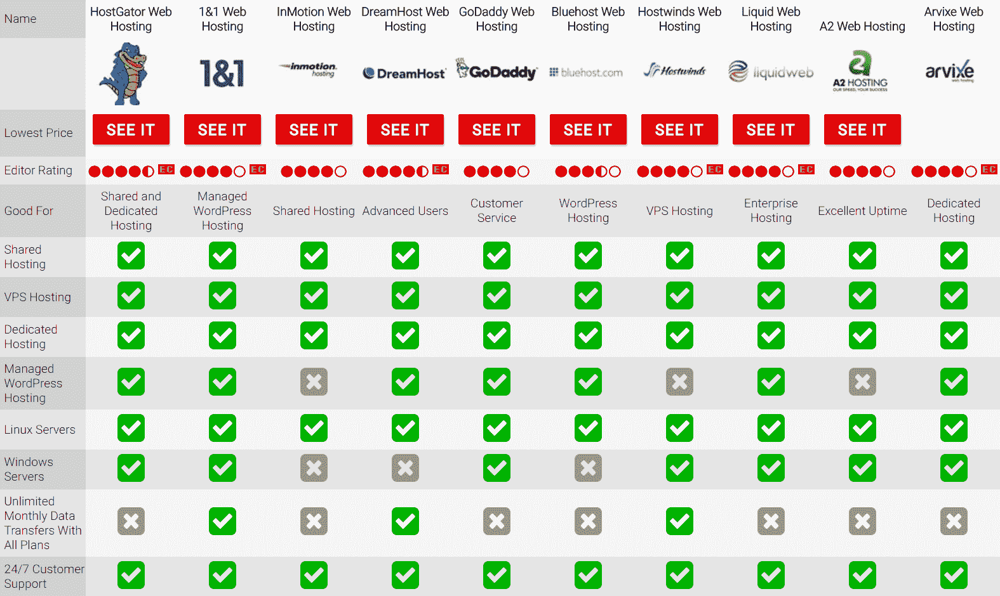

虽然价格便宜的共享服务器可能看起来很诱人，但对服务器的控制不足限制了它在任何严肃应用中的使用。我们的应用程序与其他应用程序共享相同的 CPU、内存和存储空间。我们无法安装任何我们想要的软件，如果我们的应用程序需要一些花哨的 PHP 扩展，这甚至可能成为一个决定性因素，这种贫穷人的托管是我们除了名片或博客类型的应用程序之外，应该全心全意地避免的。

# 虚拟专用服务器

**虚拟专用服务器**（VPS）是由托管提供商提供的虚拟机器。然后，该机器运行其自己的操作系统，我们通常具有完整的超级用户访问权限。VPS 本身与其他 VPS 机器共享相同的物理硬件资源。这意味着我们的 VPS 性能很容易受到其他 VPS 机器进程的影响。

流行的 PCMag 杂志（[`www.pcmag.com`](http://www.pcmag.com)）分享了 2017 年最佳 VPS 网络托管服务的名单如下：

+   HostGator Web Hosting: [`www.hostgator.com`](http://www.hostgator.com)

+   InMotion Web Hosting: [`www.inmotionhosting.com/`](https://www.inmotionhosting.com/)

+   1&1 Web Hosting: [`www.1and1.com`](https://www.1and1.com)

+   DreamHost Web Hosting: [`www.dreamhost.com`](https://www.dreamhost.com)

+   Hostwinds Web Hosting: [`www.hostwinds.com`](https://www.hostwinds.com)

+   Liquid Web Hosting: [`www.liquidweb.com`](https://www.liquidweb.com)

+   GoDaddy Web Hosting: [`www.godaddy.com`](https://www.godaddy.com)

+   Bluehost Web Hosting: [`www.bluehost.com`](https://www.bluehost.com)

+   Media Temple Web Hosting: [`mediatemple.net`](https://mediatemple.net)

这些托管服务之间存在相当多的差异，主要是在内存和存储方面，如下截图所示：

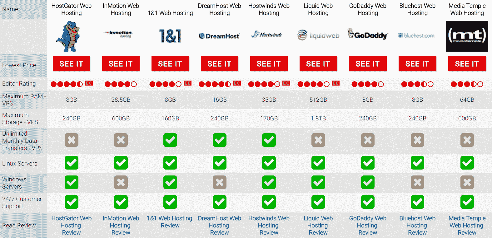

虽然 VPS 仍然是一种共享资源的形式，但它比传统的共享托管提供了更大程度的自由。拥有对机器的完全超级用户访问权限意味着我们几乎可以安装任何我们想要的软件。这也意味着我们承担了更大程度的责任。

# 专用服务器

专用服务器假定由托管提供商提供的真实物理机器。这样的机器除了我们之外不与任何其他人共享资源。这使得它成为高性能和关键任务应用的可行选择。

流行的 PCMag 杂志（[`www.pcmag.com`](http://www.pcmag.com)）分享了 2017 年最佳专用网络托管服务的名单如下：

+   HostGator Web Hosting: [`www.hostgator.com`](http://www.hostgator.com)

+   DreamHost Web Hosting: [`www.dreamhost.com`](https://www.dreamhost.com)

+   InMotion Web Hosting: [`www.inmotionhosting.com/`](https://www.inmotionhosting.com/)

+   1&1 Web Hosting: [`www.1and1.com`](https://www.1and1.com)

+   Liquid Web Hosting: [`www.liquidweb.com`](https://www.liquidweb.com)

+   Hostwinds Web Hosting: [`www.hostwinds.com`](https://www.hostwinds.com)

+   GoDaddy Web Hosting: [`www.godaddy.com`](https://www.godaddy.com)

+   Bluehost Web Hosting: [`www.bluehost.com`](https://www.bluehost.com)

+   SiteGround Web Hosting: [`www.siteground.com`](https://www.siteground.com)

+   iPage Web Hosting: [`www.ipage.com`](http://www.ipage.com)

这些托管服务之间存在相当多的差异，主要是在内存和存储方面，如此截图所示：


虽然价格更高，但专用服务器保证了一定的性能水平和对机器的完全控制。同时，管理可伸缩性和冗余性可能很容易成为一项挑战。

# PaaS

**平台即服务**（PaaS）是一种特殊类型的托管，其中提供商提供了加速应用程序开发所需的硬件和软件工具。我们甚至可以将 PaaS 与由数十个轻松连接的服务支持的专用服务器的强大和灵活性进行比较，这些服务支持可用性、可靠性、可伸缩性和应用程序开发活动。这使得它成为开发人员的热门选择。

IT Central Station 网站（[`www.itcentralstation.com`](https://www.itcentralstation.com)）分享了 2017 年最佳 PaaS 云供应商的名单如下：

+   Amazon AWS: [`aws.amazon.com`](https://aws.amazon.com)

+   Microsoft Azure: [`azure.microsoft.com`](https://azure.microsoft.com)

+   Heroku: [`www.heroku.com`](https://www.heroku.com)

+   Mendix: [`www.mendix.com`](https://www.mendix.com)

+   Salesforce App Cloud: [`www.salesforce.com`](https://www.salesforce.com)

+   Oracle Java Cloud Service: [`cloud.oracle.com/java`](https://cloud.oracle.com/java)

+   HPE Helion: [`www.hpe.com`](https://www.hpe.com)

+   Rackspace Cloud: [`www.rackspace.com`](https://www.rackspace.com)

+   Google App Engine: [`cloud.google.com`](https://cloud.google.com)

+   Oracle Cloud Platform: [`www.oracle.com/solutions/cloud/platform/`](http://www.oracle.com/solutions/cloud/platform/)

以下报告是 2017 年 4 月的：

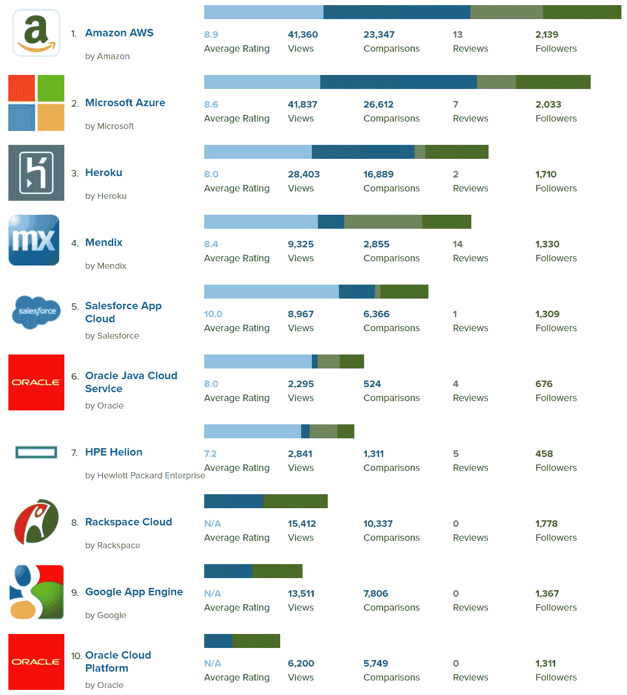

虽然所有这些服务都有很多提供，但值得指出的是亚马逊 AWS，它被 Gartner 在 2016 年云基础设施即服务的魔力象限中评为具有最远见的完整性。评估标准基于几个关键因素：

+   市场理解

+   营销策略

+   销售策略

+   提供（产品）策略

+   商业模式

+   垂直/行业战略

+   创新

+   地理战略

亚马逊 AWS 的一个很好的起点是其 EC2 服务，它提供可调整大小的虚拟服务器。这些虚拟服务器在云中的作用类似于专用服务器，我们可以选择部署它们的世界各地的地区。除此之外，亚马逊 AWS 提供了数十种其他服务，丰富了整体应用管理：

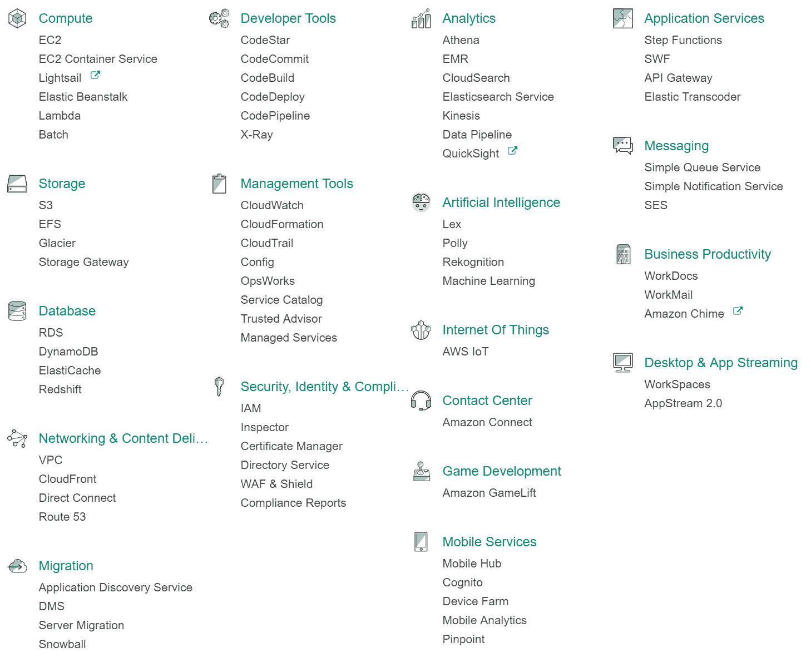

一个易于使用的界面，丰富的服务提供，价格实惠，文档齐全，认证和可用的工具是开发人员在使用亚马逊 AWS 时的一些*卖点*。

# 自动化配置

配置是最近在开发人员中引起了很大关注的一个术语。它指的是使用所需的软件设置和配置*服务器*的活动，使其准备好用于应用。虽然这听起来很像系统操作类型的工作，但随着云服务的兴起和围绕它的工具，开发人员发现这很有趣。

从历史上看，配置意味着很多手动工作。当时通用的自动配置工具并不像今天这样多。这意味着有时配置需要花费数天甚至数周的时间。从今天市场需求的角度来看，这样的情景几乎无法想象。如今，一个单一的应用通常由几个不同的服务器提供服务，每个服务器都针对单一功能，比如 Web（Apache，Nginx，...），存储（MySQL，Redis，...），会话（Redis，Memcached，...），静态内容（Nginx）等等。我们简直无法承受花费数天来设置每个服务器。

有几种流行的工具可以用来自动配置，其中包括这四种流行的工具：

+   Ansible: [`www.ansible.com`](https://www.ansible.com).

+   Chef: [`www.chef.io/chef/`](https://www.chef.io/chef/)

+   Puppet: [`puppet.com`](https://puppet.com)

+   SaltStack: [`saltstack.com`](https://saltstack.com)

像其他同类工具一样，所有这些工具都旨在使配置和维护数十、数百甚至数千台服务器变得更容易。虽然所有这些工具更有可能以同等效果完成任何配置工作，但让我们更仔细地看看其中一个。发布于 2012 年的**Ansible**是其中最年轻的。它是一个开源工具，可以自动化软件配置、配置管理和应用部署。该工具通过 SSH 执行所有功能，而无需在目标节点/服务器上安装任何代理软件。这一点使它成为开发人员中的首选。

围绕 Ansible 有几个关键概念，其中一些如下：

+   **清单**：这是 Ansible 管理的服务器列表

+   **Playbooks**：这是用 YAML 格式表达的 Ansible 配置

+   **角色**：这是基于文件结构的包含指令的自动化

+   **任务**：这是 Ansible 可以执行的可能操作

[`galaxy.ansible.com`](https://galaxy.ansible.com)服务充当了一个提供现成角色的中心。

为了对 Ansible 有一个非常基本的理解，让我们基于以下内容进行一个非常简单和快速的演示：

+   Ubuntu 工作站

+   Ubuntu 服务器

我们将使用`ansible`工具在服务器上部署软件。

# 设置工作站

使用 Ubuntu 工作站，我们可以通过运行以下一组命令轻松安装 Ansible 工具：

```php
sudo apt-get install software-properties-common
sudo apt-add-repository ppa:ansible/ansible
sudo apt-get update
sudo apt-get install ansible

```

如果一切顺利，`ansible --version`应该给我们一个类似这个截图的输出：


Ansible 是一个用于运行临时任务的控制台工具。而临时意味着我们可以快速地做一些事情，而不需要为此编写整个 playbook。

同样，`ansible-galaxy --version`应该给我们一个类似以下截图的输出：


`ansible-galaxy`是一个控制台工具，我们可以用它来安装、创建和删除角色，或在 Galaxy 网站上执行任务。默认情况下，该工具使用服务器地址[`galaxy.ansible.com`](https://galaxy.ansible.com)与 Galaxy 网站 API 通信。

同样，`ansible-playbook --version`应该给我们一个类似以下截图的输出：


`ansible-playbook`是一个用于配置管理和部署的控制台工具。

有了 Ansible 工具，让我们确保我们的工作站有一个适当的 SSH 密钥，我们稍后将用它连接到服务器。我们可以通过简单运行以下命令来轻松生成 SSH 密钥，然后在要求文件和密码时按下*Enter*键：

```php
ssh-keygen -t rsa

```

这应该给我们一个类似以下的输出：

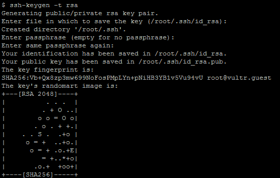

使用 Ansible 的 playbooks，我们可以以易于阅读的 YAML 格式定义各种配置步骤。

# 设置服务器

我们之前提到有几种托管解决方案可以完全控制服务器。这些解决方案以 VPS、专用和云服务的形式出现。在这个例子中，我们将使用**Vultr Cloud Compute**（**VC2**），它可以在[`www.vultr.com`](https://www.vultr.com)上找到。不深入讨论 Vultr 服务的细节，它提供了一个经济实惠的云计算服务，通过易于使用的管理界面。

假设我们已经创建了一个 Vultr 账户，现在我们要做的第一件事是将我们的工作站 SSH 公钥添加到其中。我们可以通过 Vultr 的 Servers | SSH Keys 界面轻松实现：

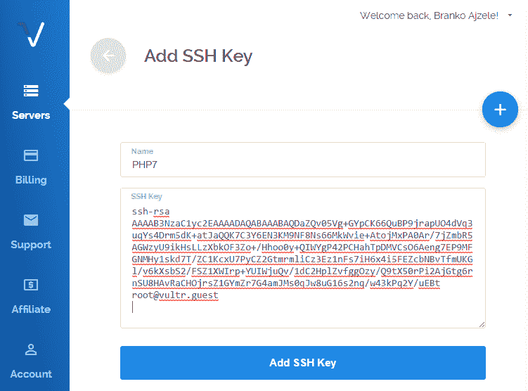

保存了 SSH 密钥后，我们可以返回到服务器界面，点击“部署新服务器”按钮。这将带我们进入“部署新实例”界面，其中呈现给我们几个步骤。我们关注的步骤是服务器类型和 SSH 密钥。

对于服务器类型，让我们继续选择 Ubuntu 16.04 x64：


对于 SSH 密钥，让我们继续选择我们刚刚添加到 Vultr 的 SSH 密钥：


有了这两个选择，我们可以点击“立即部署”按钮，这应该触发我们服务器的部署。

到这一点，我们可能会想知道这个练习的目的是什么，因为我们已经相当手动地创建了一个服务器。毕竟，Ansible 有一个模块来管理 Vultr 上的服务器，所以我们本可以轻松使用它来创建服务器。然而，这里的练习是围绕着理解如何轻松地“连接”Ansible 到现有的服务器，并使用它来为其进一步配置软件。现在我们有一个运行的服务器，让我们继续进行工作站上 Ansible 的进一步配置。

# 配置 Ansible

回到我们的工作站机器，让我们继续创建一个项目目录：

```php
mkdir mphp7
cd mphp7/

```

现在，让我们继续创建一个`ansible.cfg`文件，内容如下：

```php
[defaults]
hostfile = hosts

```

接下来，让我们继续创建`hosts`文件，内容如下：

```php
[mphp7]
45.76.88.214 ansible_ssh_user=root

```

在上述代码行中，`45.76.88.214`是我们服务器机器的 IP 地址。

现在，我们应该能够运行`ansible`工具，如下所示：

```php
ansible mphp7 -m ping

```

理想情况下，这应该给我们以下输出：

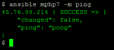

如果我们的服务器机器上缺少 Python 安装，`ansible`工具可能会抛出 MODULE FAILURE 消息：


如果发生这种情况，我们应该通过 SSH 登录到我们的服务器并按以下方式安装 Python：

```php
sudo apt-get -y install python

```

此时，我们的工作站`ansible`工具应该设置为与我们的*服务器*机器进行清晰的通信。

现在，让我们继续在 Galaxy hub 上快速查找 LAMP 服务器角色：

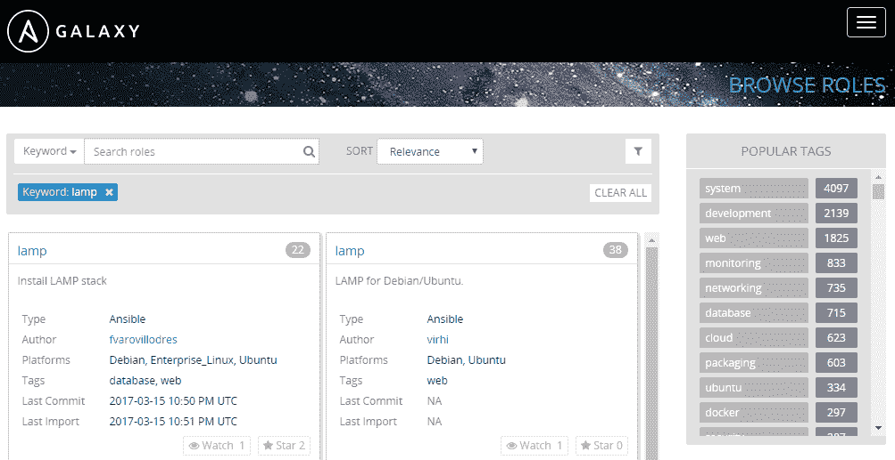

点击其中一个结果会给我们安装它的信息：

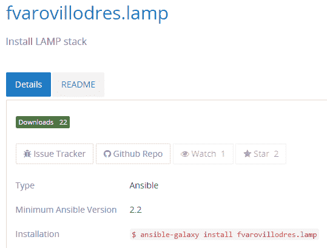

通过在工作站上运行以下命令，我们安装现有的`fvarovillodres.lamp`规则：

```php
ansible-galaxy install fvarovillodres.lamp

```

# 配置 Web 服务器

有了新拉取的`fvarovillodres.lamp`规则，我们应该能够轻松部署一个新的 Web 服务器。为此，只需创建一个 playbook，比如`lamp.yaml`，内容如下：

```php
- hosts: mphp7
 roles:
 - role: fvarovillodres.lamp
 become: yes

```

现在，我们可以通过以下命令轻松运行我们的`lamp.yaml` playbook：

```php
ansible-playbook lamp.yml

```

这应该在完成后触发从 Galaxy hub 拉取的`fvarovillodres.lamp`规则中的任务：


最后，在`http://45.76.88.214/` URL 上打开应该会给我们一个 Apache 页面。

配置的整体主题，甚至是 Ansible，都是一个值得一本书的广泛主题。这里给出的示例仅仅是为了展示可用工具的易用性，以便以自动化的方式解决配置问题。这里有一个重要的要点，就是我们需要完全控制服务器/节点才能利用配置。这就是为什么共享类型的主机被排除在任何这类讨论之外。

这里给出的确切示例使用了单个服务器框。然而，很容易想象如何通过修改 Ansible 配置来将这种方法扩展到十几甚至数百台服务器。我们本可以使用 Ansible 本身来自动化我们应用的部署，例如，每次部署可能会触发一个新的服务器创建过程，代码从某个 Git 存储库中拉取。然而，也有更简单的专门工具来处理自动化部署。

# 自动化部署

部署 PHP 应用程序主要意味着部署 PHP 代码。由于 PHP 是一种解释性语言而不是编译语言，PHP 应用程序将其代码原样部署在源文件中。这意味着在部署应用程序时没有真正的构建过程，这进一步意味着应用程序部署可以像在服务器 Web 目录中执行`git pull`一样简单。当然，事情永远不会那么简单，因为当代码部署时，我们通常还有各种其他需要适应的部分，比如数据库、挂载驱动器、共享文件、权限、连接到我们服务器的其他服务等等。

我们可以很容易地想象手动从单个 git 存储库部署代码到数十个位于负载均衡器后面的 Web 服务器的复杂性。这种手动部署肯定会产生负面影响，因为我们最终会在整体部署之间有一个时间差，其中一个服务器可能具有更新版本的应用程序代码，而其他服务器仍在提供旧应用程序。因此，缺乏一致性只是需要担心的影响挑战之一。

幸运的是，有数十种工具可以解决自动部署的挑战。虽然我们不会专门讨论它们的细节，但为了快速比较，让我们简要提到以下两个：

+   Deployer：这是一个开源的基于 PHP 的工具，适用于自动化部署，可在[`deployer.org`](https://deployer.org)获取。

+   AWS CodeDeploy：这是 AWS 提供的代码部署服务，可在[`aws.amazon.com/codedeploy/`](https://aws.amazon.com/codedeploy/)获取。

与 AWS CodeDeploy 不同，Deployer 工具是与服务无关的。也就是说，我们可以使用它将代码部署到我们有控制权的任何服务器，包括 AWS EC2 实例。另一方面，AWS CodeDeploy 是一个紧密集成到 AWS 本身的服务，这意味着我们无法在 AWS 之外使用它。这并不意味着在这种情况下 Deployer 比 AWS CodeDeploy 更好。这只是表明一些云和 PaaS 服务为自动部署提供了自己集成的解决方案。

接下来，让我们快速看一下如何轻松地设置 Deployer 来将代码部署到我们的服务器。

# 安装 Deployer

安装 Deployer 非常容易，只需使用以下几个命令：

```php
curl -LO https://deployer.org/releases/v4.3.0/deployer.phar
mv deployer.phar /usr/local/bin/dep 
chmod +x /usr/local/bin/dep

```

现在运行`dep`控制台命令将给我们以下输出：

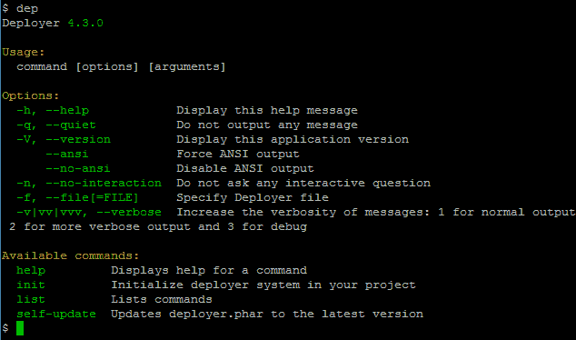

# 使用 Deployer

有几个构成 Deployer 应用程序的关键概念：

+   **配置**：使用`set()`和`get()`函数，我们设置和获取一个或多个配置选项：

```php
set('color', 'Yellow');
set('hello', function () {
  return run(...)->toString();
});

```

+   **任务**：这些是通过`task()`函数定义的工作单元，与设置任务描述的`desc()`方法一起使用。在任务中，通常有一个或多个函数，比如`run()`：

```php
desc('Foggyline task #1');
task('update', 'apt-get update');

desc('Foggyline task #2');
task('task_2', function () {
  run(...);
});

```

+   **服务器**：这是通过`server()`函数定义的服务器列表，如下面的代码片段所示：

```php
server('mphp7_staging', 'mphp7.staging.foggyline.net')
 ->user('user')
 ->password('pass')
 ->set('deploy_path', '/home/www')
 ->set('branch', 'stage')
 ->stage('staging');

server('mphp7_prod', 'mphp7.foggyline.net')
 ->user('user')
 ->identityFile()
 ->set('deploy_path', '/home/www')
 ->set('branch', 'master')
 ->stage('production');

```

+   **流程**：这代表一组任务。通用类型项目使用默认流程如下：

```php
task('deploy', [
  'deploy:prepare',
  'deploy:lock',
  'deploy:release',
  'deploy:update_code',
  'deploy:shared',
  'deploy:writable',
  'deploy:vendors',
  'deploy:clear_paths',
  'deploy:symlink',
  'deploy:unlock',
  'cleanup',
  'success' ]);

```

我们可以通过更改自动生成的`deploy.php`文件中的流程来轻松创建自己的流程。

+   **函数**：这是提供有用功能的一组实用函数，比如`run()`、`upload()`、`ask()`等。

使用 Deployer 工具非常简单。除非我们已经有一些先前创建的配方，否则我们可以通过运行以下控制台命令简单地创建一个配方：

```php
dep init

```

这将启动一个交互式过程，要求我们选择正在处理的项目类型。让我们继续考虑从[`github.com/ajzele/MPHP7-CH16`](https://github.com/ajzele/MPHP7-CH16)存储库部署我们的 MPHP7-CH16 应用程序的想法，并将其标记为[0] Common：

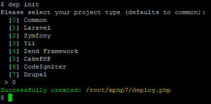

此命令生成`deploy.php`文件及其内容如下：

```php
<?php namespace Deployer; require 'recipe/common.php';   // Configuration set('ssh_type', 'native'); set('ssh_multiplexing', true); set('repository', 'git@domain.com:username/repository.git'); set('shared_files', []); set('shared_dirs', []); set('writable_dirs', []);   // Servers   server('production', 'domain.com')
 ->user('username')
 ->identityFile() ->set('deploy_path', '/var/www/domain.com');   // Tasks   desc('Restart PHP-FPM service'); task('php-fpm:restart', function () {
  // The user must have rights for restart service
 // /etc/sudoers: username ALL=NOPASSWD:/bin/systemctl restart php-fpm.service  run('sudo systemctl restart php-fpm.service'); }); after('deploy:symlink', 'php-fpm:restart'); desc('Deploy your project'); task('deploy', [
  'deploy:prepare',
  'deploy:lock',
  'deploy:release',
  'deploy:update_code',
  'deploy:shared',
  'deploy:writable',
  'deploy:vendors',
  'deploy:clear_paths',
  'deploy:symlink',
  'deploy:unlock',
  'cleanup',
  'success' ]); // [Optional] if deploy fails automatically unlock. after('deploy:failed', 'deploy:unlock');

```

我们应该将这个文件视为需要调整到我们真实服务器的模板。假设我们希望将我们的 MPHP7-CH16 应用程序部署到我们之前配置的`45.76.88.214`服务器，我们可以通过调整`deploy.php`文件来实现：

```php
<?php namespace Deployer; require 'recipe/common.php';   set('repository', 'https://github.com/ajzele/MPHP7-CH16.git');   server('production', '45.76.88.214')
 ->user('root')
 ->identityFile() ->set('deploy_path', '/var/www/MPHP7')
 ->set('branch', 'master')
 ->stage('production');   desc('Symlink html directory'); task('web:symlink', function () {
 run('ln -sf /var/www/MPHP7/current /var/www/html'); }); desc('Restart Apache service'); task('apache:restart', function () {
 run('service apache2 restart'); }); after('deploy:symlink', 'web:symlink'); after('web:symlink', 'apache:restart');   desc('Deploy your project'); task('deploy', [
  'deploy:prepare',
  'deploy:lock',
  'deploy:release',
  'deploy:update_code',
  'deploy:shared',
  'deploy:writable',
  //'deploy:vendors',
  'deploy:clear_paths',
  'deploy:symlink',
  'deploy:unlock',
  'cleanup',
  'success' ]); after('deploy:failed', 'deploy:unlock');

```

我们使用`set()`函数来配置 git 存储库的位置。然后，`server()`函数定义了我们称之为`production`的单个服务器，位于 45.76.88.214 IP 地址后面。`identityFile()`只是告诉系统使用 SSH 密钥而不是密码进行 SSH 连接。在服务器旁边，我们定义了两个自定义任务，`web:symlink`和`apache:restart`。这些任务确保从 Deployer 的`/var/www/MPHP7/current/`目录到我们的`/var/www/html/`目录进行正确映射。`after()`函数调用只是定义了我们的两个自定义任务应该在 Deployer 的`deploy:symlink`事件之后执行的顺序。

要执行修改后的 deploy.php，我们使用以下控制台命令：

```php
dep deploy production

```

这应该给我们以下输出：

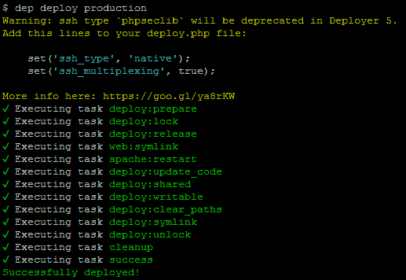

要确认部署成功，打开`http://45.76.88.214/`应该给我们以下页面：


这个简单的 Deployer 脚本为我们提供了一个强大的方式，可以自动将代码从我们的存储库部署到服务器上。通过 Deployer 的`server()`函数，将其扩展到多个服务器是非常容易的。

# 持续集成

持续集成的理念是将构建、测试和发布过程以一种易于监督的方式绑定在一起。正如我们之前提到的，当涉及到 PHP 时，构建的概念有点特殊，因为语言本身的解释性；我们不是在谈论编译代码。对于 PHP，我们倾向于将其与应用程序所需的各种配置相关联。

话虽如此，持续集成的一些优点包括以下内容：

+   通过静态代码分析自动化代码覆盖和质量检查

+   每次开发人员推送代码后自动运行

+   通过单元和行为测试自动检测错误代码

+   减少应用程序发布周期

+   项目的可见性增加

有数十种持续集成工具可供选择，其中包括以下工具：

+   **PHPCI**：[`www.phptesting.org`](https://www.phptesting.org)

+   **Jenkins**：[`jenkins-php.org`](http://jenkins-php.org)

+   **Travis CI**：[`travis-ci.org`](https://travis-ci.org)

+   **TeamCity**：[`www.jetbrains.com/teamcity/`](https://www.jetbrains.com/teamcity/)

+   竹子：[`www.atlassian.com/software/bamboo`](https://www.atlassian.com/software/bamboo)

+   **AWS CodePipeline**：[`aws.amazon.com/codepipeline/`](https://aws.amazon.com/codepipeline/)

说其中一个工具比其他工具更好是不公平的。尽管在涉及 PHP 时，Jenkins 似乎比其他工具更常见。

# Jenkins

Jenkins 是一个开源的、自包含的、跨平台的、可运行的基于 Java 的自动化服务器。通常会发布两个版本的 Jenkins：**长期支持**（**LTS**）和每周发布的版本。LTS 版本使其具有一些企业友好的特性，除其他外：

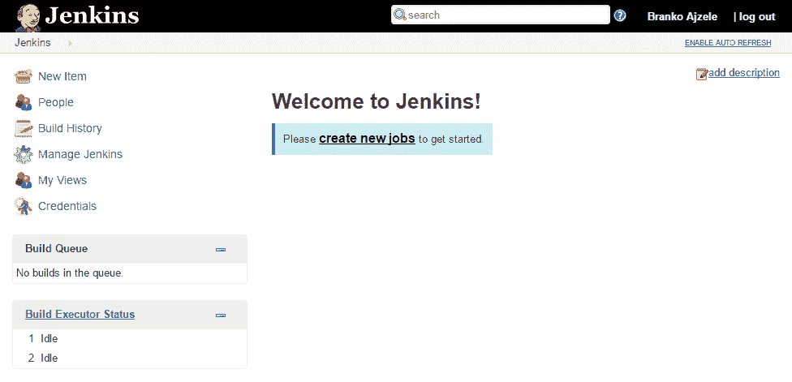

Jenkins 默认情况下并不真正针对 PHP 代码做任何事情，这就是插件发挥作用的地方。

丰富的 Jenkins 插件系统使我们能够轻松安装插件，以便与以下 PHP 工具一起使用：

+   PHPUnit：这是一个可在[`phpunit.de/`](https://phpunit.de/)找到的单元测试框架

+   PHP_CodeSniffer：这是一个检测违反一定编码标准的工具，可在[`github.com/squizlabs/PHP_CodeSniffer`](https://github.com/squizlabs/PHP_CodeSniffer)找到

+   PHPLOC：这是一个快速测量 PHP 项目大小的工具，可在[`github.com/sebastianbergmann/phploc`](https://github.com/sebastianbergmann/phploc)找到。

+   PHP_Depend：这显示了代码设计在可扩展性、可重用性和可维护性方面的质量，可在[`github.com/pdepend/pdepend`](https://github.com/pdepend/pdepend)找到。

+   PHPMD：这是 PHP 混乱检测器，可在[`phpmd.org/`](https://phpmd.org/)找到。

+   PHPCPD：这是用于 PHP 代码的复制/粘贴检测器，可在[`github.com/sebastianbergmann/phpcpd`](https://github.com/sebastianbergmann/phpcpd)找到。

+   phpDox：这是用于 PHP 项目的文档生成器，可在[`phpdox.de/`](http://phpdox.de/)找到。

这些工具的插件影响了 Jenkins 能够持续运行的自动化测试部分。关于代码部署的部分通常与语言无关。深入讨论插件安装和 Jenkins 的整体使用是一本书的话题。重点是要理解持续集成在应用程序生命周期中的重要性和作用，以及提高对可用工具的认识。

有关更多信息，请参阅[`jenkins.io/doc/`](https://jenkins.io/doc)和[`plugins.jenkins.io/`](https://plugins.jenkins.io/)。

# 总结

在本章中，我们涉及了围绕我们应用程序的一些非编码基本要素。虽然开发人员倾向于避免许多与系统操作相关的活动，但与服务器及其设置的实际经验在部署和快速故障响应方面具有巨大优势。在我们的工作中划定“不是我的工作”界限总是一个很棘手的问题。与系统操作紧密合作为我们的应用程序增加了一层质量。最终用户可能会将其视为应用程序本身的故障，而不是其基础架构。托管、配置和部署已成为每个开发人员都需要熟悉的主题。围绕这些活动的工具在可用性和易用性方面似乎相当令人满意。

在整本书中，我们涵盖了广泛且看似独立的一系列主题。这些向我们表明构建应用程序绝非易事。了解 PHP 语言本身的方方面面并不意味着质量软件。给我们的代码结构化是模块化的第一个迹象，这反过来减少了技术债务的影响。这就是标准和设计模式发挥重要作用的地方。毫无疑问，测试被证明是每个应用程序的重要组成部分。幸运的是，PHP 生态系统提供了丰富的测试框架，轻松覆盖 TDD 和 BDD 两种风格。在 PHP 7 中增加的出色新功能，编写高质量的 PHP 应用程序变得更加容易。

希望到现在为止，我们已经对 PHP 及其生态系统以及构成高质量应用程序的各种其他重要部分有足够的了解，以便能够熟练地开发它们。说了这么多，我们结束我们的旅程。
