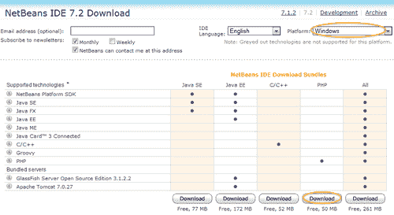
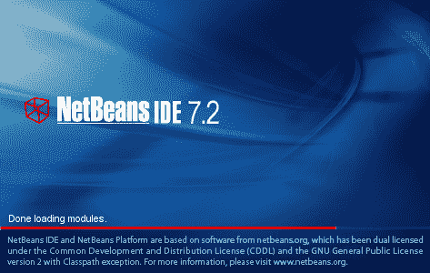
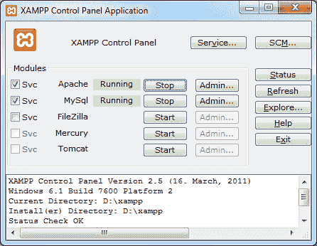
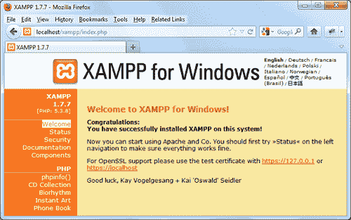
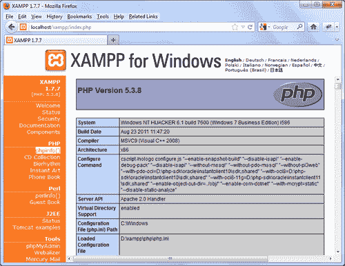
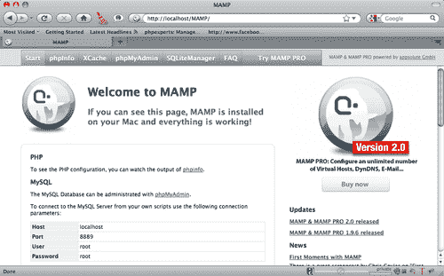
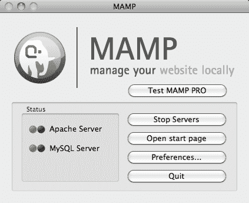
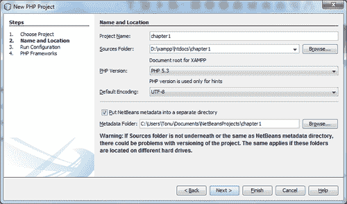
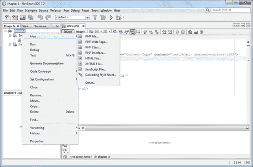

# 第一章：设置您的开发环境

> NetBeans 是一个免费开源的**集成开发环境**（**IDE**），符合多种编程语言。长期以来，它一直是主要开发者社区的首选编辑器。随着市场需求的增长，NetBeans 自 NetBeans 6.5（2008 年 11 月）以来已经集成了 PHP 开发功能，如今，它已成为 PHP 社区中最受欢迎的 IDE 之一。

在本章中，我们将讨论：

+   为什么选择 NetBeans 进行 PHP 应用程序开发？

+   下载 NetBeans IDE

+   逐步进行 NetBeans 安装

+   设置您的 PHP 开发环境

+   创建 NetBeans 项目

那么让我们开始吧…

# 为什么选择 NetBeans 进行 PHP 应用程序开发？

NetBeans IDE 通过以下方式促进我们日常的 PHP 应用程序开发活动：

+   **创建和管理项目：**PHP 的 IDE 使我们能够创建 PHP 项目，并帮助项目增长。它可以执行与项目相关的设置和操作；即创建项目文档，测试项目等。

+   **源代码的编辑功能：**代码编辑器在 PHP 项目范围内具有令人兴奋的源代码编辑功能集合。它通过以下功能加快了代码编写速度：

+   **语法高亮**使项目文件中的 PHP 语法突出显示。

+   **代码折叠**使当前文件中选择的类和方法代码可以折叠和展开。

+   **导航**帮助探索当前 PHP 文件中的类和方法。

+   **代码模板**帮助使用预定义的代码片段。

+   **代码完成**显示代码的自动完成列表。

+   **参数提示**提供有关方法的形式参数在方法被调用的地方的信息。

+   **智能缩进**在按代码时提供自动格式化。

+   **格式化**在当前文件中提供自动代码格式化。

+   **括号补全**在编写代码时添加/删除成对的引号、括号和大括号。

+   **标记出现**标记在打开的项目文件中代码字符串的所有出现。

+   **错误检测**在输入完成后立即显示 PHP 解析错误。

+   **配对匹配**突出显示匹配的引号、大括号、括号等。

+   **语义高亮**识别关键字、方法名、调用、未使用的变量等。

+   **转到声明**将光标发送到所选类型声明的位置。

+   **即时重命名**会重命名变量在其范围内的所有出现。

+   **拼写检查**显示拼写错误和更正。

+   **代码文档**帮助自动生成文档结构。

+   **部署项目：**在 PHP 项目内容内提供与远程服务器内容的同步。

+   **数据库和服务：**提供对数据库管理和 Web 服务的支持。

+   **SCM 工具：**提供源代码管理工具，如 Git、Subversion、CVS 和 Mercurial，内置用于源代码版本控制、跟踪更改等。

+   **运行 PHP 脚本：**使 PHP 脚本解析，并在不转到浏览器的情况下在 IDE 中产生输出。

+   **调试源代码：**您可以检查本地变量，设置监视，设置断点，并实时评估代码。您还可以执行命令行调试，并在不转到浏览器的情况下在 IDE 中检查 PHP 输出，这为远程调试提供了能力。

+   **支持 PHP 框架：**它还支持流行的 PHP 框架，如 Zend Framework 和 Symfony。

### 注意

可以在[`en.wikipedia.org/wiki/Comparison_of_integrated_development_environments#PHP`](http://en.wikipedia.org/wiki/Comparison_of_integrated_development_environments#PHP)找到用于 PHP 的集成开发环境的比较。

## 推荐的系统要求

在我们继续下载最新版本之前，让我们看一下各个平台安装和运行 NetBeans IDE 的推荐系统要求：

+   Microsoft Windows XP Professional SP3/Vista SP1/Windows 7 Professional：

+   处理器：2.6 GHz 英特尔奔腾 IV 或同等处理器

+   内存：2 GB

+   磁盘空间：1 GB 的可用磁盘空间

+   Ubuntu 12.04：

+   处理器：2.6 GHz 英特尔奔腾 IV 或同等处理器

+   内存：2 GB

+   磁盘空间：850 MB 的可用磁盘空间

+   Macintosh OS X 10.7 Intel：

+   处理器：双核英特尔（32 位或 64 位）

+   内存：2 GB

+   磁盘空间：850 MB 的可用磁盘空间

# 下载 NetBeans IDE

NetBeans 可以成为您日常开发的 IDE，有助于提高编码效率。它是一个免费的开源 IDE，可用于不同的技术，包括 Java、C/C++、PHP 等，以及 Windows、Linux、Mac OS X 或甚至独立于操作系统的捆绑包。此外，您可以仅为 PHP 技术下载 IDE，或者下载包含所有技术的安装程序包。

再次强调，如果您已经在使用 IDE 进行 Java、C/C++等开发，则可以跳过此下载和安装部分，直接转到名为“将 PHP 作为插件添加到已有的 NetBeans 安装”部分。

# 操作时间-下载 NetBeans IDE

按照以下步骤下载 NetBeans IDE：

1.  访问[`netbeans.org/downloads/`](http://netbeans.org/downloads/)以下载最新的 NetBeans 版本。下载页面将自动检测您的计算机操作系统，并允许您下载特定于操作系统的安装程序。

请注意，您可以稍后使用 IDE 的插件管理器添加或删除包或插件。此外，如果您想避免安装，您可以选择“OS-independent ZIP”。再次强调，NetBeans 是那些使用多种编程语言平台的程序员必备的 IDE。目前，NetBeans IDE 支持各种开发平台——J2SE、J2EE、J2ME、PHP、C/C++等等。



接下来，我们将下载 PHP 捆绑，如上面的截图所示。

1.  点击“下载”按钮后，页面将被重定向到自动下载，同时显示直接下载链接，如下截图所示：

如您所见，您的下载将自动开始；Firefox 用户应该会看到一个保存文件的窗口，如下所示：


1.  将文件保存到您的磁盘空间中。

## 刚刚发生了什么？

我们刚刚下载了 NetBeans PHP 捆绑安装文件。PHP 捆绑提供了用于 PHP 5.x 开发的工具，以及 Zend 和 Symfony 框架支持。如果您点击“全部”下载选项，您将获得所有提到的技术的安装文件，并且在安装过程中您将能够选择安装哪些工具和运行时。所以，现在我们准备启动安装向导。

# 安装 NetBeans

使用安装向导安装 NetBeans 非常简单，该向导将指导用户完成所需的步骤或配置。已经在使用 NetBeans 进行其他技术（如 Java 或 C/C++）开发的用户可以跳过此部分，直接转到名为“将 PHP 作为插件添加到已有的 NetBeans 安装”部分。

### 注意

PHP 和 C/C++的 NetBeans 捆绑只需要安装 Java Runtime Environment（JRE）6。但是，如果您计划使用任何 Java 功能，则需要安装 JDK 6 或 JDK 7。

# 操作时间-逐步安装 NetBeans

在本节中，我们将逐步安装 Windows 7 上的 NetBeans IDE。为了安装软件，您需要运行安装程序并按照以下步骤进行操作：

1.  运行或执行安装程序。第一步将类似于以下截图：

1.  点击**下一步**按钮，您将被要求接受许可协议：

1.  下一步将要求您为 NetBeans 和 JRE 选择安装位置，并提供一些默认的程序文件路径：

请注意，JRE 是您计算机的 Java 软件，或者 Java 运行环境，也被称为**Java 虚拟机（JVM）**。JRE 也将被安装。

1.  使用文件浏览器设置`安装`文件夹，并点击**下一步**按钮。下一个截图显示了总安装大小：

1.  如果一切都设置好了，点击**安装**按钮开始安装过程。

1.  安装正确后，您将看到完成向导，如下截图所示：

1.  您可以根据自己的意愿选择或取消**通过提供匿名使用数据为 NetBeans 项目做出贡献**复选框。请注意，它将向`netbeans.org`发送特定于项目的使用数据，因此在勾选之前请仔细阅读屏幕上的说明。点击**完成**按钮完成安装。现在，转到您的操作系统的**程序**菜单或安装 IDE 的目录以运行。IDE 将显示一个启动画面，如下所示：

1.  最后，运行的 IDE 看起来类似于以下截图：

## 刚刚发生了什么？

既然我们已经安装并运行了 IDE，我们可以继续探索在各种操作系统上设置开发环境。

在下一节中，我们将在各种操作系统上配置我们的 PHP 开发环境。我们将使用最新的 Apache-MySQL-PHP 软件包安装程序，即 LAMP、XAMPP 和 MAMP，对应于不同的操作系统。

### 将 PHP 作为插件添加到已有的 NetBeans 安装中

如果您想要为 NetBeans IDE 配置添加功能，请使用 NetBeans 插件管理器。例如，假设您已经在 NetBeans IDE 中运行了 Java 或 C/C++包。然后您决定尝试 PHP 功能。要做到这一点，从 IDE 中转到 NetBeans 插件管理器（选择**工具|插件**），并将 PHP 包添加到您已有的安装中。

### 多个安装支持

多个版本的 NetBeans IDE 5.x、6.x 和 7.x 可以与最新版本共存在同一系统上。您无需卸载早期版本即可安装或运行最新版本。

如果您之前安装过 NetBeans IDE，当您第一次运行最新的 IDE 时，您可以选择是否从现有用户目录导入用户设置。

## 尝试添加或删除 NetBeans 功能

因此，您的计算机上已经安装并运行了 NetBeans。现在，添加更多功能或删除不必要的功能，从已安装的 NetBeans 中检查新添加的功能。您可以尝试使用插件管理器来实现这一点。

# 在 Windows 中设置开发环境

我们将使用 XAMPP 软件包而不是单独安装和配置 Apache、MySQL 和 PHP，以便自动安装和配置所有这些。我们将下载并安装最新的 XAMPP 软件包（v. 1.7.7），其中包括以下内容：

+   Apache 2.2.21

+   MySQL 5.5.16

+   PHP 5.3.8

+   phpMyAdmin 3.4.5

+   FileZilla FTP 服务器 0.9.39

# 行动时间-在 Windows 安装 XAMPP

以下步骤将下载并安装 XAMPP 软件包：

1.  我们将从以下网址下载最新的 XAMPP 软件包安装程序：[`www.apachefriends.org/en/xampp-windows.html`](http://www.apachefriends.org/en/xampp-windows.html)。

1.  下载完成后，运行`.exe`文件以继续安装。更多安装细节可以在[`www.apachefriends.org/en/xampp-windows.html`](http://www.apachefriends.org/en/xampp-windows.html)找到。

1.  您将有选择安装 Apache 服务器和 MySQL 数据库服务器作为服务，因此您无需从 XAMPP 控制面板手动启动它们。同样，您将有选项稍后从 XAMPP 控制面板配置这些服务，如启动/停止、作为服务运行和卸载。

1.  成功完成安装过程后，您将能够继续进行后续步骤。从操作系统的**Start | Programs | XAMPP**中打开 XAMPP 控制面板。

**Svc**复选框表示该模块已安装为 Windows 服务，因此将随 Windows 启动而启动，或者您可以将其选中以作为服务运行。如果您需要重新启动 Apache web 服务器，请使用 Apache **Status**旁边的**Stop/Start**按钮。

1.  现在，检查您的 XAMPP 安装。从您的 Web 浏览器访问 URL `http://localhost`；XAMPP 欢迎页面看起来类似于以下截图：

1.  从左侧点击`phpinfo()`以检查您配置的 PHP 版本和已安装的组件：

1.  单击**Welcome**菜单下的**Status**菜单，以检查已安装工具的状态；相应列旁边的激活绿色状态表示您已成功运行 Apache、MySQL 和 PHP：

## 刚刚发生了什么？

我们已成功在系统上安装并运行了 XAMPP 软件包。我们有 XAMPP 控制面板来控制已安装的服务，我们还有一个 Web 界面来管理 MySQL 数据库。

## 尝试一下-保护您的 XAMPP 安装

XAMPP 不适用于生产环境，而仅适用于开发环境中的开发人员。XAMPP 被配置为尽可能开放，并允许 Web 开发人员获取他们想要的任何内容。对于开发环境来说，这很棒。但是，在生产环境中，这可能是致命的。因此，您需要在[`www.apachefriends.org/en/xampp-windows.html`](http://www.apachefriends.org/en/xampp-windows.html)的*A matter of security*部分的帮助下保护您的 XAMPP 安装。

### 注意

为了在开发环境中显示错误，更新加载的`php.ini`文件以设置`display_errors = On`，并为生产环境做相反的`display_errors = Off`。

# 在 Ubuntu 桌面上设置您的开发环境

**Linux，Apache，MySQL**和**PHP**（**LAMP**）是一些最常见的网络托管平台。因此，这是一个完美的环境，让您构建和测试您的网站代码。在本节中，我们将在我们的 Ubuntu 12.04 桌面上轻松设置、配置和运行我们自己的 LAMP。

# 行动时间-在 Ubuntu 桌面上安装 LAMP

按照这里列出的步骤安装 Ubuntu 中的 LAMP 软件包：

1.  与单独安装每个项目不同，我们将在 Ubuntu 中使用一个包安装 LAMP 服务器，这相当简单，只需一个终端命令：

```php
**sudo apt-get install lamp-server^** 

```

`apt-get`命令是一个强大的命令行工具，用于处理 Ubuntu 的**高级软件包工具（APT）**，执行诸如安装新软件包、升级现有软件包、更新软件包列表索引，甚至升级整个 Ubuntu 系统等功能。

### 注意

`sudo`用于调用当前用户以获得超级用户的权限，插入符号（^）放在包名后面，表示正在一起执行任务。

1.  这个命令将立即开始安装 LAMP 软件包，同时安装最新的 PHP5、Apache 2、MySQL 和 PHP5-MySQL 软件。默认情况下，Apache 2 和 MySQL 安装为服务，您的文档根目录将位于`/var/www/`，`index.html`文件将位于`/var/www/`。

1.  Apache 和 MySQL 都应该在运行。但是，如果需要，您可以使用`service start`命令启动 Apache，如下所示：

```php
**sudo service apache2 start** 

```

您可以使用以下命令停止 Apache：

```php
**sudo service apache2 stop** 

```

1.  现在，让我们检查 LAMP 安装。将浏览器指向`http://localhost/`，您将看到默认的 Apache 2 登录页面，如下图所示：

这意味着您的 Apache 2 Web 服务器正在运行。您仍然可以按以下方式检查这些服务状态：

```php
**sudo service apache2 status** 

```

上一个命令将给您以下输出：

```php
**Apache is running. Process #** 

```

1.  同样，要检查 MySQL 状态，只需运行以下命令：

```php
**sudo service mysql status** 

```

将显示以下输出：

```php
**mysql start/running. Process #** 

```

1.  要检查 PHP 安装，只需在`/var/www/`中创建一个名为`test.php`的文件，其中包含以下行：

```php
<?php phpinfo(); ?>

```

### 注意

您可以使用`touch test.php`命令从终端创建一个新文件，也可以使用 gedit 应用程序，然后编辑文件并保存。

1.  现在，将浏览器指向`http://localhost/test.php`，您将看到已安装的 PHP 和组件的配置详细信息：

*步骤 8*至*12*是可选的，因为我们在这些步骤中安装了`phpMyAdmin`。

1.  虽然我们可以使用 NetBeans 来维护我们的数据库，但我们仍然需要使用基于 Web 的界面来维护 MySQL 数据库功能。为此，我们可以使用`phpMyAdmin`。

```php
**sudo apt-get install phpmyadmin** 

```

使用此命令将安装`phpMyAdmin`，在安装过程中，您将收到一个蓝色窗口询问您要使用哪个服务器——`apache2`还是`lighttpd`。选择`apache2`，然后单击**OK**继续安装。请注意，在安装过程中，您可能会被要求配置`phpMyAdmin`以进行数据库配置、密码等。

1.  安装完成后，使用`http://localhost/phpmyadmin/`在浏览器中打开，您将能够查看一个`phpMyAdmin`登录页面，如下图所示：

1.  如果在`http://localhost/phpmyadmin/`收到`404`错误，则需要通过使用`gedit`（GNOME 桌面的官方文本编辑器）修改`/etc/apache2/apache2.conf`来手动设置`phpMyAdmin`在 Apache 下的配置：

```php
**sudo gedit /etc/apache2/apache2.conf** 

```

1.  `gedit`将以图形模式打开文件，并将以下行添加到`apache2.conf`的底部：

```php
**Include /etc/phpmyadmin/apache.conf** 

```

1.  现在，重新启动 Apache 服务器以使更改生效：

```php
**sudo service apache2 restart** 

```

刷新您的浏览器，您现在将看到与上一个屏幕截图中相同的`phpMyAdmin`登录界面。

## 刚刚发生了什么？

Ubuntu 桌面上的 PHP 开发环境已成功设置。使用单个终端命令安装 LAMP 服务器真的很简单。我们学会了如何停止或重新启动 Apache 和 MySQL 等服务，并检查它们的状态。

此外，我们还可选择安装`phpMyAdmin`以通过 Web 界面管理数据库。请注意，`phpMyAdmin`并不适用于生产环境，而只适用于开发环境中的开发人员。

## 尝试一下 — 显示错误

由于我们已经为开发环境进行了配置，PHP 错误消息对我们解决问题将非常有帮助。在您的 LAMP 安装中，默认情况下 PHP 错误消息是关闭的。您可以通过修改包含`display_errors`的行来启用从加载的`php.ini`文件（参见`phpinfo`）显示错误消息。请注意，对`php.ini`的任何更改都需要重新启动 Apache 2 服务器。

# 在 Mac OS X 中设置您的开发环境

由于我们对在一起设置 AMP 感兴趣，MAMP 包可能是 Mac OS X 的一个不错选择。

# 在 Mac OS X 中安装 MAMP 的时间

按照以下步骤在您的 Mac OS X 上下载和安装 MAMP：

1.  从[`www.mamp.info/en/`](http://www.mamp.info/en/)下载最新的 MAMP 版本；点击**MAMP 包下载器**下的**立即下载**按钮来下载 MAMP：

1.  如前面的截图所示，在屏幕左侧选择 MAMP 下载。

1.  解压下载的文件，并运行`.dmg`文件。接受“使用条款”后，您将看到一个类似以下的屏幕：

1.  将`MAMP`文件夹拖入`Applications`文件夹；MAMP 在您的 Mac OS X 上现在安装完成。

1.  现在，让我们检查我们的 MAMP 安装。将浏览器指向`http://localhost/MAMP/`，您将看到默认的 MAMP 登陆页面，如下图所示：

您可以在 MAMP 的**开始**页面的顶部栏上检查**phpinfo, phpMyAdmin**等。

1.  从`/Applications/MAMP/`，双击`MAMP.app`来运行 Apache、MySQL、PHP 和 MAMP 控制面板。**MAMP**控制面板显示服务器状态，并允许您启动/停止服务器，如下图所示：

1.  从 MAMP 控制面板中的**首选项... | PHP 选项卡**切换到 PHP 版本 5.3（需要重新启动服务器）。

## 刚刚发生了什么？

我们已经成功地为我们的 Mac OS X 开发环境下载并安装了 MAMP。此外，我们已经测试了安装，并发现它完美地运行起来。MAMP 登陆页面带有选项卡式界面，包括`phpinfo, phpMyAdmin, SQLiteManager`等。您的 MAMP 包中已安装了以下程序和库：

+   Apache 2.0.63

+   MySQL 5.1.44

+   PHP 5.2.13 和 5.3.2

+   APC 3.1.3

+   eAccelerator 0.9.6

+   XCache 1.2.2 和 1.3.0

+   phpMyAdmin 3.2.5

+   Zend Optimizer 3.3.9

+   SQLiteManager 1.2.4

+   Freetype 2.3.9

+   t1lib 5.1.2

+   curl 7.20.0

+   jpeg 8

+   libpng-1.2.42

+   gd 2.0.34

+   libxml 2.7.6

+   libxslt 1.1.26

+   gettext 0.17

+   libidn 1.15

+   iconv 1.13

+   mcrypt 2.6.8

+   YAZ 4.0.1 和 PHP/YAZ 1.0.14

到目前为止，我们已经安装了最新的 NetBeans IDE，并使用最新的 Apache、MySQL 和 PHP 设置了我们的平台特定的开发环境。现在，我们最近完成的开发环境已经足够精心地开始构建项目。我们将在 IDE 的帮助下进行 PHP 项目的创建和维护。开发人员和 IDE 之间的这种协同作用可以真正提高生产力。

## 尝试一下 — 保护您的 MAMP 安装

正如我们所了解的，MAMP 并不适用于生产环境，而只适用于开发环境中的开发人员。通过 MAMP 论坛[`forum.mamp.info/viewtopic.php?t=365`](http://forum.mamp.info/viewtopic.php?t=365)来保护您的 MAMP 安装。您可能需要设置 MySQL 密码、`phpMyAdmin`密码、保护 MAMP 登陆页面等。

# 创建一个 NetBeans PHP 项目

NetBeans 将用于开发应用程序的所有必要文件分组到一个项目中。项目文件包括您的原始代码以及您的项目可能依赖的任何导入的代码。NetBeans 项目管理使得在大型项目上工作变得更加容易，因为它可以立即显示程序的一个部分的变化将如何影响程序的其余部分。因此，IDE 提供了一些功能来促进项目的发展。

# 执行操作的时间-创建 NetBeans PHP 项目

最后，我们将创建一个 NetBeans PHP 项目，以便组织 PHP 内容，并对创建的项目有更多的控制。

要创建一个 NetBeans PHP 项目，请按照以下步骤进行：

1.  为了开始项目创建，从 IDE 菜单栏中转到**文件|新建项目**。

1.  从这个窗口中，选择**PHP**作为项目类别，并选择默认选择的**PHP 应用程序**，这意味着我们将从头开始创建一个 PHP 项目。如果您已经有源 PHP 代码，那么选择**具有现有源的 PHP 应用程序**，您将需要浏览到您的现有源以设置您的源目录。

1.  点击**下一步**按钮，它会带您到下面的屏幕，如下所示：

1.  定义项目名称和 IDE，它会自动为给定名称建议源文件夹。但是，我们可以通过浏览文件夹路径来明确定义源文件夹路径。还要选择适当的**PHP 版本**，根据这个版本，项目将在 IDE 中表现，并选择**默认编码**。我们将默认选择最新的 PHP 版本行为和`UTF-8`作为**默认编码**。

1.  请记住，项目元数据只在本地阶段使用；可选地，您可以将 NetBeans 创建的项目元数据放入一个单独的目录中。要做到这一点，勾选**将 NetBeans 元数据放入单独的目录中**。

1.  因此，我们将项目命名为`chapter1`，并点击**下一步**，如下图所示：

1.  定义项目将在哪里运行（远程服务器等），以及项目 URL。默认的项目 URL 是`http://localhost/`与尾部项目名称连接而成的形式。点击**下一步**，进入下一个截图：

如果需要，可以使用可选的复选框将 PHP 框架支持添加到您的项目中。IDE 支持两种流行的 PHP 框架——Symfony 和 Zend 框架。

1.  最后，点击**完成**以完成项目向导，并且 NetBeans 将打开 PHP 项目。它应该看起来类似于以下截图：

一个索引页面`index.php`会自动创建在项目源中。

1.  为了测试项目，我们将在 PHP 标签之间放置一些代码。因此，让我们放置一个简单的`echo`，如下所示：

```php
<?php
echo "Hello World";
?>

```

1.  保存文件，并将浏览器指向项目 URL，`http://localhost/chapter1/`。页面应该会输出类似于以下截图的内容：

因此，我们可以看到我们的 PHP 项目表现良好。

1.  将更多的文件和类添加到我们的项目中，您可以右键单击项目名称，这将显示**项目**菜单：

通过这个项目上下文菜单，我们可以根据需要从**新建**中添加更多的 PHP 文件、类等。正如我们在这个截图中所看到的，一个项目也可以被修改。例如，您可以重命名、复制或修改项目配置，如果您愿意的话。

## 刚刚发生了什么？

在 NetBeans 中创建一个新的 PHP 项目非常顺利。在创建过程中，我们发现可以通过逐步项目创建向导轻松设置项目的多个配置。此外，我们还看到在创建新项目后，IDE 支持从项目上下文菜单中添加新的 PHP 文件、类、接口等。请注意，您可以从项目上下文菜单中管理项目操作，如运行和版本控制任务。要更改现有项目的设置，请将光标放在项目节点上，并从弹出菜单中选择**属性**。

因此，从现在开始，这将是我们在 NetBeans 中创建新的 PHP 项目的步骤。

## 尝试英雄——从现有源代码创建项目

如果您已经有一些 PHP 项目的基础源代码，您可以将这些源文件引入 NetBeans，以便更好地控制项目。通过选择**文件|新建项目**从现有源代码创建新项目。

# 总结

我们已经练习了为特定操作系统设置开发环境。我们已经成功安装和运行了 IDE、Web 服务器、数据库服务器、脚本语言和数据库管理 Web 界面。

具体来说，我们涵盖了：

+   NetBeans IDE 安装

+   各种平台上的 PHP 开发环境设置

+   在 NetBeans IDE 中创建 PHP 项目

我们还讨论了使用这样的 IDE 的重要性，以及我们如何从中受益。现在我们已经准备好开始 PHP 开发所需的所有工具包，下一章我们将学习有关编辑器功能，以便进行快速和高效的 PHP 开发。
