# 第二章：通过 PHP 编辑器提高编码生产力

> 在本章中，我们将讨论如何通过编辑器提高我们的编码生产力，以及如何充分利用 NetBeans 编辑器。

我们将重点关注以下内容：

+   基本 IDE 功能

+   PHP 编辑器

+   重命名重构和即时重命名

+   代码完成

+   代码生成器

那么让我们开始吧...

# 熟悉基本 IDE 功能

作为 IDE，NetBeans 支持各种功能，以提高您的日常 PHP 开发。它包括编辑器、调试器、分析器、版本控制和其他协作功能。基本 IDE 提供以下有趣的功能：

+   **快速搜索：**NetBeans 为您提供了 IDE 中的搜索功能，例如在文件、类型、符号、菜单操作、选项、帮助和打开项目中进行搜索，按*Ctrl+I*聚焦在搜索框上。在搜索结果列表中，您将找到输入的搜索词在结果项中的高亮显示：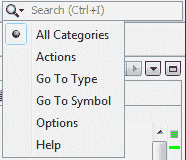

+   **插件管理器：**从**工具 | 插件**，您将有插件管理器，可以添加、删除或更新功能。此外，许多有趣的第三方插件都可以从插件门户网站获得。请注意，您可以从已安装的插件列表中停用或卸载插件（如 CVS、Mercurial 等），这些插件目前并不是您关心的问题，但您可以这样做以释放一些资源，并在需要时重新添加这些插件：

+   **项目管理器：**从**窗口 | 项目**或按*Ctrl+1*，您可以固定 IDE 的**项目管理器**窗格，以对每个可用项目执行操作。项目操作，如运行、调试、测试、生成文档、检查本地历史记录、设置配置和设置项目属性都可以在项目管理器窗口中完成：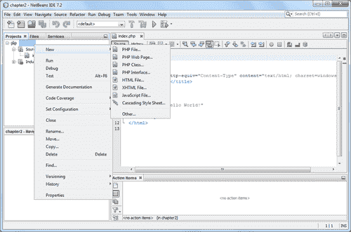

+   **文件管理器：**从**窗口 | 文件**或按*Ctrl+2*，您可以固定 IDE 的**文件管理器**窗格，以浏览项目文件或对 IDE 可用的文件进行一般文件操作：

+   **服务管理器：**从**窗口 | 服务**或按*Ctrl+5*，您可以固定 IDE 的**服务管理器**窗格，以使用预注册的**软件即服务**（**SaaS**）Web 服务组件。从**服务**选项卡中拖动项目，将项目放入资源类中，即可生成访问服务所需的代码。此外，**服务**窗格还可以让您访问所有连接的数据库：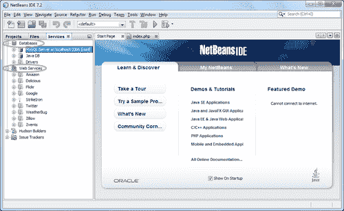

+   **任务管理器：**从**窗口 | 任务**或按*Ctrl+6*，您可以固定 IDE 的**任务管理器**或操作项窗格。NetBeans IDE 会自动扫描您的代码，并列出包含诸如`TODO`或`FIXME`等单词的注释行，以及包含编译错误、快速修复和样式警告的行。连接到 bug 数据库—**Bugzilla**，并在 IDE 中列出项目的问题报告。请注意，双击任务将直接带您到声明该任务的位置：

+   **导航：**从**导航**菜单，IDE 提供了对文件、类型、符号、行、书签等的导航。这些功能用于快速跳转到项目中或项目外所需的位置：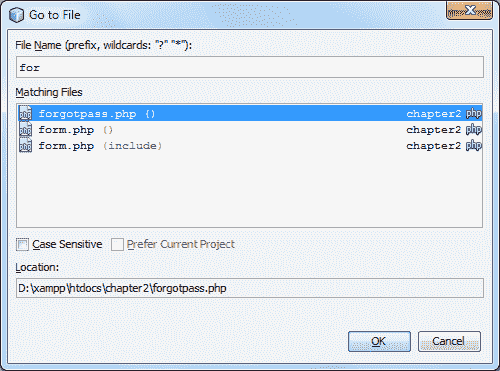

如前一截屏所示，一旦我们输入文件名，IDE 会显示**匹配文件**框中匹配的文件名的动态列表，这样您就可以快速打开该文件：

### 提示

按*Alt+Shift+O*打开**转到文件**，按*Ctrl+O*打开**转到类型**，按*Ctrl+B*打开**转到声明**，按*Ctrl+G*打开**转到行**，等等。

+   **模板和示例应用程序：**您可以在 IDE 中使用给定的示例应用程序开始类似的新项目。要做到这一点，按*Ctrl+Shift+N*开始一个新项目，并从**项目类别**中选择**Samples | PHP**。此外，您可以使用模板，如 PHP 文件的模板和**Tools | Templates**中的网页模板：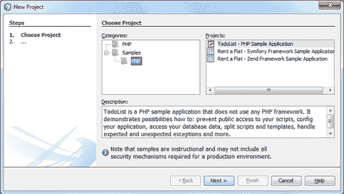

+   **可定制的工作区和窗口：**整个 IDE 工作区是完全可定制的，因此您可以将工具栏和窗格拖动、滑动、调整大小并放置到所需的位置。此外，您可以在工作区内停靠或取消停靠窗格，使其完全适合访问和使用：

### 提示

您可以轻松管理工作区中的窗口；双击编辑器选项卡以展开它。*Ctrl+Tab*显示已打开文件的列表，再次按下将导致在编辑器选项卡之间切换。*Ctrl+Pageup/Down*在已打开的文件之间切换。按*Ctrl+W*关闭当前文件窗口。

+   **多个监视器：**您可以取消停靠任何编辑器选项卡并将其拖出 IDE，使其可以像独立窗口一样运行，并且可以轻松地将其移动到第二个屏幕上。此外，您可以反向操作将其重新停靠在以前的屏幕上。请注意，第二个屏幕中的所有快捷键仍将保持不变；例如，拖出**Files**选项卡，然后单击 IDE 中的其他任何位置，然后按*CTRL+2*重新聚焦文件窗口。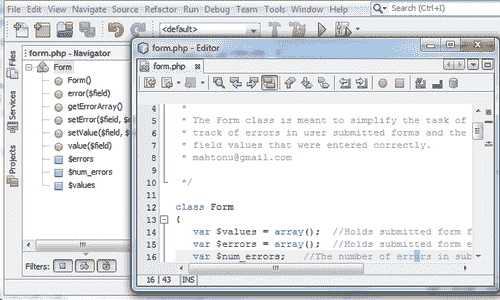

+   **本地历史记录：**本地历史记录类似于经典的版本控制系统，它存储文件的多个版本。但是，存储仅限于您的 NetBeans 安装。本地历史记录使您能够检查文件和文件夹中的内容，让您**diff**它们，最重要的是，让您将源代码回滚到以前的状态，或者恢复已删除的文件或文件夹。

+   **拼写检查器：**检查编辑器中的文本拼写。

### 注意

请参阅 NetBeans IDE 键盘快捷键附录。

## 小测验——熟悉基本 IDE 功能

1.  哪个不是 IDE 功能？

1.  源代码编辑器

1.  调试器

1.  插件管理器

1.  源代码优化器

1.  在哪个菜单下可以启用或聚焦所有 IDE 窗口？

1.  文件菜单

1.  工具菜单

1.  导航菜单

1.  窗口菜单

1.  哪个是打开**转到文件**窗口的正确命令？

1.  CTRL+F

1.  CTRL+SHIFT+O

1.  ALT+SHIFT+O

1.  CTRL+G

1.  为什么使用键盘快捷键*CTRL+SHIFT+N*？

1.  打开一个新的模板文件

1.  打开一个新的 PHP 文件

1.  打开一个新的 PHP 项目

1.  打开项目窗口

1.  修复**文件管理器**窗格的键盘快捷键是什么？

1.  CTRL+1

1.  CTRL+2

1.  CTRL+3

1.  CTRL+5

# 探索 PHP 编辑器

在本节中，我们将学习如何充分利用 NetBeans 中的 PHP 编辑器。编辑器提供非常方便的代码编写功能，我们将通过在编辑器中测试这些重要功能来学习它们。一旦我们熟悉了以下功能，我们就能掌握编辑器。您只需要练习以下功能的命令。我们开始吧：

+   **语法高亮：**此编辑器使语法元素（如 PHP 关键字、变量、常量、HTML 标记和输入表单属性）高亮显示。在编辑器中，当前行用浅蓝色背景标记，发生错误的行用红色下划线显示，如下图所示：

### 提示

双击选择语法元素。按*Ctrl+F*进行语法搜索以突出显示语法元素的所有出现。

+   **转到声明：** **转到声明**功能可立即跳转到变量或方法的声明行，从其出现位置：

### 提示

为了使用此功能，请将光标放在所需的变量或方法上，然后按*Ctrl+B*，或单击出现在屏幕右侧的上下文菜单，选择**导航|转到声明**，将光标放在声明的起始行。按*Ctrl+单击*也会将您引导到声明处，并突出显示所有出现的情况。

+   **代码导航器：** **代码导航器**窗格动态列出文件中的 PHP 结构，按层次顺序列出 HTML 标记；简单地列出文件中的命名空间、函数、方法、类、变量、类属性、HTML 标记等。双击列表中的任何项目以转到该声明：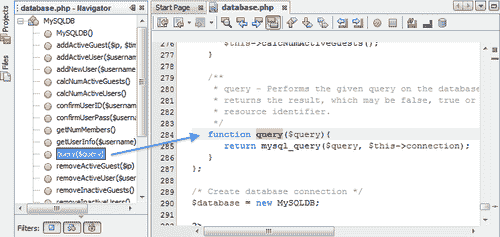

### 提示

从**窗口|导航|导航器**或按*Ctrl+7*，您可以专注于代码导航器窗格。列出的项目根据相关项目属性进行图标化。

+   **代码折叠：**编辑器为您提供了用于类、方法、注释块、HTML 标记、CSS 样式类等的代码块折叠/展开功能。您可以使用这些功能在编辑器左边缘旁边折叠/展开大型代码块，如下面的屏幕截图所示：

### 提示

单击屏幕左侧的“”或“+”按钮，折叠和展开代码块。

+   **智能缩进：**编辑器在键入并按下新行时会在代码之前提供自动缩进：

输入`if`或`for`语句行，然后按*Enter*键以查看下一行缩进。

+   **格式化：**为了使代码更易于理解，编辑器为您提供了格式化功能，该功能维护适当的语句层次结构，并在代码文件中应用换行、空格、缩进等：

### 提示

选择要格式化的代码块。右键单击上下文菜单，选择**格式**，或按*Alt+Shift+F*。要格式化整个代码文件，请选择**源|格式**，或按*Ctrl+A*和*Alt+Shift+F*。

+   **括号补全：**成对字符项的连续第二个字符（例如单引号（''），双引号（""），括号（（）），方括号（[]））会自动添加第一个字符类型，并且成对的连续字符会随着第一个字符的删除而删除。当键入第一个字符并按*Enter*时，大括号{}的一对会被补全。当光标指向匹配对中的任何字符时，大括号、花括号和方括号会以黄色突出显示，如下所示：

+   **参数提示：**编辑器在您开始键入函数名称时会提示您选择 PHP 默认或自定义函数的形式参数。带有函数名称和参数的自动建议列表将显示在光标底部，所选函数的描述将显示在光标顶部：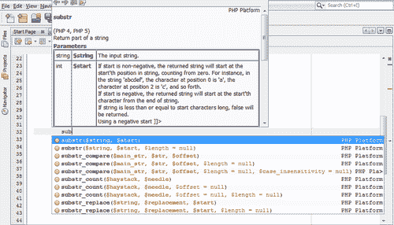

在上一个自动建议列表中，您可以使用“上/下”箭头键进行遍历。您可以按*Enter*键插入带有占位符的所需函数名称，以在括号内插入参数：

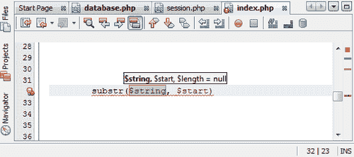

+   **在注释中定义变量类型：**您可以在注释中定义变量及其类型，格式为`/* @var $variable type */`。如果注释编写正确，则`var`标签将以粗体字显示：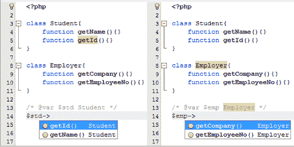

在前面的截图中，您可以看到变量名称和类型的注释如何支配自动建议。在前面的示例中，您可以看到方法名称是从相应的类名称中提取的，该类名称在注释中作为变量类型提到。

键入`vdoc`，然后按`Tab`键使用变量文档的代码模板。将生成一个定义变量的注释。一旦选择了变量名称，更改它，然后再次按`Tab`键，以更改类型：

代码模板会自动生成变量名称和类型，以适应注释位置；也就是说，如果您在使用模板之前使用变量，则它将建议该变量名称和类型。

+   **错误消息：**编辑器在输入时解析您的 PHP 代码，用红色下划线标记语法错误，在左边缘放置红色错误标志，在右边缘放置红色错误滚动位置。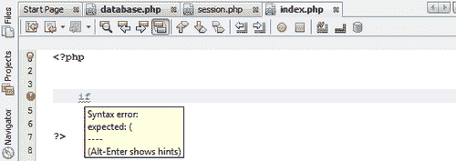

### 提示

您可以通过将鼠标悬停在错误行上或单击屏幕左侧的红色错误标志来查看工具提示中的错误详细信息。按*Alt+Enter*显示错误提示。

请参阅 NetBeans IDE 键盘快捷键附录。

## 弹出测验-探索 PHP 编辑器

1.  哪个功能不是编辑器功能？

1.  源代码格式化

1.  代码自动完成

1.  语法高亮

1.  调试

1.  如何格式化代码块？

1.  通过右键单击上下文菜单选择代码块，然后选择**格式**

1.  选择代码块，然后按*ALT+SHIFT+F*

1.  选择代码块，然后选择**源代码|格式**

1.  以上所有

1.  什么是语法搜索键盘命令？

1.  *CTRL+W*

1.  *CTRL+F*

1.  *CTRL+ALT+F*

1.  *CTRL+SHIFT+S*

1.  如何转到方法的声明？

1.  将光标放在方法上，然后按*CTRL+B*

1.  右键单击方法名称，然后从上下文菜单中选择**导航|转到声明**

1.  在方法名称上按*CTRL+单击*

1.  以上所有

# 更多探索编辑器

我们已经了解了编辑器并练习了提示中给出的快捷方式。在接下来的两节中，我们将学习如何使用重命名重构、代码完成和编辑器的代码生成功能，这些功能对于提高编码非常有帮助。

在下一节中，我们将讨论和练习以下重要的编辑器功能：

+   重命名重构和即时重命名

+   代码完成

+   代码生成器

# 使用重命名重构和即时重命名

您可以在项目中的所有文件中重命名一个元素，例如类名。此功能使您可以预览所需重命名的每个位置的可能更改，并且您可以排除个别出现不被重命名。

即时重命名允许您在文件中重命名元素。对于即时重命名，将光标放在要重命名的名称上，然后按*Ctrl+R*；如果该变量适用于即时重命名，则该变量的所有实例将被突出显示如下：

即使只有一个实例的名称发生变化，也会同时重命名文件中的所有其他实例：

要使用重命名重构，选择要重命名的元素，然后右键单击，选择**重构|重命名**。将打开一个对话框，供您重命名元素，如下一张截图所示：

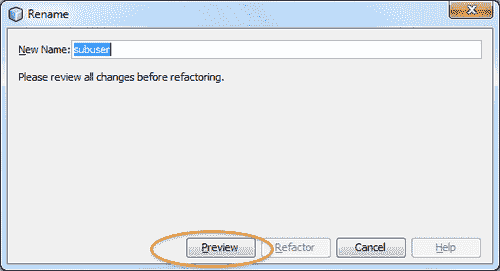

在此截图中，为元素提供一个新名称，然后单击**预览**。重构窗口将打开，并列出项目中元素的所有实例：

从这个截图中，您可以排除实例并对所选实例应用**进行重构**。

### 注意

请参阅 NetBeans IDE 键盘快捷键附录。

## 小测验——使用重命名重构和即时重命名

1.  如何在整个项目中重构变量名？

1.  选择变量，然后右键单击并选择**重构 | 重命名**

1.  将光标放在变量名上，然后按下*CTRL+SHIFT+R*

1.  选择变量，然后选择**源 | 重命名**

1.  以上都不是

1.  哪个是变量的即时重命名快捷键？

1.  *SHIFT+ALT+R*

1.  *CTRL+R*

1.  *CTRL+ALT+R*

1.  *CTRL+SPACE+R*

# 使用代码完成

代码完成功能使我们能够以最少的按键或仅使用键盘命令完成所需的语法、方法或代码。

### 提示

您可以从**工具 | 选项 | 编辑器 | 代码完成**启用/禁用自动代码完成。默认情况下，您将为所有语言都有复选框。从**语言**下拉列表中选择 PHP，以获得更多针对 PHP 的代码完成选项。

以下是编辑器提供的代码完成功能：

+   **片段：**这会自动生成各种元素的代码片段。

选择**工具 | 调色板 | PHP**代码片段，然后**调色板管理器**将打开。从**调色板内容**中拖动相关项目图标，并将其放置到代码中的相关位置。将出现一个对话框，用于指定相应代码项的参数。填写参数，然后在该位置生成代码。

+   **上下文敏感的建议：**编辑器为任意数量的起始符号提供上下文敏感的建议：

+   一个 PHP 关键字，包括`if、else、elseif、while、switch、function`等。

+   一个 PHP 内置函数。

+   预定义或用户定义的变量。

输入关键字或函数名的起始字符，然后按下*Ctrl+Space*。下拉列表将显示该上下文的所有适用建议。每个建议都附有描述和参数提示：

要生成适用于当前上下文的 PHP 关键字列表，请按下*Ctrl+Space*，而不输入任何内容：

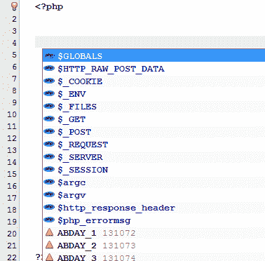

要获取有关变量的提示，请键入美元符号（`$`）。将显示当前可用的本地和全局变量列表：

+   **代码模板和缩写：**通过使用定义的缩写来获取扩展的代码模板，例如`cls`表示类模板，这是最有趣的代码完成功能。要使用此功能，请键入缩写并按下*Tab:*

您可以看到缩写被替换为相应的 PHP 关键字，并且编辑器提供了该关键字的代码模板，如下截图所示：

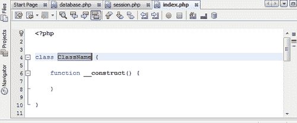

查看代码模板列表及其相关缩写，选择**工具 | 选项 | 编辑器 | 代码**模板。您可以根据以下截图中显示的方式添加/删除或编辑您的 PHP 代码模板：

请注意，编码方法会随着时间而改变。因此，建议每隔几个月查看您的模板，并更新以符合任何新变化。

+   **构造函数中的代码完成：**在`new`关键字之后，将显示代码完成以及当前项目中所有类的构造函数和参数列表：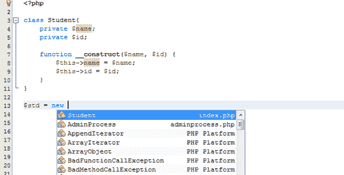

+   **SQL 代码完成：**当字符串以 SQL 关键字（如`select`和`insert`）开头时，按下该关键字后的*Ctrl+Space*将在编辑器内启用 SQL 代码完成功能。您可以在第一步中选择数据库连接，如下面的屏幕截图所示：

+   被选中的所有与 IDE 注册的数据库连接将显示如下：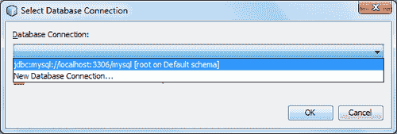

+   选择数据库连接后，SQL 代码完成功能将提供与该连接关联的所有表：

此外，还将从该表中显示列（如果有）。SQL 代码完成还适用于表别名。

+   **PHP 5.3 命名空间：**代码完成支持 PHP 5.3 命名空间。

+   **重写和实现的方法：**类成员之间的代码完成提供了重写或实现方法的选项。

### 提示

在希望使用代码完成的地方按下*Ctrl+Space*。

有关 NetBeans IDE 键盘快捷键，请参见附录。

## 小测验——使用代码完成

1.  为什么要使用代码完成功能？

1.  重构变量

1.  编写新的 PHP 类

1.  完成所需的语法、方法或代码的快捷键

1.  完成 PHP 项目

1.  代码完成功能不支持哪种 PHP 语言特性？

1.  命名空间

1.  类声明

1.  重写方法

1.  以上都不是

1.  启用上下文敏感建议的快捷键是什么？

1.  Ctrl+Shift+Space

1.  Ctrl+Space

1.  Ctrl+S

1.  Ctrl+Alt+Space

# 使用代码生成器

编辑器提供了上下文敏感的代码生成器，以便生成数据库连接、构造函数、getter 或 setter 等。特定的代码生成器将出现在光标位置的上下文中。例如，在类内部，它将显示用于生成构造函数、getter、setter 等的选项。

例如，按*Alt+Insert*在类内部打开所有可能的代码生成器，如下面的屏幕截图所示：

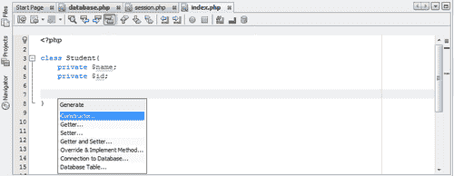

我们将讨论以下代码生成器：

+   **构造函数：**在 PHP 类内（但不在任何方法体内），您可以按*Alt+Insert*打开构造函数生成器。选择**生成构造函数**，将出现类似于以下屏幕截图的对话框：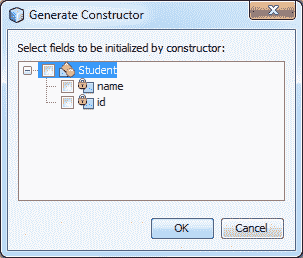

该窗口列出了可以在构造函数中初始化的可用字段。字段名称用作构造函数的参数。您可以决定不选择任何字段；在这种情况下将生成一个空的构造函数。

+   **Getter 和 setter：**通过在 PHP 类内部按代码生成器命令，您可以选择**Getters...，Setters...**或**Getters and Setters**来查看可能的函数。如果您已经有 setter，那么您只会看到 getter 方法：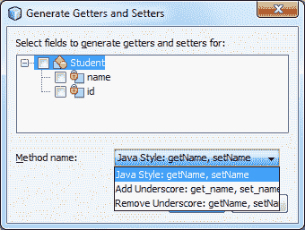

选择**getter/setter**后，出现了上一个屏幕截图；您可以指定要为哪个属性生成**getter**或**setter**方法，并灵活选择方法的命名约定。

+   **重写和实现的方法：**当类内有多个方法时，您可以打开重写和实现方法的代码生成器。对话框将打开，显示您可以插入的方法，并指示它们是重写还是实现：

### 注意

有关 NetBeans IDE 键盘快捷键，请参见*附录*。

## 小测验——使用代码生成器

1.  在 PHP 类内部打开代码生成器的快捷键是什么？

1.  Alt+Insert

1.  Shift+Alt+Insert

1.  Ctrl+ Alt+Insert

1.  Ctrl+Insert

1.  什么不能使用代码生成器生成？

1.  构造函数

1.  Getter 和 setter

1.  重写方法

1.  字符串

# 摘要

在本章中，我们发现了 PHP 编辑器的有用功能，并练习了在编写代码时应用的技巧。熟悉我们所看到的编辑器快捷键将帮助您更快、更准确地编写代码。

我们特别关注了：

+   PHP 编辑器的功能和快捷键

+   重命名重构和即时重命名

+   代码自动完成的使用

+   代码生成器的使用

因此，到目前为止，我们的 PHP 开发环境已经准备就绪。我们已经安装了 IDE，并学会了在需要时如何使用这些酷炫的编辑器功能。在下一章中，我们将直接深入到真实的 PHP 编码中，并将开发一个 PHP 项目，以掌握使用 NetBeans 进行 Web 应用程序开发。
