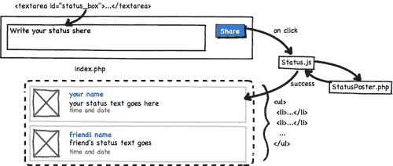
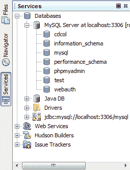
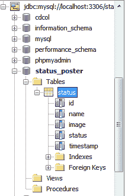
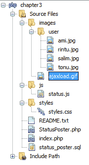

# 第三章：使用 NetBeans 构建类似 Facebook 的状态发布者

> 在本章中，我们将使用 NetBeans IDE 构建一个很酷的 PHP 项目。我们的计划很简单明了。

我们将通过以下步骤创建一个类似 Facebook 的状态发布者：

+   规划项目

+   创建状态流显示列表

+   使用 PHP-AJAX 创建状态发布者

大多数社交网络平台，如 Facebook、Twitter 和 Google Plus，都为用户的朋友提供了状态发布功能，并允许用户查看他们朋友的状态发布。因此，我们将研究这是如何工作的，以及我们如何构建类似的功能。让我们选择实现一个类似最流行的社交网络平台 Facebook 的有趣功能。

此外，我们还将讨论 MySQL 数据库连接和 PHP 类创建以及我们的工作流程。所以，让我们开始吧...

# 规划项目

项目的适当规划对于智能开发和使用样机、图表和流程图至关重要，以便项目可以轻松地可视化需求。此外，它描述了你将要做什么，以及如何做。

我们将创建一个简单的类似 Facebook 的（[`www.facebook.com`](http://www.facebook.com)）状态发布者，并在其下方添加一个列表，以显示朋友的状态发布，以及您自己的状态。在这个单一的前端 PHP 应用程序中，我们将使用 JavaScript 库**jQuery**（[`jquery.com/`](http://jquery.com/)）通过**AJAX**（[`api.jquery.com/jQuery.ajax/`](http://api.jquery.com/jQuery.ajax/)）发布状态。发布的状态将在不重新加载页面的情况下显示在状态堆栈顶部。

在规划我们的项目时，我们将提前查看 Web 应用程序的最终外观，并尝试了解如何将特定功能放置到工作中。为了讨论工作流程的各个要点，我们还将拥有工作流程图。

让我们看看最终阶段我们将要构建的内容。


这个**状态发布者**将以以下方式运行：



根据这个图，用户在状态框中输入并点击“分享”按钮，触发`Status.js`中绑定的 JavaScript 方法，通过 AJAX 将状态发布到服务器。服务器端脚本`StatusPoster.php`接收状态以保存到数据库，并在完成任务后响应成功消息。前端代码接收成功通知，并在状态发布的显示堆栈顶部添加状态。

现在，我们将根据以下两部分拆分项目，并相应地开发它们：

+   状态流显示列表

+   使用 PHP-AJAX 创建状态发布者

我们已经收集了关于项目工作流程的概念。因此，根据我们的规划，我们可以立即开始实施项目。从这一点开始，我们将直接使用 NetBeans 开始 PHP 应用程序开发，创建一个新的 PHP 项目，并熟练使用 IDE。我们知道该做什么，几分钟内我们将学会如何做。

## 理解 JSON-JavaScript 对象表示法

**JavaScript 对象表示法（JSON）**是一种轻量级的数据交换格式，对人类来说易于阅读和编写。它是机器解析和生成的简单格式，基于 JavaScript 编程语言的一个子集。JSON 是一种完全与语言无关的文本格式。

JSON 建立在两种结构上：

+   一组名称/值对：在各种语言中，这被实现为对象、记录、结构、字典、哈希表、键控列表或关联数组。

+   一个有序的值列表：在大多数语言中，这被实现为数组、向量、列表或序列。

例如：

```php
{ "firstName":"John" , "lastName":"Doe" }

```

## 引入 jQuery-权威的 JavaScript 库

jQuery 是一个快速而简洁的 JavaScript 库，简化了 DOM（文档对象模型）遍历、事件处理、动画和快速网页开发的 AJAX 交互。jQuery 旨在改变您编写 JavaScript 的方式-[`jquery.com/`](http://jquery.com/)。

我们应该使用 jQuery 的一些原因如下：

+   免费和开源软件

+   轻量级足迹

+   符合 CSS3 标准

+   跨浏览器

+   最小代码

+   现成的插件

简而言之，jQuery 使您能够生成强大和动态的用户界面。

### 注意

借助各种 jQuery 插件，包括图像滑块、内容滑块、弹出框、选项卡内容等，开发人员的工作可能会减少，因为他们所要做的就是调整或定制 jQuery 插件的小部分，使其与他们的需求相匹配。

## 理解 AJAX-异步 JavaScript 和 XML

**异步 JavaScript 和 XML**（**AJAX**）是一种在客户端使用的编程技术或方法，用于在后台异步地从服务器检索数据，而不干扰现有页面的显示和行为。通常使用`XMLHttpRequest`对象检索数据。尽管有这个名字，实际上并不需要使用 XML，请求也不需要是异步的。

jQuery 库具有完整的 AJAX 功能。其中的函数和方法允许我们从服务器加载数据，而无需刷新浏览器页面。

## 介绍 jQuery.ajax()

让我们看一下示例`jQuery.ajax()` API。

```php
$.ajax({
url: "my_ajax_responder.php",
type: "POST",
data: {'name': 'Tonu'}, //key value paired or can be like "call=login&name=Tonu"
success: function(xh){
//success handler or callback
},
error: function(){
//error handler
}
});

```

在`$.ajax()`函数中，可以看到 AJAX 配置对象（使用 JavaScript 对象文字创建）被传递给它，这些配置可以描述如下：

+   `url`表示与之通信的服务器脚本的 URL

+   `type`表示 HTTP 请求类型；即`GET/POST`

+   `data`包含要发送到服务器的数据，可以是键值对或 URL 参数的形式

+   `success`保存 AJAX 成功回调或在获取数据时执行的方法

+   `error`保存 AJAX 错误回调

现在，让我们再举一个例子，`jQuery.ajax()`只是从服务器加载一个 JavaScript 文件：

```php
$.ajax({
type: "GET",
url: "test.js",
dataType: "script"
});

```

在这里，`dataType`定义了要从服务器检索的数据类型；这种类型可以是 XML、JSON、`script`、纯文本等。

## 介绍 PHP 数据对象（PDO）

**PHP 数据对象**（**PDO**）扩展定义了一个轻量级和一致的接口，用于在 PHP 中访问数据库。PDO 提供了一个数据访问抽象层，这意味着无论您使用哪个数据库，您都可以使用相同的函数来发出查询和获取数据。PDO 不提供数据库抽象；它不重写 SQL 或模拟缺失的功能。如果您需要该功能，应该使用完整的抽象层。

值得一提的是 PDO 支持预处理语句，即：

+   **更安全：**PDO 或底层数据库库将为您处理绑定变量的转义。如果始终使用预处理语句，您将永远不会受到 SQL 注入攻击的威胁。

+   **（有时）更快：**许多数据库将为预处理语句缓存查询计划，并使用符号引用预处理语句，而不是重新传输整个查询文本。如果您只准备一次语句，然后使用不同的变量重用预处理语句对象，这一点最为明显。

### 注意

PHP 5.3 内置了 PDO 和 PDO_MYSQL 驱动程序。更多信息请访问[`www.php.net/manual/en/book.pdo.php`](http://www.php.net/manual/en/book.pdo.php)。

## 创建 NetBeans PHP 项目

完成任务规划后，我们将处理其实际实施。

按下*Ctrl+Shift+N*开始新的 NetBeans PHP 项目，并按照第一章中已经讨论过的步骤创建新项目，*设置开发环境*。让我们将项目命名为`chapter3`，用于我们的教程。

当我们创建了 PHP 项目时，项目中将自动创建`index.php`文件。因此，可以通过将浏览器指向`http://localhost/chapter3/`来定位项目。

# 创建状态流显示列表

根据项目的第一部分，我们现在将创建状态流显示列表。为了做到这一点，我们需要一个 PHP 类和一个 MySQL 数据库，其中填充了一些代表状态帖子的虚拟数据。PHP 类`StatusPoster.php`将在其构造函数中包含使用 PDO 的 MySQL 数据库连接，并包含一个从数据库中提取状态条目的方法。

## 设置数据库服务器

为了从数据库中存储和检索状态帖子，我们连接到 MySQL 数据库服务器，创建数据库和表以插入状态条目，并获取这些条目以在状态流中显示。

# 执行操作-连接到 MySQL 数据库服务器

在本节中，我们将通过向 IDE 提供访问凭据来创建 MySQL 服务器连接，IDE 将在连接下显示可用数据库的列表：

1.  首先，我们将在 IDE 内创建 MySQL 数据库服务器连接；按下*Ctrl+5*将**服务**窗口置于焦点，展开**数据库**节点，在**MySQL 数据库服务器**上右键单击，并选择**属性**以打开**MySQL 服务器属性**窗口，如下面的屏幕截图所示：

在上一个屏幕截图中，IDE 已经填写了 MySQL 服务器详细信息的默认值，如主机名、端口号、用户名和您刚刚添加的密码。您可以随时更新这些详细信息。

1.  单击**管理属性**选项卡，允许您输入控制 MySQL 服务器的信息。单击**确定**按钮以保存设置。

1.  现在，您应该在**MySQL 服务器**节点下列出所有可用的数据库，如下面的屏幕截图所示：

## 刚刚发生了什么？

我们已成功连接到 MySQL 服务器，并列出了为提供的数据库用户提供的所有可用数据库。实际上，我们使得可以从 IDE 直接快速操作任何类型的数据库查询。现在，我们将在其中创建一个新的数据库和表。

### 注意

有关 NetBeans IDE 键盘快捷键，请参见*附录*。

## 创建数据库和表

为每个项目使用单独的数据库是一种常见做法。因此，我们将为我们的项目使用一个新的数据库，并创建一个表来存储条目。IDE 提供了出色的 GUI 工具，用于数据库管理，如 SQL 编辑器、查询输出查看器和带有列列表的表查看器。

# 执行操作-创建 MySQL 数据库和表

从**MySQL 服务器**节点，我们将创建一个新的数据库，并运行一个查询来创建表以及必要的列字段。

1.  从**服务**窗口，在**MySQL 服务器**节点上右键单击，并选择**创建数据库...**。将出现一个新的对话框，如下面的屏幕截图所示：

1.  在**新数据库名称**字段中输入名称`status_poster`。不要选中**授予**的复选框。您可以使用此复选框和下拉列表向特定用户授予权限。默认情况下，`admin`用户拥有所有权限。

1.  单击 **OK**，使新数据库列在服务器节点下列出，并且在 **Databases** 节点下创建新的数据库连接节点，如下图所示：

根据这个屏幕截图，在 status_poster 连接节点下有三个子文件夹——**Tables, Views,** 和 **Procedures**。

1.  现在，要在我们的数据库中创建一个新表，右键单击 **Tables** 文件夹，选择 **Execute Command...** 打开主窗口中的 **SQL Editor** 画布，如下所示：

1.  在 SQL 编辑器中，输入以下查询来创建新的 `Status` 表：

```php
CREATE TABLE `status` (
`id` bigint(20) NOT NULL AUTO_INCREMENT,
`name` varchar(50) NOT NULL,
`image` varchar(100) NOT NULL,
`status` varchar(500) NOT NULL,
`timestamp` int(11) unsigned NOT NULL,
PRIMARY KEY (`id`)
) ENGINE=MyISAM DEFAULT CHARSET=utf8;

```

正如你所看到的，在 `status` 表中，我们有 `id`（每个条目都会自动增加）作为主键。我们有 `name` 字段，可以存储长达 `50` 个字符的用户名称。`image` 字段将存储长达 `100` 个字符的用户缩略图像。状态字段将存储最多 500 个字符的用户状态帖子，而 `timestamp` 字段将跟踪状态发布的时间。数据库引擎选择了 `MyISAM` 以提供更快的表条目。

因此，你只需要在 NetBeans 查询编辑器中输入 MySQL 查询，并运行查询，就可以准备好你的数据库。

1.  要执行查询，可以单击顶部任务栏上的 **Run SQL** 按钮（*Ctrl+Shift+E*），或者在 SQL 编辑器中右键单击并选择 **Run Statement**。IDE 然后在数据库中生成状态表，并在 **Output** 窗口中收到类似以下消息：

1.  你还会在 `status_poster` 数据库连接下的 **Table** 子文件夹中看到你的表状态，如下图所示：

在这个屏幕截图中，扩展的状态表显示了创建的列，主键用红色标记。

## 刚才发生了什么？

IDE 显示了数据库管理功能；只需点击几下和按几下键就可以完成所有这些数据库和表的创建。可以在 IDE 中迅速运行查询，并且 SQL 命令的执行输出会显示在一个单独的窗口中。接下来，我们将向创建的表中插入一些示例条目，以在状态流列表中显示它们。我们还需要为本教程添加一些演示用户图像文件。

### 提示

你可以使用 **Database Explorer** 中的 **Create Table** 向导来创建表——右键单击 **Tables** 节点，选择 **Create Table**。**Create Table** 对话框会打开，你可以在其中为表添加具体属性的列。

### 注意

查看 *附录* 以获取 NetBeans IDE 键盘快捷键。

## 将示例行插入表中

右键单击 **Tables** 子文件夹下的 `status` 表，选择 **Execute Command...**，在 SQL 编辑器中输入以下查询，向 `status` 表中插入一些示例行：

```php
INSERT INTO `status` VALUES('', 'Rintu Raxan', 'rintu.jpg', 'On a day in the year of fox', 1318064723);
INSERT INTO `status` VALUES('', 'Aminur Rahman', 'ami.jpg', 'Watching inception first time', 1318064721);
INSERT INTO `status` VALUES('', 'Salim Uddin', 'salim.jpg', 'is very busy with my new pet project smugBox', 1318064722);
INSERT INTO `status` VALUES('', 'M A Hossain Tonu', 'tonu.jpg', 'Hello this is my AJAX posted status inserted by the StatusPoster PHP class', 1318067362);

```

你可以看到我们有一些 MySQL `INSERT` 查询来存储一些测试用户的数据，比如姓名、图片、状态帖子和 Unix 时间戳，用于状态流显示列表。每个这样的 `INSERT` 查询都会向 `status` 表中插入一行。

因此，我们的表中有一些示例行。为了验证记录是否已添加到 `status` 表中，右键单击 `status` 表，选择 **View Data...**。在主窗口中会打开一个新的 SQL 编辑器选项卡，其中包含 `select * from status` 查询。执行此语句将在主窗口的下部区域生成一个表格数据查看器，如下图所示：


这个 SQL 查询相当不言自明，其中使用`SELECT`关键字从表中选择数据，并使用 SQL 简写`-*`表示应从表中选择所有列。

## 添加示例用户图像文件

在本教程中，我们已经向`status`表中插入了一些示例行；在`image`列中，我们有一些用户图像文件名，实际上我们将它们存储在项目的`images`目录下的`user`文件夹中。这些示例用户图像可以在本章的项目源代码中找到。从 Packt Publishing 网站下载完整的项目源代码，并复制示例用户图像。

要在`project`文件夹内创建一个子文件夹，在`chapter3`项目节点上右键单击，然后选择**新建|文件夹...**；在**新建文件夹**对话框中输入文件夹名称`images`，然后单击**完成**以创建文件夹。现在以相同的方式在`images`目录下创建另一个名为"user"的文件夹，并将复制的示例用户图像文件放在那里。

## 创建 StatusPoster PHP 类

`StatusPoster` PHP 类的目的是查询数据库以获取和插入状态条目。该类的一个方法将用于将状态条目插入到数据库表中，另一个方法将用于执行从表中获取条目的操作。简而言之，该类将作为数据库代理，并可用于必要的数据库操作。

# 操作时间-创建类，添加构造函数和创建方法

我们将使用 NetBeans 代码模板创建`StatusPoster.php`文件和类骨架，并在类内创建方法时，我们也将使用`function`模板。我们将在类构造函数中使用 PDO 创建 MySQL 数据库连接，以便在实例化对象和`getStatusPosts()`方法时创建数据库连接以从表中获取状态帖子。

1.  从**项目**窗格中，右键单击项目名称`chapter3`，选择**新建|PHP 文件...**，并将文件命名为`StatusPoster`，如下截图所示：

1.  单击**完成**，将文件添加到我们的项目中，并自动在编辑器中打开。您将看到文件中放置了 PHP 起始和结束标记。

1.  为了创建 PHP 类的骨架，我们将使用 PHP 代码模板。我们输入`cls`并按下*Tab*键，以获得包含构造函数的类骨架，如下所示：

1.  在上述截图中，`classname`已经被选中。您只需输入`StatusPoster`作为`classname`的值，并按下*Tab 键*选择构造函数名称，如下截图所示：

构造函数名称保持不变，因为它是默认的 PHP 5 构造函数命名约定。

1.  现在，添加一些类常量和属性来保存数据库凭据，如下面的代码片段所示：

```php
class StatusPoster {
private $db = NULL;
const DB_SERVER = "localhost";
const DB_USER = "root";
const DB_PASSWORD = "root";
const DB_NAME = "status_poster";
public function __construct() {
}
}

```

您可以看到添加的类常量，其中包含数据库信息，如数据库服务器名称、用户名、密码和数据库名称。已添加了一个`private`类变量`$db`，用于在 PDO 对象中保存数据库连接。您可以根据自己的需求修改这些常量。

### 注意

**Private:** 此属性或方法只能被类或对象使用；它不能在其他地方访问。

1.  为了从`status`表中获取状态帖子，我们将在类中添加一个名为`getStatusPosts`的空方法。为此，输入`fnc`并按*Tab*以生成具有所选函数名称的空函数代码。这次输入所选的函数名称为`getStatusPosts`，并且不要放入参数`$param`变量。我们的类框架将类似于以下内容：

```php
class StatusPoster {
private $db = NULL;
const DB_SERVER = "localhost";
const DB_USER = "root";
const DB_PASSWORD = "root";
const DB_NAME = "status_poster";
public function __construct() {
}
public function getStatusPosts() {
}
}

```

我们已经准备好了类的框架，并且将在这些类方法中添加代码。现在，我们将在构造函数中创建数据库连接代码。

1.  要使用 PDO 连接 MySQL，将以下行输入类构造函数中，使其看起来类似于以下代码片段：

```php
public function __construct() {
$dsn = 'mysql:dbname='.self::DB_NAME.';host='.self::DB_SERVER;
try {
$this->db = new PDO($dsn, self::DB_USER, self::DB_PASSWORD);
} catch (PDOException $e) {
throw new Exception('Connection failed: ' . $e->getMessage());
}
return $this->db;
}

```

`public function __construct()`使用 PDO 连接到 MySQL 数据库-以 PDO 实例的形式存储在类的私有变量中。

`$dsn`变量包含**数据源名称（DSN）**，其中包含连接到数据库所需的信息。使用 PDO 的最大优势之一是，如果我们想要迁移到其他 SQL 解决方案，那么我们只需要调整 DSN 参数字符串。

以下行创建了一个 PDO 实例，表示与请求的数据库的连接，并在成功时返回一个 PDO 对象：

```php
$this->db = new PDO($dsn, self::DB_USER, self::DB_PASSWORD);

```

请注意，如果尝试连接到请求的数据库失败，它会抛出一个`PDOException`异常。

1.  为了从表中选择状态帖子，我们将在`getStatusPosts`方法中使用自动完成代码编写一个`select`查询。正如我们在上一章中讨论的那样，SQL 代码自动完成从 SQL 关键字`SELECT`开始，通过按下*Ctrl+空格*。因此，我们将按照这些步骤进行，并在这个方法中编写以下查询代码：

```php
public function getStatusPosts() {
$statement = $this->db->prepare("SELECT name, image, status, timestamp FROM status ORDER BY timestamp DESC,id");
$statement->execute();
if ($statement->rowCount() > 0) {
return $statement->fetchAll();
}
return false;
}

```

通过这段代码，我们从表 status 中选择了列（`name, image, status`和`timestamp`），按时间戳降序排列。我们还按默认情况选择了 id 按升序排列。`prepare()`方法准备要由`PDOStatement::execute()`方法执行的 SQL 语句。在`execute()`方法之后，如果找到行，则它会获取并返回所有表条目。

1.  现在，我们将在文件底部实例化这个类的对象，使用以下行：

```php
$status = new StatusPoster();

```

## 刚才发生了什么？

PDO 实例是在类构造函数中创建的，并存储在`$db`变量中，因此其他成员方法可以访问这个类变量作为`$this->db`，以使用 PDO 方法，如`prepare(), execute()`。

调用`PDO::prepare()`和`PDOStatement::execute()`来执行多次的语句可以通过缓存查询计划和元信息等优化性能。

到目前为止，我们在`StatusPoster.php`中准备好了我们的数据库操作代码。我们将创建一个 HTML 用户界面，以显示从数据库表 status 中获取的状态列表。

### 注意

查看*附录*以获取 NetBeans IDE 的键盘快捷键。

## 小测验-理解 PDO

1.  哪一个不是 PDO 的特性？

1.  准备语句

1.  绑定值

1.  绑定对象

1.  数据访问抽象

## 启动用户界面以显示状态列表

HTML 用户界面将显示由`StatusPoster`类的`getStatusPosts`方法检索的状态列表，并且用户将能够查看来自他的测试朋友以及他自己的帖子的状态列表。界面将使用 jQuery 和由 CSS 类样式化的状态列表。

# 行动时间-向文档添加 CSS 支持

我们将使用`index.php`作为应用程序的单页面界面，并将向文档添加 CSS 样式表支持。为了保持实践，我们将尝试将样式属性放入类中，以便它们变得可重用，并且可以在需要特定样式类的元素的类名中使用。因此，让我们首先创建 CSS 类：

1.  在我们的项目源目录中创建一个名为`styles`的文件夹，用于我们的 CSS 文件。

1.  为了创建一个**级联样式表**，其中包含 CSS 类，右键单击项目中的`styles`文件夹，从**新级联样式表**对话框中选择**新建|级联样式表**，将 CSS 文件命名为`styles.css`，然后点击**完成**。删除已打开的 CSS 文件中的所有注释和代码块。在 CSS 文件中键入以下样式类：

```php
body {
font-family:Arial,Helvetica,sans-serif;
font-size:12px;
}
h1,input {
color:#fff;
background-color:#1A3C6C;
}
h1,input,textarea,.inputbox,.postStatus {
padding:5px;
}
input,textarea,ul li img,.inputbox {
border:1px solid #ccc;
}
ul li {
width:100%;
display:block;
border-bottom:1px solid #ccc;
padding:10px 0;
}
ul li img {
padding:2px;
}
.container {
width:60%;
float:none;
margin:auto;
}
.content {
padding-left:15px;
}
.content a {
font-weight:700;
color:#3B5998;
text-decoration:none;
}
.clearer {
clear:both;
}
.hidden {
display:none;
}
.left {
float:left;
}
.right {
float:right;
}
.localtime {
color:#999;
}
.inputbox {
height:70px;
margin:15px 0;
}
.inputbox textarea {
width:450px;
height:50px;
overflow:hidden;
}
.inputbox input {
margin-right:30px;
width:50px;
}

```

我们将使用`container`类来在文档主体内的应用程序界面容器`<div>`上应用样式；`ul` li 将表示列出的项目，这些项目是具有父`ul`元素的状态`li`项目，以及其他 HTML 元素，如 h1、`img`和`textarea`，也使用 CSS 类进行样式设置。

1.  在`index.php`文件的顶部添加以下 PHP 代码片段：

```php
<?php
define('BASE_URL', 'http://localhost/chapter3/');
?>

```

我们已经为 Web 应用程序定义了一个 PHP 常量来定义基本 URL。基本 URL 可用于为项目资产文件（CSS 或 JS 文件）提供绝对路径。您可以在[第三章]（ch03.html“第三章。使用 NetBeans 构建类似 Facebook 的状态发布者”）的位置放置您的项目目录名称。

1.  现在，在`<title>`标签下的`index.php`文档标题中添加以下行，以包含 CSS 文件。

```php
<link href="<?=BASE_URL?>styles/styles.css" media="screen" rel="stylesheet" type="text/css" />

```

有了这行，我们已将 CSS 文件嵌入到我们的 HTML 文档中。在这里，`BASE_URL`告诉我们`styles/styles.css`文件在项目目录下可用。因此，我们的界面元素将继承`styles.css`文件的样式。

## 刚刚发生了什么？

为了在各种浏览器上保持一致的界面，使用 CSS 类对各种 HTML 元素进行了样式设置，并且一些类是从分配元素将继承样式的位置编写的。

为了将 CSS 代码保持在最小行数，逗号分隔的类或元素名称已用于共享公共属性，如下所示：

```php
h1, input, textarea, .inputbox, .postStatus{
padding:5px;
}

```

在这里，`padding:5px`样式将应用于所述元素或具有给定类的元素。因此，类之间的共同属性可以通过这种方式减少。

为了理解类的可重用性问题，让我们看一下以下内容：

```php
.left {
float:left;
}

```

我们可以使用`left`作为多个元素的类名，这些元素需要`float:left`样式，例如`<div class="left">，`等。

# 行动时间-添加 jQuery 支持和自定义 JS 库

我们将为文档添加 jQuery（一个 JavaScript 库；更多信息请访问[`jquery.com/)`](http://jquery.com/)）支持，并创建基于 jQuery 的自定义 JS 库。

对于 JS 库，我们将创建一个单独的 JavaScript 文件`status.js`，其中将包含界面 JS 代码以执行界面任务，例如通过 AJAX 发布状态以及一些用于显示本地日期时间的实用方法。因此，让我们创建我们的自定义 JS 库：

1.  从谷歌内容交付网络（CDN）添加 jQuery 支持到我们的文档中，在`index.php`文档标题下的`<link>`标签之后添加以下行：

```php
<script src= "http://ajax.googleapis.com/ajax/libs/jquery/1.7/jquery.min.js">
</script>

```

有了这行，我们就可以从 CDN 获取最新的 jQuery 版本。请注意，版本 1.7 表示最新可用版本，即 1.7.X，除非您已指定确切的数字，即 1.7.2 或更高版本。现在，我们的文档已启用 jQuery，并准备使用 jQuery 功能。

1.  要创建基于 jQuery 的自定义 JS 库，请在`js`文件夹中添加一个新的 JavaScript 文件，并将其命名为`status.js`。将文件包含在文档头部，使得`<head>`标签看起来类似于以下代码片段：

```php
<head>
<meta http-equiv="Content-Type" content="text/html; charset=UTF-8">
<title>Status updater</title>
<link href="<?=BASE_URL?>styles/styles.css" media="screen" rel="stylesheet" type="text/css" />
<script src="http://ajax.googleapis.com/ajax/libs/jquery/1.7/jquery.min.js"></script>
<script src="<?=BASE_URL?>js/status.js"></script>
</head>

```

1.  现在，在`status.js`文件中创建`Status` JS 库骨架，如下所示：

```php
$(document).ready(function ($)
{
var Status = {
};
});

```

您可以看到变量`Status`包含一个使用 JavaScript 对象文字（在大括号内封闭的键值对）的对象。

```php
var obj = { a : function(){ }, b : function(){ } }

```

请注意，库代码被包装在 jQuery `$(document).ready()`函数中。

1.  让我们在`status`对象内编写一些实用的 JavaScript 方法，并键入以下`currentTime()`方法：

```php
currentTime: function (timestamp) {
if (typeof timestamp !== 'undefined' && timestamp !== '')
var currentTime = new Date(timestamp * 1000);
else
var currentTime = new Date();
var hours = currentTime.getHours();
var minutes = currentTime.getMinutes();
var timeStr = '';
if (minutes < 10) {
minutes = "0" + minutes
}
timeStr = ((hours > 12) ? (hours - 12) : hours) + ":" + minutes + ' ';
if (hours > 11) {
timeStr += "PM";
} else {
timeStr += "AM";
}
return timeStr;
},

```

`currentTime()`方法返回从 Unix 时间戳转换的本地时间。请记住，如果时间戳不存在，则返回当前本地时间。示例输出可能是上午 3:22 或下午 2:30。

您可以看到在`var currentTime = new Date(timestamp * 1000);`这一行中，Unix 时间戳已经转换为毫秒级的 JS 时间戳，并创建了一个新的 Date 对象。小时和分钟分别从`currentTime.getHours()`和`currentTime.getMinutes()`方法中获取。请注意，`currentTime()`方法用逗号（,）分隔。

1.  将`currentDate()`方法添加到`Status`对象中，如下所示：

```php
currentDate: function (timestamp) {
var m_names = ["January", "February", "March", "April", "May", "June", "July", "August", "September", "October", "November", "December"];
if (typeof timestamp !== 'undefined' && timestamp !== '')
var d = new Date(timestamp * 1000);
else
var d = new Date();
var curr_date = d.getDate();
var curr_month = d.getMonth();
var curr_year = d.getFullYear();
var sup = "";
if (curr_date === 1 || curr_date === 21 || curr_date === 31)
{
sup = "st";
}
else if (curr_date === 2 || curr_date === 22)
{
sup = "nd";
}
else if (curr_date === 3 || curr_date === 23)
{
sup = "rd";
}
else
{
sup = "th";
}
return m_names[curr_month] + ' ' + curr_date + sup + ', ' + curr_year;
},

```

`currentDate()`方法返回转换后的本地日期。与`步骤 4`中的先前方法类似，它从 Date 对象中获取日期、月份和年份。

1.  现在，添加`getLocalTimeStr()`方法如下：

```php
getLocalTimeStr: function (gmtTimestampInSec) {
return 'at ' + this.currentTime(gmtTimestampInSec)
+ ' on ' + this.currentDate(gmtTimestampInSec);
}

```

上述方法返回连接的格式化时间和日期字符串。

## 刚刚发生了什么？

jQuery 为我们提供了一个称为`ready`的文档对象上的特殊实用程序，允许我们在 DOM 完全加载完成后执行代码。使用`$(document).ready()`，我们可以排队一系列事件，并在 DOM 初始化后执行它们。`$(document).ready()`方法接受一个函数（匿名）作为其参数，该函数在 DOM 加载完成后被调用，并执行函数内的代码。

如果您正在开发用于分发的代码，始终重要的是要补偿任何可能的名称冲突。因此，我们将`$`作为匿名函数的参数传递。这个`$`在内部指的是`jQuery`，因此在脚本之后导入的其他`$`函数不会发生冲突。

最后，为了从 UNIX 时间戳获取本地日期和时间，我们在自定义 JavaScript 库中添加了实用方法。至于用法示例，`currentDate()`实用方法可以从对象的内部和外部范围分别调用为`this.currentDate()`和`Status.currentDate()`。

# 操作时间-显示状态列表

我们将把接口元素放在`index.php`中，并以适当的方式嵌入 PHP 代码。因此，让我们按照以下步骤进行：

1.  修改`index.php`文件，在`<body>`标记内，删除 PHP 标记，并将状态条目放在`<div>`容器标记和元素中，如下所示：

```php
<body>
<div id="container" class="container">
<h1>Status Poster</h1>
<ul>
</ul>
</div>
</body>

```

从这段代码中，您可以看到我们的应用程序界面将位于 id 为 container 的`<div>`容器内，`<ul>`标记将保存内部`<li>`项的堆栈，其中包含用户的状态帖子，这些帖子将由一些 PHP 代码填充。

1.  在`index.php`文件的`<!DOCTYPE html>`标记上方的顶部 PHP 代码片段中，键入以下行，以集成`StatusPoster`类，使代码片段看起来类似于以下内容：

```php
<?php
require_once 'StatusPoster.php';
$result = $status->getStatusPosts();
define('BASE_URL', 'http://localhost/chapter3/');
?>

```

从代码中，一次需要 PHP 类文件来集成类，并在我们的应用程序中使用其实例。在这一行，我们调用了`$status`对象的`getStatusPosts()`方法，以从数据库中获取所有状态条目，并将返回的结果数组存储到`$result`中。

1.  为了显示状态流，我们将编写以下 PHP 代码，以在`<ul>`标记内循环遍历`$result`数组：

```php
<?php
if (is_array($result))
foreach ($result as $row) {
echo '
<li>
<a href="#">

</a>
<div class="content left">
<a href="#">' . $row['name'] . '</a>
<div class="status">' . $row['status'] . '</div>
<span class="localtime" data-timestamp="' . $row['timestamp'] . '"></span>
</div>
<div class="clearer"></div>
</li>
';
}
?>

```

首先，对`$result`数组进行了正确类型的验证。我们循环遍历数组，将每个条目放入`$row`变量中。前面的服务器脚本为每个状态条目生成一个`<li>`项，每个`<li>`项包含一个用户图像、一个超链接名称、一个用户状态文本和一个 UNIX 时间戳元素。请注意，时间戳已经转储到具有类名`localtime`的`span`元素的`data-timestamp`属性中。为了更好地理解，状态列表的项目骨架如下图所示：


1.  现在，我们需要在 DOM 准备就绪时使用 jQuery 代码转换`data-timestamp`属性中的 PHP 转储时间戳。在`status.js`库的`Status`对象中添加以下方法：

```php
showLocalTime: function () {
var spans = $('span.localtime[data-timestamp]');
spans.each( function () {
var localTimeStr = Status.getLocalTimeStr( $(this).attr('data-timestamp') );
$(this).html(localTimeStr);
});
},

```

使用 jQuery 选择器的方法选择所有具有`data-timestamp`属性的 span 元素为`$('span.localtime[data-timestamp]');`。对于每个元素，它使用`$(this).attr('data-timestamp')`解析时间戳，并传递给`Status.getLocalTimeStr()`以获取本地时间字符串。最后，它将每个`span`元素的内部 HTML 设置为该本地时间字符串。

1.  为了使`Status.showLocalTime()`立即与 DOM 一起工作，调用该方法，如下所示，在`ready()`方法的终止行之前：

```php
$(document).ready(function ($)
{
var Status = {
//whole library methods...
};
Status.showLocalTime();
});

```

因此，用户将在每个帖子下显示其本地日期和时间。

1.  最后，指向项目 URL 的浏览器，或者从工具栏中按下**运行项目（第三章）**按钮，或者从 IDE 中按下*F6*，以显示状态流显示列表，看起来类似于以下屏幕截图：

## 刚刚发生了什么？

PHP 脚本将`<li>`项转储到`<ul>`标记中，界面 JS 代码`Status.showLocalTime()`；解析转储的时间戳，并在 DOM 准备就绪时以用户的本地时间显示它。如果我们显示 UNIX 时间戳的日期和时间而不进行时区转换，那么我们可能需要提供服务器的日期和时间，这可能不符合用户的时间。再次，用户的本地时区对服务器来说是未知的，对客户端界面来说是已知的。因此，我们以一种快速的方式使用客户端代码来解决本地时间显示问题。

因此，我们已经完成了项目的第一部分。我们已经创建了一个界面，状态流看起来像 Facebook。

到目前为止，我们已经能够使用 IDE 处理数据库操作，并使用 NetBeans 代码模板创建 PHP 类和方法，我们还能够为我们的 Web 应用程序创建必要的用户界面文件。

## 尝试一下-调整 CSS

对于较大的状态帖子，界面可能会在每个`<li>`内部找到破损，因此最好修复用户界面问题。您可以在相应的 CSS 文件中的`.content`类中添加固定宽度。

## 小测验-理解 CSS

1.  CSS 代表什么？

1.  级联样式表

1.  级联样式表

1.  多彩样式表

1.  计算机样式表

1.  引用外部样式表的正确 HTML 格式是什么？

1.  `<link rel="stylesheet" type="text/css" href="mystyle.css">`

1.  `<style src="mystyle.css">`

1.  `<stylesheet>mystyle.css</stylesheet>`

1.  需要添加到 CSS 类中的属性是什么，以在该元素周围留出一些空间？

1.  `填充`

1.  `边距`

1.  `padding-bottom 和 padding-top`

1.  `显示`

# 使用 PHP-AJAX 孵化状态发布者

用户的状态文本应该在不重新加载页面的情况下提交到服务器。为此，我们可以使用 AJAX 方法，其中用户的数据可以使用 HTTP 方法发送到服务器，并等待服务器的响应。一旦服务器响应，我们可以以编程方式解析响应数据，并可能做出我们的决定。在我们的情况下，如果服务器以成功结果响应，我们将根据此更新我们的界面 DOM。

简单地说，我们将使用 AJAX 将用户的状态文本提交到位于`index.php`的服务器端 PHP 代码，使用`HTTP POST`方法，并配置从服务器期望的数据类型为 JSON。因此，我们可以轻松解析 JSON 并确定状态是否成功保存。从成功的服务器响应中，我们可以更新状态流显示列表，并将新发布的状态放在该列表的顶部。但是，在任何失败或错误的情况下，我们也可以解析错误消息并将其显示在界面中。

# 行动时间-向界面添加状态输入框

在本节中，我们将简单地添加一个 HTML 表单，其中包含一个文本区域用于状态发布，以及一个用于表单提交的**提交**按钮。我们将在`index.php`的`<ul>`标签之前添加包含`div`元素的表单。

1.  为了添加状态发布框，我们将在`div#container`内添加以下 HTML 代码，位于`<ul>`标签之前：

```php
<div class="inputbox">
<form id="statusFrom" action="index.php" method="post" >
<textarea name="status" id="status_box">Write your status here</textarea>
<input class="right" type="submit" name="submit" id="submit" value="Share" />
<div id="postStatus" class="postStatus clearer hidden">loading</div>
</form>
</div>

```

因此，`div.inputbox`将包含带有`share`或`submit`按钮的状态输入框。`div#postStatus`将显示发布提交进度信息状态，以传达状态是否成功发布。在 AJAX 发布进行中，我们将使用一些花哨的加载`.gif`图像。`ajaxload.gif`图像也保存在项目的`images`目录中。

1.  现在，使用项目 URL 刷新您的浏览器，状态输入框应该看起来与以下截图类似：

## 刚刚发生了什么？

查看`form`标签打开的行，`<form id="statusFrom" action="index.php" method="post" >`。可以使用 jQuery 选择包含脚本名称为`index.php`的`action`属性的`id`属性选择表单，这意味着它将被发布到我们正在工作的同一文件。您可以看到`method`属性包含表单将被提交的 HTTP 方法类型。我们不需要 jQuery 代码的`action`和`method`属性。相反，在这种情况下，我们将保留它们。如果浏览器的 JavaScript 被禁用，那么我们仍然可以以`POST`方法提交表单到`index.php`。

请注意，`div#postStatus`默认使用 CSS 类`hidden`隐藏，并且只有在 AJAX 工作进行中时才会可见。

### 注意

有关 NetBeans IDE 键盘快捷键，请参阅*附录*。

## 将新的状态发布模板添加到 index.php

在编写代码时，我们需要保持行为的分离，即 HTML 标记应与 JavaScript 代码分开。此外，我们需要更新状态流显示列表，并在不刷新页面的情况下将新的状态发布放在列表顶部。

我们知道每个状态条目可以组织在`<li>`项内，在该项内，用户名、图片和带有本地日期时间的状态发布等条目值应该使用适当的标记元素进行构建。因此，我们需要为新的状态发布创建一个条目模板。使用模板，JavaScript 代码可以生成一个新的界面条目，放置在状态流的顶部。

在文档`<body>`标签内，`div#container`结束标签下方添加以下模板：

```php
<div id="statusTemplate" class="hidden">
<li>
<a href="#">

</a>
<div class="content left">
<a href="#">#NAME</a>
<div class="status">#STATUS</div>
<span class="localtime">#TIME</span>
</div>
<div class="clearer"></div>
</li>
</div>

```

我们可以看到有一些占位符，例如`#SRC`用于个人资料图片的图像 URL，`#NAME`用于条目的用户名，`#STATUS`用于状态文本，`#TIME`用于本地日期时间。通过复制此模板，这些占位符可以替换为适当的值，并在`<ul>`元素前添加。请注意，整个模板都放在一个隐藏的`div`元素中，以排除它不被用户看到。

## 创建 AJAX 状态发布器

AJAX 用于在浏览器和 Web 服务器之间频繁通信。这种著名的技术被广泛用于**Rich Internet Applications**（**RIA**），而 jQuery 提供了一个非常简单的 AJAX 框架。AJAX 发布器将在不刷新页面的情况下发布状态文本，并将最新的状态条目更新到顶部的状态堆栈中。

# 行动时间-使用 JQuery AJAX 创建状态发布器

我们将在`status.js`库中创建一个`post()`方法，并将该方法与**提交**按钮的单击事件绑定。我们将通过按照以下步骤逐行添加代码来创建该方法：

1.  在我们的`status.js`库中，输入以下`post()`方法，以逗号结尾，将其添加到`Status`库中：

```php
post: function () {
var myname = 'M A Hossain Tonu', myimage = 'images/user/tonu.jpg';
var loadingHtml = '';
var successMsg = 'Status Posted Successfully ...';
var statusTxt = $('#status_box').val(), postStatus = $('#postStatus');
},

```

在变量声明部分，`myname`和`myimage`变量包含了一个演示已登录用户的名称和个人资料图片 URL。`loadingHtml`包含用于显示加载 GIF 动画的 img 标签。此外，您可以看到`statusTxt`包含使用`$('#status_box').val()`获取的状态框值，`postStatus`缓存了`div#postStatus`元素。

1.  现在，在`post()`方法中的变量声明部分之后添加以下行：

```php
if ((statusTxt.trim() !== '' && statusTxt !== 'Write your status here'
&& statusTxt.length < 500) === false) return;

```

此代码验证了`statusTxt`是否为空，是否包含默认输入消息，以及是否在 500 个字符的最大输入限制内。如果任何此类验证失败，则在执行后返回该方法。

1.  为了在 AJAX 操作进行时显示动画加载，我们可以在上一行*(步骤 2)*之后添加以下行：

```php
postStatus.html(loadingHtml).fadeIn('slow');

```

它会在带有加载图像的 div 元素`#postStatus`中淡入。

1.  现在，是时候在方法中添加 AJAX 功能了。在上一行*(步骤 3)*之后添加以下 jQuery 代码：

```php
$.ajax({
data: $('form').serialize(),
url: 'index.php',
type: 'POST',
dataType: 'json',
success: function (response) {
//ajax success callback codes
},
error: function () {}
});

```

在这段代码中，您可以看到已添加了 AJAX 骨架，并且使用 jQuery `$.ajax()`方法传递了配置对象。配置对象是使用 JavaScript 对象字面量技术创建的。您可以看到这些键值对；例如，`data`包含使用`$('form').serialize()`序列化的表单值，`url`保存了数据要提交到的服务器 URL，`dataType`设置为 JSON，这样我们将在`success()`回调方法中传递一个 JSON 对象。查看默认的`success`和`error`回调方法；您可以看到一个变量`response`传递到`success`回调中，实际上是使用 AJAX 从服务器获取的 JSON 对象。

1.  在成功的 AJAX 提交中，让我们在`success`回调方法中输入以下代码：

```php
if (response.success === true) {
postStatus.html('<strong>'+successMsg+'</strong>');
$('#status_box').val('');
var statusHtml = $('#statusTemplate').html();
statusHtml = statusHtml
.replace('#SRC', myimage)
.replace('#NAME', myname)
.replace('#STATUS', statusTxt)
.replace('#TIME', Status.getLocalTimeStr());
$('#container ul').prepend(statusHtml);
} else {
postStatus.html('<strong>' + response.error + '</strong>').fadeIn("slow");
}

```

由于`response`传入的是一个 JSON 对象，我们检查`response`对象的`response.success`属性，其中包含布尔值 true 或 false。如果`response.success`属性未设置为`true`，则在元素`div#postStatus`中显示来自 response.error 的错误消息。

因此，对于来自服务器的成功响应，我们在`successMsg`中显示消息，并清除输入`text_area#status_box`的值以进行下一次输入。现在，在`var statusHtml = $('#statusTemplate').html();`行中，我们将条目模板缓存到`statusHtml`变量中。在连续的行中，我们用正确的条目值替换了占位符，并最终在`<ul>`元素中前置了新的条目项，使用了`$('#container ul').prepend(statusHtml)`行。

1.  为了使用事件触发`Status.post()`，我们将该方法与`Submit`（**分享**）按钮上的*click*事件绑定。在`status.js`库中的`$(document).ready()`方法终止之前（`Status.showLocalTime()`行之后）添加以下代码：

```php
$('#submit').click(function () {
Status.post();
return false;
});

```

## 刚刚发生了什么？

我们已经将表单值序列化以通过 AJAX 发送到服务器，并且服务器响应被 jQuery AJAX 功能解析为 JSON 对象，传递到`success`回调方法中。我们检查了`response`对象是否携带了`success`标志。如果找到了成功标志，我们使用它来解析状态条目模板，准备条目 HTML，并将条目置于状态列表顶部。

因此，我们将 AJAX 状态发布方法`post()`绑定到状态**提交**按钮，当单击按钮时触发。请注意，我们在`post()`方法执行时在用户界面上反映`success`或`error`消息，甚至显示加载动画。因此，我们使我们的应用程序具有响应性。

现在，让我们添加服务器代码来响应 AJAX 请求。

### 再次使用 StatusPoster.php 进行操作。

为了将条目插入数据库表的`status`字段，我们向我们的 PHP 类添加了一个`StatusPoster`方法，命名为`insertStatus`，如下所示：

```php
public function insertStatus(array $values){
$sql = "INSERT INTO status ";
$fields = array_keys($values);
$vals = array_values($values);
$sql .= '('.implode(',', $fields).') ';
$arr = array();
foreach ($fields as $f) {
$arr[] = '?';
}
$sql .= 'VALUES ('.implode(',', $arr).') ';
$statement = $this->db->prepare($sql);
foreach ($vals as $i=>$v) {
$statement->bindValue($i+1, $v);
}
return $statement->execute();
}

```

该方法接受传入的关联数组`$values`中的字段值，为`status`表准备 MySQL 插入查询，并执行查询。请注意，我们已将字段名称保留在`$fields`数组中，并且已从传递的数组的键和值中提取出`$vals`数组中的字段值。我们已经在准备的语句中使用`?`代替所有给定的值，每个值都将用`PDOStatement::bindValue()`方法绑定。`bindValue()`方法将一个值绑定到一个参数。

请注意，包含直接用户输入的变量应在发送到 MySQL 的查询之前进行转义，以使这些数据安全。PDO 准备的语句会为您处理转义的绑定值。

最后，无论`execute()`方法是否成功，该方法都会返回。

### 将 AJAX 响应器代码添加到 index.php

在位于`index.php`文件顶部的 PHP 代码中添加以下 AJAX 响应器代码，位于`require_once 'StatusPoster.php';`的下面：

```php
if (isset($_POST['status'])) {
$statusStr = trim($_POST['status']);
$length = mb_strlen($statusStr);
$success = false;
if ($length > 0 && $length < 500) {
$success = $status->insertStatus(array(
'name' => 'M A Hossain Tonu',
'image' => 'tonu.jpg',
'status' => $statusStr,
'timestamp' => time()
));
}
if (isset($_SERVER['HTTP_X_REQUESTED_WITH']) && $_SERVER['HTTP_X_REQUESTED_WITH'] === 'XMLHttpRequest') {
echo ($success) ? '{"success":true}' : '{"error":"Error posting status"}';
exit;
}
}

```

此代码检查是否存在由`$_POST['status']`包含的任何`POST`值；如果是，则修剪发布的状态值，并确定包含在`$statusStr`中的发布的状态字符串的长度。使用多字节字符串长度函数`mb_strlen()`来测量长度。如果字符串长度在提到的范围内，则使用关联数据库列名将状态条目值压缩到数组中，并将`StatusPoster`类的`insertStatus`方法传递以保存状态。

由于`insertStatus`方法对于成功的数据库插入返回`true`，我们将返回的值保留在`$success`变量中。此外，可以通过验证`$_SERVER['HTTP_X_REQUESTED_WITH']`的值是否为`XMLHttpRequest`来在服务器上识别 AJAX 请求。

因此，对于 AJAX 请求，我们将传递 JSON 字符串；如果`$success`包含布尔值`true`，则为`{"success":true}`，如果`$success`包含布尔值`false`，则为`{"error":"Error posting status"}`。

因此，检查值`XMLHttpRequest`确保仅对 AJAX 请求提供 JSON 字符串传递。最后，前面的 PHP 代码插入了带有或不带有 AJAX 请求的状态帖子。因此，在客户端浏览器中禁用 JavaScript 的情况下，状态发布者表单仍然可以被提交，并且提交的数据也可以被插入。

### 注意

本章的完整项目源代码可以从 Packt 网站 URL 下载。

## 测试状态发布者的可用性

我们已经准备好状态发布者项目。接口 JavaScript 代码将数据发送到服务器，服务器端代码执行指示的操作和响应，接口代码将 DOM 与响应一起更新。

您可以通过在框中输入状态文本并单击**分享**按钮来测试状态发布者。单击**分享**按钮后，您应该在输入框下方看到一个加载图像。几秒钟后，您将看到**状态发布成功**的消息，因为状态已在状态显示列表中预置。最后，在发布状态**"hello world"**后，屏幕看起来类似于以下内容：


完成的项目目录结构看起来类似于以下内容：



## 突击测验 - 复习 jQuery 知识

1.  jQuery 使用哪个符号作为 jQuery 的快捷方式？

1.  `?` 符号

1.  `％` 符号

1.  `$` 符号

1.  jQuery 符号

1.  以下哪个是正确的，使用`#element_id` ID 获取输入框的值？

1.  `$('#element_id').value()`

1.  `$('#element_id').text()`

1.  `$('#element_id').html()`

1.  `$('#element_id').val()`

1.  以下哪个返回 JavaScript 中存储在`stringVar`变量中的字符串的长度？

1.  `stringVar.size`

1.  `length(stringVar)`

1.  `stringVar.length`

1.  添加`DIV`元素的正确语句是什么？

1.  `$('#container').append('<div></div>')`;

1.  `$('#container').html('<div></div>')`;

1.  `$('#container').prepend('<div></div>')`;

1.  以下哪个将导致元素逐渐消失？

1.  `$('#element').hide()`;

1.  `$('#element').fadeOut('slow')`;

1.  `$('#element').blur('slow')`;

1.  以下哪个将是获取`element1`的内部 HTML 作为`element2`的内部 HTML 的正确代码？

1.  `$('#element2').html( ) = $('#element1').html( )`;

1.  `$('#element2').html( $('#element1').innerHTML )`;

1.  `$('#element1').html( $('#element2').html() )`;

1.  `$('#element2').html( $('#element1').html( ) )`;

## 尝试一下——清理状态输入

由于用户提供的状态输入未经过足够的清理，存在原始标记或 HTML 标记放置在输入中会破坏界面的可能性。因此，正确地清理状态输入，并且在 AJAX 成功时显示这个新的状态条目的 JavaScript 代码也要注意不刷新页面。如果您不希望允许标记，您可以在将其插入到`INSERT`查询之前使用`strip_tags()`方法剥离标记。再次，如果您希望保留标记，您可以使用 PHP 的`htmlspecialchars()`函数。您还需要重构您的 JS 代码；也就是说，您可以使用`$('#status_box').text()`而不是`$('#status_box').val()`。

# 总结

在本章中，我们完成了一个真实的 PHP 项目，现在能够使用 NetBeans IDE 创建和维护 PHP 项目。此外，我们现在熟悉了使用 IDE 进行更快速开发的方法。练习这些键盘快捷键、代码补全快捷码、代码生成器和其他 IDE 功能将加快您的步伐，使您的开发更加顺利。所有这些功能都旨在简化您的任务，使您的生活更轻松。

我们特别关注了：

+   设置数据库

+   创建 JavaScript 库

+   真实的 PHP AJAX 网络应用开发

+   使用 NetBeans 代码模板

到目前为止，我们已经使用 NetBeans 开发了一个 PHP 项目。在下一章中，我们将对一些演示 PHP 项目进行调试和测试，以便在处理项目中的关键时刻时具备更多的技能。
