# 第四章。使用 NetBeans 进行调试和测试

> 如果调试被定义为从程序中消除错误的艺术，那么编程必须是将错误放入其中。

在本章中，我们将学习使用 NetBeans IDE 调试和测试 PHP Web 应用程序。我们将处理示例项目，以学习捕虫和测试的过程。本章将讨论以下主题：

+   配置 XDebug

+   使用 XDebug 调试 PHP 源代码

+   使用 PHPUnit 和 Selenium 进行单元测试

+   代码覆盖率

让我们去找猎人，做一些真正的技巧...

# 调试古老的编程艺术

编写程序后，下一步是测试程序，以查找程序是否按预期工作。有时，当我们第一次运行刚写好的代码时，可能会产生错误，如语法错误、运行时错误和逻辑错误。调试是逐步查找错误的过程，以便修复错误，使程序按预期工作。

现代编辑器几乎可以检测到所有语法错误，因此我们可以在输入代码时修复它们。还有一些可以与 IDE 集成的工具来查找错误，它们被称为调试器。有许多优秀的调试器，如 XDebug 和 FirePHP（适用于 FireBug 粉丝），适用于 PHP。这些调试器还带有应用程序分析器。在本章中，我们将尝试使用 NetBeans 调试 PHP 项目的 XDebug。

# 使用 XDebug 调试 PHP 源代码

**XDebug**是高度可配置的，适应各种情况。您可以检查本地变量，设置监视，设置断点，并实时评估代码。您还可以使用**转到**快捷方式和超文本链接导航到声明、类型和文件。为所有项目使用全局 PHP`include`路径，或者根据项目自定义它。

PHP 的 NetBeans IDE 还提供了命令行调试。PHP 程序的输出会显示在 IDE 本身的命令行显示中，您可以在不切换到浏览器的情况下检查生成的 HTML。

您可以在本地或远程调试脚本和网页。NetBeans PHP 调试器集成允许您将服务器路径映射到本地路径，以启用远程调试。

XDebug 提供以下功能：

+   错误发生时自动堆栈跟踪

+   函数调用日志

+   增强`var_dump()`输出和代码覆盖信息

堆栈跟踪显示错误发生的位置，允许您跟踪函数调用和原始行号。`var_dump()`输出以更详细的方式显示在 XDebug 中。

### 提示

XDebug 覆盖了 PHP 的默认`var_dump()`函数，用于显示变量转储。XDebug 的版本包括不同颜色的不同变量类型，并对数组元素/对象属性的数量、最大深度和字符串长度进行限制。

# 配置 XDebug

在每个单独的操作系统上配置 XDebug 都非常容易。在本节中，让我们在我们的开发环境（XAMPP、LAMP 和 MAMP）中配置 XDebug。您只需在`php.ini`中启用一些行或按一些命令。由于我们已经安装了开发包，我们将在这些堆栈上激活 XDebug。首先，我们将使工具在我们的本地主机系统上运行，然后将其添加到 NetBeans 中。

# 行动时间-在 Windows 上安装 XDebug

XDebug 扩展默认包含在 XAMPP 捆绑包中。您只需从加载的`.ini`文件中启用它。请注意，可能存在多个`php.ini`文件，并且文件位置在不同操作系统之间可能不同。所以，让我们试试看...

1.  通过将浏览器指向[`localhost/xampp/phpinfo.php`](http://localhost/xampp/phpinfo.php)来查找加载的`php.ini`文件。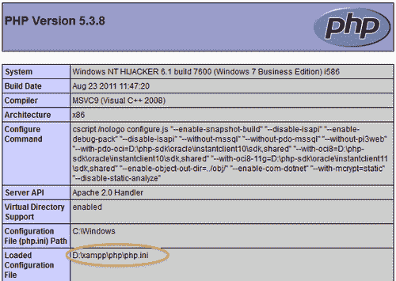

您可以看到位于`D:\xampp\php\php.ini`的加载的`php.ini`文件。

1.  打开位于`D:\xampp\php\php.ini`的`php.ini`文件，并找到以下行：

```php
[XDebug]
;zend_extension = "D:\xampp\php\ext\php_xdebug.dll"

```

1.  找到并取消注释以下行，删除前导分号：

```php
zend_extension = "D:\xampp\php\ext\php_xdebug.dll"
xdebug.remote_enable = 1
xdebug.remote_handler = "dbgp"
xdebug.remote_host = "localhost"
xdebug.remote_port = 9000

```

1.  保存`php.ini`文件，并从 XAMPP 控制面板重新启动 Apache Web 服务器，以启用 XDebug 扩展。

1.  要验证 XDebug 对象是否已启用，请刷新您的`phpinfo()`页面，并查找已启用的 XDebug，如下面的屏幕截图所示：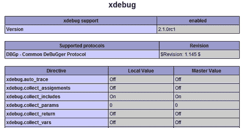

1.  如果启用了 XDebug，它将覆盖 PHP 中的`var_dump()`。您可以在代码中转储变量，如`var_dump($var)`，浏览器将显示增强的`var_dump`，如下所示（字符串以红色打印）：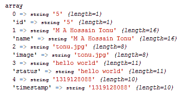

太棒了！您刚刚在开发环境中加载了 XDebug。

## 刚刚发生了什么？

我们刚刚在 Windows 的 XAMPP 捆绑包中启用了 XDebug，并验证了加载的扩展和配置。请注意，可以遵循此类通用步骤来启用`php.ini`中的其他内置扩展以启用 XDebug。您只需取消注释`php.ini`中的扩展并重新启动 Web 服务器以使更改生效。在 LAMP 或 MAMP 堆栈中启用 XDebug 也是非常相似的。

### 提示

始终检查`phpinfo()`页面加载的`php.ini`路径。

## 在 Ubuntu 上启用 XDebug

在 Ubuntu 中启用 XDebug 非常容易。我们可以通过**apt-get**软件包安装程序安装它，并更新`xdebug.ini`以加载配置。

# 操作时间-在 Ubuntu 上安装 XDebug

从控制台运行以下命令：

1.  使用以下命令安装 XDebug：

```php
**sudo apt-get install php5-xdebug** 

```

1.  使用内置编辑器`gedit`更新`xdebug.ini`。

```php
**sudo gedit /etc/php5/apache2/conf.d/xdebug.ini** 

```

1.  更改`xdebug.ini`，使其如下所示：

```php
**zend_extension=/usr/lib/php5/20090626+lfs/xdebug.so
xdebug.remote_enable=1
xdebug.remote_handler=dbgp
xdebug.remote_mode=req
xdebug.remote_host=127.0.0.1
xdebug.remote_port=9000** 

```

请注意，这些配置的第一行可能在`xdebug.ini`中可用，并且您可能需要添加其余行。

1.  重新启动 Apache。

```php
**sudo service apache2 restart** 

```

1.  刷新`phpinfo()`页面，找到安装的最新 XDebug 版本号。

## 刚刚发生了什么？

我们刚刚在 Ubuntu 的 LAMP 中启用了 XDebug，并验证了加载的扩展和配置。请注意，可以遵循此类通用步骤来启用`php.ini`中的其他内置扩展以启用 XDebug。您只需取消注释`php.ini`中的扩展并重新启动 Web 服务器以使更改生效。

## 在 Mac OS X 上启用 XDebug

修改加载的`php.ini`文件的适当版本以在 Mac 上启用 XDebug，取消注释以下行，并从 MAMP 控制面板重新启动 Apache 服务器。

```php
**[xdebug]
zend_extension="/Applications/MAMP/bin/php5.3/lib/php/extensions/no-debug-non-zts-20090626/xdebug.so"
xdebug.remote_enable=on
xdebug.remote_handler=dbgp
xdebug.remote_host=localhost
xdebug.remote_port=9000** 

```

XDebug 现在在您的 Mac OSX 上运行。MAMP Pro 用户可以轻松从 MAMP Pro 控制面板编辑`php.ini`，方法是从菜单中选择**文件|编辑模板|PHP 5.3.2 php.ini**。

最后，我们在本地开发环境中启用了 XDebug。

# 使用 NetBeans 调试 PHP 源代码

要继续，我们想检查 NetBeans 所需的调试设置。选择**工具|选项|PHP|调试**选项卡：

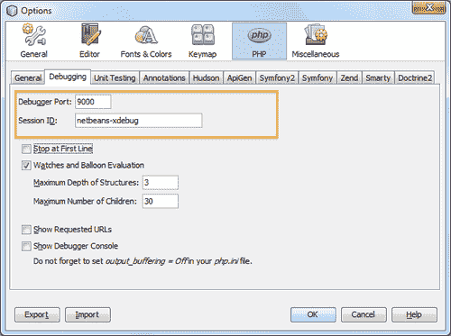

在此窗口中，取消选中**在第一行停止**复选框，因为我们希望在所需行停止，并选中**监视和气球评估**复选框。此选项使您能够在调试时观察自定义表达式或变量。

现在，让我们看一下在 NetBeans 窗口中运行的调试会话：

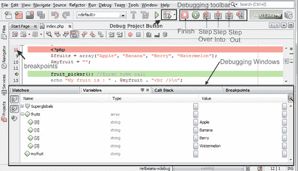

在此屏幕截图中，调试工具栏和按钮由功能名称表示。

### 注意

从[`netbeans.org/kb/docs/php/debugging.html#work`](http://netbeans.org/kb/docs/php/debugging.html#work)了解有关调试工具栏的更多信息。

## 调试器窗口

当您开始调试会话时，一组调试器窗口会在主编辑器窗口下方打开。要添加新窗口，请选择**窗口|调试**。以下窗口可用：

+   **本地变量**显示了已初始化变量、它们的类型和值的列表

+   **监视**显示了用户定义表达式及其值的列表

+   **调用堆栈**显示了以相反顺序调用的函数列表；最后调用的函数位于列表顶部

+   **断点**显示了设置断点的文件和行号的列表

+   **会话**显示了当前活动调试会话的列表

+   **线程**窗口指示了当前活动的 PHP 脚本以及它是否在断点处暂停或运行。如果脚本正在运行，您需要转到浏览器窗口并与脚本交互。

+   **源**窗口显示了调试会话加载的所有文件和脚本。**源**窗口目前不适用于 PHP 项目。

### 基本调试工作流程

以下是基本的调试工作流程：

1.  用户在应该暂停 PHP 源代码执行的行处设置断点。

1.  当达到该行时，用户通过按下*F7*和*F8*按钮逐行执行脚本，并检查变量的值。

### 注意

有关 NetBeans IDE 调试和测试的键盘快捷键，请参见*附录*。

# 进行操作的时间 — 运行调试会话

本节介绍了标准的调试会话，并且我们将创建一个示例项目来练习调试：

1.  创建一个 NetBeans PHP 项目。对于我们的示例，我们将其命名为`chapter4`。

1.  在`index.php`文件中输入以下代码：

```php
<?php
$fruits = array("Apple", "Banana", "Berry", "Watermelon");
$myfruit = "";
fruit_picker(); //first time call
echo "My fruit is : " . $myfruit . "<br />\n";
fruit_picker(); //second time call
echo "My fruit is now: " . $myfruit . "<br />\n";
fruit_picker(); //third time call
echo "My fruit is finally: " . $myfruit . "<br />\n";
function fruit_picker () {
Global $myfruit, $fruits;
$myfruit = $fruits[rand(0, 3)];
}
?>

```

前面的代码包含：

+   一个包含水果名称的`$fruits`数组。

+   一个包含单个水果名称的字符串的变量`$myfruit`，最初为空字符串。

+   一个`fruit_picker()`方法，它从`$fruits`数组中随机选择一个水果名称并更改`$myfruit`的值。此外，`$fruits`和`$myfruit`在函数内被定义为`全局`，以便函数可以在其全局范围内使用和修改它们。

1.  为了测试调试步骤，我们可以通过按下*Ctrl+F8*在 PHP 块的开头设置断点，如下截图所示，或者简单地点击该行的行号添加断点：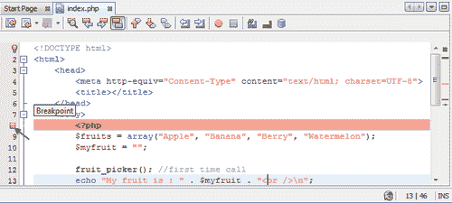

1.  要开始调试会话，请按下*Ctrl+F5*，或者从**调试**工具栏中点击**调试项目（第四章）**按钮，或者右键单击项目名称，在项目窗口中选择**调试**。调试器将在断点处停止。浏览器以项目调试 URL 的页面加载模式打开，该 URL 是`http://localhost/chapter4/index.php?XDEBUG_SESSION_START=netbeans-xdebug`。

1.  按下*F7*三次，从断点处进入第三个执行点。调试器将在第一次调用`fruit_picker()`函数的行停止。**变量**窗口显示了变量`$fruits`和`$myfruit`及其值，类似于以下截图：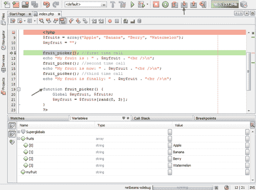

在我们的代码中，您可以看到`fruit_picker()`函数将连续被调用三次。

1.  要进入`fruit_picker()`函数，请按下*F7*，调试器将开始执行`fruit_picker()`内部的代码，如下截图所示：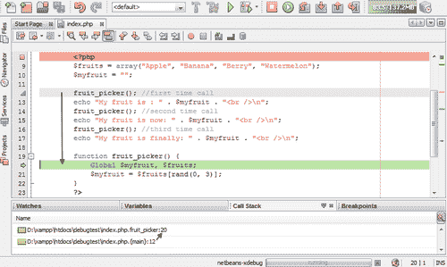

1.  按下*F7*两次，`fruit_picker()`的执行将结束。现在，在**变量**窗口中检查`$myfruit`的新值：

1.  再次按下*F7*三次，从第二次调用`fruit_picker()`函数的行进入该函数。由于您已经验证了该函数完美运行，您可能想要取消函数的执行。要**跳出**并返回到下一行，请按下*Ctrl+F7*。

请注意，`$myfruit`的值保持变化，您可以将鼠标悬停在该变量上查看它。

1.  由于您刚刚检查并发现您的代码正在正确运行，因此您可以通过按下*F8*来跳过当前行。

1.  最后，您可以通过按下*F7*来浏览下一行，或者通过按下*F8*来跳过并到达末尾。再次，如果您希望结束会话，可以按下*Shift+F5*或单击**完成调试会话**按钮。在会话结束时，浏览器将显示结果（代码输出）。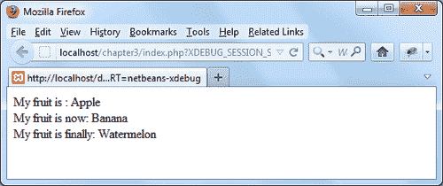

## 刚刚发生了什么？

已经进行了调试会话的练习，希望我们已经掌握了使用 NetBeans 进行调试。您还可以添加多个断点以跟踪程序的执行。因此，您可以跟踪程序中的所有变量、表达式、方法调用顺序、程序控制跳转等。这是找出代码内部出现问题的过程。主要是，您现在已经准备好在编码时征服一些不需要的情况或错误。

## 添加监视

通过在代码执行中观察表达式，添加监视表达式可以帮助您捕捉错误。现在，让我们来玩一玩...

# 执行步骤-添加要监视的表达式

例如，我们想要测试`fruit_picker()`函数是否再次选择了相同的水果名称。我们可以在每次选择新的随机水果名称之前保存`$myfruit`的值，并使用表达式比较这两个水果名称。因此，让我们通过以下步骤添加表达式监视器：

1.  修改`fruit_picker()`函数如下：

```php
function fruit_picker() {
Global $myfruit, $fruits;
$old_fruit = $myfruit;
$myfruit = $fruits[rand(0, 3)];
}

```

我们刚刚添加了一行`$old_fruit = $myfruit;`来保存`$myfruit`的先前值，以便我们可以在函数结束时比较`$old_fruit`中的先前选择和`$myfruit`中的新选择。我们实际上想要检查是否选择了相同的水果。

1.  选择**调试|新建监视**或按*Ctrl+Shift+F7*。打开**新建监视**窗口。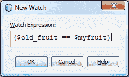

1.  输入以下表达式，然后单击**确定**。

```php
($old_fruit == $myfruit)

```

我们将在`fruit_picker()`函数的闭括号（}）处观察此表达式结果。如果表达式在函数闭括号处产生（bool）1，那么我们将知道新选择的水果是否与旧的相同，或者再次选择了相同的水果。添加的监视表达式可以在**监视**和**变量**窗口中找到。

1.  运行调试会话，如前一节所示。当调试器停在`fruit_picker()`函数的闭括号处时，检查表达式值是否为（bool）`0`，如果新选择与旧选择不同，则该值为（bool）`1`，如果是连续选择相同的话，则该值为（bool）`1`。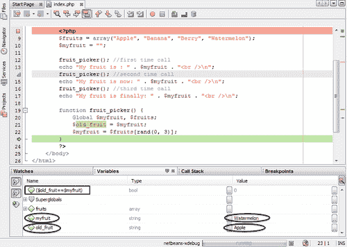

通过这种方式，您可以继续观察表达式以查找错误。

## 刚刚发生了什么？

在调试会话中添加监视表达式很有趣。您可以添加多个监视以分析一些编程缺陷。简而言之，调试使您能够查看变量、函数、表达式、执行流程等，因此可以轻松地发现错误并清除它。

### 注意

有关 NetBeans IDE 调试和测试的键盘快捷键，请参阅*附录*。

## 突发测验-使用 XDebug 进行调试

1.  以下哪些是 XDebug 的功能？

1.  出现错误时自动堆栈跟踪

1.  自动修复错误

1.  函数调用日志记录

1.  增强的`var_dump()`

1.  当 NetBeans 中出现断点时会发生什么？

1.  IDE 将跳过断点并显示结果

1.  IDE 将在那一点停止代码执行，让您看看窗口调试中发生了什么

1.  IDE 将终止调试会话并重置正在调试的窗口的结果

1.  以上都不是

1.  监视的目的是什么？

1.  在 NetBeans 中显示时间

1.  在代码执行中观察表达式

1.  观察表达式时间

1.  检查调试会话

## 尝试一下——探索 NetBeans 调试功能

在**调试**窗口中，启用名为**显示请求的 URL**的功能。启用后，在调试期间将出现一个新的**输出**窗口，并显示当前处理的 URL。还要启用另一个名为**PHP 调试器控制台**的**输出**窗口，以查看其中调试脚本的输出。请记住在您的`php.ini`文件中设置`output_buffering = Off`，以立即看到它。

# 使用 PHPUnit 进行测试

源代码测试在测试驱动开发方法中是必不可少的。测试描述了检查代码是否按预期行为的方式，使用一组可运行的代码片段。单元测试测试软件部分（单元）的正确性，其可运行的代码片段称为单元测试。NetBeans IDE 支持使用 PHPUnit 和 Selenium 测试框架进行自动化单元测试。

## 配置 PHPUnit

在 Windows 框中运行 XAMPP 时，它提供了一个内置的 PHPUnit 包。请注意，如果您的项目在 PHP 5.3 中运行，则应使用 PHPUnit 3.4.0 或更新版本。在我们的情况下，最新的 XAMPP 1.7.7（带有 PHP 5.3.8）堆栈中安装了 PHPUnit 2.3.6，这与 PHP 5.3 不兼容。您还需要升级现有的 PHP 扩展和应用程序存储库（PEAR）安装，以安装最新的 PHPUnit 和所需的 PEAR 包。

要检查已安装的 PEAR、PHP 和 Zend 引擎的版本，请从命令提示符或终端中浏览 PHP 安装目录`D:\xampp\php`，并输入`pear version`命令，将得到以下输出：

```php
**PEAR Version: 1.7.2
PHP Version: 5.3.8
Zend Engine Version: 2.3.0
Running on: Windows NT....** 

```

所以现在是安装最新的 PHPUnit 的时候了。为了做到这一点，首先应该升级 PEAR。

# 行动时间——通过 PEAR 安装 PHPUnit

在接下来的步骤中，我们将升级 PEAR 并通过 PEAR 在相应的环境中安装 PHPUnit：

1.  以管理员身份运行命令提示符，转到`pear.bat`文件所属的 PHP 安装目录（D:\xampp\php），并执行以下命令：

```php
**pear upgrade pear** 

```

这将升级现有的 PEAR 安装。在 Ubuntu 或 Mac OS X 系统中，运行以下命令：

```php
**sudo pear upgrade pear** 

```

在 MAMP 的情况下，如果遇到错误 sudo: pear: command not found，则请参阅*配置 MAMP*部分的问题。

1.  要安装最新的 PHPUnit，请输入以下两个命令：

```php
**pear config-set auto_discover 1
pear install pear.phpunit.de/PHPUnit** 

```

它会自动发现下载频道并安装最新的 PHPUnit 以及可用的包。

1.  要检查 PHPUnit 安装，请运行以下命令：

```php
**phpunit version** 

```

您将看到类似以下的命令：

```php
**PHPUnit 3.6.10 by Sebastian Bergmann**.

```

1.  要列出 PHPUnit 的远程包，请运行以下命令：

```php
**pear remote-list -c phpunit** 

```

## 刚才发生了什么？

我们使用`pear upgrade pear`命令升级了 PEAR 安装。我们启用了 PEAR 频道、自动发现配置，并使用这些自动安装频道安装了最新的 PHPUnit。其他 PHP 扩展可以通过这种方式轻松地从扩展存储库中安装。

再次，如果您已经升级了 PEAR 安装并且之前已启用了自动发现功能，那么只有`pear install pear.phpunit.de/PHPUnit`命令就可以完成 PHPUnit 的安装。

### 提示

在 Windows 中以管理员身份运行命令提示符，以便更轻松地处理目录权限。您可以右键单击程序并选择**以管理员身份运行**。

### 配置 MAMP 问题

在使用 MAMP 时，如果在终端中使用 PEAR 命令时遇到错误`pear: command not found`，那么运行`which php`将指向 OS X 的默认版本。

```php
**$ pear -bash: pear: command not found $ which php /usr/bin/php** 

```

您可能需要修复它。为了纠正这一点，我们需要将 PHP 的`bin`目录添加到我们的路径中。`PATH`是一个环境变量，表示要查找命令的目录。可以通过编辑`home`目录下的`.profile`文件来修改`PATH`。我们在本教程中使用了`PHP5.3 bin`版本路径，但您可以从可用的版本中进行选择。

从终端运行以下命令，将所需的 PHP 的`bin`目录添加到`php, pear`和其他相关可执行文件的使用中：

```php
**$ echo "export PATH=/Applications/MAMP/bin/php/php5.3/bin:$PATH" >> ~/.profile** 

```

如您所见，在用户的`home`目录中的`.profile`文件中添加了一行，其中包括`php5.3 bin`目录路径到环境变量`PATH`。

现在，停止 MAMP 并使用以下命令更改文件的权限，使这些文件可执行：

```php
**chmod 774 /Applications/MAMP/bin/php5.3/bin/pear chmod 774 /Applications/MAMP/bin/php5.3/bin/php** 

```

`chmod`命令更改文件模式或访问控制列表。`774`表示文件的“所有者”和文件用户的“组”将被允许读取，写入和执行文件。其他人只能读取它，但不能写入或执行文件。

在编写时，最新的 MAMP 1.9 版本带有损坏的 PHP 版本的`pear.conf`文件。因此，使用以下命令将该文件重命名以防止其加载到系统中：

```php
**mv /Applications/MAMP/conf/php5.3/pear.conf /Applications/MAMP/conf/php5.3/backup_pear.conf** 

```

实际上，在给定的`pear.conf`文件中，PHP 路径字符串包含`php5`而不是`php5.3`或`php5.2`。

现在，重新启动 MAMP 并重新启动您的终端会话。因此，MAMP 的问题已经解决，您可以通过从终端运行`which php`或`which pear`命令来测试它。为了使用 MAMP 安装 PHPUnit，您现在可以继续本章的*安装 PHPUnit via PEAR 的行动时间-步骤 1*。

### 将 PHPUnit 添加到 NetBeans

要将 PHPUnit 设置为 NetBeans IDE 的默认单元测试器，请选择**工具 | 选项 | PHP 选项卡 | 单元测试**选项卡，使用**搜索**自动在**PHPUnit 脚本**字段中输入 PHPUnit 的`.bat`脚本路径，并单击**确定**。

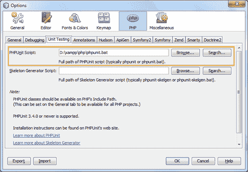

同样，对于 Mac OS X，PHPUnit 的路径将类似于`/Applications/MAMP/bin/php5.3/bin/phpunit`。

## PEAR 的小测验

1.  PEAR 代表什么？

1.  PHP 扩展应用程序存储库

1.  PHP 扩展和应用程序存储库

1.  PHP 扩展社区库

1.  PHP 额外适用的存储库

## 创建和运行 PHPUnit 测试

在本节中，我们将学习创建和运行 PHPUnit 测试。NetBeans IDE 可以为文件中的所有 PHP 类创建测试脚本并运行 PHPUnit 测试。IDE 自动化测试脚本生成和整个测试过程。为了确保测试脚本生成器能够正常工作，请将 PHP 文件命名为文件中的第一个类相同的名称。

# 行动时间-使用 PHPUnit 进行测试

在本教程中，我们将创建一个新的 NetBeans 项目，使用 PHPUnit 从 IDE 中测试我们的 PHP 类。为了做到这一点，请按照以下步骤进行操作：

1.  创建一个名为`Calculator`的新项目，在项目中添加一个名为`Calculator`的 PHP 类（右键单击项目节点，然后选择**新建 | PHP 类**，然后插入类名），并为`Calculator`类输入以下代码：

```php
<?php
class Calculator {
public function add($a, $b) {
return $a + $b;
}
}
?>

```

您可以看到`add()`方法只是执行两个数字的加法并返回总和。我们将对这个方法进行单元测试，以查看它是否返回了正确的总和。

1.  在下面的代码中添加一个带有`@assert`注释和一些示例输入和输出的注释块。请注意，以下示例中包含一个不正确的断言：

```php
<?php
class Calculator {
/**
* @assert (0, 0) == 0
* @assert (0, 1) == 1
* @assert (1, 0) == 1
* @assert (1, 1) == 2
* @assert (1, 2) == 4
*/
public function add($a, $b) {
return $a + $b;
}
}
?>

```

1.  在**项目**窗口中，右键单击`Calculator.php`节点，然后选择**工具 | 创建 PHPUnit 测试**。请注意，您可以使用**源文件**节点中的上下文菜单为项目中的所有文件创建测试。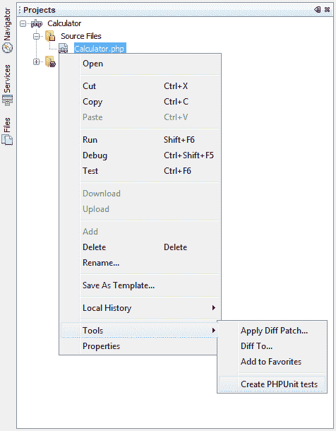

1.  第一次创建测试时，会打开一个对话框，询问您要存储测试脚本的目录。在本例中，可以使用**浏览**功能（按钮）创建一个`tests`目录。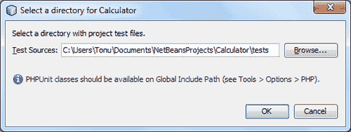

我们可以将测试文件与源文件夹分开。此外，如果您希望将这些测试脚本排除在未来的源代码版本控制之外，可以将它们分开。

1.  IDE 会在名为`CalculatorTest.php`的文件中生成一个测试类，该文件将显示在**项目**窗口中并在编辑器中打开。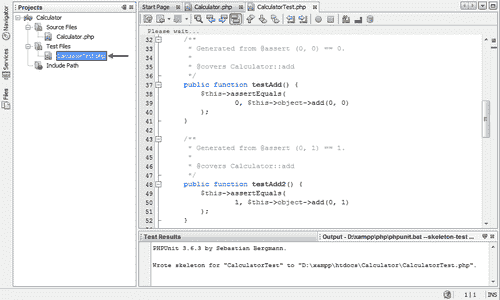

请注意，为类内的每个`@assert`注释创建了测试方法。

1.  要测试`Calculator.php`文件，请右键单击文件节点并选择**测试**，或按*Ctrl+F6*。IDE 会运行测试并在**测试结果**窗口中显示结果。

正如您所看到的，由于不正确的输入，其中一个测试失败了。这在**测试结果**窗口中用黄色感叹号标记。此外，您可以看到通过和失败的测试数量。因此，可以获得总体通过测试百分比（用绿色条表示）。

1.  请注意，您也可以对整个项目运行测试。右键单击项目节点并选择**测试**，或按*Alt+F6*。还要考虑检查**输出**窗口，以获取更详细的文本输出。

## 刚刚发生了什么？

PHP 类或项目可以部分测试，使用 PHPUnit。这里最好的部分是你不需要担心生成测试脚本并以图形方式显示测试结果，因为 IDE 会处理它。您可以在[`www.phpunit.de/manual/current/en/`](http://www.phpunit.de/manual/current/en/)了解更多关于 PHPUnit 测试的信息。

### 请注意

在[`www.phpunit.de/manual/current/en/writing-tests-for-phpunit.html#writing-tests-for-phpunit.assertions`](http://www.phpunit.de/manual/current/en/writing-tests-for-phpunit.html#writing-tests-for-phpunit.assertions)了解更多关于断言的例子。

## 使用 PHPUnit 处理代码覆盖

NetBeans IDE 通过 PHPUnit 提供了代码覆盖功能。代码覆盖检查 PHPUnit 测试是否覆盖了所有方法。在本节中，我们将看到代码覆盖是如何与我们现有的`Calculator`类一起工作的。

# 使用代码覆盖的行动时间

按照以下步骤查看 NetBeans 中代码覆盖功能的工作方式：

1.  打开`Calculator.php`，添加一个重复的`add`函数，并将其命名为`add2`。`Calculator`类现在看起来类似于以下内容：

```php
<?php
class Calculator {
/**
* @assert (0, 0) == 0
* @assert (0, 1) == 1
* @assert (1, 0) == 1
* @assert (1, 1) == 2
* @assert (1, 2) == 4
*/
public function add($a, $b) {
return $a + $b;
}
public function add2($a, $b) {
return $a + $b;
}
}
?>

```

1.  右键单击项目节点。从**上下文**菜单中选择**代码覆盖|收集和显示代码覆盖**。默认情况下，也会选择**显示编辑器栏**。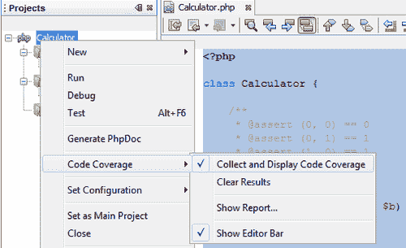

1.  编辑器现在在底部有一个代码覆盖率编辑器栏。由于代码覆盖率尚未经过测试，编辑器栏报告了`0.0%`的覆盖率（在单击**清除**以清除测试结果后，它还会显示这样的百分比）。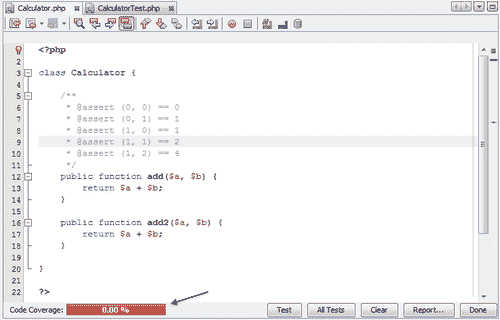

1.  单击**测试**以测试已打开的文件，或单击**所有测试**以运行项目的所有测试。测试结果将显示。此外，**代码覆盖**栏会告诉您有多少百分比的方法已被测试覆盖。在编辑器窗口中，覆盖的代码会以绿色突出显示，未覆盖的代码会以红色突出显示。查看以下代码覆盖会话：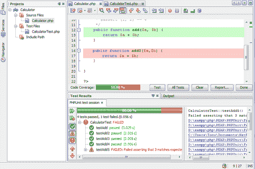

1.  在**代码覆盖率**栏中，点击**报告...**。**代码覆盖率**报告打开，显示了在项目上运行的所有测试的结果。栏中的按钮让你清除结果，重新运行所有测试，并停用代码覆盖率（点击**完成**）。

如你所见，`add2()`方法没有被单元测试覆盖，所以报告显示`50%`的代码覆盖率，否则将显示`100%`的覆盖率。

## 刚刚发生了什么？

我们已经完成了使用 NetBeans 代码覆盖功能与 PHPUnit，因此我们可以确定哪些单元没有被 PHPUnit 测试覆盖。因此，当你为代码单元创建 PHPUnit 测试并希望确保所有单元都已被测试覆盖时，可以应用代码覆盖。但是，预期有一个最大的代码覆盖百分比。

### 提示

重构测试脚本时，也要重构代码。

# 使用 Selenium 框架进行测试

Selenium 是一个用于 Web 应用程序和自动化浏览器的便携式软件测试框架。主要用于跨多个平台自动化测试目的的 Web 应用程序。NetBeans IDE 具有一个包含 Selenium 服务器的插件。通过此插件，你可以在 PHP、Web 应用程序或 Maven 项目上运行 Selenium 测试。要在 PHP 上运行 Selenium 测试，你需要将**Testing_Selenium**包安装到你的 PHP 环境中。

## 安装 Selenium

由于我们已经升级了 PEAR 并安装了最新的 PHPUnit，我们应该已经安装了`Testing_Selenium-beta`。要检查 Selenium 安装，请从终端运行以下命令，你将能够查看已安装的版本：

```php
**pear info Testing_Selenium-beta** 

```

否则，运行以下命令以安装 Selenium：

```php
**pear install Testing_Selenium-0.4.4** 

```

# 运行 Selenium 测试的时间

让我们通过以下步骤使用 Selenium 运行测试：

1.  要安装插件，打开**工具 | 插件**，并为 PHP 安装**Selenium 模块**。

1.  在**项目**窗口中，右键单击**计算器**项目的项目节点。选择**新建 | 其他**。**新建文件**向导打开。选择**Selenium**，然后点击**下一步**。

第一次创建 Selenium 测试时，会打开一个对话框，询问你为 Selenium 测试文件设置一个目录。这应该是一个与 PHPUnit 测试文件分开的目录；否则，每次运行单元测试时都会运行 Selenium 测试。运行功能测试，如 Selenium，通常比运行单元测试需要更多时间。因此，你可能不想每次运行单元测试时都运行这些测试。

1.  在**名称**和**位置**页面中接受默认设置，然后点击**完成**。新的 Selenium 测试文件将在编辑器中打开，并出现在**项目**窗口中。

1.  **运行 Selenium 测试**项现在已添加到项目的上下文菜单中。点击此项，Selenium 测试结果将显示在**测试结果**窗口中，与 PHPUnit 测试相同。

你还可以修改 Selenium 服务器的设置。Selenium 服务器被添加为**服务**选项卡中的新服务器。

## 刚刚发生了什么？

我们刚刚使用了 Selenium 测试框架进行测试，用于 PHP 应用程序。它为开发人员提供了跨多个操作系统、浏览器和编程语言的测试支持，并允许录制、编辑和调试测试。简而言之，这是测试人员的完整测试解决方案。你可以使用 Selenium 随着代码结构的演变来演变你的测试。该软件基于 PHPUnit 框架，并继承了其大部分功能。

### 注意

你可以从这里了解更多关于 Selenium 测试：[`seleniumhq.org/`](http://seleniumhq.org/)。

## 小测验 — 单元测试和代码覆盖率

1.  什么是单元测试？

1.  测试代码的最小可测试部分

1.  测试类的各个方法

1.  测试，您知道输入和输出是什么

1.  以上所有

1.  减去两个数字的测试中哪个断言会失败？

1.  `@assert (0, 0) == 0`

1.  `@assert (2, 3) == -1`

1.  `@assert (4, 2) == 3`

1.  `@assert (5, 1) == 4`

1.  如果在一个只包含一个方法的类中测试单元时通过了六个测试并且失败了四个测试，那么代码覆盖百分比将是多少？

1.  `60%`

1.  `50%`

1.  `100%`

1.  `40%`

1.  Selenium 测试框架的特性不包括哪个？

1.  自动化浏览器

1.  通过手动测试遗漏的缺陷

1.  观察表达式

1.  无限次执行测试用例

## 尝试一下 —— 学习测试依赖关系

一个单元测试通常涵盖一个函数或方法，并且也可以依赖于其他单元测试。现在，使用`@depends`注释来表示单元测试的依赖关系，并借助[`www.phpunit.de/manual/current/en/writing-tests-for-phpunit.html#writing-tests-for-phpunit.test-dependencies`](http://www.phpunit.de/manual/current/en/writing-tests-for-phpunit.html#writing-tests-for-phpunit.test-dependencies)进行实践。

### 注意

查看*附录*以获取 NetBeans IDE 调试和测试的键盘快捷键。

# 摘要

在本章中，我们已经学会了使用 NetBeans 调试和测试 PHP 应用程序。该 IDE 已经以有效的方式与这些调试和测试工具集成在一起。此外，对于自动化测试，生成的脚本使该过程变得轻松和简单。

具体来说，我们已经专注于：

+   各种操作系统上的 XDebug 配置

+   使用 NetBeans 和 XDebug 运行调试会话

+   安装 PHPUnit

+   使用 PHPUnit 进行单元测试

+   使用 PHPUnit 和 NetBeans 进行代码覆盖率

+   使用 NetBeans 引入 Selenium 测试框架

现在使用调试和测试工具变得更加容易。在下一章中，我们将强调源代码和 API 文档，以使我们的源代码更易理解。
