# 第五章：使用代码文档

> 代码告诉你如何做，注释告诉你为什么 - Jeff Atwood

在这一章中，我们将使用 NetBeans IDE 来记录我们的 PHP 源代码。我们将学习如何快速记录变量、方法、类或整个项目，并讨论以下问题：

+   源文档的约定

+   如何记录源代码

+   PHP 项目 API 文档

# 编写优秀的文档

编码是指导机器的艺术，当涉及到人类可读性时，代码应该是表达性的、自解释的和美观的。代码应该是可重用和可理解的，这样你可以在几个月后再次使用它。一个好的实践者会尽可能地简化代码，只在真正需要的地方保留代码文档。

代码文档是编码的激励部分，特别是当你在协作团队环境中工作时；文档应该以一种明智的方式完成，这样学习代码的意图在协作者之间可以更快地进行。

记录源代码的常规做法是在代码中放置符合**PHPDoc**格式的注释，这样你的代码就变得更有意义，外部文档生成器可以解析这样的注释。

# PHPDoc——PHP 的注释标准

PHPDoc 是针对 PHP 编程语言的 Javadoc 的一种适应。由于它是 PHP 代码的标准注释，它允许外部文档生成器，如 phpDocumentor 和 ApiGen 为 API 生成 HTML 文档。它有助于各种 IDE，如 NetBeans，PhpStorm，Zend Studio 和 Aptana Studio，解释变量类型并提供改进的代码完成、类型提示和调试。根据 PHPDoc，文档是使用名为**DocBlock**的文本块编写的，这些文本块位于要记录的元素之前。作为描述编程构造的一种方式，例如类、接口、函数、方法等，标签注释被用在 DocBlock 内部。

## DocBlock 的例子

DocBlock 是一个扩展的 C++风格的 PHP 注释，以"/**"开头，每一行都以"*"开头。

```php
/**
* This is a DocBlock comment
*/

```

DocBlock 包含三个基本部分，按照以下顺序：

+   简短描述

+   长描述

+   标签

例子：

```php
/**
* Short description
*
* Long description first sentence starts here
* and continues on this line for a while
* finally concluding here at the end of
* this paragraph
*
* The blank line above denotes a paragraph break
*/

```

简短描述从第一行开始，可以用空行或句号结束。单词中的句号（例如`example.com`或`0.1 %)`会被忽略。如果简短描述超过三行，那么只有第一行会被采用。长描述可以继续多行，并且可以包含用于显示格式的 HTML 标记。外部文档解析器将在长描述中将所有空格转换为单个空格，并可能使用段落分隔符来定义换行，或者`<pre>`，如下一节所述。

DocBlock 的长描述和简短描述会被解析为一些选定的 HTML 标签，这些标签使用以下标签进行附加格式化：

+   `<b>:` 这个标签用于强调/加粗文本

+   `<code>:` 这个标签用于包围 PHP 代码；一些转换器会对其进行高亮显示

+   `<br>:` 这个标签用于提供硬换行，并且可能会被一些转换器忽略

+   `<i>:` 这个标签用于将文本标记为重要的斜体

+   `<kbd>:` 这个标签用于表示键盘输入/屏幕显示

+   `<li>:` 这个标签用于列出项目

+   `<ol>:` 这个标签用于创建有序列表

+   `<ul>:` 这个标签用于创建无序列表

+   `<p>:` 这个标签用于包含所有段落；否则，内容将被视为文本

+   `<pre>:` 这个标签用于保留换行和间距，并假定所有标签都是文本（就像 XML 的 CDATA）

+   `<samp>:` 这个标签用于表示样本或示例（非 PHP）

+   `<var>:` 这个标签用于表示变量名

在罕见的情况下，如果需要在 DocBlock 中使用文本`"<b>"`，请使用双定界符，如`<<b>>`。外部文档生成器将自动将其转换为物理文本`"<b>"`。

## 熟悉 PHPDoc 标签

PHPDoc 标签是以`@`符号为前缀的单词，并且只有在它们是 DocBlock 新行上的第一件事情时才会被解析。DocBlock 在结构元素之前，这些元素可以是编程构造，如命名空间、类、接口、特征、函数、方法、属性、常量和变量。

一些常见的标签列表及详细信息已分成组，以便更好地理解，如下所示：

### 数据类型标签

| 标签 | 用法 | 描述 |
| --- | --- | --- |
| `@param` | 类型`[$varname]` 描述 | 记录函数或方法的参数。 |
| `@return` | `类型描述` | 文档化函数或方法的返回类型。此标记不应用于构造函数或返回类型为`void`的方法。 |
| `@var` | `类型` | 记录类变量或常量的数据类型。 |

### 法律标签

| 标签 | 用法 | 描述 |
| --- | --- | --- |
| `@author` | 作者名称`<author@email>` | 记录当前元素的作者 |
| `@copyright` | `名称日期` | 记录版权信息 |
| `@license` | `URL 名称` | 用于指示适用于相关结构元素的许可证 |

### 版本标签

| 标签 | 用法 | 描述 |
| --- | --- | --- |
| `@version` | `版本字符串` | 提供类或方法的版本号 |
| `@since` | `版本字符串` | 记录发布版本 |
| `@deprecated` | `版本描述` | 用于指示哪些元素已被弃用并将在将来的版本中被移除 |
| `@todo` | `信息字符串` | 记录需要在以后的日期对代码进行的事情 |

### 其他标签

| 标签 | 用法 | 描述 |
| --- | --- | --- |
| `@example` | `/path/to/example` | 记录外部保存示例文件的位置 |
| `@link` | `URL 链接文本` | 记录 URL 引用 |
| `@see` | `逗号分隔的元素名称` | 记录任何元素 |
| `@uses` | `元素名称` | 记录元素的使用方式 |
| `@package` | `包的名称` | 记录一组相关的类和函数 |
| `@subpackage` | `子包的名称` | 记录一组相关的类和函数 |

在最常用的标签中，`@param`和`@return`只能用于函数和方法，`@var`用于属性和常量，`@package`和`@subpackage`用于过程页面或类，而其他标签，如`@author，@version`等，可以用于任何元素。除了这些标签，`@example`和`@link`可以用作内联标签。

### 注意

您可以在[`www.phpdoc.org/docs/latest/for-users/list-of-tags.html`](http://www.phpdoc.org/docs/latest/for-users/list-of-tags.html)找到标签列表。

现在，我们将深入使用 NetBeans 来记录我们的 PHP 源代码。

# 记录源代码

在本节中，我们将学习如何记录函数、方法、类、接口、全局变量、常量等，并讨论使用此类代码文档的好处。如前所述，在协作开发环境中，方法、类等的描述对于了解代码的意图非常重要，我们将在本节中实际实现这一点。

现在，在 NetBeans 中创建一个名为`Chapter5`的新 PHP 项目，并将其用于所有接下来的教程。

## 记录函数和方法

在本节中，我们将学习如何在 PHP 函数或方法的开头使用 NetBeans 自动文档功能。

# 行动时间 - 文档化 PHP 函数或方法

在本教程中，让我们创建一个简单的 PHP 函数或方法，其中传入一些参数，并在其中声明不同类型的变量。我们只是在练习，看看 NetBeans 自动生成文档生成器在这些常用的结构元素上是如何工作的。让我们按照以下步骤进行：

1.  在项目中添加一个名为`sample1.php`的 PHP 文件，并输入一个 PHP 函数，如下所示：

```php
function testFunc(DateTime $param1, $param2, string $param3 = NULL)
{
$number = 7;
return $number;
}

```

在这个函数中，我们可以看到有三个参数传递到`testFunc`方法中-`$param1`作为`DateTime`，`$param2`没有类型提示，因为它可能具有混合类型的值，`$param3`是可选的，默认值为`NULL`。此外，在函数体内，函数包含一个整数类型变量，并且也返回该整数类型。

1.  在`testFunc`函数之前的行中键入`/**`，然后按*Enter*。您会看到 NetBeans 解析函数并在函数之前根据 PHPDoc 标准生成文档，看起来类似于以下内容：

```php
**/**
*
* @param DateTime $param1
* @param type $param2
* @param string $param3
* @return int
*/**
function testFunc(DateTime $param1, $param2, string $param3 = NULL)
{
$number = 7;
return $number;
}

```

在前面的代码片段中，我们可以看到 NetBeans 生成了文档，其中提到了参数和返回类型，列举如下：

+   参数用`@param`标记注释，并且从给定的类型提示中获取参数类型

返回类型用`@return`进行注释

您可以看到每个标签旁边的类型和名称之间用空格分隔。如果类型提示不可用，那么 NetBeans 会将其保留为简单的`type`，例如`$param2`。在文档中通常使用的词是当真实数据类型未知时使用`"mixed"`，您也可以编辑该`"type"`。

1.  您可以在文档中为每个变量添加描述；在变量名旁边，只需加上一个前导空格的描述，如下所示：

```php
/**
*
* @param DateTime $param1 this is parameter1
* @param array $param2 this is parameter2
* @param string $param3 this is parameter3 which is optional
* @return int what is returned, goes here
*/

```

1.  此外，您可能希望为文档添加一个简短的描述，看起来类似于以下内容：

```php
/**
* a short description goes here
*
* @param DateTime $param1 this is parameter1
* @param array $param2 this is parameter2
* @param string $param3 this is parameter3 which is optional
* @return int what is returned, goes here
*/

```

1.  现在，让我们看看这个 NetBeans 生成的文档是什么样子，当有人试图从项目中的任何地方调用这个`testFunc`时。尝试在任何地方输入函数名。比如，在项目内的`index.php`文件中开始输入函数名，你会看到 NetBeans 自动提示该函数名以及参数提示和文档，如下所示：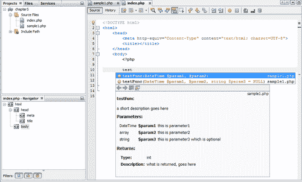

如果函数或任何元素有文档可用，那么 NetBeans 在自动建议过程中显示文档，就像前面的截图中所示的那样。

## 刚刚发生了什么？

我们刚刚学会了如何使用 NetBeans 自动生成文档生成器。通过在函数之前键入`/**`并按*Enter*，我们可以解析元数据并生成文档。我们也可以更新文档。同样，外部文档生成器可以提取这样的 DocBlocks 来创建项目 API 文档。现在，我们将在下一节中在 PHP 类之前添加文档。

## 记录类

在类之前的文档非常重要，可以了解类及其用法。最佳实践是使用适当的注释对前面的文档进行装饰，例如`@package, @author, @copyright, @license, @link`和`@version`，并对类进行适当的描述。

# 操作时间-记录 PHP 类和类变量

在这一部分，我们将使用 NetBeans 添加一个 PHP 类，并使用类文档标签更新前面的 DocBlock。所以让我们开始吧...

1.  右键单击`Chapter5`项目选择**新建|PHP 类...**，在**文件名**框中插入类名`Test`，然后点击**完成**，如下所示：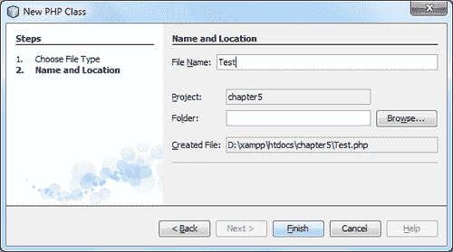

1.  `Test`类应该看起来类似于以下内容：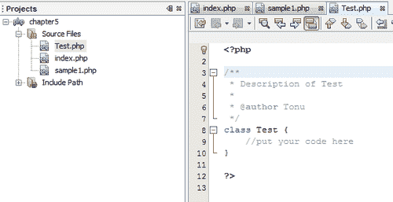

在上一张截图中，您可以看到打开的`Test class`在顶部添加了一个带有示例类描述和`@author`标签的 DocBlock。

1.  您可能希望在包含`@author`标签的行之前添加 PHPDoc 标签；假设您想要在键入`@p`时立即添加`@package`标签。NetBeans 代码自动完成功能显示以`@p`开头的标签，其描述看起来类似于以下截图：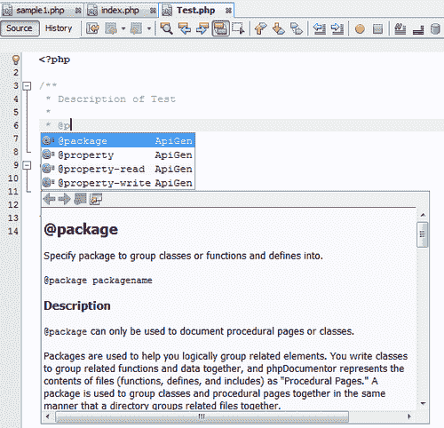

1.  使用您自己的方式更新 DocBlock，使其看起来类似于以下内容：

```php
**/**
* Short description of the Test Class
*
* Long multiline description of the Test Class goes here
*
* Note: any notes required
* @package Chapter5
* @author M A Hossain Tonu
* @version 1.0
* @copyright never
* @link http://mahtonu.wordpress.com
*/**

```

1.  在上述文档中，您可以看到已为类添加了相应的标签，因此在尝试使用代码完成实例化类对象时，可以使用类信息，如下所示：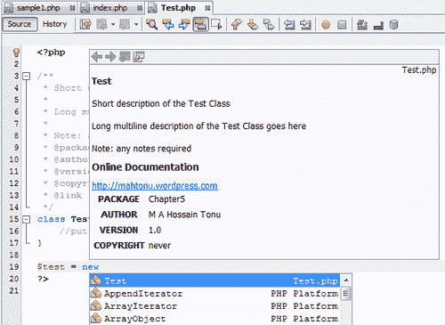

此外，可以使用外部 API 文档生成器提取这样的类 DocBlock。

1.  现在，按照以下方式在`Test`类中输入一个名为`$variable`的类变量：

```php
public $variable;

```

1.  要添加类变量文档，请键入`/**`，并在声明它的行之前按*Enter*，以便文档看起来类似于以下内容：

```php
/**
*
* @var type
*/

```

1.  在这里，您可以按照以下方式更新块：

```php
/**
* example of documenting a variable's type
* @var string
*/

```

1.  为了在以后的部分查看类层次结构树，您可以在我们的项目中添加一个名为`TestChild`的子类，扩展`Test`类，看起来类似于以下内容：

```php
/**
* Short description of the TestChild Class
*
* Long multiline description of the TestChild Class goes here
*
* Note: any notes required
* @package Chapter5
* @author M A Hossain Tonu
* @version 1.0
* @copyright never
* @link http://mahtonu.wordpress.com
*/
class TestChild extends Test {
}

```

## 刚刚发生了什么？

我们已经练习了如何在 PHP 函数、类及其属性之前添加文档，并测试了这些文档信息如何在整个项目中可用。相同风格的 DocBlock 或适当的标签也适用于文档化 PHP 接口。

## 记录 TODO 任务

您可以使用`@todo`标签为元素添加计划更改的文档，这些更改尚未实施，该标签几乎可以用于可以文档化的任何元素（全局变量、常量、函数、方法、定义、类和变量）。

# 执行时间-使用@todo 标签

在本教程中，我们将学习如何使用`@todo`标签记录我们的未来任务，并将从 NetBeans 任务或操作项窗口查看任务列表：

1.  在`TestChild`PHP 类内或类的前面文档块中，我们可以使用`@todo`标签；在多行注释或 DocBlock 中，添加类似于以下内容的标签：

```php
/**
* @todo have to add class variable and functions
*/

```

在上面的文档块中，我们可以看到任务已经被描述在标签旁，用空格分隔。此外，可以使用单行注释添加`@todo`标签，如下所示：

```php
//TODO need to add class variable and functions

```

1.  因此，`TestChild`类可能看起来类似于以下内容：

```php
class TestChild extends Test {
//TODO have to add class variable and functions
}

```

1.  当我们在文件中添加任务时，任务应该在 NetBeans 的**任务**或**操作项**窗口中可见；按下*Ctrl* + *6*打开窗口，添加的任务应该在**任务**窗口中列出，如下截图所示：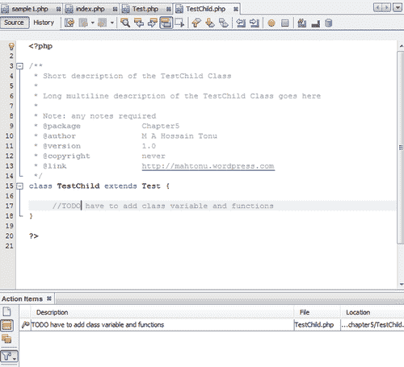

## 刚刚发生了什么？

使用`TODO`任务标记添加新任务后，NetBeans 会立即更新**任务**窗口中的任务列表，并且您可以在该窗口中列出整个项目或所有在 NetBeans 中打开的项目的所有任务。当我们有想要实现但没有足够时间编写代码的想法时，可以使用这些标签，考虑到其未来的实现。因此，您可以使用`@todo`标签在适当的位置放下这个想法。

到目前为止，我们已经学会了如何使用 PHPDoc 标准标签来记录 PHP 源元素，并处理了 DocBlock 来编写源文档。已经讨论了有关源文档的基本概念。因此，在我们的下一节中，我们将学习如何提取这样的 DocBlock，以为整个项目或 API 生成 HTML 文档。

# 记录 API

正如我们已经讨论过源代码文档的重要性，文档应以一种井然有序的方式呈现给一般用户，或者使用 HTML 页面进行图形化阐述。这样的 API 文档，从源 DocBlocks 转换而来，可以作为了解源代码的技术文档。NetBeans 支持使用**ApiGen**自动文档工具从整个项目的 PHP 源代码生成 API 文档。

ApiGen 是使用 PHPDoc 标准创建 API 文档的工具，并支持最新的 PHP 5.3 功能，如命名空间、包、文档之间的链接、对 PHP 标准类和一般文档的交叉引用、高亮源代码的创建，以及对 PHP 5.4 traits 的支持。它还为项目生成了一个包含类、接口、traits 和异常树的页面。

### 提示

查看 ApiGen 的功能：`http://apigen.org/##features`。

在下一节中，我们将讨论如何安装 ApiGen 并在 NetBeans 中配置它。

## 配置 ApiGen

我们将首先通过 PEAR 安装 ApiGen 并在 NetBeans 中配置它，以便我们可以从 IDE 生成 API 文档。我们可以启用 PEAR 自动发现功能，自动安装 ApiGen 及其所有依赖项。启用发现功能不仅会自动将 ApiGen 添加到系统路径，还允许轻松更新每个 ApiGen 组件。

# 操作时间-安装 ApiGen 并在 NetBeans 中配置

我们已经熟悉了通过 PEAR 安装 PHP 库（在上一章中讨论过），并且可能已经将 PEAR 配置`auto_discover`设置为 ON。在本节中，我们将使用以下步骤在 NetBeans 中安装和配置 ApiGen：

1.  从终端或命令提示符中运行以下命令安装 ApiGen：

```php
**pear config-set auto_discover 1
pear install pear.apigen.org/apigen**

```

`install`命令将自动下载并安装 ApiGen 以及其所有依赖项。如果您已经启用了 PEAR`auto_discover`，则跳过第一个命令。

1.  现在，我们需要将 ApiGen 可执行文件添加到 IDE 中。从**工具|选项**中打开**IDE 选项**窗口，选择**PHP 选项卡|ApiGen**选项卡，然后单击**搜索...**按钮搜索 ApiGen 脚本。ApiGen 脚本应该会自动列出，如下图所示：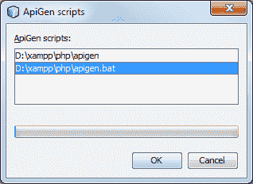

1.  从上一张截图中，选择`apigen.bat`（Windows 操作系统）或`apigen`（其他操作系统），然后按**确定**，将 ApiGen 脚本集成到 IDE 中，如下图所示：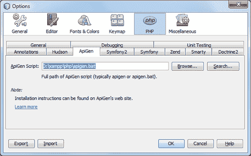

您也可以在那里浏览 ApiGen 脚本路径。

1.  按**确定**保存设置。

## 刚刚发生了什么？

到目前为止，我们已经在 NetBeans 中配置了 ApiGen 工具，该工具已准备好用于 PHP 项目。一旦您将该工具与 IDE 集成，您可能希望从 IDE 中使用它为您的 PHP 项目生成 HTML 文档。在我们的下一个教程中，我们将学习如何从 IDE 中使用该工具。

## 生成 API 文档

我们将使用 ApiGen 为示例 PHP 项目`Chapter5`生成 HTML 文档，并且该工具从项目中可用的 DocBlocks 中提取文档。生成过程可以在 IDE 的**输出**窗口中查看。最后，生成的 HTML 文档将在 Web 浏览器中打开。

# 操作时间-使用 ApiGen 生成文档

使用 IDE 集成的 ApiGen，我们将运行文档生成器。请注意，我们需要定义目标目录以存储 HTML 文档。根据以下步骤为我们的示例项目创建 HTML 文档：

1.  右键单击`chapter5`项目节点。从上下文菜单中，选择**属性 | ApiGen**，将显示以下**项目属性**窗口：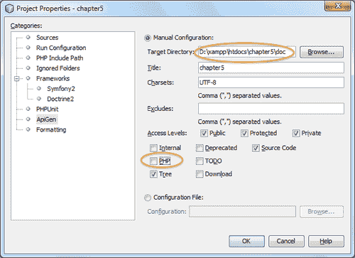

1.  从上一个**项目属性**窗口中，定义 HTML 页面将存储的**目标目录**，并取消选中**PHP**框以排除文档中的 PHP 默认元素。在此项目中，让我们在项目内创建一个名为`doc`的目录作为目标目录，以便可以在`http://localost/chapter5/doc/`上浏览文档。

1.  点击**确定**保存设置。

1.  现在，右键单击`chapter5`项目节点。这将生成一个菜单，看起来类似于以下屏幕截图：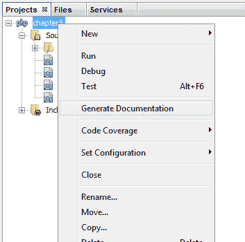

1.  从上一个项目上下文菜单中，选择**生成文档**以开始从给定的 DocBlocks 生成 HTML 文档的过程。

1.  在上一步中选择**生成文档**后，HTML 文档生成器开始进行进展，并完成了 HTML 文档。生成过程总结在**输出**窗口中，如下所示：

1.  此外，整个项目的 HTML 文档也已在浏览器中打开，看起来类似于以下内容：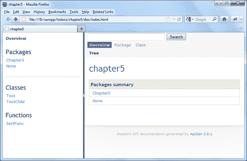

在上面的屏幕截图中，我们可以看到已为整个项目创建了 HTML 文档。文档按照包、类和函数在左侧框架中的顺序进行组织。

1.  浏览为项目创建的链接，并探索类和方法在那里是如何表示的。您可以点击上一个窗口中的**TestChild**类链接，以获取以下屏幕截图：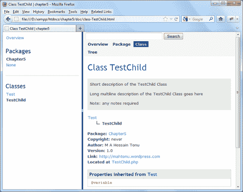

1.  在上面的屏幕截图中，我们可以看到类继承也使用树形图表示，并且根据其 DocBlock 适当装饰了类的文档。

## 刚刚发生了什么？

我们从源代码注释块中创建了专业的 API 文档，并发现了类在最终文档中是如何被正确组织的。请注意，ApiGen 在生成的 HTML 界面上为类、函数等提供了搜索功能，并提供了可自定义的模板功能，以修改整体文档的外观。我们现在有足够的信心有效地为 PHP 源代码进行文档化。

## 快速测验 —— 复习标签

1.  以下哪个标签仅适用于函数或方法？

1.  `@author`

1.  `@package`

1.  `@param`

1.  `@link`

1.  以下哪个标签可用于文档化任何元素的发布版本？

1.  `@version`

1.  `@since`

1.  `@deprecated`

1.  `@todo`

1.  以下哪个标签可以用作内联标签？

1.  `@example`

1.  `@param`

1.  `@version`

1.  `@see`

## 尝试更多的英雄 —— 处理文档

每次运行 NetBeans 文档生成器时，它都会清除目标目录并在那里创建一组新的 HTML 文档。尝试对接口、常量、特性等进行注释，并运行文档生成器以测试生成的 API 文档。

# 总结

在本章中，我们已经讨论并练习了如何使用 NetBeans 为 PHP 应用程序文档化源代码。

我们特别关注了以下主题：

+   PHPDoc 标准和标签

+   文档化 PHP 函数/方法、类及其变量

+   文档化 TODO 任务

+   使用 NetBeans 配置 ApiGen

+   使用 ApiGen 进行 API 文档

最后，使用自动文档生成器非常有趣，并且在几秒钟内生成了 HTML 文档。

在我们下一章进行协作 PHP 开发时，需要这样的源代码文档，以便在开发团队内保持良好的实践。在下一章中，我们将学习如何从 NetBeans 使用版本控制系统（Git）。
