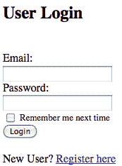
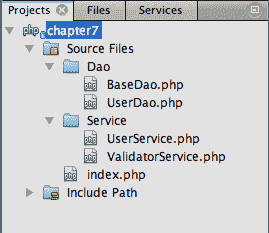
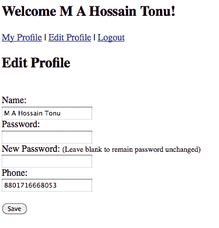

# 第七章。构建用户注册，登录和注销

> 提前规划。当诺亚建造方舟时，天空并没有下雨 - 理查德 C.库欣。

从本章开始，我们将亲自动手进行专业的 PHP 项目。我们将设计和开发一个 Web 应用程序，用户可以在其中注册自己，注册后可以登录到应用程序，查看和更新自己的配置文件等。

在本章中，我们将解决以下主题：

+   应用程序架构

+   设计 API

+   用户注册

+   用户登录和注销

+   用户配置文件查看和更新

# 规划项目

项目规划总是被视为对未来的规划，这意味着项目应该被规划，因为它可以很容易地扩展或可重用，更模块化，甚至可扩展。对于这个项目，我们将以现实的方式设计应用程序架构，以便用户注册，登录和注销应用程序也可以在我们未来的项目中轻松使用。

我们将设计**应用程序编程接口**（**API**）并使用该 API 构建应用程序。该 API 将为任何类型的用户注册或登录相关任务提供便利，因此项目的核心是 API。一旦 API 准备就绪，我们就可以轻松地使用该 API 构建多个应用程序。

首先，让我们考虑 API 设计。记住，我们将使用一些架构模式，即**数据访问对象**（**DAO**）模式用于我们的项目。

### 提示

强烈建议在此项目中具有**面向对象编程**（**OOP**）概念的先验知识。

# 理解应用程序架构

架构需要在数据存储，数据访问，应用服务和应用程序中构建层。这在以下截图中有所体现：


每个层都可以被指定为一组类似的逻辑任务，因为数据存储层充当数据源，如关系数据库，文件系统或任何其他数据源。**数据访问层**与数据源通信，从**存储层**获取或存储数据，并在数据源中提供良好的抽象以交付给**服务层**。服务层是与**应用层**进行数据持久化的媒介，并提供其他服务，如验证服务。**数据访问对象**位于数据访问层，**业务对象**位于**服务层**。最后，**应用程序**位于应用层，直接与最终用户打交道。因此，在这样的分层设计中，服务层可以成为我们 API 的表面层。

现在，让我们考虑特定的功能，比如注册，登录，验证和数据抽象到每个单元或模块中。因此，每个层都将有强制单元，如下图所示：


我们可以很容易地理解每个层都包含其适当的模块。例如，DAO 模块位于数据访问层，服务层具有其服务单元，如验证和用户服务模块，应用层包含用户登录，用户注册，用户配置文件和管理员模块。为了快速掌握架构概念，我们将尝试将每个模块保持为一个简单的 PHP 类，并附带代码。

因此，让我们快速看一下最终我们将要构建的内容。

以下截图代表了**用户注册**屏幕，包括**姓名，电子邮件，密码**和**电话**字段：


以下截图代表了**用户登录**屏幕，包括**下次记住我**选项：



以下截图代表了**用户配置文件**视图，顶部有**注销**和**编辑帐户**菜单：


## 理解 DAO 模式

DAO 用于抽象和封装对数据源的所有访问。DAO 管理与数据源的连接，以获取和存储数据。

> “DAO 实现了与数据源一起工作所需的访问机制。数据源可以是像 RDBMS 这样的持久存储，像 B2B 交换这样的外部服务，像 LDAP 数据库这样的存储库，或者像业务服务或低级套接字这样的业务服务。依赖 DAO 的业务组件使用 DAO 为其客户端提供的更简单的接口。
> 
> DAO 完全隐藏了数据源的实现细节，使其客户端（数据客户端）无法看到。因为 DAO 向客户端公开的接口在基础数据源实现更改时不会改变，所以该模式允许 DAO 适应不同的存储方案，而不会影响其客户端或业务组件。基本上，DAO 充当组件与数据源之间的适配器。该模式源自核心 J2EE 模式。”
> 
> [`java.sun.com/blueprints/corej2eepatterns/Patterns/DataAccessObject.html`](http://java.sun.com/blueprints/corej2eepatterns/Patterns/DataAccessObject.html)。

使用 DAO 的目的相对简单，如下所示：

+   它可以在大部分应用程序中使用，无论何时需要数据存储

+   它将所有数据存储的细节隐藏在应用程序的其余部分之外

+   它充当您的应用程序与数据库之间的中介

+   它允许将可能的持久性机制更改的连锁效应限制在特定区域

## 审查面向对象编程问题

让我们来看一下一些面向对象编程关键字，用于访问修饰符或属性：

+   公共：此属性或方法可以在脚本的任何地方使用。

+   私有：此属性或方法只能被其所属的类或对象使用；它不能在其他地方被访问。

+   `受保护：`此属性或方法只能由其所属的类中的代码或该类的子类使用。

+   最终：此方法或类不能在子类中被覆盖。

+   摘要：这种方法或类不能直接使用，你必须对其进行子类化；它不能被实例化。

+   `静态：`此属性或方法属于类本身，而不属于其任何实例。您也可以将静态属性视为全局变量，它们位于类内部，但可以通过类从任何地方访问。可以使用`::`运算符在类名之后访问静态成员。

## 命名空间

> “命名空间（有时也称为名称范围）是一个抽象的容器或环境，用于保存一组唯一标识符或符号（即名称）。在命名空间中定义的标识符仅与该命名空间相关联。相同的标识符可以在多个命名空间中独立定义。”
> 
> - 维基百科

**命名空间**从 PHP 5.3 版本开始引入。在 PHP 中，命名空间是使用命名空间块定义的。

在 PHP 世界中，命名空间旨在解决两个问题，即库和应用程序的作者在创建可重用的代码元素（如类或函数）时遇到的问题：

+   能够避免您创建的代码与内部 PHP 类/函数/常量或第三方类/函数/常量之间的名称冲突

+   能够别名（或缩短）设计用于缓解第一个问题的超长名称，提高源代码的可读性

PHP 命名空间提供了一种将相关类、接口、函数和常量分组的方法。以下是 PHP 中命名空间使用的示例：

```php
namespace My;
class Foo {
...
}
namespace Your;
class Foo {
...
}

```

我们可以使用相同名称的类，并通过 PHP 命名空间引用，如下所示：

```php
$myFoo = new \My\Foo();
$yourFoo = new \Your\Foo();

```

### 提示

我们将使用`My`作为整个应用程序的常见根命名空间，`My\Dao`用于我们的数据访问层类，`My\Service`用于我们的服务层类。

## API

在面向对象的语言中，API 通常包括一组类定义的描述，以及与这些类相关联的一组行为。行为是指对象从该类派生后在特定情况下的行为规则。这个抽象概念与类方法（或更一般地说，与所有公共组件，因此所有公共方法，但也可能包括任何公开的内部实体，如字段、常量和嵌套对象）实现的真实功能相关联。

例如，表示堆栈的类可以简单地公开两个方法-`push()`（向堆栈添加新项）和`pop()`（提取最后一项，理想情况下放在堆栈顶部）。

在这种情况下，API 可以解释为两种方法-`pop()`和`push()`。更一般地说，这个想法是，可以使用实现堆栈行为的`Stack`类的方法（堆栈暴露其顶部以添加/删除元素）。

到目前为止，一切都很好。我们对项目的概念有了了解，并且我们对 NetBeans 的功能非常了解。现在，让我们开始开发...

# 设计数据库

在本节中，我们将设计我们的 MySQL 数据库。由于我们已经学会了如何在 NetBeans 中创建数据库连接、新数据库、新表，以及如何运行 MySQL 查询，我们不会再讨论它们，但我们会看一下数据库模式定义。

```php
CREATE TABLE 'users' (
'id' bigint(20) NOT NULL AUTO_INCREMENT,
'useremail' varchar(50) NOT NULL,
'password' char(32) NOT NULL,
'userhash' char(32) NOT NULL,
'userlevel' tinyint(4) NOT NULL,
'username' varchar(100) NOT NULL,
'phone' varchar(20) NULL,
'timestamp' int(11) unsigned NOT NULL,
PRIMARY KEY ('id'),
UNIQUE KEY 'useremail' ('useremail')
) ENGINE=InnoDB DEFAULT CHARSET=utf8;

```

如您所见，我们在`users`表中有`id`（每个条目自动递增）作为主键，`useremail`作为唯一键。我们有一个`password`字段，用于存储用户的密码，最多 32 个字符；`userhash`有 32 个字符，用于存储用户的登录会话标识符；`userlevel`用于定义用户的访问级别，例如，普通用户为`1`，管理员用户为`9`，等等；一个`username`字段，支持最多 100 个字符；一个`phone`字段，用于存储用户的联系电话；以及一个`timestamp`字段，用于跟踪用户的注册时间。所选择的数据库引擎是**InnoDB**，因为它支持事务和外键，而**MyISAM**引擎不支持在任何用户进行`insert`和`update`操作时避免表锁定。

因此，您只需要创建一个名为`user`的新数据库，只需在 NetBeans 查询编辑器中键入 MySQL 查询，然后运行查询，即可在`user`数据库中准备好您的表。

现在，创建一个 NetBeans PHP 项目，并开始用户 API 开发以及后续部分。

# 创建数据访问层

数据访问层将包括一个 User DAO 类，用于提供数据库抽象，以及一个抽象的 Base DAO 类，用于提供抽象方法，这是 User DAO 类需要实现的。此外，我们将创建抽象类，以提供 DAO 类在我们未来项目中创建的抽象方法。请注意，我们将使用 PHP 命名空间`My\Dao`用于数据访问层类。

## 创建 BaseDao 抽象类

这个抽象类将用于为子类实现方法提供基本框架。简单地说，基本的数据库操作是`CRUD`或`create, read, update`和`delete`。因此，抽象类将提供这些类型的抽象方法，以及每个子类都需要的方法。`BaseDao`抽象类将包含用于数据库连接的`final`方法，因此子类不需要再次编写它。为了更好地理解这一点，我们将把我们的 DAO 类放在一个名为`Dao`的单独目录中。

# 行动时间-创建 BaseDao 类

为了与数据库连接一起使用，我们将保留数据库访问凭据作为它们自己的类常量。此外，我们将使用 PDO 进行各种数据库操作。要创建`Base`类，请按照以下步骤进行：

1.  在`Dao`目录中创建一个名为`BaseDao.php`的新 PHP 文件，并键入以下类：

```php
<?php
namespace My\Dao;
abstract class BaseDao {
private $db = null;
const DB_SERVER = "localhost";
const DB_USER = "root";
const DB_PASSWORD = "root";
const DB_NAME = "user";
}
?>

```

您可以看到这个类`使用命名空间 My\Dao;`，并且在类名之前还有一个`abstract`关键字，这将类定义为抽象类。这意味着该类不能被实例化，或者至少在内部有一个抽象方法。此外，您可以看到添加的类常量，其中包含数据库信息和一个私有类变量`$db`来保存数据库连接。您可以根据需要修改这些常量。

1.  现在，在类中添加以下`getDb()`方法：

```php
protected final function getDb(){
$dsn = 'mysql:dbname='.self::DB_NAME.';host='.self::DB_SERVER;
try {
$this->db = new \PDO($dsn, self::DB_USER, self::DB_PASSWORD);
} catch (PDOException $e) {
throw new \Exception('Connection failed: ' . $e->getMessage());
}
return $this->db;
}

```

`protected final function getDb()`函数使用 PDO 连接到 MySQL 数据库。类的私有变量存储了可以用于数据库连接的 PDO 实例。此外，`getDb()`方法是`final`和`protected`的，因此子类继承此方法并且无法覆盖它。

`$dsn`变量包含**数据源名称（DSN）**，其中包含连接到数据库所需的信息。以下行创建一个 PDO 实例，表示与请求的数据库的连接，并在成功时返回一个 PDO 对象：

```php
$this->db = new \PDO($dsn, self::DB_USER, self::DB_PASSWORD);

```

请注意，如果尝试连接到请求的数据库失败，DSN 会抛出`PDOException`异常。我们在 PDO 前面加上反斜杠\，这样 PHP 就知道它在全局命名空间中。

1.  在类中添加以下`abstract`方法：

```php
abstract protected function get($uniqueKey);
abstract protected function insert(array $values);
abstract protected function update($id, array $values);
abstract protected function delete($uniqueKey);

```

您可以看到子类要实现的方法被标记为`abstract protected`，`get()`方法将用于根据唯一表键从表中选择单个条目，`insert()`将在表中插入一行，`update()`将用于更新表中的一行，`delete()`将用于删除一个条目。因此，所有这些方法都被保留为抽象方法（没有方法体），因为它们将通过子类来实现。

## 刚刚发生了什么？

我们已经准备好继承 DAO 类的`BaseDao`抽象类。从该方法中创建并返回 PDO 实例，因此所有子类都将具有`getDb()`方法，并且可以使用此返回的实例来执行某种数据库任务。最后，子类将根据需要实现`abstract`方法。例如，在下一个教程中，User DAO 类将实现`get()`方法，以选择并返回与用户的电子邮件地址匹配的单个用户注册信息，或者 Product DAO 类将实现`get()`方法，以选择并返回与产品 ID 匹配的单个产品信息。因此，使用这样的抽象类的意图是为 Dao 类提供基本框架。

### 提示

使用 PDO 的最大优势之一是，如果我们想迁移到其他 SQL 解决方案，我们只需要调整 DSN 参数。

## 创建 User DAO 类

在本教程中，我们将创建 User DAO 类，该类将在其中提供各种数据库任务。这个类将隐藏数据库，不让连续的层次访问到它，也就是服务层类。因此，所有连续的层次类将调用这个类的方法，并且由这个类完成所有必要的数据库工作，而数据存储细节对它们完全隐藏。因此，这个类将充当数据库和应用程序之间的中介。

# 行动时间——创建 User Dao 类

我们将保留相关的用户常量作为类常量。我们将在这个类中编写`BaseDao`抽象类中方法的实现。简单地说，我们将把这些抽象方法的主体和我们自己所需的方法添加到类中。因此，请按照以下步骤进行操作：

1.  在`Dao`目录中创建一个名为`UserDao.php`的新 PHP 文件，并键入以下代码：

```php
<?php
namespace My\Dao;
class UserDao extends BaseDao {
private $db = null;
public function __construct() {
$this->db = $this->getDb();
}
}
$userDao = new \My\Dao\UserDao;
?>

```

正如您所看到的，该类位于`My\Dao`命名空间下，并扩展到`BaseDao`类，因此该类将具有从父类继承的方法。Dao 类有自己的私有`$db`，它存储了从继承的`getDb()`方法返回的 PDO 实例；正如您所看到的，这个`$db`变量被分配给了类构造函数。

另外，您可能已经注意到`UserDao`类已在底部实例化。

1.  键入`get()`方法的实现（将该方法添加到类中），使其看起来类似于以下内容：

```php
public function get($useremail) {
$statement = $this->db->prepare("SELECT * FROM users WHERE useremail = :useremail LIMIT 1 ");
$statement->bindParam(':useremail', $useremail);
$statement->execute();
if ($statement->rowCount() > 0) {
$row = $statement->fetch();
return $row;
}
}

```

您可以看到，`prepare()`方法准备了要由`PDOStatement::execute()`方法执行的 SQL 语句。正如您所看到的，以下语句查询用于从`users`表中选择一行的所有列，而`：useremail`中的给定电子邮件地址（与`bindParam()`绑定的参数）匹配`useremail`列。

```php
SELECT * FROM users WHERE useremail = :useremail LIMIT 1;

```

最后，如果找到匹配的行，则获取包含用户详细信息的数组并返回。

1.  键入`insert()`方法的实现，使其看起来类似于以下内容：

```php
public function insert(array $values) {
$sql = "INSERT INTO users ";
$fields = array_keys($values);
$vals = array_values($values);
$sql .= '('.implode(',', $fields).') ';
$arr = array();
foreach ($fields as $f) {
$arr[] = '?';
}
$sql .= 'VALUES ('.implode(',', $arr).') ';
$statement = $this->db->prepare($sql);
foreach ($vals as $i=>$v) {
$statement->bindValue($i+1, $v);
}
return $statement->execute();
}

```

该方法接受传入的用户信息数组，准备`users`表的 MySQL `insert`查询，并执行该查询。请注意，我们已经将字段名称保留在`$fields`数组中，并将字段值保留在`$vals`数组中，这些值分别从传递的数组的键和值中提取。我们在准备的语句中使用？代替所有给定值，这些值将被绑定到`PDOStatement::bindValue()`方法中。`bindValue()`将一个值绑定到一个参数。

1.  在`update()`方法的实现中键入代码，使其看起来类似于以下内容：

```php
public function update($id, array $values) {
$sql = "UPDATE users SET ";
$fields = array_keys($values);
$vals = array_values($values);
foreach ($fields as $i=>$f) {
$fields[$i] .= ' = ? ';
}
$sql .= implode(',', $fields);
$sql .= " WHERE id = " . (int)$id ." LIMIT 1 ";
$statement = $this->db->prepare($sql);
foreach ($vals as $i=>$v) {
$statement->bindValue($i+1, $v);
}
$statement->execute();
}

```

它以与*步骤 3*相同的方式准备了 MySQL `UPDATE`查询语句，并执行了该查询以更新具有给定 ID 的行中的相应列值。

1.  您可以将其他实现留空，如下所示，或根据需要添加自己的代码：

```php
public function delete($uniqueKey) { }

```

由于我们可能会在将来实现删除用户的方法，因此我们留空了`delete()`方法的主体。

1.  现在，我们需要在类中编写一些额外的方法。在注册用户时，我们可以检查我们的数据库，看看表中是否已经存在该电子邮件地址。键入以下方法：

```php
public function useremailTaken($useremail) {
$statement = $this->db->prepare("SELECT id FROM users WHERE useremail = :useremail LIMIT 1 ");
$statement->bindParam(':useremail', $useremail);
$statement->execute();
return ($statement->rowCount() > 0 );
}

```

`useremailTaken()`方法接受一个电子邮件地址作为参数，以检查该电子邮件 ID 是否存在。它通过在`WHERE`子句中使用给定的电子邮件地址运行`SELECT`查询来执行该任务。如果找到任何行，则意味着该电子邮件地址已经存在，因此该方法返回`true`，否则返回`false`。通过这种方法，我们可以确保系统中一个电子邮件地址只能使用一次，并且不允许重复的电子邮件地址，因为这是一个唯一的字段。

1.  为了在登录时确认用户的密码，请键入以下`checkPassConfirmation()`方法：

```php
public function checkPassConfirmation($useremail, $password) {
$statement = $this->db->prepare("SELECT password FROM users WHERE useremail = :useremail LIMIT 1 ");
$statement->bindParam(':useremail', $useremail);
$statement->execute();
if ($statement->rowCount() > 0) {
$row = $statement->fetch();
return ($password == $row['password']);
}
return false;
}

```

该方法以`$useremail`和`$password`作为参数，并选择`password`列以匹配用户的电子邮件。现在，如果找不到匹配条件的行，则意味着用户的电子邮件在表中不存在，并返回`false 1`；如果找到匹配的行，则从结果中获取数组以获得密码。最后，将从数据库中获取的密码与第二个参数中给定的密码进行比较。如果它们匹配，则返回`true`。因此，我们可以使用这个方法来确认给定对应用户的电子邮件的密码，当用户尝试使用它们登录时，可以轻松跟踪返回的布尔值的状态。

1.  此外，我们已经在`users`表中添加了一个名为`userhash`的字段。该字段存储每个登录会话的哈希值（随机的字母数字字符串），因此我们希望确认`userhash`，以验证用户当前是否已登录。输入以下方法：

```php
public function checkHashConfirmation($useremail, $userhash) {
$statement = $this->db->prepare("SELECT userhash FROM users WHERE useremail = :useremail LIMIT 1");
$statement->bindParam(':useremail', $useremail);
$statement->execute();
if ($statement->rowCount() > 0) {
$row = $statement->fetch();
return ($userhash == $row['userhash']);
}
return false;
}

```

`checkHashConfirmation()`方法与*步骤 7*中的先前方法相同，以`$useremail`和`$useremail`作为参数，为给定的电子邮件地址获取`useremail`，并将其与给定的`useremail`进行比较。因此，可以用来比较`useremail`的方法对于会话和数据库都是相同的。如果相同，则意味着用户当前已登录，因为每次新登录都会更新表中对应的`useremail`。

## 刚刚发生了什么？

对于多次使用不同参数值发出的语句，调用`PDO::prepare()`和`PDOStatement::execute()`可以优化应用程序的性能，通过允许驱动程序协商查询计划和元信息的客户端和/或服务器端缓存，并帮助防止 SQL 注入攻击，通过消除手动引用参数的需要。

现在，我们已经准备好了 User DAO 类，并且 DAO 层也在我们 NetBeans 项目的`Dao`目录中完成。因此，User DAO 类已准备好提供所需的数据库操作。可以以我们所做的方式处理数据库操作，以便其他后续类不需要访问或重写数据库功能，因此已实现对数据库的抽象。我们可以在这个类中添加任何类型的与数据库相关的方法，以便让它们可用于 Service 类。现在，实例化的对象将作为数据访问对象，这意味着该对象可以访问数据源中的数据，任何人都可以通过该对象读取或写入数据。

## 小测验-回顾 PDO

1.  `bindValue()`和`bindParam()`方法的哪一个是正确的？

1.  您只能使用`bindParam`传递变量，使用`bindValue`可以同时传递值和变量

1.  您只能使用`bindParam`传递值，只能使用`bindValue`传递变量

1.  您可以使用`bindParam`传递变量，使用`bindValue`可以传递值

1.  两者是相同的

现在，让我们为我们的 API 创建 Service 层。

# 创建 Service 层

Service 层包含用于为应用程序提供服务的类，或者简单地为应用程序提供框架。应用程序层将与该层通信，以获得各种应用程序服务，例如用户身份验证、用户信息注册、登录会话验证和表单验证。为了更好地理解，我们将把我们的服务类放在一个名为`Service`的单独目录中，并为该层的类使用命名空间`My\Service`。

## 创建 ValidatorService 类

该类将执行验证任务，例如表单验证和登录信息验证，并保存以提供表单错误消息和字段值。

# 行动时间-创建 ValidatorService 类

我们将在类本身中保留一些验证常量，并且该类将使用`My\Service`作为其命名空间。按照以下步骤创建`ValidatorService`类：

1.  在项目目录下创建一个名为`Service`的新目录。Service 类将位于此目录中。

1.  在`Service`目录中创建一个名为`ValidatorService.php`的新 PHP 文件，并输入以下类：

```php
<?php
namespace My\Service;
use My\Dao\UserDao;
class ValidatorService {
private $values = array();
private $errors = array();
public $statusMsg = null;
public $num_errors;
const NAME_LENGTH_MIN = 5;
const NAME_LENGTH_MAX = 100;
const PASS_LENGTH_MIN = 8;
const PASS_LENGTH_MAX = 32;
public function __construct() {
}
public function setUserDao(UserDao $userDao){
$this->userDao = $userDao;
}
}
$validator = new \My\Service\ValidatorService;
$validator->setUserDao($userDao);
?>

```

请注意，该类位于`My\Service`命名空间下，并导入`My\Dao\UserDao`类。

您可以看到类变量`$values`，它保存了提交的表单数值；`$errors`，它保存了提交的表单错误消息；`$statusMsg`，它保存了提交的状态消息，可以是成功或临时信息；以及`$num_errors`，它保存了提交表单中的错误数量。

我们还为验证目的添加了类常量。我们将用户名长度保持在 5 到 100 个字符之间，将`password`字段长度保持在 8 到 32 个字符之间。

由于该类依赖于 UserDao 类，我们使用`setter`方法`setUserDao()`将`$userDao`对象注入其中；传递的`$userDao`对象存储在一个类变量中，以便 DAO 也可以在其他方法中使用。

1.  现在，填写类构造函数，使其看起来类似于以下内容：

```php
public function __construct() {
if (isset($_SESSION['value_array']) && isset($_SESSION['error_array'])) {
$this->values = $_SESSION['value_array'];
$this->errors = $_SESSION['error_array'];
$this->num_errors = count($this->errors);
unset($_SESSION['value_array']);
unset($_SESSION['error_array']);
} else {
$this->num_errors = 0;
}
if (isset($_SESSION['statusMsg'])) {
$this->statusMsg = $_SESSION['statusMsg'];
unset($_SESSION['statusMsg']);
}
}

```

您可以看到，`$_SESSION['value_array']`和`$_SESSION['error_array']`都已经被最初检查。如果它们有一些值设置，那么将它们分配给相应的类变量，如下例所示：

```php
$this->values = $_SESSION['value_array'];
$this->errors = $_SESSION['error_array'];
$this->num_errors = count($this->errors);

```

还调整了`num_errors`与`errors`数组的计数。请注意，`$_SESSION['value_array']`和`$_SESSION['error_array']`中的值将由应用程序类设置，该类将使用此服务 API。立即在抓取其值后取消设置这些会话变量，以便为下一个表单提交做好准备。如果这些变量尚未设置，则`num_errors`应为`0`（零）。

它还检查`$_SESSION['statusMsg']`变量。如果已设置任何状态消息，请将消息抓取到相应的类变量中并取消设置。

1.  现在，按照以下方式在类中输入表单和错误处理方法：

```php
public function setValue($field, $value) {
$this->values[$field] = $value;
}
public function getValue($field) {
if (array_key_exists($field, $this->values)) {
return htmlspecialchars(stripslashes($this->values[$field]));
} else {
return "";
}
}
private function setError($field, $errmsg) {
$this->errors[$field] = $errmsg;
$this->num_errors = count($this->errors);
}
public function getError($field) {
if (array_key_exists($field, $this->errors)) {
return $this->errors[$field];
} else {
return "";
}
}
public function getErrorArray() {
return $this->errors;
}

```

在这些类方法中，您可以看到`setValue($field, $value)`和`getValue($field)`方法分别用于设置和获取单个相应字段的值。同样，`setError($field, $errmsg)`和`getError($field)`在验证时设置和获取相应表单字段值的错误消息，同时 setError 增加`num_errors`的值。最后，`getErrorArray()`返回完整的错误消息数组。

1.  现在，按照以下方式输入表单字段的值验证方法：

```php
public function validate($field, $value) {
$valid = false;
if ($valid == $this->isEmpty($field, $value)) {
$valid = true;
if ($field == "name")
$valid = $this->checkSize($field, $value, self::NAME_LENGTH_MIN, self::NAME_LENGTH_MAX);
if ($field == "password" || $field == "newpassword")
$valid = $this->checkSize($field, $value, self::PASS_LENGTH_MIN, self::PASS_LENGTH_MAX);
if ($valid)
$valid = $this->checkFormat($field, $value);
}
return $valid;
}
private function isEmpty($field, $value) {
$value = trim($value);
if (empty($value)) {
$this->setError($field, "Field value not entered");
return true;
}
return false;
}
private function checkFormat($field, $value) {
switch ($field) {
case 'useremail':
$regex = "/^[_+a-z0-9-]+(\.[_+a-z0-9-]+)*"
. "@[a-z0-9-]+(\.[a-z0-9-]{1,})*"
. "\.([a-z]{2,}){1}$/i";
$msg = "Email address invalid";
break;
case 'password':
case 'newpassword':
$regex = "/^([0-9a-z])+$/i";
$msg = "Password not alphanumeric";
break;
case 'name':
$regex = "/^([a-z ])+$/i";
$msg = "Name must be alphabetic";
break;
case 'phone':
$regex = "/^([0-9])+$/";
$msg = "Phone not numeric";
break;
default:;
}
if (!preg_match($regex, ( $value = trim($value)))) {
$this->setError($field, $msg);
return false;
}
return true;
}
private function checkSize($field, $value, $minLength, $maxLength) {
$value = trim($value);
if (strlen($value) < $minLength || strlen($value) > $maxLength) {
$this->setError($field, "Value length should be within ".$minLength." & ".$maxLength." characters");
return false;
}
return true;
}

```

验证方法可以描述如下：

+   `validate($field, $value)`是验证的入口函数。可以从该方法调用输入验证的方法，例如空字符串检查、正确的输入格式或输入大小范围，并且如果验证通过，则返回`true`，否则返回`false`。

+   `isEmpty($field, $value)`检查字符串是否为空，然后为该字段设置错误消息并返回`false`或`true`。

+   `checkFormat($field, $value)`测试字段的值是否符合为每个字段格式编写的适当正则表达式，设置错误（如果有），并返回`false`，否则返回`true`。

+   `checkSize($field, $value, $minLength, $maxLength)`检查输入是否在给定的最小大小和最大大小之间。

1.  我们希望验证登录凭据，以检查用户电子邮件是否存在，或者密码是否属于与该用户电子邮件匹配的用户。因此，按照以下方式添加`validateCredentials()方法`：

```php
public function validateCredentials($useremail, $password) {
$result = $this->userDao->checkPassConfirmation($useremail, md5($password));
if ($result === false) {
$this->setError("password", "Email address or password is incorrect");
return false;
}
return true;
}

```

该方法接受`$useremail`和`$password`作为登录凭据验证。您可以看到以下行使用`user Dao`来确认与`useremail`关联的密码。Dao 的`checkPassConfirmation()`方法返回`true`表示确认，返回`false`表示电子邮件地址或密码不正确。

```php
$result = $this->userDao->checkPassConfirmation($useremail, md5($password));

```

1.  当用户想要注册到我们的应用程序时，我们可以验证电子邮件地址是否已经存在。如果电子邮件地址在数据库中尚未注册，则用户可以自由注册该电子邮件。因此，输入以下方法：

```php
public function emailExists($useremail) {
if ($this->userDao->useremailTaken($useremail)) {
$this->setError('useremail', "Email already in use");
return true;
}
return false;
}

```

您可以看到该方法在`$this->userDao->useremailTaken($useremail);`中使用`userDao`来检查用户电子邮件是否已被使用。如果已被使用，则设置错误，并返回`true`表示该电子邮件已存在。

1.  当用户想要更新当前密码时，再次需要密码确认。因此，让我们添加另一个方法来验证当前密码：

```php
public function checkPassword($useremail, $password) {
$result = $this->userDao->checkPassConfirmation($useremail, md5($password));
if ($result === false) {
$this->setError("password", "Current password incorrect");
return false;
}
return true;
}

```

## 刚刚发生了什么？

我们已经准备好支持表单、登录凭据和密码验证，甚至通过`userDao`与数据库通信的验证器服务类。此外，验证器服务允许应用程序检索用于访客或用户的临时状态消息，以及表单输入字段的错误消息。因此，它处理各种验证任务，并且如果发现错误，则验证方法设置错误，并在成功时返回`true`，在失败时返回`false`。这样的错误消息可以在相应的表单字段旁边查看，以及字段值。因此，它还有助于创建数据持久性表单。

## 尝试英雄-添加多字节编码支持

现在，我们的验证器服务无法支持多字节字符编码。为了使应用程序能够支持不同的字符编码，如 UTF-8，您可以在验证方法中实现多字节支持，例如设置内部编码、多字节字符串的正则表达式匹配，以及使用`mb_strlen()`而不是`strlen()`。多字节字符串函数可以在[`php.net/manual/en/ref.mbstring.php`](http://php.net/manual/en/ref.mbstring.php)找到。

## 创建 UserService 类

`UserService`类支持所有应用程序任务，如登录、注册或更新用户详细信息。它与`UserDao`类对应于任何类型的数据相关函数，并与`ValidatorService`服务类对应于任何类型的验证函数。应用程序要求任务，如登录或注册，首先调用验证，然后执行任务，同时可能根据需要使用 DAO。最后，如果任务已完成，则返回`true`，如果失败，则返回`false`，例如验证失败或其他任何模糊性。简单地说，应用程序将从`UserService`类调用方法来登录、注册等，并可以了解操作的状态。

# 行动时间-创建 UserService 类

我们将使用`My\Service`作为该类的命名空间，并将任何常量保留在类中。`UserService`类属性将包含用户信息，如用户电子邮件、用户 ID、用户名或电话，并且构造函数将检查已登录用户和从会话加载的类变量中的用户详细信息。此外，该类将利用 PHP cookie 来存储用户的登录数据。该类将充当登录会话管理器。因此，最初，该类将检查会话中或 cookie 中的登录数据，以确定用户是否已登录。

### 提示

建议您熟悉 PHP 会话和 cookie。

因此，让我们按照以下步骤创建`UserService`类：

1.  在`Service`目录中创建一个名为`UserService.php`的新 PHP 文件，并输入以下类：

```php
<?php
namespace My\Service;
use My\Dao\UserDao;
use My\Service\ValidatorService;
class UserService {
public $useremail;
private $userid;
public $username;
public $userphone;
private $userhash;
private $userlevel;
public $logged_in;
const ADMIN_EMAIL = "admin@mysite.com";
const GUEST_NAME = "Guest";
const ADMIN_LEVEL = 9;
const USER_LEVEL = 1;
const GUEST_LEVEL = 0;
const COOKIE_EXPIRE = 8640000;
const COOKIE_PATH = "/";
public function __construct(UserDao $userDao, ValidatorService $validator) {
$this->userDao = $userDao;
$this->validator = $validator;
$this->logged_in = $this->isLogin();
if (!$this->logged_in) {
$this->useremail = $_SESSION['useremail'] = self::GUEST_NAME;
$this->userlevel = self::GUEST_LEVEL;
}
}
}
$userService = new \My\Service\UserService($userDao, $validator);
?>

```

您可以看到该类使用`namespace My\Service;`，并且可以使用`\My\Service\UserService`来访问 Service User 类。

检查存储用户数据的类变量，如果用户已登录，则 `$logged_in` 为 `true`。

为了区分用户，已添加了与用户相关的常量。用你自己的邮箱更新 `ADMIN_EMAIL`；用户中的管理员将由 `ADMIN_EMAIL` 和 `ADMIN_LEVEL` 等于 `9` 来定义。一般注册用户将被定义为 `USER_LEVEL` 等于 1，非注册用户将被定义为 `GUEST_LEVEL` 等于 `0` 或 `GUEST_NAME` 为 Guest。因此，使用邮箱地址 `<admin@mysite.com>` 注册的用户在我们实现管理员功能时将具有管理员访问权限。

在 cookie 常量部分，`COOKIE_EXPIRE` 默认将 cookie 过期时间设置为 `100` 天（8640000 秒），`COOKIE_PATH` 表示 cookie 将在整个应用程序域中可用。

cookie（用户计算机上的文本文件）将用于将 `useremail` 存储为 `cookname`，将 `userhash` 存储为 `cookid`。这些 cookie 将在用户启用“记住我”选项的情况下设置。因此，我们将首先检查用户本地计算机上是否存在与数据库匹配的 cookie，如果是，则将用户视为已登录用户。

请注意，构造函数注入了 `UserDao` 和 `ValidatorService` 对象，因此类可以在内部使用这些依赖项。

现在，通过 `$this->logged_in = $this->isLogin();` 这一行，构造函数检查用户是否已登录。`private` 方法 `isLogin()` 检查登录数据，如果找到则返回 true，否则返回 false。实际上，`isLogin()` 检查会话和 cookie 是否有用户的登录数据，如果有，则加载类变量。

未登录用户将是访客用户，因此 `useremail` 和 `userlevel` 分别设置为 `Guest` 和 `Guest Level 0`。

```php
if (!$this->logged_in) {
$this->useremail = $_SESSION['useremail'] = self::GUEST_NAME;
$this->userlevel = self::GUEST_LEVEL;
}

```

1.  现在，让我们创建 `isLogin()` 方法，如下所示：

```php
private function isLogin() {
if (isset($_SESSION['useremail']) && isset($_SESSION['userhash']) &&
$_SESSION['useremail'] != self::GUEST_NAME) {
if ($this->userDao->checkHashConfirmation($_SESSION['useremail'], $_SESSION['userhash']) === false) {
unset($_SESSION['useremail']);
unset($_SESSION['userhash']);
unset($_SESSION['userid']);
return false;
}
$userinfo = $this->userDao->get($_SESSION['useremail']);
if(!$userinfo){
return false;
}
$this->useremail = $userinfo['useremail'];
$this->userid = $userinfo['id'];
$this->userhash = $userinfo['userhash'];
$this->userlevel = $userinfo['userlevel'];
$this->username = $userinfo['username'];
$this->userphone = $userinfo['phone'];
return true;
}
if (isset($_COOKIE['cookname']) && isset($_COOKIE['cookid'])) {
$this->useremail = $_SESSION['useremail'] = $_COOKIE['cookname'];
$this->userhash = $_SESSION['userhash'] = $_COOKIE['cookid'];
return true;
}
return false;
}

```

如果 `$_SESSION` 具有 `useremail, userhash,` 和 `useremail` 不是 guest，则意味着用户已经登录到数据中。如果是这样，我们希望使用 `UserDao` 的 `checkHashConfirmation()` 方法来确认 `userhash` 和关联的 `useremail` 的安全性。如果未确认，则取消设置 `$_SESSION` 变量，并将其视为未登录，返回 false。

最后，如果一切顺利，使用 `Dao` 加载已登录用户的详细信息，`$userinfo = $this->userDao->get($_SESSION['useremail']);` 加载类和会话变量，并将其返回为 true。

同样，如果 `$_SESSION` 没有已登录的数据，那么我们将选择检查 cookie，因为用户可能已启用“记住我”选项。如果在 cookie 变量中找到必要的数据，则从中加载类和会话变量。

1.  现在，为应用程序创建登录服务如下：

```php
public function login($values) {
$useremail = $values['useremail'];
$password = $values['password'];
$rememberme = isset($values['rememberme']);
$this->validator->validate("useremail", $useremail);
$this->validator->validate("password", $password);
if ($this->validator->num_errors > 0) {
return false;
}
if (!$this->validator->validateCredentials($useremail, $password)) {
return false;
}
$userinfo = $this->userDao->get($useremail);
if(!$userinfo){
return false;
}
$this->useremail = $_SESSION['useremail'] = $userinfo['useremail'];
$this->userid = $_SESSION['userid'] = $userinfo['id'];
$this->userhash = $_SESSION['userhash'] = md5(microtime());
$this->userlevel = $userinfo['userlevel'];
$this->username = $userinfo['username'];
$this->userphone = $userinfo['phone'];
$this->userDao->update($this->userid, array("userhash" => $this->userhash));
if ($rememberme == 'true') {
setcookie("cookname", $this->useremail, time() + self::COOKIE_EXPIRE, self::COOKIE_PATH);
setcookie("cookid", $this->userhash, time() + self::COOKIE_EXPIRE, self::COOKIE_PATH);
}
return true;
}

```

这个方法接受登录详情，比如 `useremail, password,` 和 `rememberme`，并将它们传递到应用程序的 `$values` 数组中。它调用给定输入的验证，如果发现错误则返回 false，并在之后验证访问凭证的关联。如果所有情况都通过了验证，它将从 Dao 中加载用户信息。请注意，在下一行中，`md5(microtime())` 创建一个随机的包含字母数字字符的字符串，并分配给类变量。

```php
$this->userhash = $_SESSION['userhash'] = md5(microtime());

```

最后，为了启动新的登录会话，更新表中对应用户的 `userhash`，这将是当前会话的标识符。

```php
$this->userDao->update($this->userid, array("userhash" => $this->userhash));

```

因此，`$_SESSION userhash` 和数据库 `userhash` 应该对于一个活跃的、已登录的会话是相同的。

此外，您可以看到，如果 `$rememberme` 为 `true`，则使用 PHP 的 `setcookie()` 方法设置 cookie，并设置名称、值和过期时间。

1.  现在，添加用户注册服务方法如下：

```php
public function register($values) {
$username = $values['name'];
$useremail = $values['useremail'];
$password = $values['password'];
$phone = $values['phone'];
$this->validator->validate("name", $username);
$this->validator->validate("useremail", $useremail);
$this->validator->validate("password", $password);
$this->validator->validate("phone", $phone);
if ($this->validator->num_errors > 0) {
return false;
}
if($this->validator->emailExists($useremail)) {
return false;
}
$ulevel = (strcasecmp($useremail, self::ADMIN_EMAIL) == 0) ? self::ADMIN_LEVEL : self::USER_LEVEL;
return $this->userDao->insert(array(
'useremail' => $useremail, 'password' => md5($password),
'userlevel' => $ulevel, 'username' => $username,
'phone' => $phone, 'timestamp' => time()
));
}

```

该方法接受用户注册的详细信息，将它们传递到`$values`数组中，并对其进行验证。如果验证通过，它将用户注册详细信息打包到一个数组中，并使用 User Dao 的`insert()`方法将其保存到数据库中。

请注意，用户级别是通过将注册者的电子邮件地址与`ADMIN_EMAIL`进行比较来确定的。

1.  添加`getUser()`方法如下，以提供与给定的`useremail`参数匹配的用户信息：

```php
public function getUser($useremail){
$this->validator->validate("useremail", $useremail);
if ($this->validator->num_errors > 0) {
return false;
}
if (!$this->validator->emailExists($useremail)) {
return false;
}
$userinfo = $this->userDao->get($useremail);
if($userinfo){
return $userinfo;
}
return false;
}

```

请注意，在提供用户信息之前，`useremail`已经过验证。因此，每当需要用户信息时，应用程序将使用此方法。

1.  现在，添加`update()`方法来修改用户的详细信息。

```php
public function update($values) {
$username = $values['name'];
$phone = $values['phone'];
$password = $values['password'];
$newPassword = $values['newpassword'];
$updates = array();
if($username) {
$this->validator->validate("name", $username);
$updates['username'] = $username;
}
if($phone) {
$this->validator->validate("phone", $phone);
$updates['phone'] = $phone;
}
if($password && $newPassword){
$this->validator->validate("password", $password);
$this->validator->validate("newpassword", $newPassword);
}
if ($this->validator->num_errors > 0) {
return false;
}
if($password && $newPassword){
if ($this->validator->checkPassword($this->useremail, $password)===false) {
return false;
}
$updates['password'] = md5($newPassword);
}
$this->userDao->update($this->userid, $updates);
return true;
}

```

请注意，该方法首先验证给定的信息（如果有）。如果它通过了验证标准，相应的列值将通过 User Dao 更改到数据库表中。

1.  `logout()`方法可以添加如下：

```php
public function logout() {
if (isset($_COOKIE['cookname']) && isset($_COOKIE['cookid'])) {
setcookie("cookname", "", time() - self::COOKIE_EXPIRE, self::COOKIE_PATH);
setcookie("cookid", "", time() - self::COOKIE_EXPIRE, self::COOKIE_PATH);
}
unset($_SESSION['useremail']);
unset($_SESSION['userhash']);
$this->logged_in = false;
$this->useremail = self::GUEST_NAME;
$this->userlevel = self::GUEST_LEVEL;
}

```

`logout`方法取消所有 cookie 和会话变量，将`$this->logged_in`设置为`false`，用户再次成为访客用户。

## 刚刚发生了什么？

现在我们可以检查用户是否已登录，以及用户是否被要求记住登录详细信息，这样用户就不需要再次使用`记住我`选项登录。该类用于登录、注销、用户注册以及更新或检索用户信息到应用程序层。它在进行 Dao 层之前使用验证器服务。因此，该类还确保了数据安全性，使得`UserService`类在服务层准备就绪。

最后，我们的 API 已经准备好工作，通过使用这个 API，我们可以构建一个用户注册、用户资料更新、登录和注销的应用程序。我们有我们的数据访问层和服务层正在运行。现在，让我们来看看我们的 NetBeans 项目目录。



为了更好地理解，我们为每个层使用了一个单独的目录和一个单独的命名空间。现在，我们将在我们的应用程序文件中包含 API，并通过使用 User Service 对象，我们将实现我们应用程序的目标。

## 快速测验——使用命名空间

1.  PHP 命名空间支持哪些特性？

1.  给类名取别名

1.  给接口名称取别名

1.  给命名空间名称取别名

1.  导入函数或常量

1.  哪一个将导入名为`foo`的全局类？

1.  命名空间 foo;

1.  使用 foo;

1.  导入 foo;

1.  以上都不是

# 构建应用程序

在本教程中，我们将构建一个能够处理用户注册任务的应用程序，例如处理注册表单、通过 API 保存用户数据或显示错误消息，以及用户登录和注销任务。在下一节中，我们将构建 PHP 应用程序，然后添加应用程序用户界面。

在继续之前，请记住我们只有服务层类。我们将选择以这样的方式构建应用程序，使我们的应用程序建立在服务层之上。对于本节，我们不需要考虑底层数据库或 Dao，而是需要从应用程序开发人员的角度思考。

# 行动时间——创建用户应用程序

我们将把 API 集成到我们的用户应用程序文件中，这将是主要的应用程序文件；每个应用程序目的可能会有接口或视图文件。让我们按照以下步骤进行：

1.  在项目目录中创建一个名为`UserApplication.php`的新 PHP 文件，并输入以下`UserApplication`类：

```php
<?php
namespace My\Application;
use My\Service\UserService;
use My\Service\ValidatorService;
session_start();
require_once "Dao/BaseDao.php";
require_once "Dao/UserDao.php";
require_once "Service/ValidatorService.php";
require_once "Service/UserService.php";
class UserApplication {
public function __ construct (UserService $userService, ValidatorService $validator) {
$this->userService = $userService;
$this->validator = $validator;
if (isset($_POST['login'])) {
$this->login();
}
else if (isset($_POST['register'])) {
$this->register();
}
else if (isset($_POST['update'])) {
$this->update();
}
else if ( isset($_GET['logout']) ) {
$this->logout();
}
}
}
$userApp = new \My\Application\UserApplication($userService, $validator);
?>

```

在文件顶部，您可以看到在构造函数声明之后，PHP 会话以`session_start()`开始。API 文件已被包含，并且类构造函数已注入了`User`和`Validator Service`对象，因此这些对象在整个应用程序中都可用。

您可以看到，根据用户的请求，适当的方法是从构造函数中调用的，例如如果设置了`$_POST['login']`，则调用`$this->login();`。因此，所有方法都是从构造函数中调用的，并且应具有以下功能：

+   `login()`

+   `register()`

+   `update()`

+   `logout()`

在文件底部，我们有一行`$userApp = new \My\Application\UserApplication($userService, $validator);`，它实例化了`UserApplication`类以及依赖注入。

1.  在下面键入以下`login()`方法：

```php
public function login() {
$success = $this->userService->login($_POST);
if ($success) {
$_SESSION['statusMsg'] = "Successful login!";
} else {
$_SESSION['value_array'] = $_POST;
$_SESSION['error_array'] = $this->validator->getErrorArray();
}
header("Location: index.php");
}

```

您可以看到，该方法调用用户服务，并使用用户界面发布的登录凭据在以下行中：

```php
$success = $this->userService->login($_POST);

```

如果登录尝试成功，则在`$_SESSION['statusMsg']`会话变量中设置成功状态消息，如果失败，则将用户通过`$_POST`数组设置为`$_SESSION['value_array']`，并将从验证器对象中获取的错误数组设置为`$_SESSION['error_array']`。最后，它将重定向到`index.php`页面。

1.  在下面键入以下`register()`方法：

```php
public function register() {
$success = $this->userService->register($_POST);
if ($success) {
$_SESSION['statusMsg'] = "Registration was successful!";
header("Location: index.php");
} else {
$_SESSION['value_array'] = $_POST;
$_SESSION['error_array'] = $this->validator->getErrorArray();
header("Location: register.php");
}
}

```

您可以看到，如果注册尝试失败，则会重置相应的会话变量，并重定向到`register.php`页面，这是用户注册页面。

1.  在下面键入以下`update()`方法：

```php
public function update() {
$success = $this->userService->update($_POST);
if ($success) {
$_SESSION['statusMsg'] = "Successfully Updated!";
header("Location: profile.php");
} else {
$_SESSION['value_array'] = $_POST;
$_SESSION['error_array'] = $this->validator->getErrorArray();
header("Location: profileedit.php");
}
}

```

您可以看到，如果用户资料更新尝试失败，则会重置相应的会话变量，并重定向到`profileedit.php`页面，这是资料编辑页面，或者在成功时重定向到`profile.php`。因此，这些页面将是我们的用户资料查看和更新页面。

1.  在下面键入以下`logout()`方法，它只是调用注销服务：

```php
public function logout(){
$success = $this->userService->logout();
header("Location: index.php");
}

```

## 刚刚发生了什么？

现在我们的主应用程序类已经准备就绪，功能也已经准备就绪。因此，我们可以使用应用程序注册、登录、更新和注销用户。请注意，我们的应用程序只是通过服务对象进行通信，您可以感觉到应用程序对数据源不感兴趣；它所做的只是利用为其设计的服务。通过这种方式，我们可以为用户编写更有趣的应用程序，例如查看注册用户列表；开发管理员功能，例如更新任何用户或删除任何用户，甚至通过更新`userlevel`将用户从普通用户提升为管理员。通过在不同层中编写更多有趣的方法，我们可以获得特定的应用程序。

在我们的下一个和最后一节中，我们将为特定功能添加用户界面或页面。

## 创建用户界面

我们将为用户注册和登录创建简单的用户界面和表单。此外，我们还将为查看用户资料、更新资料和注销提供一些用户菜单。我们将在我们的界面文件的顶部集成`UserApplication.php`。我们的界面文件将包含简单的 HTML，其中包含内部集成的 PHP 代码。

# 行动时间-创建用户界面

我们将在每个界面文件的开头集成用户应用程序文件。因此，请按照以下步骤创建各种用户界面：

1.  打开`index.php`并集成`UserApplication`类，使其如下所示：

```php
<?php
require_once 'UserApplication.php';
?>
<!DOCTYPE html>
<html>
<head>
<meta http-equiv="Content-Type" content="text/html; charset=UTF-8">
<title></title>
</head>
<body>
</body>
</html>

```

所有界面代码都可以在 body 标记内。

1.  现在，让我们创建一个已登录用户菜单，显示状态消息（如果有），已登录用户名，并在每个页面顶部显示菜单。创建一个名为`menu.php`的新 PHP 文件，并键入以下代码：

```php
<?php
if (isset($validator->statusMsg)) {
echo "<span style=\"color:#207b00;\">" . $validator->statusMsg . "</span>";
}
if ($userService->logged_in) {
echo "<h2>Welcome $userService->username!</h2>";
echo "<a href='profile.php'>My Profile</a> | "
. "<a href='profileedit.php'>Edit Profile</a> | "
. "<a href='UserApplication.php?logout=1'>Logout</a> ";
}
?>

```

您可以看到，如果`$validator->statusMsg`可用，则我们将其显示在彩色的`span`标记内。此外，如果用户已登录，则它会在`<h2>`标记内显示用户名，并显示用于查看资料、编辑资料和注销的`anchor`标记。现在，在我们的页面中，我们将在`<body>`标记内包含此菜单，如下所示：

```php
include 'menu.php';

```

1.  现在，让我们创建用户注册页面`register.php`，并键入以下代码：

```php
<?php
require_once 'UserApplication.php';
?>
<!DOCTYPE html>
<html>
<head>
<meta http-equiv="Content-Type" content="text/html; charset=UTF-8">
<title></title>
</head>
<body>
<?php
include 'menu.php';
if (!$userService->logged_in) {
?>
<h2>User Registration</h2><br />
<?php
if ($validator->num_errors > 0) {
echo "<span style=\"color:#ff0000;\">" . $validator->num_errors . " error(s) found</span>";
}
?> **<form action="UserApplication.php" method="POST">
Name: <br />
<input type="text" name="name" value="<?= $validator->getValue("name") ?>"> <? echo "<span style=\"color:#ff0000;\">".$validator->getError("name")."</span>"; ?>
<br />
Email: <br />
<input type="text" name="useremail" value="<?= $validator->getValue("useremail") ?>"> <? echo "<span style=\"color:#ff0000;\">".$validator->getError("useremail")."</span>"; ?>
<br />
Password:<br />
<input type="password" name="password" value=""> <? echo "<span style=\"color:#ff0000;\">".$validator->getError("password")."</span>"; ?>
<br />
Phone: <br />
<input type="text" name="phone" value="<?= $validator->getValue("phone") ?>"> <? echo "<span style=\"color:#ff0000;\">".$validator->getError("phone")."</span>"; ?>
<br /><br />
<input type="hidden" name="register" value="1">
<input type="submit" value="Register">
</form>**
<br />
Already registered? <a href="index.php">Login here</a>
<?php
}
?>
</body>
</html>

```

您可以看到，当用户未登录时，显示了用户注册表单。如果有任何错误，则在表单之前显示`错误数量`，使用`$validator->num_errors`。

在下一行中，您可以看到表单将被发布到 UserApplication.php 文件：

```php
<form action="UserApplication.php" method="POST">

```

该表单由四个输入框组成，用于姓名、电子邮件、密码和电话号码，以及一个提交按钮用于提交表单。表单带有一个隐藏的输入字段，其中包含预加载的值。这个隐藏字段的值将用于通过`UserApplication`类构造函数来识别登录任务，以便调用适当的方法。

1.  现在，让我们看一个输入字段，如下所示：

```php
Name: <br />
<input type="text" name="name" value="<?= $validator-> getValue("name") ?>"> <? echo "<span style= \"color:#ff0000;\">".$validator->getError("name")."</span>"; ?>

```

您可以看到字段值已被转储（如果可用，则使用`$validator->getValue("name")`），并显示在`value`属性中。在表单验证期间，可以使用字段名称在`validator`方法中找到字段值。此外，通过使用`$validator->getError("name")`，可以显示与`name`字段相关的任何错误。因此，其余字段被设计为相似。

1.  要测试表单验证，请使用`register.php`指向您的浏览器；单击**注册**按钮以在不填写任何字段的情况下提交表单。表单看起来类似于以下屏幕截图，每个字段旁边都有一个错误指示。

您可以看到，表单显示了每个字段的错误，并在表单顶部显示了错误数量。因此，我们的验证器和用户服务正在工作。因此，您可以测试注册表单以进行书面验证，并最终填写表单以注册自己，并检查数据库表以获取您提交的信息。

1.  现在，让我们在`index.php`文件中的`<body>`标记内创建登录表单，并选择`记住我`选项，以便`body`标记包含以下代码：

```php
<?php
include 'menu.php';
if (!$userService->logged_in) {
?>
<h2>User Login</h2>
<br />
<?php
if ($validator->num_errors > 0) {
echo "<span style=\"color:#ff0000;\">" . $validator->num_errors . " error(s) found</span>";
}
?> **<form action="UserApplication.php" method="POST">
Email: <br />
<input type="text" name="useremail" value="<?= $validator->getValue("useremail") ?>"> <? echo "<span style=\"color:#ff0000;\">".$validator->getError("useremail")."</span>"; ?>
<br />
Password:<br />
<input type="password" name="password" value=""> <? echo "<span style=\"color:#ff0000;\">".$validator->getError("password")."</span>"; ?>
<br />
<input type="checkbox" name="rememberme" <?=($validator->getValue("rememberme") != "")?"checked":""?>>
<font size="2">Remember me next time </font>
<br />
<input type="hidden" name="login" value="1">
<input type="submit" value="Login">
</form>**
<br />
New User? <a href="register.php">Register here</a>
<?php
}
?>

```

1.  查看登录表单；字段已以与注册表单相同的方式组织。表单包含一个名为`login`的隐藏字段和值设置为`1`。因此，当表单被发布时，应用程序类可以确定已提交登录表单，因此调用了应用程序登录方法。登录表单页面看起来类似于以下内容：

1.  使用您注册的数据测试登录表单并登录。成功登录后，您将被重定向到同一页，如下所示：

您可以看到页面顶部显示了绿色的**成功登录**状态，并且用户已登录，因此不再需要登录表单。

1.  现在，创建`profile.php`个人资料页面（您可以通过选择**文件|另存为...**从菜单中的任何界面页面创建文件，并在`body`标记内进行修改），因为它应该在`body`标记内包含以下代码：

```php
<?php
include 'menu.php';
if ($userService->logged_in) {
echo '<h2>User Profile</h2>';
echo "Name : " . $userService->username . "<br />";
echo "Email: " . $userService->useremail . "<br />";
echo "Phone: " . $userService->userphone . "<br />";
}
?>

```

在此代码片段中，您可以看到已转储已登录用户的个人资料信息，看起来类似于以下内容：


1.  现在，创建个人资料编辑页面`profileedit.php`，并键入以下代码：

```php
<?php
include 'menu.php';
if ($userService->logged_in) {
?>
<h2>Edit Profile</h2><br />
<?php
if ($validator->num_errors > 0) {
echo "<span style=\"color:#ff0000;\">" . $validator->num_errors . " error(s) found</span>";
}
?> **<form action="UserApplication.php" method="POST">
Name: <br />
<input type="text" name="name" value="<?= ($validator->getValue("name") != "") ? $validator->getValue("name") : $userService->username ?>"> <? echo "<span style=\"color:#ff0000;\">" . $validator->getError("name") . "</span>"; ?>
<br />
Password:<br />
<input type="password" name="password" value=""> <? echo "<span style=\"color:#ff0000;\">" . $validator->getError("password") . "</span>"; ?>
<br />
New Password: <font size="2">(Leave blank to remain password unchanged)</font><br />
<input type="password" name="newpassword" value=""> <? echo "<span style=\"color:#ff0000;\">" . $validator->getError("newpassword") . "</span>"; ?>
<br />
Phone: <br />
<input type="text" name="phone" value="<?= ($validator->getValue("phone") != "") ? $validator->getValue("phone") : $userService->userphone ?>"> <? echo "<span style=\"color:#ff0000;\">" . $validator->getError("phone") . "</span>"; ?>
<br /><br />
<input type="hidden" name="update" value="1">
<input type="submit" value="Save">
</form>**
<?php
}
?>

```

该表单包含用户个人资料更新字段，如姓名、密码和电话；请注意，如果任何字段（如密码）保持空白，则该字段将不会被更新。最后，在测试时，表单看起来类似于以下内容：



1.  现在我们可以测试注销功能。查看菜单文件以获取注销的`anchor`标签，如下所示：

```php
<a href='UserApplication.php?logout=1'>Logout</a>

```

您可以看到它直接将`UserApplication.php`文件与`logout=1` URL 段锚定，因此`UserApplication`构造函数发现已使用`$_GET['logout']`调用了注销，并调用应用程序注销。注销后将重定向到索引页面。

## 刚刚发生了什么？

我们刚刚创建并测试了我们新建的用户界面。在注册用户、登录或更新用户资料时，测试非常有趣。请记住，我们可以在未来的项目中使用这个登录应用，或者可以以最小成本轻松集成新功能。我们的目标是创建分层架构，并根据该设计构建应用程序已经实现。

### 注意

本章的完整项目源代码可以从 Packt Publishing 网站下载。您还可以在 GitHub 上 fork 这个项目的扩展版本：[`github.com/mahtonu/login-script`](http://https://github.com/mahtonu/login-script)。

## 小测验——应用架构

1.  我们的应用架构中有多少层？

1.  2

1.  3

1.  4

1.  5

1.  数据库抽象是在哪一层实现的？

1.  数据存储层

1.  数据访问层

1.  抽象层

1.  以上所有内容

1.  在我们的应用程序中，哪个方法直接与数据库通信以检查电子邮件地址是否存在？

1.  `useremailTaken()`

1.  `emailExists()`

1.  `checkEmail()`

1.  确认电子邮件()

## 尝试一下——创建管理员功能

正如您已经注意到的，我们已经创建了一个数据库表列来定义管理员用户。因此，在用户服务中实现管理员功能，比如一个方法来确定用户是否是管理员；如果他/她是管理员，那么添加管理员页面/接口方法来从用户 Dao 获取所有用户列表，并显示这些用户详情，等等。同样，您可以实现管理员功能，将普通用户提升为管理员用户，通过更新`userlevel`列。

# 摘要

在本章中，我们使用分层设计开发了用户注册、登录和注销应用。我们现在对企业系统架构有信心，并且可以轻松地向开发的应用程序中添加或删除功能。

我们特别关注了：

+   设计应用架构

+   理解 DAO 模式

+   创建 DAO 类

+   创建服务类

+   创建用户注册、登录和注销应用

+   开发用户界面

因此，我们已经进入了专业的 PHP 项目开发和 IDE 功能的实践，这帮助了我们很多。我们可以在未来的 Web 应用程序中使用这个项目，其中需要用户登录功能；这就是“开发一次，稍微更新，一直使用”的优势。
