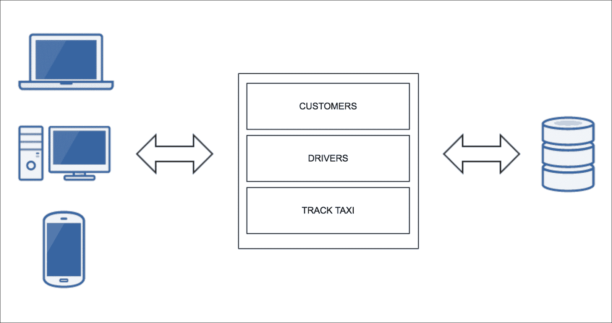
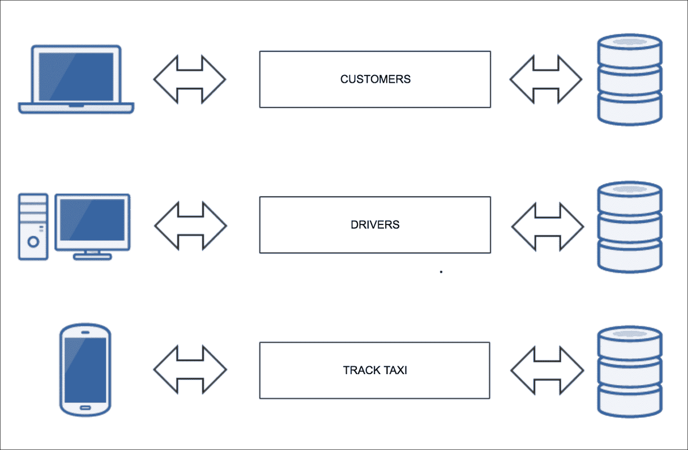
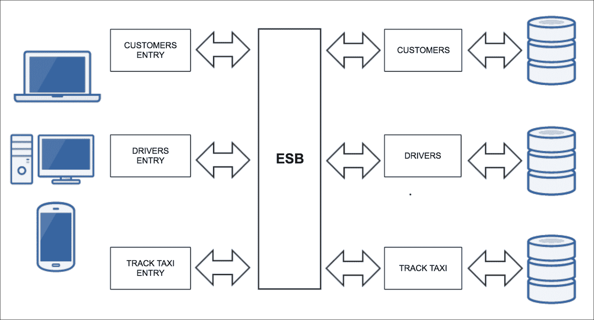

# 第一章：什么是微服务？

好的项目需要好的解决方案；这就是为什么开发人员总是在寻找更好的工作方式。没有适用于所有项目的最佳解决方案，因为每个项目都有不同的需求，架构师（或开发人员）必须为该特定项目找到最佳解决方案。

微服务可能是解决问题的一个好方法；在过去几年中，像 Netflix、PayPal、eBay、亚马逊和 Spotify 这样的公司选择在他们自己的开发团队中使用微服务，因为他们认为这是他们项目的最佳解决方案。要理解他们为什么选择微服务，并了解应该在哪种项目中使用它们，有必要了解什么是微服务。

首先，了解什么是单片应用是至关重要的，但基本上，我们可以将微服务定义为扩展的面向服务的架构。换句话说，这是一种通过遵循将应用程序转变为各种小服务所需的步骤来开发应用程序的方式。每个服务将自行执行并通过请求与其他服务通信，通常使用 HTTP 上的 API。

要进一步了解什么是微服务，我们首先需要了解什么是单片应用。这是我们过去几年一直在开发的典型应用，例如在 PHP 中使用像 Symfony 这样的框架；换句话说，我们一直在开发的所有应用都被划分为不同的部分，如前端、后端和数据库，并且还使用 MVC 模式。重要的是要区分 MVC 和微服务。MVC 是一种设计模式，而微服务是一种开发应用的方式；因此，使用 MVC 开发的应用仍然可能是单片应用。人们可能会认为，如果我们将应用程序分割到不同的机器上，并将业务逻辑与模型和视图分开，那么应用程序就是基于微服务的，但这是不正确的。

然而，使用单片架构仍然有其优势。还有一些巨大的网络应用，比如 Facebook，使用它；我们只需要知道何时需要使用单片架构，何时需要使用微服务。

# 单片与微服务

现在，我们将讨论使用单片应用的优缺点以及微服务如何通过提供一个基本示例来改进特定项目。

想象一下像 Uber 这样的出租车平台；在这个例子中，平台将是一个小型平台，只有基本的东西，以便理解定义。有顾客、司机、城市，以及一个实时跟踪出租车位置的系统：

在单片系统中，所有这些都在一起---我们有一个与顾客和司机相关联的公共数据库，这些都与城市相关联，并且所有这些都与使用外键跟踪出租车的系统相关联。

所有这些也可以托管在不同的机器上，使用主从数据库；后端可以在不同的实例中使用负载均衡器或反向代理，前端可以使用不同的技术，如 Node.js 甚至纯 HTML。即便如此，平台仍然是一个单片应用。

让我们看一个在单片应用中可能面临的问题的例子：

+   两位开发人员 Joe 和 John 正在基本的出租车示例项目上工作；Joe 需要更改一些关于司机的代码，而 John 需要更改一些关于顾客的代码。第一个问题是，这两位开发人员都在同一个基本代码上工作；这不是一个独占的单片问题，但如果 Joe 需要在司机模型上添加一个新字段，他可能也需要更改顾客的模型，因此 Joe 的工作不仅仅局限在司机方面；换句话说，他的工作没有被界定。这就是当我们使用单片应用时会发生的情况。

+   乔和约翰意识到，跟踪出租车的系统必须与调用外部 API 的第三方进行通信。应用程序的负载并不是很大，但跟踪出租车的系统却有很多来自顾客和司机的请求，因此在那一方面存在瓶颈。乔和约翰必须对其进行扩展以解决跟踪系统上的问题：他们可以获得更快的机器、更多的内存和负载均衡器，但问题是他们必须对整个应用程序进行扩展。

+   乔和约翰很高兴；他们刚刚解决了跟踪出租车系统的问题。现在他们将把更改放到生产服务器上。他们将不得不在网站应用程序的流量较低时工作；风险很高，因为他们必须部署整个应用程序，而不仅仅是他们修复的跟踪出租车系统。

+   在几个小时内，应用程序出现了 500 错误。乔和约翰知道问题与跟踪系统有关，但整个应用程序将会崩溃，只是因为应用程序的一部分出了问题。

微服务是一个简单的、独立的实体，具有明确的目标。它是独立的，并通过约定的通道与其他微服务进行通信，如下图所示：

对于习惯于面向对象编程的开发人员来说，微服务的概念就像是一个封装的对象在不同的机器上运行，并且与其他在不同机器上运行的对象隔离。

按照之前的例子，如果我们在跟踪出租车的系统上出现问题，就需要隔离与该部分应用程序相关的所有代码。这有点复杂，将在第九章“从单体架构到微服务”中详细解释，但总的来说，这是一个专门用于跟踪出租车的系统的数据库，因此我们需要提取出这部分，并修改代码以使其与提取出的数据库一起工作。一旦目标实现，我们将拥有一个可以被单体应用程序的其余部分调用的微服务 API（或任何其他渠道）。

这将避免之前提到的问题——乔和约翰可以独立处理他们自己的问题，因为一旦应用程序被划分为微服务，他们将处理顾客或司机微服务。如果乔需要更改代码或包含新字段，他只需要在自己的实体中进行更改，约翰将使用司机 API 从顾客部分进行通信。

可扩展性只需针对这个微服务进行，因此不需要花费金钱和资源来扩展整个应用程序，如果跟踪出租车的系统出现问题，其余应用程序将可以正常工作。

使用微服务的另一个优势是它们对语言是不可知的；换句话说，每个微服务可以使用不同的语言。一个用 PHP 编写的微服务可以与用 Python 或 Ruby 编写的其他微服务进行通信，因为它们只向其他微服务提供 API，因此它们只需共享相同的接口来相互通信。

# 面向服务的架构与微服务

当开发人员遇到微服务并了解面向服务的架构（SOA）软件设计风格时，他们首先要问自己的问题是 SOA 和微服务是否是同一回事，或者它们是否相关，答案有点具有争议性；取决于你问的人，答案会有所不同。

根据马丁·福勒（Martin Fowler）的说法，SOA 专注于将单体应用程序相互集成，并使用企业服务总线（ESB）来实现这一目标。

当 SOA 架构开始出现时，它们试图将不同的组件连接在一起，这是微服务的特点之一，但 SOA 的问题在于它需要许多围绕架构工作的东西，如 ESB、**业务流程管理**（**BPM**）、服务存储库、注册表等等，因此这使得开发变得更加困难。此外，为了更改代码的某些部分，需要先与其他开发团队达成一致。

所有这些因素使得维护和代码演进变得困难，上市时间变长；换句话说，这种架构并不适合经常需要实时更改的应用程序。

关于 SOA 还有其他观点。有人说 SOA 和微服务是一样的，但 SOA 是理论，微服务是一个很好的实现。使用 ESB 或使用 WSDL 或 WADL 进行通信并不是必须的，但它被定义为 SOA 的标准。如下图所示，使用 SOA 和 ESB 的架构如下所示：

请求通过不同的方式到达；这与微服务的工作方式相同，但所有请求都到达 ESB，它知道应该调用哪里来获取数据。

# 微服务特点

接下来，我们将看一下微服务架构的关键要素：

+   **准备失败**：微服务被设计为失败。在 Web 应用程序中，微服务相互通信，如果其中一个失败，其余部分应该继续工作以避免级联故障。基本上，微服务试图避免使用同步通信，而是使用异步调用、队列、基于 actor 的系统和流。这个话题将在接下来的章节中讨论。

+   **Unix 哲学**：微服务应该遵循 Unix 哲学。每个微服务必须设计为只做一件事，并且应该小而独立。这使我们作为开发人员能够独立调整和部署每个微服务。Unix 哲学强调构建简单、简短、清晰、模块化和可扩展的代码，这样可以方便开发人员进行维护和重用，而不仅仅是其创建者。

+   **通信层**：每个微服务通过 HTTP 请求和消息与其他微服务通信，执行业务逻辑，查询数据库，与所需系统交换消息，最终返回 JSON（或 HTML/XML）响应。

+   **可扩展性**：选择微服务架构的主要原因是可以轻松扩展应用程序。应用程序越大，流量越大，选择微服务的合理性就越大。微服务可以在不影响应用程序的其他部分的情况下扩展所需的部分。

## 成功案例

了解微服务在现实生活中有多重要的最好方法是了解一些决定发展并使用微服务的平台，考虑未来并使维护和扩展更容易、更快速、更有效：

+   **Netflix**：在线视频流媒体的头号应用在几年前将其架构转变为微服务。有一个关于他们决定使用微服务的原因的故事。在对评论模块进行更改时，一名开发人员忘记在行尾加上`;`，导致 Netflix 宕机了很多小时。该平台每天约 30%的总流量来自美国，因此 Netflix 必须向每月付费的客户提供稳定的服务。为了实现这一点，Netflix 对每个我们发出的请求进行五次请求，并且可以使用其流媒体视频 API 从 800 个不同的设备获取请求。

+   **eBay**：在 2007 年，eBay 决定将其架构改为微服务；他们曾在 C++和 Perl 上使用单片应用程序，后来他们转向了基于 Java 构建的服务，最终实施了微服务架构。它的主要应用程序有许多服务，每个服务都执行自己的逻辑，以供每个领域的客户使用。

+   **Uber**：微服务使得这家公司能够快速增长，因为它允许使用不同的语言（Node.js、Go、Scala、Java 或 Python）用于每个微服务，而且招聘工程师的过程更容易，因为他们不受语言代码的限制。

+   **亚马逊**：也许亚马逊不是互联网流量之王，但它几年前就转向了微服务，成为最早使用实时微服务的公司之一。工程师们表示，使用旧的单片应用程序无法提供他们提供的所有服务，比如网络服务。

+   **Spotify**：对于 Spotify 来说，比对手更快是必须的。主要工程师尼古拉斯·古斯塔夫森表示，快速、自动化一切以及拥有更小的开发团队对应用程序非常重要。这就是为什么 Spotify 使用微服务的原因。

## 微服务的缺点

接下来，我们将看看微服务架构的缺点。当询问开发人员时，他们认为微服务的主要问题是在生产服务器上进行调试。

基于微服务的应用程序调试可能会有点繁琐，特别是当你的应用程序中有数百个微服务时，你需要找到问题出在哪里；你需要花时间寻找给你报错的微服务。每个微服务都像一个独立的机器，所以要查看特定的日志，你必须去特定的微服务。幸运的是，有一些工具可以帮助我们解决这个问题，可以从应用程序中的所有不同微服务中获取日志，并将它们汇总到一个位置。在接下来的章节中，我们将看看这些工具。

另一个缺点是需要将每个微服务都作为一个完整的服务器进行维护；换句话说，每个微服务都可以有一个或多个数据库、日志、不同的服务或库版本，甚至代码可以使用不同的语言，因此如果维护单个服务器困难，那么维护数百个服务器将浪费金钱和时间。

此外，微服务之间的通信非常重要---它们必须像时钟一样工作，因此通信对于应用程序至关重要。为了做到这一点，开发团队之间的沟通将是必要的，彼此告知他们需要什么，同时为每个微服务编写良好的文档也是必要的。

与微服务一起工作的一个好的做法是自动化一切，或者至少尽可能自动化一切。也许最重要的部分是部署。如果需要部署数百个微服务，这可能会很困难。因此，最好的方法是自动化这些任务。我们将在接下来的章节中看看如何做到这一点。

# 如何将开发重点放在微服务上

开发微服务是一种新的思维方式。因此，当您第一次遇到应用程序的设计和构建时，可能会感到困难。然而，如果您始终记住微服务背后最重要的思想是将应用程序分解为更小的逻辑部分的需求，那么您已经完成了一半。

一旦理解了这一点，以下核心思想将有助于您的应用程序的设计和构建过程。

## 始终创建小的逻辑黑匣子

作为开发人员，你总是从你将要构建的大局开始。尝试将大局分解为只做一件事情的小逻辑块。一旦多个小块准备就绪，你可以开始构建复杂的系统，确保你的应用程序的基础是坚实的。

你的每个微服务都像一个黑匣子，有一个公共接口，这是与你的软件交互的唯一方式。你需要牢记的主要建议是构建一个非常稳定的 API。你可以在不引起太多问题的情况下更改 API 调用的实现，但是如果你改变调用的方式甚至是这个调用的响应，你将陷入麻烦。在对 API 进行重大更改的情况下，确保使用某种版本控制，以便你可以支持旧版本和新版本。

## 网络延迟是你隐藏的敌人

服务之间的通信是通过使用网络作为连接管道的 API 调用进行的。这种消息交换需要一些时间，由于多种因素，它的时间不会总是相同。想象一下，你在一台机器上有*service_a*，在另一台机器上有*service_b*。你认为网络延迟会一直是一样的吗？如果，例如，其中一台服务器负载很高，需要一些时间来处理请求，会发生什么？为了减少时间，始终关注你的基础设施，监控一切，并在可用时使用压缩。

## 始终考虑可扩展性

微服务应用的主要优势之一是每个服务都可以进行扩展。通过将有状态服务的数量减少到最低，可以实现这种灵活性。有状态服务依赖于数据持久性，这使得在没有数据一致性问题的情况下移动或共享数据变得困难。

使用自动发现和自动注册技术，你可以构建一个系统，它始终知道谁将处理每个请求。

## 使用轻量级通信协议

没有人喜欢等待，即使是你的微服务也是如此。不要试图重新发明轮子或使用一个晦涩但很酷的通信协议，使用 HTTP 和 REST。它们为所有的 Web 开发人员所熟知，它们快速、可靠、易于实现，非常容易调试。如果需要增加安全性，实现 SSL/TSL。

## 使用队列来减少服务负载或进行异步执行。

作为开发人员，你希望使你的系统尽可能快。因此，增加 API 调用的执行时间只因为它在等待可以在后台完成的某些操作是没有意义的。在这些情况下，最好的方法是使用队列和作业运行程序来处理后台处理。

想象一下，你有一个通知系统，在微服务电子商务上下订单时向客户发送电子邮件。你认为客户想要等待看到支付成功页面，只是因为系统正在尝试发送电子邮件吗？在这种情况下，更好的方法是将消息加入队列，这样客户将会有一个非常快速的感谢页面。稍后，作业运行程序将提取排队的通知，并将电子邮件发送给客户。

## 为最坏的情况做好准备

你有一个建立在微服务之上的漂亮、新颖、好看的网站。当一切都出错的时候，你准备好了吗？如果你遇到了网络分区，你知道你的应用程序是否能从这种情况中恢复吗？现在，想象一下你有一个推荐系统，它出现了问题，你会在尝试恢复死掉的服务时给客户一个默认的推荐吗？欢迎来到分布式系统的世界，在这里，一旦出现问题，情况可能会变得更糟。始终牢记这一点，并尝试为任何情况做好准备。

## 每个服务都是不同的，因此保持不同的存储库和构建环境

我们正在将一个应用程序分解成小部分，我们希望对其进行扩展和独立部署，因此将源代码保留在不同的存储库中是有意义的。拥有不同的构建环境和存储库意味着每个微服务都有自己的生命周期，并且可以在不影响应用程序的其他部分的情况下进行部署。

在接下来的章节中，我们将更深入地研究所有这些想法，以及如何使用不同的驱动开发来实现它们。

# 使用 PHP 构建微服务的优势

要理解为什么 PHP 是构建微服务的合适编程语言，我们需要稍微了解一下它的历史，它的起源，它试图解决的问题以及语言的演变。

## PHP 的简短历史

1994 年，Rasmus Lerdorf 创建了我们可以说是 PHP 的第一个版本。他用 C 语言构建了一套小型的**公共网关接口**（**CGI**）来维护他的个人网页。这套脚本被称为*个人主页工具*，但更常被称为*PHP 工具*。

时间过去了，Rasmus 重写并扩展了这套脚本，使其能够与 Web 表单一起工作，并具有与数据库通信的能力。这个新的实现被称为*个人主页/表单解释器*或*PHP/FI*，并作为其他开发人员可以构建动态 Web 应用程序的框架。1995 年 6 月，源代码以*个人主页工具*（*PHP 工具*）*版本 1.0*的名义向公众开放，允许世界各地的开发人员使用它，修复错误并改进这套脚本。

PHP/FI 的最初想法并不是创建一种新的编程语言，Lerdorf 让它自然生长，导致了一些问题，比如函数名称或参数的不一致性。有时函数名称与 PHP 正在使用的低级库相同。

1995 年 10 月，Rasmus 发布了代码的新重写；这是第一个被认为是高级脚本接口的发布，PHP 开始成为今天的编程语言。

作为一种语言，PHP 的设计与 C 语言的结构非常相似，因此对于熟悉 C、Perl 或类似语言的开发人员来说更容易被接受。随着语言功能的增长，早期采用者的数量也开始增长。1998 年 5 月的 Netcraft 调查显示，几乎有 6 万个域名包含了 PHP 的头部信息（占当时互联网域名的 1%左右），这表明主机服务器已经安装了 PHP。

PHP 历史上的一个重要时刻是 1997 年以色列特拉维夫的 Andi Gutmans 和 Zeev Suraski 加入了这个项目。在这个时候，他们对解析器进行了另一次完全重写，并开始开发一种新的独立编程语言。这种新语言被命名为 PHP，意思是递归缩写---**PHP**（**超文本预处理器**）。

PHP 3 的官方发布是在 1998 年 6 月，包括了许多功能，使该语言适用于各种项目。其中一些功能包括成熟的多数据库接口，支持多种协议和 API，以及扩展语言本身的便利性。在所有功能中，最重要的是包括了面向对象编程和更强大、一致的语言语法。

Andi Gutmans 和 Zeev Suraski 成立了 Zend Technologies，并于 1999 年开始重写 PHP 的核心，创建了 Zend 引擎。Zend Technologies 成为了最重要的 PHP 公司，也是源代码的主要贡献者。

这只是一个开始，随着时间的推移，PHP 在功能、语言稳定性、成熟度和开发者采用方面不断增长。

## PHP 的里程碑

现在我们有了一些历史背景，我们可以专注于 PHP 在这些年里取得的主要里程碑。每个版本都增加了语言的稳定性，并添加了越来越多的功能。

### 4.x 版本

PHP 4 是第一个包含 Zend 引擎的版本。这个引擎提高了 PHP 的平均性能。除了 Zend 引擎，PHP 4 还包括对更多 Web 服务器、HTTP 会话、输出缓冲和增强安全性的支持。

### 5.x 版本

PHP 5 于 2004 年 7 月 13 日发布，使用了 Zend Engine II，再次提高了语言的性能。这个版本包括了对**面向对象**（**OO**）编程的重要改进，使语言更加灵活和健壮。现在，用户可以选择以过程化或稳定的面向对象方式开发应用程序；他们可以兼得两者的优点。在这个版本中，还包括了连接到数据存储的最重要的扩展之一---**PHP 数据对象**（**PDO**）扩展。

随着 PHP 5 在 2008 年成为最稳定的版本，许多开源项目开始在他们的新代码中终止对 PHP 4 的支持。

### 6.x 版本

这个版本是 PHP 最著名的失败之一。这个主要版本的开发始于 2005 年，但在 2010 年因 Unicode 实现的困难而被放弃。并非所有的工作都被抛弃，大部分功能，其中包括命名空间，都被添加到了之前的版本中。顺便说一句，版本 6 通常与技术世界中的失败联系在一起：PHP 6、Perl 6，甚至 MySQL 6 都从未发布。

### 7.x 版本

这是一个期待已久的发布---一个统治所有的发布，一个具有前所未有的性能水平的发布。

2015 年 12 月 3 日，发布了最后一个 Zend 引擎的 7.0.0 版本。仅通过在您的机器上更改运行版本，性能提高了 70%，内存占用非常小。

语言也在不断发展，PHP 现在具有更好的 64 位支持和安全的随机数生成器。现在你可以创建匿名类或定义返回类型等其他重大改变。

这个版本成为了其他所谓的*企业语言*的严肃竞争对手。

## 优势

PHP 是你可以用来构建你的 Web 项目的最常用的编程语言之一。如果你还不确定 PHP 是否适合你的下一个应用程序，让我们告诉你使用 PHP 的主要优势：

+   **庞大的社区**：很容易参加全球各地的 ZendCon、PHP[world]或国际 PHP 大会等会议、活动和聚会。你不仅可以在活动和会议上与其他 PHP 开发者交流，还可以加入 IRC/Slack 频道或邮件列表提问和保持更新。你可以在官方网站上的[`php.net/cal.php`](http://php.net/cal.php)找到附近地区的活动地点之一。

+   **文档齐全**：关于这种语言的主要信息可以在 PHP 网站上找到（[`php.net/docs.php`](http://php.net/docs.php)）。这个参考指南涵盖了 PHP 的每个方面，从基本的控制流到高级主题。你想读一本书吗？没问题，你很容易在 15000 多本亚马逊参考书中找到合适的书。即使你需要更多信息，快速在谷歌上搜索就会给你超过 93 亿的结果。

+   **稳定**：PHP 项目经常发布版本，并同时维护几个主要版本，直到它们计划的**生命周期结束**（**EOL**）。通常，发布和 EOL 之间的时间足以转移到下一个主流版本。

+   **易于部署**：PHP 是最受欢迎的服务器端编程语言，在 2016 年 8 月的使用率达到 81.8%，所以市场也朝着同一个方向发展。很容易找到一个预安装了 PHP 并且可以直接使用的托管提供商，所以你只需要处理部署的问题。

有许多部署代码到生产环境的方法。例如，你可以在 Git 存储库中跟踪你的代码，然后稍后在服务器上进行 Git 拉取。你也可以通过 FTP 将文件推送到公共位置。你甚至可以使用 Jenkins、Docker、Terraform、Packer、Ansible 或其他工具构建一个**持续集成**/**持续交付**（**CI**/**CD**）系统。部署的复杂性将始终与项目的复杂性相匹配。

+   **易于安装**：PHP 在主要操作系统上都有预构建的软件包：它可以安装在 Linux、Mac、Windows 或 Unix 上。有时软件包可以在软件包系统内获得（例如 apt）。在其他情况下，你需要外部工具来安装它，比如 Homebrew。在最坏的情况下，你可以下载源代码并在你的机器上编译它。

+   **开源**：所有 PHP 源代码都可以在 GitHub 上找到，因此任何开发人员都可以轻松地深入了解一切是如何工作的。这种开放性允许程序员参与项目，扩展语言或修复错误。PHP 使用的许可证是**伯克利软件发行**（**BSD**）风格的许可证，没有与 GPL 相关的*版权*限制。

+   **高运行速度（PHP 7）**：过去，PHP 的速度不够快，但这种情况在 PHP 7 中完全改变了。这个主要版本是基于**PHP Next-Gen**（**PHPNG**）项目，由 Zend Technologies 领导。PHPNG 的理念是加速 PHP 应用程序，他们做得非常好。仅通过更改 PHP 版本，性能提升可以在 25%到 70%之间变化。

+   **大量可用的框架和库**：PHP 生态系统在库和框架方面非常丰富。找到适合你的项目的库的常见方法是使用 PEAR 和 PECL。

关于可用的框架，你可以使用最好的之一，例如 Zend Framework、Symfony、Laravel、Phalcon、CodeIgniter，或者如果找不到符合你要求的框架，你可以从头开始构建一个。最好的部分是所有这些都是开源的，所以你可以随时扩展它们。

+   **高开发速度**：PHP 具有相对较小的学习曲线，这可以帮助你从头开始编码。此外，与 C、Perl 和其他语言的语法相似性可以让你很快理解一切是如何工作的。PHP 避免了等待编译器生成我们的构建所浪费的时间。

+   **易于调试**：你可能知道，PHP 是一种解释性语言。因此，在解决问题时，你有多种选择。简单的方法是放置一些`var_dump`或`print_r`调用来查看代码的执行情况。为了更深入地查看执行情况，你可以将你的 IDE 链接到 Xdebug 或 Zend Debug，并开始跟踪你的应用程序。

+   **易于测试**：没有现代编程语言能在野外生存而没有适当的测试套件，所以你必须确保你的应用程序将继续按预期运行。不用担心，PHP 社区支持你，因为你有多种工具可进行任何类型的测试。例如，你可以使用 PHPUnit 进行你的**测试驱动开发**（**TDD**），或者如果你遵循**行为驱动开发**（**BDD**），可以使用 Behat。

+   **你可以做任何事情**：PHP 是一种现代编程语言，在现实世界中有多种应用。因此，只有天空是极限！你可以使用 GTK 扩展构建 GUI 应用程序，或者你可以在 phar 存档中创建一个包含所有所需文件的终端命令。这种语言没有限制，所以任何东西都可以构建。

## 缺点

像任何编程语言一样，PHP 也有一些缺点。一些最常见的缺点包括：安全问题，不适合大型应用程序和弱类型。PHP 最初是一组 CGI 的集合，并且随着多年的发展变得更加现代和健壮，因此与其他语言相比，它非常健壮和灵活。

无论如何，有经验的开发人员在构建应用程序时，如果使用最佳实践，就不会遇到这些缺点。

正如你已经看到的，PHP 的发展是巨大的。它拥有最活跃的社区之一，是为网络而生，并且具有创建任何类型项目所需的所有功能。毫无疑问，PHP 将是您表达最佳创意的正确语言。

# 总结

在本章中，我们探讨了微服务与单体架构和 SOA 的对比。我们了解了微服务架构的基本组件及其优缺点。在本章的后半部分，我们讨论了如何实施微服务架构以及在转向微服务之前需要考虑的先决条件。随后，我们介绍了 PHP 版本的历史以及它们的优缺点。
