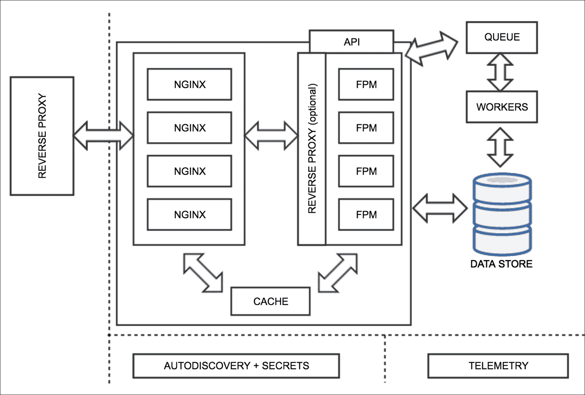
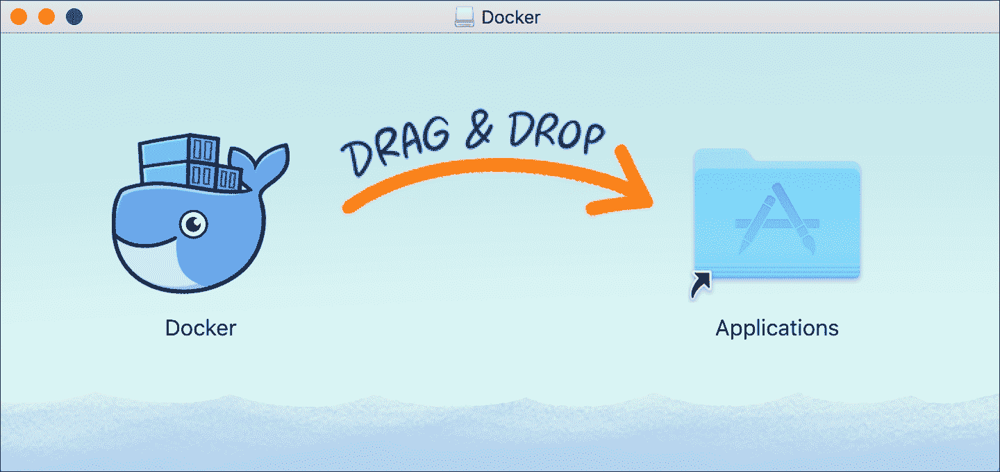
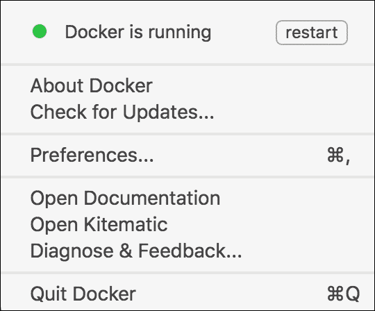
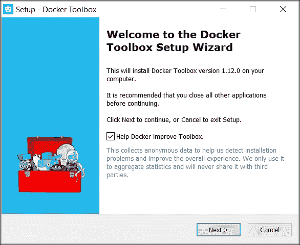
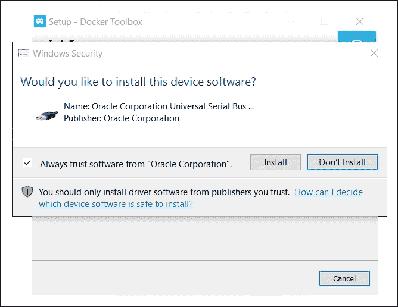
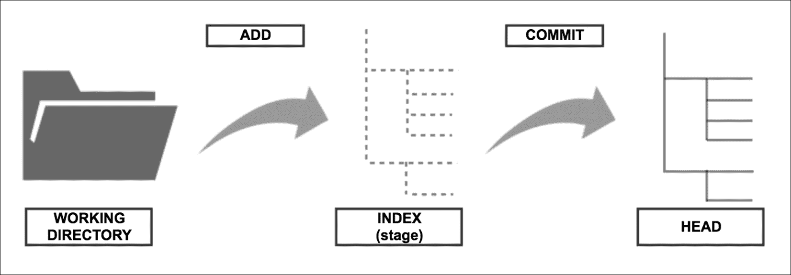
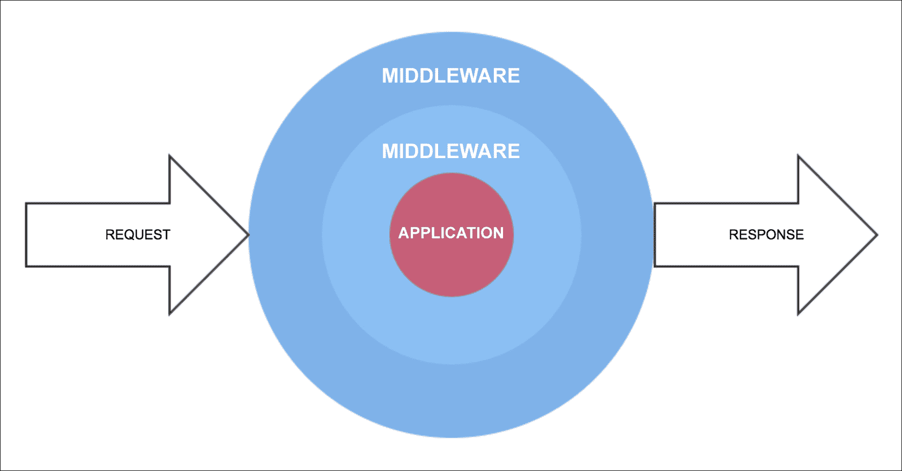

# 第二章：开发环境

在本章中，我们将开始构建基于微服务的应用程序，现在我们知道为什么微服务对于应用程序的开发是必要的，以及如果我们基于微服务构建应用程序可以享受到的优势。

我们将在本书中开发的应用程序（类似于 Pokemon GO）被称为“寻找秘密”。这个应用程序将像一个使用地理位置信息来寻找世界各地不同秘密的游戏。整个世界都隐藏着许多秘密，玩家们必须尽快找到它们。有 100 种不同类型的秘密，它们每天会在世界的不同地方生成和出现，因此玩家可以通过在不同地区四处走动并检查附近是否有任何类型的秘密来找到它们。

秘密将保存在应用程序钱包中，如果玩家发现他们已经拥有的秘密，他们将无法收集它。

玩家可以在附近与其他玩家进行决斗。决斗包括掷骰子以获得最高点数，输掉的玩家将向另一名玩家随机透露一个秘密。

在接下来的章节中，具体功能将更加详细，但在本章中，我们只需要了解应用程序的工作方式，以便对整个应用程序有一个总体概述，从而开始构建基于微服务的基本平台。

# 用于构建微服务基本平台的设计和架构

创建基于微服务的应用程序不像单片应用程序。因此，我们必须将功能划分为不同的服务。为此，根据其要求，按照适当的设计和结构每个微服务是很重要的。

设计负责将应用程序分成逻辑部分，并根据它们的现有关系对它们进行分组。架构负责定义哪些具体元素支持每个微服务，例如数据存储位置或服务之间的通信。

在整本书中，我们将遵循每个微服务的给定结构。在下图中，您将看到一个微服务的结构，其余的微服务类似；但是，有些部分是可选的：



我们所有微服务的请求都来自反向代理，因为这样可以平衡负载。此外，我们使用 NGINX 作为 PHP 构建的 API 的网关。为了减少负载并提高 PHP 和 NGINX 的性能，我们可以使用缓存层。

如果我们需要执行大型、消耗资源的任务，或者任务不需要在具体时间窗口内执行，我们的 API 可以使用队列系统。

如果我们需要存储一些数据，我们的 API 负责管理访问并将数据保存在我们的数据存储中。

### 注意

在本书中，我们将使用容器化，这是一种新的虚拟化方法，它会启动容器而不是完整的虚拟机。每个容器只会安装运行应用程序所需的最低资源和软件。

我们可以使用遥测（它是一个从容器获取统计数据的系统）和自动发现（它是一个帮助我们查看哪些容器正常工作的系统）来监督容器生态系统。

# 开始使用微服务的要求

现在您了解了为什么可以使用 PHP（特别是最新版本 7）来进行下一个项目，是时候谈谈您的微服务项目成功的其他要求了。

您可能已经意识到应用程序的可扩展性的重要性，但如何在预算内实现呢？答案是虚拟化。使用这项技术，您将浪费更少的资源。过去，同一硬件上一次只能执行一个**操作系统**（**OS**），但随着虚拟化的诞生，您可以同时运行多个操作系统。您的项目最大的成就将是，您将运行更多专用于您的微服务的服务器，但使用更少的硬件。

鉴于虚拟化和容器化提供的优势，如今在基于微服务的应用程序开发中使用容器已成为默认标准。有多个容器化项目，但最常用和受支持的是 Docker。因此，这是开始使用微服务的主要要求。

以下是我们将在 Docker 环境中使用的不同工具/软件：

+   PHP 7

+   数据存储：Percona，MySQL，PostgreSQL

+   反向代理：NGINX，Fabio，Traefik

+   依赖管理：composer

+   测试工具：PHPUnit，Behat，Selenium

+   版本控制：Git

在第五章中，*微服务开发*，我们将解释如何将它们添加到我们的项目中。

由于我们的主要要求是容器化套件，我们将在接下来的章节中解释如何安装和测试 Docker。

## Docker 安装

Docker 可以从两个不同的渠道安装，各有优缺点：

+   **稳定渠道**：顾名思义，您从该渠道安装的所有内容都经过充分测试，您将获得 Docker 引擎的最新 GA 版本。这是最可靠的平台，因此适用于生产环境。通过该渠道，发布遵循版本计划，经过长时间的测试和 beta 时间，只是为了确保一切都应该按预期工作。

+   **Beta channel**: 如果您需要拥有最新功能，这是您的渠道。所有安装程序都配备了 Docker 引擎的实验版本，可能会出现错误，因此不建议用于生产环境。该渠道是 Docker beta 计划的延续，您可以提供反馈，没有版本计划，因此会有更频繁的发布。

我们将开发一个稳定的生产环境，所以现在您可以忘记 beta 渠道，因为您所需的一切都在稳定版本中。

Docker 诞生于 Linux，因此最佳实现是针对该操作系统完成的。对于其他操作系统，如 Windows 或 macOS，您有两个选择：本机实现和如果无法使用本机实现，则进行工具箱安装。

### 在 macOS 上安装 Docker

在 macOS 上，您有两种安装 Docker 的选择，取决于您的机器是否符合最低要求。对于相对较新的机器（OS X 10.10 Yosemite 及更高版本），您可以安装使用 Hyperkit 的本机实现，这是一个轻量级的 OS X 虚拟化解决方案，构建在**Hypervisor.Framework**之上。如果您有一台不符合最低要求的旧机器，您可以安装 Docker 工具箱。

#### Docker for Mac（别名，本机实现）与 Docker 工具箱

Docker 工具箱是 macOS 上 Docker 的第一个实现，它没有深度的操作系统集成。它使用 VirtualBox 来启动一个 Linux 虚拟机，Docker 将在其中运行。在虚拟机中运行所有容器会有很多问题，最明显的是性能不佳。但是，如果您的机器不符合本机实现的要求，这是理想的选择。

Mac 上的 Docker 是一个本地 Mac 应用程序，具有本地用户界面和自动更新功能，并且与 OS X 本地虚拟化（Hypervisor.Framework）、网络和文件系统深度集成。这个版本比 Docker Toolbox 更快、更易于使用，更可靠。

#### 最低要求

+   Mac 必须是 2010 年或更新的型号，具有英特尔硬件对**内存管理单元**（**MMU**）虚拟化的支持；也就是**扩展页表**（**EPT**）。

+   OS X 10.10.3 Yosemite 或更新版本

+   至少 4GB 的 RAM

+   在安装 Docker for Mac 之前，不能安装 VirtualBox 4.3.30 之前的版本（它与 Mac 上的 Docker 不兼容）

#### Mac 上的 Docker 安装过程

如果你的机器符合要求，你可以从官方页面下载 Mac 上的 Docker，即[`www.docker.com/products/docker`](https://www.docker.com/products/docker)。

一旦你在你的机器上下载了镜像，你可以执行以下步骤：

1.  双击下载的镜像（名为`Docker.dmg`）以打开安装程序。一旦镜像被挂载，你需要将 Docker 应用程序拖放到`Applications`文件夹中：

`Docker.app`在安装过程中可能会要求你输入密码，以特权模式安装和设置网络组件。

1.  安装完成后，Docker 将出现在你的 Launchpad 和`Applications`文件夹中。执行该应用程序以启动 Docker。一旦 Docker 启动，你将在工具栏中看到鲸鱼图标。这将是你快速访问设置的方式。

1.  点击工具栏上的鲸鱼图标以获取**首选项...**和其他选项：

1.  点击**关于 Docker**以查看你是否在运行最新版本。

### 在 Linux 上安装 Docker

Docker 生态系统是在 Linux 上开发的，因此在这个操作系统上的安装过程更容易。在接下来的页面中，我们将只涵盖在**Community ENTerprise Operating System**（**CentOS**）/**Red Hat Enterprise Linux**（**RHEL**）（它们使用 yum 作为包管理器）和 Ubuntu（使用 apt 作为包管理器）上的安装。

#### CentOS/RHEL

Docker 可以在 CentOS 7 上执行，也可以在任何其他二进制兼容的 EL7 发行版上执行，但 Docker 在这些兼容的发行版上没有经过测试或支持。

#### 最低要求

安装和执行 Docker 的最低要求是拥有 64 位操作系统和 3.10 或更高版本的内核。如果你需要知道你当前的版本，你可以打开终端并执行以下命令：

```php
**$ uname -r 
3.10.0-229.el7.x86_64** 

```

请注意，建议你的操作系统保持最新，以避免任何潜在的内核错误。

#### 使用 yum 安装 Docker

首先，你需要有一个具有 root 权限的用户；你可以以这个用户登录你的机器，或者在你选择的终端上使用`sudo`命令。在接下来的步骤中，我们假设你正在使用一个 root 或特权用户（如果你没有使用 root 用户，请在命令中添加 sudo）。

首先确保你所有现有的包都是最新的：

```php
**yum update**

```

现在你的机器已经有了最新的可用包，你需要添加官方 Docker `yum`存储库：

```php
**# tee /etc/yum.repos.d/docker.repo <<-'EOF' 
[dockerrepo] 
name=Docker Repository 
baseurl=https://yum.dockerproject.org/repo/main/centos/7/ 
enabled=1 
gpgcheck=1 
gpgkey=https://yum.dockerproject.org/gpg 
EOF**

```

在将 yum 存储库添加到你的 CentOS/RHEL 之后，你可以使用以下命令轻松安装 Docker 包：

```php
**yum install docker-engine** 

```

你可以使用`systemctl`命令将 Docker 服务添加到你的操作系统的启动中（这一步是可选的）：

```php
**systemctl enable docker.service**

```

同样的`systemctl`命令可以用来启动服务：

```php
 **systemctl start docker** 

```

现在你已经安装并运行了所有东西，所以你可以开始测试和玩 Docker 了。

### 安装后设置 - 创建 Docker 组

Docker 作为绑定到 Unix 套接字的守护程序执行。此套接字由 root 拥有，因此其他用户访问它的唯一方式是使用`sudo`命令。每次使用任何 Docker 命令都要使用`sudo`命令可能很痛苦，但您可以创建一个名为`docker`的 Unix 组，并将用户分配给该组。通过进行这个小改变，Docker 守护程序将启动并将 Unix 套接字的所有权分配给这个新组。

以下是创建 Docker 组的命令：

```php
**groupadd docker**
**usermod -aG docker my_username**

```

执行完这些命令后，您需要注销并重新登录以刷新权限。

### 在 Ubuntu 上安装 Docker

Ubuntu 得到官方支持，主要建议使用 LTS（始终建议使用最新版本）：

+   Ubuntu Xenial 16.04（LTS）

+   Ubuntu Trusty 14.04（LTS）

+   Ubuntu Precise 12.04（LTS）

就像之前的 Linux 安装步骤一样，我们假设您是使用 root 或特权用户来安装和设置 Docker。

#### 最低要求

与其他 Linux 发行版一样，需要 64 位版本，并且您的内核版本至少需要 3.10。较旧的内核版本存在已知的错误，会导致数据丢失和频繁的内核崩溃。

要检查当前的内核版本，请打开您喜欢的终端并运行：

```php
**$ uname -r
3.11.0-15-generic** 

```

#### 使用 apt 安装 Docker

首先确保您的 apt 源指向 Docker 存储库，特别是如果您之前是通过 apt 安装 Docker。另外，更新您的系统：

```php
**apt-get update** 

```

现在您的系统已经更新，是时候安装一些必需的软件包和新的 GPG 密钥了：

```php
**apt-get install apt-transport-https ca-certificates 
apt-key adv --keyserver hkp://p80.pool.sks-keyservers.net:80 --recv-keys \ 58118E89F3A912897C070ADBF76221572C52609D** 

```

在 Ubuntu 上，很容易添加官方 Docker 存储库；您只需要在您喜欢的编辑器中创建（或编辑）`/etc/apt/sources.list.d/docker.list`文件。

如果您的旧存储库中有上述行，请删除所有内容并添加以下条目之一。确保与您当前的 Ubuntu 版本匹配：

```php
 **Ubuntu Precise 12.04 (LTS):**  
    deb https://apt.dockerproject.org/repo ubuntu-precise main 
    **Ubuntu Trusty 14.04 (LTS):**
    deb https://apt.dockerproject.org/repo ubuntu-trusty main 
    **Ubuntu Xenial 16.04 (LTS):**
    deb https://apt.dockerproject.org/repo ubuntu-xenial main 

```

保存文件后，您需要更新`apt`软件包索引：

```php
**apt-get update** 

```

如果您的 Ubuntu 上有以前的 Docker 存储库，则需要清除旧存储库：

```php
**apt-get purge lxc-docker** 

```

在 Trusty 和 Xenial 上，建议安装`linux-image-extra-*`内核包，允许您使用 AFUS 存储驱动程序。要安装它们，请运行以下命令：

```php
**apt-get update && apt-get install linux-image-extra-$(uname -r) linux-image-extra-virtual** 

```

在 Precise 上，Docker 需要 3.13 内核版本，因此请确保您有正确的内核；如果您的版本较旧，则必须升级。

此时，您的机器将准备好安装 Docker。可以使用单个命令，如`yum`：

```php
**apt-get install docker-engine** 

```

现在您已经安装并运行了所有内容，可以开始使用和测试 Docker。

#### Ubuntu 上的常见问题

如果您在使用 Docker 时看到与交换限制相关的错误，则需要在系统上启用内存和交换。可以通过 GNU GRUB 按照给定的步骤完成：

1.  编辑`/etc/default/grub`文件。

1.  将`GRUB_CMDLINE_LINUX`设置如下：

```php
        GRUB_CMDLINE_LINUX="cgroup_enable=memory swapaccount=1"

```

1.  更新 grub：

```php
 **update-grub**

```

1.  重新启动系统。

#### UFW 转发

Ubuntu 配备了**简化防火墙**（**UFW**），如果在运行 Docker 的同一主机上启用了它，您需要进行一些调整，因为默认情况下，UFW 将丢弃任何转发流量。此外，UFW 将拒绝任何传入流量，使得无法从不同主机访问您的容器。在干净的安装中，Docker 在未启用 TLS 的情况下运行时，Docker 默认端口为 2376。让我们配置 UFW！

首先，您可以检查 UFW 是否已安装并启用：

```php
**ufw status**

```

现在您确定 UFW 已安装并运行，可以使用您喜欢的编辑器编辑`config`文件`/etc/default/ufw`，并设置`DEFAULT_FORWARD_POLICY`：

```php
    vi /etc/default/ufw
    DEFAULT_FORWARD_POLICY="ACCEPT"
```

现在您可以保存并关闭`config`文件，在重新启动 UFW 后，您的更改将生效：

```php
**ufw reload**

```

允许传入连接到 Docker 端口可以使用`ufw`命令完成：

```php
**ufw allow 2375/tcp**

```

#### DNS 服务器

Ubuntu 及其衍生产品在`/etc/resolv.conf`文件中使用 127.0.0.1 作为默认名称服务器，因此当您使用此配置启动容器时，您将看到警告，因为 Docker 无法使用本地 DNS 名称服务器。

如果要避免这些警告，您需要指定一个 DNS 服务器供 Docker 使用，或者在`NetworkManager`中禁用`dnsmasq`。请注意，禁用`dnsmasq`会使 DNS 解析变慢一点。

要指定 DNS 服务器，您可以使用您喜欢的编辑器打开`/etc/default/docker`文件，并添加以下设置：

```php
    DOCKER_OPTS="--dns 8.8.8.8"
```

将`8.8.8.8`替换为您的本地 DNS 服务器。如果您有多个 DNS 服务器，可以添加多个`--dns`记录，用空格分隔。考虑以下示例：

```php
    DOCKER_OPTS="--dns 8.8.8.8 --dns 9.9.9.9"
```

一旦您保存了更改，您需要重新启动 Docker 守护程序：

```php
**service docker restart**

```

如果您没有本地 DNS 服务器，并且想要禁用`dnsmasq`，请使用您的编辑器打开`/etc/NetworkManager/NetworkManager.conf`文件，并注释掉以下行：

```php
    dns=dnsmasq
```

保存更改并重新启动 NetworkManager 和 Docker：

```php
**restart network-manager**
**restart docker**

```

### 安装后设置-创建 Docker 组

Docker 作为绑定到 Unix 套接字的守护程序执行。此套接字由 root 拥有，因此其他用户访问它的唯一方法是使用`sudo`命令。每次使用任何 docker 命令都使用`sudo`命令可能会很痛苦，但是您可以创建一个名为`docker`的 Unix 组，并将用户分配给此组。通过进行这个小改变，Docker 守护程序将启动并将 Unix 套接字的所有权分配给这个新组。

执行以下步骤创建一个 Docker 组：

```php
**groupadd docker
usermod -aG docker my_username** 

```

完成这些步骤后，您需要注销并重新登录以刷新权限。

#### 启动时启动 Docker

从 Ubuntu 15.04 开始，使用`systemd`系统作为其引导和服务管理器，而对于 14.10 版本和之前的版本，则使用`upstart`系统。

对于 15.04 及更高版本的系统，您可以通过运行给定的命令将 Docker 守护程序配置为在启动时启动：

```php
**systemctl enable docker**

```

对于使用旧版本的情况，安装方法会自动配置 upstart 以在启动时启动 Docker 守护程序。

### 在 Windows 上安装 Docker

Docker 团队为将他们的整个生态系统带到任何操作系统做出了巨大的努力，他们没有忘记 Windows。与 macOS 一样，您在此操作系统上安装 Docker 有两个选项：工具箱和更本地的选项。

#### 最低要求

Windows 版的 Docker 需要 64 位的 Windows 10 专业版、企业版和教育版（1511 年 11 月更新，版本 10586 或更高），并且必须启用`Hyper-V`包。

如果您的计算机运行的是不同版本，您可以安装需要 64 位操作系统的工具箱，至少在 Windows 7 上运行，并且在计算机上启用了虚拟化。如您所见，它的要求更轻。

由于 Docker for Windows 至少需要专业/企业/教育版本，而大多数计算机都是使用不同版本出售的，我们将解释如何使用工具箱安装 Docker。

#### 安装 Docker 工具

Docker 工具使用 VirtualBox 来启动运行 Docker 引擎的虚拟机。安装包可以从`https://www.docker.com/products/docker-toolbox`下载。

一旦您获得安装程序，您只需要双击下载的可执行文件即可开始安装过程。

安装程序显示的第一个窗口允许您将调试信息发送到 Docker，以改善生态系统。允许 Docker 引擎从您的开发环境发送调试信息可以帮助社区找到错误并改善生态系统。建议在开发环境中至少启用此选项：



就像任何其他 Windows 安装程序一样，您可以选择安装的位置。在大多数情况下，默认设置对于您的开发环境来说是可以的。

默认情况下，安装程序将向您的计算机添加所有必需的软件包和一些额外的软件。在安装的这一步，您可以清除一些不必要的软件。以下是一些可选软件包：

+   **Windows 的 Docker compose**：在我们看来，这是必不可少的，因为我们将在我们的书中使用这个软件包。

+   **Windows 的 Kitematic**：这个应用程序是一个 GUI，可以轻松管理您的容器。如果您不习惯使用命令行，可以安装这个软件包。

+   **Windows 的 Git**：这是另一个必须安装的软件包；我们将使用 Git 来存储和管理我们的项目。

选择要安装的软件包后，是时候进行一些额外的任务了。默认选择的任务对于您的开发环境来说是合适的。

现在，您只需要在安装开始之前确认您在之前步骤中所做的所有设置。

安装可能需要几分钟才能完成，所以请耐心等待。

在安装过程中，您可能会收到有关安装 Oracle 设备的警报。这是因为工具正在使用 VirtualBox 来启动一个虚拟机来运行 Docker 引擎。安装此设备以避免将来的麻烦：



恭喜！您已经在 Windows 机器上安装了 Docker。别浪费时间，开始测试和玩弄您的 Docker 生态系统。

## 如何检查您的 Docker 引擎、compose 和 machine 版本

现在您已经安装了 Docker，您只需要打开您喜欢的终端，并输入以下命令：

```php
**$ docker --version && docker-compose --version && docker-machine --version**

```

### 快速检查 Docker 安装的示例

您应该已经运行 Docker 并执行以下命令：

```php
**$ docker run -d -p 8080:80 --name webserver-test nginx**

```

上述命令将执行以下操作：

+   使用`-d`在后台执行容器

+   使用`-p 8080:80`将您机器的 8080 端口映射到容器的 80 端口

+   使用`--name webserver-test`为您的容器分配一个名称

+   获取 NGINX Docker 镜像并使容器运行此镜像。

现在，打开您喜欢的浏览器，导航到`http://localhost:8080`，您将看到一个默认的 NGINX 页面。

### 常见的管理任务

通过在终端上执行`docker ps`，您可以查看正在运行的容器。

上述命令让我们更深入地了解了在您的机器上运行的容器，它们正在使用的镜像，它们的创建时间，状态以及端口映射或分配的名称。

玩完容器后，是时候停止它了。执行`docker stop webserver-test`，容器将结束它的生命周期。

糟糕！您需要再次使用相同的容器。没问题，因为简单的`docker start webserver-test`将再次为您启动容器。

现在，是时候停止并删除容器了，因为您不再需要它。在您的终端上执行`docker rm -f webserver-test`就可以了。请注意，此命令将删除容器，但不会删除我们使用过的下载的镜像。对于最后一步，您可以执行`docker rmi nginx`。

# 版本控制 - Git 与 SVN

版本控制是一种工具，它可以帮助您回顾以前的源代码版本，以便检查和处理它们；它与使用的语言或技术无关，并且可以在所有以纯文本开发的软件中使用版本控制。

我们可以将版本控制工具分类为以下几类：

+   **集中式版本**：控制系统需要一个集中的服务器来工作，所有开发人员都需要连接到它，以便从中同步和下载更改。

+   **分布式版本**：控制系统不是集中的；换句话说，每个开发人员在自己的机器上拥有整个管理版本控制系统，因此可以在本地工作，然后与公共服务器或每个开发人员同步。**分布式版本控制系统**（**DVCS**）更快，因为它们在集中或共享服务器上需要更少的更改。

Subversion（SVN）是一个集中式版本控制系统，因此一些开发人员认为这是尊重整个项目工作的最佳方式，因此开发人员只需在一个地方编写和读取访问控制器。

整个代码都托管在一个地方，因此可能认为这样更容易理解 SVN 而不是 Git。事实是 SVN 命令行更简单，而且有更多的 GUI 可用于 SVN。原因很明显：SVN 自 2000 年以来就存在，而 Git 是 5 年后才出现的。

SVN 的另一个优点是版本编号系统更清晰；它使用顺序编号系统（1,2,3,4...），而 Git 使用更难以阅读和理解的 SHA-1 代码。

最后，使用 SVN 可以获得一个子目录来处理它，而无需拥有整个项目。对于小项目来说，这不是问题，但对于大项目来说可能会很困难。

## Git

在本书中，我们将使用 Git 进行版本控制。我们做出这个决定是因为 Git 绝对更快，更轻量级（占用的磁盘空间比 SVN 少 30 倍）。此外，Git 已成为 Web 开发版本控制的标准，我们的目标是基于 PHP 创建一个基于微服务的应用程序，因此 Git 是该项目的一个很好的解决方案。

Git 的优点如下：

+   分支比 SVN 更轻量级

+   Git 比 SVN 快得多

+   Git 从一开始就是一个分布式版本控制系统，因此开发人员对其本地拥有完全控制权

+   Git 在分支和合并方面提供更好的审计

在随后的章节中，我们将在我们的项目中使用 Git 命令，解释每一个并给出示例，但在那之前，让我们先看一下基本的命令：

**如何创建一个新存储库**：创建一个新文件夹，打开它，并在其中执行 Git 来创建一个新的 Git 存储库。

**如何检出现有存储库**：通过执行 Git clone `/path/to/repository`从存储库创建一个本地副本。如果您正在使用远程服务器（托管集中式服务器将在以下行中解释），则执行 Git clone `username@host:/path/to/repository`。

要理解 Git 的工作流程，有必要知道有三种不同的树：



+   **工作目录**：包含您的项目文件

+   **INDEX**：这起到中间区域的作用；文件将在此处，直到它们被提交

+   **HEAD**：指向最后一次提交

将文件添加到索引并提交它们是简单的任务。在项目中使用文件并对其进行更改后，您必须将它们添加到索引：

+   **如何将文件添加到索引**：建议在将文件添加到索引之前检查文件。您可以通过执行`git diff <file>`来做到这一点。它会显示您添加和删除的行，以及有关您修改的文件的一些更有趣的信息。一旦您对所做的更改满意，可以执行`git add <filename>`来添加特定文件，或者将 Git 添加到您修改过的所有文件中。

+   **如何将文件添加到 HEAD**：一旦您在索引中包含了所有必要的文件，您必须提交它们。您可以通过执行`git commit -m "提交消息"`来做到这一点。现在文件已经包含在您的本地副本的 HEAD 中，但它们仍未在远程存储库中。

+   **如何将更改发送到远程存储库**：要将包含在您的本地副本的 HEAD 中的更改发送到远程存储库，执行`git push origin <branch name>;`您可以选择要包含更改的分支，例如 master。如果您没有克隆现有存储库，并且想要将本地存储库连接到远程存储库，执行`git remote add origin <server>`。

分支用于开发隔离的功能，并且可以在将来与主分支合并。创建新存储库时的默认分支称为 master。工作流程概述将如下所示：


+   **如何创建新分支**：一旦您在要创建新分支的分支中，执行`git checkout -b new_feature`

+   **如何更改分支**：您可以通过执行`git checkout <branch name>`来浏览分支。

+   **如何删除分支**：您可以通过执行`git branch -d new_feature`来删除分支

+   **如何使您的分支对所有人可用**：在将您的分支上传到远程存储库之前，分支将不会对其他开发人员可用，执行`git push origin <branch>`

如果您想要将本地副本更新为远程存储库上的更改，您可以执行`git fetch`来检查是否有任何新的更新，然后执行`git pull`来获取该更新。

要将您的活动分支与不同的分支合并，执行`git merge <branch>`，Git 将尝试融合两个分支，但有时，如果两个或更多的开发人员更改了相同的文件，可能会出现冲突，您需要在合并之前手动解决这些冲突，然后再次将修改后的文件放入 INDEX 中。

如果失败，也许您想要丢弃本地更改并再次从存储库获取更改。您可以通过执行`git checkout -- <filename>`来做到这一点。如果您想要丢弃所有本地更改和提交，执行`git fetch origin`和`git reset --hard origin/master`。

## 托管

当我们在团队中工作时，也许我们希望有一个带有集中式服务器的公共存储库。请记住，Git 是一个分布式版本控制系统，不需要使用一个地方来集中存储代码，但是如果出于不同的原因想要使用它，我们将看看两个著名的地方。

托管为您提供了使用 Web 界面更好地管理存储库的方式。

### GitHub

GitHub 是大多数开发人员选择托管代码的地方。它基于 Git，像 Twitter 和 Facebook 这样的公司使用这项服务来发布他们的开源项目。GitHub 在短短几年内成为最著名的源代码托管地，并且目前，许多公司在技术面试之前要求候选人提供他们的 GitHub 存储库。

这个托管对所有开发人员免费；他们可以创建无限的项目，有无限的合作者，唯一的条件是项目需要是开源和公共的。如果您想要一个私有项目，您将不得不付费。

在 GitHub 上将您的项目公开是向世界展示您的项目并利用庞大的 GitHub 社区的好机会。可以寻求帮助，因为有许多注册和活跃的开发人员。

您可以访问官方网站[`github.com/`](https://github.com/)。

### BitBucket

BitBucket 是托管项目的另一个选择。它使用 Git，但您也可以使用 Mercurial。界面与 GitHub 非常相似。BitBucket 的一个巨大优势是 Atlassian 公司使其成为可能。它在其托管中包含许多开发人员的功能，例如集成其他 Atlassian 工具的可能性或一个小型的持续交付工具，允许您构建，测试和部署应用程序。

这个地方是免费的，无论您想要的项目是公共的还是私有的。唯一的限制是每个项目只允许五个合作者；如果您需要更多人参与您的项目，您将不得不付费。

**官方网站**：[`bitbucket.org/`](https://bitbucket.org/)。

## 版本控制策略

当您开发应用程序时，保持代码整洁是很重要的，但当您与其他开发人员一起工作时更重要。在本节中，我们将为您介绍一些最常见的版本控制策略，您可以在项目中使用。

### 集中式工作

这种策略对于以前使用 SVN（老派）或类似版本控制的开发人员来说是最常见的。与 Subversion 一样，项目托管在一个具有唯一入口点的中央存储库中。除了主分支（在 SVN 中为主干）之外，这种策略不需要更多的分支。

开发人员在本地机器上克隆整个项目，对项目进行工作，然后提交更改。当他们想要发布更改时，他们执行推送。

### 功能分支工作流

这是从集中式工作的下一步。它也与中央存储库一起工作，但开发人员在其副本中创建一个本地功能分支，并且这个分支也会发布到中央存储库，因此所有开发人员都有机会参与该功能。分支将具有描述性名称或问题编号。

在这种策略中，主分支永远不包含错误，因此这对于持续集成是一个很大的改进。此外，为每个功能设置特定的分支是一个很好的封装，以免干扰主代码库。

### Gitflow 工作流

Gitflow 工作流不会添加比功能分支工作流更多的新概念。它只为每个分支分配不同的角色。Gitflow 工作流也与中央存储库一起工作，开发人员在其中创建分支，就像功能分支工作流一样。然而，这些分支有特定的功能，例如开发、发布或功能。因此，功能分支将与特定发布合并，然后与主分支合并。这样，同一个项目可以有不同的发布版本。

这种策略适用于大型项目或需要发布的项目。

### 分支工作流

最后一种策略与本章中我们看过的其他策略非常不同。与从集中服务器克隆副本并在其上工作不同，这种策略为每个开发人员提供了一个分支。这意味着每个开发人员都有项目的两个副本：一个*私有*副本和一个*服务器端*副本。

一旦开发人员做出他们想要的更改，它们将被发送给项目维护者进行审查和检查，以确保它们不会破坏项目，然后它们将被合并到主存储库中。

这种策略适用于开源项目，因此开发人员不能破坏当前项目。

### 语义化版本控制

在我们的微服务或 API 中拥有一个版本控制系统非常重要。这使得消费者和您自己都能够拥有一个一致的版本控制系统，以便每个人都能知道发布或功能的重要性。

将版本号设置为 `MAJOR.MINOR.PATCH`：

1.  `MAJOR` 在不兼容的 API 更改时会增加，因此开发人员需要废弃当前的 API 版本并使用新版本。

1.  `MINOR` 在添加新功能并且与当前代码兼容时会增加。因此，开发人员不需要改变整个 API 来更新当前版本。

1.  `PATCH` 在对当前版本进行新的错误修复时会增加。

这是语义化版本控制的摘要，但您可以在 [`semver.org/`](http://semver.org/) 找到更多信息。

# 为微服务设置开发环境

使用 Docker 及其容器生态系统的最大好处之一是您不需要在计算机上安装任何其他东西。例如，如果您需要一个 MySQL 数据库，您不需要在本地开发环境上安装任何东西；只需轻松创建一个包含所需版本的容器并开始使用它。

这种开发方式更加灵活，因此我们将在整本书中都使用 Docker 容器。在本节中，我们将学习如何构建一个基本的 Docker 环境；这将是我们的基础，并且我们将在随后的章节中改进和调整这个基础以适应我们的每个微服务。

为了简化我们项目的文件夹结构，我们将在开发机器上有一些根文件夹：

+   `Docker`：此文件夹将包含所有 Docker 环境。

+   `Source`：这个文件夹将包含我们每个微服务的源代码！为微服务设置开发环境

请注意，这个结构是灵活的，可以根据您的具体要求进行更改和调整，而不会出现任何问题。

所有所需的文件都可以在我们的 GitHub 存储库上找到，位于`chapter-02`标签的主分支上，网址为[`github.com/php-microservices/docker`](https://github.com/php-microservices/docker)。

让我们深入了解 Docker 设置。打开您的 docker 文件夹，并创建一个名为`docker-compose.yml`的文件，内容如下：

```php
    version: '2'
    services:
```

这两行表示我们正在使用 Docker compose 的最新语法，并且它们定义了我们每次执行`docker-compose up`时将会启动的服务列表。我们所有的服务都将在`services`声明之后添加。

## 自动发现服务

自动发现是一种机制，我们不指定每个微服务的端点。我们的每个服务都使用一个共享注册表，它们在其中声明自己是可用的。当一个微服务需要知道另一个微服务的位置时，它可以查询我们的自动发现注册表以了解所需的端点。

对于我们的应用程序，我们将使用自动发现机制来确保我们的微服务可以轻松扩展，如果一个节点不健康，我们将停止向其发送请求。我们选择使用 Consul（由 HashiCorp 提供），这是一个非常小的应用程序，我们可以将其添加到我们的项目中。我们的 Consul 容器的主要作用是保持一切井然有序，保持可用和健康服务的列表。

让我们通过打开您喜欢的 IDE/editor 的`docker-compose.yml`文件并在`services:`行之后添加下一段代码来开始项目：

```php
    version: '2'
    services:
        autodiscovery:
            build: ./autodiscovery/
            mem_limit: 128m
            expose:
                - 53
                - 8300
                - 8301
                - 8302
                - 8400
                - 8500
            ports:
                - 8500:8500
            dns:
                - 127.0.0.1

```

在 Docker compose 文件中，语法非常容易理解，并且始终遵循相同的流程。第一行定义了一个容器类型（对于开发人员来说，它就像一个类名）；在我们的情况下，它是`autodiscovery`，在这个容器类型内部，我们可以指定几个选项，以适应我们的要求。

通过`build: ./autodiscovery/`，我们告诉 Docker 在哪里可以找到一个描述我们容器详细信息的 Dockerfile。

`mem_limit: 128m`这句话将限制`autodiscovery`类型的任何容器的内存消耗不超过 128 Mb。请注意，这个指令是可选的。

每个容器都需要打开不同的端口，默认情况下，当您启动一个容器时，这些端口都是关闭的。因此，您需要指定每个容器要打开哪些端口。例如，一个带有 Web 服务器的容器将需要打开`端口 80`，但对于运行 MySQL 的容器，所需的端口可能是`3306`。在我们的情况下，我们为我们的每个`autodiscovery`容器打开了端口`53`、`8300`、`8301`、`8302`、`8400`和`8500`。

如果您尝试在打开的端口之一上访问容器，它将无法工作。容器生态系统位于一个单独的网络中，只有在您的环境和 Docker 网络之间创建一个桥接时，您才能访问它。我们的`autodiscovery`容器运行 Consul，并且在端口`8500`上有一个很好的 Web UI。我们希望能够使用这个 UI；因此，当我们使用`ports`时，我们将我们本地的`8500`端口映射到容器的`8500`端口。

现在，是时候在与您的`docker-compose.yml`文件相同的路径下创建一个名为`autodiscovery`的新文件夹了。在这个新文件夹中，放置一个名为`Dockerfile`的文件，内容如下：

```php
    FROM consul:v0.7.0 

```

`Dockerfile`中的这个小句子表明我们正在使用一个带有标签`v0.7.0`的 Docker `consul`镜像。这个镜像将从官方 Docker hub 获取，这是一个容器镜像的存储库。

此时，执行`$ docker-compose up`将启动一个 Consul 机器，请试一试。由于我们没有指定`-d`选项，Docker 引擎将把所有日志输出到您的终端。您可以通过简单的*CTRL*+*C*来停止您的容器。当您添加`-d`选项时，Docker compose 将作为守护进程运行并返回提示符；您可以执行`$ docker-compose stop`来停止容器。

## 微服务基础核心 - NGINX 和 PHP-FPM

PHP-FPM 是在我们的 Web 服务器中执行 PHP 的一种替代方法。使用 PHP-FPM 的主要好处是其小的内存占用和在高负载下的高性能。您可以找到的最好的 Web 服务器来运行您的 PHP-FPM 是 NGINX，这是一个非常轻量级的 Web 服务器和反向代理，用于最重要的项目。

由于我们的应用程序将使用自动发现模式，我们需要一种简单的方法来处理服务的注册、注销和健康检查。您可以使用的最简单和最快的应用程序之一是 ContainerPilot，这是由 Joyent 创建的一个小型微服务编排应用程序，可以与您喜欢的容器调度程序一起使用，在我们的案例中是 Docker compose。这个小应用程序作为 PID 1 执行，并在容器内部运行我们想要运行的应用程序。

我们将使用 ContainerPilot，因为它可以减轻开发人员处理自动发现的负担，所以我们需要在我们将要使用的每个容器上都安装最新版本。

让我们开始定义我们的基础`php-fpm`容器。打开`docker-compose.yml`，为`php-fpm`添加一个新的服务：

```php
    microservice_base_fpm: 
      build: ./microservices/base/php-fpm/ 
    links: 
      - autodiscovery 
    expose: 
      - 9000 
    environment: 
      - BACKEND=microservice_base_nginx 
      - CONSUL=autodiscovery 

```

在上述代码中，我们正在定义一个新的服务，一个有趣的属性是链接。这个属性定义了我们的服务可以看到或连接哪些其他容器。在我们的例子中，我们希望将这种类型的容器链接到任何`autodiscovery`容器。如果没有这个明确的定义，我们的`fpm`容器将看不到`autodiscovery`服务。

现在，在您的 IDE/编辑器中创建`microservices/base/php-fpm/Dockerfile`文件，内容如下：

```php
    FROM php:7-fpm 

    RUN apt-get update && apt-get -y install \ 
      git g++ libcurl4-gnutls-dev libicu-dev libmcrypt-dev 
      libpq-dev libxml2-dev 
      unzip zlib1g-dev \ 
      && git clone -b php7 
      https://github.com/phpredis/phpredis.git 
      /usr/src/php/ext/redis \
      && docker-php-ext-install curl intl json mbstring 
      mcrypt pdo pdo_pgsql 
      redis xml \ 
      && apt-get autoremove && apt-get autoclean \ 
      && rm -rf /var/lib/apt/lists/* 

    RUN echo 'date.timezone="Europe/Madrid"' >>  
      /usr/local/etc/php/conf.d/date.ini 
    RUN echo 'session.save_path = "/tmp"' >>  
      /usr/local/etc/php/conf.d/session.ini 

    ENV CONSUL_TEMPLATE_VERSION 0.16.0 
    ENV CONSUL_TEMPLATE_SHA1  
    064b0b492bb7ca3663811d297436a4bbf3226de706d2b76adade7021cd22e156 

    RUN curl --retry 7 -Lso /tmp/consul-template.zip \ 
      "https://releases.hashicorp.com/
      consul-template/${CONSUL_TEMPLATE_VERSION}/
      consul-template_${CONSUL_TEMPLATE_VERSION}_linux_amd64.zip" \ 
    && echo "${CONSUL_TEMPLATE_SHA1}  /tmp/consul-template.zip" 
    | sha256sum -c \ 
    && unzip /tmp/consul-template.zip -d /usr/local/bin \ 
    && rm /tmp/consul-template.zip 

    ENV CONTAINERPILOT_VERSION 2.4.3 
    ENV CONTAINERPILOT_SHA1 2c469a0e79a7ac801f1c032c2515dd0278134790 
    ENV CONTAINERPILOT file:///etc/containerpilot.json 

    RUN curl --retry 7 -Lso /tmp/containerpilot.tar.gz \ 
      "https://github.com/joyent/containerpilot/releases/download/
      ${CONTAINERPILOT_VERSION}/containerpilot-
      ${CONTAINERPILOT_VERSION}.tar.gz" 
      \ 
      && echo "${CONTAINERPILOT_SHA1}  /tmp/containerpilot.tar.gz" 
      | sha1sum -c \ 
      && tar zxf /tmp/containerpilot.tar.gz -C /usr/local/bin \ 
      && rm /tmp/containerpilot.tar.gz 

    COPY config/ /etc 
    COPY scripts/ /usr/local/bin 

    RUN chmod +x /usr/local/bin/reload.sh 

    CMD [ "/usr/local/bin/containerpilot", "php-fpm", "--nodaemonize"] 

```

在这个文件中，我们告诉 Docker 如何创建我们的`php-fpm`容器。第一行声明了我们想要用作容器基础的官方版本，这里是 php7 fpm。一旦镜像下载完成，第一个`RUN`行将添加我们将使用的所有额外的`PHP`包。

这两个`RUN`语句将添加定制的 PHP 配置；请随时根据您的需求调整这些行。

一旦所有的 PHP 任务完成，就是时候在容器上安装一个小应用程序来帮助我们处理模板--`consul-template`。这个应用程序用于使用我们在 Consul 服务上存储的信息动态构建配置模板。

正如我们之前所说，我们正在使用 ContainerPilot。因此，在`consul-template`安装之后，我们正在告诉 Docker 如何安装这个应用程序。

此时，Docker 完成了安装所有所需的软件包，并复制了一些 ContainerPilot 所需的配置和 shell 脚本。

最后一行将 ContainerPilot 作为 PID 1 启动，并分叉`php-fpm`。

现在，让我们解释 ContainerPilot 需要的配置文件。打开您的 IDE/编辑器，并创建`microservices/base/php-fpm/config/containerpilot.json`文件，内容如下：

```php
    { 
      "consul": "{{ if .CONSUL_AGENT }}localhost{{ else }}{{ .CONSUL }}
      {{ end }}:8500", 
      "preStart": "/usr/local/bin/reload.sh preStart", 
      "logging": {"level": "DEBUG"}, 
      "services": [ 
        { 
          "name": "microservice_base_fpm", 
          "port": 80, 
          "health": "/usr/local/sbin/php-fpm -t", 
          "poll": 10, 
          "ttl": 25, 
          "interfaces": ["eth1", "eth0"] 
        } 
      ], 
      "backends": [ 
        { 
          "name": "{{ .BACKEND }}", 
          "poll": 7, 
          "onChange": "/usr/local/bin/reload.sh" 
        } 
      ], 
      "coprocesses": [{{ if .CONSUL_AGENT }} 
        { 
          "command": ["/usr/local/bin/consul", "agent", 
            "-data-dir=/var/lib/consul", 
            "-config-dir=/etc/consul", 
            "-rejoin", 
            "-retry-join", "{{ .CONSUL }}", 
            "-retry-max", "10", 
          "-retry-interval", "10s"], 
          "restarts": "unlimited" 
        }
      {{ end }}] 
    } 

```

这个 JSON 配置文件非常容易理解。首先，它定义了我们可以在哪里找到我们的 Consul 容器，以及我们希望在 ContainerPilot 的 preStart 事件上运行哪个命令。在`services`中，您可以定义所有当前容器正在运行的服务。在`backends`中，您可以定义所有您正在监听更改的服务。在我们的案例中，我们正在监听名为`microservice_base_nginx`的服务的更改（`BACKEND`变量在`docker-compose.yml`中定义）。如果 Consul 上这些服务发生了变化，我们将在容器中执行`onChange`命令。

有关 ContainerPilot 的更多信息，您可以访问官方页面，即[`www.joyent.com/containerpilot`](https://www.joyent.com/containerpilot)。

是时候创建`microservices/base/php-fpm/scripts/reload.sh`文件，内容如下：

```php
    #!/bin/bash 

    SERVICE_NAME=${SERVICE_NAME:-php-fpm} 
    CONSUL=${CONSUL:-consul} 
    preStart() { 
      echo "php-fpm preStart" 
    } 

    onChange() { 
      echo "php-fpm onChange" 
    } 

    help() { 
      echo "Usage: ./reload.sh preStart  
      => first-run configuration for php-fpm" 
      echo "      ./reload.sh onChange  
      => [default] update php-fom config on 
      upstream changes" 
    } 

    until 
      cmd=$1 
      if [ -z "$cmd" ]; then 
             onChange 
      fi 
      shift 1 
      $cmd "$@" 
      [ "$?" -ne 127 ] 
    do 
      onChange 
      exit 
    done 

```

在这里，我们创建了一个虚拟脚本，但是你可以根据自己的需求进行调整。例如，它可以更改为`run execute consul-template`并在 ContainerPilot 触发脚本后重新构建 NGINX 配置。我们将在以后解释更复杂的脚本。

我们的基本`php-fpm`容器已经准备就绪，但是我们的基本环境如果没有 web 服务器是不完整的。我们将使用 NGINX，一个非常轻巧和强大的反向代理和 web 服务器。

我们将构建我们的 NGINX 服务器的方式与`php-fpm`非常相似，因此我们只会解释其中的区别。

### 提示

请记住，所有文件都可以在我们的 GitHub 存储库中找到。

我们将在`docker-compose.yml`文件中为 NGINX 添加一个新的服务定义，并将其链接到我们的`autodiscovery`服务以及我们的`php-fpm`：

```php
    microservice_base_nginx: 
      build: ./microservices/base/nginx/ 
      links: 
        - autodiscovery 
        - microservice_base_fpm 
      environment: 
        - BACKEND=microservice_base_fpm 
        - CONSUL=autodiscovery 
      ports: 
        - 8080:80 

```

在我们的`microservices/base/nginx/config/containerpilot.json`中，现在有一个新选项`telemetry`。此配置设置允许我们指定用于收集我们服务的统计信息的远程遥测服务。包含这种类型的服务在我们的环境中可以让我们看到我们的容器的性能如何：

```php
    "telemetry": { 
      "port": 9090, 
      "sensors": [ 
        { 
          "name": "nginx_connections_unhandled_total", 
          "help": "Number of accepted connnections that were not handled", 
          "type": "gauge", 
          "poll": 5, 
          "check": ["/usr/local/bin/sensor.sh", "unhandled"] 
        }, 
        { 
          "name": "nginx_connections_load", 
          "help": "Ratio of active connections (less waiting) to 
          the maximum  
          worker connections", 
          "type": "gauge", 
          "poll": 5, 
          "check": ["/usr/local/bin/sensor.sh", "connections_load"] 
        }
      ]
    } 

```

正如您所看到的，我们使用一个定制的 bash 脚本来获取容器统计信息，我们的`microservices/base/nginx/scripts/sensor.sh`脚本的内容如下：

```php
    #!/bin/bash 
    set -e 

    help() { 
      echo 'Make requests to the Nginx stub_status endpoint and 
      pull out metrics' 
      echo 'for the telemetry service. Refer to the Nginx docs 
      for details:' 
      echo 'http://nginx.org/en/docs/http/ngx_http_stub_status_module.html' 
    } 

    unhandled() { 
      local accepts=$(curl -s --fail localhost/nginx-health | awk 'FNR == 3 
      {print $1}') 
      local handled=$(curl -s --fail localhost/nginx-health | awk 'FNR == 3 
      {print $2}') 
      echo $(expr ${accepts} - ${handled}) 
    } 

    connections_load() { 
      local scraped=$(curl -s --fail localhost/nginx-health) 
      local active=$(echo ${scraped} 
      | awk '/Active connections/{print $3}') 
      local waiting=$(echo ${scraped} | awk '/Reading/{print $6}') 
      local workers=$(echo $(cat /etc/nginx/nginx.conf | perl -n -e'/
      worker_connections *(\d+)/ && print $1') ) 
      echo $(echo "scale=4; (${active} - ${waiting}) / ${workers}" | bc) 
    } 

    cmd=$1 
    if [ ! -z "$cmd" ]; then 
      shift 1 
      $cmd "$@" 
      exit 
    fi 

    help 

```

这个 bash 脚本获取了一些我们将使用 ContainerPilot 发送到我们的`telemetry`服务器的`nginx`统计信息。

我们的`microservices/base/nginx/scripts/reload.sh`比我们之前为`php-fpm`创建的要复杂一些：

```php
    #!/bin/bash 

    SERVICE_NAME=${SERVICE_NAME:-nginx} 
    CONSUL=${CONSUL:-consul} 

    preStart() { 
      consul-template \ 
            -once \ 
            -dedup \ 
            -consul ${CONSUL}:8500 \ 
            -template "/etc/nginx/nginx.conf.ctmpl:/etc/nginx/nginx.conf" 
    } 

    onChange() { 
      consul-template \ 
            -once \ 
            -dedup \ 
            -consul ${CONSUL}:8500 \ 
            -template "/etc/nginx/nginx.conf.ctmpl:/etc/nginx/
            nginx.conf:nginx -s reload" 
    } 

    help() { 
      echo "Usage: ./reload.sh preStart  
      => first-run configuration for Nginx" 
      echo "      ./reload.sh onChange  => [default] update Nginx config on 
      upstream changes" 
    } 

    until 
      cmd=$1 
      if [ -z "$cmd" ]; then 
             onChange 
      fi 
      shift 1 
      $cmd "$@" 
      [ "$?" -ne 127 ] 
    do 
       onChange 
       exit 
    done 

```

正如您所看到的，我们使用`consul-template`在启动时或当 ContainerPilot 检测到我们将要监视的后端服务列表中的更改时重建我们的 NGINX 配置。这种行为允许我们停止向不健康的节点发送请求。

在这一点上，我们的基本环境已经准备就绪，我们准备用一个简单的`$ docker-compose up`来测试它。我们将使用所有这些部件来创建更大更复杂的服务。在接下来的章节中，我们将添加 telemetry 服务或数据存储等。

# 微服务框架

框架是我们可以用于软件开发的骨架。使用框架将帮助我们在应用程序中使用标准和稳健的模式，使其更稳定并为其他开发人员所熟知。PHP 有许多不同的框架可以在您的日常工作中使用。我们将看到一些最常见框架上使用的标准，以便您可以为您的项目选择最佳的。

## PHP-FIG

多年来，PHP 社区一直在开发自己的项目并遵循自己的规则。自 PHP 最初的几年以来，已经发布了成千上万个不同的项目，由不同的开发人员开发，并且没有遵循任何共同的标准。

这对 PHP 开发人员来说是一个问题，首先是因为他们无法知道构建应用程序所遵循的步骤是否正确。只有他们自己的经验和互联网可以帮助开发人员猜测他们的代码是否正确编写，并且将来是否可读。

其次，开发人员觉得他们在试图重复造轮子。由于没有标准适应第三方应用程序到他们的项目中，开发人员为他们的项目制作了相同的现有应用程序。

2009 年，**PHP 框架互操作性组**（**PHP-FIG**）诞生，其主要目标是为 PHP 开发创建一个统一的标准。PHP-FIG 是一个由成员组成的大社区，致力于**PHP 标准推荐**（**PSR**），讨论如何最好地使用 PHP 语言。

PHP-FIG 得到大型项目的支持，如 Drupal，Magento，Joomla！，Phalcon，CakePHP，Yii，Zend 和 Symfony，这就是为什么它们提出的 PSR 被 PHP 框架实现的原因。

一些标准，如 PSR-1 和 PSR-2，涉及代码的使用和样式（使用制表符或空格，PHP 的开放标签，使用驼峰命名法或文件名），其他标准涉及自动加载（PSR-0 然后 PSR-4）。自 PHP 5.3 以来，命名空间已经包含，并且实现`自动加载`是最重要的事情。

`自动加载`可能是 PHP 中最重要的改进之一。在 PHP-FIG 之前，框架有它们自己的方法来实现自动加载，它们自己的格式化方式，初始化方式和命名方式，每个都不同，所以这是一场灾难（Java 已经通过其 bean 系统解决了这个问题）。

最后，Composer 实现了自动加载，这是由 PHP-FIG 编写的。因此，开发人员不再需要担心`require_once()`，`include_once()`，`require()`或`include()`。

您可以在[`www.php-fig.org/`](http://www.php-fig.org/)找到有关 PHP-FIG 的更多信息。

## PSR-7

在本书中，我们将使用**PHP 标准推荐 7**（**PSR-7**）。它涉及 HTTP 消息接口。这是 Web 开发的本质；这是与服务器通信的方式。HTTP 客户端或 Web 浏览器向服务器发送 HTTP 请求消息，服务器会回复一个 HTTP 响应消息。

这些类型的消息对普通用户是隐藏的，但开发人员需要了解结构以操纵它们。PSR-7 讨论了推荐的操纵方式，简单明了地进行操作。

我们将使用 HTTP 消息与微服务进行通信，因此有必要了解它们的工作原理和结构。

HTTP 请求具有以下结构：

```php
 **POST** /path **HTTP/**1.1 Host: example.com
    foo=bar&baz=bat
```

在请求中，有所有必要的东西让服务器理解请求消息并能够回复。在第一行中，我们可以看到用于请求的方法（`GET`，`POST`，`PUT`，`DELETE`），请求目标和 HTTP 协议版本，然后是一个或多个 HTTP 头部，一个空行和主体。

HTTP 响应将如下所示：

```php
 **HTTP/**1.1 200 **OK** Content-Type: text/plain
```

这是响应主体。响应包含 HTTP 协议版本，例如请求和 HTTP 状态代码，后面跟着一个描述代码的文本。您将在接下来的章节中找到所有可用的状态代码。其余的行与请求类似：一个或多个 HTTP 头部，一个空行，然后是主体。

一旦我们了解了 HTTP 请求消息和 HTTP 响应消息的结构，我们将了解 PHP-FIG 关于 PSR-7 的建议。

### 消息

任何消息都是 HTTP 请求消息（RequestInterface）或 HTTP 响应消息（ResponseInterface）。它们扩展了 MessageInterface 并且可以直接实现。实现者应该实现 RequestInterface 和 ResponseInterface。

### 头部

标题字段名称不区分大小写：

```php
    $message = $message->withHeader('foo', 'bar');
    echo $message->getHeaderLine('foo');
    // Outputs: bar
    echo $message->getHeaderLine('FoO');
    // Outputs: bar
```

具有多个值的标题：

```php
    $message = $message ->withHeader('foo', 'bar') ->
    withAddedHeader('foo', 'baz');
    $header = $message->getHeaderLine('foo'); 
    // $header contains: 'bar, baz'
    $header = $message->getHeader('foo'); // ['bar', 'baz']
```

#### 主机头

通常，主机头与 URI 的主机组件相同，并且在建立 TCP 连接时使用的主机相同，但可以进行修改。

`RequestInterface::withUri()`将替换请求主机头。

通过传递第二个参数为 true，您可以保持主机的原始状态；它将保留主机头，除非消息没有主机头。

#### 流

当读取或写入数据流时，StreamInterface 用于隐藏实现细节。

流使用以下三种方法公开其功能：

```php
    isReadable()
    isWritable()
    isSeekable()
```

#### 请求目标和 URI

请求目标位于请求行的第二部分：

```php
    origin-form
    absolute-form
    authority-form
    asterisk-form
```

`getRequestTarget()`方法将使用 URI 对象来生成原始形式（最常见的请求目标）。

使用`withRequestTarget()`，用户可以使用其他三个选项。例如，星号形式，如下所示：

```php
    $request = $request
    ->withMethod('OPTIONS')
    ->withRequestTarget('*')
    ->withUri(new Uri('https://example.org/'));
```

HTTP 请求将如下所示：

```php
    OPTIONS * HTTP/1.1
```

#### 服务器端请求

RequestInterface 为 HTTP 请求提供了一般表示，但服务器端请求需要被处理成**通用网关接口**（**CGI**）。PHP 通过其超全局变量提供了简化：

```php
    $_COOKIE
    $_GET
    $_POST
    $_FILES
    $_SERVER
```

ServerRequestInterface 提供了对这些超全局变量的抽象，以减少对超全局变量的消费者的耦合。

#### 上传的文件

`$_FILES`超全局变量在处理数组或文件输入时存在一些众所周知的问题。例如，使用输入名称`files`，提交 files[`0`]和 files[`1`]，PHP 将表示如下：

```php
    array(    
      'files' => array(        
        'name' => array(            
          0 => 'file0.txt',              
          1 => 'file1.html',        
        ),
        'type' => array(
          0 => 'text/plain',             
          1 => 'text/html',
        ),        
    /* etc. */    ), )
```

预期的表示如下：

```php

    array( 
      'files' => array(
        0 => array(
        'name' => 'file0.txt',
        'type' => 'text/plain',
      /* etc. */        ),
      1 => array(
        'name' => 'file1.html',
        'type' => 'text/html',
        /* etc. */        
      ),    
    ), )
```

因此，客户需要了解这些问题，并编写代码来修复给定的数据。

`getUploadedFiles()`为消费者提供了规范化的结构。

您可以在[`www.php-fig.org/psr/psr-7/`](http://www.php-fig.org/psr/psr-7/)找到更详细的信息和我们讨论的接口和类。

## 中间件

中间件是一种*过滤应用程序的 HTTP 请求的机制*；它允许您为业务逻辑添加额外的层。它在我们想要到达的代码片段之前和之后执行，以处理输入和输出通信。中间件使用 PSR-7 的建议来修改 HTTP 请求。这就是为什么 PSR-7 和中间件是相结合的原因。

中间件的最常见示例是在身份验证中。在需要登录以获取用户权限的应用程序中，中间件将决定用户是否可以查看应用程序的特定内容：



在前面的图片中，我们可以看到一个典型的 PSR-7 HTTP **请求**和**响应**，带有两个**中间件**。通常，您会将中间件实现为 lambda（λ）。

现在，我们将看一些典型中间件实现的示例：

```php
    use Psr\Http\Message\ResponseInterface; 
    use Psr\Http\Message\ServerRequestInterface;  
    function (ServerRequestInterface $request, ResponseInterface $response, 
    callable $next = null) 
    {    
      // Do things before the program itself and the next middleware   
      // If exists next middleware call it and get its response    
      if (!is_null($next)) {  
      $response = $next($request, $response);    }    
      // Do things after the previous middleware has finished    
      // Return response    
      return $response; 
    }
```

`request`和`response`是对象，最后一个参数`$next`是要调用的下一个中间件的名称。如果中间件是最后一个，可以将其留空。在代码中，我们可以看到三个不同的部分：第一部分是在下一个中间件之前修改和执行操作，第二部分是中间件调用下一个中间件（如果存在），第三部分是在上一个中间件之后修改和执行操作。

在看到`$next`（`$request`，`$response`）形式之前和之后的代码是一种良好的实践，就像中间件周围的洋葱层一样，但是必须对中间件的执行顺序保持警惕。

另一个良好的实践是将真实应用程序（通常是中间件到达的代码部分，通常是控制器函数）也视为中间件，因为它接收请求和响应，并且必须返回响应，但这次没有下一个参数，因为它是最后一个；然而，执行在此之后继续。这就是我们必须以与最后一个中间件相同的方式查看最终代码的原因。

我们将看到一个完整的示例，以了解如何在基于微服务的应用程序中使用它。正如我们在前面的图片中看到的，有两个中间件，我们将称它们为第一个和第二个，然后结束函数将被调用 endfunction：

```php
    use Psr\Http\Message\ResponseInterface; 
    use Psr\Http\Message\ServerRequestInterface; 
    $first = function (ServerRequestInterface $request, 
    ResponseInterface $response, callable $next) 
    {
      $request = $request->withAttribute('word', 'hello');   
      $response = $next($request, $response);    
      $response = $response->withHeader('X-App-Environment', 
      'development');
      return $response; 
    } class Second {    
      public function __invoke(ServerRequestInterface $request, 
      ResponseInterface $response, callable $next) 
      {
        $response->getBody()->write('word:'. 
        $request->getAttribute('word'));        
        $response = $next($request, $response);       
        $response = $response->withStatus(200, 'OK');
        return $response;    
      } 
    }
    $second = new Second; $endfunction = function (
    ServerRequestInterface $request, ResponseInterface $response) 
    {
      $response->getBody()->write('function reached');   
      return $response; 
    }
```

每个框架都有自己的中间件处理程序，但每个处理程序的工作方式都非常相似。中间件处理程序用于管理堆栈，因此您可以在其上添加更多中间件，并且它们将按顺序调用。这是一个通用的中间件处理程序：

```php
    class MiddlewareHandler {
    public function __construct()
    { //this depends the framework and you are using
        $this->middlewareStack = new Stack; 
        $this->middlewareStack[] = $first;        
        $this->middlewareStack[] = $second; 
        $this->middlewareStack[] = $endfunction;
    }
    ... }
```

执行轨迹将是这样的：

1.  用户向服务器请求特定路径。例如，`/`。

1.  执行`first`中间件，添加`word`等于`hello`。

1.  `first`中间件将执行发送到`second`。

1.  `second`中间件添加句子`word: hello`。

1.  `second`中间件将执行发送到`end`函数。

1.  `end`函数添加句子`function reached`并完成自己的工作。

1.  执行将继续由`second`中间件进行，这个中间件会将 HTTP 状态设置为 200 以响应。

1.  执行将继续由`first`中间件进行，这个中间件会添加一个自定义标头。

1.  响应将返回给用户。

当然，如果在中间件执行期间出现错误，您可以使用以下常见代码进行管理：

```php
    try { // Things to do } 
    catch (\Exception $e) { 
      // Error happened return 
      $response->withStatus(500); 
    }
```

响应将立即发送给用户，而不会结束整个执行。

## 可用的框架

有数百个可用于开发应用程序的框架，但当您需要一个用于制作微框架的框架时，有必要寻找一些特点：

+   一个能够处理最大请求数的微框架

+   在内存方面轻量级

+   如果可能的话，有一个伟大的社区为该框架开发应用程序

现在我们将看一下可能是目前使用最多的五个框架。找到最好的框架不是一个独特的观点，每个开发者都有自己的观点，所以让我向您介绍以下几个：

| **框架** | **每秒请求** | **峰值内存** |
| --- | --- | --- |
| Phalcon 2.0 | 1,746.90 | 0.27 |
| Slim 2.6 | 880.24 | 0.47 |
| Lumen 5.1 | 412.36 | 0.95 |
| Zend Expressive 1.0 | 391.97 | 0.80 |
| Silex 1.3 | 383.66 | 0.86 |

**来源**：*PHP 框架基准测试*。该项目试图在现实世界中测量 PHP 框架的最小开销。

### Phalcon

Phalcon 是一个流行的框架，它因其速度而闻名。Phalcon 非常优化和模块化；换句话说，它只使用您需要或想要的东西，而不会添加您不会使用的额外东西。

文档非常好，但它的缺点是社区没有 Silex 或 Slim 那么大，所以第三方社区很小，有时在出现问题时很难找到快速解决方案。

Phalcon ORM 基于 C 语言。如果您正在开发基于数据库的微服务，这一点非常重要。

总之，这是最好的框架；但是，不建议初学者使用。

您可以访问官方网站[`phalconphp.com`](https://phalconphp.com/)。

### Slim 框架

Slim 是目前可用的最快的微型 RESTful 框架之一。它为您提供了框架应该具有的每个功能。此外，Slim 框架有一个非常庞大的社区：您可以在互联网上找到很多资源、教程和文档，因为有很多开发者在使用它。

自版本 3 发布以来，该框架具有更好的架构，从整体架构和安全性方面来看更好。这个新版本比版本 2 慢一点，但所有引入的更改使得这个框架适用于各种规模的项目。

文档不错，但可以更好。它太短了。

这是一个适合初学者的微框架。

请参阅官方网站[`www.slimframework.com/`](http://www.slimframework.com/)。

### Lumen

Lumen 是由 Laravel 制作的最快的微型 RESTful 框架之一。这个微框架是专门为超快的微服务和 API 而设计的。Lumen 确实很快，但有一些微框架更快，比如 Slim、Silex 和 Phalcon。

这个框架因为它与 CodeIgniter 语法非常相似而变得很有名，而且非常容易使用，所以也许这就是为什么 Lumen 是使用微框架开始使用微服务的最佳微框架。此外，Lumen 有非常好和清晰的文档；您可以在[`lumen.laravel.com/docs`](https://lumen.laravel.com/docs)找到它。如果您使用这个框架，您可以在很短的时间内开始工作，因为设置非常快。

Lumen 的另一个优点是您可以开始使用它，然后，如果将来需要完整的 Laravel，将框架转换和更新为 Laravel 非常容易。

请注意，Lumen 仍然强制执行应用程序结构（约定优于配置），这可能会在设计应用程序时限制您的选项。

如果您要使用 Lumen，那是因为您已经使用过 Laravel 并且喜欢它；如果您不喜欢 Laravel，Lumen 不是最好的解决方案。

您可以访问官方网站[`lumen.laravel.com/`](https://lumen.laravel.com/)。

### Zend Expressive

Lumen 相当于 Laravel，Zend Expressive 相当于 Zend Framework。它是一个用于制作微服务的微框架，并且准备根据 PSR-7 进行专门使用，并基于中间件。

您可以在几分钟内设置它，并且在社区方面具有 Zend Framework 的所有优势。此外，作为 Zend 的产品是质量和安全的代名词。

它具有最小的核心，您可以选择要包含的组件。它具有非常好的灵活性和扩展能力。

访问官方网站[`zendframework.github.io/zend-expressive/`](https://zendframework.github.io/zend-expressive/)。

### Silex（基于 Symfony）

Silex 也是一个非常好的微型 RESTful PHP 框架。它是五个最快的微框架之一，目前它是最知名的之一，因为 Silex 社区是最大的之一，他们开发了非常好的第三方，因此开发人员对其项目有许多解决方案。

社区及其与 Symfony 的连接保证了稳定的实现和许多可用资源。此外，文档真的很好，这个微框架特别适合大型项目。

Silex 和 Slim Framework 的优势非常相似；也许是竞争使它们变得更好。

请参阅官方网站[`silex.sensiolabs.org/`](http://silex.sensiolabs.org/)。

# 摘要

在本章中，我们讨论了本书中要构建的示例应用程序。我们还向您展示了如何使用 Docker 设置开发机器，甚至谈到了您可以使用的不同微框架。在下一章中，我们将学习如何设计我们的应用程序以及不同类型的微服务模式。
