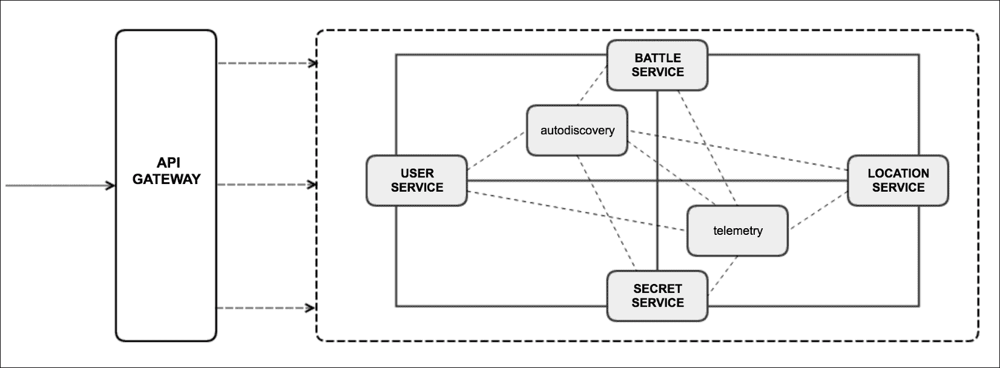
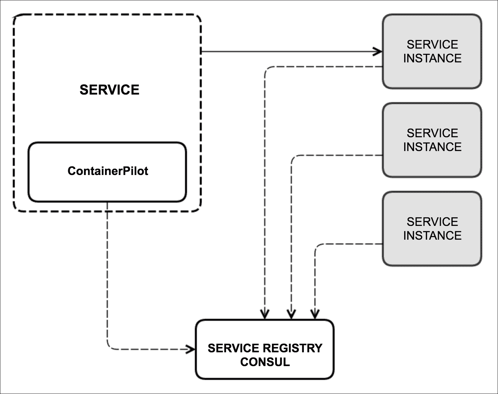
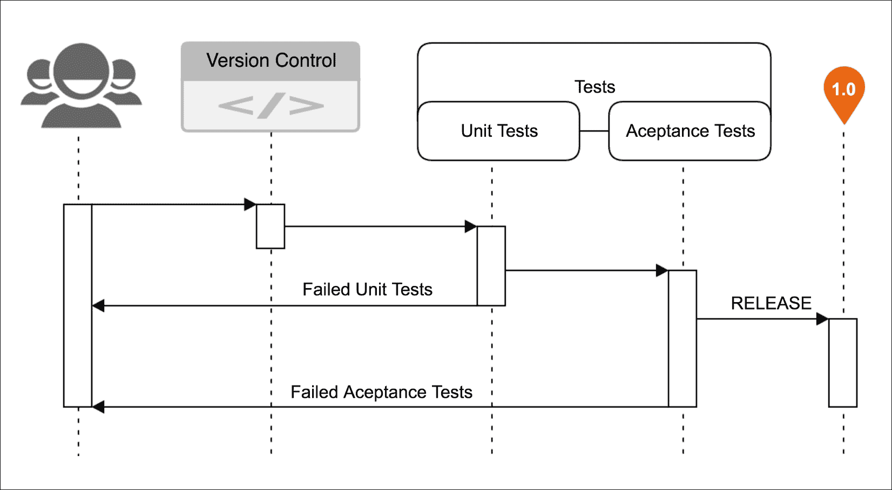

# 第三章：应用程序设计

在前几章中，我们看了一下我们将要构建的应用程序的简要描述。现在是时候让您深入了解整个项目了。

# 微服务结构

我们希望构建一个地理定位应用程序，并选择将其创建为一个游戏，以使其更有趣且更易于理解。请随意将示例调整为任何其他想法，例如嵌入地理定位的旅游应用程序。

我们的游戏将使用地理定位来发现世界各地的不同秘密（或者在特定地理区域内，如果您想要一个较小的地图）。后端系统将生成新的秘密并将它们随机放置在我们的地图上，允许用户探索他们的环境以找到它们。作为我们游戏的玩家，您将收集不同的秘密并将它们存储在您的*钱包*中，这是您将找到有关每个秘密的更多信息的地方。

为了使我们的游戏更有趣，我们将拥有一个战斗引擎。当您发现我们的*秘密世界*时，您可以与其他玩家进行战斗，以窃取他/她的*秘密*。战斗引擎将是一个简单的引擎--只需掷骰子，得分最高者赢得战斗。

这种类型的项目不能没有其他服务完成，例如用户/玩家管理系统等。

作为开发人员，您从规范开始，然后尝试将其分解为更小的部分。根据我们的简要描述，我们可以开始定义我们的微服务及其责任如下：

+   用户服务：这项服务的主要责任是用户注册和管理。为了使示例简单，我们还将添加额外的功能，例如用户通知和秘密钱包管理。

+   战斗服务：这项服务将负责用户的战斗，记录每场战斗并将秘密从失败者的钱包转移到获胜者的钱包。

+   秘密服务：这是我们游戏的核心服务之一，因为它将负责所有秘密事务。

+   位置服务：为了增加额外的复杂性，我们决定创建一个服务来管理与位置相关的任何任务。主要责任是知道所有东西的位置；例如，如果用户服务需要知道该区域是否有其他玩家，向该服务发送带有地理定位的消息，响应将告诉用户服务谁在该区域。

请注意，我们不仅为我们的游戏创建服务，而且我们将使用其他支持服务使一切运行顺利。

以下图表描述了我们不同服务之间的通信路径。每个服务都能够与其他服务交流，这样我们就可以组合更大更复杂的任务。以下图表描述了我们微服务之间的连接：


## 微服务模式

设计模式是在现实世界应用程序开发中解决重复问题的可重用解决方案。这些解决方案已经被证明具有成功的记录，并且被广泛使用，因此将它们添加到我们的项目中将使我们的软件更加稳定和可靠。

我们正在构建一个微服务应用程序，因为我们希望它尽可能稳定和可靠，所以我们将使用一些微服务模式，例如：API 网关、服务发现和注册表，以及共享数据库或每个服务一个数据库。

## API 网关

我们将为用户提供前端注册和与我们的应用程序交互，并且它将是我们微服务的主要客户端。此外，我们计划将来拥有原生移动应用程序。由于不同的客户端使用我们的应用程序可能会给我们带来麻烦，因为他们对我们的微服务的使用可能会有很大不同。

为了统一任何客户端使用我们的微服务的方式，我们将添加一个额外的层--一个 API 网关。这个 API 网关成为任何客户端（例如浏览器和原生应用程序）的单一入口点。在这一层，我们的网关可以以两种方式处理请求：一些请求只是被代理，而其他请求则被分发到多个服务。我们甚至可以将这个 API 网关用作安全层，检查客户端的每个请求是否被允许使用我们的微服务：



资产请求

拥有 API 网关有许多好处，其中我们可以强调以下几点：

+   我们的应用程序将有一个单一的访问点，消除了客户端需要知道每个微服务位置的问题。

+   我们可以更好地控制我们的服务如何被使用，甚至可以为特定客户提供自定义端点。

+   它减少了请求/往返的次数。通过一次往返，客户端可以从多个服务中检索数据。

## 服务发现和注册

我们的服务将需要调用其他服务。在单体应用程序中，解决方案非常简单--我们可以调用方法或使用过程调用。我们正在构建一个运行在容器中的微服务应用程序，所以没有简单的方法可以知道某个服务的位置。我们的容器基础设施非常灵活，我们需要构建一个服务发现系统。

我们的每个服务将通过查询我们的服务注册表（一个使用 Consul 存储有关所有服务信息的地方）来获取所有其他链接服务的位置。我们的注册表将知道每个服务实例的位置。下图显示了自动发现模式：



为了实现这一点，我们将使用不同的工具：

+   **Consul**：这是我们的服务注册表，具有许多功能，如集群支持等。

+   **Fabio**：这是一个基于 Go 构建的反向代理，与 Consul 有深度集成。我们喜欢这个代理的原因是它与 Consul 的轻松连接以及其进行蓝绿部署的能力。另一个你可以尝试的有趣工具是 Træfik。

+   **NGINX**：这是一个强大的 HTTP 服务器和反向代理，对于大多数 Web 开发人员来说，这是一个非常知名的工具，由于其性能和低内存占用而被选择。我们将同时使用 Fabio 和 NGINX 作为反向代理。

+   **ContainerPilot**：这是一个用 Go 编写的小工具。我们将使用这个软件将我们的服务注册到 Consul 中，将我们容器的统计数据发送到一个集中的遥测系统，向 Consul 发送健康检查，并检测其他服务的变化。我们将使用这个工具创建一种自动修复系统。

## 共享数据库或每个服务一个数据库

以某种方式，应用程序会生成我们需要存储的数据。在单体应用程序中，毫无疑问，所有数据都存储在同一个地方。问题在于当你处理微服务应用程序时，没有简单的答案。每个应用程序域都是独特的，所以没有固定的规则来解决问题；你需要分析你的数据，并决定是否要将所有数据存储在共享存储中，每个服务是否有自己的数据存储，或者混合使用。

在我们的示例应用程序中，我们将涵盖这两种方法，但让我们解释每种选项的好处。

### 每个服务一个数据库

在这种方法中，我们将每个微服务的持久数据保持私有，数据只能通过其 API 访问，并具有许多好处：

+   它使服务之间的耦合度降低；你可以对战斗服务进行更改而不影响用户服务，例如。

+   由于数据只能通过其 API 访问，它增加了我们应用程序的灵活性；我们可以使用不同的存储引擎。例如，我们可以在用户服务中使用关系数据库，在位置服务中使用 NoSQL。

当然，这种解决方案也有一些缺点，最显著的问题是共享不同服务之间的数据的困难。

### 共享数据库

这种方法就像在单体应用程序中的数据库一样--所有数据都存储在同一个引擎中。主要好处是将所有内容放在一个地方的简单性。

这种简单性也有一些缺点；我们在其中突出以下几个：

+   任何数据库更改都可能破坏或影响其他服务

+   使用相同的引擎处理所有数据会导致应用程序不够灵活

+   如果数据存储出现问题，所有使用共享数据库的服务都会注意到这个问题。

作为开发人员，您的工作是为您需要解决的每个问题找到最佳解决方案。您需要决定如何存储应用程序数据，始终牢记每个选项的利弊。

# RESTful 惯例

**表述状态转移**是用于与 API 通信的方法的名称。顾名思义，它是*无状态*的；换句话说，服务不会保留传输的数据，因此，如果您调用一个发送数据的微服务（例如，用户名和密码），微服务将不会在下次调用时记住数据。状态由客户端保留，因此客户端需要每次调用微服务时发送状态。

一个很好的例子是当用户登录并且用户能够调用特定方法时，每次都需要发送用户凭据（用户名和密码或令牌）。

Rest API 的概念不再是一个服务；相反，它就像一个资源容器，可以通过标识符（URI）进行通信。

在接下来的几行中，我们将定义一些有关 API 的有趣的惯例。了解这些提示很重要，因为在编写 API 时，您应该像在 API 上工作时一样做事情。换句话说，编写 API 就像为自己写书一样--它将被像您一样的开发人员阅读，因此完美的功能并不是唯一重要的事情，友好的交流方式也很重要。

如果您遵循一些惯例，为您和消费者创建一个 RESTful API 将会更容易让他们满意。我一直在我的 RESTful API 上使用一些建议，结果非常好。它们有助于组织您的应用程序及其未来的维护需求。此外，当 API 消费者享受与您的应用程序一起工作时，他们会感谢您。

## 安全

RESTful API 中的安全性很重要，但如果您的 API 将被您不认识的人使用，换句话说，如果它将对所有人开放，那么它就尤为重要。

+   到处使用 SSL--这对于您的 API 的安全性很重要。有许多没有 SSL 连接的公共场所，可以嗅探数据包并获取其他人的凭据。

+   使用令牌身份验证，但如果要使用令牌对用户进行身份验证，则必须使用 SSL。使用令牌可以避免每次需要识别当前用户时发送完整凭据。如果不可能，您可以使用 OAuth2。

+   提供响应头，以限制和避免同一消费者发送过多请求。大公司的一个问题是流量，甚至有人试图对您的 API 做坏事。有一种方法可以避免这类问题是很好的。

## 标准

PHP 和微服务的更多标准正在逐渐出现。正如我们在上一章中看到的，有一些团体，比如 PHP-FIG，正在努力建立它们。以下是一些使您的 API 更加标准的提示：

+   到处使用 JSON。避免使用 XML；如果有一个 RESTful API 的标准，那就是 JSON。它更紧凑，可以在 Web 语言中轻松加载。

+   使用驼峰命名法而不是蛇形命名法；这样更容易阅读。

+   使用 HTTP 状态码错误。每种情况都有标准状态，因此使用它们可以避免解释 API 的每个响应。

+   在 URL 中包含版本信息，不要将其放在头部。版本信息需要在 URL 中，以确保资源在不同版本之间的浏览器可探索性。

+   提供一种覆盖 HTTP 方法的方式。一些浏览器只允许`POST`和`GET`请求，因此允许使用`X-HTTP-Method-Override`头来覆盖`PUT`、`PATCH`和`DELETE`将是有益的。

## 消费者便利设施

您的 API 的使用者是最重要的，因此您需要提供有用、友好的方法来使开发人员的工作更轻松。开发方法时要考虑到他们：

+   限制响应数据。开发人员不需要所有可用的数据，因此可以使用字段过滤器限制响应。

+   使用查询参数来过滤和排序结果。这将有助于简化您的 API。

+   记住您的 API 将被不同的开发人员使用，因此要注意您的文档——它需要非常清晰和友好。

+   在`POST`、`PATCH`和`PUT`请求上返回有用的内容。避免开发人员多次调用 API 以获取所需的数据。

+   提供一种在响应中自动加载相关资源表示的方式。这对开发人员来说将是有帮助的，以避免多次请求相同的内容以获取所有必要的数据。可以通过在 URL 中包含过滤器来定义特定参数来实现这一点。

+   使用链接头来进行分页，这样开发人员就不需要自己创建链接。

+   包括促进缓存的响应头。HTTP 已经包含了一个框架，只需添加一些头部即可实现这一点。

还有很多提示，但这些足以作为 RESTful 约定的第一步。在接下来的章节中，我们将看到这些 RESTful 约定的示例，并解释如何更好地使用它们。

# 缓存策略

> Phil Karlton
> 
> “在计算机科学中只有两件难事：缓存失效和命名事物。”

缓存是一个组件，用于临时存储数据，以便将来对该数据的请求可以更快地提供。这种临时存储用于缩短我们的数据访问时间，减少延迟，并改善 I/O。我们可以在微服务架构中使用不同类型的缓存来提高整体性能。让我们来看看这个主题。

## 一般的缓存策略

为了维护缓存，我们有算法提供指示，告诉我们应该如何维护缓存。最常见的算法如下：

+   **最不经常使用（LFU）**：此策略使用计数器来跟踪条目的访问频率，并首先删除计数最低的元素。

+   **最近最少使用（LRU）**：在这种情况下，最近使用的项目总是靠近缓存的顶部，当我们需要一些空间时，将删除最近未被访问的元素。

+   **最近最常使用（MRU）**：首先删除最近使用的项目。我们将在较老的项目更常被访问的情况下使用这种方法。

在设计应用程序所需的每个微服务时，开始考虑缓存策略的最佳时机。每当您的服务返回数据时，您需要问自己一些问题：

+   我们是否返回了无法在任何地方存储的合理数据？

+   如果输入相同，我们是否返回相同的结果？

+   我们可以存储这些数据多久？

+   我们想要如何使缓存失效？

您可以在应用程序中的任何位置添加缓存层。例如，如果您正在使用 Percona/MySQL/MariaDB 作为数据存储，可以正确启用和设置查询缓存。这个小设置将提升您的数据库性能。

即使在编码时，你也需要考虑缓存。你可以对对象和数据进行延迟加载，或者构建一个自定义的缓存层来提高整体性能。想象一下，你正在从外部存储请求和处理数据，请求的数据可能在同一次执行中重复多次。做类似下面的代码片段将减少对外部存储的调用：

```php
    <?php 
    class MyClass 
    { 
       protected $myCache = []; 

       public function getMyDataById($id) 
       { 
           if (empty($this->myCache[$id])) { 
               $externalData = $this->getExternalData($id); 
               if ($externalData !== false) { 
                   $this->myCache[$id] = $externalData; 
               } 
           } 

                return $this->myCache[$id]; 
       } 
    } 

```

请注意，我们的示例省略了大量的代码，比如命名空间或其他函数。我们只想给你一个整体的想法，这样你就可以创建自己的代码。

在这种情况下，我们将我们的数据存储在`$myCache`变量中，每当我们使用 ID 作为键标识符向外部存储发出请求时。下一次我们请求与之前相同 ID 的元素时，我们将从`$myCache`中获取元素，而不是从外部存储请求数据。请注意，只有在同一次 PHP 执行中可以重用数据时，这种策略才会成功。

在 PHP 中，你可以访问最流行的缓存服务器，比如**memcached**和**Redis**；它们都以键值格式存储数据。访问这些强大的工具将允许我们提高微服务应用程序的性能。

让我们使用`Redis`作为我们的缓存存储来重建我们之前的示例。在下面的代码片段中，我们将假设你的环境中有一个`Redis`库可用（例如 phpredis），并且有一个`Redis`服务器在运行：

```php
    <?php 
    class MyClass 
    { 
      protected $myCache = null; 

      public function __construct() 
      { 
        $this->myCache  = new Redis(); 
        $this->myCache->connect('127.0.0.1',  6379); 
      } 

      public function getMyDataById($id) 
      { 
        $externalData = $this->myCache->get($id); 
          if ($externalData === false) { 
            $externalData = $this->getExternalData($id); 
            if ($externalData !== false) { 
              $this->myCache->set($id, $externalData); 
            } 
          } 

          return $externalData; 
      } 
    }

```

在这里，我们首先连接到 Redis 服务器，并调整`getMyDataById`函数以使用我们的新 Redis 实例。这个例子可能会更复杂，例如通过添加依赖注入和在缓存中存储 JSON 等无限的选项。使用缓存引擎而不是构建自己的一个好处是，它们都带有许多很酷和有用的功能。想象一下，你想将数据保留在缓存中只有 10 秒；这在 Redis 中非常容易实现--只需用`$this->myCache->set($id, $externalData, 10)`替换 set 调用，十秒后你的记录将从缓存中删除。

比将数据添加到缓存引擎更重要的是使你存储的数据失效或删除。在某些情况下，使用旧数据是可以接受的，但在其他情况下，使用旧数据可能会导致问题。如果你没有添加 TTL 来使数据自动过期，请确保你有一种在需要时删除或使数据失效的方法。

记住这个例子和前面的例子，我们将在我们的微服务应用程序中使用这两种策略。

作为开发人员，你不需要被绑定到特定的缓存引擎；封装它，创建一个抽象，并使用该抽象，这样你就可以在任何时候更改底层引擎而不必更改所有的代码。

这种通用的缓存策略可以在应用程序的任何范围内使用--你可以在你的微服务代码中使用它，甚至在微服务之间使用。在我们的应用程序示例中，我们将处理*秘密*；它们的数据变化不是很频繁，所以我们可以在第一次访问时将所有这些信息存储在我们的缓存层（Redis）中。

将来的请求将从我们的缓存层获取秘密数据，而不是从我们的数据存储中获取，从而提高我们应用的性能。请注意，检索和存储*秘密*数据的服务是负责管理这个缓存的服务。

让我们看看我们将在微服务应用程序中使用的其他缓存策略。

## HTTP 缓存

这种策略使用一些 HTTP 头来确定浏览器是否可以使用响应的本地副本，或者需要从源服务器请求新的副本。这种缓存策略是在应用程序之外管理的，所以你对它没有太多控制。

我们可以使用的一些 HTTP 头如下：

+   **Expires**：设置内容将过期的未来时间。当未来的这一点到达时，任何类似的请求都必须返回到原始服务器。

+   **Last-modified**：指定响应最后修改的时间；它可以作为您的自定义验证策略的一部分，以确保用户始终拥有新鲜内容。

+   **Etag**：此标头标记是 HTTP 提供的用于 Web 缓存验证的几种机制之一，它允许客户端进行条件请求。Etag 是服务器分配给资源特定版本的标识符。如果资源发生更改，Etag 也会更改，从而使我们能够快速比较两个资源表示以确定它们是否相同。

+   **Pragma**：这是一个旧的标头，来自 HTTP/1.0 实现。HTTP/1.1 Cache-control 实现了相同的概念。

+   **Cache-control**：此标头是 expires 标头的替代品；它得到了很好的支持，并允许我们实现更灵活的缓存策略。此标头的不同值可以组合以实现不同的缓存行为。

以下是可用的选项：

+   **no-cache**：表示必须在每个请求之前重新验证任何缓存的内容，然后才能发送给客户端。

+   **no-store**：表示内容无法以任何方式缓存。当响应包含敏感数据时，此选项很有用。

+   **public**：将内容标记为公共，可以由浏览器和任何中间缓存进行缓存。

+   **private**：将内容标记为私有；此内容可以由用户的浏览器存储，但不能由中间方存储。

+   **max-age**：设置内容在必须重新验证之前可以缓存的最长时间。此选项值以秒为单位，最长为 1 年（31,536,000 秒）。

+   **s-maxage**：这与 max-age 标头类似；唯一的区别是此选项仅应用于中间缓存。

+   **must-revalidate**：此标记表示必须严格遵守 max-age、s-maxage 或 expires 标头指示的规则。

+   **proxy-revalidate**：这与 s-maxage 类似，但仅适用于中间代理。

+   **no-transform**：此标头告诉缓存它们不得在任何情况下修改接收到的内容。

在我们的示例应用程序中，我们将拥有一个可以通过任何 Web 浏览器访问的公共 UI。使用正确的 HTTP 标头，我们可以避免对相同资产的重复请求。例如，我们的 CSS 和 JavaScript 文件不会经常更改，因此我们可以设置一个未来的到期日期，浏览器将保留它们的副本；未来的请求将使用本地副本而不是请求新副本。

您可以使用简单的规则在 NGINX 中为所有`.jpg`、`.jpeg`、`.png`、`.gif`、`.ico`、`.css`和`.js`文件添加一个到浏览器访问时间未来 123 天的到期标头：

```php
    location ~*  .(jpg|jpeg|png|gif|ico|css|js)$ { 
        expires 123d; 
    } 

```

## 静态文件缓存

一些静态元素非常适合缓存，其中包括以下内容：

+   标志和非自动生成的图像

+   样式表

+   JavaScript 文件

+   可下载内容

+   任何媒体文件

这些元素往往很少更改，因此可以缓存更长时间。为了减轻服务器的负载，您可以使用**内容交付网络**（**CDN**），以便这些很少更改的文件可以由这些外部服务器提供。

基本上，CDN 有两种类型：

+   **Push CDNs**：这种类型要求您**推送**要存储的文件。您有责任确保将正确的文件上传到 CDN，并且推送的资源可用。它主要用于上传的图像，例如用户的头像。请注意，一些 CDN 在推送后可以返回 OK 响应，但您的文件实际上还没有准备好。

+   **拉 CDN**：这是懒惰的版本，您不需要将任何内容发送到 CDN。当请求通过 CDN 并且文件不在它们的存储中时，它们会从您的服务器获取资源并将其存储以供将来使用。它主要用于 CSS、图像和 JavaScript 资源。

在设计微服务应用程序时，您需要记住这一点，因为您可能允许用户上传一些文件。

您将在哪里存储这些文件？如果它们是公开的，为什么不使用 CDN 来传送这些文件，而不是从您的服务器中删除它们。

一些著名的 CDN 包括 CloudFlare、Amazon CloudFront 和 Fastly 等。它们的共同之处在于它们在世界各地都有多个数据中心，使它们可以尝试从最近的服务器为您提供文件的副本。

通过将 HTTP 与静态文件缓存策略结合起来，您将最大限度地减少服务器上的资源请求。我们不会解释其他缓存策略，比如完整页面缓存；根据我们所涵盖的内容，您已经有足够的知识来开始构建成功的微服务应用程序。

# 领域驱动设计

**领域驱动设计**（从这里开始称为 DDD）是一种在有复杂需求时进行开发的方法。这个概念并不新鲜；它是由 Eric Evans 在他 2004 年的同名书中创建的，但现在它是主流的，因为微服务在开发人员中很受欢迎，并且在大型项目中非常常见。

这是发生的，因为微服务概念（关于软件架构，将每个功能划分为服务）和 DDD 概念（关于有界上下文）之间有很好的兼容性。

在了解我们如何在微服务项目中使用 DDD 之前，有必要了解 DDD 是什么以及它是如何工作的，所以让我向您介绍这种方法的主要概念作为总结。

## 领域驱动设计的工作原理

Evans 引入了一些必要的概念，以了解领域驱动设计的工作原理：

+   **上下文**：这是一个词或语句出现的环境，决定了它的含义。

+   **领域**：这是知识（本体论）、影响或活动的领域。用户应用程序的主题领域是软件的领域。

+   **模型**：这是描述领域的选定方面的抽象系统，可以用来解决与该领域相关的问题。

+   **普遍语言**：这是围绕领域模型构建的语言，由所有团队成员使用，将团队的所有活动与软件连接起来。

**软件领域**与技术术语、编程或计算机无关。在大多数项目中，最具挑战性的部分是理解业务领域，因此 DDD 建议使用**模型领域**；这是在图表、代码或文字中复制的抽象、有序和选择性知识。

模型领域就像建立具有复杂功能的项目的路线图，需要遵循五个步骤才能实现。这五个步骤需要开发团队和领域专家达成一致。

1.  **头脑风暴和完善**：开发团队和领域专家之间应该有一个沟通渠道。因此，项目中的所有人都应该能够与每个人交谈，因为他们都需要知道项目应该如何工作。

1.  **草稿领域模型**：在对话过程中，有必要开始绘制领域模型的草稿，以便领域专家可以检查和纠正，直到他们达成一致。

1.  **早期类图**：使用草稿，我们可以开始构建类图的早期版本。

1.  **简单原型**：使用早期类图和领域模型的草稿，可以构建一个非常简单的原型。Evans 建议避免与领域无关的事物，以确保领域业务得到适当建模。它可以是一个非常简单的程序作为追踪。

1.  **原型反馈**：领域专家与原型进行交互，以检查是否满足所有需求，然后整个团队将改进领域模型和原型。

这个过程将进行所有必要的迭代，直到领域模型正确为止：


模型、代码和设计必须一起发展和成长。它们不能不同步。如果模型上的概念更新了，代码和设计也应该自动更新，其他方面也是如此。

模型是描述领域的选择性概念的抽象系统，它可以用来解决与该领域相关的问题。如果模型中的某个部分在代码中没有反映出来，那么它应该被移除。

最后，领域模型是项目中通用语言的基础。DDD 中的这种通用语言称为**普遍语言**，它应该具有以下特点：

+   与领域相关的类名和它们的功能

+   讨论模型中包含的领域规则的术语

+   应用于领域模型的分析和设计模式的名称

项目所有成员，包括开发人员和领域专家，都应该使用普遍语言，因此开发人员应该能够描述所有的任务和功能。

在团队之间的所有讨论中绝对必须使用这种语言，比如会议、图表或文档，但这种语言并不是在过程的第一次迭代中诞生的，这意味着它可能需要多次重构，使模型、语言和代码保持同步。例如，如果开发人员发现领域中的一个类应该被重命名，他们不能在没有重构领域模型和普遍语言的情况下进行重构。

普遍语言、领域模型和代码应该作为一个单一的知识块一起发展。

关于 DDD 存在争议的概念。Eric Evans 说，领域专家必须使用与团队相同的语言，但有些人不喜欢这个想法。通常，领域专家不了解面向对象的概念或微服务，因为这些对非开发人员来说太抽象了。无论如何，DDD 认为，如果领域专家不理解领域模型，那是因为它存在问题。

领域模型中有图表，但 Evans 建议也使用文本，因为图表无法正确解释概念。此外，图表应该是表面的；如果你想看更多细节，可以查看代码。

一些项目受到领域模型和代码之间的连接的影响。这是因为分析和设计之间存在分歧。分析人员制定了一个独立于设计的模型，开发人员无法开发功能，因为缺少一些信息。此外，他们无法与领域专家交流。开发团队将不遵循模型，最终领域模型将不会得到更新，也不会起作用。因此，项目将无法满足要求。

总之，DDD 旨在将软件开发作为模型、设计和代码的迭代精炼过程，作为一个单一的任务块。

## 在微服务中使用领域驱动设计

正如我们之前所说，DDD 完全满足微服务的需求。微服务的一个常见问题是它们具有分散的数据管理；这有优势，但有时也会带来问题。

两个服务之间的概念模型将是不同的，这可能会在大型公司中造成问题。例如，用户可能会因服务而异，每个服务关于用户的属性可能会不同，而且属性语义也可能会不同。

当在一个大公司中，应用程序经历了很多年的更新，变得更加复杂时，情况变得更加复杂。每个服务可能对用户有不同的属性，通常它们不匹配。因此，使用 DDD 是解决这个问题的一个很好的方法。

与微服务一样，DDD 将复杂的领域划分为不同的上下文，建立它们之间的关系，并要求所有成员合作，以在特定领域和有界上下文中获得一种通用语言，通过迭代这个过程直到实现对问题的真正概念。

Evans 建议将每个微服务设计为 DDD 有界上下文，以便为系统内的微服务提供逻辑边界。每个微服务（或团队）将负责系统的一部分，并提供更清晰和可维护的代码。

Michael Plöd 提出了有关 DDD 如何帮助微服务的更多想法。在构建微服务方面有四个重要领域：

+   **战略设计**：这基本上是有界上下文，但上下文映射和其他模式也很重要。上下文映射应显示项目的所有有界上下文及其彼此之间的关系；它还描述它们之间的契约。上下文映射对于希望转向微服务的单片应用程序非常有用。

+   **内部构建块**：这指的是在设计有界上下文内部时使用战术模式，如聚合、实体或存储库。

+   **大规模结构**：用于使用不断发展的顺序和责任层创建结构。这也是微服务中的一个概念。在大型项目中，将大规模结构创建到边界上下文中是有帮助的。它们应该被设计为独立演变。

+   **蒸馏**：从已经成长的系统中提炼核心领域，在将单片应用程序迁移到微服务时非常有用。最重要的部分应该是识别和提取核心领域，以及识别子域、从核心中提取它并进行重构的迭代过程。

总之，微服务和 DDD 完全匹配，但需要有更大的范围并且了解超出边界上下文的内容。

# 事件驱动架构

**事件驱动架构**（**EDA**）是一种遵循生产、检测、消费和对事件做出反应的应用程序架构模式。

可以将事件描述为状态的改变。例如，如果门关闭了，有人打开了它，门的状态就从关闭变为打开。打开门的服务必须将此更改作为事件进行，其他服务可以知道这个事件。

事件通知是异步产生、发布、检测或消费的消息，它是由事件改变的状态。重要的是要理解事件并不在应用程序中传播，它只是发生。术语“事件”有点争议，因为它通常指的是消息事件通知，而不是事件，因此了解事件和事件通知之间的区别很重要。

这种模式通常用于基于组件或微服务的应用程序，因为它们可以应用于应用程序的设计和实现。由事件驱动的应用程序具有事件创建者和事件消费者或接收器（它们必须在事件可用时立即执行操作）。

**事件创建者**是事件的生产者；它只知道事件已发生，没有其他信息。然后我们有事件消费者，它们负责知道事件已被触发。消费者参与处理或更改事件。

**事件消费者**订阅了某种中间件事件管理器，一旦它收到来自创建者事件的通知，就会将事件转发给已注册的消费者来接收。

将应用程序开发为围绕诸如 EDA 之类的架构的微服务允许这些应用程序以一种更具响应性的方式构建，因为 EDA 应用程序是按设计准备好在不可预测和异步环境中运行的。

使用 EDA 的优势如下：

+   **解耦系统**：创建者服务不需要知道其他服务，其他服务也不知道创建者。因此，它允许解耦系统。

+   **交互发布/订阅**：EDA 允许多对多的交互，其中服务发布有关某个事件的信息，服务可以获取该信息并对事件进行必要的处理。因此，它使许多创建者事件和消费者事件能够实时交换状态并响应信息。

+   **异步**：EDA 允许服务之间的异步交互，因此它们不需要等待即时响应，而且在等待响应时不需要连接工作。

## 微服务中的事件驱动架构

在大型项目中，通常使用微服务将其服务划分为较小的服务。因此，它非常重要在它们之间有良好和有组织的通信。事件驱动架构可用于解决微服务之间通信的常见问题。

在基于微服务的项目中，通常每个微服务都使用 HTTP 请求相互通信。这会带来一些问题，我们现在来解释。

在我们的“寻找秘密”项目中，有一个函数用于为用户创建事件。创建新事件时，需要将事件名称和事件表单中附加的图像发送到一个服务，以从接收到的数据创建视频。生成视频后，事件将被更新并通过电子邮件发送给用户。

如果我们为每个服务进行 HTTP 请求，问题在于所有服务都需要了解其他服务。例如，生成视频的服务需要知道如何在生成视频后更新事件；换句话说，服务必须包含代码来执行此更新。

此外，一旦我们添加了许多服务，这将变得越来越困难，因为它将需要更多的通信。它将有更多的故障，并且主要问题是，如果一个微服务宕机，视频将无法生成。因此，在像这样的项目中，使用 HTTP 请求不会很好地扩展，我们应该使用不同的策略来进行微服务通信。

如果我们以不同的方式做事会怎样？换句话说，生成视频的服务不会直接更新事件，事件也不会要求视频服务生成视频。那么，我们如何使微服务进行通信？答案是使用事件驱动架构。

为此，我们需要以下内容：

+   每个微服务的事件队列

+   所有微服务都必须将事件发送到集中式总线（我们可以使用 AWS 来做这个）

+   每个微服务队列都必须订阅集中式总线

+   每个微服务都有一个后台工作程序监听事件队列，并在接收到事件时执行必要的操作

在下图中，您可以看到涉及的不同服务和流程流程，用箭头表示。下图显示了事件驱动的工作流程：

微服务中的事件驱动架构

当我们在**事件服务 API**（**1**）上创建一个新事件时，事件会进入集中式总线（**2**），相应的工作者会从集中式总线（**3**）获取事件；其他工作者会忽略这个事件。事件被放置在视频生成服务的队列中，并等待服务执行（**4**）。

一旦视频由服务工作者生成，服务就会向集中式总线（5）发出新的事件。然而，这次会由另一个工作者（6）接管，其他工作者会像之前一样忽略这个事件。更新事件的工作者和发送电子邮件的工作者会将事件放入他们的队列中，并且会执行（**7**）对每个服务执行相应的操作，如果有必要的话，他们会向集中式总线发送新的事件。

这是一个事件循环，它改进了服务之间的通信的 HTTP 请求方法。使用事件驱动架构的优势如上所述：

+   如果服务出现任何错误或异常，事件不会丢失，它会留在队列中，并且稍后会被执行。例如，如果发送电子邮件的服务出现问题，发送电子邮件的事件将被保留在队列中，等待服务再次启动。

+   服务不需要知道如何更新其他服务。这意味着服务的逻辑可以在每个服务中被隔离。

+   可以添加更多的微服务而不会产生影响。

+   它将更好地扩展。

# 持续集成、持续交付和工具

没有代码提交策略或测试/部署工作流程，软件项目是无法成功的。当你在团队中工作时，拥有一个策略更加重要。没有什么比在一个混乱的项目上工作更令人恼火，没有规则或没有人对他们所做的工作负责。在本节中，我们将解释最常见和成功的开发实践。

## 持续集成 - CI

持续集成是一个软件开发实践，团队成员频繁地集成他们的工作。每当新代码被推送到共享存储库时，将触发自动构建，以尽快检测任何集成错误。主要目标是避免长时间和不可预测的集成。

### 什么是持续集成？

让我们用一个简短的例子更好地解释持续集成的过程是什么样的。想象一下，你的游戏示例已经准备就绪，在生产中运行良好，你有一个新的想法，一个小功能，你的应用程序的用户会喜欢。这个新功能可以在几个小时内完成。

首先，在开发机器上获取当前源代码的副本；你将使用源代码控制系统，所以你只需要从主线检出一个工作副本。

现在你已经有了源代码的工作副本，你可以做任何你需要完成的功能，添加新代码，创建新测试等等。持续集成实践假设你的大部分代码将被自动化测试覆盖。对于 PHP 来说，一个流行的单元测试套件是 PHPUnit，这是一个简单而强大的工具，我们将在后面的章节中介绍。对我们的代码进行测试将有助于我们在未来的步骤中，并确保我们的代码质量高。

现在你已经完成了新功能，是时候在你的开发环境上启动一个自动构建了。这个过程将获取源代码，检查错误，并运行自动化测试。只有当构建和所有测试都通过没有错误时，我们才能认为构建是好的，并且可以将其添加到我们的存储库中。

这个过程的结果是，我们有一个稳定的软件，它能正常工作并且包含非常少的 bug。

### 持续集成的好处

持续集成的主要目标是降低风险，但这并不是采用这种开发实践的唯一好处。其中，我们可以强调以下好处：

+   减少集成时间

+   由于我们正在推送小的更改并且每个更改都经过了一次又一次的测试，因此可以早期发现错误

+   稳定构建的持续可用性，我们可以使用它进行新的测试，用作我们的客户演示，甚至再次部署

+   项目质量指标的持续监控

### 持续集成的工具

作为开发人员，您可能会担心如何自动化这个过程。不用担心，在市场上有多种方式可以创建和管理您的 CI 流水线。我们的最佳建议是，在决定在项目中使用哪种 CI 软件之前，花一些时间测试所有的选择。一些与 PHP 轻松集成的 CI 软件包括：

+   **Jenkins**：这是一个非常容易安装和管理的开源项目。它的多功能性使得这个软件可能是最广泛使用的 CI 软件之一。

+   **Bamboo**：这是一个基于订阅的软件。Atlassian 在开发世界以其生产力和开发支持工具而闻名。如果您需要与其他 Atlassian 工具深度集成，这是一个不错的选择。

+   **Travis**：这是另一个基于订阅的软件，针对开源项目有免费计划。

+   **PHP CI**：这个新的开源工具是基于 PHP 构建的，可以安装在您的服务器上，也可以作为基于云的工具使用。

在我们的示例项目中，我们将使用 Jenkins 并启动一个 Docker 容器。与此同时，您可以使用以下简单命令开始测试 Jenkins：

```php
**$ docker run -p 8080:8080 -p 50000:50000 jenkins** 

```

这个命令将创建一个包含 Jenkins 官方 Docker 镜像的容器，并将本地环境的 8080 和 50000 端口映射到容器中。如果您在浏览器中打开`http://localhost:8080`，您将可以访问 Jenkins UI。

## 持续交付

持续交付是持续集成的延续，其主要目标是能够在任何时候部署软件的任何版本，而不会出现故障。我们可以通过确保我们的代码始终可供部署，并遵循持续集成的实践，来实现这一点，从而确保我们的源代码的质量和集成水平。

通过持续交付，每当我们对代码进行更改时，这些更改都会被构建、测试，然后发布到一个阶段环境。下图显示了 CD 流水线上的基本工作流程。正如您所看到的，如果任何测试步骤失败，我们需要重新开始，直到我们的代码通过测试。通过这种方式工作，我们可以始终确保我们的项目符合最高的质量标准。

以下是持续交付工作流程的图表：



### 持续交付的好处

持续交付有许多好处；其中，我们强调以下几点：

+   **减少部署风险**：我们将部署更小的更改，因此出错的可能性更小，而且更容易修复任何问题。即使我们应用了部署模式，比如蓝绿部署，我们的部署对我们的用户来说是不可察觉的。

+   **进度跟踪**：由于并非所有开发人员和经理以相同的方式跟踪工作进展，我们现在非常快速地部署小版本；当任务完成时毫无疑问——如果它在生产环境中，那么任务就完成了。

+   **更高的质量**：通过持续交付，我们以小批量工作；这使我们能够在交付生命周期中从用户那里获得反馈。我们甚至可以使用 A/B 测试来在构建完整功能之前测试想法。在我们的流水线中使用自动化测试工具使开发人员能够快速发现回归并避免发布不稳定的软件。

+   **更快的上市时间**：传统软件生命周期的集成和测试阶段可能需要几周的时间，但如果我们设法自动化构建和部署、环境配置和测试流程，我们可以将时间缩短到最低并将其纳入开发人员的日常工作中。

+   降低成本：如果我们投资于构建、测试、部署和环境自动化，就可以通过消除许多固定的相关成本来降低软件成本。

### 持续交付流水线的工具

如前所述，持续交付是持续集成的延续，因此我们可以使用我们之前提到的大多数 CI 工具，并用我们最喜欢的测试框架扩展我们的流水线。在 PHP 中，有许多可用的测试框架，但最知名的有以下几种：

+   phpUnit：这是最知名的用于创建单元测试的框架。每个 PHP 开发人员都需要了解这个框架，因为它将成为他们测试的基础。这是行业标准。

+   Codeception：这是为 PHP 提供的最完整的测试套件之一。使用 Codeception，你可以构建单元测试、功能测试和验收测试。

+   Behat：这是最流行的面向行为的 PHP 测试框架。你不需要编写代码，而是编写故事，框架会转换并测试它们。

+   PHPSec：这是另一个遵循面向行为测试的重要框架。

+   Selenium：这是最复杂的测试框架之一，用于自动化浏览器。有了这个框架，就可以编写用户验收测试。

在接下来的章节中，我们将使用其中一些测试框架。与此同时，尝试每一个并选择你最喜欢的框架。记住，你可以毫无问题地混合它们。

# 总结

在本章中，我们讨论了设计和开发应用程序的不同方式。我们涵盖了一些模式和策略，你可以轻松地整合到你的开发工作流程中，甚至谈到了最常见的开发实践。在接下来的章节中，我们将在我们的开发工作流程中应用所有这些概念。
