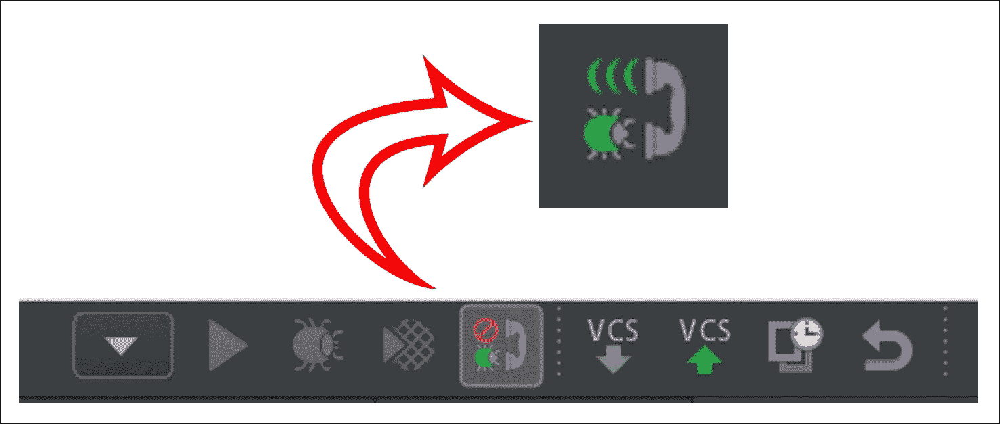
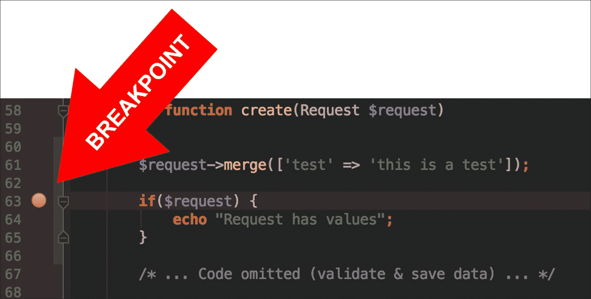
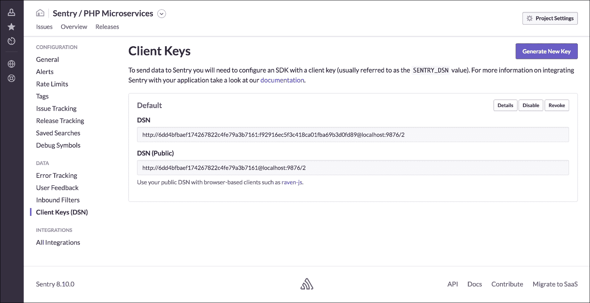
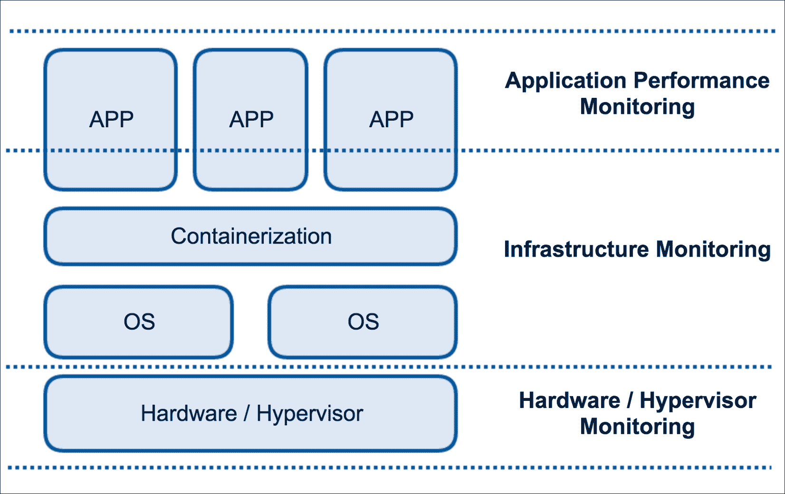
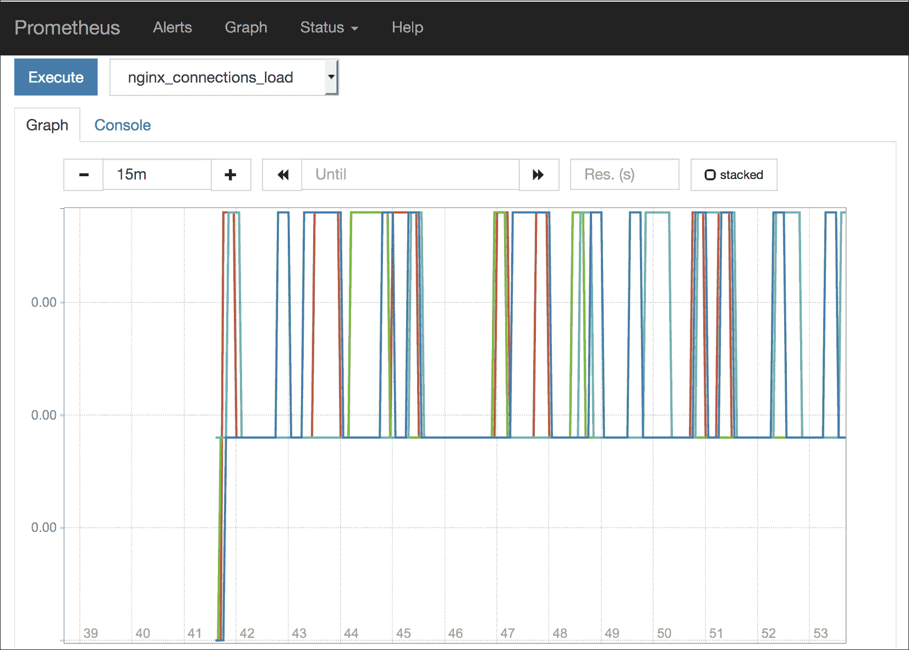
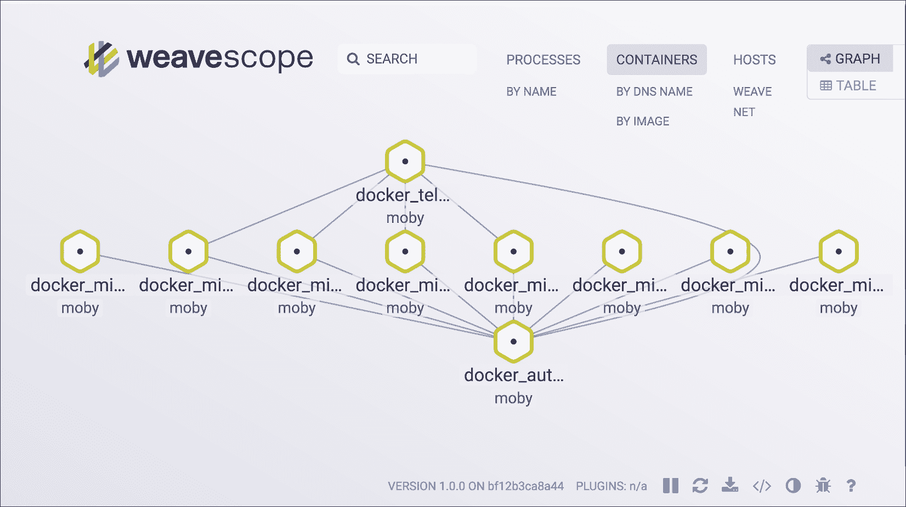

# 第六章 监控

在上一章中，我们花了一些时间开发我们的示例应用程序。现在是时候开始更高级的主题了。在本章中，我们将向您展示如何监视您的微服务应用程序。跟踪应用程序中发生的一切将帮助您随时了解整体性能，甚至可以找到问题和瓶颈。

# 调试和性能分析

在开发复杂和大型应用程序时，调试和性能分析是非常必要的，因此让我们解释一下它们是什么，以及我们如何利用这些工具。

## 什么是调试？

调试是识别和修复编程错误的过程。这主要是一个手动任务，开发人员需要运用他们的想象力、直觉，并且需要有很多耐心。

大多数情况下，需要在代码中包含新的指令，以在执行的具体点或代码中读取变量的值，或者停止执行以了解它是否通过函数。

然而，这个过程可以由调试器来管理。这是一个工具或应用程序，允许我们控制应用程序的执行，以便跟踪每个执行的指令并找到错误，避免必须在我们的代码中添加代码指令。

调试器使用一个称为断点的指令。**断点**就像它的名字所暗示的那样，是应用程序停止的一个点，以便由开发人员决定要做什么。在那一点上，调试器会提供有关应用程序当前状态的不同信息。

我们稍后将更多地了解调试器和断点。

## 什么是性能分析？

像调试一样，性能分析是一个过程，用于确定我们的应用在性能方面是否正常工作。性能分析调查应用程序的行为，以了解执行不同代码部分所需的专用时间，以找到瓶颈或在速度或消耗资源方面进行优化。

性能分析通常在开发过程中作为调试的一部分使用，并且需要由专家在适当的环境中进行测量，以获得真实的数据。

有四种不同类型的性能分析器：基于事件的、统计的、支持代码的工具和模拟的。

## 使用 Xdebug 在 PHP 中进行调试和性能分析

现在我们将在我们的项目中安装和设置 Xdebug。这必须安装在我们的 IDE 上，因此取决于您使用的是哪个，此过程将有所不同，但要遵循的步骤相当相似。在我们的情况下，我们将在 PHPStorm 上安装它。即使您使用不同的 IDE，在安装 Xdebug 之后，在任何 IDE 中调试代码的工作流程基本上是相同的。

### 调试安装

在我们的 Docker 上安装 Xdebug，我们应该修改适当的`Dockerfile`文件。我们将在用户微服务上安装它，所以打开`docker/microservices/user/php-fpm/Dockerfile`文件，并添加以下突出显示的行：

```php
**FROM php:7-fpm**
**RUN apt-get update && apt-get -y install** 
**git g++ libcurl4-gnutls-dev libicu-dev libmcrypt-dev libpq-dev libxml2-dev unzip zlib1g-dev** 
**&& git clone -b php7 https://github.com/phpredis/phpredis.git /usr/src/php/ext/redis** 
**&& docker-php-ext-install curl intl json mbstring mcrypt pdo pdo_mysql redis xml** 
**&& apt-get autoremove && apt-get autoclean** 
**&& rm -rf /var/lib/apt/lists/***
**RUN apt-get update && apt-get upgrade -y && apt-get autoremove -y** 
**&& apt-get install -y git libmcrypt-dev libpng12-dev libjpeg-dev libpq-dev mysql-client curl** 
**&& rm -rf /var/lib/apt/lists/*** 
**&& docker-php-ext-configure gd --with-png-dir=/usr --with-jpeg-dir=/usr** 
**&& docker-php-ext-install mcrypt gd mbstring pdo pdo_mysql zip** 
**&& pecl install xdebug** 
**&& rm -rf /tmp/pear** 
**&& echo "zend_extension=$(find /usr/local/lib/php/extensions/ -name xdebug.so)n" >> /usr/local/etc/php/conf.d/xdebug.ini** 
**&& echo "xdebug.remote_enable=on" >> /usr/local/etc/php/conf.d/xdebug.ini** 
**&& echo "xdebug.remote_autostart=off" >> /usr/local/etc/php/conf.d/xdebug.ini** 
**&& echo "xdebug.remote_port=9000" >> /usr/local/etc/php/conf.d/xdebug.ini** 
**&& curl -sS https://getcomposer.org/installer | php -- --install-dir=/usr/local/bin --filename=composer**
**RUN echo 'date.timezone="Europe/Madrid"' >> /usr/local/etc/php/conf.d/date.ini
RUN echo 'session.save_path = "/tmp"' >> /usr/local/etc/php/conf.d/session.ini

{{ Omited code }}

RUN curl -sSL https://phar.phpunit.de/phpunit.phar -o /usr/bin/phpunit && chmod +x /usr/bin/phpunit

ADD ./config/php.ini /usr/local/etc/php/
CMD [ "/usr/local/bin/containerpilot", 
"php-fpm", 
"--nodaemonize"]**

```

第一个突出显示的块是`安装 xdebug`所必需的。`&& pecl install xdebug`行用于使用 PECL 安装 Xdebug，其余行设置了`xdebug.ini`文件上的参数。第二个是将`php.ini`文件从我们的本地机器复制到 Docker。

还需要在`php.ini`文件上设置一些值，因此打开它，它位于`docker/microservices/user/php-fpm/config/php.ini`，并添加以下行：

```php
    memory_limit = 128M
    post_max_size = 100M
    upload_max_filesize = 200M

    [Xdebug]
    xdebug.remote_host=**YOUR_LOCAL_IP_ADDRESS**

```

您应该输入您的本地 IP 地址，而不是`YOUR_LOCAL_IP_ADDRESS`，以便在 Docker 中可见，因此 Xdebug 将能够读取我们的代码。

### 提示

您的本地 IP 地址是您网络内部的 IP，而不是公共 IP。

现在，您可以通过执行以下命令进行构建，以安装调试所需的一切：

```php
**docker-compose build microservice_user_fpm**

```

这可能需要几分钟。一旦完成，Xdebug 将被安装。

### 调试设置

现在是时候在我们喜爱的 IDE 上设置 Xdebug 了。正如我们之前所说，我们将使用 PHPStorm，但是请随意使用任何其他 IDE。

我们必须在 IDE 上创建一个服务器，在 PHPStorm 中，可以通过导航到**首选项** | **语言和框架** | **PHP**来完成。因此，添加一个新的，并将`name`设置为`users`，例如，`host`设置为`localhost`，`port`设置为`8084`，`debugger`设置为`xdebug`。还需要启用**使用路径映射**以便映射我们的路由。

现在，我们需要导航到**工具** | **DBGp 代理配置**，确保 IDE 密钥字段设置为`PHPSTORM`，`Host`设置为`users`（这个名称必须与你在服务器部分输入的名称相同），`Port`设置为`9000`。

通过执行以下命令停止和启动 Docker：

```php
**docker-compose stop**
**docker-compose up -d**

```

设置 PHPStorm 能够像调试器一样监听：



PHPStorm 中监听连接的 Xdebug 按钮

### 调试输出

现在你已经准备好查看调试器的结果。你只需要在你的代码中设置断点，执行将在那一点停止，给你所有的数据值。要做到这一点，转到你的代码，例如，在`UserController.php`文件中，并点击一行的左侧。它会创建一个红点；这是一个断点：



在 PHPStorm 中设置断点

现在，你已经设置了断点并且调试器正在运行，所以现在是时候用 Postman 发起一个调用来尝试调试器了。通过执行一个 POST 调用到`http://localhost:8084/api/v1/user`，参数为`api_key = RSAy430_a3eGR 和 XDEBUG_SESSION_START = PHPSTORM`。执行将在断点处停止，从那里开始你就有了执行控制：


PHPStorm 中的调试器控制台

注意你在变量侧的所有参数的当前值。在这种情况下，你可以看到`test`参数设置为`"this is a test"`；我们在断点之前的两行分配了这个值。

正如我们所说，现在我们控制了执行；三个基本功能如下：

1.  **步过：** 这将继续执行下一行。

1.  **步入：** 这将在函数内部继续执行。

1.  **步出：** 这将在函数外部继续执行。

所有这些基本功能都是逐步执行的，所以它将在下一行停止，不需要任何其他断点。

正如你所看到的，这对于找到代码中的错误非常有用。

### 性能分析安装

一旦我们安装了 Xdebug，我们只需要在`docker/microservices/user/php-fpm/Dockerfile`文件中添加以下行以启用性能分析：

```php
**RUN apt-get update && apt-get upgrade -y && apt-get autoremove -y 
&& apt-get install -y git libmcrypt-dev libpng12-dev libjpeg-dev libpq-dev mysql-client curl 
&& rm -rf /var/lib/apt/lists/* 
&& docker-php-ext-configure gd --with-png-dir=/usr --with-jpeg-dir=/usr 
&& docker-php-ext-install mcrypt gd mbstring pdo pdo_mysql zip 
&& pecl install xdebug 
&& rm -rf /tmp/pear 
&& echo "zend_extension=$(find /usr/local/lib/php/extensions/ -name xdebug.so)n" >> /usr/local/etc/php/conf.d/xdebug.ini 
&& echo "xdebug.remote_enable=onn" >> /usr/local/etc/php/conf.d/xdebug.ini 
&& echo "xdebug.remote_autostart=offn" >> /usr/local/etc/php/conf.d/xdebug.ini 
&& echo "xdebug.remote_port=9000n" >> /usr/local/etc/php/conf.d/xdebug.ini**
**&& echo "xdebug.profiler_enable=onn" >> /usr/local/etc/php/conf.d/xdebug.ini** 
**&& echo "xdebug.profiler_output_dir=/var/www/html/tmpn" >> /usr/local/etc/php/conf.d/xdebug.ini** 
**&& echo "xdebug.profiler_enable_trigger=onn" >> /usr/local/etc/php/conf.d/xdebug.ini** 
**&& curl -sS https://getcomposer.org/installer | php -- --install-dir=/usr/local/bin --filename=composer**

```

通过`profiler_enable`，我们启用了性能分析器，并且输出目录由`profiler_output_dir`设置。这个目录应该存在于我们的用户微服务中，以便获取性能分析器输出文件。因此，如果还没有创建，请在`/source/user/tmp`上创建。

现在，你可以通过执行以下命令进行构建，以安装调试所需的一切：

```php
**docker-compose build microservice_user_fpm**

```

这可能需要几分钟。一旦完成，Xdebug 就会被安装。

### 性能分析设置

它不需要设置，所以只需通过执行以下命令停止和启动 Docker：

```php
**docker-compose stop**
**docker-compose up -d**

```

设置 PHPStorm 能够像调试器一样监听。

### 分析输出文件

为了生成性能分析文件，我们需要执行一个调用，就像之前在 Postman 中做的那样，所以随时执行你想要的方法。它将在我们之前创建的文件夹中生成一个名为`cachegrind.out.XX`的文件。

如果你打开这个文件，你会注意到它很难理解，但有一些工具可以读取这种类型的内容。PHPStorm 有一个工具位于**工具** | **分析** Xdebug Profiler Snapshot**。一旦打开它，你可以选择要分析的文件，然后工具将向你展示所有文件和函数在调用中执行的详细分析。显示花费的时间，调用的次数，以及其他有趣的东西非常有用，可以优化你的代码并找到瓶颈。

# 错误处理

错误处理是我们管理应用程序中的错误和异常的方式。这对于检测和组织开发中可能发生的所有可能的错误非常重要。

## 什么是错误处理？

术语*错误处理*在开发中用于指代在执行过程中响应异常发生的过程。

通常，异常的出现会打断应用程序执行的正常工作流程，并执行注册的异常处理程序，为我们提供更多关于发生了什么以及有时如何避免异常的信息。

PHP 处理错误的方式非常基础。默认的错误消息由文件名、行号和关于浏览器接收到的错误的简短描述组成。在本章中，我们将看到三种不同的处理错误的方式。

## 为什么错误处理很重要？

大多数应用程序非常复杂和庞大，它们也是由不同的人甚至不同的团队开发的，如果我们正在开发基于微服务的应用程序，那么这些团队可能会更多。想象一下，如果我们混合所有这些东西，项目中可能出现的潜在错误有多少？要意识到应用程序可能存在的所有可能问题或用户可能在其中发现的问题是不可能的。

因此，错误处理以以下两种方式帮助：

+   **用户或消费者**：在微服务中，错误处理非常有用，因为它允许消费者知道 API 可能存在的问题，也许他们可以弄清楚这是否与 API 调用中引入的参数有关，或者与图像文件大小有关。此外，在微服务中，使用不同的错误状态代码对于让消费者知道发生了什么是非常有用的。您可以在第十一章*最佳实践和约定*中找到这些代码。

在商业网站上，错误处理可以避免向用户或客户显示诸如`PHP 致命错误：无法访问空属性`之类的奇怪消息。而是可以简单地说`出现错误，请与我们联系`。

+   **开发人员或您自己**：它可以让团队的其他成员甚至您自己意识到应用程序中的任何错误，帮助您调试可能出现的问题。有许多工具可以获取这些类型的错误并通过电子邮件将它们发送给您，写入日志文件，或者放在事件日志中，详细说明错误跟踪、函数参数、数据库调用等更有趣的事情。

## 在微服务中管理错误处理时的挑战

如前所述，我们将解释三种不同的处理错误的方式。当我们使用微服务时，我们必须监视所有可能的错误，以便让微服务知道问题所在。

### 基本的 die()函数

在 PHP 中，处理错误的基本方法是使用 die()命令。让我们来看一个例子。假设我们想要打开一个文件：

```php
    <?php
      $file=fopen("test.txt","r");
    ?>
```

当执行到达那一点并尝试打开名为`test.txt`的文件时，如果文件不存在，PHP 会抛出这样的错误：

```php
**Warning: fopen(test.txt) [function.fopen]: failed to open stream:
No such file or directory in /var/www/html/die_example.php on line 2**

```

为了避免错误消息，我们可以使用`die()`函数，并在其中写上原因，以便执行不会继续：

```php
    <?php
      if(!file_exists("test.txt")) {
        die("The file does not exist");
      } else {
        $file=fopen("test.txt","r");
      }
    ?>
```

这只是 PHP 中基本错误处理的一个例子。显然，有更好的方法来处理这个问题，但这是管理错误所需的最低限度。换句话说，避免 PHP 应用程序的自动错误消息比手动停止执行并向用户提供人类语言的原因更有效。

让我们来看一个替代的管理方式。

### 自定义错误处理

创建一个系统来管理应用程序中的错误比使用`die()`函数更好。Lumen 为我们提供了这个系统，并且在安装时已经配置好了。

我们可以通过设置其他参数来配置它。首先是错误详情。通过将其设置为`true`，可以获取有关错误的更多信息。为此，需要在你的`.env`文件中添加`APP_DEBUG`值并将其设置为`true`。这是在开发环境中工作的推荐方式，这样开发人员可以更多地了解应用程序的问题，但一旦应用程序部署到生产服务器上，这个值应该设置为`false`，以避免向用户提供更多信息。

这个系统通过`AppExceptionsHandler`类来管理所有的异常。这个类包含两个方法：`report`和`render`。让我们来解释一下它们。

#### 报告方法

`Report`方法用于记录在你的微服务中发生的异常，甚至可以将它们发送到 Sentry 等外部工具。我们将在本章中详细介绍这一点。

正如前面提到的，这个方法只是在基类上记录问题，但你可以按照自己的需求管理不同的异常。看看下面的例子，你可以如何做到这一点：

```php
    public function report(Exception $e)
    {
      if ($e instanceof CustomException) {
        //
      } else if ($e instanceof OtherCustomException) {
        //
      }
      return parent::report($e);
    }
```

管理不同错误的方法是`instanceof`。正如你所看到的，在前面的例子中，你可以针对每种异常类型有不同的响应。

还可以通过向`$dontReport`类添加一个变量来忽略一些异常类型。这是一个你不想报告的不同异常的数组。如果我们在`Handle`类上不使用这个变量，那么默认情况下只有`404`错误会被忽略。

```php
    protected $dontReport = [
      HttpException::class,
      ValidationException::class
    ];
```

#### 渲染方法

如果`report`方法用于帮助开发者或你自己，那么渲染方法是用来帮助用户或消费者的。这个方法会将异常以 HTTP 响应的形式返回给用户（如果是网站）或者返回给消费者（如果是 API）。

默认情况下，异常被发送到基类以生成响应，但可以进行修改。看看这段代码：

```php
    public function render($request, Exception $e)
    {
      if ($e instanceof CustomException) {
        return response('Custom Message');
      }
      return parent::render($request, $e);
    }
```

正如你所看到的，`render`方法接收两个参数：请求和异常。通过这些参数，你可以为你的用户或消费者做出适当的响应，提供你想要为每个异常提供的信息。例如，通过在 API 文档中给消费者一个错误代码，他们可以在 API 文档中查看。看下面的例子：

```php
    public function render($request, Exception $e)
    {
      if ($e instanceof CustomException) {
        return response()->json([
            'error' => $e->getMessage(),
            'code' => 44 ,
          ],
        Response::HTTP_UNPROCESSABLE_ENTITY);
      }
      return parent::render($request, $e);
    }
```

消费者将收到一个带有`代码 44`的错误消息；这应该在我们的 API 文档中，以及适当的状态码。显然，这可能会因消费者的需求而有所不同。

### 使用 Sentry 进行错误处理

拥有一个监控错误的系统甚至更好。市场上有很多错误跟踪系统，但其中一个脱颖而出的是 Sentry，它是一个实时的跨平台错误跟踪系统，为我们提供了理解微服务中发生的情况的线索。一个有趣的特性是它支持通过电子邮件或其他媒介进行通知。

使用一个知名的系统有利于你的应用，你正在使用一个值得信赖和知名的工具，而在我们的情况下，它与我们的框架 Lumen 有着简单的集成。

我们需要做的第一件事是在我们的 Docker 环境中安装 Sentry；所以，像往常一样，停止所有的容器，使用`docker-compose stop`。一旦所有的容器都停止了，打开`docker-compose.yml`文件并添加以下容器：

```php
    sentry_redis:
      image: redis
    expose:
      - 6379

    sentry_postgres:
      image: postgres
      environment:
        - POSTGRES_PASSWORD=sentry
        - POSTGRES_USER=sentry
      volumes:
        - /var/lib/postgresql/data
      expose:
        - 5432

      sentry:
        image: sentry
      links:
        - sentry_redis
        - sentry_postgres
      ports:
        - 9876:9000
      environment:
        SENTRY_SECRET_KEY: mymicrosecret
        SENTRY_POSTGRES_HOST: sentry_postgres
        SENTRY_REDIS_HOST: sentry_redis
        SENTRY_DB_USER: sentry
        SENTRY_DB_PASSWORD: sentry

      sentry_celery-beat:
        image: sentry
      links:
        - sentry_redis
        - sentry_postgres
        command: sentry celery beat
      environment:
        SENTRY_SECRET_KEY: mymicrosecret
        SENTRY_POSTGRES_HOST: sentry_postgres
        SENTRY_REDIS_HOST: sentry_redis
        SENTRY_DB_USER: sentry
        SENTRY_DB_PASSWORD: sentry

      sentry_celery-worker:
        image: sentry
      links:
        - sentry_redis
        - sentry_postgres
        command: sentry celery worker
      environment:
        SENTRY_SECRET_KEY: mymicrosecret
        SENTRY_POSTGRES_HOST: sentry_postgres
        SENTRY_REDIS_HOST: sentry_redis
        SENTRY_DB_USER: sentry
        SENTRY_DB_PASSWORD: sentry
```

在上面的代码中，我们首先创建了一个特定的`redis`和`postgresql`容器，这将被 Sentry 使用。一旦我们有了所需的数据存储容器，我们就添加并链接了 Sentry 核心的不同容器。

```php
**docker-compose up -d sentry_redis sentry_postgres sentry**

```

上述命令将启动我们设置 Sentry 所需的最小容器。一旦我们第一次启动它们，我们需要配置和填充数据库和用户。我们可以通过在我们为 Sentry 可用的容器上运行一个命令来完成：

```php
**docker exec -it docker_sentry_1 sentry upgrade**

```

上述命令将完成 Sentry 运行所需的所有设置，并要求您创建一个帐户以作为管理员访问 UI；保存并稍后使用。一旦完成并返回到命令路径，您可以启动我们项目的其余容器：

```php
**docker-compose up -d**

```

一切准备就绪后，您可以在浏览器中打开`http://localhost:9876`，您将看到类似以下的屏幕：


Sentry 登录页面

使用在上一步中创建的用户登录，并创建一个新项目来开始跟踪我们的错误/日志。

### 提示

不要使用单个 Sentry 项目来存储所有的调试信息，最好将它们分成逻辑组，例如，一个用于用户微服务 API 等。

创建项目后，您将需要分配给该项目的 DSN；打开项目设置并选择**客户端密钥**选项。在此部分，您可以找到分配给项目的**DSN**密钥；您将在您的代码中使用这些密钥，以便库知道需要发送所有调试信息的位置：



Sentry DSN 密钥

恭喜！此时，您已经准备好在项目中使用 Sentry。现在是时候使用 composer 安装`sentry/sentry-laravel`包了。要安装此库，您可以编辑您的`composer.json`文件，或者使用以下命令进入您的用户微服务容器：

```php
**docker exec -it docker_microservice_user_fpm_1 /bin/bash**

```

一旦您进入容器，使用以下命令使用 composer 更新您的`composer.json`并为您安装：

```php
**composer require sentry/sentry-laravel**

```

安装完成后，我们需要在我们的微服务上进行配置，因此打开`bootstrap/app.php`文件并添加以下行：

```php
**$app->register('SentrySentryLaravelSentryLumenServiceProvider');**
# Sentry must be registered before routes are included
require __DIR__ . '/../app/Http/routes.php';
```

现在，我们需要像之前看到的那样配置报告方法，因此转到`app/Exceptions/Handler.php`文件，并在报告函数中添加以下行：

```php
    public function report(Exception $e)
    {
       if ($this->shouldReport($e)) {
         app('sentry')->captureException($e);
       }
       parent::report($e);
    }
```

这些行将向 Sentry 报告异常，因此让我们创建`config/sentry.php`文件，并进行以下配置：

```php
    <?php
      return array(
        'dsn' => '___DSN___',
        'breadcrumbs.sql_bindings' => true,
      );
```

# 应用程序日志

日志是调试信息的记录，将来可能对查看应用程序的性能或查看应用程序的运行情况或甚至获取一些统计信息非常重要。实际上，几乎所有已知的应用程序都会产生某种日志信息。例如，默认情况下，所有对 NGINX 的请求都记录在`/var/log/nginx/error.log`和`/var/log/nginx/access.log`中。第一个`error.log`存储应用程序生成的任何错误，例如 PHP 异常。第二个`access.log`由每个命中 NGINX 服务器的请求创建。

作为一名经验丰富的开发人员，您已经知道在应用程序中保留一些日志非常重要，并且您并不孤单，您可以找到许多可以让您的生活更轻松的库。您可能想知道重要的地方在哪里，以及您可以放置日志调用和您需要保存的信息。没有一成不变的规则，您只需要考虑未来，以及在最坏的情况下（应用程序崩溃）您将需要哪些信息。

让我们专注于我们的示例应用程序；在用户服务中，我们将处理用户注册。您可以在保存新用户注册之前放置一个日志调用的有趣点。通过这样做，您可以跟踪您的日志，并知道我们正在尝试保存和何时保存的信息。现在，假设注册过程中有一个错误，并且在使用特殊字符时出现问题，但您并不知道这一点，您唯一知道的是有一些用户报告了注册问题。现在你会怎么做？检查日志！您可以轻松地检查用户正在尝试存储的信息，并发现使用特殊字符的用户没有被注册。

例如，如果您没有使用日志系统，可以使用`error_log()`将消息存储在默认日志文件中：

```php
**error_log('Your log message!', 0);**

```

参数`0`表示我们要将消息存储在默认日志文件中。此函数允许我们通过电子邮件发送消息，将`0`参数更改为`1`并添加一个额外的参数，其中包含电子邮件地址。

所有的日志系统都允许您定义不同的级别；最常见的是（请注意，它们在不同的日志系统中可能有不同的名称，但概念是相同的）：

+   **信息**：这指的是非关键信息。通常，您可以使用此级别存储调试信息，例如，您可以在特定页面呈现时存储一个新记录。

+   **警告**：这些是不太重要或系统可以自行恢复的错误。例如，缺少某些信息可能会导致应用程序处于不一致的状态。

+   **错误**：这是关键信息，当然，所有这些都是发生在您的应用程序中的错误。这是您在发现错误时将首先检查的级别。

## 微服务中的挑战

当您使用单体应用程序时，您的日志将默认存储在相同位置，或者至少在只有几台服务器上。如果出现任何问题，您需要检查日志，您可以在几分钟内获取所有信息。挑战在于当您处理微服务架构时，每个微服务都会生成日志信息。如果您有多个微服务实例，每个实例都会创建自己的日志数据，情况会变得更糟。

在这种情况下，您会怎么做？答案是使用像 Sentry 这样的日志系统将所有日志记录存储在同一位置。拥有日志服务可以让您扩展基础架构而不必担心日志。它们将全部存储在同一位置，让您轻松地找到有关不同微服务/实例的信息。

## Lumen 中的日志

Lumen 默认集成了**Monolog**（PSR-3 接口）；这个日志库允许您使用不同的日志处理程序。

在 Lumen 框架中，您可以在`.env`文件中设置应用程序的错误详细信息。`APP_DEBUG`设置定义了将生成多少调试信息。主要建议是在开发环境中将此标志设置为`true`，但在生产环境中始终设置为`false`。

要在代码中使用日志记录功能，您只需要确保已取消注释`bootstrap/app.php`文件中的`$app->withFacades();`行。一旦启用了门面，您就可以在代码的任何地方开始使用 Log 类。

### 提示

默认情况下，没有任何额外配置，Lumen 将日志存储在`storage/logs`文件夹中。

我们的记录器提供了 RFC 5424 中定义的八个日志级别：

+   `Log::emergency($error);`

+   `Log::alert($error);`

+   `Log::critical($error);`

+   `Log::error($error);`

+   `Log::warning($error);`

+   `Log::notice($error);`

+   `Log::info($error);`

+   `Log::debug($error);`

一个有趣的功能是您必须添加一个上下文数据数组的选项。想象一下，您想记录一个失败的用户登录记录。您可以执行类似以下代码的操作：

```php
    Log::info('User unable to login.', ['id' => $user->id]);
```

在上述代码片段中，我们正在向我们的日志消息添加额外信息--尝试登录到我们的应用程序时出现问题的用户的 ID。

使用像 Sentry 这样的自定义处理程序设置 Monolog（我们之前解释了如何在项目中安装它）非常容易，您只需要将以下代码添加到`bootstrap/app.php`文件中：

```php
    $app->configureMonologUsing(function($monolog) {
      $client = new Raven_Client('sentry-dsn');
      $monolog->pushHandler(
        new MonologHandlerRavenHandler($client, 
                                       MonologLogger::WARNING)
      );
      return $monolog;
    });
```

上述代码更改了 Monolog 的工作方式；在我们的情况下，它将不再将所有调试信息存储在`storage/logs`文件夹中，而是使用我们的 Sentry 安装和`WARNING`级别。

我们向您展示了在 Lumen 中存储日志的两种不同方式：像单体应用程序一样在本地文件中存储，或者使用外部服务。这两种方式都可以，但我们建议微服务开发使用像 Sentry 这样的外部工具。

# 应用程序监控

在软件开发中，应用程序监控可以被定义为确保我们的应用程序以预期的方式执行的过程。这个过程允许我们测量和评估我们的应用程序的性能，并有助于发现瓶颈或隐藏的问题。

应用程序监控通常是通过专门的软件进行的，该软件从运行您的软件的应用程序或基础架构中收集指标。这些指标可以包括 CPU 负载、事务时间或平均响应时间等。您可以测量的任何内容都可以存储在遥测系统中，以便以后进行分析。

监控单体应用程序很容易；您可以在一个地方找到所有内容，所有日志都存储在同一个地方，所有指标都可以从同一主机收集，您可以知道您的 PHP 线程是否在消耗服务器资源。您可能遇到的主要困难是找到应用程序中性能不佳的部分，例如，您的 PHP 代码中的哪一部分在浪费资源。

当您使用微服务时，您的代码被分割成逻辑部分，使您能够知道应用程序的哪一部分性能不佳，但代价很大。您的所有指标被分隔在不同的容器或服务器之间，这使得很难获得整体性能的全貌。通过建立遥测系统，您可以将所有指标发送到同一位置，从而更容易地检查和调试您的应用程序。

## 按层次监控

作为开发人员，您需要了解您的应用程序在各个层面的表现，从顶层即您的应用程序到底层即硬件或虚拟化层。在理想的情况下，我们将能够控制所有层面，但最有可能的情况是您只能监控到基础架构层。

以下图片显示了不同层次和与服务器堆栈的关系：



监控层

### 应用程序级别

应用程序级别存在于您的应用程序内；所有指标都是由您的代码生成的，例如我们的 PHP。不幸的是，您无法找到专门用于 PHP 的**应用程序性能监控**（**APM**）的免费或开源工具。无论如何，您可以找到有趣的第三方服务，并尝试其免费计划。

PHP 的两个最知名的 APM 服务是 New Relic 和 Datadog。在这两种情况下，安装都遵循相同的路径--您在容器/主机上安装一个代理（或库），这个小软件将开始将指标发送到其服务，为您提供一个仪表板，您可以在其中操作您的数据。使用第三方服务的主要缺点是您无法控制该代理或指标系统，但这个缺点可以转化为一个优点--您将拥有一个可靠的系统，无需管理，您只需要关注您的应用程序。

#### Datadog

Datadog 客户端的安装非常简单。打开其中一个微服务的`composer.json`文件，并在`required`定义中添加以下行：

```php
    "datadog/php-datadogstatsd": "0.3.*"
```

保存更改并进行 composer 更新后，您就可以在代码中使用`Datadogstatsd`类并开始发送指标了。

想象一下，您想监控您的秘密微服务在获取数据库中所有服务器所花费的时间。打开您的秘密微服务的`app/Http/Controllers/SecretController.php`文件，并修改您的类，如下所示：

```php
    use Datadogstatsd;

    /** … Code omitted ... **/
    const APM_API_KEY = 'api-key-from-your-account';
    const APM_APP_KEY = 'app-key-from-your-account';

    public function index(Manager $fractal, SecretTransformer                          
    $secretTransformer, Request $request)
    {
      Datadogstatsd::configure(self::APM_API_KEY, self::APM_APP_KEY);
      $startTime = microtime(true);
      $records = Secret::all();

      $collection = new Collection($records, $secretTransformer);
      $data = $fractal->createData($collection)->toArray();
      Datadogstatsd::timing('secrets.loading.time', microtime(true) -                              
      $startTime, [‘service’ => ‘secret’]);

      return response()->json($data);
    }
```

上述代码片段定义了你的应用程序和 Datadog 账户的 API 密钥，我们使用它们来设置我们的`Datadogstatsd`接口。这个例子记录了检索所有秘密记录所花费的时间。`Datadogstatsd::timing()`方法将指标发送到我们的外部遥测服务。在你的应用程序内部进行监控可以让你决定在你的代码中生成指标的位置。在监控这个级别时没有硬性规定，但你需要记住重要的是要知道你的应用程序在哪里花费了大部分时间，所以在你认为可能成为瓶颈的代码的每个地方添加指标（比如从另一个服务获取数据或从数据库获取数据）。

使用这个库，你甚至可以使用以下方法增加和减少自定义指标点：

```php
    Datadogstatsd::increment('another.data.point');
    Datadogstatsd::increment('my.data.point.with.custom.increment', .5);
    Datadogstatsd::increment('your.data.point', 1, ['mytag’' => 'value']);
```

他们三个增加了一个点：第一个将`another.data.point`增加了一个单位，第二个将我们的点增加了`0.5`，第三个增加了点，并且还向度量记录添加了自定义标签。

你也可以使用`Datadogstatsd::decrement()`来减少点，它与`::increment()`具有相同的语法。

### 基础设施级别

这个层控制着操作系统和你的应用程序之间的一切。在这一层添加一个监控系统可以让你知道你的容器是否使用了太多内存，或者特定容器的负载是否过高。你甚至可以跟踪你的应用程序的一些基本指标。

在高街上，有多种监控这个层的选项，但我们将给你一些有趣的项目。它们都是开源的，尽管它们使用不同的方法，但你可以将它们结合起来。

#### Prometheus

**Prometheus**是一个开源的监控和警报工具包，是在 SoundCloud 创建的，并且属于**Cloud Native Computing Foundation**的一部分。作为新生力量并不意味着它没有强大的功能。除其他外，我们可以强调以下主要功能：

+   通过 HTTP 拉取进行时间序列收集

+   通过服务发现（kubernetes、consul 等）或静态配置进行目标发现

+   带有简单图形支持的 Web 界面

+   强大的查询语言，允许你从数据中提取所有你需要的信息

使用 Docker 安装 Prometheus 非常简单，我们只需要为我们的遥测系统添加一个新的容器，并将其与我们的自动发现服务（Consul）进行链接。将以下行添加到`docker-compose.yml`文件中：

```php
    telemetry:
      build: ./telemetry/
      links:
        - autodiscovery
      expose:
        - 9090
      ports:
        - 9090:9090
```

在上述代码中，我们只告诉 Docker`Dockerfile`的位置，链接了没有自动发现容器的容器，并暴露和映射了一些端口。现在，是时候创建`telemetry/Dockerfile`文件，内容如下：

```php
**FROM prom/prometheus:latest
ADD ./etc/prometheus.yml /etc/prometheus/**

```

正如你所看到的，创建我们的遥测容器并不需要太多的工作；我们使用官方镜像并添加我们的 Prometheus 配置。创建`etc/prometheus.yml`配置，内容如下：

```php
    global:
      scrape_interval: 15s
      evaluation_interval: 15s
      external_labels:
      monitor: 'codelab-monitor'

    scrape_configs:
      - job_name: 'containerpilot-telemetry'

    consul_sd_configs:
      - server: 'autodiscovery:8500'
      services: ['containerpilot']
```

同样，设置非常简单，因为我们正在定义一些全局的抓取间隔和一个名为`containerpilot-telemetry`的作业，它将使用我们的自动发现容器，并监视存储在 consul 中以`containerpilot`名称宣布的所有服务。

Prometheus 有一个简单而强大的 Web 界面。打开`localhost:9090`，你就可以访问到这个工具收集的所有指标。创建一个图表非常简单，选择一个指标，Prometheus 会为你完成所有工作：



Prometheus 图形界面

此时，您可能会想知道如何声明指标。在前面的章节中，我们介绍了`containerpilot`，这是一个我们将在容器中用作 PID 来管理自动发现的工具。`containerpilot`具有声明指标以供支持的遥测系统使用的能力，例如 Prometheus。例如，如果您打开`docker/microservices/battle/nginx/config/containerpilot.json`文件，您可以找到类似以下代码的内容：

```php
    "telemetry": {
      "port": 9090,
      "sensors": [
        {
          "name": "nginx_connections_unhandled_total",
          "help": "Number of accepted connnections that were not 
                   handled",
          "type": "gauge",
          "poll": 5,
          "check": ["/usr/local/bin/sensor.sh", "unhandled"]
        },
        {
          "name": "nginx_connections_load",
          "help": "Ratio of active connections (less waiting) to the                   
                   maximum worker connections",
          "type": "gauge",
          "poll": 5,
          "check": ["/usr/local/bin/sensor.sh", "connections_load"]
        }
      ]
    }
```

在上述代码中，我们声明了两个指标：`"nginx_connections_unhandled_total"`和`"nginx_connections_load"`。`ContainerPilot`将在容器内部运行在`"check"`参数中定义的命令，并且结果将被 Prometheus 抓取。

您可以使用 Prometheus 监控基础架构中的任何内容，甚至是 Prometheus 本身。请随意更改我们的基本安装和设置，并将其调整为使用自动驾驶模式。如果 Prometheus 的 Web UI 不足以满足您的图形需求，并且您需要更多的功能和控制权，您可以轻松地将我们的遥测系统与 Grafana 连接起来，Grafana 是创建各种指标仪表板的最强大工具之一。

#### Weave Scope

**Weave Scope**是用于监视容器的工具，它与 Docker 和 Kubernetes 配合良好，并具有一些有趣的功能，将使您的生活更轻松。Scope 为您提供了对应用程序和整个基础架构的深入全面视图。使用此工具，您可以实时诊断分布式容器化应用程序中的任何问题。

忘记复杂的配置，Scope 会自动检测并开始监视每个主机、Docker 容器和基础架构中运行的任何进程。一旦获取所有这些信息，它将创建一个漂亮的地图，实时显示所有容器之间的互联关系。您可以使用此工具查找内存问题、瓶颈或任何其他问题。您甚至可以检查进程、容器、服务或主机的不同指标。您可以在 Scope 中找到的一个隐藏功能是能够从浏览器 UI 中管理容器、查看日志或附加终端。

部署 Weave Scope 有两种选择：独立模式，其中所有组件在本地运行，或作为付费云服务，您无需担心任何事情。独立模式作为特权容器在每个基础架构服务器内运行，并且具有从集群或服务器中收集所有信息并在 UI 中显示的能力。

安装非常简单-您只需要在每个基础架构服务器上运行以下命令：

```php
**sudo curl -L git.io/scope -o /usr/local/bin/scope
sudo chmod a+x /usr/local/bin/scope
scope launch**

```

一旦您启动了 Scope，请打开服务器的 IP 地址（如果您像我们一样在本地工作，则为 localhost）`http://localhost:4040`，您将看到类似于以下屏幕截图的内容：



Weave Scope 容器图形可视化

上述图像是我们正在构建的应用程序的快照；在这里，您可以看到我们所有的容器及其之间的连接在特定时间点。试一试，当您调用我们不同的 API 端点时，您将能够看到容器之间的连接发生变化。

您能在我们的微服务基础架构中找到任何问题吗？如果可以，那么您是正确的。正如您所看到的，我们没有将一些容器连接到自动发现服务。Scope 帮助我们找到了一个可能的未来问题，现在请随意修复它。

正如您所看到的，您可以使用 Scope 从浏览器监视您的应用程序。您只需要注意谁可以访问特权 Scope 容器；如果您计划在生产中使用 Scope，请确保限制对此工具的访问。

### 硬件/虚拟化监控

这一层与我们的硬件或虚拟化层相匹配，是您可以放置指标的最低位置。这一层的维护和监控通常由系统管理员完成，他们可以使用非常知名的工具，如**Zabbix**或**Nagios**。作为开发人员，您可能不会担心这一层。如果您在云环境中部署应用程序，您将无法访问由这一层生成的任何指标。

# 摘要

在本章中，我们解释了如何调试和对微服务应用程序进行性能分析，这是软件开发中的重要过程。在日常工作中，您不会花费所有时间来调试或对应用程序进行性能分析；在某些情况下，您将花费大量时间来尝试修复错误。因此，重要的是要有一个地方可以存储所有错误和调试信息，这些信息将使您更深入地了解应用程序的情况。最后，作为全栈开发人员，我们向您展示了如何监视应用程序堆栈的顶部两层。
