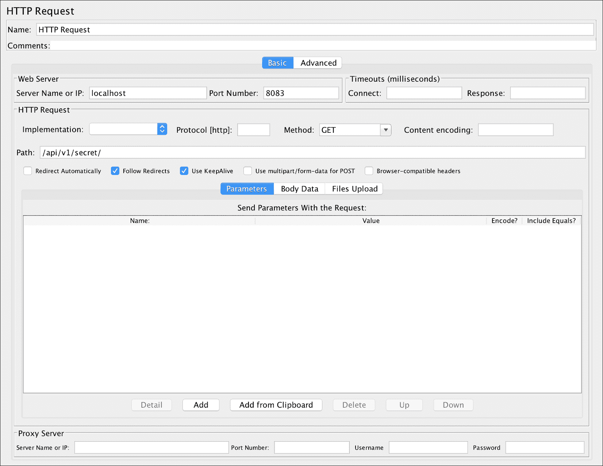
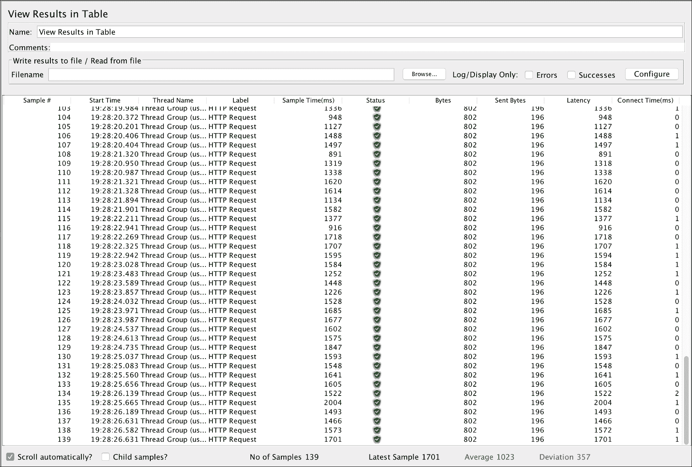

# 第十章：可扩展性策略

您的应用程序已准备就绪。现在是计划未来的时候了。在本章中，我们将为您全面介绍如何检查应用程序可能的瓶颈以及如何计算应用程序的容量。在本章结束时，您将具备创建自己的可扩展性计划的基本知识。

# 容量规划

**容量规划**是确定应用程序所需的基础设施资源的过程，以满足应用程序未来的工作负载需求。该过程确保您在需要时有足够的资源可用，从而将成本降至最低。如果您知道应用程序的使用方式和当前资源的限制，您可以推断数据并大致了解未来的需求。为您的应用程序创建容量规划具有一些好处，其中我们可以突出以下好处：

+   **最小化成本并避免过度配置的浪费**：您的应用程序将仅使用所需的资源，因此，例如，当您只使用 8GB 时，为数据库拥有 64GB RAM 服务器是没有意义的。

+   **预防瓶颈并节省时间**：您的容量计划突出显示基础设施的每个元素何时达到峰值，为您提供有关瓶颈可能出现的提示。

+   **提高业务生产力**：如果您有一个详细的计划，指出基础设施的每个元素的限制，并知道每个元素何时达到其限制，那么您就有了空余时间来专注于其他业务任务。您将有一套指令，以便在需要增加应用程序容量的确切时刻遵循。当您遇到瓶颈并不知道该怎么办时，就不会再有疯狂的时刻了。

+   **用作业务目标的映射**：如果您的应用程序对您的业务至关重要，此文档可用于突出一些业务目标。例如，如果业务想要达到 1,000 个用户，您的基础设施需要支持它们，标记一些需要满足此要求的投资。

## 了解您的应用程序的限制

了解您的应用程序的限制的主要目的是在开始出现问题之前知道我们在任何给定时间点还有多少容量。我们需要做的第一件事是创建我们应用程序组件的清单。尽可能详细地制作清单；这将帮助您了解项目中所有工具。在我们的示例应用程序中，不同组件的清单可能类似于以下内容：

+   自动发现服务：

+   Hashicorp Consul

+   遥测服务：

+   Prometheus

+   战斗微服务：

+   代理：NGINX

+   应用引擎：PHP 7 FPM

+   数据存储：Percona

+   缓存存储：Redis

+   位置微服务：

+   代理：NGINX

+   应用引擎：PHP 7 FPM

+   数据存储：Percona

+   缓存存储：Redis

+   秘密微服务：

+   代理：NGINX

+   应用引擎：PHP 7 FPM

+   数据存储：Percona

+   缓存存储：Redis

+   用户微服务：

+   代理：NGINX

+   应用引擎：PHP 7 FPM

+   数据存储：Percona

+   缓存存储：Redis

一旦我们将应用程序减少到基本组件，我们需要分析并确定每个组件的使用情况以及适当测量中的最大容量。

某些组件可能有多个���联的测量，例如数据存储层（在我们的案例中为 Percona）。对于此组件，我们可以测量 SQL 事务数量、使用的存储量、CPU 负载等。在前几章中，我们添加了一个遥测服务；您可以使用此服务从每个组件中收集基本统计信息。

您可以为应用程序的每个组件记录的一些基本统计信息如下：

+   CPU 负载

+   内存使用

+   网络使用

+   IOPS

+   磁盘利用率

在某些软件中，您需要收集一些特定的测量。例如，在数据库上，您可以检查以下内容：

+   每秒事务数

+   缓存命中率（如果启用了查询缓存）

+   用户连接

下一步是确定应用程序的自然增长。如果没有进行特殊操作（如 PPC 广告活动和新功能），则可以将此测量定义为应用程序的增长。这个测量可以是新用户的数量或活跃用户的数量，例如。想象一下，您将应用程序部署到生产环境，并停止添加新功能或进行营销活动。如果过去一个月新用户的数量增加了 7%，那么这个数量就是您的应用程序的自然增长。

一些企业/项目具有季节性趋势，这意味着在特定日期，您的应用程序的使用量会增加。想象一下，您是一个礼品零售商，您的大部分销售可能是在情人节或年底（黑色星期五，圣诞节）左右完成的。如果这是您的情况，请分析您拥有的所有数据以建立季节性数据。

现在您已经了解了应用程序的一些基本统计数据，是时候计算所谓的剩余空间了。剩余空间可以定义为在资源耗尽之前您拥有的资源量。可以用以下公式计算：


剩余空间公式

从上述公式中可以看出，计算特定组件的剩余空间非常简单。在我们举例之前，让我们解释每个变量：

+   **理想使用率：** 这是一个百分比，描述了我们计划使用的应用程序特定组件的容量。理想使用率永远不应该达到 100%，因为当接近资源限制时，可能会出现无法保存数据库中数据等奇怪的行为。我们建议将此量设置在 60%至 75%之间，为高峰时刻留出足够的额外空间。

+   **最大容量：** 这是指我们研究对象组件的最大容量。例如，一个能够处理最多 250 个并发连接的 Web 服务器。

+   **当前使用率：** 这是指我们正在研究的组件的当前使用率。

+   **增长：** 这是指我们应用程序的自然增长的百分比。

+   **优化：** 这是可选变量，描述了在特定时间内我们可以实现的优化量。例如，如果您当前的数据库每秒可以处理 35 个查询，经过一些优化后，您可以实现每秒 50 个查询。在这种情况下，优化量为 15。

假设您正在计算我们的一个 NGINX 可以处理的每秒请求的剩余空间。对于我们的应用程序，我们已经决定将理想使用率设置为 60%（0.6）。根据我们的测量和从负载测试中提取的数据（稍后在本章中解释），我们知道每秒请求的最大数量（RPS）为 215。在我们当前的统计数据中，我们的 NGINX 服务器今天提供了最高 193 RPS，并且我们已经计算出了下一年的增长至少为 11 RPS。

我们想要测量的时间段是 1 年，我们认为我们可以在这段时间内实现最大容量 250 RPS，因此我们的剩余空间值将如下所示：

*剩余空间= 0.6 * 215 - 123 - (11 - 35) = 30 RPS*

这个计算意味着什么？由于结果是正数，这意味着我们有足够的预留空间。如果我们将结果除以增长和优化的总和，我们可以计算出我们达到资源限制之前还有多少时间。

由于我们的时间段是 1 年，我们可以计算出我们达到资源限制之前还有多少时间，如下所示：

*Headroom 时间= 30 rpm / 24 = 1.25 年*

您可能已经推断出，我们的 NGINX 服务器还有 1.25 年才能达到 RPS 的极限。在本节中，我们向您展示了如何计算特定组件的余量；现在轮到您为您的每个组件和每个组件可用的不同指标进行计算了。

## 可用性数学

**可用性**可以定义为网站在特定时间段内的可用性，例如一周，一天，一年等。根据您的应用程序对您或您的业务的重要性，停机时间可能等于丢失的收入。正如您可以想象的那样，可用性可能成为应用程序由客户/用户使用并且他们需要您的服务的任何时间的情况下最重要的指标。

我们对可用性有了理论概念。现在是时候做一些数学运算了，拿出你的计算器。根据早期的一般定义，可用性可以计算为您的应用程序可以被用户/客户使用的时间除以时间范围（我们正在测量的特定时间段）。

假设我们想要测量我们的应用程序在一周内的可用性。一周内，我们有`10,080`分钟：

* 7 天 x 每天 24 小时 x 每小时 60 分钟= 7 * 24 * 60 = **10,080 分钟***

现在，假设您的应用程序在那周发生了一些故障，并且您的应用程序的可用分钟数减少到`10,000`。要计算我们示例的可用性，我们只需要进行一些简单的数学运算：

* 10,000 / 10,080 = 0.9920634921*

可用性通常以百分比（％）表示，因此我们需要将结果转换为百分比：

* 0.9920634921 * 100 = 99.20634921％〜**99.21***

我们的应用程序在一周内的可用性为`99.21％`。不算太糟糕，但离我们的目标结果还差得远，即尽可能接近`100％`。大多数情况下，可用性百分比被称为**数量的九**，并且它们越接近`100％`，就越难以维护应用程序的可用性。为了让您了解达到`100％`可用性将有多困难，这里有一些可用性和可能停机时间的示例：

+   99.21％（我们的示例）：

+   每周：1 小时 19 分钟 37.9 秒

+   每月：5 小时 46 分钟 15.0 秒

+   每年：69 小时 14 分钟 59.9 秒

+   99.5％：

+   每周：50 分钟 24.0 秒

+   每月：3 小时 39 分钟 8.7 秒

+   每年：43 小时 49 分钟 44.8 秒

+   99.9％：

+   每周：10 分钟 4.8 秒

+   每月：43 分钟 49.7 秒

+   每年：8 小时 45 分钟 57.0 秒

+   99.99％：

+   每周：1 分钟 0.5 秒

+   每月：4 分钟 23.0 秒

+   每年：52 分钟 35.7 秒

+   99.999％：

+   每周：6.0 秒

+   每月：26.3 秒

+   每年：5 分钟 15.6 秒

+   99.9999％：

+   每周：0.6 秒

+   每月：2.6 秒

+   每年：31.6 秒

+   99.99999％：

+   每周：0.1 秒

+   每月：0.3 秒

+   每年：3.2 秒

正如您所看到的，接近`100％`的可用性变得越来越困难，停机时间变得更紧。但是，您如何减少停机时间或至少确保尽力保持低水平呢？这个问题没有简单的答案，但我们可以给您一些建议，告诉您可以做的不同事情：

+   最坏的情况将发生，因此您应该经常模拟故障，以便随时准备应对应用程序的大灾难。

+   找出应用程序可能的瓶颈。

+   测试，到处都是测试，当然，要保持它们更新。

+   记录任何事件，任何指标，您可以测量或保存为日志的任何内容，并保存以供将来参考。

+   了解您的应用程序的限制。

+   至少要有一些良好的开发实践，至少要分享应用程序构建的知识。在所有这些实践中，您可以执行以下操作之一：

+   对于任何热修复或功能，需要第二次批准

+   成对编程

+   创建持续交付管道。

+   制定备份计划并确保您的备份安全并随时可用。

+   记录所有内容，任何小的更改或设计，并始终保持文档最新。

现在您已经全面了解了“可用性”意味着什么，以及每个速率的最大停机时间。如果您向用户/客户提供 SLA（服务级别协议），请注意，您将会对应用程序的可用性做出承诺，您将需要履行这个承诺。

# 负载测试

负载测试可以定义为在应用程序中施加需求（负载）以测量其响应的过程。这个过程可以帮助您确定应用程序或基础设施的最大容量，并且可以突出显示应用程序或基础设施的瓶颈或问题元素。进行负载测试的正常方式是首先在应用程序中进行“正常”条件下的测试，也就是在应用程序中进行正常负载的测试。在正常条件下测量系统的响应可以让您拥有一个基线，您将用它来与未来的测试进行比较。

让我们看一些您可以用于负载测试的最常见工具。有些简单易用，而其他一些更复杂和强大。

## Apache JMeter

Apache JMeter 应用程序是一个用 Java 构建的开源软件，旨在进行负载测试和性能测量。起初，它是为 Web 应用程序设计的，但随着时间的推移，它扩展到测试其他功能。

Apache JMeter 的一些最有趣的功能如下：

+   支持不同的应用程序/服务器/协议：HTTP(S)、SOAP/Rest、FTP、LDAP、TCP 和 Java 对象。

+   与第三方持续集成工具轻松集成：它具有用于 Maven、Gradle 和 Jenkins 的库。

+   命令行模式（非 GUI/无头模式）：这使您可以在安装了 Java 的任何操作系统上进行测试。

+   多线程框架：这允许您通过许多线程进行并发样本，并通过单独的线程组同时对不同功能进行采样。

+   高度可扩展：它可以通过库或插件等进行扩展。

+   完整的测试 IDE：它允许您创建、记录和调试您的测试计划。

正如您所看到的，这个项目是一个有趣的工具，您可以在负载测试中使用。在接下来的部分中，我们将向您展示如何构建一个简单的测试场景。不幸的是，我们的书中没有足够的空间来涵盖所有功能，但至少您将了解未来更复杂测试的基础知识。

### 安装 Apache JMeter

由于是用 Java 开发的，这个应用程序可以在安装了 Java 的任何操作系统上使用。让我们在开发机器上安装它。

第一步是满足主要要求——您需要一个 JVM 6 或更高版本来使应用程序工作。您可能已经在您的计算机上安装了 Java，但如果不是这种情况，您可以从 Oracle 页面下载最新的 JDK。

要检查您的 Java 运行时版本，您只需要在您的操作系统中打开终端并执行以下命令：

```php
**java -version**

```

上述命令将告诉您在您的计算机上可用的版本。

一旦我们确定了正确的版本，我们只需要转到官方的 Apache JMeter 页面（[`jmeter.apache.org`](http://jmeter.apache.org)）并下载最新的 ZIP 或 TGZ 格式的二进制文件。一旦二进制文件完全下载到您的计算机上，您只需要解压下载的 ZIP 或 TGZ，Apache JMeter 就可以使用了。

### 使用 Apache JMeter 执行负载测试

打开您解压缩 Apache JMeter 二进制文件的文件夹。在那里，您可以找到一个`bin`文件夹和一些不同操作系统的脚本。如果您使用 Linux/UNIX 或 Mac OS，您可以���行`jmeter.sh`脚本来打开应用程序的 GUI。如果您使用 Windows，有一个`jmeter.bat`可执行文件，您可以用它来打开 GUI：


Apache JMeter GUI

Apache JMeter GUI 允许您构建不同的测试计划，正如您在前面的截图中所看到的，即使不阅读手册，界面也非常容易理解。让我们用 GUI 构建一个测试计划。

### 提示

一个测试计划可以被描述为 Apache JMeter 将按特定顺序运行的一系列步骤。

为了创建我们的测试计划的第一步，需要在**测试计划**节点下添加一个**线程组**。在 Apache JMeter 中，线程组可以被定义为并发用户的模拟。按照给定的步骤创建一个新的组：

1.  右键单击**测试计划**节点。

1.  在上下文菜单中，选择**添加 | 线程（用户） | 线程组**。

前面的步骤将在我们的**测试计划**节点中创建一个子元素。选择它，以便我们可以对我们的组进行一些调整。参考以下截图：


线程组设置

如前面的截图所示，每个线程组都允许您指定测试的用户数量和测试的持续时间。主要可用的选项如下所示：

+   **样本错误后要采取的操作：**这个选项允许您控制测试在抛出样本错误时的行为。最常用的选项是**继续**行为。

+   **线程数（用户数）：**这个字段允许您指定要用来击打您的应用程序的并发用户数量。

+   **ramp-up 周期（以秒为单位）：**这个字段用于告诉 Apache JMeter 可以用多少时间来创建您在前一个字段中指定的所有线程。例如，如果您将此��段设置为 60 秒，并且**线程数（用户数）**设置为 6，Apache JMeter 将花费 60 秒来启动所有 6 个线程，每 10 秒一个。

+   **循环计数和永远：**这些字段允许您在特定次数的执行后停止测试。

其余选项都是不言自明的，在我们的示例中，我们将只使用上述字段。

假设您想使用 25 个线程（就像用户），并将 ramp-up 设置为 100 秒。数学会告诉您，每 4 秒将创建一个新的线程，直到有 25 个线程在运行（100/25 = 4）。这两个字段允许您设计您的测试，以便在合适的时间开始缓慢增加击打您的应用程序的用户数量。

一旦我们定义了我们的线程/用户，就是时候添加一个请求了，因为没有请求，我们的测试将无法进行。要添加一个请求，您只需要选择线程组节点，右键单击上下文菜单，然后选择**添加 | 取样器 | HTTP 请求**。前面的操作将在我们的线程组中添加一个新的子节点。选择新节点，Apache JMeter 将向您显示一个类似于以下截图的表单：



HTTP 请求选项

如前面的截图所示，我们可以设置要用我们的测试击打的主机。在我们的情况下，我们决定在端口 8083 上用`GET`请求击打`localhost`的`/api/v1/secret/`路径。随意探索高级选项或添加自定义参数。Apache JMeter 非常灵活，几乎涵盖了每种可能的场景。

在这一点上，我们已经建立了一个基本的测试，现在是时候看看结果了。让我们探索一些有趣的方法来收集测试的信息。为了查看和分析我们测试的每次迭代的结果，我们需要添加一个**监听器**。要做到这一点，就像在之前的步骤中一样，右键单击**线程组**，然后导航到**添加 | 监听器 | 在表中查看结果**。这个操作将在我们的测试中添加一个新的节点，一旦我们开始测试，结果将出现在应用程序中。

如果您在**线程组**中选择了**永远**选项，则需要手动停止测试。您可以使用绿色播放旁边显示的红色十字图标来停止。此按钮将停止等待每个线程结束其操作的测试。如果单击停止图标，Apache JMeter 将立即终止所有线程。

让我们试一试，点击绿色播放图标开始测试。点击**查看结果表**节点，您将看到测试结果的所有结果出现：



Apache JMeter 表中的结果

如前面的屏幕截图所示，Apache JMeter 为每个请求记录了不同的数据，例如发送/返回的字节数，状态或请求延迟等。当您更改负载量时，所有这些数据都很有趣。使用此监听器，您甚至可以导出数据，以便使用外部工具分析结果。

如果您没有外部工具来分析数据，但是您想要一些基本的统计数据来与您的应用程序暴露给不同负载进行比较，您可以添加另一个有趣的监听器。与之前一样，打开**线程组**的右键上下文菜单，导航到`添加` | **监听器** | `摘要报告`。此监听器将为您提供一些基本统计数据，供您用于比较结果：


Apache JMeter 摘要报告

如前面的屏幕截图所示，此监听器为我们提供了一些测量的平均值。

使用表格显示结果是可以的。但是众所周知，一张图片胜过千言万语，因此让我们添加一些图形监听器，以便您完成负载测试报告。右键单击**线程组**，在上下文菜单中转到**添加** | **监听器** | **响应时间图**。您将看到一个类似于以下的屏幕：


Apache JMeter 响应时间图

随意对默认设置进行一些更改。例如，您可以减少**间隔（毫秒）**。如果再次运行测试，测试生成的所有数据将用于生成一个漂亮的图表，如下图所示：


响应时间图

从我们的测试结果生成的图表中可以看出，线程（用户）的增加导致响应时间的增加。你认为这意味着什么？如果你说我们的测试基础设施需要扩大以适应负载的增加，那么你的回答是正确的。

Apache JMeter 具有多个选项来创建您的负载测试。我们只向您展示了如何创建基本测试以及如何查看结果。现在轮到您探索所有可用的不同选项来创建高级测试，并发现哪些功能更适合您的项目。让我们看看您可以用于负载测试的其他工具。

## 使用 Artillery 进行负载测试

**Artillery**是一个开源工具包，您可以使用它对应用程序进行负载测试，它类似于 Apache JMeter。除其他功能外，我们可以强调此工具的以下优点：

+   支持多种协议，HTTP(S)或 WebSockets 可以直接使用

+   易于与实时报告软件或 DataDog 和 InfluxDB 等服务集成

+   高性能，因此可以在普通硬件/服务器上使用

+   非常容易扩展，因此可以根据您的需求进行调整

+   具有详细性能指标的不同报告选项

+   非常灵活，因此您可以测试几乎任何可能的场景

### 安装 Artillery

Artillery 是基于 node.js 构建的，因此主要要求是在您将用于执行测试的计算机上安装此运行时。

我们喜欢容器化技术，但不幸的是，在 Docker 上使用 artillery 没有简单的方法，除非进行一些不干净的操作。无论如何，我们建议您使用专用的 VM 或服务器进行负载测试。

要使用 Artillery，您需要在您的 VM/server 中安装 node.js，这个软件非常容易安装。我们不打算解释如何创建本地 VM（您可以使用 VirtualBox 或 VMWare 创建一个），我们只会向您展示如何在 RHEL/CentOS 上安装它。对于其他操作系统和选项，您可以在 node.js 文档中找到详细信息（[`nodejs.org/en/download/`](https://nodejs.org/en/download/)）。

打开您的 RHEL/CentOS 虚拟机或服务器的终端，并下载 LTS 版本的设置脚本：

```php
**curl --silent -location  https://rpm.nodesource.com/setup_6.x | bash -**

```

一旦上一个命令完成，您需要以 root 身份执行下一个命令，如下所示：

```php
**yum -y install nodejs**

```

执行上述命令后，您的 VM/server 将安装并准备好 Node.js。现在是时候使用 Node.js 包管理器`npm`命令全局安装 Artillery 了。在您的终端中，执行以下命令以全局安装 Artillery：

```php
**npm install -g artillery**

```

一旦上一个命令完成，您就可以使用 Artillery 了。

我们可以做的第一件事是检查 Artillery 是否已正确安装并可用。输入以下命令进行检查：

```php
**artillery dino**

```

上述命令将向您显示一个可爱的恐龙，这意味着 Artillery 已经准备好使用了。

### 使用 Artillery 执行负载测试

Artillery 是一个非常灵活的工具包。您可以从控制台运行测试，也可以使用描述测试场景的 YAML 或 JSON 文件运行它们。请注意，在我们的以下示例中，我们使用`microservice_secret_nginx`作为我们要测试的主机，您需要将此主机调整为您本地环境的 IP 地址。让我们来看看这个工具；在我们的负载测试 VM/server 中运行以下命令：

```php
**artillery quick --duration 30 --rate 5 -n 1  
http://microservice_secret_nginx/api/v1/secret/**

```

上述命令将在 30 秒的时间内进行快速测试。在此期间，Artillery 将创建五个虚拟用户；每个用户将对提供的 URL 进行一次 GET 请求。一旦执行了上述命令，Artillery 将开始测试并每 10 秒打印一些统计信息。在测试结束时（30 秒），此工具将向您显示一个类似于以下的小报告：

```php
**Complete report @ 2016-12-17T16:09:34.140Z
  Scenarios launched:  150
  Scenarios completed: 150
  Requests completed:  150
  RPS sent: 4.87
  Request latency:
    min: 578.1
    max: 1223.7
    median: 781.5
    p95: 1146.5
    p99: 1191.1
  Scenario duration:
    min: 583.2
    max: 1226.8
    median: 786.1
    p95: 1150
    p99: 1203.8
  Scenario counts:
    0: 150 (100%)
  Codes:
    200: 150**

```

上述报告非常易于理解，并为您提供了基础设施和应用程序的绩效概述。

在我们开始分析 Artillery 报告之前，您需要了解的一个基本概念是场景的概念。简而言之，**场景**是您想要测试的一系列任务或操作，它们是相关的。想象一下，您有一个电子商务应用程序；一个测试场景可以是用户在完成购买之前执行的所有步骤。考虑以下示例：

1.  用户加载主页。

1.  用户搜索产品。

1.  用户向购物篮中添加产品。

1.  用户去结账。

1.  用户进行购买。

所有提到的操作都可以转换为对您的应用程序的请求，模拟用户操作，这意味着一个场景是一组请求。

现在我们清楚了这个概念，我们可以开始分析 Artillery 输出的报告。在我们的示例中，我们只有一个场景，只有一个请求（`GET`）到`http://microservice_secret_nginx/api/v1/secret/`。这个测试场景由五个虚拟用户执行，他们在 30 秒内只发出一个`GET`请求。一个简单的数学计算，`5 * 1 * 30`，给出了我们测试的场景总数（`150`），这与我们的情况下的请求总数相同。`RPS sent`字段给出了我们的测试服务器在测试期间平均每秒发送的请求。这不是一个非常重要的字段，但它可以让您了解测试的执行情况。

让我们来看看 Artillery 给出的`Request latency`和`Scenario duration`统计数据。您需要知道的第一件事是，这些组的所有测量都是以毫秒为单位的。

在`Request latency`的情况下，数据向我们展示了应用程序处理我们发送的请求所用的时间。两个重要的统计数据是 95%（`p95`）和 99%（`p99`）。您可能已经知道，百分位数是统计学中用于指示给定百分比观察值落在其下的值的度量。从我们的示例中，我们可以看到 95%的请求在 1146.5 毫秒或更短的时间内被处理，或者 99%的请求在 1191.1 毫秒或更短的时间内被处理。

在我们的示例中，`Scenario duration`中显示的统计数据与`Request latency`几乎相同，因为每个场景只包含一个请求。如果您创建了更复杂的场景，每个场景包含多个请求，那么这两组数据将有所不同。

### 创建 Artillery 脚本

正如我们之前告诉过您的，Artillery 允许您创建 YAML 或 JSON 文件来进行负载测试场景。让我们将我们的快速示例转换为一个 YAML 文件，这样您就可以将其保存在存储库中以备将来执行。

要做到这一点，您只需要在我们的测试容器中创建一个名为`test-secret.yml`的文件，内容如下：

```php
**config:
 target: 'http://microservice_secret_nginx/'
 phases:
 - duration: 30
 arrivalRate: 5

scenarios:
 - flow:
 - get:
 url: "api/v1/secret/"**

```

正如您在上文中所看到的，它与我们的`artillery quick`命令类似，但现在您可以将它们存储在您的代码存储库中，以便反复针对您的应用程序运行。

您可以使用`artillery run test-secret.yml`命令运行您的测试，结果应该与快速命令生成的结果类似。

Docker 容器镜像只包含所需的最小软件，因此您可能无法在我们的负载测试镜像中找到文本编辑器。在本书的这一部分，您将能够创建一个 Docker 卷并将其附加到我们的测试容器，以便您可以共享文件。

### 高级脚本编写

这个工具包的一个突出特点是能够创建自定义脚本，但您不仅仅局限于发送静态请求。该工具允许您使用外部 CSV 文件、解析 JSON 响应或脚本中的内联值来随机化请求。

假设您想要测试负责在您的应用程序中创建新帐户的 API 端点，而不是使用 YAML 文件，您正在使用 JSON 脚本。您可以使用外部 CSV 文件与以下调整一起在测试中使���用户数据：

```php
    "config": {
      "payload": {
        "path": "./relative/path/to/test-data.csv",
        "fields": ["name", "surname", "email"]
      }
    }
    // ... omitted config ...//
    "scenarios": [
      {
        "flow": [
          {
            "post": {
              "url": "/api/v1/user",
              "json": {
                "name": {{ name }}, 
                "surname": {{ surname }},
                "email": {{ email }}
              }
            }
          }
        ]
      }
    ]
```

`config`字段将告诉 Artillery 我们的 CSV 文件的位置以及 CSV 中使用的不同列。设置好外部文件后，我们可以在场景中使用这些数据。在我们的示例中，Artillery 将从`test-data.csv`中随机选择行，并使用这些数据生成对`/api/v1/user`的 post 请求。`payload`中的字段将创建我们可以使用的变量，比如`{{ variableName }}`。

创建这种类型的脚本似乎很容易，但是在创建脚本的过程中，您可能需要一些调试信息来了解您的脚本在做什么。如果您想查看每个请求的详细信息，可以按照以下方式运行您的脚本：

```php
**DEBUG=http artillery run test-secret.yml**

```

如果您想要查看响应，可以按照以下方式运行负载测试脚本：

```php
**DEBUG=http:response artillery run myscript.yaml**

```

不幸的是，本书中没有足够的空间来详细介绍 Artillery 中的所有可用选项。但是，我们想向您展示一个有趣的工具，您可以使用它进行负载测试。如果您需要更多信息，甚至如果您想要为项目做出贡献，您只需要访问项目的页面（[`artillery.io`](https://artillery.io)）。

## 使用 siege 进行负载测试

Siege 是一个有趣的多线程 HTTP(s)负载测试和基准测试工具。与其他工具相比，它似乎小而简单，但它高效且易于使用，例如，对您最新更改进行快速测试。此工具允许您使用可配置数量的并发虚拟用户命中 HTTP(S)端点，并且可以在三种不同模式下使用：回归、互联网模拟和暴力。

Siege 是为 GNU/Linux 开发的，但已成功移植到 AIX、BSD、HP-UX 和 Solaris。如果您想要编译它，在大多数 System V UNIX 变体和大多数较新的 BSD 系统上都不应该有任何问题。

### 在 RHEL、CentOS 和类似的操作系统上安装 siege

如果您使用启用了额外存储库的 CentOS，您可以使用一个简单的命令安装 EPEL 存储库：

```php
**sudo yum install epel-release**

```

一旦您有了 EPEL 存储库，您只需要执行`sudo yum install siege`就可以在您的操作系统中使用此工具。

有时，例如当您不使用 Centos 时，`sudo yum install epel-release`命令不起作用，您的发行版是 RHEL 或类似的发行版。在这些情况下，您可以使用以下命令手动安装 EPEL 存储库：

```php
**wget https://dl.fedoraproject.org/pub/epel/epel-release-latest-7.noarch.rpm
sudo rpm -Uvh epel-release-latest-7*.rpm**

```

一旦 EPEL 存储库在您的操作系统中可用，您可以使用以下命令`安装 siege`：

```php
**sudo yum install siege**

```

### 在 Debian 或 Ubuntu 上安装 siege

在 Debian 或 Ubuntu 上安装 siege 非常简单，只需使用官方存储库。如果您有这些操作系统的最新版本之一，您只需要执行以下命令：

```php
**sudo apt-get update
sudo apt-get install siege**

```

上述命令将更新您的系统并安装`siege`软件包。

### 在其他操作系统上安装 siege

如果您的操作系统在之前的步骤中没有涵盖，您可以通过编译源代码来完成，互联网上有很多说明您需要做什么的教程。

### 快速 siege 示例

让我们快速创建一个文本到我们的一个端点。在这种情况下，我们将在 30 秒内使用 50 个并发用户测试我们的端点。打开您安装了 siege 的机器的终端，并输入以下命令。随意更改命令以正确的主机或端点：

```php
**siege -c50 -d10 -t30s http://localhost:8083/api/v1/secret/**

```

上述命令在以下几点中得到解释：

+   `-c50`：创建 50 个并发用户

+   `-d10`：每个模拟用户之间的延迟为 1 到 10 秒之间的随机秒数

+   `-t30s`：运行测试的时间；在我们的情况下为 30 秒

+   `http://localhost:8083/api/v1/secret/`：要测试的端点

一旦您按下*Enter*，`siege`命令将开始向服务器发送请求，并且您将获得类似以下的输出：

```php
**filloa:~ psolar$ siege -c50 -d10 -t30s  http://localhost:8083/api/v1/secret/**
**** SIEGE 3.1.3
** Preparing 50 concurrent users for battle.
The server is now under siege...
HTTP/1.1 200   0.50 secs:     577 bytes ==> GET  /api/v1/secret/
/** ... omitted lines ... **/
Lifting the server siege...      done.**

```

大约 30 秒后，siege 将停止请求并向您显示一些统计信息，例如以下内容：

```php
**Transactions:                149 hits
Availability:                100.00 %
Elapsed time:                29.91 secs
Data transferred:            0.08 MB
Response time:               3.33 secs
Transaction rate:            4.98 trans/sec
Throughput:                  0.00 MB/sec
Concurrency:                 16.57
Successful transactions:     149
Failed transactions:         0
Longest transaction:         5.89
Shortest transaction:        0.50**

```

从上述结果中，我们可以得出结论，我们所有的请求都没有问题，没有一个请求失败，平均响应时间为 3.33 秒。正如您所看到的，这个工具更简单，可以在日常基础上使用，以检查您的应用程序从哪个并发用户级别开始出现错误，或者在您检查其他指标时将应用程序置于压力之下。

# 可扩展性计划

**可扩展性计划**是一份描述应用程序的所有不同组件以及在需要时扩展应用程序所需步骤的文件。可扩展性计划是一份实时文件，因此您需要经常审查并保持更新。

由于可扩展性计划更多地是一个内部文件，其中包含您需要做出关于应用程序可扩展性的正确决策的所有信息，因此没有准备好填写的主模板。我们建议使用可扩展性计划作为您的指南，包括您的容量计划的所有内容，甚至可以将如何雇佣新员工添加到此文档中。

您的可扩展性计划中可能包括以下部分：

+   应用程序及其组件的概述

+   云提供商或您将部署应用程序的地点的比较

+   您的容量计划和应用程序的理论极限的总结

+   可扩展性阶段或步骤

+   配置时间和成本

+   组织可扩展性步骤

前面的部分只是一个建议，随时可以添加或删除任何部分以适应您的业务计划。

以下是容量计划的一些部分概述。假设我们的示例微服务应用程序已准备就绪，并且希望从最低资源开始扩展。首先，我们可以将我们应用程序中的不同元素描述为基本清单，从而使我们的应用程序得以发展：

+   战斗微服务

+   NGINX

+   PHP 7 fpm

+   位置微服务

+   NGINX

+   PHP 7 fpm

+   秘密微服务

+   NGNIX

+   PHP 7 fpm

+   用户微服务

+   NGINX

+   PHP 7 fpm

+   数据存储层

+   数据库：Percona

正如您所看到的，我们已经描述了我们应用程序所需的每个组件，并开始在所有微服务之间共享数据层。我们没有添加任何缓存层；此外，我们也没有添加任何自动发现和遥测服务（我们将在接下来的步骤中添加额外功能）。

一旦我们满足了最低要求，让我们来看看我们的可扩展性计划中可以有哪些不同步骤。

## 第 0 步

在这一步中，即使应用程序尚未准备好投入生产，我们将在一台机器上满足所有我们的要求，因为您的应用程序无法在机器出现问题时生存。以下特征的单个服务器将足够：

+   8 GB RAM

+   500 GB 磁盘

基本操作系统将是 RHEL 或 CentOS，并安装以下软件：

+   带有多个虚拟主机设置的 NGINX

+   Git

+   Percona

+   PHP 7 fpm

在这一步中，配置时间可能需要几个小时。我们不仅需要启动服务器，还需要设置所需服务（NGINX、Percona 等）。使用诸如 Ansible 之类的工具可以帮助我们快速和可重复地进行配置。

## 第 1 步

在这一点上，您正在为生产环境准备应用程序，选择虚拟机或容器（在我们的情况下，我们决定使用容器以获得灵活性和性能），将单个服务器配置拆分为专用于每个所需服务的多个服务器，如我们之前的要求，并添加自动发现和遥测服务。

在这一步，您可以找到我们应用程序架构的简要描述：

+   自动发现

+   带有 ContainerPilot 的 Hashicorp Consul 容器

+   遥测

+   带有 ContainerPilot 的 Prometheus 容器

+   战斗微服务

+   带有 ContainerPilot 的 NGINX 容器

+   带有 ContainerPilot 的 PHP 7 fpm 容器

+   位置微服务

+   带有 ContainerPilot 的 NGINX 容器

+   带有 ContainerPilot 的 PHP 7 fpm 容器

+   秘密微服务

+   带有 ContainerPilot 的 NGINX 容器

+   带有 ContainerPilot 的 PHP 7 fpm 容器

+   用户微服务

+   带有 ContainerPilot 的 NGINX 容器

+   带有 ContainerPilot 的 PHP 7 fpm 容器

+   数据存储层

+   带有 ContainerPilot 的 Percona 容器

在这一步中，配置时间将从前一步的几小时减少到几分钟。我们已经有了一个自动发现服务（HashiCorp Consul），并且由于 ContainerPilot，我们的每个不同组件将在自动发现注册中注册自己，并自动设置。几分钟内，我们可以完成所有容器的配置和设置。

## 第 2 步

在您的可扩展性规划的这一步中，您将为所有应用程序微服务添加缓存层，以减少请求数量并提高整体性能。为了提高性能，我们决定使用 Redis 作为我们的缓存引擎，因此您需要在每个微服务上创建一个 Redis 容器。这一步的配置时间将与上一步相似，但以分钟为单位。

## 第 3 步

在这一步中，您将把存储层移动到每个微服务中，使用 ContainerPilot 和 Consul 自动设置 Master-Slave 模式的三个 Percona 容器。

这一步的配置时间将与上一步相似，以分钟为单位。

## 第 4 步

在可扩展性计划的这一步中，您将研究应用程序的负载和使用模式。您将在 NGINX 容器前面添加负载均衡器，以获得更大的灵活性。由于这个新层，我们可以进行 A/B 测试或蓝/绿部署，以及其他功能。在这种情况下，您可以使用一些有趣的开源工具，如 Fabio 代理和 Traefik。

这一步的预配时间将与上一步相似，以分钟为单位。

## 第 5 步

在这最后一步中，您将再次检查应用程序基础设施，使其保持最新，并在必要时进行水平扩展。

这一步的预配时间将与上一步相似，以分钟为单位。

正如我们之前告诉过您的，可扩展性计划是一个动态文件，因此您需要经常进行修订。想象一下，几个月后会有一种新的数据库软件问世，它非常适合高负载；您可以审查您的可扩展性计划，并将这个新数据库引入您的基础设施。请随意添加您认为对应用程序的可扩展性重要的所有信息。

# 总结

在本章中，我们向您展示了如何检查应用程序的限制，这可以让您了解可能会遇到的瓶颈。我们还向您展示了创建容量和可扩展性计划所需的基本概念。我们还向您展示了一些对应用程序进行负载测试的选项。您应该有足够的知识，使您的应用程序能够应对高负载使用，或者至少了解您应用程序的薄弱点。
