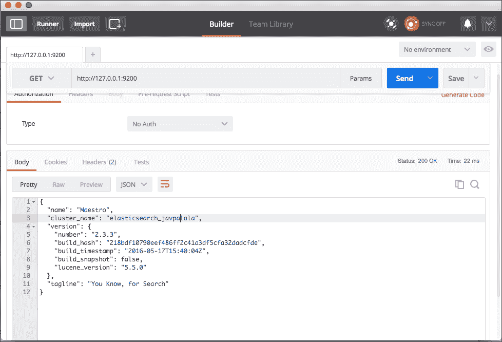
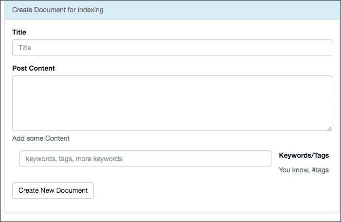
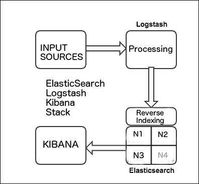
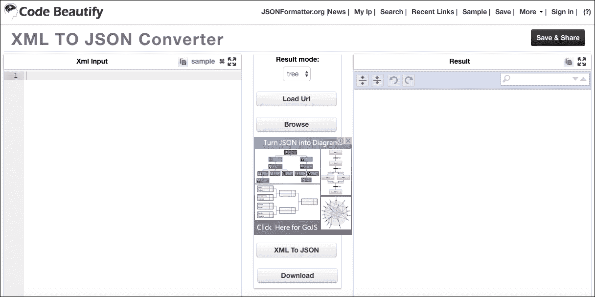

# 第四章。使用 Elasticsearch 构建具有搜索功能的简单博客

在本章中，我们将创建一个简单的博客，可以创建和删除帖子。然后我们将致力于为我们的博客添加一些功能，例如以下内容：

+   实现一个非常简单的带有 CRUD 和管理员功能的博客

+   工作和安装 Elasticsearch 和 Logstash

+   尝试使用 Elasticsearch 的 PHP 客户端

+   学习构建与 Elasticsearch 一起工作的工具

+   为我们的数据库构建搜索缓存

+   基于我们的 Elasticsearch 信息构建图表

# 创建 CRUD 和管理员系统

首先，让我们构建我们的帖子的 SQL。数据库表至少应该包含帖子标题、帖子内容、帖子日期以及修改和发布日期。

这是 SQL 应该看起来的样子：

```php
CREATE TABLE posts( 
id INT(11) PRIMARY KEY AUTO INCREMENT, 
post_title TEXT, 
post_content TEXT, 
post_date DATETIME, 
modified DATETIME, 
published DATETIME 
); 

```

现在让我们创建一个函数来读取数据。一个典型的博客网站有评论和与博客文章相关的一些额外的 SEO 元数据。但在本章中，我们不会创建这部分。无论如何，向评论数据添加表格并在另一个表格中添加有关每篇文章的 SEO 元数据应该是相当简单的。

让我们从创建管理员系统开始。我们需要登录，所以我们将创建一个简单的登录-注销脚本：

```php
//admin.php 
<form action="admin.php" method="post"> 
Username: <input type="text" name="username"><br /> 
Password: <input type="text" name="username"><br /> 
<input type="submit" name="submit"> 
</form> 
<?php 
$db = new mysqli(); //etc 

Function checkPassword($username, $password) { 
//generate hash 
    $bpassword = password_hash($password); 

//clean up username for sanitization 
$username = $db->real_escape_string($username); 

    $query = mysqli_query("SELECT * FROM users WHERE password='".$bpassword."' AND username = '". $username. "'"); 
if($query->num_rows() > 0) { 
return true; 
     } 
return false; 
} 

if(isset$_POST[' assword']) && isset ($_POST['username']) ) { 
If(checkPassword($_POST['username'], $_POST['password'])) { 
$_SESSION['admin'] = true; 
$_SESSION['logged_in'] = true; 
$_SESSION['expires'] = 3600; //1 hour 
      $_SESSION['signin_time'] = time(); //unix time 
      header('Location: admin_crud_posts.php'); 
} 
else { 
       //lead the user out 
header('Location: logout.php'); 
    } 
   } 
} 

```

当您登录到`admin.php`时，您设置了会话，然后被重定向到 CRUD 页面。

管理员 CRUD 页面的脚本如下：

```php
<?php 
$db = new mysqli(); //etc 
function delete($post_id) { 
   $sql_query = "DELETE FROM posts WHERE id= '". $post_id."'"; 
  $db->query($sql_query); 

} 

function update($postTitle, $postContent, $postAuthor, $postId) { 
$sql_query = "UPDATE posts  
   SET  title = '".$postTitle. "',  
   post_content = '". $postContent. "',  
   post_author='". $postAuthor."'   
   WHERE id = '".$postId."'"; 
   $db->query($sql_query); 
} 

function create($postTitle, $postContent, $postAuthor) { 

$insert_query = "INSERT INTO posts (null , 
    '" . $postTitle."', 
    '". $postContent."', 
   '" $postAuthor."')";  

$db->query($insert_query); 

} 

$query = "SELECT * FROM posts"; 
$result = $db->query($query); 

//display 
?> 
<table> 
<tr> 
<td>Title</td> 
<td>Content</td> 
<td>Author</td> 
<td>Administer</td> 
</tr> 
while($row = $db->fetch_array($query,MYSQLI_ASSOC)) { 
  $id = $row['id']; 
echo '<tr>'; 

echo '<td>' .$row['title'] . '</td>'; 

echo '<td>' . $row['content'] . '</td>';   

echo '<td>' . $row['author'] . '</td>'; 

echo '<td><a href="edit.php?postid='.$id.'">Edit</a>'; 
echo '<a href="delete.php?postid='.$id.'">Delete</a>'.</td>';' 
echo '</tr>'; 
} 
echo "</table>"; 

?> 

```

在上面的脚本中，我们只是简单地定义了一些函数来处理 CRUD 操作。要显示数据，我们只需简单地循环遍历数据库并在表格中输出它。

编辑和删除页面，这些是用户界面和用于编辑或删除帖子的功能所需的脚本，如下所示：

`edit.php`：

```php
<?php 
function redirect($home) { 
header('Location: '. $home); 
} 
if(!empty($_POST)) { 
   $query = 'UPDATE posts SET title='" .  $_POST['title']. "', content='". $_POST['content']."' WHERE id = ".$_POST['id']; 
   $db->query($query); 
   redirect('index.php'); 
} else { 
  $id = $_GET['id']; 
  $q = "SELECT * FROM posts WHERE id= '".$_GET['id'] . "'" 
?> 
<form action="edit.php" method="post"> 

<input name="post_title type="text" value=" ="<?php echo  $_POST[ 
title'] ?>"> 

<input type="text" value="<?php echo $_POST['content'] ?>"> 

<input type="hidden" value="<?php echo $_GET['id'] ?>"> 

</form> 
<?php 
} 
?> 

```

让我们创建实际的删除帖子功能。以下是`delete.php`的样子：

```php
<?php 

function redirect($home) { 
    header('Location: '. $home); 
} 
if(isset ($_GET['postid'])) { 
    $query = "DELETE FROM  posts WHERE id = '".$_GET['post_id']."'"; 
$db->query($query); 
redirect('index.php'); 
} 

```

我们的 PHP 记录器 Monolog 将使用 Logstash 插件将帖子添加到 Elasticsearch 中。

我们将设置一个 Logstash 插件，首先检查文档是否存在，如果不存在，则插入。

要更新 Elasticsearch，我们需要执行**upsert**，如果记录存在，则更新相同的记录，如果不存在，则创建一个新的记录。

此外，我们已经实现了一种方法，可以从我们的 CRUD 中删除帖子，但实际上并没有从数据库中删除它，因为我们需要它来进行检索。

对于需要执行的每个操作，我们只需使用`$_GET['id']`来确定在单击时我们要执行什么操作。

像任何博客一样，我们需要一个首页供用户显示可阅读的帖子：

`index.php`：

```php
<html> 
<?php 
$res = $db->query("SELECT * FROM posts LIMIT 10"); 
foreach$posts as $post { 
<h1><?phpecho $post[]?> 
?> 
} 
?> 

```

在上面的代码中，我们广泛使用了简写的`php`标记，这样我们就可以专注于页面布局。请注意它是如何在 PHP 模式中来回穿梭的，但看起来就像我们只是在使用模板，这意味着我们可以看到 HTML 标记的一般轮廓，而不会过多涉及 PHP 代码的细节。

## 填充帖子表

没有任何数据，我们的博客就是无用的。因此，为了演示目的，我们将使用一个种子脚本来自动填充我们的表格数据。

让我们使用一个用于生成虚假内容的流行库**Faker**，它可以在[`github.com/fzaninotto/Faker`](https://github.com/fzaninotto/Faker)上找到。

使用 Faker，您只需通过提供其`autoload.php`文件的所需路径来加载它，并使用 composer 进行加载（`composer require fzaninotto/faker`）。

生成虚假内容的完整脚本如下：

```php
<?php 
require "vendor/autoload"; 
$faker = FakerFactory::create(); 
for($i=0; $i < 10; $i++) { 
  $id = $i; 
  $post = $faker->paragraph(3, true); 
  $title  = $faker->text(150);  
  $query = "INSERT INTO posts VALUES (".$id.",'".$title."','".$post . "','1')" 
} 

?> 

```

现在让我们开始熟悉 Elasticsearch，这是我们博客文章的数据库搜索引擎。

## 什么是 Elasticsearch？

**Elasticsearch**是一个搜索服务器。它是一个带有 HTTP Web 界面和无模式 JSON 文档的全文搜索引擎。这意味着我们使用 JSON 存储新的可搜索数据。输入这些文档的 API 使用 HTTP 协议。在本章中，我们将学习如何使用 PHP 并构建一个功能丰富的搜索引擎，可以执行以下操作：

+   设置 Elasticsearch PHP 客户端

+   将搜索数据添加到 Elasticsearch 进行索引

+   学习如何使用关键字进行相关性

+   缓存我们的搜索结果

+   使用 Elasticsearch 与 Logstash 存储 apache 日志

+   解析 XML 以存储到 Elasticsearch

## 安装 Elasticsearch 和 PHP 客户端

创建用于消费 Elasticsearch 的 Web 界面。

就您需要知道的而言，Elasticsearch 只需要通过使用最新的 Elasticsearch 源代码进行安装。

安装说明如下：

1.  转到[`www.elastic.co/`](https://www.elastic.co/)并下载与您的计算机系统相关的源文件，无论是 Mac OSX、Linux 还是 Windows 机器。

1.  下载文件到计算机后，应运行设置安装说明。

1.  例如，对于 Mac OSX 和 Linux 操作系统，您可以执行以下操作：

+   安装 Java 1.8。

+   通过 curl（在命令行中）下载 Elasticsearch：

```php
**curl -L -O 
      https://download.elastic.co/elasticsearch/release/org/elasticsearch
      /distribution/tar/elasticsearch/2.1.0/elasticsearch-2.1.0.tar.gz**

```

+   解压缩存档并切换到其中：

```php
**tar -zxvf elasticsearch-2.1.0.tar.gz**
**cd /path/to/elasticsearch/archive**

```

+   启动它：

```php
**cd bin**
**./elasticsearch**

```

在 Mac OSX 上安装 Elasticsearch 的另一种方法是使用 homebrew，它可以在[`brew.sh/`](http://brew.sh/)上找到。然后，使用以下命令使用 brew 进行安装：

```php
**brew install elasticsearch**

```

1.  对于 Windows 操作系统，您只需要按照向导安装程序进行点击，如下截图所示：

1.  安装完成后，您还需要安装**Logstash 代理**。Logstash 代理负责从各种输入源向 Elasticsearch 发送数据。

1.  您可以从 Elasticsearch 网站下载它，并按照计算机系统的安装说明进行安装。

1.  对于 Linux，您可以下载一个`tar`文件，然后您只需要使用 Linux 的另一种方式，即使用软件包管理器，即`apt-get`或`yum`，具体取决于您的 Linux 版本。

您可以通过安装**Postman**并进行`GET 请求`到`http://localhost:9200`来测试 Elasticsearch：

1.  通过打开 Google Chrome 并访问[`www.getpostman.com/`](https://www.getpostman.com/)来安装 Postman。您可以通过转到附加组件并搜索 Postman 来在 Chrome 上安装它。

1.  安装 Postman 后，您可以注册或跳过注册：

1.  现在尝试进行`GET 请求`到`http://localhost:9200`：

1.  下一步是在您的 composer 中尝试使用 Elasticsearch 的 PHP 客户端库。以下是如何做到这一点：

1.  首先，在您的`composer.json`文件中包含 Elasticsearch：

```php
      { 
      "require":{ 
      "elasticsearch/elasticsearch":"~2.0" 
      } 
      } 

```

1.  获取 composer：

```php
      curl-s http://getcomposer.org/installer | php 
      phpcomposer.phar install --no-dev 

```

1.  通过将其包含在项目中来实例化一个新的客户端：

```php
      require'vendor/autoload.php'; 

      $client =Elasticsearch\ClientBuilder::create()->build(); 

```

现在让我们尝试索引一个文档。为此，让我们创建一个使用 PHP 客户端的 PHP 文件，如下所示：

```php
$params=[ 
    'index'=> 'my_index', 
    'type'=> 'my_type', 
    'id'=> 'my_id', 
    'body'=>['testField'=> 'abc'] 
]; 

$response = $client->index($params); 
print_r($response); 

```

我们还可以通过创建以下代码的脚本来检索该文档：

```php
$params=[ 
    'index'=> 'my_index', 
    'type'=> 'my_type', 
    'id'=> 'my_id' 
]; 

$response = $client->get($params); 
print_r($response); 

```

如果我们正在执行搜索，代码如下：

```php
$params=[ 
    'index'=> 'my_index', 
    'type'=> 'my_type', 
    'body'=>[ 
        'query'=>[ 
            'match'=>[ 
                'testField'=> 'abc' 
] 
] 
] 
]; 

$response = $client->search($params); 
print_r($response); 

```

简而言之，Elasticsearch PHP 客户端使得更容易将文档插入、搜索和从 Elasticsearch 获取文档。

### 构建一个 PHP Elasticsearch 工具

上述功能可用于使用 Elasticsearch PHP 客户端创建基于 PHP 的用户界面，以插入、查询和搜索文档。

这是一个简单的引导（HTML CSS 框架）表单：

```php
<div class="col-md-6"> 
<div class="panel panel-info"> 
<div class="panel-heading">Create Document for indexing</div> 
<div class="panel-body"> 
<form method="post" action="new_document" role="form"> 
<div class="form-group"> 
<label class="control-label" for="Title">Title</label> 
<input type="text" class="form-control" id="newTitle" placeholder="Title"> 
</div> 
<div class="form-group"> 
<label class="control-label" for="exampleInputFile">Post Content</label> 
<textarea class="form-control" rows="5" name="post_body"></textarea> 
<p class="help-block">Add some Content</p> 
</div> 
<div class="form-group"> 
<label class="control-label">Keywords/Tags</label> 
<div class="col-sm-10"> 
<input type="text" class="form-control" placeholder="keywords, tags, more keywords" name="keywords"> 
</div> 
<p class="help-block">You know, #tags</p> 
</div> 
<button type="submit" class="btnbtn-default">Create New Document</button> 
</form> 
</div> 
</div> 
</div> 

```

这是表单应该看起来的样子：



当用户提交内容的详细信息时，我们需要捕捉用户输入的内容、关键词或标签。PHP 脚本将输入输入到 MySQL，然后输入到我们的脚本，然后将其推送到我们的 Elasticsearch 中：

```php
public function insertData($data) { 
  $sql = "INSERT INTO posts ('title', 'tags', 'content') VALUES('" . $data['title] . "','" . $data['tags'] . "','" .$data['content'] . ")"; 
mysql_query($sql); 
} 

insertData($_POST); 

```

现在让我们也尝试将此文档发布到 Elasticsearch：

```php
$params=[ 
    'index'=> 'my_posts', 
    'type'=>'posts', 
    'id'=>'posts', 
    'body'=>[ 
       'title'=>$_POST['title'], 
       'tags' => $_POST['tags'], 
       'content' => $_POST['content'] 
] 
]; 

$response = $client->index($params); 
print_r($response); 

```

## 将文档添加到我们的 Elasticsearch

Elasticsearch 使用索引将每个数据点存储到其数据库中。从我们的 MySQL 数据库中，我们需要将数据发布到 Elasticsearch。

让我们讨论 Elasticsearch 中索引实际上是如何工作的。它比 MySQL 的传统搜索更快的原因在于它搜索索引而不是搜索每个条目。

Elasticsearch 中的索引工作原理是什么？它使用**Apache Lucene**创建一种称为**倒排索引**的东西。倒排索引意味着它查找搜索项而无需扫描每个条目。基本上意味着它有一个查找表，列出了系统中输入的所有单词。

ELK 堆栈的架构概述如下：



在上图中，我们可以看到**输入源**，通常是日志或其他数据源，进入**Logstash**。然后从**Logstash**进入**Elasticsearch**。

一旦数据到达**Elasticsearch**，它会经过一些标记和过滤。**标记**是将字符串分解为不同部分的过程。**过滤**是当一些术语被分类到单独的索引中时。例如，我们可能有一个 Apache 日志索引，然后还有另一个输入源，比如**Redis**，推送到另一个可搜索的索引中。

可搜索的索引是我们之前提到的反向索引。可搜索的索引基本上是通过将每个术语存储并引用其原始内容到索引中来实现的。这类似于索引数据库中所做的操作。当我们创建主键并将其用作搜索整个记录的索引时，这是相同的过程。

您可以在集群中有许多节点执行此索引操作，所有这些都由 Elasticsearch 引擎处理。在上图中，节点标记为**N1**到**N4**。

### 查询 Elasticsearch

现在我们了解了每个部分，那么我们如何查询 Elasticsearch 呢？首先，让我们介绍 Elasticsearch。当您开始运行 Elasticsearch 时，您应该向`http://localhost:9200`发送 HTTP 请求。

我们可以使用 Elasticsearch web API 来实现这一点，它允许我们使用 RESTful HTTP 请求将记录插入到 Elasticsearch 服务器中。这个 RESTful API 是将记录插入到 Elasticsearch 的唯一方法。

### 安装 Logstash

Logstash 只是所有传递到 Elasticsearch 的消息经过的中央日志系统。

要设置 Logstash，请按照 Elasticsearch 网站上提供的指南进行操作：

[`www.elastic.co/guide/en/logstash/current/getting-started-with-logstash.html`](https://www.elastic.co/guide/en/logstash/current/getting-started-with-logstash.html)。

Elasticsearch 和 Logstash 一起工作，将不同类型的索引日志输入 Elasticsearch。

我们需要在两个数据点之间创建一种称为**传输**或中间件。为此，我们需要设置 Logstash。它被称为 Elasticsearch 的**摄入工作马**，还有更多。它是一个数据收集引擎，将数据从数据源管道传输到目的地，即 Elasticsearch。Logstash 基本上就像一个简单的数据管道。

我们将创建一个 cron 作业，这基本上是一个后台任务，它将从我们的帖子表中添加新条目并将它们放入 Elasticsearch 中。

熟悉管道概念的 Unix 和 Linux 用户，|，将熟悉管道的工作原理。

Logstash 只是将我们的原始日志消息转换为一种称为**JSON**的格式。

### 提示

**JSON**，也称为**JavaScript 对象表示法**，是在 Web 服务之间传输数据的流行格式。它很轻量，许多编程语言，包括 PHP，都有一种方法来编码和解码 JSON 格式的消息。

### 设置 Logstash 配置

Logstash 配置的输入部分涉及正确读取和解析日志数据。它由输入数据源和要使用的解析器组成。这是一个示例配置，我们将从`redis`输入源中读取：

```php
input { 
redis { 
key =>phplogs 
data_type => ['list'] 
  } 
} 

```

但首先，为了能够推送到`redis`，我们应该安装并使用`phpredis`，这是一个允许 PHP 将数据插入`redis`的扩展库。

### 安装 PHP Redis

安装 PHP Redis 应该很简单。它在大多数 Linux 平台的软件包存储库中都有。您可以阅读有关如何安装它的文档[`github.com/phpredis/phpredis`](https://github.com/phpredis/phpredis)。

安装完成后，您可以通过创建以下脚本并运行它来测试您的 PHP Redis 安装是否正常工作：

```php
<?php 
$redis = new Redis() or die("Cannot load Redis module."); 
$redis->connect('localhost'); 
$redis->set('random', rand(5000,6000)); 
echo $redis->get('random'); 

```

在上面的例子中，我们能够启动一个新的 Redis 连接，然后设置一个名为`random`的键，其值在`5000`和`6000`之间。最后，我们通过调用`echo $redis->get('random')`来输出我们刚刚输入的数据。

有了这个，让我们使用名为**Monolog**的 PHP 日志库来创建真正的 PHP 代码，将日志存储在 Redis 中。

让我们创建一个`composer.json`，供日志项目使用。

在终端中，让我们运行初始化 composer：

```php
composer init 

```

它将在之后交互式地询问一些问题，然后应该创建一个`composer.json`文件。

现在通过输入以下内容来安装 Monolog：

```php
composer require monolog/monolog
```

让我们设置从我们的 MySQL 数据库中读取数据，然后将其推送到 Elasticsearch 的 PHP 代码：

```php
<?php 
require'vendor/autoload.php' 

useMonolog\Logger; 
useMonolog\Handler\RedisHandler; 
useMonolog\Formatter\LogstashFormatter; 
usePredis\Client; 

$redisHandler=newRedisHandler(newClient(),'phplogs'); 
$formatter =newLogstashFormatter('my_app'); 
$redisHandler->setFormatter($formatter); 

// Create a Logger instance  
$logger =newLogger('logstash_test', array($redisHandler)); 
$logger->info('Logging some infos to logstash.'); 

```

在上面的代码中，我们创建了一个名为`phplogs`的`redisHandler`。然后，我们设置`LogstashFormatter`实例以使用应用程序名称`my_app`。

在脚本的末尾，我们创建一个新的`logger`实例，将其连接到`redisHandler`，并调用`logger`的`info()`方法来记录数据。

Monolog 将格式化程序的职责与实际日志记录分开。`logger`负责创建消息，而格式化程序将消息格式化为适当的格式，以便 Logstash 能够理解。Logstash 将其传输到 Elasticsearch，Logstash 将其索引的日志数据存储在 Elasticsearch 索引中，以便以后进行查询。

这就是 Elasticsearch 的美妙之处。只要有 Logstash，您可以选择不同的输入源供 Logstash 处理，Elasticsearch 将在 Logstash 推送数据时保存数据。

### 编码和解码 JSON 消息

现在我们知道如何使用 Monolog 库，我们需要将其集成到我们的博客应用程序中。我们将通过创建一个 cronjob 来实现这一点，该 cronjob 将检查当天是否有新的博客文章，并通过使用 PHP 脚本将它们存储在 Elasticsearch 中。

首先，让我们创建一个名为`server_scripts`的文件夹，将所有 cronjobs 放在其中：

```php
$ mkdir ~/server_scripts 
$ cd ~/server_scripts 

```

现在，这是我们的代码：

```php
<?php 
$db_name = 'test'; 
$db_pass = 'test123'; 
$db_username = 'testuser' 
$host = 'localhost'; 
$dbconn = mysqli_connect(); 
$date_now = date('Y-m-d 00:00:00'); 
$date_now_end = date('Y-m-d 00:00:00',mktime() + 86400); 
$res = $dbcon->query("SELECT * FROM posts WHERE created >= '". $date_now."' AND created < '". $date_now_end. "'"); 

while($row = $dbconn->fetch_object($res)) { 
  /* do redis queries here */ 

} 

```

使用 Logstash，我们可以从我们的`redis`数据中读取并让它完成工作，然后使用以下 Logstash 的输出插件代码输出它：

```php
output{ 
elasticsearch_http{ 
host=> localhost 
} 
} 

```

## 在 Elasticsearch 中存储 Apache 日志

监控日志是任何 Web 应用程序的重要方面。大多数关键系统都有一个称为仪表板的东西，这正是我们将在本节中使用 PHP 构建的东西。

作为本章的额外内容，让我们谈谈另一个日志主题，服务器日志。有时，我们希望能够确定服务器在某个特定时间的性能。

Elasticsearch 的另一项功能是存储 Apache 日志。对于我们的应用程序，我们可以添加这个功能，以便更多了解我们的用户。

例如，如果我们对监视用户使用的浏览器以及用户访问我们网站时来自何处感兴趣，这可能会很有用。

为了做到这一点，我们只需使用 Apache 输入插件设置一些配置，如下所示：

```php
input { 
file { 
path => "/var/log/apache/access.log" 
start_position => beginning  
ignore_older => 0  
    } 
} 

filter { 
grok { 
match => { "message" => "%{COMBINEDAPACHELOG}"} 
    } 
geoip { 
source => "clientip" 
    } 
} 

output { 
elasticsearch {} 
stdout {} 
} 

```

当您从 Elasticsearch 安装 Kibana 时，可以创建**Kibana**仪表板；但是，这需要最终用户已经知道如何使用该工具来创建各种查询。

然而，有必要使高层管理人员能够更简单地查看数据，而无需知道如何创建 Kibana 仪表板。

为了使我们的最终用户不必学习如何使用 Kibana 和创建仪表板，我们将在请求仪表板页面时简单地查询**ILog**信息。对于图表库，我们将使用一个名为**Highcharts**的流行库。但是，为了获取信息，我们需要创建一个简单的查询，以 JSON 格式返回一些信息给我们。

处理 Apache 日志，我们可以使用 PHP Elasticsearch 客户端库来创建。这是一个简单的客户端库，允许我们查询 Elasticsearch 以获取我们需要的信息，包括命中次数。

我们将为我们的网站创建一个简单的直方图，以显示在我们的数据库中记录的访问次数。

例如，我们将使用 PHP Elasticsearch SDK 来查询 Elasticsearch 并显示 Elasticsearch 结果。

我们还必须使直方图动态化。基本上，当用户想要在某些日期之间进行选择时，我们应该能够设置 Highcharts 来获取数据点并创建图表。如果您还没有查看过 Highcharts，请参考[`www.highcharts.com/`](http://www.highcharts.com/)。

将 Apache 日志存储在 Elasticsearch 中

### 获取过滤数据以显示在 Highcharts 中

像任何图表用户一样，我们有时需要过滤我们在图表中看到的内容的能力。我们不应该依赖 Highcharts 为我们提供控件来过滤我们的数据，而是应该能够通过改变 Highcharts 将呈现的数据来进行过滤。

在以下 Highcharts 代码中，我们为我们的页面添加了以下容器分隔符；首先，我们使用 JavaScript 从我们的 Elasticsearch 引擎获取数据：

```php
<script> 

$(function () {  
client.search({ 
index: 'apachelogs', 
type: 'logs', 
body: { 
query: { 
       "match_all": { 

       }, 
       {  
         "range": { 
             "epoch_date": { 
               "lt": <?php echo mktime(0,0,0, date('n'), date('j'), date('Y') ) ?>, 

               "gte": <?php echo mktime(0,0,0, date('n'), date('j'), date('Y')+1 ) ?> 
          } 
         } 
       }  
          } 
       } 
}).then(function (resp) { 
var hits = resp.hits.hits; 
varlogCounts = new Array(); 
    _.map(resp.hits.hits, function(count) 
    {logCounts.push(count.count)}); 

  $('#container').highcharts({ 
chart: { 
type: 'bar' 
        }, 
title: { 
text: 'Apache Logs' 
        }, 
xAxis: { 
categories: logDates 
        }, 
yAxis: { 
title: { 
text: 'Log Volume' 
            } 
        }, 
   plotLines: [{ 
         value: 0, 
         width: 1, 
         color: '#87D82F' 
         }] 
   }, 
   tooltip: { 
   valueSuffix: ' logs' 
    }, 
   plotOptions: { 
   series: { 
         cursor: 'pointer', 
         point: { 
   }, 
   marker: { 
   lineWidth: 1 
       } 
     } 
   }, 
   legend: { 
         layout: 'vertical', 
         align: 'right', 
         verticalAlign: 'middle', 
         borderWidth: 0 
      }, 
   series: [{ 
   name: 'Volumes', 
   data: logCounts 
       }] 
      });  

}, function (err) { 
console.trace(err.message); 
    $('#container').html('We did not get any data'); 
}); 

}); 
   </script> 

   <div id="container" style="width:100%; height:400px;"></div> 

```

这是使用 JavaScript 的 filter 命令进行的，然后将数据解析到我们的 Highcharts 图表中。您还需要使用 underscore 进行过滤功能，这将有助于确定我们要向用户呈现哪些数据。

让我们首先构建过滤我们的 Highcharts 直方图的表单。

这是 CRUD 视图中搜索过滤器的 HTML 代码将是这样的：

```php
<form> 
<select name="date_start" id="dateStart"> 
<?php 
$aWeekAgo = date('Y-m-d H:i:s', mktime( 7 days)) 
    $aMonthAgo = date(Y-m-d H:i:s', mktime( -30));    
//a month to a week 
<option value="time">Time start</option> 
</select> 
<select name="date_end" id="dateEnd"> 
<?php 
    $currentDate= date('Y-m-d H:i:s');        
$nextWeek = date('', mktime(+7 d)); 
    $nextMonth = date( ,mktime (+30)); 
?> 
<option value=""><?php echo substr($currentData,10);?> 
</option> 
<button id="filter" name="Filter">Filter</button> 
</form> 

```

为了实现图表的快速重新渲染，我们必须在每次单击过滤按钮时使用普通的 JavaScript 附加一个监听器，然后简单地擦除包含我们的 Highcharts 图表的`div`元素的信息。

以下 JavaScript 代码将使用 jQuery 和 underscore 更新过滤器，并在第一个条形图中使用相同的代码：

```php
<script src="https://code.jquery.com/jquery-2.2.4.min.js" integrity="sha256-BbhdlvQf/xTY9gja0Dq3HiwQF8LaCRTXxZKRutelT44=" crossorigin="anonymous"></script> 

<script src="txet/javascript"> 
$("button#filter").click {  
dateStart = $('input#dateStart').val().split("/"); 
dateEnd = $('input#dateEnd').val().split("/"); 
epochDateStart = Math.round(new Date(parseInt(dateStart[])]), parseInt(dateStart[1]), parseInt(dateStart[2])).getTime()/1000); 
epochDateEnd = Math.round(new Date(parseInt(dateEnd [])]), parseInt(dateEnd [1]), parseInt(dateEnd[2])).getTime()/1000); 

       }; 

client.search({ 
index: 'apachelogs', 
type: 'logs', 
body: { 
query: { 
       "match_all": { 

       }, 
       {  
         "range": { 
             "epoch_date": { 
               "lt": epochDateStart, 

               "gte": epochDateEnd 
          } 
         } 
       }  
          } 
       } 
}).then(function (resp) { 
var hits = resp.hits.hits; //look for hits per day fromelasticsearch apache logs 
varlogCounts = new Array(); 
    _.map(resp.hits.hits, function(count) 
    {logCounts.push(count.count)}); 

$('#container').highcharts({ 
chart: { 
type: 'bar' 
        }, 
title: { 
text: 'Apache Logs' 
        }, 
xAxis: { 
categories: logDates 
        }, 
yAxis: { 
title: { 
text: 'Log Volume' 
            } 
        } 

   }); 
}); 
</script> 

```

在上述代码中，我们已经包含了`jquery`和 underscore 库。当单击按钮以聚焦某些日期时，我们通过表单设置`$_GET['date']`，然后 PHP 使用一个简单的技巧获取信息，即通过简单地刷新包含图表的`div`，然后要求 Highcharts 重新渲染数据。

为了使这更酷一些，我们可以使用 CSS 动画效果，使其看起来像我们正在聚焦相机。

这可以通过 jQuery CSS 变换技术来实现，然后将其调整回正常大小并重新加载新的图表：

```php
$("button#filter").click( function() { 
   //..other code 
  $("#container").animate ({ 
width: [ "toggle", "swing" ], 
height: [ "toggle", "swing" ] 
}); 

}); 

```

现在我们已经学会了如何使用 JavaScript 进行过滤，并允许使用过滤样式过滤 JSON 数据。请注意，过滤是一个相对较新的 JavaScript 函数；它是在**ECMAScript 6**中引入的。我们已经使用它来创建高层管理人员需要能够为其自己的目的生成报告的仪表板。

我们可以使用 underscore 库，它具有过滤功能。

我们将只加载 Elasticsearch 中的最新日志，然后，如果我们想要执行搜索，我们将创建一种过滤和指定要在日志中搜索的数据的方法。

让我们创建 Apache 日志的 Logstash 配置，以便 Elasticsearch 进行处理。

我们只需要将输入 Logstash 配置指向我们的 Apache 日志位置（通常是`/var/log/apache2`目录中的文件）。

这是 Apache 的基本 Logstash 配置，它读取位于`/var/log/apache2/access.log`的 Apache 访问日志文件：

```php
input {    file { 
path => '/var/log/apache2/access.log' 
        } 
} 

filter { 
grok { 
    match =>{ "message" => "%{COMBINEDAPACHELOG}" } 
  } 
date { 
match => [ "timestamp" , "dd/MMM/yyyy:HH:mm:ss Z" ] 
  } 
} 

```

它使用称为 grok 过滤器的东西，它匹配任何类似于 Apache 日志格式的内容，并将时间戳匹配到`dd/MMM/yyyy:HH:mm:ss Z`日期格式。

如果您将 Elasticsearch 视为彩虹的终点，将 Apache 日志视为彩虹的起点，那么 Logstash 就像是将日志从两端传输到 Elasticsearch 可以理解的格式的彩虹。

**Grokking**是用来描述将消息格式重新格式化为 Elasticsearch 可以解释的内容的术语。这意味着它将搜索一个模式，并过滤匹配该模式的内容，特别是它将在 JSON 中查找日志的时间戳和消息以及其他属性，这是 Elasticsearch 存储在其数据库中的内容。

## 用于查看 Elasticsearch 日志的仪表板应用

现在让我们为我们的博客创建一个仪表板，以便我们可以查看我们在 Elasticsearch 中的数据，包括帖子和 Apache 日志。我们将使用 PHP Elasticsearch SDK 来查询 Elasticsearch 并显示 Elasticsearch 结果。

我们将只加载 Elasticsearch 中的最新日志，然后，如果我们想要执行搜索，我们将创建一种过滤和指定要在日志中搜索的数据的方法。

这是搜索过滤表单的样子：


在`search.php`中，我们将创建一个简单的表单来搜索 Elasticsearch 中的值：

```php
<form action="search_elasticsearch.php" method="post"> 
<table> 
   <tr> 
<td>Select time or query search term 
<tr><td>Time or search</td> 
<td><select> 
    <option value="time">Time</option> 
     <option value="query">Query Term</option> 
<select> 
</td>  
</tr> 
<tr> 
<td>Time Start/End</td> 
  <td><input type="text" name="searchTimestart" placeholder="YYYY-MM-DD HH:MM:SS" > /  
  <input type="text" name="searchTimeEnd" placeholder="YYYY-MM-DD HH:MM:SS" > 
</td> 
</tr> 
<tr> 
<td>Search Term:</td><td><input name="searchTerm"></td> 
</tr> 
<tr><td colspan="2"> 
<input type="submit" name="search"> 
</td></tr> 
</table> 
</form> 

```

当用户点击**提交**时，我们将向用户显示结果。

我们的表单应该简单地显示出我们当天对于 Apache 日志和博客文章的记录。

这是我们在命令行中使用 curl 查询`ElasticSearch`信息的方式：

```php
**$ curl http://localhost:9200/_search?q=post_date>2016-11-15**

```

现在我们将从 Elasticsearch 获得一个 JSON 响应：

```php
{"took":403,"timed_out":false,"_shards":{"total":5,"successful":5,"failed":0},"hits":{"total":1,"max_score":0.01989093,"hits":[{"_index":"posts","_type":"post","_id":"1","_score":0.01989093,"_source":{ 
  body: { 
    "user" : "kimchy", 
    "post_date" : "2016-11-15T14:12:12", 
    "post_body" : "trying out Elasticsearch" 
  }  
}}]}} 

```

我们也可以使用 REST 客户端（一种在 Firefox 中查询 RESTful API 的方式）来查询数据库，只需指定`GET`方法和路径，并在 URL 中设置`q`变量为您想要搜索的参数：


## 带有结果缓存的简单搜索引擎

要安装 PHP Redis，请访问[`github.com/phpredis/phpredis`](https://github.com/phpredis/phpredis)。

每次用户搜索时，我们可以将他们最近的搜索保存在 Redis 中，如果已经存在，就直接呈现这些结果。实现可能如下所示：

```php
<?php 
$db = new mysqli(HOST, DB_USER, DB_PASSWORD, DB_NAME); //define the connection details 

if(isset($_POST['search'])) {  

$hashSearchTerm = md5($_POST['search']); 
    //get from redis and check if key exist,  
    //if it does, return search result    
    $rKeys = $redis->keys(*); 

   if(in_array($rKeys, $hashSearchTerm){  
         $searchResults =  $redis->get($hashSearchTerm); 
         echo "<ul>"; 
         foreach($searchResults as $result) { 
                 echo "<li> 
     <a href="readpost.php?id=" . $result ['postId']. "">".$result['postTitle'] . "</a> 
        </li>" ; 
         echo "</ul>"; 
        } 
   } else { 
     $query = "SELECT * from posts WHERE post_title LIKE '%".$_POST['search']."%' OR post_content LIKE '%".$_POST['search']."%'"; 

     $result = $db->query($query); 
     if($result->num_rows() > 0) { 
     echo "<ul>;" 
     while ($row = $result->fetch_array(MYSQL_BOTH))  
       { 
       $queryResults = [ 
       'postId' => $row['id'], 
       'postTitle' => $row['post_title']; 
        ]; 

        echo "<li> 
     <a href="readpost.php?id=" . $row['id']. "">".$row['post_title'] . "</a> 
        </li>" ; 
       } 
     echo "</ul>"; 

     $redis->setEx($hashSearchTerm, 3600, $queryResults); 

     } 
   } 
} //end if $_POST 
else { 
  echo "No search term in input"; 
} 
?> 

```

Redis 是一个简单的字典。它在数据库中存储一个键和该键的值。在前面的代码中，我们使用它来存储用户搜索结果的引用，这样下次执行相同的搜索时，我们可以直接从 Redis 数据中获取。

在前面的代码中，我们将搜索词转换为哈希，以便可以轻松地识别为通过的相同查询，并且可以轻松地存储为键（应该只有一个字符串，不允许空格）。如果在哈希后在 Redis 中找到键，那么我们将从 Redis 中获取它，而不是从数据库中获取它。

Redis 可以通过使用`$redis->setEx`方法保存键并在*X*秒后使其过期。在这种情况下，我们将其存储 3,600 秒，相当于一个小时。

## 缓存基础

缓存的概念是将已经搜索过的项目返回给用户，这样对于其他正在搜索相同搜索结果的用户，应用程序就不再需要从 MySQL 数据库中进行完整的数据库提取。

拥有缓存的坏处是您必须执行缓存失效。

### Redis 数据的缓存失效

**缓存失效**是指当您需要过期和删除缓存数据时。这是因为您的缓存在一段时间后可能不再是实时的。当然，在失效后，您需要更新缓存中的数据，这发生在有新的数据请求时。缓存失效过程可以采用以下三种方法之一：

+   **清除**是指立即从缓存数据中删除内容。

+   **刷新**意味着获取新数据并覆盖已有数据。这意味着即使缓存中有匹配项，我们也将使用新信息刷新该匹配项。

+   **封禁**基本上是将先前缓存的内容添加到封禁列表中。当另一个客户端获取相同信息并在检查黑名单时，如果已存在，缓存的内容将被更新。

我们可以在后台连续运行 cron 作业，以更新该搜索的每个缓存结果为新的结果。

这是在 crontab 中每 15 分钟运行的后台 PHP 脚本可能的样子：

```php
0,15,30,45 * * * * php /path/to/phpfile 

```

要让 Logstash 将数据放入 Redis 中，我们只需要执行以下操作：

```php
# shipper from apache logs to redis data 
output { 
redis { host => "127.0.0.1" data_type => "channel" key => "logstash-%{@type}-%{+yyyy.MM.dd.HH}" } 
} 

```

这是删除缓存数据的 PHP 脚本的工作原理：

```php
functiongetPreviousSearches() { 
return  $redis->get('searches'); //an array of previously searched searchDates 
} 

$prevSearches = getPreviousSearches(); 

$prevResults = $redis->get('prev_results');  

if($_POST['search']) { 

  if(in_array($prevSEarches)&&in_array($prevResults[$_POST['search']])) { 
if($prevSEarches[$_POST['search'])] { 
            $redis->expire($prevSearches($_POST['searchDate'])) { 
         Return $prevResults[$_POST['search']]; 
} else { 
         $values =$redis->get('logstash-'.$_POST['search']); 
             $previousResults[] = $values; 
         $redis->set('prev_results', $previousResults); 

          } 

} 
     }   
  } 

```

在前面的脚本中，我们基本上检查了之前搜索的`searchDate`，如果有，我们将其设置为过期。

如果它也出现在`previousResults`数组中，我们将把它给用户；否则，我们将执行一个新的`redis->get`命令来获取搜索日期的结果。

## 使用浏览器的 localStorage 作为缓存

缓存存储的另一个选项是将其保存在客户端浏览器中。这项技术被称为**localStorage**。

我们可以将其用作用户的简单缓存，并存储搜索结果，如果用户想搜索相同的内容，我们只需检查 localStorage 缓存。

### 提示

`localStorage`只能存储 5MB 的数据。但考虑到常规文本文件只有几千字节，这已经相当多了。

我们可以利用`elasticsearch.js`客户端而不是 PHP 客户端来向 Elasticsearch 发出请求。浏览器兼容版本可以从[`www.elastic.co/guide/en/elasticsearch/client/javascript-api/current/browser-builds.html`](https://www.elastic.co/guide/en/elasticsearch/client/javascript-api/current/browser-builds.html)下载。

我们还可以使用 Bower 来安装`elasticsearch.js`客户端：

```php
bower install elasticsearch 

```

为了达到我们的目的，我们可以利用 jQuery Build 通过创建一个使用 jQuery 的客户端：

```php
var client = new $.es.Client({ 
hosts: 'localhost:9200' 
}); 

```

现在我们应该能够使用 JavaScript 来填充`localStorage`。

由于我们只是在客户端进行查询和显示，这是完美的匹配！

请注意，我们可能无法使用客户端脚本记录搜索的数据。但是，我们可以将搜索查询历史保存为包含先前搜索的项目键的模型。

基本的 JavaScript `searchQuery`对象将如下所示：

```php
varsearchQuery = { 
search: {queryItems: [ { 
'title: 'someName',  
  'author': 'Joe',  
   'tags': 'some tags'}  
] }; 
}; 

```

我们可以通过运行以下 JavaScript 文件来测试客户端是否工作：

```php
client.ping({ 
requestTimeout: 30000, 

  // undocumented params are appended to the query string 
hello: "elasticsearch" 
}, function (error) { 
if (error) { 
console.error('elasticsearch cluster is down!'); 
  } else { 
console.log('All is well'); 
  } 
}); 

```

通过以下方式，搜索结果可以缓存在`localStorage`中：

```php
localStorage.setItem('results',JSON.stringify(results)); 

```

我们将使用从`elasticsearch`中找到的数据填充结果，然后只需检查之前是否进行了相同的查询。

我们还需要保持数据的新鲜。假设大约需要 15 分钟，用户会感到无聊并刷新页面以查看新信息。

同样，我们检查过去是否显示过搜索结果：

```php
var searches = localStorage.get('searches'); 
if(searches != mktime( date('H'), date('i')-15) ) { 
  //fetch again 
varsearchParams = { 
index: 'logdates', 
body:  
query: { 
match: { 
date: $('#search_date').value; 

} 
client.search(); 
} else { 
  //output results from previous search; 
prevResults[$("#search_date").val()]; 
} 

```

现在，每当我们过期搜索条件，比如大约 15 分钟后，我们将简单地清除缓存并放入 Elasticsearch 找到的新搜索结果。

## 使用流处理

在这里，我们将利用 PHP 的 Monolog 库，然后流式传输数据而不是推送完整的字符串。使用流的好处是它们可以轻松地管道到 Logstash 中，然后将其作为索引数据存储到 Elasticsearch 中。Logstash 还具有创建数据流和流式传输数据的功能。

我们甚至可以在不使用 Logstash 的情况下直接输入我们的数据，使用一种称为流的东西。有关流的更多信息，请参阅[`php.net/manual/en/book.stream.php`](http://php.net/manual/en/book.stream.php)。

例如，以下是将一些数据推送到 Elasticsearch 的方法：`http://localhost/dev/streams/php_input.php`：

```php
curl -d "Hello World" -d "foo=bar&name=John" http://localhost/dev/streams/php_input.php 

```

在`php_input`中，我们可以放入以下代码：

```php
readfile('php://input') 

```

我们将获得`Hello World&foo=bar&name=John`，这意味着 PHP 能够使用 PHP 输入流获取第一个字符串作为流。

要玩转 PHP 流，让我们手动使用 PHP 创建一个流。PHP 开发人员通常在处理输出缓冲时已经有一些处理流数据的经验。

输出缓冲的想法是收集流直到完整，然后将其显示给用户。

当流尚未完成并且我们需要等待数据的结束字符以完全传输数据时，这是特别有用的。

我们可以将流推送到 Elasticsearch！这可以通过使用 Logstash 输入插件来处理流来实现。这就是 PHP 如何输出到流的方式：

```php
<?php 
require 'vendor/autoload.php'; 
$client = new Elasticsearch\Client(); 
ob_start(); 
$log['body'] = array('hello' => 'world', 'message' => 'some test'); 
$log['index'] = 'test'; 
$log['type'] = 'log'; 
echo json_encode($log);  
//flush output of echo into $data 
$data = ob_get_flush(); 
$newData = json_decode($data); //turn back to array 
$client->index($newData); 

```

## 使用 PHP 存储和搜索 XML 文档

我们还可以处理 XML 文档并将其插入到 Elasticsearch 中。为此，我们可以将数据转换为 JSON，然后将 JSON 推送到 Elasticsearch 中。

首先，您可以查看以下 XML 转 JSON 转换器：

如果您想检查 XML 是否已正确转换为 JSON，请查看[`codebeautify.org/xmltojson`](http://codebeautify.org/xmltojson)上的**XML TO JSON Converter**工具；从那里，您可以轻松查看如何将 XML 导出为 JSON：



## 使用 Elasticsearch 搜索社交网络数据库

在本节中，我们将简单地使用我们的知识将其应用于使用 PHP 构建的现有社交网络。

假设我们有用户希望能够搜索他们的社交动态。这就是我们构建完整的自动下拉搜索系统的地方。

每当用户发布帖子时，我们需要能够将所有数据存储在 Elasticsearch 中。

然而，在我们的搜索查询中，我们将匹配搜索结果与用户提取的实际单词。如果它不与每个查询逐字匹配，我们将不显示它。

我们首先需要构建动态信息流。SQL 模式如下所示：

```php
CREATE TABLE feed ( 
Id INT(11) PRIMARY KEY, 
Post_title TEXT, 
post_content TEXT, 
post_topics TEXT, 
post_time DATETIME, 
post_type VARCHAR(255), 
posted_by INT (11) DEFAULT '1'  
) ; 

```

`Post_type`将处理帖子的类型 - 照片、视频、链接或纯文本。

因此，如果用户添加了一种图片类型，它将被保存为图像类型。当某人搜索帖子时，他们可以按类型进行筛选。

每当用户保存新照片或新帖子时，我们还将数据存储到 Elasticsearch 中，如下所示：

```php
INSERT INTO feed (`post_title`, `post_content`, `post_time`, `post_type`) VALUES ('some title', 'some content', '2015-03-20 00:00:00', 'image', 1); 

```

现在我们需要在用户插入前面的新帖子时制作一个输入表单。我们将构建一个可以上传带标题的照片或只添加文本的表单：

```php
<h2>Post something</h2> 

<form type="post" action="submit_status.php" enctype="multipart/form-data"> 
Title:<input name="title" type="text" /> 
Details: <input name="content" type="text"> 
Select photo:  
<input type="file" name="fileToUpload" id="fileToUpload"> 
<input type="hidden" value="<?php echo $_SESSION['user_id'] ?>" name="user_id"> 
<input name="submit" type="submit"> 

</form> 

```

`submit_status.php`脚本将包含以下代码以保存到数据库中：

```php
<?php 
use Elasticsearch\ClientBuilder; 

   require 'vendor/autoload.php'; 

$db = new mysqli(HOST, DB_USER, DB_PASSWORD, DATABASE); 

 $client = ClientBuilder::create()->build(); 
if(isset($_POST['submit'])) { 
  $contentType = (!empty($_FILES['fileToUpload'])) ? 'image' : ' 

$db->query("INSERT INTO feed (`post_title`, `post_content`, `post_time`, `post_type`, `posted_by`)  
VALUES ('". $_POST['title'] ."','" . $_POST['content'] . "','" . date('Y-m-d H:i:s'). "','" . $contentType . "','" . $_POST['user_id']); 

//save into elasticsearch 
$params = [ 
    'index' => 'my_feed', 
    'type' => 'posts', 
    'body' => [  
      'contenttype' => $contentType, 
      'title'  => $_POST['title'], 
      'content' => $_POST['content'],         
      'author' => $_POST['user_id'] 
    ] 
]; 
       $client->index($params); 
  } 

 ?> 

```

### 显示随机搜索引擎结果

前面的动态信息流数据库表是每个人都会发布的表。我们需要启用随机显示信息流中的内容。我们可以将帖子插入到信息流中而不是存储。

通过从 Elasticsearch 搜索并随机重新排列数据，我们可以使我们的搜索更有趣。在某种程度上，这确保了使用我们的社交网络的人能够在其信息流中看到随机的帖子。

要从帖子中搜索，我们将不直接查询 SQL，而是搜索 Elasticsearch 数据库中的数据。

首先，让我们弄清楚如何将数据插入名为`posts`的 Elasticsearch 索引中。打开 Elasticsearch 后，我们只需执行以下操作：

```php
$ curl-XPUT 'http://localhost:9200/friends/'-d '{ 
"settings":{ 
"number_of_shards":3, 
"number_of_replicas":2 
} 
}' 

```

我们可能也想搜索我们的朋友，如果我们有很多朋友，他们不会全部出现在动态中。所以，我们只需要另一个用于搜索的索引，称为`friends`索引。

在 Linux 命令行中运行以下代码将允许我们创建一个新的`friends`索引：

```php
$ curl-XPUT 'http://localhost:9200/friends/'-d '{ 
"settings":{ 
"number_of_shards":3, 
"number_of_replicas":2 
} 
}' 

```

因此，我们现在可以使用`friends`索引存储关于我们朋友的数据。

```php
$ curl-XPUT 'http://localhost:9200/friends/posts/1'-d '{ 
"user":"kimchy", 
"post_date":"2016-06-15T14:12:12", 
"message":"fred the friend" 
}' 

```

通常我们会寻找朋友的朋友，当然，如果有任何朋友符合搜索条件，我们会向用户展示。

## 总结

在本章中，我们讨论了如何创建一个博客系统，尝试了 Elasticsearch，并能够做到以下几点：

+   创建一个简单的博客应用程序并将数据存储在 MySQL 中

+   安装 Logstash 和 Elasticsearch

+   使用 curl 练习与 Elasticsearch 一起工作

+   使用 PHP 客户端将数据导入 Elasticsearch

+   使用 Highcharts 从 Elasticsearch 中的图表信息（点击数）

+   使用`elasticsearch.js`客户端查询 Elasticsearch 获取信息

+   在浏览器中使用 Redis 和 localStorage 进行缓存处理
