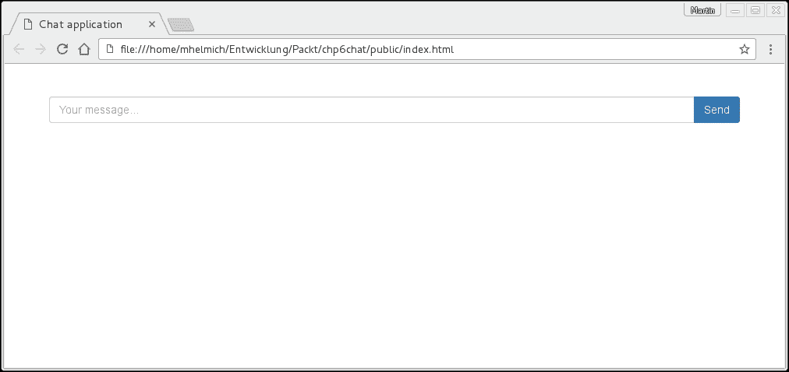
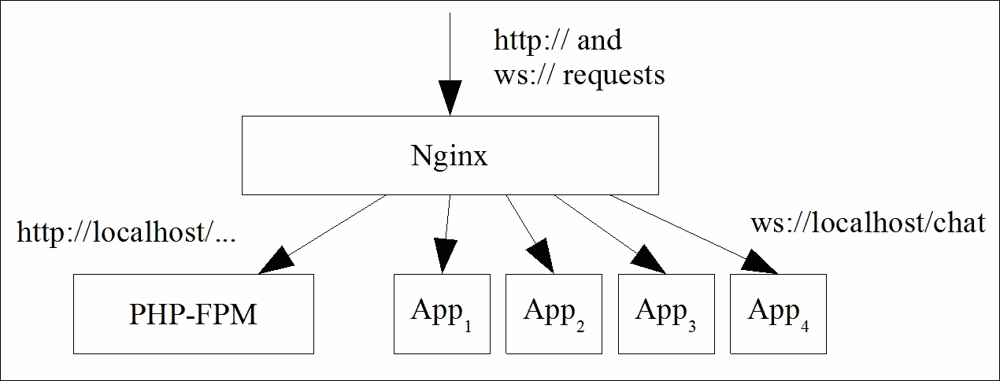
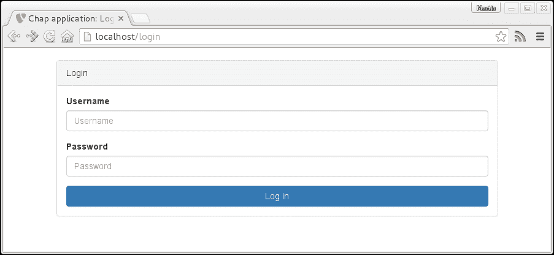

# 第六章：构建聊天应用程序

在本章中，我们将使用**WebSocket**构建一个实时聊天应用程序。您将学习如何使用**Ratchet**框架使用 PHP 构建独立的 WebSocket 和 HTTP 服务器，以及如何在 JavaScript 客户端应用程序中连接到 WebSocket 服务器。我们还将讨论如何为 WebSocket 应用程序实现身份验证以及如何在生产环境中部署它们。

# WebSocket 协议

在本章中，我们将广泛使用 WebSocket。为了充分理解我们将要构建的聊天应用程序的工作原理，让我们首先看一下 WebSocket 的工作原理。

WebSocket 协议在**RFC 6455**中指定，并使用 HTTP 作为底层传输协议。与传统的请求/响应范式相比，在该范式中，客户端向服务器发送请求，服务器然后回复响应消息，WebSocket 连接可以保持打开很长时间，服务器和客户端都可以在 WebSocket 上发送和接收消息（或*数据帧*）。

WebSocket 连接始终由客户端（通常是用户的浏览器）发起。下面的清单显示了浏览器可能发送给支持 WebSocket 的服务器的示例请求：

```php
GET /chat HTTP/1.1 
Host: localhost 
**Upgrade: websocketConnection: upgrade** 
Origin: http://localhost 
**Sec-WebSocket-Key: de7PkO6qMKuGvUA3OQNYiw==** 
**Sec-WebSocket-Protocol: chat** 
**Sec-WebSocket-Version: 13**

```

就像常规的 HTTP 请求一样，请求包含一个请求方法（`GET`）和一个路径（`/chat`）。`Upgrade`和`Connection`头告诉服务器，客户端希望将常规 HTTP 连接升级为 WebSocket 连接。

`Sec-WebSocket-Key`头包含一个随机的、base64 编码的字符串，唯一标识这个单个 WebSocket 连接。`Sec-WebSocket-Protocol`头可以用来指定客户端想要使用的子协议。子协议可以用来进一步定义服务器和客户端之间的通信应该是什么样子的，并且通常是特定于应用程序的（在我们的情况下，是`chat`协议）。

当服务器接受升级请求时，它将以`101 Switching Protocols`响应作为响应，如下面的清单所示：

```php
HTTP/1.1 101 Switching Protocols 
Upgrade: websocket 
Connection: Upgrade 
Sec-WebSocket-Accept: BKb5cchTfWayrC7SKtvK5yW413s= 
Sec-WebSocket-Protocol: chat 

```

`Sec-WebSocket-Accept`头包含了来自请求的`Sec-WebSocket-Key`的哈希值（确切的哈希值在 RFC 6455 中指定）。响应中的`Sec-WebSocket-Protocol`头确认了服务器理解客户端在请求中指定的协议。

完成这个握手之后，连接将保持打开状态，服务器和客户端都可以从套接字发送和接收消息。

# 使用 Ratchet 的第一步

在本节中，您将学习如何安装和使用 Ratchet 框架。需要注意的是，Ratchet 应用程序的工作方式与部署在 Web 服务器上并且基于每个请求工作的常规 PHP 应用程序不同。这将要求您采用一种新的思考方式来运行和部署 PHP 应用程序。

## 架构考虑

使用 PHP 实现 WebSocket 服务器并不是一件简单的事情。传统上，PHP 的架构围绕着经典的请求/响应范式：Web 服务器接收请求，将其传递给 PHP 解释器（通常内置于 Web 服务器中或由进程管理器（如 PHP-FPM）管理），解析请求并将响应返回给 Web 服务器，然后 Web 服务器再响应客户端。PHP 脚本中数据的生命周期仅限于单个请求（这一原则称为**共享无状态**）。

这对于传统的 Web 应用程序非常有效；特别是共享无状态原则，因为这是 PHP 应用程序通常很好扩展的原因之一。然而，对于 WebSocket 支持，我们需要一种不同的范式。客户端连接需要保持打开状态很长时间（可能是几个小时，甚至几天），服务器需要在连接的整个生命周期内随时对客户端消息做出反应。

实现这种新范式的一个库是我们在本章中将要使用的`Ratchet`库。与常规的 PHP 运行时不同，它们存在于 Web 服务器中，Ratchet 将启动自己的 Web 服务器，可以为长时间运行的 WebSocket 连接提供服务。由于您将处理具有极长运行时间的 PHP 进程（服务器进程可能运行数天、数周或数月），因此您需要特别注意诸如内存消耗之类的事项。

## 入门

使用**Composer**可以轻松安装 Ratchet。它需要至少版本为 5.3.9 的 PHP，并且也与 PHP 7 兼容。首先，在项目目录的命令行上使用`composer init`命令初始化一个新项目： 

```php
**$ composer init .**

```

接下来，将 Ratchet 添加为项目的依赖项：

```php
**$ composer require cboden/ratchet**

```

此外，通过向生成的`composer.json`文件添加以下部分来配置 Composer 的自动加载器：

```php
'autoload': { 
  'PSR-4': { 
    'Packt\Chp6\Example': 'src/' 
  } 
} 

```

像往常一样，PSR-4 自动加载意味着 Composer 类加载器将在项目目录的`src/`文件夹中查找`Packt\Chp6\Example`命名空间的类。一个（假设的）`Packt\Chp6\Example\Foo\Bar`类需要在`src/Foo/Bar.php`文件中定义。

由于 Ratchet 实现了自己的 Web 服务器，您将不需要专用的 Web 服务器，如**Apache**或**Nginx**（目前）。首先创建一个名为`server.php`的文件，在其中初始化和运行 Ratchet Web 服务器：

```php
$app = new \Ratchet\App('localhost', 8080, '0.0.0.0'); 
$app->run() 

```

然后，您可以启动您的 Web 服务器（它将侦听您在`Ratchet\App`构造函数的第二个参数中指定的端口）使用以下命令：

```php
**$ php server.php**

```

如果您的计算机上没有准备好 PHP 7 安装，您可以使用以下命令快速开始使用**Docker**：

```php
**$ docker run --rm -v $PWD:/opt/app -p 8080:8080 php:7 php /opt/app/server.php**

```

这两个命令都将启动一个长时间运行的 PHP 进程，可以直接在命令行上处理 HTTP 请求。在后面的部分中，您将学习如何将应用程序部署到生产服务器上。当然，这个服务器实际上并没有做太多事情。但是，您仍然可以使用 CLI 命令或浏览器进行测试，如下面的屏幕截图所示：


使用 HTTPie 测试示例应用程序

让我们继续向我们的服务器添加一些业务逻辑。由 Ratchet 提供服务的 WebSocket 应用程序需要是实现`Ratchet\MessageComponentInterface`的 PHP 类。此接口定义了以下四种方法：

+   `onOpen(\Ratchet\ConnectionInterface $c)`将在新客户端连接到 WebSocket 服务器时调用

+   `onClose(\Ratchet\ConnectionInterface $c)`将在客户端从服务器断开连接时调用

+   `onMessage(\Ratchet\ConnectionInterface $sender, $msg)`将在客户端向服务器发送消息时调用

+   `onError(\Ratchet\ConnectionInterface $c, \Exception $e)`将在处理消息时发生异常时调用

让我们从一个简单的例子开始：一个 WebSocket 服务，客户端可以向其发送消息，它将以相同的消息但是反向的方式回复给同一个客户端。让我们称这个类为`Packt\Chp6\Example\ReverseEchoComponent`；代码如下：

```php
namespace Packt\Chp6\Example; 

use Ratchet\ConnectionInterface; 
use Ratchet\MessageComponentInterface; 

class ReverseEchoComponent implements MessageComponentInterface 
{ 
    public function onOpen(ConnectionInterface $conn) 
    {} 

    public function onClose(ConnectionInterface $conn) 
    {} 

    public function onMessage(ConnectionInterface $sender, $msg) 
    {} 

    public function onError(ConnectionInterface $conn, 
                            Exception $e) 
    {} 
} 

```

请注意，尽管我们不需要`MessageComponentInterface`指定的所有方法，但我们仍然需要实现所有这些方法，以满足接口。例如，如果在客户端连接或断开连接时不需要发生任何特殊的事情，则实现`onOpen`和`onClose`方法，但只需将它们留空即可。

为了更好地理解此应用程序中发生的情况，请向`onOpen`和`onClose`方法添加一些简单的调试消息，如下所示：

```php
public function onOpen(ConnectionInterface $conn) 
{ 
    echo "new connection from " . $conn->remoteAddress . "\n"; 
} 

public function onClose(ConnectionInterface $conn) 
{ 
    echo "connection closed by " . $conn->remoteAddress . "\n"; 
} 

```

接下来，实现`onMessage`方法。`$msg`参数将包含客户端发送的消息作为字符串，并且您可以使用`ConnectionInterface`类的`send()`方法将消息发送回客户端，如下面的代码片段所示：

```php
public function onMessage(ConnectionInterface $sender, $msg) 
{ 
    echo "received message '$msg' from {$conn->remoteAddress}\n"; 
    $response = strrev($msg); 
    $sender->send($response); 
} 

```

### 提示

您可能倾向于使用 PHP 7 的新类型提示功能来提示`$msg`参数为`string`。在这种情况下，这是行不通的，因为它会改变由`Ratchet\MessageComponentInterface`规定的方法接口，并导致致命错误。

然后，您可以使用以下代码在`server.php`文件中将您的 WebSocket 应用程序注册到`Ratchet\App`实例中：

```php
$app = new \Ratchet\App('localhost', 8080, '0.0.0.0'); 
**$app->route('/reverse', new Packt\Chp6\Example\ReverseEchoComponent);** 
$app->run(); 

```

## 测试 WebSocket 应用程序

为了测试 WebSocket 应用程序，我可以推荐**wscat**工具。它是一个用 JavaScript 编写的命令行工具（因此需要在您的计算机上运行 Node.js），可以使用`npm`进行安装，如下所示：

```php
**$ npm install -g wscat**

```

使用 WebSocket 服务器监听端口`8080`，您可以使用以下 CLI 命令使用`wscat`打开新的 WebSocket 连接：

```php
**$ wscat -o localhost --connect localhost:8080/reverse**

```

这将打开一个命令行提示符，您可以在其中输入要发送到 WebSocket 服务器的消息。还将显示从服务器接收到的消息。请参见以下屏幕截图，了解 WebSocket 服务器和 wscat 的示例输出：


使用 wscat 测试 WebSocket 应用程序

## 玩转事件循环

在前面的示例中，您只在收到来自同一客户端的消息后才向客户端发送消息。这是在大多数情况下都能很好地工作的传统请求/回复通信模式。但是，重要的是要理解，当使用 WebSocket 时，您并不被强制遵循这种模式，而是可以随时向连接的客户端发送消息。

为了更好地了解您在 Ratchet 应用程序中拥有的可能性，让我们来看看 Ratchet 的架构。Ratchet 是建立在 ReactPHP 之上的；一个用于网络应用程序的事件驱动框架。React 应用程序的核心组件是**事件循环**。应用程序中触发的每个事件（例如，当新用户连接或向服务器发送消息时）都存储在队列中，事件循环处理存储在此队列中的所有事件。

ReactPHP 提供了不同的事件循环实现。其中一些需要安装额外的 PHP 扩展，如`libevent`或`ev`（通常，基于`libevent`、`ev`或类似扩展的事件循环提供最佳性能）。通常，像 Ratchet 这样的应用程序会自动选择要使用的事件循环实现，因此如果您不想要关心 ReactPHP 的内部工作，通常不需要担心。

默认情况下，Ratchet 应用程序会创建自己的事件循环；但是，您也可以将自己创建的事件循环注入到`Ratchet\App`类中。

所有 ReactPHP 事件循环都必须实现接口`React\EventLoop\LoopInterface`。您可以使用类`React\EventLoop\Factory`自动创建一个在您的环境中受支持的此接口的实现：

```php
$loop = \React\EventLoop\Factory::create(); 

```

然后，您可以将这个`$loop`变量传递到您的 Ratchet 应用程序中：

```php
$app = new \Ratchet\App('localhost', 8080, '0.0.0.0', $loop) 
$app->run(); 

```

直接访问事件循环允许您实现一些有趣的功能。例如，您可以使用事件循环的`addPeriodicTimer`函数注册一个回调，该回调将在周期性间隔内由事件循环执行。让我们在一个简短的示例中使用这个特性，通过构建一个名为`Packt\Chp6\Example\PingComponent`的新 WebSocket 组件：

```php
namespace Packt\Chp6\Example; 

use Ratchet\MessageComponentInterface; 
use React\EventLoop\LoopInterface; 

class PingCompoment extends MessageComponentInterface 
{ 
    private $loop; 
    private $users; 

    public function __construct(LoopInterface $loop) 
    { 
        $this->loop  = $loop; 
        $this->users = new \SplObjectStorage(); 
    } 

    // ... 
} 

```

在这个例子中，`$users`属性将帮助我们跟踪连接的用户。每当新客户端连接时，我们可以使用`onOpen`事件将连接存储在`$users`属性中，并使用`onClose`事件来移除连接：

```php
public function onOpen(ConnectionInterface $conn) 
{ 
 **$this->users->attach($conn);** 
} 

public function onClose(ConnectionInterface $conn) 
{ 
 **$this->users->detach($conn);** 
} 

```

由于我们的 WebSocket 组件现在知道了连接的用户，我们可以使用事件循环来注册一个定时器，定期向所有连接的用户广播消息。这可以很容易地在构造函数中完成：

```php
public function __construct(LoopInterface $loop) 
{ 
    $this->loop  = $loop; 
    $this->users = new \SplObjectStorage(); 

 **$i = 0;** 
 **$this->loop->addPeriodicTimer(5, function() use (&$i) {** 
 **foreach ($this->users as $user) {** 
 **$user->send('Ping ' . $i);** 
 **}** 
 **$i ++;** 
 **});** 
} 

```

传递给 `addPeriodicTimer` 的函数将每五秒钟被调用一次，并向每个连接的用户发送一个带有递增计数器的消息。修改您的 `server.php` 文件，将这个新组件添加到您的 Ratchet 应用程序中：

```php
$loop = \React\EventLoop\Factory::create(); 
$app = new \Ratchet\App('localhost', 8080, '0.0.0.0', $loop) 
**$app->route('/ping', new PingCompoment($loop));** 
$app->run(); 

```

您可以再次使用 wscat 测试这个 WebSocket 处理程序，如下截图所示：


定期事件循环计时器发送的周期性消息

这是一个很好的例子，说明了 WebSocket 客户端在没有明确请求的情况下从服务器接收更新。这提供了有效的方式，以几乎实时地向连接的客户端推送新数据，而无需重复轮询信息。

# 实现聊天应用程序

在这个关于使用 WebSocket 进行开发的简短介绍之后，让我们现在开始实现实际的聊天应用程序。聊天应用程序将由使用 Ratchet 构建的 PHP 服务器端应用程序和在用户浏览器中运行的基于 HTML 和 JavaScript 的客户端组成。

## 启动项目服务器端

如前一节所述，基于 ReactPHP 的应用程序在与事件循环扩展（如 `libevent` 或 `ev`）一起使用时将获得最佳性能。不幸的是，`libevent` 扩展与 PHP 7 不兼容。幸运的是，ReactPHP 也可以与 `ev` 扩展一起使用，其最新版本已经支持 PHP 7。就像在上一章中一样，我们将使用 Docker 来创建一个干净的软件堆栈。首先为您的应用程序容器创建一个 *Dockerfile*：

```php
FROM php:7 
RUN pecl install ev-beta && \ 
    docker-php-ext-enable ev 
WORKDIR /opt/app 
CMD ["/usr/local/bin/php", "server.php"] 

```

然后，您将能够从该文件构建一个镜像，并使用以下 CLI 命令从项目目录内启动容器：

```php
**$ docker build -t packt-chp6**
**$ docker run -d --name chat-app -v $PWD:/opt/app -p 8080:8080 
      packt-chp6**

```

请注意，只要您的项目目录中没有 `server.php` 文件，这个命令实际上是不会起作用的。

就像在前面的示例中一样，我们也将使用 Composer 进行依赖管理和自动加载。为您的项目创建一个新的文件夹，并创建一个 `composer.json` 文件，其中包含以下内容：

```php
{ 
    "name": "packt-php7/chp6-chat", 
    "type": "project", 
    "authors": [{ 
        "name": "Martin Helmich", 
        "email": "php7-book@martin-helmich.de" 
    }], 
    "require": { 
        "php": ">= 7.0.0", 
        "cboden/ratchet": "⁰.3.4" 
    }, 
    "autoload": { 
        "psr-4": { 
            "Packt\\Chp6": "src/" 
        } 
    } 
} 

```

通过在项目目录中运行 `composer install` 安装所有必需的软件包，并创建一个临时的 `server.php` 文件，其中包含以下内容：

```php
<?php 
require_once 'vendor/autoload.php'; 

$app = new \Ratchet\App('localhost', 8080, '0.0.0.0'); 
$app->run(); 

```

您已经在介绍示例中使用了 `Ratchet\App` 构造函数。关于这个类的构造函数参数有几点需要注意：

+   第一个参数 `$httpHost` 是您的应用程序将可用的 HTTP 主机名。这个值将被用作允许的来源主机。这意味着当您的服务器监听 `localhost` 时，只有在 `localhost` 域上运行的 JavaScript 才能连接到您的 WebSocket 服务器。

+   `$port` 参数指定了您的 WebSocket 服务器将监听的端口。端口 `8080` 现在足够了；在后面的部分，您将学习如何安全地配置您的应用程序以在 HTTP 标准端口 `80` 上可用。

+   `$address` 参数描述了 WebSocket 服务器将监听的 IP 地址。这个参数的默认值是 `'127.0.0.1'`，这将允许在同一台机器上运行的客户端连接到您的 WebSocket 服务器。当您在 Docker 容器中运行应用程序时，这是行不通的。字符串 `'0.0.0.0'` 将指示应用程序监听所有可用的 IP 地址。

+   第四个参数 `$loop` 允许您将自定义事件循环注入 Ratchet 应用程序。如果不传递此参数，Ratchet 将构造自己的事件循环。

您现在应该能够使用以下命令启动您的应用程序容器：

```php
**$ docker run --rm -v $PWD:/opt/app -p 8080:8080 packt-chp6**

```

### 提示

由于您的应用程序现在是一个单一的、长时间运行的 PHP 进程，对 PHP 代码库的更改在重新启动服务器之前不会生效。请记住，当您对应用程序的 PHP 代码进行更改时，使用 *Ctrl* + *C* 停止服务器，并使用相同的命令重新启动服务器（或使用 `docker restart chat-app` 命令）。

## 引导 HTML 用户界面

我们的聊天应用程序的用户界面将基于 HTML、CSS 和 JavaScript。为了管理前端依赖关系，在本例中我们将使用**Bower**。您可以使用以下命令（作为 root 用户或使用`sudo`）安装 Bower：

```php
**$ npm install -g bower**

```

继续创建一个新的`public/`目录，您可以在其中放置所有前端文件。在该目录中，放置一个带有以下内容的`bower.json`文件：

```php
{ 
    "name": "packt-php7/chp6-chat", 
    "authors": [ 
        "Martin Helmich <php7-book@martin-helmich.de>" 
    ], 
    "private": true, 
    "dependencies": { 
        "bootstrap": "~3.3.6" 
    } 
} 

```

创建`bower.json`文件后，您可以使用以下命令安装声明的依赖项（在本例中是**Twitter Bootstrap**框架）：

```php
**$ bower install**

```

这将下载 Bootstrap 框架及其所有依赖项（实际上只有 jQuery 库）到`bower_components/`目录中，然后您将能够在稍后的 HTML 前端文件中包含它们。

还有一个有用的方法是运行一个能够提供 HTML 前端文件的 Web 服务器。当您的 WebSocket 应用程序受限于`localhost`来源时，这一点尤为重要，它将只允许来自`localhost`域的 JavaScript 的请求（这不包括在浏览器中打开的本地文件）。一个快速简单的方法是使用`nginx` Docker 镜像。确保从`public/`目录中运行以下命令：

```php
**$ docker run -d --name chat-web -v $PWD:/var/www -p 80:80 nginx**

```

之后，您将能够在浏览器中打开`http://localhost`并查看来自`public/`目录的静态文件。如果您在该目录中放置一个空的`index.html`，Nginx 将使用该页面作为索引页面，无需显式请求其路径（这意味着`http://localhost`将向用户提供文件`index.html`的内容）。

## 构建一个简单的聊天应用程序

现在您可以开始实现实际的聊天应用程序。如前面的示例所示，您需要为此实现`Ratchet\MessageComponentInterface`。首先创建一个`Packt\Chp6\Chat\ChatComponent`类，并实现接口所需的所有方法：

```php
namespace Packt\Chp6\Chat; 

use Ratchet\MessageComponentInterface; 
use Ratchet\ConnectionInterface; 

class ChatComponent implements MessageComponentInterface 
{ 
    public function onOpen(ConnectionInterface $conn) {} 
    public function onClose(ConnectionInterface $conn) {} 
    public function onMessage(ConnectionInterface $from, $msg) {} 
    public function onError(ConnectionInterface $conn, \Exception $err) {} 
} 

```

聊天应用程序需要做的第一件事是跟踪连接的用户。为此，您需要维护所有打开连接的集合，在新用户连接时添加新连接，并在用户断开连接时将其移除。为此，在构造函数中初始化`SplObjectStorage`类的一个实例：

```php
**private $users;** 

public function __construct() 
{ 
 **$this->users = new \SplObjectStorage();** 
} 

```

然后在`onOpen`事件中将新连接附加到此存储中，并在`onClose`事件中将其移除：

```php
public function onOpen(ConnectionInterface $conn) 
{ 
 **echo "user {$conn->remoteAddress} connected.\n";** 
 **$this->users->attach($conn);** 
} 

public function onClose(ConnectionInterface $conn) 
{ 
 **echo "user {$conn->remoteAddress} disconnected.\n";** 
 **$this->users->detach($conn);**} 

```

现在每个连接的用户都可以向服务器发送消息。对于每条接收到的消息，组件的`onMessage`方法将被调用。为了实现一个真正的聊天应用程序，每条接收到的消息都需要被传递给其他用户，方便的是，您已经有了一个包含所有连接用户的`$this->users`集合，可以向他们发送接收到的消息：

```php
public function onMessage(ConnectionInterface $from, $msg) 
{ 
 **echo "received message '$msg' from user {$from->remoteAddress}\n";**
 **foreach($this->users as $user) {** 
 **if ($user != $from) {** 
 **$user->send($msg);** 
 **}** 
 **}**} 

```

然后在您的`server.php`文件中注册您的聊天组件：

```php
$app = new \Ratchet\App('localhost', 8080, '0.0.0.0'); 
**$app->route('/chat', new \Packt\Chp6\Chat\ChatComponent);** 
$app->run(); 

```

重新启动应用程序后，通过在两个单独的终端中使用 wscat 打开两个 WebSocket 连接来测试聊天功能。您在一个连接中发送的每条消息都应该在另一个连接中弹出。


使用两个 wscat 连接测试简陋的聊天应用程序

现在您已经有一个（诚然，仍然很简陋的）聊天服务器在运行，我们可以开始为聊天应用程序构建 HTML 前端。首先，一个静态的 HTML 文件对此来说完全足够了。首先在`public/`目录中创建一个空的`index.html`文件：

```php
<!DOCTYPE html>
<html> 
  <head> 
    <title>Chat application</title> 
 **<script src="bower_components/jquery/dist/jquery.min.js"></script>** 
 **<script src="bower_components/bootstrap/dist/js/bootstrap.min.js"></script>**
 **<link rel="stylesheet" href="bower_components/bootstrap/dist/css/bootstrap.min.css"/>** 
  </head> 
  <body> 
  </body> 
</html> 

```

在这个文件中，我们已经包含了我们将在本例中使用的前端库；Bootstrap 框架（一个 JavaScript 和一个 CSS 文件）和 jQuery 库（另一个 JavaScript 文件）。

由于你将为这个应用程序编写大量的 JavaScript 代码，因此在 HTML 页面的`<head>`部分中添加另一个`js/app.js`文件实例也是很有用的：

```php
<head> 
  <title>Chat application</title> 
  <script src="bower_components/jquery/dist/jquery.min.js"></script> 
  <script src="bower_components/bootstrap/dist/js/bootstrap.min.js"></script> 
 **<script src="js/app.js"></script>** 
  <link rel="stylesheet" href="bower_components/bootstrap/dist/css/bootstrap.min.css"/> 
</head> 

```

然后，你可以在`index.html`文件的`<body>`部分构建一个极简的聊天窗口。你只需要一个用于编写消息的输入字段，一个用于发送消息的按钮，以及一个用于显示其他用户消息的区域：

```php
<div class="container"> 
  <div class="row"> 
    <div class="col-md-12"> 
      <div class="input-group"> 
        <input class="form-control" type="text" id="message"  placeholder="Your message..." /> 
        <span class="input-group-btn"> 
          <button id="submit" class="btn btn-primary">Send</button> 
        </span> 
      </div> 
    </div> 
  </div> 
  <div class="row"> 
    <div id="messages"></div> 
  </div> 
</div> 

```

HTML 文件中包含一个输入字段（`id="message"`），用户可以在其中输入新的聊天消息，一个按钮（`id="submit"`）用于提交消息，以及一个（目前还是空的）部分（`id="messages"`），用于显示从其他用户接收到的消息。以下截图显示了这个页面在浏览器中的显示方式：



当然，所有这些都不会有任何作用，如果没有适当的 JavaScript 来实际使聊天工作。在 JavaScript 中，你可以使用`WebSocket`类打开一个 WebSocket 连接。

### 注意

**关于浏览器支持** WebSockets 在所有现代浏览器中都得到支持，而且已经有一段时间了。你可能会遇到需要支持较旧的 Internet Explorer 版本（9 及以下）的问题，这些版本不支持 WebSockets。在这种情况下，你可以使用`web-socket-js`库，它在内部使用 Flash 作为回退，而 Ratchet 也很好地支持 Flash。

在这个例子中，我们将把所有的 JavaScript 代码放在`public/`目录下的`js/app.js`文件中。你可以通过用 WebSocket 服务器的 URL 作为第一个参数来实例化`WebSocket`类来打开一个新的 WebSocket 连接：

```php
var connection = new WebSocket('ws://localhost:8080/chat'); 

```

就像服务器端组件一样，客户端 WebSocket 也提供了几个你可以监听的事件。方便的是，这些事件的名称与 Ratchet 使用的方法类似，`onopen`，`onclose`和`onmessage`，你都可以（也应该）在自己的代码中实现：

```php
connection.onopen = function() { 
    console.log('connection established'); 
} 

connection.onclose = function() { 
    console.log('connection closed'); 
} 

connection.onmessage = function(event) { 
    console.log('message received: ' + event.data); 
} 

```

## 接收消息

每个客户端连接在 Ratchet 服务器应用程序中都会有一个对应的`ConnectionInterface`实例。当你在服务器上调用连接的`send()`方法时，这将触发客户端的`onmessage`事件。

每次收到新消息时，这条消息应该显示在聊天窗口中。为此，你可以实现一个新的 JavaScript 方法`appendMessage`，它将在之前创建的消息容器中显示新消息：

```php
var appendMessage = function(message, sentByMe) { 
    var text = sentByMe ? 'Sent at' : 'Received at'; 
     var html = $('<div class="msg">' + text + ' <span class="date"></span>: <span 
    class="text"></span></div>'); 

    html.find('.date').text(new Date().toLocaleTimeString()); 
    html.find('.text').text(message); 

    $('#messages').prepend(html); 
} 

```

在这个例子中，我们使用了一个简单的 jQuery 构造来创建一个新的 HTML 元素，并用当前的日期和时间以及实际接收到的消息文本填充它。请注意，单个消息目前只包含原始消息文本，还不包含任何形式的元数据，比如作者或其他信息。我们稍后会解决这个问题。

### 提示

在这种情况下，使用 jQuery 创建 HTML 元素已经足够了，但在实际情况下，你可能会考虑使用专门的模板引擎，比如**Mustache**或**Handlebars**。由于这不是一本 JavaScript 书，我们将在这里坚持基础知识。

当收到消息时，你可以调用`appendMessage`方法：

```php
connection.onmessage = function(event) { 
    console.log('message received: ' + event.data); 
 **appendMessage(event.data, false);** 
} 

```

事件的数据属性包含整个接收到的消息作为一个字符串，你可以根据需要使用它。目前，我们的聊天应用程序只能处理纯文本聊天消息；每当你需要传输更多或结构化的数据时，使用 JSON 编码可能是一个不错的选择。

## 发送消息

要发送消息，你可以（不出所料地）使用连接的`send()`方法。由于你已经在 HTML 文件中有了相应的用户输入字段，现在只需要更多的 jQuery 就可以让我们的聊天的第一个版本运行起来：

```php
$(document).ready(function() { 
    $('#submit').click(function() { 
        var message = $('#message').val(); 

        if (message) { 
            console.log('sending message: "' + message + '"'); 
            connection.send(message); 

            appendMessage(message, true); 
        } 
    }); 
}); 

```

一旦 HTML 页面完全加载，我们就开始监听提交按钮的`click`事件。当按钮被点击时，输入字段中的消息将使用连接的`send()`方法发送到服务器。每次发送消息时，Ratchet 都会调用服务器端组件的`onMessage`事件，允许服务器对该消息做出反应并将其分发给其他连接的用户。

通常，用户希望在聊天窗口中看到他们自己发送的消息。这就是为什么我们调用之前实现的`appendMessage`，它将把发送的消息插入到消息容器中，就好像它是从远程用户接收的一样。

## 测试应用程序

当两个容器（Web 服务器和 WebSocket 应用程序）都在运行时，您现在可以通过在浏览器中打开 URL `http://localhost` 来测试您的聊天的第一个版本（最好是在两个不同的窗口中打开页面，这样您实际上可以使用应用程序与自己聊天）。

以下截图显示了测试应用程序时应该获得的结果示例：


使用两个浏览器窗口测试聊天应用程序的第一个版本

## 防止连接超时

当您将测试站点保持打开超过几分钟时，您可能会注意到最终 WebSocket 连接将被关闭。这是因为大多数浏览器在一定时间内没有发送或接收消息时（通常为五分钟）会关闭 WebSocket 连接。由于您正在处理长时间运行的连接，您还需要考虑连接问题-如果您的用户之一使用移动连接并在使用您的应用程序时暂时断开连接会怎么样？

最简单的缓解方法是实现一个简单的重新连接机制-每当连接关闭时，等待几秒然后再次尝试。为此，您可以在`onclose`事件中启动一个超时，在其中打开一个新连接：

```php
connection.onclose = function(event) { 
    console.error(e); 
    setTimeout(function() { 
        connection = new WebSocket('ws://localhost:8080/chat'); 
    }, 5000); 
} 

```

这样，每当连接关闭时（由于超时、网络连接问题或任何其他原因）；应用程序将在五秒的宽限时间后尝试重新建立连接。

如果您希望主动防止断开连接，您还可以定期通过连接发送消息以保持连接活动。这可以通过注册一个间隔函数来完成，该函数定期（在超时时间内的间隔内）向服务器发送消息：

```php
**var interval;** 

connection.onopen = function() { 
    console.log('connection established'); 
 **interval = setInterval(function() {** 
 **connection.send('ping');** 
 **}, 120000);** 
} 

connection.onclose = function() { 
    console.error(e); 
 **clearInterval(interval);** 
    setTimeout(function() { 
        connection = new WebSocket('ws://localhost:8080/chat'); 
    }, 5000); 
} 

```

这里有一些需要考虑的注意事项：首先，您应该在连接实际建立之后才开始发送保持活动的消息（这就是为什么我们在`onopen`事件中注册间隔），并且当连接关闭时也应该停止发送保持活动的消息（例如，当网络不可用时仍然可能发生），这就是为什么间隔需要在`onclose`事件中清除。

此外，您可能不希望保持活动的消息广播到其他连接的客户端；这意味着这些消息在服务器端组件中也需要特殊处理：

```php
public function onMessage(ConnectionInterface $from, $msg) 
{ 
 **if ($msg == 'ping') {** 
 **return;** 
 **}** 

    echo "received message '$msg' from user {$from->remoteAddress}\n"; 
    foreach($this->users as $user) { 
        if ($user != $from) { 
            $user->send($msg); 
        } 
    } 
} 

```

# 部署选项

正如您已经注意到的，Ratchet 应用程序不像您典型的 PHP 应用程序那样部署，而是实际上运行自己的 HTTP 服务器，可以直接响应 HTTP 请求。此外，大多数应用程序不仅仅会提供 WebSocket 连接，还需要处理常规的 HTTP 请求。

### 提示

本节旨在为您概述如何在生产环境中部署 Ratchet 应用程序。在本章的其余部分，为了简单起见，我们将继续使用基于 Docker 的开发设置（不使用负载平衡和花哨的进程管理器）。

这将带来一整套新问题需要解决。其中之一是可伸缩性：默认情况下，PHP 是单线程运行的，因此即使使用`libev`提供的异步事件循环，您的应用程序也永远无法扩展到多个 CPU。虽然您可以考虑使用`pthreads`扩展在 PHP 中启用线程（并进入一个全新的痛苦世界），但通常更容易的方法是简单地多次启动 Ratchet 应用程序，让它们侦听不同的端口，并使用 Nginx 等负载均衡器将 HTTP 请求和 WebSocket 连接分发给它们。

对于处理常规（非 WebSocket）HTTP 请求，您仍然可以使用常规的 PHP 进程管理器，如 PHP-FPM 或 Apache 的 PHP 模块。然后，您可以配置 Nginx 将这些常规请求分派给 FPM，将所有 WebSocket 请求分派给您运行的 Ratchet 应用程序之一。



使用 Nginx 负载均衡器部署和负载平衡 Ratchet 应用程序

为了实现这一点，您首先需要使应用程序侦听的端口可以为每个运行的进程单独配置。由于应用程序是通过命令行启动的，使端口可配置的最简单方法是使用命令行参数。您可以使用`getopt`函数轻松解析命令行参数。在此过程中，您还可以使侦听地址可配置。将以下代码插入到您的`server.php`文件中：

```php
**$options = getopt('l:p:', ['listen:', 'port:']);** 
**$port = $options['port'] ?? $options['p'] ?? 8080;** 
**$addr = $options['listen'] ?? $options['l'] ?? '127.0.0.1';** 

$app = new \Ratchet\App('localhost', $port, $addr); 
$app->route('/chat', new \Packt\Chp6\Chat\ChatComponent); 
$app->run(); 

```

接下来，您需要确保您的服务器实际上自动启动了足够数量的进程。在 Linux 环境中，**Supervisor**工具通常是一个不错的选择。在 Ubuntu 或 Debian Linux 系统上，您可以使用以下命令从系统的软件包存储库安装它：

```php
**$ apt-get install supervisor**

```

然后，在`/etc/supervisor/conf.d/`中放置一个配置文件，内容如下：

```php
[program:chat] 
numprocs=4 
command=php /path/to/application -port=80%(process_num)02d 
process_name=%(program_name)s-%(process_num)02d 
autostart=true 
autorestart=unexpected 

```

这将配置 Supervisor 在系统启动时启动四个聊天应用程序的实例。它们将侦听端口`8000`到`8003`，并在它们意外终止时由 Supervisor 自动重新启动-请记住：在 FPM 管理的环境中，PHP 致命错误可能相对无害，但在独立的 PHP 进程中，一个致命错误将使您的整个应用程序对所有用户不可用，直到有人重新启动该进程。因此，最好有一个像 Supervisor 这样的服务，可以自动重新启动崩溃的进程。

接下来，安装一个 Nginx web 服务器，用作四个运行的聊天应用程序的负载均衡器。在 Ubuntu 或 Debian 上，安装 Nginx 如下：

```php
**$ apt-get install nginx**

```

安装 Nginx 后，在目录`/etc/nginx/sites-enabled/`中放置一个名为`chat.conf`的配置文件，内容如下：

```php
upstream chat { 
    server localhost:8000; 
    server localhost:8001; 
    server localhost:8002; 
    server localhost:8003; 
} 
server { 
    listen 80; 
    server_name chat.example.com; 

    location /chat/ { 
        proxy_pass http://chat; 
        proxy_http_version 1.1; 
        proxy_set_header Upgrade $http_upgrade; 
        proxy_set_header Connection "upgrade"; 
    } 

    // Additional PHP-FPM configuration here 
    // ... 
} 

```

这个配置将配置所有四个应用程序进程作为 Nginx 负载均衡器的*上游*服务器。所有以`/chat/`路径开头的 HTTP 请求将被转发到服务器上运行的 Ratchet 应用程序之一。`proxy_http_version`和`proxy_set_header`指令是必要的，以便 Nginx 能够正确地在服务器和客户端之间转发 WebSocket 握手。

# 连接 Ratchet 和 PSR-7 应用程序

迟早，您的聊天应用程序还需要响应常规的 HTTP 请求（例如，一旦您想要添加具有登录表单和身份验证处理的身份验证层，这将变得必要）。

如前一节所述，PHP 中 WebSocket 应用程序的常见设置是让 Ratchet 应用程序处理所有 WebSocket 连接，并将所有常规 HTTP 请求定向到常规的 PHP-FPM 设置。但是，由于 Ratchet 应用程序实际上也包含自己的 HTTP 服务器，因此您也可以直接从 Ratchet 应用程序响应常规 HTTP 请求。

就像您使用`Ratchet\MessageComponentInterface`来实现 WebSocket 应用程序一样，您可以使用`Ratchet\HttpServerInterface`来实现常规 HTTP 服务器。例如，考虑以下类：

```php
namespace Packt\Chp6\Http; 

use Guzzle\Http\Message\RequestInterface; 
use Ratchet\ConnectionInterface; 
use Ratchet\HttpServerInterface; 

class HelloWorldServer implements HttpServerInterface 
{ 
    public function onOpen(ConnectionInterface $conn, RequestInterface $request = null) 
    {} 

    public function onClose(ConnectionInterface $conn) 
    {} 

    public function onError(ConnectionInterface $conn, \Exception $e) 
    {} 

    public function onMessage(ConnectionInterface $from, $msg) 
    {} 
} 

```

如您所见，`HttpServerInterface`定义的方法与`MessageCompomentInterface`类似。唯一的区别是现在还将`$request`参数传递到`onOpen`方法中。这个类是`Guzzle\Http\Message\RequestInterface`的一个实例（不幸的是，它不实现 PSR-7 `RequestInterface`），您可以从中获取基本的 HTTP 请求属性。

现在，您可以使用`onOpen`方法来对收到的 HTTP 请求发送常规 HTTP 响应：

```php
public function onOpen(ConnectionInterface $conn, RequestInterface $request = null) 
{ 
   $conn->send("HTTP/1.1 200 OK\r\n");
    $conn->send("Content-Type: text/plain\r\n"); 
    $conn->send("Content-Length: 13\r\n"); 
    $conn->send("\r\n"); 
    $conn->send("Hello World\n"); 
    $conn->close(); 
} 

```

如您所见，您需要在`onOpen`方法中发送整个 HTTP 响应（包括响应标头！）。这有点繁琐，但稍后我们会找到更好的方法，但目前这样就足够了。

接下来，在`server.php`中注册您的 HTTP 服务器，方式与注册新的 WebSocket 服务器相同：

```php
$app = new \Ratchet\App('localhost', $port, $addr); 
$app->route('/chat', new \Packt\Chp6\Chat\ChatComponent); 
**$app->route('/hello', new \Packt\Chp6\Http\HelloWorldServer, ['*']);** 
$app->run(); 

```

特别注意这里的第三个参数`['*']`：此参数将允许此路由的任何请求来源（不仅仅是`localhost`），因为大多数浏览器和命令行客户端甚至不会为常规 HTTP 请求发送来源标头。

重新启动应用程序后，您可以使用任何常规 HTTP 客户端（无论是命令行还是浏览器）测试新的 HTTP 路由。如下面的截图所示：


使用 cURL 测试 Ratchet HTTP 服务器

手动构建包括标头的 HTTP 响应是一项非常繁琐的任务-特别是如果在某个时刻，您的应用程序包含多个 HTTP 端点。因此，最好有一个框架来为您处理所有这些事情。

在上一章中，您已经使用了**Slim**框架，您也可以将其与 Ratchet 很好地集成。不幸的是，Ratchet 目前还不符合 PSR-7，因此您需要做一些工作来将 Ratchet 的请求接口转换为 PSR-7 实例，并将 PSR-7 响应返回到`ConnectionInterface`。

首先使用 Composer 将 Slim 框架安装到您的应用程序中：

```php
**$ composer require slim/slim**

```

本节的其余部分的目标是构建`HttpServerInterface`的新实现，该实现将 Slim 应用程序作为依赖项，并将所有传入的请求转发到 Slim 应用程序。

首先定义实现`HttpServerInterface`并接受`Slim\App`作为依赖项的`Packt\Chp6\Http\SlimAdapterServer`类：

```php
namespace Packt\Chp6\Http; 

use Guzzle\Http\Message\RequestInterface; 
use Ratchet\ConnectionInterface; 
use Ratchet\HttpServerInterface; 
use Slim\App; 

class SlimAdapterServer implements HttpServerInterface 
{ 
    private $app; 

    public function __construct(App $app) 
    { 
        $this->app = $app; 
    } 

    // onOpen, onClose, onError and onMessage omitted 
    // ... 
} 

```

您需要做的第一件事是将 Ratchet 传递到`onOpen`事件的`$request`参数映射到 PSR-7 请求对象（然后将其传递到 Slim 应用程序进行处理）。Slim 框架提供了其自己的实现：`Slim\Http\Request`类。首先将以下代码添加到您的`onOpen`方法中，将请求 URI 映射到`Slim\Http\Uri`类的实例：

```php
$guzzleUri = $request->getUrl(true); 
$slimUri = new \Slim\Http\Uri( 
    $guzzleUri->getScheme() ?? 'http', 
    $guzzleUri->getHost() ?? 'localhost', 
    $guzzleUri->getPort(), 
    $guzzleUri->getPath(), 
    $guzzleUri->getQuery() . '', 
    $guzzleUri->getFragment(), 
    $guzzleUri->getUsername(), 
    $guzzleUri->getPassword() 
); 

```

这将在 Slim URI 对象中映射 Guzzle 请求的 URI 对象。它们在很大程度上是兼容的，允许您将大多数属性简单地复制到`Slim\Http\Uri`类的构造函数中。只有`$guzzleUri->getQuery()`返回值需要通过与空字符串连接来强制转换为字符串。

继续构建 HTTP 请求标头对象：

```php
$headerValues = []; 
foreach ($request->getHeaders() as $name => $header) { 
    $headerValues[$name] = $header->toArray(); 
} 
$slimHeaders = new \Slim\Http\Headers($headerValues); 

```

构建请求 URI 和标头后，您可以创建`SlimRequest`类的实例：

```php
$slimRequest = new \Slim\Http\Request( 
    $request->getMethod(), 
    $slimUri, 
    $slimHeaders, 
    $request->getCookies(), 
    [], 
    new \Slim\Http\Stream($request->getBody()->getStream()); 
); 

```

然后，您可以使用此请求对象来调用作为依赖项传递给`SlimAdapterServer`类的 Slim 应用程序：

```php
$slimResponse = new \Slim\Http\Response(200); 
$slimResponse = $this->app->process($slimRequest, $slimResponse); 

```

`$this->app->process()`函数实际上会执行 Slim 应用程序。它类似于您在上一章中使用的`$app->run()`方法，但直接接受 PSR-7 请求对象，并返回一个用于进一步处理的 PSR-7 响应对象。

最后的挑战是现在使用`$slimResponse`对象，并将其中包含的所有数据返回给客户端。让我们从发送 HTTP 头部开始：

```php
$statusLine = sprintf('HTTP/%s %d %s', 
    $slimResponse->getProtocolVersion(), 
    $slimResponse->getStatusCode(), 
    $slimResponse->getReasonPhrase() 
); 
$headerLines = [$statusLine]; 

foreach ($slimResponse->getHeaders() as $name => $values) { 
    foreach ($values as $value) { 
        $headerLines[] = $headerName . ': ' . $value; 
    } 
} 

$conn->send(implode("\r\n", $headerLines) . "\r\n\r\n"); 

```

`$statusLine`包含 HTTP 响应的第一行（通常是`HTTP/1.1 200 OK`或`HTTP/1.1 404 Not Found`之类的内容）。嵌套的`foreach`循环用于从 PSR-7 响应对象中收集所有响应头，并将它们连接成一个字符串，该字符串可以用于 HTTP 响应（每个头部都有自己的一行，由**回车**（**CR**）和**换行**（**LF**）分隔）。双`\r\n`最终终止头部，并标记响应主体的开始，接下来您将输出它：

```php
$body = $slimResponse->getBody(); 
$body->rewind(); 

while (!$body->eof()) { 
    $conn->send($body->read(4096)); 
} 
$conn->close(); 

```

在您的`server.php`文件中，您现在可以实例化一个新的 Slim 应用程序，将其传递给一个新的`SlimAdapterServer`类，并在 Ratchet 应用程序中注册此服务器：

```php
**use Slim\App;** 
**use Slim\Http\Request;** 
**use Slim\Http\Response;** 
**$slim = new App();** 
**$slim->get('/hello', function(Request $req, Response $res): Response {** 
 **$res->getBody()->write("Hello World!");** 
 **return $res;** 
**});** 
**$adapter = new \Packt\Chp6\Http\SlimAdapterServer($slim);** 

$app = new \Ratchet\App('localhost', $port, $addr); 
$app->route('/chat', new \Packt\Chp6\Chat\ChatComponent); 
**$app->route('/hello', $adapter, ['*']);** 
$app->run(); 

```

将 Slim 框架集成到 Ratchet 应用程序中，可以让您使用同一个应用程序为 WebSocket 请求和常规 HTTP 请求提供服务。从一个持续运行的 PHP 进程中提供 HTTP 请求会带来一些有趣的新机会，尽管您必须谨慎使用。您需要担心诸如内存消耗（PHP 确实有**垃圾回收器**，但如果不注意，仍可能造成内存泄漏，导致 PHP 进程超出内存限制而崩溃），但在有高性能要求时，构建这样的应用可能是一个有趣的选择。

# 通过 Web 服务器访问您的应用程序

在我们的开发设置中，我们当前运行两个容器，应用程序容器本身监听端口`8080`，而 Nginx 服务器监听端口`80`，提供静态文件，如`index.html`和各种 CSS 和 JavaScript 文件。在生产设置中，通常不建议为静态文件和应用程序本身公开两个不同的端口。

因此，我们现在将配置我们的 Web 服务器容器，以便在存在静态文件时提供静态文件（例如`index.html`或 CSS 和 JavaScript 文件），并在没有实际文件存在的情况下将 HTTP 请求委托给应用程序容器。为此，首先创建一个 Nginx 配置文件，您可以将其放在项目目录的任何位置，例如`etc/nginx.conf`：

```php
map $http_upgrade $connection_upgrade { 
    default upgrade; 
    '' close; 
} 

server { 
    location / { 
        root /var/www; 
        try_files $uri $uri/index.html @phpsite; 
    } 

    location @phpsite { 
        proxy_http_version 1.1; 
        proxy_set_header X-Real-IP  $remote_addr; 
        proxy_set_header Host $host; 
        proxy_set_header X-Forwarded-For $proxy_add_x_forwarded_for; 
        proxy_set_header Upgrade $http_upgrade; 
        proxy_set_header Connection $connection_upgrade; 
        proxy_pass http://app:8080; 
    } 
} 

```

这种配置将导致 Nginx 在`/var/www`目录中查找文件（当使用 Docker 启动 Nginx Web 服务器时，您可以将本地目录简单地挂载到容器的`/var/www`目录中）。在那里，它将首先查找直接的文件名匹配，然后查找目录中的`index.html`，最后将请求传递给上游 HTTP 服务器。

### 提示

这种配置也适用于*部署选项*部分中描述的生产设置。当您运行多个应用程序实例时，您将需要在`proxy_pass`语句中引用一个专用的上游配置，其中包含多个上游应用程序。

创建配置文件后，您可以按以下方式重新创建 Nginx 容器（特别注意`docker run`命令的`--link`标志）：

```php
**$ docker rm -f chat-web** 
**$ docker run -d --name chat-web **--link chat-app:app** -v $PWD/public:/var/www -p 80:80 nginx**

```

# 添加身份验证

目前，我们的应用程序缺少一个至关重要的功能：任何人都可以在聊天中发布消息，也没有办法确定哪个用户发送了哪条消息。因此，在下一步中，我们将为我们的聊天应用程序添加一个身份验证层。为此，我们将需要一个登录表单和某种身份验证处理程序。

在这个例子中，我们将使用典型的基于会话的身份验证。成功验证用户名和密码后，系统将为用户创建一个新的会话，并将（随机且不可猜测的）会话 ID 存储在用户浏览器的 cookie 中。在后续请求中，身份验证层可以使用来自 cookie 的会话 ID 来查找当前经过身份验证的用户。

## 创建登录表单

让我们开始实现一个简单的用于管理会话的类。这个类将被命名为`Packt\Chp6\Authentication\SessionProvider`：

```php
namespace Packt\Chp6\Authentication; 

class SessionProvider 
{ 
    private $users = []; 

    public function hasSession(string $sessionId): bool 
    { 
        return array_key_exists($sessionId, $this->users); 
    } 

    public function getUserBySession(string $sessionId): string 
    { 
        return $this->users[$sessionId]; 
    } 

    public function registerSession(string $user): string 
    { 
        $id = sha1(random_bytes(64)); 
        $this->users[$id] = $user; 
        return $id; 
    } 
} 

```

这个会话处理程序非常简单：它只是简单地存储哪个用户（按名称）正在使用哪个会话 ID；可以使用`registerSession`方法注册新会话。由于所有 HTTP 请求将由同一个 PHP 进程提供，因此您甚至不需要将这些会话持久化到数据库中，而是可以简单地将它们保存在内存中（但是，一旦在负载平衡环境中运行多个进程，您将需要基于数据库的会话存储，因为您不能简单地在不同的 PHP 进程之间共享内存）。

### 提示

**关于真正随机的随机数**

为了生成一个密码安全的会话 ID，我们使用了在 PHP 7 中添加的`random_bytes`函数，现在建议使用这种方式来获取密码安全的随机数据（永远不要使用`rand`或`mt_rand`等函数）。 

在接下来的步骤中，我们将在新集成的 Slim 应用程序中实现一些额外的路由：

1.  `GET /`路由将提供实际的聊天 HTML 网站。直到现在，这是一个静态的 HTML 页面，直接由 Web 服务器提供。使用身份验证，我们将需要在这个网站上进行更多的登录（例如，当用户未登录时将其重定向到登录页面），这就是为什么我们将首页页面移到应用程序中。

1.  `GET /login`路由将提供一个登录表单，用户可以通过用户名和密码进行身份验证。提供的凭据将提交给...

1.  `POST /authenticate`路由。这个路由将验证用户提供的凭据，并在用户成功验证后启动一个新的会话（使用之前构建的`SessionProvider`类）。验证成功后，`/authenticate`路由将重定向用户回到`/`路由。

让我们开始在 Ratchet 应用程序中注册这三个路由，并将它们连接到之前创建的 Slim 适配器中的`server.php`文件中：

```php
$app = new \Ratchet\App('localhost', $port, $addr); 
$app->route('/chat', new \Packt\Chp6\Chat\ChatComponent); 
**$app->route('/', $adapter, ['*']);** 
**$app->route('/login', $adapter, ['*']);** 
**$app->route('/authenticate', $adapter, ['*']);** 
$app->run(); 

```

继续实现`/`路由。请记住，这个路由只是简单地提供您之前创建的`index.html`文件，但前提是存在有效的用户会话。为此，您需要检查 HTTP 请求中是否提供了带有会话 ID 的 HTTP cookie，然后验证是否存在具有此 ID 的有效用户会话。为此，请将以下代码添加到您的`server.php`中（如果仍然存在，请删除之前创建的`GET /hello`路由）。如下面的代码所示：

```php
**$provider = new \Packt\Chp6\Authentication\SessionProvider();** 
$slim = new \Slim\App(); 
**$slim->get('/', function(Request $req, Response $res) use ($provider): Response {** 
 **$sessionId = $req->getCookieParams()['session'] ?? '';** 
 **if (!$provider->hasSession($sessionId)) {** 
 **return $res->withRedirect('/login');** 
 **}** 
 **$res->getBody()->write(file_get_contents('templates/index.html'));** 
 **return $res** 
 **->withHeader('Content-Type', 'text/html;charset=utf8');** 
**});**

```

这个路由为您的用户提供`templates/index.html`文件。目前，这个文件应该位于您的设置中的`public/`目录中。在项目文件夹中创建`templates/`目录，并将`index.html`从`public/`目录移动到那里。这样，文件将不再由 Nginx Web 服务器提供，所有对`/`的请求将直接转发到 Ratchet 应用程序（然后要么提供索引视图，要么将用户重定向到登录页面）。

在下一步中，您可以实现`/login`路由。这个路由不需要特殊的逻辑：

```php
$slim->get('/login', function(Request $req, Response $res): Response { 
    $res->getBody()->write(file_get_contents('templates/login.html')); 
    return $res 
        ->withHeader('Content-Type', 'text/html;charset=utf8'); 
}); 

```

当然，要使这个路由实际工作，您需要创建`templates/login.html`文件。首先创建一个简单的 HTML 文档作为新模板：

```php
<!DOCTYPE html> 
<html lang="en"> 
<head> 
    <meta charset="UTF-8"> 
    <title>Chap application: Login</title> 
    <script src="bower_components/jquery/dist/jquery.min.js"></script> 
    <script src="bower_components/bootstrap/dist/js/bootstrap.min.js"></script> 
    <link rel="stylesheet" href="bower_components/bootstrap/dist/css/bootstrap.min.css"/> 
</head> 
<body> 
</body> 
</html> 

```

这将加载所有必需的 JavaScript 库和 CSS 文件，以便登录表单正常工作。在`<body>`部分，您可以添加实际的登录表单：

```php
<div class="row" id="login"> 
    <div class="col-md-4 col-md-offset-4"> 
        <div class="panel panel-default"> 
            <div class="panel-heading">Login</div> 
            <div class="panel-body"> 
                <form action="/authenticate" method="post"> 
                    <div class="form-group"> 
                        <label for="username">Username</label> 
                        <input type="text" name="username" id="username" placeholder="Username" class="form-control"> 
                    </div> 
                    <div class="form-group"> 
                        <label for="password">Password</label> 
                        <input type="password" name="password" id="password" placeholder="Password" class="form-control"> 
                    </div> 
                    <button type="submit" id="do-login" class="btn btn-primary btn-block"> 
                        Log in 
                    </button> 
                </form> 
            </div> 
        </div> 
    </div> 
</div> 

```

特别注意`<form>`标签：表单的 action 参数是`/authenticate`路由；这意味着所有输入到表单中的值将被传递到（尚未编写的）`/authenticate`路由处理程序中，您将能够验证输入的凭据并创建一个新的用户会话。

保存此模板文件并重新启动应用程序后，您可以通过简单地请求`/` URL（无论是在浏览器中还是使用诸如**HTTPie**或**curl**之类的命令行工具）来测试新的登录表单。由于您尚未拥有登录会话，因此应立即被重定向到登录表单。如下截图所示：



未经身份验证的用户现在将被重定向到登录表单

现在唯一缺少的是实际的`/authenticate`路由。为此，请在您的`server.php`文件中添加以下代码：

```php
$slim->post('/authenticate', function(Request $req, Response $res) use ($provider): Response { 
    $username = $req->getParsedBodyParam('username'); 
    $password = $req->getParsedBodyParam('password'); 

    if (!$username || !$password) { 
        return $res->withStatus(403); 
    } 

    if (!$username == 'mhelmich' || !$password == 'secret') { 
        return $res->withStatus(403); 
    } 

    $session = $provider->registerSession($username); 
    return $res 
        ->withHeader('Set-Cookie', 'session=' . $session) 
        ->withRedirect('/'); 
}); 

```

当然，在这个例子中，实际的用户身份验证仍然非常基本-我们只检查一个硬编码的用户/密码组合。在生产设置中，您可以在此处实现任何类型的用户身份验证（通常包括在数据库集合中查找用户并比较提交的密码哈希与用户存储的密码哈希）。

## 检查授权

现在，唯一剩下的就是扩展聊天应用程序本身，以仅允许经过授权的用户连接。幸运的是，WebSocket 连接开始时作为常规 HTTP 连接（在升级为 WebSocket 连接之前）。这意味着浏览器将在`Cookie` HTTP 标头中传输所有 cookie，然后您可以在应用程序中访问这些 cookie。

为了将授权问题与实际的聊天业务逻辑分开，我们将在一个特殊的装饰器类中实现所有与授权相关的内容，该类还实现了`Ratchet\MessageComponentInterface`接口并包装了实际的聊天应用程序。我们将称这个类为`Packt\Chp6\Authentication\AuthenticationComponent`。首先，通过实现一个接受`MessageComponentInterface`和`SessionProvider`作为依赖项的构造函数来实现这个类：

```php
namespace Packt\Chp6\Authentication; 

use Ratchet\MessageComponentInterface; 
use Ratchet\ConnectionInterface; 

class AuthenticationComponent implements MessageComponentInterface 
{ 
    private $wrapped; 
    private $sessionProvider; 

    public function __construct(MessageComponentInterface $wrapped, SessionProvider $sessionProvider) 
    { 
        $this->wrapped         = $wrapped; 
        $this->sessionProvider = $sessionProvider; 
    } 
} 

```

接下来，通过实现`MessageComponentInterface`定义的方法。首先，将所有这些方法实现为简单地委托给`$wrapped`对象上的相应方法：

```php
public function onOpen(ConnectionInterface $conn) 
{ 
    $this->wrapped->onOpen($conn); 
} 

public function onClose(ConnectionInterface $conn) 
{ 
    $this->wrapped->onClose($conn); 
} 

public function onError(ConnectionInterface $conn, \Exception $e) 
{ 
    $this->wrapped->onError($conn, $e); 
} 

public function onMessage(ConnectionInterface $from, $msg) 
{ 
    $this->wrapped->onMessage($from, $msg); 
} 

```

现在，您可以向以下新的`onOpen`方法添加身份验证检查。在这里，您可以检查是否设置了带有会话 ID 的 cookie，使用`SessionProvider`检查会话 ID 是否有效，并且仅在存在有效会话时接受连接（意思是：委托给包装组件）：

```php
public function onOpen(ConnectionInterface $conn) 
{ 
 **$sessionId = $conn->WebSocket->request->getCookie('session');** 
 **if (!$sessionId || !$this->sessionProvider->hasSession($sessionId)) {** 
 **$conn->send('Not authenticated');** 
 **$conn->close();** 
 **return;** 
 **}** 
 **$user = $this->sessionProvider->getUserBySession($sessionId);** 
 **$conn->user = $user;** 

    $this->wrapped->onOpen($conn); 
} 

```

如果未找到会话 ID 或给定的会话 ID 无效，则连接将立即关闭。否则，会话 ID 将用于从`SessionProvider`中查找关联的用户，并将其添加为连接对象的新属性。在包装组件中，您可以简单地再次访问`$conn->user`以获取对当前经过身份验证的用户的引用。

## 连接用户和消息

现在，您可以断言只有经过身份验证的用户才能在聊天中发送和接收消息。但是，消息本身尚未与任何特定用户关联，因此您仍然不知道实际发送消息的用户是谁。

到目前为止，我们一直使用简单的纯文本消息。由于每条消息现在需要包含比纯文本更多的信息，因此我们将切换到 JSON 编码的消息。每条聊天消息将包含一个从客户端发送到服务器的`msg`属性，服务器将添加一个填充有当前经过身份验证的用户名的`author`属性。这可以在您之前构建的`ChatComponent`的`onMessage`方法中完成，如下所示：

```php
public function onMessage(ConnectionInterface $from, $msg) 
{ 
    if ($msg == 'ping') { 
        return; 
    } 

 **$decoded = json_decode($msg);** 
 **$decoded->author = $from->user;** 
 **$msg = json_encode($decoded);** 

    foreach ($this->users as $user) { 
        if ($user != $from) { 
            $user->send($msg); 
        } 
    } 
} 

```

在这个例子中，我们首先对从客户端接收的消息进行 JSON 解码。然后，我们将向消息添加一个`"author"`属性，其中填写了经过身份验证的用户的用户名（请记住，`$from->user`属性是在您之前构建的`AuthenticationComponent`中设置的）。然后，将重新编码消息并发送给所有连接的用户。

当然，我们的 JavaScript 前端也必须支持这些新的 JSON 编码消息。首先，要更改`app.js` JavaScript 文件中的`appendMessage`函数，以接受结构化对象形式的消息，而不是简单的字符串：

```php
var appendMessage = function(message, sentByMe) { 
    var text = sentByMe ? 'Sent at' : 'Received at'; 
 var html = $('<div class="msg">' + text + ' <span class="date"></span> by <span class="author"></span>: <span class="text"></span></div>'); 

    html.find('.date').text(new Date().toLocaleTimeString()); 
 **html.find('.author').text(message.author);** 
    html.find('.text').text(message.msg); 

    $('#messages').prepend(html); 
}; 

```

`appendMessage`函数被 WebSocket 连接的`onmessage`事件和您的提交按钮监听器所使用。`onmessage`事件需要修改为首先对传入的消息进行 JSON 解码：

```php
connection.onmessage = function(event) { 
 **var msg = JSON.parse(event.data);** 
    appendMessage(**msg**, false); 
} 

```

此外，提交按钮监听器需要将 JSON 编码的数据发送到 WebSocket 服务器，并将结构化数据传递到修改后的`appendMessage`函数中：

```php
$(document).ready(function () { 
    $('#submit').click(function () { 
        var text = $('#message').val(); 
 **var msg = JSON.stringify({** 
 **msg: text** 
 **});** 
        connection.send(msg); 

        appendMessage({ 
 **author: "me",** 
 **message: text** 
        }, true); 
    }) 
}); 

```

# 总结

在本章中，您已经了解了 WebSocket 应用程序的基本原则以及如何使用 Ratchet 框架构建它们。与大多数 PHP 应用程序相比，Ratchet 应用程序部署为单个长时间运行的 PHP 进程，不需要像 FPM 或 Web 服务器这样的进程管理器。这需要一种完全不同的部署方式，我们在本章中也进行了研究，无论是用于开发还是用于高规模的生产环境。

除了简单地使用 Ratchet 提供 WebSockets 之外，我们还研究了如何使用 PSR-7 标准将 Ratchet 应用程序与其他框架集成（例如，您在第五章中已经使用过的 Slim 框架，*创建 RESTful Web 服务*)。

在第七章中，*构建异步微服务架构*，您将了解另一种通信协议，可以用来集成应用程序。虽然 WebSockets 仍然建立在 HTTP 之上，但下一章将介绍**ZeroMQ**协议-这与 HTTP 完全不同，并带来了一整套新的挑战需要解决。
