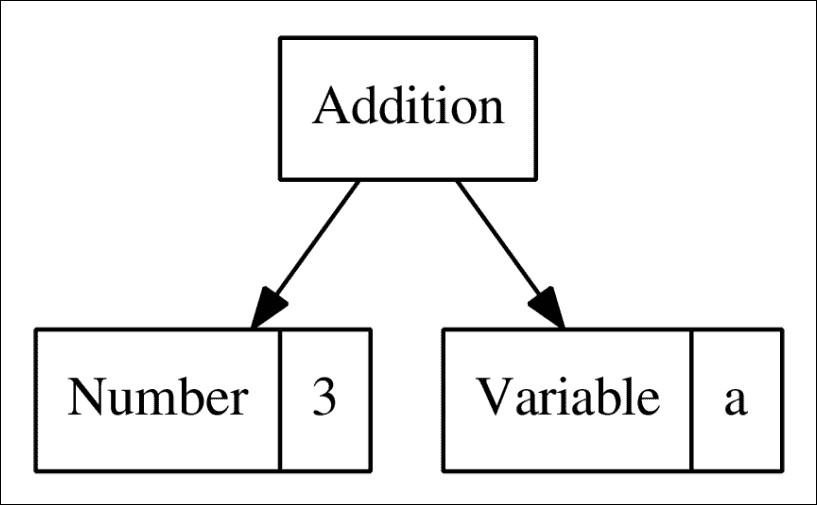
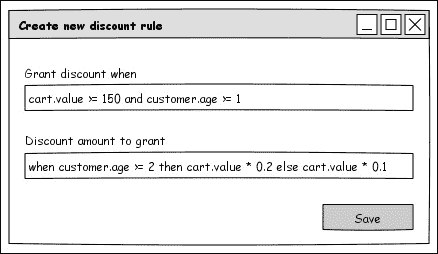
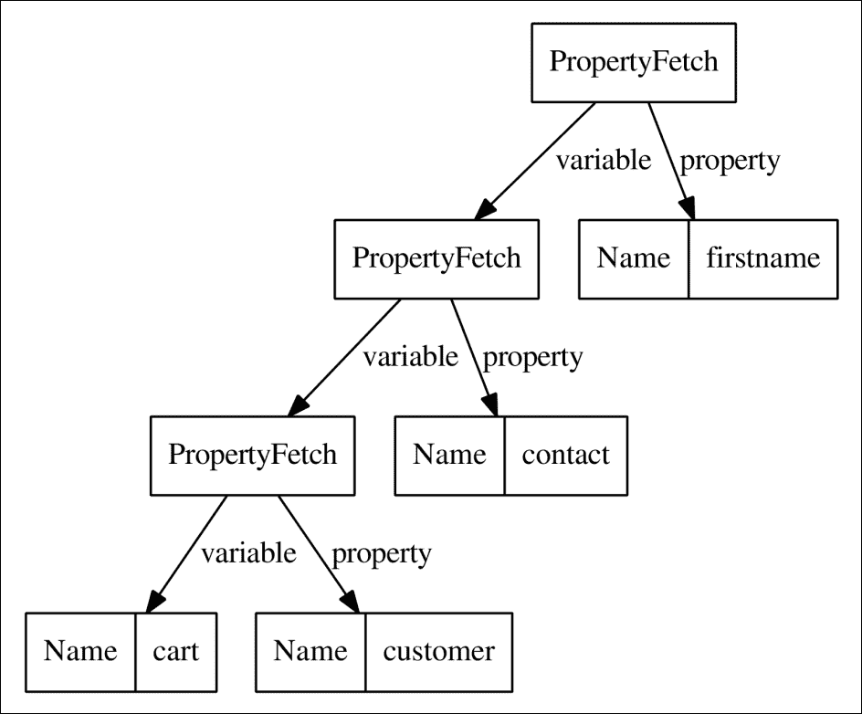
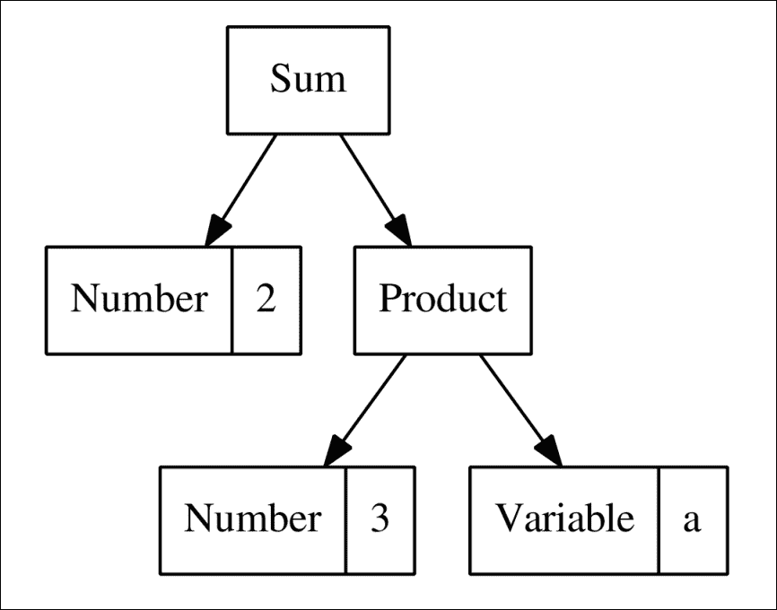
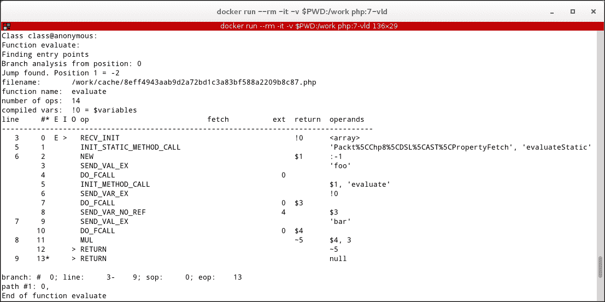
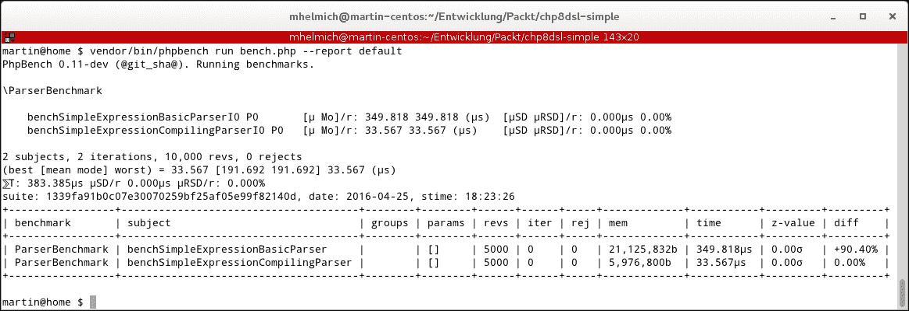
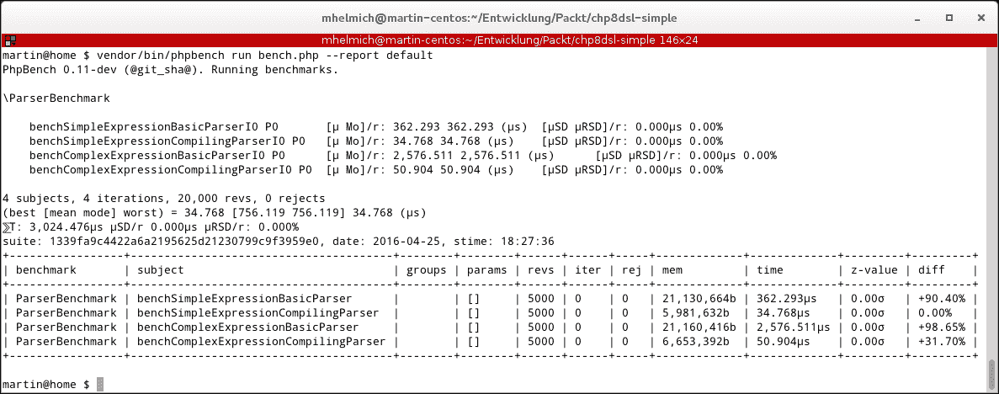

# 第八章：为自定义语言构建解析器和解释器

可扩展性和适应性通常是企业应用程序中所需的功能。通常，动态更改应用程序的行为和业务规则是有用的、实际的，甚至是用户的实际功能要求。例如，想象一下，一个电子商务应用程序中，销售代表可以自行配置业务规则；例如，当系统应该为购买提供免费运输或者在满足某些特殊条件时应用一定的折扣（当购买金额超过 150 欧元时提供免费运输，并且客户已经在过去进行了两次或更多次购买，或者已经是客户超过一年）。

根据经验，这些规则往往变得非常复杂（当客户是男性且年龄超过 35 岁并且有两个孩子和一只名叫 Whiskers 先生的猫，并且在一个没有云的满月之夜下放置购买订单时提供折扣），并且可能经常发生变化。因此，作为开发人员，您可能会很高兴为用户提供配置此类规则的可能性，而不是每次这些规则之一发生变化时都必须更新、测试和重新部署应用程序。这样的功能称为**最终用户开发**，通常使用**特定领域语言**来实现。

特定领域语言是针对特定应用领域定制的语言（与通用语言相对，如 C、Java 或者您猜对了 PHP）。在本章中，我们将为企业应用程序中的业务规则构建自己的小型表达式语言的解析器。

为此，我们需要回顾解析器的工作原理以及如何使用形式语法描述形式语言。

# 解释器和编译器的工作原理

解释器和编译器读取用编程语言编写的程序。它们可以直接执行它们（解释器），或者首先将它们转换为机器语言或另一种编程语言（编译器）。解释器和编译器通常都有（除其他外）称为**词法分析器**和**解析器**的两个组件。


这是编译器或解释器的基本架构

解释器可能省略代码生成，并直接运行解析后的程序，而无需专门的编译步骤。

**词法分析器**（也称为**扫描器**或**标记器**）将输入程序分解为可能的最小部分，即所谓的标记。每个标记由标记类（例如，数值或变量标识符）和实际的标记内容组成。例如，给定输入字符串`2 + (3 * a)`的计算器的词法分析器可能生成以下标记列表（每个标记都有一个标记类和值）：

1.  数字（“`2`”）

1.  加法运算符（“`+`”）

1.  开放括号（“`（`”）

1.  数字（“`3`”）

1.  乘法运算符（“`*`”）

1.  变量标识符（“`a`”）

1.  闭合括号（“`）`”）

在下一步中，**解析器**获取令牌流并尝试从该流中推导出实际的程序结构。为此，解析器需要使用一组描述输入语言的规则，即语法。在许多情况下，解析器生成表示结构化树中的输入程序的数据结构；所谓的语法树。例如，输入字符串`2 + (3 * a)`生成以下语法树：


可以从表达式 2 +（3 * a）生成的抽象语法树（AST）

请注意，有些程序将通过词法分析，但在下一步中，它们被解析器识别为语法错误。例如，名为`2 + ( 1`的输入字符串将通过词法分析（并生成诸如`{Number(2), Addition Operator, Opening bracket, Number(1)}`的标记列表），但显然在语法上是错误的，因为没有匹配的闭括号（假设解析器使用了普遍认可的数学表达式语法；在其他语法中，`2+(1`实际上可能是一个语法上有效的表达式）

# 语言和语法

为了使解析器能够理解程序，它需要该语言的正式描述-语法。在本章中，我们将使用所谓的**解析表达式语法**（**PEG**）。PEG（相对）容易定义，并且有一些库可以自动生成给定语法的解析器。

语法由**终结符号**和**非终结符号**组成。非终结符号是一个可能由几个其他符号组成的符号，遵循某些规则（**产生规则**）。例如，语法可以包含一个*数字*作为非终结符号。每个数字可以被定义为任意长度的数字序列。然后，一个数字可以是 0 到 9 中的任何字符（实际数字中的每个数字都是终结符号）。

让我们试着正式描述数字的结构（然后在此基础上构建数学表达式）。让我们从描述数字的外观开始。每个数字由一个或多个数字组成，所以让我们从描述数字和数字开始：

```php
Digit: '0'|'1'|'2'|'3'|'4'|'5'|'6'|'7'|'8'|'9' 
Number: Digit+ 

```

在这个例子中，Digit 是我们的第一个非终结符号。我们语法的第一个规则规定 0 到 9 中的任何字符都是数字。在这个例子中，字符'0'到'9'是终结符号，是最小的可能的构建块。

### 提示

实际上，许多解析器生成器允许您使用正则表达式来匹配终结符号。在前面的例子中，您可以简单地陈述这一点，而不是列举所有可能的数字：`Digit: /[0-9]/`

我们语法的第二条规则规定`Number`（我们的第二个非终结符号）由一个或多个`Digit`符号组成（`+`表示重复一次或多次）。以同样的方式，我们也可以扩展语法以支持小数：

```php
Digit: '0'|'1'|'2'|'3'|'4'|'5'|'6'|'7'|'8'|'9' 
**Integer: Digit+Decimal: Digit* '.' Digit+Number: Decimal | Integer**

```

在这里，我们引入了两个新的非终结符号：`Integer`和`Decimal`。`Integer`只是一个数字序列，而`Decimal`可以以任意数量的数字开头（或者根本不开头，这意味着像`.12`这样的值也是一个有效的数字），然后是一个点，然后是一个或多个数字。与上面已经使用的`+`运算符（“重复一次或更多次”）不同，`*`运算符表示“没有或一次或多次”。`Number`的产生规则现在说明一个数字可以是一个小数或一个整数。

### 提示

顺序在这里很重要；给定输入字符串`3.14`，整数规则将匹配此输入字符串的`3`，而小数规则将匹配整个字符串。因此，在这种情况下，最好首先尝试将数字解析为小数，当失败时再将数字解析为整数。

目前，这个语法只描述了正数。但是，它可以很容易地修改为支持负数。

```php
Digit: '0'|'1'|'2'|'3'|'4'|'5'|'6'|'7'|'8'|'9' 
Integer: '-'? Digit+ 
Decimal: '-'? Digit* '.' Digit+ 
Number: Decimal | Integer 

```

在这个例子中使用的`?`字符表示一个符号是可选的。这意味着整数和小数现在可以选择以`-`字符开头。

我们现在可以继续为我们的语法定义更多规则。例如，我们可以添加一个描述乘法的新规则：

```php
Product: Number ('*' Number)* 

```

由于除法基本上是与乘法相同的操作（并且具有相同的运算符优先级），我们可以使用相同的规则处理这两种情况：

```php
Product: Number (('*'|'/') Number)* 

```

一旦您在语法中添加了求和的规则，就重要考虑操作的顺序（先乘法，然后加法）。让我们定义一个名为`Sum`的新规则（再次使用一个规则来涵盖加法和减法）：

```php
Sum: Product (('+'|'-') Product)* 

```

这乍一看可能有些反直觉。毕竟，一个总和实际上不需要由两个乘积组成。但是，由于我们的`Product`规则使用`*`作为量词，它也将匹配单个数字，从而允许诸如`5 + 4`之类的表达式被解析为`Product + Product`。

为了使我们的语法完整，我们仍然需要能够解析嵌套语句。目前，我们的语法可以解析诸如`2 * 3`、`2 + 3`之类的语句。甚至`2 + 3 * 4`也将被正确解析为`2 + (3 * 4)`（而不是`(2 + 3) * 4`）。但是，像`(2 + 3) * 4`这样的语句不匹配我们语法的任何规则。毕竟，`Product`规则规定了一个乘积是由`*`字符连接的任意数量的`Number`；由于括号括起来的求和不匹配`Number`规则，因此`Product`规则也不会匹配。为了解决这个问题，我们将引入两个新规则：

```php
Expr: Sum 
Value: Number | '(' Expr ')' 

```

有了新的`Value`规则，我们可以调整`Product`规则以匹配常规数字或括号括起来的例外：

```php
Product: Value ('*' Value)* 

```

在这里，您将找到描述数学表达式所需的完整语法。它目前还不支持任何类型的变量或逻辑语句，但它将是我们在本章剩余部分中构建的自己的解析器的合理起点：

```php
Expr: Sum 
Sum: Product (('+' | '-') Product)* 
Product: Value (('*' | '/') Value)* 
Value: Number | '(' Expr ')' 
Number: (Decimal | Integer) 
Decimal: '-'? Digit* '.' Digit+ 
Integer: '-'? Digit+ 
Digit: '0'|'1'|'2'|'3'|'4'|'5'|'6'|'7'|'8'|'9' 

```

# 您的第一个 PEG 解析器

从头开始构建标记生成器和解析器是一项非常繁琐的任务。幸运的是，存在许多库可以根据某种形式的形式语法定义自动生成解析器。

在 PHP 中，您可以使用`hafriedlander/php-peg`库根据解析表达式语法生成任何形式语言的解析器的 PHP 代码。为此，创建一个新的项目目录，并创建一个包含以下内容的新`composer.json`文件：

```php
{ 
  "name": "packt-php7/chp8-calculator", 
  "authors": [{ 
    "name": "Martin Helmich", 
    "email": "php7-book@martin-helmich.de" 
  }], 

  "require": { 
    "hafriedlander/php-peg": "dev-master" 
  }, 
  "autoload": { 
    "psr-4": { 
      "Packt\\Chp8\\DSL": "src/" 
    }, 
    "files": [ 
      "vendor/hafriedlander/php-peg/autoloader.php" 
    ] 
  } 
} 

```

请注意，`hafriedlander/php-peg`库不使用 PSR-0 或 PSR-4 自动加载程序，而是使用自己的类加载程序。因此，您不能使用 composer 内置的 PSR-0/4 类加载程序，需要手动包含该软件包的自动加载程序。

与之前的章节类似，我们将使用`Packt\Chp8\DSL`作为基本命名空间，用于基于`src/`目录的 PSR-4 类加载器。这意味着名为`Packt\Chp8\DSL\Foo\Bar`的 PHP 类应该位于`src/Foo/Bar.php`文件中。

在使用 PHP PEG 时，您将解析器编写为一个包含特殊类型注释中的语法的常规 PHP 类。此类用作实际解析器生成器的输入文件，然后生成实际的解析器源代码。解析器输入文件的文件类型通常为`.peg.inc`。解析器类必须扩展`hafriedlander\Peg\Parser\Basic`类。

我们的解析器将使用`Packt\Chp8\DSL\Parser\Parser`类名。它将存储在`src/Parser/Parser.peg.inc`文件中：

```php
namespace Packt\Chp8\DSL\Parser; 

use hafriedlander\Peg\Parser\Basic; 

class Parser extends Basic 
{ 
    /*!* ExpressionLanguage 

    <Insert grammar here> 

    */ 
} 

```

### 注意

注意类中以`/*!*`字符开头的注释。这个特殊的注释块将被解析器生成器捕获，并且需要包含解析器将被生成的语法。

然后，您可以使用 PHP-PEG CLI 脚本构建实际的解析器（它将存储在文件`src/Parser/Parser.php`中，并且可以被 composer 类加载器捕获）：

```php
**$ php -d pcre.jit=0 vendor/hafriedlander/php-peg/cli.php 
    src/Parser/Parser.peg.inc > src/Parser/Parser.php**

```

### 提示

需要使用`-d pcre.jit=0`标志来修复与 PHP 7 相关的 PEG 包中的错误。禁用`pcre.jit`标志可能会影响程序的性能；但是只有在生成解析器时才能禁用此标志。生成的解析器不会受到`pcre.jit`标志的影响。

目前，解析器生成将因为解析器类尚未包含有效的语法而失败。这很容易改变；在你的解析器输入文件的特殊注释（以`/*!*`开头）中添加以下行：

```php
/*!* ExpressionLanguage 

**Digit: /[0-9]/** 
**Integer: '-'? Digit+** 
**Decimal: '-'? Digit* '.' Digit+** 
**Number: Decimal | Integer** 

*/ 

```

你会注意到这正是我们在前一节中用来匹配数字的示例语法。这意味着重新构建解析器后，你将拥有一个知道数字长什么样并能够识别它们的解析器。诚然，这还不够。但我们可以继续完善。

通过运行`cli.php`脚本重新构建你的解析器，然后在项目目录中创建一个名为`test.php`的测试脚本：

```php
require_once 'vendor/autoload.php'; 

use \Packt\Chp8\DSL\Parser\Parser; 

$result1 = new (Parser('-143.25'))->match_Number(); 
$result2 = new (Parser('I am not a number'))->match_Number(); 

var_dump($result1); 
var_dump($result2); 

```

记住，`Packt\Chp8\DSL\Parser\Parser`类是从你的`Parser.peg.inc`输入文件自动生成的。该类继承了`hafriedlander\Peg\Parser\Basic`类，后者也提供了构造函数。构造函数接受一个表达式，解析器应该解析这个表达式。

对于你的语法中定义的每个非终结符号，解析器将包含一个名为`match_[符号名称]()`的函数（例如，`match_Number`），该函数将根据给定的规则匹配输入字符串。

在我们的示例中，`$result1`是与有效数字（或者一般来说，由解析器语法匹配的输入字符串）匹配的结果，而`$result2`的输入字符串显然不是一个数字，不应该被语法匹配。让我们来看看这个测试脚本的输出：

```php
array(3) { 
  '_matchrule' => 
  string(6) "Number" 
  'name' => 
  string(6) "Number" 
  'text' => 
  string(7) "-143.25" 
} 
bool(false) 

```

正如你所看到的，解析第一个输入字符串返回一个包含匹配规则和被规则匹配的字符串的数组。如果规则没有匹配（例如在`$result2`中），`match_*`函数将始终返回`false`。

让我们继续添加我们在前一节中已经看到的规则的其余部分。这将使我们的解析器不仅能够解析数字，还能够解析整个数学表达式：

```php
/*!* ExpressionLanguage 

Digit: /[0-9]/ 
Integer: '-'? Digit+ 
Decimal: '-'? Digit* '.' Digit+ 
Number: Decimal | Integer 
**Value: Number | '(' > Expr > ')'** 
**Product: Value (> ('*'|'/') > Value)*** 
**Sum: Product (> ('+'|'-') > Product)*** 
**Expr: Sum** 

*/ 

```

在这个代码示例中，特别注意`>`字符。这些是由解析器生成器提供的特殊符号，可以匹配任意长度的空白序列。在一些语法中，空格可能很重要，但在解析数学表达式时，通常不在乎某人输入`2+3`还是`2 + 3`。

重新构建你的解析器，并调整你的测试脚本来测试这些新规则：

```php
var_dump((new Parser('-143.25'))->match_Expr()); 
var_dump((new Parser('12 + 3'))->match_Expr()); 
var_dump((new Parser('1 + 2 * 3'))->match_Expr()); 
var_dump((new Parser('(1 + 2) * 3'))->match_Expr()); 
var_dump((new Parser('(1 + 2)) * 3'))->match_Expr()); 

```

特别注意最后一行。显然，`(1 + 2)) * 3`表达式在语法上是错误的，因为它包含的右括号比左括号多。然而，对于这个输入语句，`match_Expr`函数的输出将是以下内容：

```php
array(3) { 
  '_matchrule' => 
  string(4) "Expr" 
  'name' => 
  string(4) "Expr" 
  'text' => 
  string(7) "(1 + 2)" 
} 

```

正如你所看到的，输入字符串仍然匹配了`Expr`规则，只是没有匹配整个字符串。字符串的第一部分，`(1 + 2)`，在语法上是正确的，并且符合`Expr`规则。这在使用 PEG 解析器时非常重要。如果一个规则不能匹配整个输入字符串，解析器仍然会尽可能匹配输入的尽可能多的部分。这取决于你作为解析器的用户来确定部分匹配是好事还是坏事（在我们的情况下，这可能会触发错误，因为部分匹配的表达式会导致非常奇怪的结果，无疑会让用户感到非常惊讶）。

# 评估表达式

到目前为止，我们只使用我们自己构建的 PEG 解析器来检查输入字符串是否符合给定的语法（也就是说，我们可以*告诉*输入字符串是否包含有效的数学表达式）。下一个逻辑步骤是实际评估这些表达式（例如，确定`'(1 + 2) * 3'`的值为`'9'`）。

正如您已经看到的，每个`match_*`函数都返回一个包含有关匹配字符串的附加信息的数组。在解析器内，您可以注册自定义函数，当匹配给定符号时将调用这些函数。让我们从简单的事情开始，尝试将由我们的语法匹配的数字转换为实际的 PHP 整数或浮点值。为此，请首先修改您的语法中的`Integer`和`Decimal`规则如下：

```php
Integer: **value:('-'? Digit+)** 
 **function value(array &$result, array $sub) {** 
 **$result['value'] = (int) $sub['text'];** 
 **}** 

Double: **value:('-'? Digit* '.' Digit+)**
 **function value(array &$result, array $sub) {** 
 **$result['value'] = (float) $sub['text'];** 
 **}**

```

让我们看看这里发生了什么。在每个规则中，您可以为规则内的子模式指定名称。例如，在`Integer`规则中的模式`Digit+`被分配了名为`value`的名称。一旦解析器找到与此模式匹配的字符串，它将调用在`Integer`规则下方提供的同名函数。该函数将被调用并传入两个参数：`&$result`参数将是稍后由实际的`match_Number`函数返回的数组。正如您所看到的，该参数被作为引用传递，您可以在值函数内对其进行修改。`$sub`参数包含子模式的结果数组（无论如何，它都包含一个`text`属性，您可以从中访问匹配的子模式的实际文本内容）。

在这种情况下，我们简单地使用 PHP 的内置函数将文本中的数字转换为实际的`int`或`float`变量。然而，这仅仅是因为我们的自定义语法和 PHP 巧合地以相同的方式表示数字，从而使我们能够使用 PHP 解释器将这些值转换为实际的数值。

如果您在规则中使用非终结符号，则无需显式指定子模式名称；您可以简单地使用符号名称作为函数名称。这可以在`Number`规则中完成：

```php
Number: Decimal | Integer 
 **function Decimal(array &$result, array $sub) {** 
 **$result['value'] = $sub['value'];** 
 **}** 
 **function Integer(array &$result, array $sub) {** 
 **$result['value'] = $sub['value'];** 
 **}**

```

同样，`$sub`参数包含匹配子模式的结果数组。在这种情况下，这意味着您之前修改过的`match_Decimal`和`match_Integer`函数返回的结果数组。

这将在`Product`和`Sum`规则中变得更加复杂。首先，通过为`Product`规则的各个部分添加标签来开始：

```php
Product: left:Value (operand:(> operator:('*'|'/') > right:Value))* 

```

继续通过向规则添加相应的规则函数来进行：

```php
Product: left:Value (operand:(> operator:('*'|'/') > right:Value))* 
 **function left(array &$result, array $sub) {** 
 **$result['value'] = $sub['value'];** 
 **}** 
 **function right(array &$result, array $sub) {** 
 **$result['value'] = $sub['value'];** 
 **}** 
 **function operator(array &$result, array $sub) {** 
 **$result['operator'] = $sub['text'];** 
 **}** 
 **function operand(array &$result, array $sub) {** 
 **if ($sub['operator'] == '*') {** 
 **$result['value'] *= $sub['value'];** 
 **} else {** 
 **$result['value'] /= $sub['value'];** 
 **}** 
 **}**

```

`Sum`规则可以相应地进行修改：

```php
Sum: left:Product (operand:(> operator:('+'|'-') > right:Product))* 
 **function left(array &$result, array $sub) {** 
 **$result['value'] = $sub['value'];** 
 **}** 
 **function right(array &$result, array $sub) {** 
 **$result['value'] = $sub['value'];** 
 **}** 
 **function operator(array &$result, array $sub) {** 
 **$result['operator'] = $sub['text'];** 
 **}** 
 **function operand(array &$result, array $sub) {** 
 **if ($sub['operator'] == '+') {** 
 **$result['value'] += $sub['value'];** 
 **} else {** 
 **$result['value'] -= $sub['value'];** 
 **}** 
 **}**

```

最后，您仍然需要修改`Value`和`Expr`规则：

```php
Value: Number | '(' > Expr > ')' 
 **function Number(array &$result, array $sub) {** 
 **$result['value'] = $sub['value'];** 
 **}** 
 **function Expr(array &$result, array $sub) {** 
 **$result['value'] = $sub['value'];** 
 **}** 
Expr: Sum 
 **function Sum(array &$result, array $sub) {** 
 **$result['value'] = $sub['value'];** 
 **}**

```

使用您的解析器中的这些新函数，现在它将能够在解析表达式的同时进行评估（请注意，我们在这里不遵循*传统*编译器架构，因为解析和执行不被视为分开的步骤，而是在同一步骤中完成）。使用`cli.php`脚本重新构建您的解析器类，并调整您的测试脚本以测试一些表达式：

```php
var_dump((new Parser('-143.25'))->match_Expr()['value']); 
var_dump((new Parser('12 + 3'))->match_Expr()['value']); 
var_dump((new Parser('1 + 2 * 3'))->match_Expr()['value']); 
var_dump((new Parser('(1 + 2) * 3'))->match_Expr()['value']); 

```

运行您的测试脚本将提供以下输出：

```php
double(-143.25) 
int(15) 
int(7) 
int(9) 

```

# 构建抽象语法树

目前，我们的解析器在同一步骤中解释输入代码并对其进行评估。然而，大多数编译器和解释器在实际运行程序之前会创建一个中间数据结构：**抽象语法树**（**AST**）。使用 AST 提供了一些有趣的可能性；例如，它为您提供了程序的结构化表示，然后您可以对其进行分析。此外，您可以使用 AST 并将其转换回基于文本的程序（可能是另一种语言）。

AST 是表示程序结构的树。构建基于 AST 的解析器的第一步是设计树的对象模型：需要哪些类以及它们如何相互关联。以下图显示了用于描述数学表达式的对象模型的初步草案：


（初步）抽象语法树的对象模型

在这个模型中，几乎所有的类都实现了`Expression`接口。这个接口规定了`evaluate()`方法，这个方法可以由接口的实现来执行实际的操作，模拟相应的树节点。让我们从实现`Packt\Chp8\DSL\AST\Expression`接口开始：

```php
namespace Packt\Chp8\DSL\AST; 

interface Expression 
{ 
    public function evaluate() 
} 

```

接下来是`Number`类及其两个子类：`Integer`和`Decimal`。由于我们将使用 PHP 7 的类型提示功能，而`Integer`和`Decimal`类只能使用`int`或`float`变量，我们无法充分利用继承，不得不将`Number`类留空：

```php
namespace Packt\Chp8\DSL\AST; 

abstract class Number implements Expression 
{} 

```

`Integer`类可以用 PHP 整数值初始化。由于这个类模拟了一个字面整数值；在这个类中，`evaluate()`方法需要做的唯一一件事情就是再次返回这个值：

```php
namespace Packt\Chp8\DSL\AST; 

class Integer extends Number 
{ 
    private $value; 

    public function __construct(int $value) 
    { 
        $this->value = $value; 
    } 

    public function evaluate(): int 
    { 
        return $this->value; 
    } 
} 

```

`Decimal`类可以以相同的方式实现；在这种情况下，只需使用`float`而不是`int`作为类型提示：

```php
namespace Packt\Chp8\DSL\AST; 

class Decimal extends Number 
{ 
    private $value; 

    public function __construct(float $value) 
    { 
        $this->value = $value; 
    } 

    public function evaluate(): float 
    { 
        return $this->value; 
    } 
} 

```

对于`Addition`、`Subtraction`、`Multiplication`和`Division`类，我们将使用一个共同的基类`Packt\Chp8\DSL\AST\BinaryOperation`。这个类将包含构造函数，这样你就不必一遍又一遍地实现它了：

```php
namespace Packt\Chp8\DSL\AST; 

abstract class BinaryOperation implements Expression 
{ 
    protected $left; 
    protected $right; 

    public function __construct(Expression $left, Expression $right) 
    { 
        $this->left  = $left; 
        $this->right = $right; 
    } 
} 

```

实现实际的操作类变得很容易。让我们以`Addition`类为例：

```php
namespace Packt\Chp8\DSL\AST; 

class Addition extends BinaryOperation 
{ 
    public function evaluate() 
    { 
 **return $this->left->evaluate() + $this->right->evaluate();** 
    } 
} 

```

剩下的类`Subtraction`、`Multiplication`和`Division`可以以类似于`Addition`类的方式实现。为了简洁起见，这些类的实际实现留给你作为练习。

现在剩下的就是在解析器中实际构建 AST。这相对容易，因为我们现在可以简单地修改解析器调用的已经存在的挂钩函数，当匹配到单个规则时。

让我们从解析数字的规则开始：

```php
Integer: value:('-'? Digit+) 
    function value(array &$result, array $sub) { 
 **$result['node'] = new Integer((int) $sub['text']);** 
    } 

Decimal: value:('-'? Digit* '.' Digit+) 
    function value(array &$result, array $sub) { 
 **$result['node']  = new Decimal((float) $sub['text']);** 
    } 

Number: Decimal | Integer 
    function Decimal(&$result, $sub) { 
 **$result['node']  = $sub['node'];** 
    } 
    function Integer(&$result, $sub) { 
 **$result['node']  = $sub['node'];** 
    } 

```

当`Integer`或`Decimal`规则匹配时，我们创建一个`Integer`或`Decimal`类的新 AST 节点，并将其保存在返回数组的`node`属性中。当`Number`规则匹配时，我们只需接管已经创建的节点存储在匹配符号中。

我们可以以类似的方式调整`Product`规则：

```php
Product: left:Value (operand:(> operator:('*'|'/') > right:Value))* 
    function left(array &$result, array $sub) { 
 **$result['node']  = $sub['node'];** 
    } 
    function right(array &$result, array $sub) { 
 **$result['node']  = $sub['node'];** 
    } 
    function operator(array &$result, array $sub) { 
 **$result['operator'] = $sub['text'];** 
    } 
    function operand(array &$result, array $sub) { 
        if ($sub['operator'] == '*') { 
 **$result['node'] = new Multiplication($result['node'], $sub['node']);** 
        } else { 
 **$result['node'] = new Division($result['node'], $sub['node']);** 
        } 
    } 

```

由于我们的 AST 模型严格将乘法等操作视为二进制操作，解析器将把输入表达式（如`1 * 2 * 3 * 4`）拆分成一系列二进制乘法（类似于`1 * (2 * (3 * 4))`，如下图所示）：


表达式 1 * 2 * 3 * 4 的语法树

继续以相同的方式调整你的`Sum`规则：

```php
Sum: left:Product (operand:(> operator:('+'|'-') > right:Product))* 
    function left(&$result, $sub) { 
 **$result['node']  = $sub['node'];** 
    } 
    function right(&$result, $sub) { 
 **$result['node']  = $sub['node'];** 
    } 
    function operator(&$result, $sub) { $result['operator'] = $sub['text']; } 
    function operand(&$result, $sub) { 
        if ($sub['operator'] == '+') { 
 **$result['node'] = new Addition($result['node'], $sub['node']);** 
        } else { 
 **$result['node'] = new Subtraction($result['node'], $sub['node']);** 
        } 
    } 

```

现在，剩下的就是按照以下方式在`Value`和`Expr`规则中读取创建的 AST 节点：

```php
Value: Number | '(' > Expr > ')' 
    function Number(array &$result, array $sub) { 
 **$result['node'] = $sub['node'];** 
    } 

Expr: Sum 
    function Sum(array &$result, array $sub) { 
 **$result['node'] = $sub['node'];** 
    } 

```

在你的测试脚本中，你现在可以通过从`match_Expr()`函数的返回值中提取`node`属性来测试 AST 是否正确构建。然后，你可以通过在 AST 的根节点上调用`evaluate()`方法来获得表达式的结果：

```php
$astRoot = (new Parser('1 + 2 * 3'))->match_Expr()['node']; 
var_dump($astRoot, $astRoot->evaluate()); 

$astRoot = (new Parser('(1 + 2) * 3'))->match_Expr()['node']; 
var_dump($astRoot, $astRoot->evaluate()); 

```

请注意，这个测试脚本中的两个表达式应该产生两个不同的语法树（都显示在下图中），并分别求值为 7 和 9。


解析 1+2*'和(1+2)*'表达式得到的两个语法树

# 构建一个更好的接口

目前，我们构建的解析器并不是真正易于使用的。为了正确使用解析器，用户（在这个上下文中，将“用户”解释为“使用你的解析器的另一个开发人员”）必须调用`match_Expr()`方法（这只是解析器提供的许多公共`match_*`函数之一，实际上不应该被外部用户调用），从返回的数组中提取`node`属性，然后在这个属性中包含的根节点上调用`evaluate`函数。此外，解析器还匹配部分字符串（记住我们的解析器认为`(1 + 2)) * 3`这个例子部分正确），这可能会让一些用户感到非常惊讶。

这个原因足以通过一个新的类来扩展我们的项目，这个类封装了这些怪癖，并为我们的解析器提供了一个更清晰的接口。让我们创建一个新的类，`Packt\Chp8\DSL\ExpressionBuilder`：

```php
namespace Packt\Chp8\DSL\ExpressionBuilder; 

use Packt\Chp8\DSL\AST\Expression; 
use Packt\Chp8\DSL\Exception\ParsingException; 
use Packt\Chp8\DSL\Parser\Parser; 

class ExpressionBuilder 
{ 
    public function parseExpression(string $expr): Expression 
    { 
        $parser = new Parser($expr); 
        $result = $parser->match_Expr(); 

        if ($result === false || $result['text'] !== $expr) { 
            throw new ParsingException(); 
        } 

        return $result['node']; 
    } 
} 

```

在这个例子中，我们正在检查整个字符串是否可以通过断言来解析，即匹配解析器返回的字符串实际上等于输入字符串（而不仅仅是子字符串）。如果是这种情况（或者如果表达式根本无法解析，结果只是 false），则会抛出`Packt\Chp8\DSL\Exception\ParsingException`的实例。这个异常类尚未定义；目前，它可以简单地继承基本异常类，不需要包含任何自定义逻辑：

```php
namespace Packt\Chp8\DSL\Exception; 

class ParsingException extends \Exception 
{} 

```

新的`ExpressionBuilder`类现在为您提供了一种更简洁的方法来解析和评估表达式。例如，您现在可以在您的`test.php`脚本中使用以下结构：

```php
$builder = new \Packt\Chp8\DSL\ExpressionBuilder; 

var_dump($builder->parseExpression('12 + 3')->evaluate()); 

```

# 评估变量

到目前为止，我们的解析器可以评估静态表达式，从简单的表达式开始，比如`3`（评估结果是 3），到任意复杂的表达式，比如`(5 + 3.14) * (14 + (29 - 2 * 3.918))`（顺便说一句，评估结果是 286.23496）。然而，所有这些表达式都是静态的；它们总是评估为相同的结果。

为了使这更加动态，我们现在将扩展我们的语法以允许变量。一个带有变量的表达式的例子是`3 + a`，然后可以使用不同的值多次评估`a`。

这一次，让我们从修改语法树的对象模型开始。首先，我们需要一个新的节点类型，`Packt\Chp8\DSL\AST\Variable`，例如允许`3 + a`表达式生成以下语法树：



从表达式 3 + a 生成的语法树

还有第二个问题：与使用**Number**节点的`Number`节点或算术运算相反，我们不能简单地计算**Variable**节点的数值（毕竟，它可以有任何值 - 这就是变量的意义）。因此，在评估表达式时，我们还需要传递关于哪些变量存在以及它们具有什么值的信息。为此，我们将通过额外的参数简单地扩展`Packt\Chp8\DSL\AST\Expression`接口中定义的`evaluate()`函数：

```php
namespace Packt\Chp8\DSL\AST; 

interface Expression 
{ 
 **public function evaluate(array $variables = []);** 
} 

```

更改接口定义需要更改所有实现此接口的类。在`Number`子类（`Integer`和`Decimal`）中，您可以添加新参数并简单地忽略它。静态数字的值根本不依赖于任何变量的值。下面的代码示例展示了`Packt\Chp8\DSL\AST\Integer`类中的这种变化，但请记住也要以同样的方式更改`Decimal`类：

```php
class Integer 
{ 
    // ... 
 **public function evaluate(array $variables = []): int** 
    { 
        return $this->value; 
    } 
} 

```

在`BinaryOperation`子类（`Addition`，`Subtraction`，`Multiplication`和`Division`）中，定义的变量的值也并不重要。但是我们需要将它们传递给这些节点的子节点。下面的例子展示了`Packt\Chp8\DSL\AST\Addition`类中的这种变化，但请记住也要相应地更改`Subtraction`，`Multiplication`和`Division`类：

```php
class Addition 
{ 
 **public function evaluate(array $variables = [])** 
    { 
 **return $this->left->evaluate($variables)** 
 **+ $this->right->evaluate($variables);** 
    } 
} 

```

最后，我们现在可以声明我们的`Packt\Chp8\DSL\AST\Variable`类：

```php
namespace Packt\Chp8\DSL\AST; 

use Packt\Chp8\DSL\Exception\UndefinedVariableException; 

class Variable implements Expression 
{ 
    private $name; 

    public function __construct(string $name) 
    { 
        $this->name = $name; 
    } 

    public function evaluate(array $variables = []) 
    { 
        if (isset($variables[$this->name])) { 
            return $variables[$this->name]; 
        } 
        throw new UndefinedVariableException($this->name); 
    } 
} 

```

在这个类的`evaluate()`方法中，您可以查找这个变量当前的实际值。如果一个变量没有定义（即：在`$variables`参数中不存在），我们将引发一个（尚未实现的）`Packt\Chp8\DSL\Exception\UndefinedVariableException`的实例，以让用户知道出了问题。

### 提示

你如何处理自定义语言中未定义的变量完全取决于你。你也可以改变`Variable`类的`evaluate()`方法，在评估未定义的变量时返回一个默认值，比如 0（或其他任何值）。然而，使用未定义的变量可能是无意的，简单地继续使用默认值可能会让你的用户感到非常惊讶。

`UndefinedVariableException`类可以简单地扩展常规的`Exception`类：

```php
namespace Packt\Chp8\DSL\Exception; 

class UndefinedVariableException extends \Exception 
{ 
    private $name; 

    public function __construct(string $name) 
    { 
        parent::__construct('Undefined variable: ' . $name); 
        $this->name = $name; 
    } 
} 

```

最后，我们需要调整解析器的语法以实际识别表达式中的变量。为此，我们的语法需要两个额外的符号：

```php
Name: /[a-zA-z]+/ 
Variable: Name 
    function Name(&$result, $sub) { 
        $result['node'] = new Variable($sub['name']); 
    } 

```

接下来，你需要扩展`Value`规则。目前，`Value`可以是`Number`符号，或者用括号括起来的`Expr`。现在，你还需要允许变量：

```php
**Value: Number | Variable | '(' > Expr > ')'** 
    function Number(array &$result, $sub) { 
        $result['node'] = $sub['node']; 
    } 
 **function Variable(array &$result, $sub) {** 
 **$result['node'] = $sub['node'];** 
 **}** 
    function Expr(array &$result, $sub) { 
        $result['node'] = $sub['node']; 
    } 

```

使用 PHP-PEG 的`cli.php`脚本重新构建你的解析器，并在`test.php`脚本中添加一些调用来测试这个新功能：

```php
$expr = $builder->parseExpression('1 + 2 * a'); 
var_dump($expr->evaluate(['a' => 1])); 
var_dump($expr->evaluate(['a' => 14])); 
var_dump($expr->evaluate(['a' => -1])); 

```

这些应该分别评估为 3、29 和-1。你也可以尝试在不传递任何变量的情况下评估表达式，这应该（理所当然地）导致抛出`UndefinedVariableException`。

# 添加逻辑表达式

目前，我们的语言只支持数值表达式。另一个有用的补充是支持布尔表达式，这些表达式不会评估为数值，而是*true*或*false*。可能的例子包括诸如`3 = 4`（这将始终评估为*false*）、`2 < 4`（这将始终评估为*true*）或`a <= 5`（这取决于变量`a`的值）的表达式。

## 比较

和之前一样，让我们从扩展语法树的对象模型开始。我们将从一个表示两个表达式之间相等检查的**Equals**节点开始。使用这个节点，`1 + 2 = 4 - 1`表达式将产生以下语法树（当然最终应该评估为*true*）：


应该从解析 1 + 2 = 4 - 1 表达式得到的语法树

为此，我们将实现`Packt\Chp8\DSL\AST\Equals`类。这个类可以继承我们之前实现的`BinaryOperation`类：

```php
namespace Packt\Chp8\DSL\AST; 

class Equals extends BinaryOperation 
{ 
    public function evaluate(array $variables = []) 
    { 
        return $this->left->evaluate($variables) 
            == $this->right->evaluate($variables); 
    } 
} 

```

在这个过程中，我们也可以同时实现`NotEquals`节点：

```php
namespace Packt\Chp8\DSL\AST; 

**class NotEquals extends BinaryOperation** 
{ 
    public function evaluate(array $variables = []) 
    { 
 **return $this->left->evaluate($variables)** 
 **!= $this->right->evaluate($variables);** 
    } 
} 

```

接下来，我们需要调整我们解析器的语法。首先，我们需要改变语法以区分数值和布尔表达式。为此，我们将在整个语法中将`Expr`符号重命名为`NumExpr`。这会影响`Value`符号：

```php
Value: Number | Variable | '(' > **NumExpr** > ')' 
    function Number(array &$result, array $sub) { 
        $result['node'] = $sub['node']; 
    } 
    function Variable(array &$result, array $sub) { 
        $result['node'] = $sub['node']; 
    } 
 **function NumExpr(array &$result, array $sub) {** 
        $result['node'] = $sub['node']; 
    } 

```

当然，你还需要改变`Expr`规则本身：

```php
**NumExpr**: Sum 
    function Sum(array &$result, array $sub) { 
        $result['node'] = $sub['node']; 
    } 

```

接下来，我们可以定义一个相等（以及不相等）的规则：

```php
ComparisonOperator: '=' | '|=' 
Comparison: left:NumExpr (operand:(> op:ComparisonOperator > right:NumExpr)) 
    function left(&$result, $sub) { 
        $result['leftNode'] = $sub['node']; 
    } 
    function right(array &$result, array $sub) { 
        $result['node'] = $sub['node']; 
    } 
    function op(array &$result, array $sub) { 
        $result['op'] = $sub['text']; 
    } 
    function operand(&$result, $sub) { 
        if ($sub['op'] == '=') { 
            $result['node'] = new Equals($result['leftNode'], $sub['node']); 
        } else { 
            $result['node'] = new NotEquals($result['leftNode'], $sub['node']); 
        } 
    } 

```

请注意，在这种情况下，这个规则变得有点复杂，因为它支持多个运算符。然而，这些规则现在相对容易通过更多的运算符进行扩展（当我们检查非相等的事物时，如"大于"或"小于"可能是下一个逻辑步骤）。首先定义的`ComparisonOperator`符号匹配所有类型的比较运算符，而使用这个符号来匹配实际表达式的`Comparison`规则。

最后，我们可以添加一个新的`BoolExpr`符号，并重新定义`Expr`符号：

```php
BoolExpr: Comparison 
    function Comparison(array &$result, array $sub) { 
        $result['node'] = $sub['node']; 
    } 

Expr: BoolExpr | NumExpr 
    function BoolExpr(array &$result, array $sub) { 
        $result['node'] = $sub['node']; 
    } 
    function NumExpr(array &$result, array $sub) { 
        $result['node'] = $sub['node']; 
    } 

```

在调用`match_Expr()`函数时，我们的解析器现在将匹配数值和布尔表达式。使用 PHP-PEG 的`cli.php`脚本重新构建你的解析器，并在`test.php`脚本中添加一些新的调用：

```php
$expr = $builder->parseExpression('1 = 2'); 
var_dump($expr->evaluate()); 

$expr = $builder->parseExpression('a * 2 = 6'); 
var_dump($expr->evaluate(['a' => 3]); 
var_dump($expr->evaluate(['a' => 4]); 

```

这些表达式应该分别评估为*false*、*true*和*false*。你之前添加的数值表达式应该继续像以前一样工作。

类似于这样，你现在可以向你的语法中添加额外的比较运算符，比如`>`、`>=`、`<`或`<=`。由于这些运算符的实现基本上与`=`和`|=`操作相同，我们将把它作为一个练习留给你。

## "and"和"or"运算符

为了完全支持逻辑表达式，另一个重要特性是能够通过`and`和`or`运算符组合逻辑表达式。由于我们正在为最终用户开发我们的语言，我们将构建我们的语言以实际支持`and`和`or`作为逻辑运算符（与许多通用编程语言中的`&&`和`||`相反，这些语言都是从 C 语法派生而来）。

再次，让我们从实现语法树的相应节点类型开始。我们需要建模`and`和`or`操作的节点类型，这样一个语句，比如`a = 1`或`b = 2`，将被解析成以下语法树：


解析 a=1 or b=2 得到的语法树

首先实现`Packt\Chp8\DSL\AST\LogicalAnd`类（我们不能使用*And*作为类名，因为在 PHP 中这是一个保留字）：

```php
namespace Packt\Chp8\DSL\AST; 

class LogicalAnd extends BinaryOperation 
{ 
    public function evaluate(array $variables=[]) 
    { 
        return $this->left->evaluate($variables) 
            && $this->right->evaluate($variables); 
    } 
} 

```

对于`or`运算符，你也可以用同样的方式实现`Packt\Chp8\DSL\AST\LogicalOr`类。

在使用`and`和`or`运算符时，你需要考虑运算符优先级。虽然算术运算的运算符优先级已经定义得很好，但逻辑运算符却不是这样。例如，语句`a and b or c and d`可以被解释为`(((a and b) or c) and d)`（相同的优先级，从左到右），或者同样可以被解释为`(a and b) or (c and d)`（`and`的优先级），或者`(a and (b or c)) and d`（`or`的优先级）。然而，大多数编程语言将`and`运算符视为最高优先级，因此除非有其他约定，否则坚持这一传统是有道理的。

以下图显示了将这种优先级应用于`a=1 and b=2 or b=3`和`a=1 and (b=2 or b=3)`语句得到的语法树：


解析 a=1 and b=2 or b=3 and a=1 and (b=2 or b=3)得到的语法树

我们的语法需要一些新的规则。首先，我们需要一个表示布尔值的新符号。目前，这样的布尔值可以是一个比较，也可以是用括号括起来的任何布尔表达式。

```php
BoolValue: Comparison | '(' > BoolExpr > ')' 
    function Comparison(array &$res, array $sub) { 
        $res['node'] = $sub['node']; 
    } 
    function BoolExpr(array &$res, array $sub) { 
        $res['node'] = $sub['node']; 
    } 

```

你还记得我们之前如何使用`Product`和`Sum`规则实现了运算符优先级吗？我们可以用同样的方式实现`And`和`Or`规则：

```php
And: left:BoolValue (> "and" > right:BoolValue)* 
    function left(array &$res, array $sub) { 
        $res['node'] = $sub['node']; 
    } 
    function right(array &$res, array $sub) { 
        $res['node'] = new LogicalAnd($res['node'], $sub['node']); 
    } 

Or: left:And (> "or" > right:And)* 
    function left(array &$res, array $sub) { 
        $res['node'] = $sub['node']; 
    } 
    function right(array &$res, array $sub) { 
        $res['node'] = new LogicalOr($res['node'], $sub['node']); 
    } 

```

之后，我们可以扩展`BoolExpr`规则，使其也匹配`Or`表达式（由于单个`And`符号也匹配`Or`规则，单个`And`符号也将是`BoolExpr`）：

```php
BoolExpr: Or | Comparison 
 **function Or(array &$result, array $sub) {** 
 **$result['node'] = $sub['node'];** 
 **}** 
    function Comparison(array &$result, array $sub) { 
        $result['node'] = $sub['node']; 
    } 

```

现在可以在你的`test.php`脚本中添加一些新的测试用例。尝试使用变量，并特别注意运算符优先级是如何解析的：

```php
$expr = $builder->parseExpression('a=1 or b=2 and c=3'); 
var_dump($expr->evaluate([ 
    'a' => 0, 
    'b' => 2, 
    'c' => 3 
]); 

```

## 条件

现在，我们的语言支持（任意复杂的）逻辑表达式，我们可以使用这些来实现另一个重要的特性：条件语句。我们的语言目前只支持评估为单个数字或布尔值的表达式；我们现在将实现三元运算符的变体，这在 PHP 中也是众所周知的：

```php
($b > 0) ? 1 : 2; 

```

由于我们的语言面向最终用户，我们将使用更易读的语法，这将允许诸如`when <condition> then <value> else <value>`的语句。在我们的语法树中，这些构造将由`Packt\Chp8\DSL\AST\Condition`类表示：

```php
<?php 
namespace Packt\Chp8\DSL\AST; 

class Condition implements Expression 
{ 
    private $when; 
    private $then; 
    private $else; 

    public function __construct(Expression $when, Expression $then, Expression $else) 
    { 
        $this->when = $when; 
        $this->then = $then; 
        $this->else = $else; 
    } 

    public function evaluate(array $variables = []) 
    { 
        if ($this->when->evaluate($variables)) { 
            return $this->then->evaluate($variables); 
        } 
        return $this->else->evaluate($variables); 
    } 
} 

```

这意味着，例如`when a > 2 then a * 1.5 else a * 2`表达式应该被解析成以下语法树：


理论上，我们的语言还应该支持条件或 then/else 部分中的复杂表达式，允许诸如`when (a > 2 or b = 2) then (2 * a + 3 * b) else (3 * a - b)`或甚至嵌套语句，比如`when a=2 then (when b=2 then 1 else 2) else 3`：


继续通过向解析器的语法中添加新的符号和规则：

```php
Condition: "when" > when:BoolExpr > "then" > then:Expr > "else" > else:Expr 
    function when(array &$res, array $sub) { 
        $res['when'] = $sub['node']; 
    } 
    function then(array &$res, $sub) { 
        $res['then'] = $sub['node']; 
    } 
    function else(array &$res, array $sub) { 
        $res['node'] = new Condition($res['when'], $res['then'], $sub['node']); 
    } 

```

还要调整`BoolExpr`规则以匹配条件。在这种情况下，顺序很重要：如果您首先将`Or`或`Comparison`符号放在`BoolExpr`规则中，规则可能会将`when`解释为变量名，而不是条件表达式。

```php
BoolExpr: **Condition |** Or | Comparison 
 **function Condition(array &$result, array $sub) {** 
 **$result['node'] = $sub['node'];** 
 **}** 
    function Or(&$result, $sub) { 
        $result['node'] = $sub['node']; 
    } 
    function Comparison(&$result, $sub) { 
        $result['node'] = $sub['node']; 
    } 

```

然后，使用 PHP-PEG 的**cli.php**脚本重新构建您的解析器，并在测试脚本中添加一些测试语句以测试新的语法规则：

```php
$expr = $builder->parseExpression('when a=1 then 3.14 else a*2'); 
var_dump($expr->evaluate(['a' => 1]); 
var_dump($expr->evaluate(['a' => 2]); 
var_dump($expr->evaluate(['a' => 3]); 

```

这些测试案例应该分别评估为 3.14、4 和 6。

# 使用结构化数据

到目前为止，我们的自定义表达式语言只支持非常简单的变量-数字和布尔值。然而，在实际应用中，情况通常并不那么简单。当使用表达式语言提供可编程的业务规则时，您通常会使用结构化数据。例如，考虑一个电子商务系统，其中后台用户有可能定义在哪些条件下向用户提供折扣以及折扣的购买金额（以下图显示了这样一个功能在应用程序中实际上可能看起来的假设示例）。

通常，您事先不知道用户将如何使用此功能。仅使用数字变量，您将不得不在评估表达式时传递整套变量，以防用户可能使用其中一两个。或者，您可以将整个域对象（例如，表示购物车的 PHP 对象，也许还有另一个表示客户的对象）作为变量传递到表达式中，并给用户访问这些对象的属性或调用方法的选项。

这样的功能将允许用户在表达式中使用`cart.value`等表达式。在评估此表达式时，这可以被转换为直接属性访问（如果`$cart`变量确实具有公开访问的`$value`属性），或者调用`getValue()`方法：



结构化数据如何在企业电子商务应用程序中用作变量的示例

为此，我们需要稍微修改我们的 AST 对象模型。我们将引入一个新的节点类型，`Packt\Chp8\DSL\AST\PropertyFetch`，它模拟了从变量中获取的命名属性。但是，我们需要考虑这些属性获取需要被链接，例如，在表达式中，如`cart.customer.contact.firstname`。这个表达式应该被解析成以下语法树：



为此，我们将重新定义之前添加的`Variable`节点类型。将`Variable`类重命名为`NamedVariable`，并添加一个名为`Variable`的新接口。然后，这个接口可以被`NamedVariable`类和`PropertyFetch`类同时实现。`PropertyFetch`类可以接受`Variable`实例作为其左操作数。

首先将`Packt\Chp8\DSL\AST\Variable`类重命名为`Packt\Chp8\DSL\AST\NamedVariable`：

```php
namespace Packt\Chp8\DSL\AST; 

use Packt\Chp8\DSL\Exception\UnknownVariableException; 

**class NamedVariable implements Variable** 
{ 
    private $name; 

    public function __construct(string $name) 
    { 
        $this->name = $name; 
    } 

    public function evaluate(array $variables = []) 
    { 
        if (isset($variables[$this->name])) { 
            return $variables[$this->name]; 
        } 
        throw new UnknownVariableException(); 
    } 
} 

```

然后，添加名为`Packt\Chp8\DSL\AST\Variable`的新接口。它不需要包含任何代码；我们将仅用于类型提示：

```php
namespace Packt\Chp8\DSL\AST; 

interface Variable extends Expression 
{ 
} 

```

继续添加`Packt\Chp8\DSL\AST\PropertyFetch`新类：

```php
namespace Packt\Chp8\DSL\AST; 

class PropertyFetch implements Variable 
{ 
    private $left; 
    private $property; 

    public function __construct(Variable $left, string $property) 
    { 
        $this->left = $left; 
        $this->property = $property; 
    } 

    public function evaluate(array $variables = []) 
    { 
        $var = $this->left->evaluate($variables); 
        return $var[$this->property] ?? null; 
    } 
} 

```

最后，在解析器的语法中修改`Variable`规则：

```php
Variable: Name **('.' property:Name)*** 
    function Name(array &$result, array $sub) { 
        $result['node'] = new NamedVariable($sub['text']); 
    } 
 **function property(&$result, $sub) {** 
 **$result['node'] = new PropertyFetch($result['node'], $sub['text']);** 
 **}**

```

使用此规则，`Variable`符号可以由多个用`.`字符链接在一起的属性名称组成。然后，规则函数将为第一个属性名称构建一个`NamedVariable`节点，然后将此节点作为`PropertyFetch`节点的链的一部分处理后续属性。

像往常一样，重新构建您的解析器，并在测试脚本中添加几行：

```php
$e = $builder->parseExpression('foo.bar * 2'); 
var_dump($e->evaluate(['foo' => ['bar' => 2]])); 

```

# 使用对象

让最终用户理解数据结构的概念并不容易。虽然*对象*具有*属性*的概念（例如，客户具有名字和姓氏）通常很容易传达，但您可能不会让最终用户关注数据封装和对象方法之类的事情。

因此，隐藏数据访问的复杂性可能是有用的；如果用户想要访问客户的名字，他们应该能够编写`customer.firstname`，即使底层对象的实际属性是受保护的，并且通常需要调用`getFirstname()`方法来读取此属性。由于获取器函数通常遵循某些命名模式，我们的解析器可以自动将诸如`customer.firstname`之类的表达式转换为诸如`$customer->getFirstname()`之类的方法调用。

要实现此功能，我们需要通过一些特殊情况来扩展`PropertyFetch`的`evaluate`方法：

```php
public function evaluate(array $variables = []) 
{ 
    $var = $this->left->evaluate($variables); 
 **if (is_object($var)) {** 
 **$getterMethodName = 'get' . ucfirst($this->property);** 
 **if (is_callable([$var, $getterMethodName])) {** 
 **return $var->{$getterMethodName}();** 
 **}**
 **$isMethodName = 'is' . ucfirst($this->property);** 
 **if (is_callable([$var, $isMethodName])) {** 
 **return $var->{$isMethodName}();** 
 **}** 
 **return $var->{$this->property} ?? null;** 
 **}** return $var[$this->property] ?? null; 
} 

```

使用此实现，例如`customer.firstname`这样的表达式将首先检查客户对象是否实现了可以调用的`getFirstname()`方法。如果不是这种情况，解释器将检查是否存在`isFirstname()`方法（在这种情况下没有意义，但作为获取器函数可能很有用，因为布尔属性通常被命名为`isSomething`而不是`getSomething`）。如果也不存在`isFirstname()`方法，解释器将查找名为`firstname`的可访问属性，然后作为最后的手段简单地返回 null。

# 通过添加编译器来优化解释器

我们的解析器现在可以正常工作，并且您可以在任何类型的应用程序中使用它，为最终用户提供非常灵活的定制选项。但是，解析器的效率并不高。一般来说，解析表达式是计算密集型的，在大多数情况下，可以合理地假设您正在处理的实际表达式不会在每个请求中更改（或者至少比它们更改的频率更高）。

因此，我们可以通过向我们的解释器添加缓存层来优化解析器的性能。当然，我们无法缓存表达式的实际评估结果；毕竟，当使用不同的变量解释它们时，这些结果可能会发生变化。

在本节中，我们要做的是向我们的解析器添加一个编译器功能。对于每个解析的表达式，我们的解析器生成一个代表该表达式结构的 AST。您现在可以使用此语法树将表达式转换为任何其他编程语言，例如 PHP。

考虑`2 + 3 * a`表达式。此表达式生成以下语法树：



在我们的 AST 模型中，这对应于`Packt\Chp8\DSL\AST\Addition`类的一个实例，其中包含对`Packt\Chp8\DSL\AST\Number`类和`Packt\Chp8\DSL\AST\Product`类（等等）的引用。

我们无法实现编译器功能将这些表达式转换回 PHP 代码（毕竟，PHP 也支持简单的算术运算），可能看起来像这样：

```php
use Packt\Chp8\DSL\AST\Expression; 

$cachedExpr = new class implements Expression 
{ 
    public function evaluate(array $variables=[]) 
    { 
        return 2 + (3 * $variables['a']); 
    } 
} 

```

以这种方式生成的 PHP 代码可以保存在文件中以供以后查找。如果解析器传递了一个已经缓存的表达式，它可以简单地加载保存的 PHP 文件，以便不实际解析表达式。

要实现此功能，我们需要有可能将语法树中的每个节点转换为相应的 PHP 表达式。为此，让我们通过一个新方法扩展我们的`Packt\Chp8\DSL\AST\Expression`接口：

```php
namespace Packt\Chp8\DSL\AST; 

interface Expression 
{ 
    public function evaluate(array $variables = []); 

 **public function compile(): string;** 
} 

```

这种方法的缺点是，您现在需要为实现此接口的每个类实现此方法。让我们从简单的东西开始：`Packt\Chp8\DSL\AST\Number`类。由于每个`Number`实现始终会评估为相同的数字（3 始终会评估为 3 而不会评估为 4），我们可以简单地返回数字值：

```php
namespace Packt\Chp8\DSL\AST; 

abstract class Number implements Expression 
{ 
 **public function compile(): string** 
 **{** 
 **return var_export($this->evaluate(), true);** 
 **}** 
} 

```

至于剩余的节点类型，我们将需要返回每种表达式类型在 PHP 中的实现的方法。例如，对于`Packt\Chp8\DSL\AST\Addition`类，我们可以添加以下`compile()`方法：

```php
namespace Packt\Chp8\DSL\AST; 

class Addition extends BinaryOperation 
{ 
    // ... 

 **public function compile(): string** 
 **{** 
 **return '(' . $this->left->compile() . ') + (' . $this->right->compile() . ')';** 
 **}** 
} 

```

对于剩余的算术运算，如`Subtraction`、`Multiplication`和`Division`，以及`Equals`、`NotEquals`、`And`和`Or`等逻辑运算，也要采取类似的方法。

对于`Condition`类，您可以使用 PHP 的三元运算符：

```php
namespace Packt\Chp8\DSL\AST; 

class Condition implements Expression 
{ 
    // ... 

 **public function compile(): string** 
 **{** 
 **return sprintf('%s ? (%s) : (%s)',
             $this->when->compile(),** 
 **$this->then->compile(),** 
 **$this->else->compile()** 
 **);** 
 **}** 
} 

```

`NamedVariable`类很难调整；类的`evaluate()`方法当前在引用不存在的变量时会抛出`UnknownVariableException`。但是，我们的`compile()`方法需要返回一个单一的 PHP 表达式。查找值并抛出异常不能在单个表达式中完成。幸运的是，您可以实例化类并在其上调用方法：

```php
namespace Packt\Chp8\DSL\AST; 

use Packt\Chp8\DSL\Exception\UnknownVariableException; 

class NamedVariable implements Variable 
{ 
    // ... 

    public function evaluate(array $variables = []) 
    { 
        if (isset($variables[$this->name])) { 
            return $variables[$this->name]; 
        } 
        throw new UnknownVariableException(); 
    } 

    public function compile(): string 
    { 
        return sprintf('(new %s(%s))->evaluate($variables)', 
            __CLASS__, 
            var_export($this->name, true) 
        ); 
    } 
} 

```

使用这种解决方法，`a * 3`表达式将被编译为以下 PHP 代码：

```php
(new \Packt\Chp8\DSL\AST\NamedVariable('a'))->evaluate($variables) * 3 

```

这只留下了`PropertyFetch`类。您可能还记得，这个类比其他节点类型更复杂，因为它实现了如何从对象中查找属性的许多不同情况。理论上，这个逻辑可以使用三元运算符在单个表达式中实现。这将导致`foo.bar`表达式被编译为以下怪物：

```php
is_object((new \Packt\Chp8\DSL\AST\NamedVariable('foo'))->evaluate($variables)) ? ((is_callable([(new \Packt\Chp8\DSL\AST\NamedVariable('foo'))->evaluate($variables), 'getBar']) ? (new \Packt\Chp8\DSL\AST\NamedVariable('a'))->evaluate($variables)->getBar() : ((is_callable([(new \Packt\Chp8\DSL\AST\NamedVariable('foo'))->evaluate($variables), 'isBar']) ? (new \Packt\Chp8\DSL\AST\NamedVariable('a'))->evaluate($variables)->isBar() : (new \Packt\Chp8\DSL\AST\NamedVariable('a'))->evaluate($variables)['bar'] ?? null)) : (new \Packt\Chp8\DSL\AST\NamedVariable('foo'))->evaluate($variables)['bar'] 

```

为了防止编译后的代码变得过于复杂，最好稍微重构`PropertyFetch`类。您可以将实际的属性查找方法提取到一个静态方法中，该方法可以从`evaluate()`方法和`compiled`代码中调用：

```php
<?php 
namespace Packt\Chp8\DSL\AST; 

class PropertyFetch implements Variable 
{ 
    private $left; 
    private $property; 

    public function __construct(Variable $left, string $property) 
    { 
        $this->left = $left; 
        $this->property = $property; 
    } 

    public function evaluate(array $variables = []) 
    { 
        $var = $this->left->evaluate($variables); 
 **return static::evaluateStatic($var, $this->property);** 
    } 

 **public static function evaluateStatic($var, string $property)** 
 **{** 
 **if (is_object($var)) {** 
 **$getterMethodName = 'get' . ucfirst($property);** 
 **if (is_callable([$var, $getterMethodName])) {** 
 **return $var->{$getterMethodName}();** 
 **}** 
 **$isMethodName = 'is' . ucfirst($property);** 
 **if (is_callable([$var, $isMethodName])) {** 
 **return $var->{$isMethodName}();** 
 **}** 
 **return $var->{$property} ?? null;** 
 **}** 
 **return $var[$property] ?? null;** 
 **}** 
 **public function compile(): string** 
 **{** 
 **return __CLASS__ . '::evaluateStatic(' . $this->left->compile() . ', ' . var_export($this->property, true) . ')';** 
 **}** 
} 

```

这样，`foo.bar`表达式将简单地评估为：

```php
\Packt\Chp8\DSL\AST\PropertyFetch::evaluateStatic( 
    (new \Packt\Chp8\DSL\AST\NamedVariable('foo'))->evaluate($variables), 
    'bar' 
) 

```

在下一步中，我们可以为先前介绍的`ExpressionBuilder`类添加一个替代方案，该方案可以透明地编译表达式，将它们保存在缓存中，并在必要时重用已编译的版本。

我们将称这个类为`Packt\Chp8\DSL\CompilingExpressionBuilder`：

```php
<?php 
namespace Packt\Chp8\DSL; 

class CompilingExpressionBuilder 
{ 
    /** @var string */ 
    private $cacheDir; 
    /** 
     * @var ExpressionBuilder 
     */ 
    private $inner; 

    public function __construct(ExpressionBuilder $inner, string $cacheDir) 
    { 
        $this->cacheDir = $cacheDir; 
        $this->inner = $inner; 
    } 
} 

```

由于我们不希望重新实现`ExpressionBuilder`的解析逻辑，因此该类将`ExpressionBuilder`的实例作为依赖项。当解析尚未存在于缓存中的新表达式时，将使用内部表达式构建器来实际解析此表达式。

让我们继续向这个类添加一个`parseExpression`方法：

```php
public function parseExpression(string $expr): Expression 
{ 
    $cacheKey = sha1($expr); 
    $cacheFile = $this->cacheDir . '/' . $cacheKey . '.php'; 
    if (file_exists($cacheFile)) { 
        return include($cacheFile); 
    } 

    $expr = $this->inner->parseExpression($expr); 

    if (!is_dir($this->cacheDir)) { 
        mkdir($this->cacheDir, 0755, true); 
    } 

    file_put_contents($cacheFile, '<?php return new class implements '.Expression::class.' { 
        public function evaluate(array $variables=[]) { 
            return ' . $expr->compile() . '; 
        } 

        public function compile(): string { 
            return ' . var_export($expr->compile(), true) . '; 
        } 
    };'); 
    return $expr; 
} 

```

让我们看看这个方法中发生了什么：首先，实际的输入字符串用于计算哈希值，唯一标识此表达式。如果缓存目录中存在具有此名称的文件，则将其包含为 PHP 文件，并将文件的返回值作为方法的返回值返回：

```php
$cacheKey = sha1($expr); 
$cacheFile = $this->cacheDir . '/' . $cacheKey; 
if (file_exists($cacheFile)) { 
    return include($cacheFile); 
} 

```

由于方法的类型提示指定方法需要返回`Packt\Chp8\DSL\AST\Expression`接口的实例，生成的缓存文件也需要返回此接口的实例。

如果找不到表达式的编译版本，则该表达式将像内部表达式构建器一样通常解析。然后使用`compile()`方法将此表达式编译为 PHP 表达式。然后使用此 PHP 代码片段来编写实际的缓存文件。在此文件中，我们创建一个实现表达式接口的新匿名类，并且在其`evaluate()`方法中包含编译后的表达式。

### 提示

匿名类是 PHP 7 中添加的一个功能。此功能允许您创建实现接口或扩展现有类的对象，而无需明确定义此类的命名类。在语法上，此功能可以如下使用：

`$a = new class implements SomeInterface {` `    public function test() {` `        echo 'Hello';` `    }` `};` `$a->test();`

这意味着`foo.bar * 3`表达式将创建一个缓存文件，其中包含以下 PHP 代码：

```php
<?php 
return new class implements Packt\Chp8\DSL\AST\Expression 
{ 
    public function evaluate(array $variables = []) 
    { 
        return (Packt\Chp8\DSL\AST\PropertyFetch::evaluateStatic( 
            (new Packt\Chp8\DSL\AST\NamedVariable('foo'))->evaluate($variables), 
            'bar' 
        )) * (3); 
    } 

    public function compile(): string 
    { 
        return '(Packt\\Chp8\\DSL\\AST\\PropertyFetch::evaluateStatic((new Packt\\Chp8\\DSL\\AST\\NamedVariable('foo'))->evaluate($variables), 'bar'))*(3)'; 
    } 
}; 

```

有趣的是，PHP 解释器本身的工作方式与此类似。在实际执行 PHP 代码之前，PHP 解释器将代码编译为中间表示或字节码，然后由实际解释器解释。为了不一遍又一遍地解析 PHP 源代码，编译后的字节码被缓存；这就是 PHP 的操作码缓存的工作原理。

由于我们将编译的表达式保存为 PHP 代码，这些表达式也将被编译为 PHP 字节码，并缓存在操作码缓存中，以再次提高性能。例如，先前缓存的表达式的 evaluate 方法评估为以下 PHP 字节码：



PHP 解释器生成的 PHP 字节码

# 验证性能改进

实现将编译到 PHP 的动机是为了提高解析器的性能。作为最后一步，我们现在将尝试验证缓存层是否确实提高了解析器的性能。

为此，您可以使用**PHPBench**包，您可以使用 composer 安装：

```php
**$ composer require phpbench/phpbench**

```

PHPBench 提供了一个框架，用于在隔离中对单个代码单元进行基准测试（在这方面类似于 PHPUnit，只是用于基准测试而不是测试）。每个基准测试都是一个包含场景的 PHP 类作为方法。每个场景方法的名称需要以`bench`开头。

首先，在根目录中创建一个`bench.php`文件，内容如下：

```php
require 'vendor/autoload.php'; 

use Packt\Chp8\DSL\ExpressionBuilder; 
use Packt\Chp8\DSL\CompilingExpressionBuilder; 

class ParserBenchmark 
{ 
    public function benchSimpleExpressionWithBasicParser() 
    { 
        $builder = new ExpressionBuilder(); 
        $builder->parseExpression('a = 2')->evaluate(['a' => 1]); 
    } 
} 

```

然后，您可以使用以下命令运行此基准测试：

```php
**vendor/bin/phpbench run bench.php --report default**

```

这将生成以下报告：


目前，PHPBench 仅运行基准函数一次，并测量执行此函数所需的时间。在这种情况下，大约为 2 毫秒。这并不是非常精确，因为这样的微量测量可能会有很大的变化，取决于同时发生在计算机上的其他事情。因此，通常最好多次执行基准函数（比如说，几百次或几千次），然后计算平均执行时间。使用 PHPBench，您可以通过在基准类的 DOC 注释中添加`@Revs(5000)`注释来轻松实现这一点：

```php
/** 
 * @Revs(5000) 
 */ 
class ParserBenchmark 
{ 
    // ... 
} 

```

此注释将导致 PHPBench 实际运行此基准函数 5000 次，然后计算平均运行时间。

让我们还添加第二个场景，其中我们使用相同的表达式使用新的`CompilingExpressionBuilder`：

```php
/** 
 * @Revs(5000) 
 */ 
class ParserBenchmark 
{ 
    public function benchSimpleExpressionWithBasicParser() 
    { 
        $builder = new ExpressionBuilder(); 
        $builder->parseExpression('a = 2')->evaluate(['a' => 1]); 
    } 

    public function benchSimpleExpressionWithCompilingParser() 
    { 
        $builder = new CompilingExpressionBuilder(); 
        $builder->parseExpression('a = 2')->evaluate(['a' => 1]); 
    } 
} 

```

再次运行基准测试；这次对两个解析器进行基准测试，并进行 5000 次迭代：



如您所见，解析和评估`a=2`表达式需要我们的常规解析器平均约 349 微秒（大约 20 兆字节的 RAM）。使用编译解析器只需要约 33 微秒（运行时间减少约 90%），只需要 5 兆字节的 RAM（或约 71%）。

现在，`a=2`可能并不是最具代表性的基准，因为在实际使用情况中使用的实际表达式可能会变得更加复杂。

为了进行更真实的基准测试，让我们添加另外两种情景，这次使用更复杂的表达式：

```php
public function benchComplexExpressionBasicParser() 
{ 
    $builder = new ExpressionBuilder(); 
    $builder 
        ->parseExpression('when (customer.age = 1 and cart.value = 200) then cart.value * 0.1 else cart.value * 0.2') 
        ->evaluate(['customer' => ['age' => 1], 'cart' => ['value' => 200]]); 
} 

public function benchComplexExpressionCompilingParser() 
{ 
    $builder = new CompilingExpressionBuilder(new ExpressionBuilder(), 'cache/auto'); 
    $builder 
        ->parseExpression('when (customer.age = 1 and cart.value = 200) then cart.value * 0.1 else cart.value * 0.2') 
        ->evaluate(['customer' => ['age' => 1], 'cart' => ['value' => 200]]); 
} 

```

再次运行基准测试，并查看结果：



这甚至比以前更好！使用常规解析器解析`when (customer.age = 1 and cart.value = 200) then cart.value * 0.1 else cart.value * 0.2`表达式大约需要 2.5 毫秒（请记住我们上次基准测试中谈到的*微秒*），而使用优化解析器只需要 50 微秒！这是约 98%的改进。

# 摘要

在本章中，您学习了如何使用 PHP-PEG 库实现自定义表达式语言的解析器、解释器和编译器。您还学习了如何为这样的语言定义语法，以及如何使用它们来开发特定领域的语言。这些可以用于在大型软件系统中提供最终用户开发功能，允许用户在很大程度上自定义其软件的业务规则。

使用特定领域语言动态修改程序可以成为一个强有力的卖点，特别是在企业系统中。它们允许用户自行修改程序的行为，而无需等待开发人员更改业务规则并触发漫长的发布流程。这样，新的业务规则可以快速实施，使您的客户能够迅速应对不断变化的需求。
