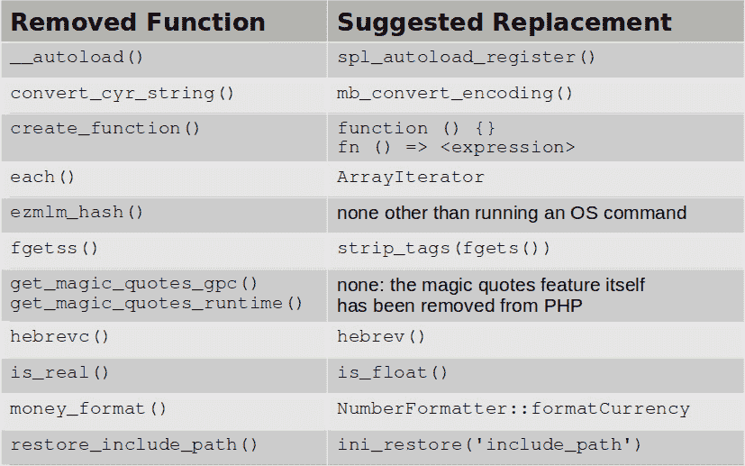
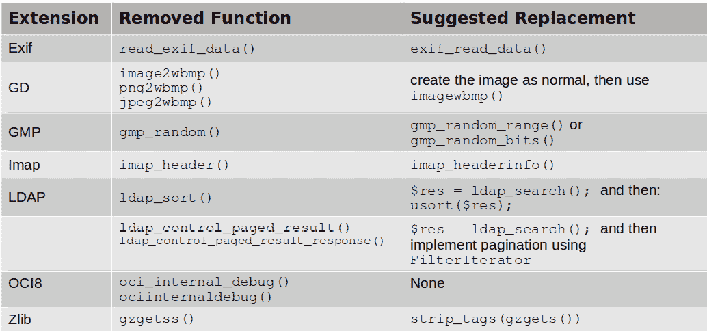
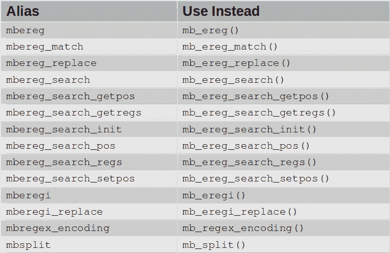
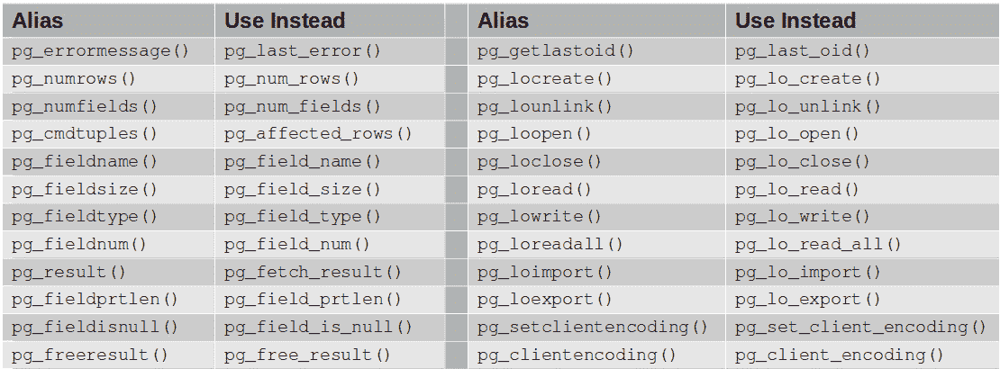
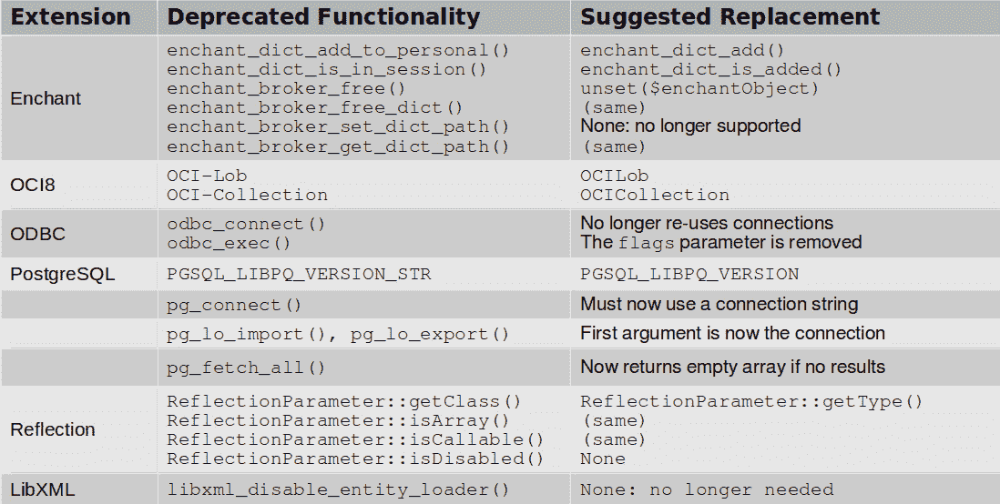

# *第八章*：了解 PHP 8 的弃用或已删除功能

本章将介绍在**PHP 超文本预处理器 8**（**PHP 8**）中已弃用或删除的功能。对于任何开发人员来说，这些信息都非常重要。任何使用已删除功能的代码在升级到 PHP 8 之前必须进行重写。同样，任何弃用都是向您发出明确信号，您必须重写依赖于此类功能的任何代码，否则将来可能会出现问题。

阅读本章的材料并跟随示例应用代码后，您可以检测和重写已弃用的代码。您还可以为已删除的功能开发解决方案，并学习如何重构涉及扩展的已删除功能的代码。从本章中您还将学习到另一个重要技能，即通过重写依赖于已删除功能的代码来提高应用程序安全性。

本章涵盖的主题包括以下内容：

+   发现核心中已删除的内容

+   检查核心弃用

+   在 PHP 8 扩展中使用已删除的功能

+   处理已弃用或已删除的与安全相关的功能

# 技术要求

为了检查和运行本章提供的代码示例，下面概述了最低推荐硬件要求：

+   基于 x86_64 的台式 PC 或笔记本电脑

+   1 千兆字节（GB）的可用磁盘空间

+   4 GB 的随机存取存储器（RAM）

+   500 千比特每秒（Kbps）或更快的互联网连接

此外，您需要安装以下软件：

+   Docker

+   Docker Compose

有关 Docker 和 Docker Compose 安装的更多信息，请参阅*第一章*的*技术要求*部分，介绍了如何构建用于演示本书中解释的代码的 Docker 容器。在本书中，我们将恢复了书籍样本代码的目录称为`/repo`。

本章的源代码位于此处：

[`github.com/PacktPublishing/PHP-8-Programming-Tips-Tricks-and-Best-Practices`](https://github.com/PacktPublishing/PHP-8-Programming-Tips-Tricks-and-Best-Practices)

我们现在可以开始讨论在 PHP 8 中已删除的核心功能。

# 发现核心中已删除的内容

在本节中，我们不仅考虑了从 PHP 8 中删除的函数和类，还将查看已删除的用法。然后，我们将查看仍然存在但由于 PHP 8 中的其他更改而不再提供任何有用功能的类方法和函数。了解已删除的函数非常重要，以防止在 PHP 8 迁移后出现潜在的代码中断。

让我们从检查在 PHP 8 中已删除的功能开始。

## 检查在 PHP 8 中已删除的功能

PHP 语言中有许多函数仅保留下来以保持向后兼容性。然而，维护这些功能会消耗核心语言开发的资源。此外，大多数情况下，这些功能已被更好的编程构造所取代。因此，随着证据表明这些功能不再被使用，这些命令已经在语言中慢慢被删除。

提示

PHP 核心团队偶尔会对基于 GitHub 的 PHP 存储库进行统计分析。通过这种方式，他们能够确定 PHP 核心中各种命令的使用频率。

接下来显示的表总结了在 PHP 8 中已删除的功能以及用于替代它们的内容：



表 8.1 – PHP 8 已删除的功能和建议的替代品

在本节的其余部分，我们将介绍一些重要的已删除函数，并为您提供建议，以便重构代码以实现相同的结果。让我们首先来看看`each（）`。

### 使用 each（）进行操作

`each（）`是在 PHP 4 中引入的一种遍历数组的方法，每次迭代产生键/值对。`each（）`的语法和用法非常简单，面向过程的。我们将展示一个简短的代码示例，演示`each（）`的用法，如下所示：

1.  在此代码示例中，我们首先打开到包含来自 GeoNames（[`geonames.org`](https://geonames.org)）项目的城市数据的数据文件的连接，如下所示：

```php
    // /repo/ch08/php7_each.php
    $data_src = __DIR__ 
        . '/../sample_data/cities15000_min.txt';
    $fh       = fopen($data_src, 'r');
    $pattern  = "%30s : %20s\n";
    $target   = 10000000;
    $data     = [];
    ```

1.  然后，我们使用`fgetcsv（）`函数将数据行拉入`$line`，并将纬度和经度信息打包到`$data`数组中。请注意在以下代码片段中，我们过滤掉人口少于`$target`（在本例中少于 1000 万）的城市的数据行：

```php
    while ($line = fgetcsv($fh, '', "\t")) {
        $popNum = $line[14] ?? 0;
        if ($popNum > $target) {
            $city = $line[1]  ?? 'Unknown';
            $data[$city] = $line[4]. ',' . $line[5];
        }
    }
    ```

1.  然后，我们关闭文件句柄并按城市名称对数组进行排序。为了呈现输出，我们使用`each（）`遍历数组，生成键/值对，其中城市是键，纬度和经度是值。代码如下所示：

```php
    fclose($fh);
    ksort($data);
    printf($pattern, 'City', 'Latitude/Longitude');
    printf($pattern, '----', '--------------------');
    while ([$city, $latLon] = each($data)) {
        $city = str_pad($city, 30, ' ', STR_PAD_LEFT);
        printf($pattern, $city, $latLon);
    }
    ```

以下是在 PHP 7 中的输出：

```php
root@php8_tips_php7 [ /repo/ch08 ]# php php7_each.php 
                          City :   Latitude/Longitude
                          ---- : --------------------
                       Beijing :    39.9075,116.39723
                  Buenos Aires :  -34.61315,-58.37723
                         Delhi :    28.65195,77.23149
                         Dhaka :     23.7104,90.40744
                     Guangzhou :      23.11667,113.25
                      Istanbul :    41.01384,28.94966
                       Karachi :      24.8608,67.0104
                   Mexico City :   19.42847,-99.12766
                        Moscow :    55.75222,37.61556
                        Mumbai :    19.07283,72.88261
                         Seoul :      37.566,126.9784
                      Shanghai :   31.22222,121.45806
                      Shenzhen :    22.54554,114.0683
                    São Paulo :   -23.5475,-46.63611
                       Tianjin :   39.14222,117.17667
```

然而，此代码示例在 PHP 8 中不起作用，因为`each（）`已被移除。*最佳实践*是向**面向对象编程**（**OOP**）方法迈进：使用`ArrayIterator`代替`each（）`。下一个代码示例产生的结果与以前完全相同，但使用对象类而不是过程函数：

1.  我们不使用`fopen（）`，而是创建一个`SplFileObject`实例。您还会注意到在以下代码片段中，我们不是创建一个数组，而是创建一个`ArrayIterator`实例来保存最终数据：

```php
    // /repo/ch08/php8_each_replacements.php
    $data_src = __DIR__ 
        . '/../sample_data/cities15000_min.txt';
    $fh       = new SplFileObject($data_src, 'r');
    $pattern  = "%30s : %20s\n";
    $target   = 10000000;
    $data     = new ArrayIterator();
    ```

1.  然后，我们使用`fgetcsv（）`方法循环遍历数据文件以检索一行，并使用`offsetSet（）`追加到迭代中，如下所示：

```php
    while ($line = $fh->fgetcsv("\t")) {
        $popNum = $line[14] ?? 0;
        if ($popNum > $target) {
            $city = $line[1]  ?? 'Unknown';
            $data->offsetSet($city, $line[4]. ',' .             $line[5]);
        }
    }
    ```

1.  最后，我们按键排序，倒回到顶部，并在迭代仍具有更多值时循环。我们使用`key（）`和`current（）`方法检索键/值对，如下所示：

```php
    $data->ksort();
    $data->rewind();
    printf($pattern, 'City', 'Latitude/Longitude');
    printf($pattern, '----', '--------------------');
    while ($data->valid()) {
        $city = str_pad($data->key(), 30, ' ', STR_PAD_LEFT);
        printf($pattern, $city, $data->current());
        $data->next();
    }
    ```

这个代码示例实际上可以在任何版本的 PHP 中工作，从 PHP 5.1 到 PHP 8 都可以！输出与前面的 PHP 7 输出完全相同，这里不再重复。

现在让我们来看看`create_function（）`。

### 使用 create_function（）进行操作

在 PHP 5.3 之前，将函数分配给变量的唯一方法是使用`create_function（）`。从 PHP 5.3 开始，首选方法是定义匿名函数。匿名函数虽然在技术上是过程式编程**应用程序编程接口**（**API**）的一部分，但实际上是`Closure`类的实例，因此也属于 OOP 领域。

提示

如果您需要的功能可以简化为单个表达式，在 PHP 8 中，您还可以使用**箭头函数**。

当由`create_function（）`定义的函数执行时，PHP 在内部执行`eval（）`函数。然而，这种架构的结果是笨拙的语法。匿名函数在性能上是等效的，并且更直观。

以下示例演示了`create_function（）`的用法。此示例的目标是扫描 Web 服务器访问日志，并按**Internet Protocol**（**IP**）地址对结果进行排序：

1.  我们首先记录以微秒为单位的开始时间。稍后，我们将使用此值来确定性能。以下是您需要的代码：

```php
    // /repo/ch08/php7_create_function.php
    $start = microtime(TRUE);
    ```

1.  接下来，使用`create_function（）`定义一个回调函数，将每行开头的 IP 地址重新组织为确切三位数的统一段。我们需要这样做才能执行正确的排序（稍后定义）。`create_function（）`的第一个参数是表示参数的字符串。第二个参数是要执行的实际代码。代码如下所示：

```php
    $normalize = create_function(
        '&$line, $key',
        '$split = strpos($line, " ");'
        . '$ip = trim(substr($line, 0, $split));'
        . '$remainder = substr($line, $split);'
        . '$tmp = explode(".", $ip);'
        . 'if (count($tmp) === 4)'
        . '    $ip = vsprintf("%03d.%03d.%03d.%03d", $tmp);'
        . '$line = $ip . $remainder;'
    );
    ```

请注意大量使用字符串。这种笨拙的语法很容易导致语法或逻辑错误，因为大多数代码编辑器不会解释嵌入字符串中的命令。

1.  接下来，我们定义一个用于`usort()`的排序回调，如下所示：

```php
    $sort_by_ip = create_function(
        '$line1, $line2',
        'return $line1 <=> $line2;' );
    ```

1.  然后，我们使用`file()`函数将访问日志的内容提取到一个数组中。我们还将`$sorted`移动到一个文件中，以保存排序后的访问日志条目。代码如下所示：

```php
    $orig   = __DIR__ . '/../sample_data/access.log';
    $log    = file($orig);
    $sorted = new SplFileObject(__DIR__ 
        . '/access_sorted_by_ip.log', 'w');
    ```

1.  然后，我们能够使用`array_walk()`规范化 IP 地址，并使用`usort()`进行排序，如下所示：

```php
    array_walk($log, $normalize);
    usort($log, $sort_by_ip);
    ```

1.  最后，我们将排序后的条目写入备用日志文件，并显示开始和结束之间的时间差，如下所示：

```php
    foreach ($log as $line) $sorted->fwrite($line);
    $time = microtime(TRUE) - $start;
    echo "Time Diff: $time\n";
    ```

我们没有展示完整的备用访问日志，因为它太长而无法包含在书中。相反，这里是从列表中间提取出的十几行，以便让您了解输出的情况：

```php
094.198.051.136 - - [15/Mar/2021:10:05:06 -0400]    "GET /courses HTTP/1.0" 200 21530
094.229.167.053 - - [21/Mar/2021:23:38:44 -0400] 
   "GET /wp-login.php HTTP/1.0" 200 34605
095.052.077.114 - - [10/Mar/2021:22:45:55 -0500] 
   "POST /career HTTP/1.0" 200 29002
095.103.103.223 - - [17/Mar/2021:15:48:39 -0400] 
   "GET /images/courses/php8_logo.png HTTP/1.0" 200 9280
095.154.221.094 - - [25/Mar/2021:11:43:52 -0400] 
   "POST / HTTP/1.0" 200 34546
095.154.221.094 - - [25/Mar/2021:11:43:52 -0400] 
   "POST / HTTP/1.0" 200 34691
095.163.152.003 - - [14/Mar/2021:16:09:05 -0400] 
   "GET /images/courses/mongodb_logo.png HTTP/1.0" 200 11084
095.163.255.032 - - [13/Apr/2021:15:09:40 -0400] 
   "GET /robots.txt HTTP/1.0" 200 78
095.163.255.036 - - [18/Apr/2021:01:06:33 -0400] 
   "GET /robots.txt HTTP/1.0" 200 78
```

在 PHP 8 中，为了完成相同的任务，我们定义匿名函数而不是使用`create_function()`。以下是重写的代码示例在 PHP 8 中的样子：

1.  同样，我们首先记录开始时间，就像刚才描述的 PHP 7 代码示例一样。以下是您需要完成此操作的代码：

```php
    // /repo/ch08/php8_create_function.php
    $start = microtime(TRUE);
    ```

1.  接下来，我们定义一个回调函数，将 IP 地址规范化为四个三位数的块。我们使用与前一个示例完全相同的逻辑；但是，这次我们以匿名函数的形式定义命令。这利用了代码编辑器的帮助，并且每一行都被代码编辑器视为实际的 PHP 命令。代码如下所示：

```php
    $normalize = function (&$line, $key) {
        $split = strpos($line, ' ');
        $ip = trim(substr($line, 0, $split));
        $remainder = substr($line, $split);
        $tmp = explode(".", $ip);
        if (count($tmp) === 4)
            $ip = vsprintf("%03d.%03d.%03d.%03d", $tmp);
        $line = $ip . $remainder;
    };
    ```

因为匿名函数中的每一行都被视为定义普通 PHP 函数一样，所以你不太可能出现拼写错误或语法错误。

1.  以类似的方式，我们以箭头函数的形式定义了排序回调，如下所示：

```php
    $sort_by_ip = fn ($line1, $line2) => $line1 <=> $line2;
    ```

代码示例的其余部分与前面描述的完全相同，这里不再展示。同样，输出也完全相同。性能时间也大致相同。

现在我们将注意力转向`money_format()`。

### 使用`money_format()`

`money_format()`函数最早是在 PHP 4.3 中引入的，旨在使用国际货币显示货币值。如果您维护一个有任何财务交易的国际 PHP 网站，在 PHP 8 更新后可能会受到这种变化的影响。

后者是在 PHP 5.3 中引入的，因此不会导致您的代码出错。让我们看一个涉及`money_format()`的简单示例，以及如何重写以在 PHP 8 中运行，如下所示：

1.  首先，我们将一个金额分配给`$amt`变量。然后，我们将货币区域设置为`en_US`（美国），并使用`money_format()`输出该值。我们使用`%n`格式代码进行国家格式化，然后是`%i`代码进行国际渲染。在后一种情况下，显示**国际标准化组织**（**ISO**）货币代码（**美元**，或**USD**）。代码如下所示：

```php
    // /repo/ch08/php7_money_format.php
    $amt = 1234567.89;
    setlocale(LC_MONETARY, 'en_US');
    echo "Natl: " . money_format('%n', $amt) . "\n";
    echo "Intl: " . money_format('%i', $amt) . "\n";
    ```

1.  然后，我们将货币区域设置为`de_DE`（德国），并以国家和国际格式输出相同的金额，如下所示：

```php
    setlocale(LC_MONETARY, 'de_DE');
    echo "Natl: " . money_format('%n', $amt) . "\n";
    echo "Intl: " . money_format('%i', $amt) . "\n";
    ```

以下是在 PHP 7.1 中的输出：

```php
root@php8_tips_php7 [ /repo/ch08 ]# php php7_money_format.php
Natl: $1,234,567.89
Intl: USD 1,234,567.89
Natl: 1.234.567,89 EUR
Intl: 1.234.567,89 EUR
```

您可能会注意到从输出中，`money_format()`没有呈现欧元符号，只有 ISO 代码（`EUR`）。但是，它确实正确格式化了金额，使用逗号作为千位分隔符，点作为`en_US`区域的小数分隔符，`de_DE`区域则相反。

*最佳实践*是用`NumberFormatter::formatCurrency()`替换任何使用`money_format()`的用法。以下是前面的示例，在 PHP 8 中重写的方式。请注意，相同的示例也将在从 5.3 版本开始的任何 PHP 版本中运行！我们将按以下步骤进行：

1.  首先，我们将金额分配给`$amt`，并创建一个`NumberFormatter`实例。在创建这个实例时，我们提供了指示区域设置和数字类型（在本例中是货币）的参数。然后我们使用`formatCurrency()`方法来产生这个金额的国家表示，如下面的代码片段所示：

```php
    // /repo/ch08/php8_number_formatter_fmt_curr.php
    $amt = 1234567.89;
    $fmt = new NumberFormatter('en_US',
        NumberFormatter::CURRENCY );
    echo "Natl: " . $fmt->formatCurrency($amt, 'USD') . "\n";
    ```

1.  为了生成 ISO 货币代码——在本例中是`USD`——我们需要使用`setSymbol()`方法。否则，默认情况下会产生`$`货币符号，而不是`USD`的 ISO 代码。然后我们使用`format()`方法来呈现输出。请注意以下代码片段中`USD`后面的空格。这是为了防止 ISO 代码在输出时与数字相连！：

```php
    $fmt->setSymbol(NumberFormatter::CURRENCY_SYMBOL,'USD ');
    echo "Intl: " . $fmt->format($amt) . "\n";
    ```

1.  然后我们使用`de_DE`区域设置格式化相同的金额，如下所示：

```php
    $fmt = new NumberFormatter( 'de_DE',
        NumberFormatter::CURRENCY );
    echo "Natl: " . $fmt->formatCurrency($amt, 'EUR') . "\n";
    $fmt->setSymbol(NumberFormatter::CURRENCY_SYMBOL, 'EUR');
    echo "Intl: " . $fmt->format($amt) . "\n";
    ```

以下是 PHP 8 的输出：

```php
root@php8_tips_php8 [ /repo/ch08 ]# 
php php8_number_formatter_fmt_curr.php 
Natl: $1,234,567.89
Intl: USD 1,234,567.89
Natl: 1.234.567,89 €
Intl: 1.234.567,89 EUR
```

从输出中可以看到，在`en_US`和`de_DE`区域设置之间逗号的位置是相反的，这是预期的。您还可以看到货币符号以及 ISO 货币代码都被正确地呈现出来。

现在您已经了解了如何替换`money_format()`，让我们看看 PHP 8 中已经移除的其他编程代码使用。

## 发现其他 PHP 8 使用变化

在 PHP 8 中有一些程序代码使用变化需要注意。我们将从不再允许的两种类型转换开始。

### 已移除的类型转换

开发人员经常使用强制类型转换来确保变量的数据类型适合特定的用途。例如，在处理**超文本标记语言**（**HTML**）表单提交时，假设表单元素中的一个表示货币金额。对这个数据元素进行快速简单的方法是将其类型转换为`float`数据类型，如下所示：

`$amount = (float) $_POST['amount'];`

然而，一些开发人员不愿意将类型转换为`float`，而更喜欢使用`real`或`double`。有趣的是，这三种方法产生完全相同的结果！在 PHP 8 中，类型转换为`real`已被移除。如果您的代码使用了这种类型转换，*最佳实践*是将其更改为`float`。

`unset`类型转换也已被移除。这种类型转换的目的是取消变量的设置。在下面的代码片段中，`$obj`的值变为`NULL`：

```php
$obj = new ArrayObject();
/* some code (not shown) */
$obj = (unset) $obj;
```

在 PHP 8 中的*最佳实践*是使用以下任一种：

```php
$obj = NULL; 
// or this:
unset($obj);
```

现在让我们把注意力转向匿名函数。

### 从类方法生成匿名函数的更改

在 PHP 7.1 中，添加了一个新的`Closure::fromCallable()`方法，允许您将类方法返回为`Closure`实例（例如，匿名函数）。还引入了`ReflectionMethod::getClosure()`，它也能够将类方法转换为匿名函数。

为了说明这一点，我们定义了一个类，该类返回能够使用不同算法进行哈希的`Closure`实例。我们将按以下步骤进行：

1.  首先，我们定义一个类和一个公共`$class`属性，如下所示：

```php
    // /repo/src/Services/HashGen.php
    namespace Services;
    use Closure;
    class HashGen {
        public $class = 'HashGen: ';
    ```

1.  然后我们定义一个方法，产生三种不同的回调之一，每种回调都设计为产生不同类型的哈希，如下所示：

```php
        public function makeHash(string $type) {
            $method = 'hashTo' . ucfirst($type);
            if (method_exists($this, $method))
                return Closure::fromCallable(
                    [$this, $method]);
            else
                return Closure::fromCallable(
                    [$this, 'doNothing']);
            }
        }
    ```

1.  接下来，我们定义三种不同的方法，每种方法产生不同形式的哈希（未显示）：`hashToMd5()`，`hashToSha256()`和`doNothing()`。

1.  为了使用这个类，首先设计一个调用程序，包括类文件并创建一个实例，如下所示：

```php
    // /repo/ch08/php7_closure_from_callable.php
    require __DIR__ . '/../src/Services/HashGen.php';
    use Services\HashGen;
    $hashGen = new HashGen();
    ```

1.  然后执行回调，然后使用`var_dump()`查看有关`Closure`实例的信息，如下面的代码片段所示：

```php
    $doMd5 = $hashGen->makeHash('md5');
    $text  = 'The quick brown fox jumped over the fence';
    echo $doMd5($text) . "\n";
    var_dump($doMd5);
    ```

1.  为了结束这个示例，我们创建并绑定一个匿名类到`Closure`实例，如下面的代码片段所示。理论上，如果匿名类真正绑定到`$this`，输出显示应该以`Anonymous`开头：

```php
    $temp = new class() { public $class = 'Anonymous: '; };
    $doMd5->bindTo($temp);
    echo $doMd5($text) . "\n";
    var_dump($doMd5);
    ```

以下是在 PHP 8 中运行此代码示例的输出：

```php
root@php8_tips_php8 [ /repo/ch08 ]# 
php php7_closure_from_callable.php 
HashGen: b335d9cb00b899bc6513ecdbb2187087
object(Closure)#2 (2) {
  ["this"]=>  object(Services\HashGen)#1 (1) {
    ["class"]=>    string(9) "HashGen: "
  }
  ["parameter"]=>  array(1) {
    ["$text"]=>    string(10) "<required>"
  }
}
PHP Warning:  Cannot bind method Services\HashGen::hashToMd5() to object of class class@anonymous in /repo/ch08/php7_closure_from_callable.php on line 16
HashGen: b335d9cb00b899bc6513ecdbb2187087
object(Closure)#2 (2) {
  ["this"]=>  object(Services\HashGen)#1 (1) {
    ["class"]=>    string(9) "HashGen: "
  }
  ["parameter"]=>  array(1) {
    ["$text"]=>    string(10) "<required>"
  }
```

从输出中可以看出，`Closure`简单地忽略了绑定另一个类的尝试，并产生了预期的输出。此外，还生成了一个`Warning`消息，通知您非法的绑定尝试。

现在让我们来看一下注释处理的差异。

### 注释处理的差异

PHP 传统上支持一些符号来表示注释。其中一个符号是井号（`#`）。然而，由于引入了一个称为**Attributes**的新语言结构，紧随着一个开放的方括号（`#[`）的井号不再允许表示注释。紧随着一个开放的方括号的井号继续作为注释分隔符。

这是一个简短的示例，在 PHP 7 和更早版本中有效，但在 PHP 8 中无效：

```php
// /repo/ch08/php7_hash_bracket_ comment.php
test = new class() {
    # This works as a comment
    public $works = 'OK';
    #[ This does not work in PHP 8 as a comment]
    public $worksPhp7 = 'OK';
};
var_dump($test);
```

当我们在 PHP 7 中运行这个示例时，输出如预期的那样。

```php
root@php8_tips_php7 [ /repo/ch08 ]# 
php php7_hash_bracket_comment.php 
/repo/ch08/php7_hash_bracket_comment.php:10:
class class@anonymous#1 (2) {
  public $works =>  string(2) "OK"
  public $worksPhp7 =>  string(2) "OK"
}
```

然而，在 PHP 8 中，相同的示例会抛出一个致命的`Error`消息，如下所示：

```php
root@php8_tips_php8 [ /repo/ch08 ]# 
php php7_hash_bracket_comment.php 
PHP Parse error:  syntax error, unexpected identifier "does", expecting "]" in /repo/ch08/php7_hash_bracket_comment.php on line 7
```

请注意，如果我们正确地构建了`Attribute`实例，示例可能在 PHP 8 中意外地起作用。然而，由于使用的语法符合注释的语法，代码失败了。

现在您已经了解了从 PHP 8 中移除的函数和用法，我们现在来检查核心弃用。

# 检查核心弃用

在本节中，我们将检查在 PHP 8 中弃用的函数和用法。随着 PHP 语言的不断成熟，PHP 社区能够建议 PHP 核心开发团队移除某些函数、类甚至语言用法。如果有三分之二的 PHP 开发团队投票赞成一个提案，它就会被采纳并包含在未来版本的语言中。

在要移除的功能的情况下，它不会立即从语言中移除。相反，函数、类、方法或用法会生成一个`Deprecation`通知。此通知用作一种通知开发人员的方式，即该函数、类、方法或用法将在尚未指定的 PHP 版本中被禁止使用。因此，您必须密切关注`Deprecation`通知。不这样做将不可避免地导致未来代码的中断。

提示

从 PHP 5.3 开始，官方启动了一个**请求评论**（**RFC**）的过程。任何提案的状态都可以在[`wiki.php.net/rfc`](https://wiki.php.net/rfc)上查看。

让我们首先检查参数顺序中弃用的用法。

## 参数顺序中弃用的用法

术语“用法”指的是在应用程序代码中调用函数和类方法的方式。您将发现，在 PHP 8 中，以前允许的用法现在被认为是不良实践。了解 PHP 8 如何强制执行代码用法的最佳实践有助于您编写更好的代码。

如果您定义一个带有必填和可选参数混合的函数或方法，大多数 PHP 开发人员都同意可选参数应该跟在必填参数后面。在 PHP 8 中，如果不遵循这种用法最佳实践，将会生成一个`Deprecation`通知。弃用此用法的决定背后的理由是避免潜在的逻辑错误。

这个简单的示例演示了这种用法的差异。在下面的示例中，我们定义了一个接受三个参数的简单函数。请注意，`$op`可选参数夹在两个必填参数`$a`和`$b`之间：

```php
// /repo/ch08/php7_usage_param_order.php
function math(float $a, string $op = '+', float $b) {
    switch ($op) {
        // not all cases are shown
        case '+' :
        default :
            $out = "$a + $b = " . ($a + $b);
    }
    return $out . "\n";
}
```

如果我们在 PHP 7 中回显 add 操作的结果，就没有问题，就像我们在这里看到的那样：

```php
root@php8_tips_php7 [ /repo/ch08 ]# 
php php7_usage_param_order.php
22 + 7 = 29
```

然而，在 PHP 8 中，有一个`Deprecation`通知，之后允许继续操作。以下是在 PHP 8 中运行的输出：

```php
root@php8_tips_php8 [ /repo/ch08 ]# 
php php7_usage_param_order.php
PHP Deprecated:  Required parameter $b follows optional parameter $op in /repo/ch08/php7_usage_param_order.php on line 4
22 + 7 = 29
```

`Deprecation`通知是对开发人员的信号，表明这种用法被认为是一种不良实践。在这种情况下，最佳做法是修改函数签名，并首先列出所有必填参数。

以下是重写的示例，适用于所有版本的 PHP：

```php
// /repo/ch08/php8_usage_param_order.php
function math(float $a, float $b, string $op = '+') {
    // remaining code is the same
}
```

重要的是要注意，在 PHP 8 中仍然允许以下用法：

`function test(object $a = null, $b) {}`

然而，编写相同的函数签名并仍然保持列出必需参数的最佳实践的更好方法是重新编写这个签名，如下所示：

`function test(?object $a, $b) {}`

您现在已经了解了从 PHP 8 核心中移除的功能。现在让我们来看一下 PHP 8 扩展中已移除的功能。

# 使用 PHP 8 扩展中已移除的功能

在这一部分，我们将看一下 PHP 8 扩展中已移除的功能。这些信息非常重要，以避免编写在 PHP 8 中无法运行的代码。此外，了解已移除的功能有助于您为 PHP 8 迁移准备现有代码。

以下表格总结了扩展中已移除的功能：



Table 8.2 – Functions removed from PHP 8 extensions

上表提供了一个有用的已移除函数列表。在进行 PHP 8 迁移之前，使用此列表检查您的现有代码。

现在让我们来看一下 mbstring 扩展中可能严重的变化。

## 发现 mbstring 扩展的变化

`mbstring`扩展已经有了两个重大变化，对向后兼容的代码产生了巨大的潜在影响。第一个变化是移除了大量的便利别名。第二个重大变化是移除了对 mbstring PHP 函数重载功能的支持。让我们首先看一下已移除的别名。

### 处理 mbstring 扩展中已移除的别名

在一些开发人员的要求下，负责这个扩展的 PHP 开发团队慷慨地创建了一系列别名，用`mb_*()`替换`mb*()`。然而，对于这个请求的确切理由已经随着时间的流逝而失去了。然而，支持如此大量的别名每次扩展需要更新时都会浪费大量时间。因此，PHP 开发团队投票决定在 PHP 8 中从 mbstring 扩展中移除这些别名。

以下表格提供了已移除的别名列表，以及应使用哪个函数代替它们：



Table 8.3 – Removed mbstring aliases

现在让我们来看一下与函数重载相关的字符串处理的另一个重大变化。

### 使用 mbstring 扩展函数重载

函数重载功能允许标准的 PHP 字符串函数（例如`substr()`）在`php.ini`指令`mbstring.func_overload`被赋予一个值时，被其`mbstring`扩展等效函数（例如`mb_substr()`）悄悄地替换。这个指令被赋予的值采用位标志的形式。根据这个标志的设置，`mail()`、`str*()`、`substr()`和`split()`函数可能会受到重载。这个功能在 PHP 7.2 中已被弃用，并在 PHP 8 中被移除。

此外，与这个功能相关的三个`mbstring`扩展常量也已被移除。这三个常量分别是`MB_OVERLOAD_MAIL`、`MB_OVERLOAD_STRING`和`MB_OVERLOAD_REGEX`。

提示

有关此功能的更多信息，请访问以下链接：

[`www.php.net/manual/en/mbstring.overload.php`](https://www.php.net/manual/en/mbstring.overload.php)

依赖于这个功能的任何代码都将中断。避免严重的应用程序故障的唯一方法是重写受影响的代码，并用预期的`mbstring`扩展函数替换悄悄替换的 PHP 核心字符串函数。

在下面的示例中，当启用`mbstring.func_overload`时，PHP 7 对`strlen()`和`mb_strlen()`报告相同的值：

```php
// /repo/ch08/php7_mbstring_func_overload.php
$str  = '';
$len1 = strlen($str);
$len2 = mb_strlen($str);
echo "Length of '$str' using 'strlen()' is $len1\n";
echo "Length of '$str' using 'mb_strlen()' is $len2\n";
```

以下是在 PHP 7 中的输出：

```php
root@php8_tips_php7 [ /repo/ch08 ]# 
php php7_mbstring_func_overload.php 
Length of '' using 'strlen()' is 45
Length of '' using 'mb_strlen()' is 15
root@php8_tips_php7 [ /repo/ch08 ]# 
echo "mbstring.func_overload=7" >> /etc/php.ini
root@php8_tips_php7 [ /repo/ch08 ]# 
php php7_mbstring_func_overload.php 
Length of '' using 'strlen()' is 15
Length of '' using 'mb_strlen()' is 15
```

从前面的输出中可以看出，一旦在 `php.ini` 文件中启用了 `mbstring.func_overload` 设置，`strlen()` 和 `mb_strlen()` 报告的结果是相同的。这是因为对 `strlen()` 的调用被悄悄地转到了 `mb_strlen()`。在 PHP 8 中，输出（未显示）显示了两种情况下的结果，因为 `mbstring.func_overload` 设置被忽略了。`strlen()` 报告长度为 `45`，`mb_strlen()` 报告长度为 `15`。

要确定您的代码是否容易受到这种向后兼容性的破坏，请检查您的 `php.ini` 文件，并查看 `mbstring.func_overload` 设置是否为零以外的值。

现在您已经知道在 `mbstring` 扩展中寻找潜在的代码破坏的地方。现在，我们将注意力转向 Reflection 扩展中的变化。

## 重新设计使用 Reflection*::export() 的代码

在 Reflection 扩展中，PHP 8 和早期版本之间的一个关键区别是所有的 `Reflection*::export()` 方法都已经被移除了！这个变化的主要原因是简单地回显 Reflection 对象会产生与使用 `export()` 完全相同的结果。

如果您的代码目前使用了任何 `Reflection*::export()` 方法，您需要重写代码以使用 `__toString()` 方法。

## 发现其他已弃用的 PHP 8 扩展功能

在这一部分，我们将回顾 PHP 8 扩展中其他一些重要的弃用功能。首先，我们来看看 XML-RPC。

## XML-RPC 扩展的变化

在 PHP 8 之前的 PHP 版本中，XML-RPC 扩展是核心的一部分并且始终可用。从 PHP 8 开始，这个扩展已经悄悄地移动到了 **PHP Extension Community Library** (**PECL**) ([`pecl.php.net/`](http://pecl.php.net/))，并且不再默认包含在标准的 PHP 发行版中。您仍然可以安装和使用这个扩展。这个变化可以通过扫描 PHP 核心中的扩展列表来轻松确认：[`github.com/php/php-src/tree/master/ext`](https://github.com/php/php-src/tree/master/ext)。

这不会导致向后兼容的代码破坏。但是，如果您执行了标准的 PHP 8 安装，然后迁移包含对 XML-RPC 的引用的代码，您的代码可能会生成一个致命的 `Error` 消息，并显示一个消息，指出 XML-RPC 类和/或函数未定义。在这种情况下，只需使用 `pecl` 或其他通常用于安装非核心扩展的方法安装 XML-RPC 扩展。

现在我们将注意力转向 DOM 扩展。

## DOM 扩展的变化

自 PHP 5 以来，**文档对象模型** (**DOM**) 扩展在其源代码存储库中包含了一些从未实现的类。在 PHP 8 中，决定支持 DOM 作为一个 **生活标准**（就像 HTML 5 一样）。生活标准是指没有一系列发布版本，而是连续发布一系列版本，以跟上网络技术的发展。

提示

有关拟议的 DOM 生活标准的更多信息，请参阅此参考资料：[`dom.spec.whatwg.org/`](https://dom.spec.whatwg.org/)。有关将 PHP DOM 扩展移至生活标准基础的讨论，请参阅 *第九章* 的 *使用接口和特性* 部分，*掌握 PHP 8 最佳实践*。

主要是由于向生活标准迈进，以下未实现的类已经从 PHP 8 的 DOM 扩展中移除：

+   `DOMNameList`

+   `DOMImplementationList`

+   `DOMConfiguration`

+   `DOMError`

+   `DOMErrorHandler`

+   `DOMImplementationSource`

+   `DOMLocator`

+   `DOMUserDataHandler`

+   `DOMTypeInfo`

这些类从未被实现，这意味着您的源代码不会遭受任何向后兼容性的破坏。

现在让我们来看看 PHP PostgreSQL 扩展中的弃用情况。

### PostgreSQL 扩展的变化

除了*表 8.5*中指示的弃用功能之外，您还需要注意 PHP 8 PostgreSQL 扩展中已弃用了几十个别名。与从`mbstring`扩展中删除的别名一样，我们在本节中涵盖的别名在别名名称的后半部分没有下划线字符。

此表总结了已删除的别名，以及用于替代它们的函数：



表 8.4 – PostgreSQL 扩展中的弃用功能

请注意，很难找到有关弃用的文档。在这种情况下，您可以在此处查看 PHP 7.4 到 PHP 8 迁移指南：[`www.php.net/manual/en/migration80.deprecated.php#migration80.deprecated`](https://www.php.net/manual/en/migration80.deprecated.php#migration80.deprecated)。否则，您可以随时在 C 源代码 docblocks 中查找`@deprecation`注释，链接在此处：[`github.com/php/php-src/blob/master/ext/pgsql/pgsql.stub.php`](https://github.com/php/php-src/blob/master/ext/pgsql/pgsql.stub.php)。以下是一个示例：

```php
/**
 * @alias pg_last_error
 * @deprecated
 */
function pg_errormessage(
    ?PgSql\Connection $connection = null): string {}
```

在本节的最后部分，我们总结了 PHP 8 扩展中的弃用功能。

### PHP 8 扩展中的弃用功能

最后，为了让您更容易识别 PHP 8 扩展中的弃用功能，我们提供了一个总结。以下表总结了 PHP 8 扩展中弃用的功能：



表 8.5 – PHP 8 扩展中的弃用功能

我们将使用 PostgreSQL 扩展来说明已弃用的功能。在运行代码示例之前，您需要在 PHP 8 Docker 容器内执行一些设置。请按照以下步骤进行：

1.  打开 PHP 8 Docker 容器中的命令 shell。从命令 shell 启动 PostgreSQL，使用以下命令：

`/etc/init.d/postgresql start`

1.  接下来，切换到`su postgres`用户。

1.  提示符变为`bash-4.3$`。在这里，键入`psql`进入 PostgreSQL 交互式终端。

1.  接下来，从 PostgreSQL 交互式终端，发出以下一组命令来创建和填充一个示例数据库表：

```php
    CREATE DATABASE php8_tips;
    \c php8_tips;
    \i /repo/sample_data/pgsql_users_create.sql
    ```

1.  这里是整个命令链的重播：

```php
    root@php8_tips_php8 [ /repo/ch08 ]# su postgres
    bash-4.3$ psql
    psql (10.2)
    Type "help" for help.
    postgres=# CREATE DATABASE php8_tips;
    CREATE DATABASE
    postgres=# \c php8_tips;
    You are now connected to database "php8_tips" 
        as user "postgres".
    php8_tips=# \i /repo/sample_data/pgsql_users_create.sql
    CREATE TABLE
    INSERT 0 4
    CREATE ROLE
    GRANT
    php8_tips=# \q
    bash-4.3$ exit
    exit
    root@php8_tips_php8 [ /repo/ch08 ]# 
    ```

1.  我们现在定义一个简短的代码示例来说明刚才讨论的弃用概念。请注意，在以下代码示例中，我们为一个不存在的用户创建了一个**结构化查询语言**（**SQL**）语句：

```php
    // /repo/ch08/php8_pgsql_changes.php
    $usr = 'php8';
    $pwd = 'password';
    $dsn = 'host=localhost port=5432 dbname=php8_tips '
          . ' user=php8 password=password';
    $db  = pg_connect($dsn);
    $sql = "SELECT * FROM users WHERE user_name='joe'";
    $stmt = pg_query($db, $sql);
    echo pg_errormessage();
    $result = pg_fetch_all($stmt);
    var_dump($result);
    ```

1.  以下是前面代码示例的输出：

```php
    root@php8_tips_php8 [ /repo/ch08 ]# php php8_pgsql_changes.php Deprecated: Function pg_errormessage() is deprecated in /repo/ch08/php8_pgsql_changes.php on line 22
    array(0) {}
    ```

从输出中需要注意的两个主要事项是`pg_errormessage()`已弃用，并且当查询未返回结果时，不再返回`FALSE`布尔值，而是返回一个空数组。不要忘记使用此命令停止 PostgreSQL 数据库：

`/etc/init.d/postgresql stop`

现在您已经了解了各种 PHP 8 扩展中的弃用功能，我们将把注意力转向与安全相关的弃用功能。

# 处理已弃用或已删除的与安全相关的功能

任何影响安全性的功能更改都非常重要。忽视这些更改不仅很容易导致代码中断，还可能使您的网站面临潜在攻击者的威胁。在本节中，我们将介绍 PHP 8 中存在的各种与安全相关的功能更改。让我们从检查过滤器开始讨论。

## 检查 PHP 8 流过滤器更改

PHP 的输入/输出（I/O）操作依赖于一个称为流的子系统。这种架构的一个有趣方面是能够将流过滤器附加到任何给定的流上。您可以附加的过滤器可以是使用`stream_filter_register()`注册的自定义定义的流过滤器，也可以是与您的 PHP 安装一起包含的预定义过滤器。

您需要注意的一个重要变化是，在 PHP 8 中，所有`mcrypt.*`和`mdecrypt.*`过滤器都已被移除，以及`string.strip_tags`过滤器。如果您不确定您的 PHP 安装中包含哪些过滤器，您可以运行`phpinfo()`或者更好的是`stream_get_filters()`。

以下是在本书中使用的 PHP 7 Docker 容器中运行的`stream_get_filters()`输出：

```php
root@php8_tips_php7 [ /repo/ch08 ]# 
php -r "print_r(stream_get_filters());"
Array (
    [0] => zlib.*
    [1] => bzip2.*
    [2] => convert.iconv.*
    [3] => mcrypt.*
    [4] => mdecrypt.*
    [5] => string.rot13
    [6] => string.toupper
    [7] => string.tolower
    [8] => string.strip_tags
    [9] => convert.*
    [10] => consumed
    [11] => dechunk
)
```

在 PHP 8 Docker 容器中运行相同的命令：

```php
root@php8_tips_php8 [ /repo/ch08 ]# php -r "print_r(stream_get_filters());"
Array (
    [0] => zlib.*
    [1] => bzip2.*
    [2] => convert.iconv.*
    [3] => string.rot13
    [4] => string.toupper
    [5] => string.tolower
    [6] => convert.*
    [7] => consumed
    [8] => dechunk
)
```

您会注意到从 PHP 8 的输出中，之前提到的过滤器都已被移除。任何使用列出的三个过滤器中的任何一个的代码在 PHP 8 迁移后都将中断。我们现在来看一下自定义错误处理所做的更改。

## 处理自定义错误处理的变化

从 PHP 7.0 开始，大多数错误现在都是**抛出**的。这种情况的例外是 PHP 引擎不知道存在错误条件的情况，比如内存耗尽，超出时间限制，或者发生分段错误。另一个例外是程序故意使用`trigger_error()`函数触发错误。

使用`trigger_error()`函数来捕获错误并不是最佳实践。*最佳实践*是开发面向对象的代码并将其放在`try/catch`结构中。然而，如果您被指派管理一个使用这种实践的应用程序，那么传递给自定义错误处理程序的内容发生了变化。

在 PHP 8 之前的版本中，传递给自定义错误处理程序的第五个参数`$errorcontext`是有关传递给函数的参数的信息。在 PHP 8 中，此参数被忽略。为了说明区别，让我们看一下下面显示的简单代码示例。以下是导致这一变化的步骤：

1.  首先，我们定义一个自定义错误处理程序，如下所示：

```php
    // /repo/ch08/php7_error_handler.php
    function handler($errno, $errstr, $errfile, 
        $errline, $errcontext = NULL) {
        echo "Number : $errno\n";
        echo "String : $errstr\n";
        echo "File   : $errfile\n";
        echo "Line   : $errline\n";
        if (!empty($errcontext))
            echo "Context: \n" 
                . var_export($errcontext, TRUE);
        exit;
    }
    ```

1.  然后，我们定义一个触发错误、设置错误处理程序并调用函数的函数，如下所示：

```php
    function level1($a, $b, $c) {
        trigger_error("This is an error", E_USER_ERROR);
    }
    set_error_handler('handler');
    echo level1(TRUE, 222, 'C');
    ```

以下是在 PHP 7 中运行的输出：

```php
root@php8_tips_php7 [ /repo/ch08 ]#
php php7_error_handler.php 
Number : 256
String : This is an error
File   : /repo/ch08/php7_error_handler.php
Line   : 17
Context: 
array (
  'a' => true,
  'b' => 222,
  'c' => 'C',
)
```

从前面的输出中可以看出，`$errorcontext`提供了有关函数接收到的参数的信息。相比之下，让我们看一下 PHP 8 产生的输出，如下所示：

```php
root@php8_tips_php8 [ /repo/ch08 ]# 
php php7_error_handler.php 
Number : 256
String : This is an error
File   : /repo/ch08/php7_error_handler.php
Line   : 17
```

如您所见，输出是相同的，只是没有关于`$errorcontext`的信息。现在让我们来看一下生成回溯。

## 处理回溯变化

令人惊讶的是，在 PHP 8 之前，通过回溯可以更改函数参数。这是因为`debug_backtrace()`或`Exception::getTrace()`产生的跟踪提供了对函数参数的引用访问。

这是一个极其糟糕的做法，因为它允许您的程序继续运行，尽管可能处于错误状态。此外，当审查这样的代码时，不清楚参数数据是如何提供的。因此，在 PHP 8 中，不再允许这种做法。`debug_backtrace()`或`Exception::getTrace()`仍然像以前一样运行。唯一的区别是它们不再通过引用传递参数变量。

现在让我们来看一下`PDO`错误处理的变化。

## PDO 错误处理模式默认更改

多年来，初学者 PHP 开发人员对使用`PDO`扩展的数据库应用程序未能产生结果感到困惑。在许多情况下，这个问题的原因是一个简单的 SQL 语法错误没有被报告。这是因为在 PHP 8 之前的 PHP 版本中，默认的`PDO`错误模式是`PDO::ERRMODE_SILENT`。

SQL 错误不是 PHP 错误。因此，这种错误不会被普通的 PHP 错误处理捕获。相反，PHP 开发人员必须明确将`PDO`错误模式设置为`PDO::ERRMODE_WARNING`或`PDO::ERRMODE_EXCEPTION`。PHP 开发人员现在可以松一口气了，因为从 PHP 8 开始，PDO 默认的错误处理模式现在是`PDO::ERRMODE_EXCEPTION`。

在下面的例子中，PHP 7 允许不正确的 SQL 语句静默失败：

```php
// /repo/ch08/php7_pdo_err_mode.php
$dsn = 'mysql:host=localhost;dbname=php8_tips';
$pdo = new PDO($dsn, 'php8', 'password');
$sql = 'SELEK propertyKey, hotelName FUM hotels '
     . "WARE country = 'CA'";
$stm = $pdo->query($sql);
if ($stm)
    while($hotel = $stm->fetch(PDO::FETCH_OBJ))
        echo $hotel->name . ' ' . $hotel->key . "\n";
else
    echo "No Results\n";
```

在 PHP 7 中，唯一的输出是`No Results`，这既具有欺骗性又没有帮助。这可能会让开发人员相信没有结果，而实际上问题是 SQL 语法错误。

在 PHP 8 中运行的输出如下所示，非常有帮助：

```php
root@php8_tips_php8 [ /repo/ch08 ]# php php7_pdo_err_mode.php 
PHP Fatal error:  Uncaught PDOException: SQLSTATE[42000]: Syntax error or access violation: 1064 You have an error in your SQL syntax; check the manual that corresponds to your MariaDB server version for the right syntax to use near 'SELEK propertyKey, hotelName FUM hotels WARE country = 'CA'' at line 1 in /repo/ch08/php7_pdo_err_mode.php:10
```

从前面的 PHP 8 输出中可以看出，实际问题得到了清晰的识别。

提示

关于这一变化的更多信息，请参阅此 RFC：

[`wiki.php.net/rfc/pdo_default_errmode`](https://wiki.php.net/rfc/pdo_default_errmode)

接下来我们来看一下`track_errors` `php.ini`指令。

## 检查 track_errors php.ini 设置

从 PHP 8 开始，`track_errors` `php.ini`指令已被移除。这意味着不再可用自动创建的变量`$php_errormsg`。在大多数情况下，PHP 8 之前引起错误的任何内容现在都已转换为抛出`Error`消息。但是，对于 PHP 8 之前的版本，您仍然可以使用`error_get_last()`函数。

在以下简单的代码示例中，我们首先设置了`track_errors`指令。然后我们调用`strpos()`而没有任何参数，故意引发错误。然后我们依赖`$php_errormsg`来显示真正的错误：

```php
// /repo/ch08/php7_track_errors.php
ini_set('track_errors', 1);
@strpos();
echo $php_errormsg . "\n";
echo "OK\n";
```

以下是 PHP 7 中的输出：

```php
root@php8_tips_php7 [ /repo/ch08 ]# php php7_track_errors.php 
strpos() expects at least 2 parameters, 0 given
OK
```

如您从前面的输出中所见，`$php_errormsg`显示了错误，并且代码块可以继续执行。当然，在 PHP 8 中，我们不允许在没有任何参数的情况下调用`strpos()`。以下是输出：

```php
root@php8_tips_php8 [ /repo/ch08 ]# php php7_track_errors.php PHP Fatal error:  Uncaught ArgumentCountError: strpos() expects at least 2 arguments, 0 given in /repo/ch08/php7_track_errors.php:5
```

如您所见，PHP 8 会抛出一个`Error`消息。最佳实践是使用`try/catch`块并捕获可能抛出的任何`Error`消息。您还可以使用`error_get_last()`函数。以下是一个在 PHP 7 和 PHP 8 中都可以工作的重写示例（未显示输出）：

```php
// /repo/ch08/php8_track_errors.php
try {
    strpos();
    echo error_get_last()['message'];
    echo "\nOK\n";
} catch (Error $e) {
    echo $e->getMessage() . "\n";
}
```

现在您对 PHP 8 中已弃用或已删除的功能有了一定的了解。本章到此结束。

# 摘要

在本章中，您了解了已弃用和已删除的 PHP 功能。本章的第一节涉及已删除的核心功能。解释了变更的原因，并且您了解到，本章描述的删除功能的主要原因不仅是让您使用遵循最佳实践的代码，而且是让您使用更快速和更高效的 PHP 8 功能。

在下一节中，您了解了弃用功能。本节的重点是强调弃用的函数、类和方法如何导致不良实践和错误代码。您还将获得关于在许多关键 PHP 8 扩展中已删除或弃用的功能的指导。

您学会了如何定位和重写已弃用的代码，以及如何为已删除的功能开发解决方法。本章中您学到的另一个技能包括如何重构使用已删除功能的代码，涉及扩展，最后但同样重要的是，您学会了如何通过重写依赖已删除函数的代码来提高应用程序安全性。

在下一章中，您将学习如何通过掌握最佳实践来提高 PHP 8 代码的效率和性能。
