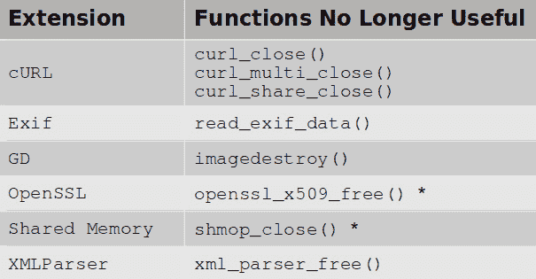
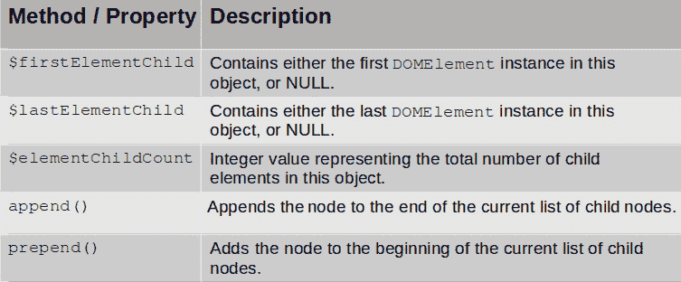
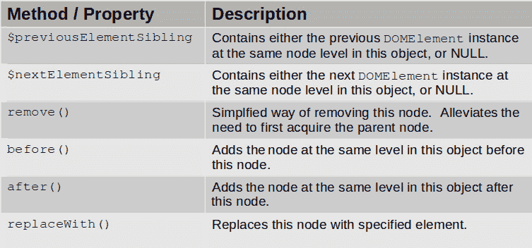
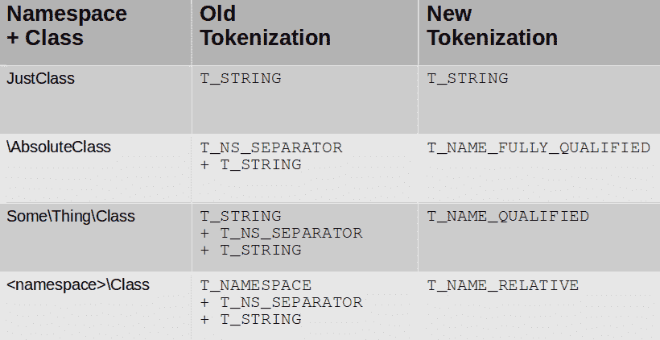

# *第九章*：精通 PHP 8 最佳实践

在本章中，您将了解到目前在 PHP 8 中强制执行的最佳实践。我们将涵盖几个重要的方法签名更改，以及它们的新用法如何延续了 PHP 的一般趋势，帮助您编写更好的代码。我们还将看一下私有方法、接口、特征和匿名类的使用方式发生了什么变化。最后，我们将讨论命名空间解析的重要变化。

掌握本章将涵盖的最佳实践不仅会让您更接近编写更好的代码，还会让您了解如何避免如果未掌握这些新实践可能导致的潜在代码破坏。此外，本章讨论的技术将帮助您编写比过去更高效的代码。

在本章中，我们将涵盖以下主题：

+   发现方法签名更改

+   处理私有方法

+   使用接口和特征

+   控制匿名类的使用

+   理解命名空间的变化

# 技术要求

要查看并运行本章提供的代码示例，建议的最低硬件配置如下：

+   基于 X86_64 的台式 PC 或笔记本电脑

+   1 GB 的可用磁盘空间

+   4 GB 的 RAM

+   500 Kbps 或更快的互联网连接

此外，您需要安装以下软件：

+   Docker

+   Docker Compose

有关如何安装 Docker 和 Docker Compose 以及构建用于演示本书中代码的 Docker 容器的更多信息，请参阅*第一章*的*技术要求*部分，*介绍新的 PHP 8 面向对象编程特性*。在本书中，我们将把您恢复示例代码的目录称为`/repo`。

本章的源代码位于此处：[`github.com/PacktPublishing/PHP-8-Programming-Tips-Tricks-and-Best-Practices`](https://github.com/PacktPublishing/PHP-8-Programming-Tips-Tricks-and-Best-Practices)。我们将首先检查重要的方法签名更改。

# 发现方法签名更改

PHP 8 引入了几个**方法签名更改**。如果您的代码扩展了本节描述的任何类或实现了任何方法，了解这些签名更改是很重要的。只要您了解了这些更改，您的代码将正常运行，从而减少错误。

PHP 8 中引入的签名更改反映了更新的*最佳实践*。因此，如果您编写使用正确方法签名的代码，您就是在遵循这些最佳实践。我们将从回顾 PHP 8 对魔术方法签名的更改开始我们的讨论。

## 管理魔术方法签名

在 PHP 8 中，**魔术方法**的定义和使用已经朝着标准化迈出了重要的一步。这是通过引入严格的参数和返回数据类型的精确魔术方法签名来实现的。与 PHP 8 中的大多数改进一样，这次更新旨在防止魔术方法的误用。总体结果是更好的代码，更少的错误。

这种增强的缺点是，如果您的代码提供了不正确的参数或返回值类型，将会抛出`Error`。另一方面，如果您的代码提供了正确的参数数据类型和返回值数据类型，或者如果您的代码根本不使用参数或返回值数据类型，这种增强将不会产生不良影响。

以下代码块总结了 PHP 8 及以上版本中魔术方法的新参数和返回值数据类型：

```php
__call(string $name, array $arguments): mixed;
__callStatic(string $name, array $arguments): mixed;
__clone(): void;
__debugInfo(): ?array;
__get(string $name): mixed;
__invoke(mixed $arguments): mixed;
__isset(string $name): bool;
__serialize(): array;
__set(string $name, mixed $value): void;
__set_state(array $properties): object;
__sleep(): array;
__unserialize(array $data): void;
__unset(string $name): void;
__wakeup(): void;
```

现在，让我们看一下三个简单的例子，说明魔术方法签名更改的影响：

1.  第一个例子涉及`NoTypes`类，该类定义了`__call()`但没有定义任何数据类型：

```php
// /repo/ch09/php8_bc_break_magic.php
class NoTypes {
    public function __call($name, $args) {
        return "Attempt made to call '$name' "
             . "with these arguments: '"
             . implode(',', $args) . "'\n";
    }
}
$no = new NoTypes();
echo $no->doesNotExist('A','B','C');
```

1.  以下示例（与前面的示例在同一个文件中）是`MixedTypes`类的示例，它定义了`__invoke()`，但使用的是`array`数据类型而不是`mixed`。

```php
class MixedTypes {
    public function __invoke(array $args) : string {
        return "Arguments: '"
             . implode(',', $args) . "'\n";
    }
}
$mixed= new MixedTypes();
echo $mixed(['A','B','C']);
```

这是在前面步骤中显示的代码示例的 PHP 7 输出：

```php
root@php8_tips_php7 [ /repo/ch09 ]# 
php php8_bc_break_magic.php 
Attempt made to call 'doesNotExist' with these arguments: 'A,B,C'
Arguments: 'A,B,C'
```

这是在 PHP 8 下运行的相同代码示例：

```php
root@php8_tips_php8 [ /repo/ch09 ]# 
php php8_bc_break_magic.php 
Attempt made to call 'doesNotExist' with these arguments: 'A,B,C'
Arguments: 'A,B,C'
```

正如您所看到的，这两组输出是相同的。第一个显示的类`NoTypes`之所以有效，是因为没有定义数据类型提示。有趣的是，`MixedTypes`类在 PHP 8 及以下版本中都可以工作，因为新的`mixed`数据类型实际上是所有类型的联合。因此，您可以安全地在`mixed`的位置使用任何特定的数据类型。

1.  在我们的最后一个例子中，我们将定义`WrongType`类。在这个类中，我们将定义一个名为`__isset()`的魔术方法，使用一个与 PHP 8 要求不匹配的返回数据类型。在这里，我们使用的是`string`，而在 PHP 8 中，它的返回类型需要是`bool`：

```php
// /repo/ch09/php8_bc_break_magic_wrong.php
class WrongType {
    public function __isset($var) : string {
        return (isset($this->$var)) ? 'Y' : '';
    }
}
$wrong = new WrongType();
echo (isset($wrong->nothing)) ? 'Set' : 'Not Set';
```

这个例子在 PHP 7 中可以工作，因为它依赖于这样一个事实：如果变量未设置，则在这个例子中返回空字符串，然后被插入为`FALSE`布尔值。这是 PHP 7 的输出：

```php
root@php8_tips_php7 [ /repo/ch09 ]# 
php php8_bc_break_magic_wrong.php 
Not Set
```

然而，在 PHP 8 中，由于魔术方法签名现在是标准化的，所以这个例子失败了，如下所示：

```php
root@php8_tips_php8 [ /repo/ch09 ]# 
php php8_bc_break_magic_wrong.php
PHP Fatal error:  WrongTypes::__isset(): Return type must be bool when declared in /repo/ch09/php8_bc_break_magic_wrong.php on line 6
```

正如您所看到的，PHP 8 严格执行其魔术方法签名。

提示

*最佳实践*：修改任何使用魔术方法的代码，以遵循新的严格方法签名。有关严格魔术方法签名的更多信息，请访问[`wiki.php.net/rfc/magic-methods-signature`](https://wiki.php.net/rfc/magic-methods-signature)。

现在您已经知道要查找什么以及如何纠正涉及魔术方法的潜在代码中断。现在，让我们看一下 Reflection 扩展方法签名的更改。

## 检查 Reflection 方法签名的更改

如果您的应用程序使用`invoke()`或`newInstance()` Reflection 扩展方法，则可能会发生向后兼容的代码中断。在 PHP 7 及以下版本中，下面列出的三种方法都接受无限数量的参数。但是，在方法签名中，只列出了一个参数，如下所示：

+   `ReflectionClass::newInstance($args)`

+   `ReflectionFunction::invoke($args)`

+   `ReflectionMethod::invoke($args)`

在 PHP 8 中，方法签名准确地反映了现实，即`$args`之前有`variadics`运算符。以下是新的方法签名：

+   `ReflectionClass::newInstance(...$args)`

+   `ReflectionFunction::invoke(...$args)`

+   `ReflectionMethod::invoke($object, ...$args)`

只有当您的自定义类扩展了这三个类中的任何一个，并且您的自定义类还覆盖了前面列出的三种方法时，这种更改才会破坏您的代码。

最后，`isBuiltin()`方法已从`ReflectionType`移动到`ReflectionNamedType`。如果您使用`ReflectionType::isBuiltIn()`，这可能会导致潜在的代码中断。

现在，让我们看看 PDO 扩展中的方法签名更改。

## 处理 PDO 扩展签名更改

PDO 扩展有两个重要的方法签名更改。这些更改是为了解决在应用不同的**获取模式**时方法调用的不一致性。这是`PDO::query()`的新方法签名：

```php
PDO::query(string $query, 
    ?int $fetchMode = null, mixed ...$fetchModeArgs)
```

这是`PDOStatement::setFetchMode()`的新签名：

```php
PDOStatement::setFetchMode(int $mode, mixed ...$args)
```

提示

`PDO::query()`方法签名更改在 PHP 7.4 到 PHP 8 迁移指南中有所提及，链接在这里：https://www.php.net/manual/en/migration80.incompatible.php#migration80.incompatible.pdo。

这两个新的方法签名比旧的方法签名更加统一，并且完全涵盖了在使用不同的获取模式时的语法差异。一个简单的代码示例，使用两种不同的获取模式执行`PDO::query()`，说明了为什么需要规范化方法签名：

1.  让我们从包含一个包含数据库连接参数的配置文件开始。从这个文件，我们将创建一个`PDO`实例：

```php
// /repo/ch09/php8_pdo_signature_change.php
$config = include __DIR__ . '/../src/config/config.php';
$db_cfg = $config['db-config'];
$pdo    = new PDO($db_cfg['dsn'], 
    $db_cfg['usr'], $db_cfg['pwd']);
```

1.  现在，让我们定义一个 SQL 语句并发送它以便进行准备：

```php
$sql    = 'SELECT hotelName, city, locality, '
        . 'country, postalCode FROM hotels '
        . 'WHERE country = ? AND city = ?';
$stmt   = $pdo->prepare($sql);
```

1.  接下来，我们将执行准备好的语句，并将获取模式设置为`PDO::FETCH_ASSOC`。请注意，当我们使用此获取模式时，`setFetchMode()`方法只提供一个参数：

```php
$stmt->execute(['IN', 'Budhera']);
$stmt->setFetchMode(PDO::FETCH_ASSOC);
while ($row = $stmt->fetch()) var_dump($row);
```

1.  最后，我们将再次执行相同的预处理语句。这次，我们将将获取模式设置为`PDO::FETCH_CLASS`。请注意，当我们使用此获取模式时，`setFetchMode()`方法提供了两个参数：

```php
$stmt->execute(['IN', 'Budhera']);
$stmt->setFetchMode(
    PDO::FETCH_CLASS, ArrayObject::class);
while ($row = $stmt->fetch()) var_dump($row);
```

第一个查询的输出是一个关联数组。第二个查询产生一个`ArrayObject`实例。以下是输出：

```php
root@php8_tips_php8 [ /repo/ch09 ]# 
php php8_pdo_signature_change.php 
array(5) {
  ["hotelName"]=>  string(10) "Rose Lodge"
  ["city"]=>  string(7) "Budhera"
  ["locality"]=>  string(7) "Gurgaon"
  ["country"]=>  string(2) "IN"
  ["postalCode"]=>  string(6) "122505"
}
object(ArrayObject)#3 (6) {
  ["hotelName"]=>  string(10) "Rose Lodge"
  ["city"]=>  string(7) "Budhera"
  ["locality"]=>  string(7) "Gurgaon"
  ["country"]=>  string(2) "IN"
  ["postalCode"]=>  string(6) "122505"
  ["storage":"ArrayObject":private]=>  array(0) {  }
}
```

重要的是要注意，即使方法签名已经改变，您可以保持现有的代码不变：这*不会*导致向后兼容的代码中断！

现在，让我们来看一下被声明为`static`的方法。

## 处理新定义的静态方法

在 PHP 8 中看到的另一个可能重大的变化是，现在有几个方法被声明为`static`。如果您已经使用这里描述的类和方法作为直接对象实例，那么您就没有问题。

以下方法现在被声明为静态：

+   `tidy::repairString()`

+   `tidy::repairFile()`

+   `XMLReader::open()`

+   `XMLReader::xml()`

如果您覆盖了之前提到的类中的一个方法，可能会导致代码中断。在这种情况下，您*必须*将被覆盖的方法声明为`static`。以下是一个简单的示例，说明了可能的问题：

1.  首先，让我们定义一个具有不匹配的`<div>`标签的字符串：

```php
// /repo/ch08/php7_tidy_repair_str_static.php
$str = <<<EOT
<DIV>
    <Div>Some Content</div>
    <Div>Some Other Content
</div>
EOT;
```

1.  然后，定义一个匿名类，该类扩展了`tidy`，修复了字符串，并返回所有 HTML 标签都是小写的字符串：

```php
$class = new class() extends tidy {
    public function repairString($str) {
        $fixed = parent::repairString($str);
        return preg_replace_callback(
            '/<+?>/',
            function ($item) { 
                return strtolower($item); },
            $fixed);
    }
};
```

1.  最后，输出修复后的字符串：

```php
echo $class->repairString($str);
```

如果我们在 PHP 7 中运行此代码示例，输出将如下所示：

```php
root@php8_tips_php7 [ /repo/ch09 ]# 
php php7_tidy_repair_str_static.php 
<!DOCTYPE html>
<html>
<head>
<title></title>
</head>
<body>
<div>
<div>Some Content</div>
<div>Some Other Content</div>
</div>
</body>
</html>
```

正如您所看到的，不匹配的`<div>`标签已经修复，生成了一个格式正确的 HTML 文档。您还会注意到所有标签都是小写的。

然而，在 PHP 8 中，出现了一个方法签名问题，如下所示：

```php
root@php8_tips_php8 [ /repo/ch09 ]# 
php php7_tidy_repair_str_static.php 
PHP Fatal error:  Cannot make static method tidy::repairString() non static in class tidy@anonymous in /repo/ch09/php7_tidy_repair_str_static.php on line 11
```

正如您在 PHP 8 中所看到的，`repairString()`方法现在被声明为`static`。我们之前定义的匿名类中`repairString()`的方法签名需要重写，如下所示：

```php
public static function repairString(
    string $str, 
    array|string|null $config = null, 
    ?string $encoding = null) { // etc.
```

重写后的输出与之前显示的 PHP 7 输出相同（未显示）。还要注意，最后一行现在也可以写成如下形式：

```php
echo $class::repairString($str);
```

现在您已经了解了新定义为静态的方法，让我们来看一个相关主题；即，静态返回类型。

## 处理静态返回类型

在 PHP 中，`static`关键字在几个上下文中使用。它的基本用法超出了本讨论的范围。在本节中，我们将重点关注`static`作为返回数据类型的新用法。

由于`static`被认为是`self`的子类型，它可以用于扩展`self`的较窄返回类型。然而，`static`关键字不能用作类型提示，因为这将违反*Liskov 替换原则*。这也会让开发人员感到困惑，因为`static`已经在太多其他上下文中使用了。

提示

以下文章描述了在引入静态返回类型之前的背景讨论：[`wiki.php.net/rfc/static_return_type`](https://wiki.php.net/rfc/static_return_type)。以下文档引用了延迟静态绑定：[`www.php.net/manual/en/language.oop5.late-static-bindings.php`](https://www.php.net/manual/en/language.oop5.late-static-bindings.php)。*Liskov 替换原则*在*第五章*，*发现潜在的 OOP 向后兼容性中断*中有讨论，在*理解扩展的 PHP 8 方差支持*部分。

这种新的返回数据类型最常见的用法是在使用**流畅接口**的类中。后者是一种技术，其中对象方法返回当前对象状态的实例，从而允许以*流畅*（可读）的方式使用一系列方法调用。在下面的例子中，请注意对象如何构建 SQL `SELECT`语句：

1.  首先，我们必须定义一个`Where`类，它接受无限数量的参数来形成 SQL `WHERE`子句。注意`static`的返回数据类型：

```php
// /src/Php8/Sql/Where.php
namespace Php8\Sql;
class Where {
    public $where = [];
    public function where(...$args) : static {
        $this->where = array_merge($this->where, $args);
        return $this;
    }
    // not all code is shown
}
```

1.  现在，让我们定义主类`Select`，它提供了构建 SQL `SELECT`语句部分的方法。再次注意，所示的方法都返回当前类实例，并且返回数据类型为`static`：

```php
// /src/Php8/Sql/Select.php
namespace Php8\Sql;
class Select extends Where {
    public $from  = '';
    public $limit  = 0;
    public $offset  = 0;
    public function from(string $table) : static {
        $this->from = $table;
        return $this;
    }
    public function order(string $order) : static {
        $this->order = $order;
        return $this;
    }
    public function limit(int $num) : static {
        $this->limit = $num;
        return $this;
    }
    // not all methods and properties are shown
}
```

1.  最后，我们必须定义一个调用程序，提供构建 SQL 语句所需的值。请注意，`echo`语句使用流畅接口，使得以编程方式创建 SQL 语句更容易理解：

```php
// /repo/ch09/php8_static_return_type.php
require_once __DIR__ 
    . '/../src/Server/Autoload/Loader.php';
$loader = new \Server\Autoload\Loader();
use Php8\Sql\Select;
$start = "'2021-06-01'";
$end   = "'2021-12-31'";
$select = new Select();
echo $select->from('events')
           ->cols(['id', 'event_name', 'event_date'])
           ->limit(10)
           ->where('event_date', '>=', $start)
           ->where('AND', 'event_date', '<=', $end)
           ->render();
```

这是在 PHP 8 中运行代码示例的输出：

```php
root@php8_tips_php8 [ /repo/ch09 ]# 
php php8_static_return_type.php 
SELECT id,event_name,event_date FROM events WHERE event_date >= '2021-06-01' AND event_date <= '2021-12-31' LIMIT 10
```

当然，这个例子在 PHP 7 中不起作用，因为`static`关键字不可用作返回数据类型。接下来，让我们来看看特殊的`::class`常量的扩展使用。

## 扩展使用::class 常量

特殊的`::class`常量是一个非常有用的构造，因为它可以悄悄地扩展为完整的命名空间加类名字符串。了解它的用法，以及它在 PHP 8 中的扩展用法，可以节省大量时间。它的使用也可以使你的代码更易读，特别是当你处理冗长的命名空间和类名时。

特殊的`::class`常量是**作用域解析操作符**(`::`)和`class`关键字的组合。然而，与`::parent`、`::self`和`::static`不同，`::class`构造可以在类定义之外使用。在某种意义上，`::class`构造是一种*魔术常量*，因为它会导致与其关联的类在编译时魔术般地扩展为完整的命名空间加类名。

在我们深入探讨它在 PHP 8 中的扩展使用之前，让我们先看看它的常规用法。

### 常规::class 常量使用

特殊的`::class`常量经常在你有一个冗长的命名空间并且希望不仅节省大量不必要的输入，而且保持源代码的可读性的情况下使用。

在这个简单的例子中，使用`Php7\Image\Strategy`命名空间，我们希望创建一个策略类的列表：

1.  首先，让我们确定命名空间并设置自动加载程序：

```php
// /repo/ch09/php7_class_normal.php
namespace Php7\Image\Strategy;
require_once __DIR__ 
    . '/../src/Server/Autoload/Loader.php';
$autoload = new \Server\Autoload\Loader();
```

1.  在特殊的`::class`常量被引入之前，要生成完整命名空间类名的列表，你必须将其全部写成字符串，如下所示：

```php
$listOld = [
    'Php7\Image\Strategy\DotFill',
    'Php7\Image\Strategy\LineFill',
    'Php7\Image\Strategy\PlainFill',
    'Php7\Image\Strategy\RotateText',
    'Php7\Image\Strategy\Shadow'
];
print_r($listOld);
```

1.  使用特殊的`::class`常量，你可以减少所需的输入量，也可以使代码更易读，如下所示：

```php
$listNew = [
    DotFill::class,
    LineFill::class,
    PlainFill::class,
    RotateText::class,
    Shadow::class
];
print_r($listNew);
```

如果我们运行这个代码示例，我们会看到两个列表在 PHP 7 和 PHP 8 中是相同的。这是 PHP 7 的输出：

```php
root@php8_tips_php7 [ /repo/ch09 ]# 
php php7_class_normal.php 
Array (
    [0] => Php7\Image\Strategy\DotFill
    [1] => Php7\Image\Strategy\LineFill
    [2] => Php7\Image\Strategy\PlainFill
    [3] => Php7\Image\Strategy\RotateText
    [4] => Php7\Image\Strategy\Shadow
)
Array (
    [0] => Php7\Image\Strategy\DotFill
    [1] => Php7\Image\Strategy\LineFill
    [2] => Php7\Image\Strategy\PlainFill
    [3] => Php7\Image\Strategy\RotateText
    [4] => Php7\Image\Strategy\Shadow
)
```

正如你所看到的，特殊的`::class`常量会导致类名在编译时扩展为完整的命名空间加类名，从而使两个列表包含相同的信息。

现在，让我们来看看 PHP 8 中特殊的`::class`常量的用法。

### 扩展特殊::class 常量的使用

与 PHP 8 中看到的其他语法统一改进一致，现在可以在活动对象实例上使用特殊的`::class`常量。虽然效果与使用`get_class()`相同，但使用特殊的`::class`常量作为远离过程化向面向对象编程的一般最佳实践的一部分是有意义的。

在这个例子中，扩展的`::class`语法用于确定抛出的错误类型：

1.  当抛出`Error`或`Exception`时，最佳实践是在错误日志中记录条目。在这个例子中，在 PHP 7 和 PHP 8 中都有效，这个`Error`或`Exception`的类名被包含在日志消息中：

```php
// /repo/ch09/php7_class_and_obj.php
try {
    $pdo = new PDO();
    echo 'No problem';
} catch (Throwable $t) {
    $msg = get_class($t) . ':' . $t->getMessage();
    error_log($msg);
}
```

1.  在 PHP 8 中，您可以通过重新编写示例来实现相同的结果，如下所示：

```php
// /repo/ch09/php8_class_and_obj.php
try {
    $pdo = new PDO();
    echo 'No problem';
} catch (Throwable $t) {
    $msg = $t::class . ':' . $t->getMessage();
    error_log($msg);
}
```

从第二个代码块中可以看出，语法更加简洁，避免了使用过程函数。然而，我们必须强调，在这个例子中，并没有性能上的提升。

现在您已经了解了特殊`::class`常量使用的变化，让我们快速看一下逗号。

## 利用尾随逗号

长期以来，PHP 允许在定义数组时使用尾随逗号。例如，下面显示的语法并不罕见：

```php
$arr = [1, 2, 3, 4, 5,];
```

然而，在函数或方法签名中做同样的事情是不允许的：

```php
function xyz ($fn, $ln, $mid = '',) { /* code */ }
```

虽然这并不是什么大不了的事，但在定义数组时能够添加尾随逗号，但在函数或方法签名中却不允许同样的自由，这是令人恼火的！

PHP 8 现在允许您在函数和方法签名中都使用尾随逗号。新规则也适用于与匿名函数相关的`use()`语句。

为了说明这种变化，考虑以下例子。在这个例子中，定义了一个匿名函数来渲染一个全名：

```php
// /repo/ch09/php8_trailing_comma.php
$full = function ($fn, $ln, $mid = '',) {
    $mi = ($mid) ? strtoupper($mid[0]) . '. ' : '';
    return $fn . ' ' . $mi . $ln;
};
echo $full('Fred', 'Flintstone', 'John');
```

如您所见，匿名函数的第三个参数后面有一个逗号。以下是 PHP 7 的输出：

```php
root@php8_tips_php7 [ /repo/ch09 ]# 
php php8_trailing_comma.php 
PHP Parse error:  syntax error, unexpected ')', expecting variable (T_VARIABLE) in /repo/ch09/php8_trailing_comma.php on line 4
```

在 PHP 8 中，允许使用尾随逗号，并且预期的输出如下所示：

```php
root@php8_tips_php8 [ /repo/ch09 ]# 
php php8_trailing_comma.php 
Fred J. Flintstone
```

虽然在函数或方法定义中使用尾随逗号不一定是最佳实践，但它确实使 PHP 8 在对待尾随逗号的整体处理上保持一致。

现在，让我们把注意力转向仍然存在但不再有任何用处的方法。

## 学习不再需要的方法

主要是由于 PHP 8 资源到对象的迁移，许多函数和方法不再需要。在撰写本文时，它们并没有被弃用，但这些函数不再具有任何实际用途。

类比一下，在 PHP 8 之前的版本中，您会使用`fopen()`来打开一个文件句柄资源。完成文件操作后，您通常会使用`fclose()`关闭文件句柄资源的连接。

现在，假设您使用`SplFileObject`而不是`fopen()`。当文件操作完成后，您可以简单地取消对象。这与使用`fclose()`达到了相同的效果，使`fclose()`变得多余。

下表总结了存在但在 PHP 8 中不再具有任何实际价值的函数。带有星号标记的函数也已被弃用：



表 9.1 - 不再有用的函数

现在您已经了解了 PHP 8 中主要方法签名和用法的变化，让我们来看看在使用接口和特征时需要考虑的最佳实践。

# 使用接口和特征

PHP 8 特性实现在几个方面得到了扩展。还有一些新的接口可能会改变您使用 DOM 和 DateTime 扩展的方式。在大多数情况下，这些变化提高了这两个扩展的功能。然而，由于某些情况下方法签名已经改变，可能会出现潜在的代码中断。因此，重要的是要密切关注本节中提出的讨论，以确保现有和未来的 PHP 代码保持功能正常。

首先，让我们来看看新的 DOM 扩展接口。

## 发现新的 DOM 扩展接口

*生活成本*经济统计数据每年由许多世界政府发布。它描述了一个普通公民每年生活的成本。随着网络技术的成熟，类似的原则已被应用 - 首先是 HTML，现在是 DOM。**DOM Living Standard**由**Web Hypertext Application Technology Working Group**（**WHATWG**）维护（[`whatwg.org/`](https://whatwg.org/)）。

这些信息对 PHP 开发人员重要的原因是，在 PHP 8 中，决定将 PHP DOM 扩展移动到 DOM Living Standard。因此，从 PHP 8 开始，将根据最新标准的变化对这个扩展进行一系列增量和持续的更改。

在很大程度上，这些变化是向后兼容的。然而，由于一些方法签名的变化以保持符合标准，可能会导致代码中断。在 PHP 8 中对 DOM 扩展最重要的变化是引入了两个新接口。让我们来检查这些接口，然后讨论它们对 PHP 开发的影响。

### 检查新的 DOMParentNode 接口

两个新接口中的第一个是**DOMParentNode**。以下类在 PHP 8 中实现了这个接口：

+   `DOMDocument`

+   `DOMElement`

+   `DOMDocumentFragment`

这是接口定义：

```php
interface DOMParentNode {
    public readonly ?DOMElement $firstElementChild;
    public readonly ?DOMElement $lastElementChild;
    public readonly int $childElementCount;
    public function append(
        ...DOMNode|string|null $nodes) : void;
    public function prepend(
        ...DOMNode|string|null $nodes) : void;
}
```

重要的是要注意，对于 PHP 开发人员来说，没有*readonly*属性可用。然而，接口规范将属性显示为只读，因为它们是内部生成的，不能被更改。

提示

实际上，2014 年曾提出了一个 PHP RFC，建议为类属性添加*readonly*属性。然而，这个提案被撤回，因为可以通过定义常量或简单地将属性标记为`private`来实现相同的效果！有关此提案的更多信息，请参见[`wiki.php.net/rfc/readonly_properties`](https://wiki.php.net/rfc/readonly_properties)。

以下表总结了新的`DOMParentNode`接口的属性和方法：



表 9.2 – DOMParentNode 接口方法和属性

新接口所代表的功能并没有为现有的 DOM 功能增加任何新内容。它的主要目的是使 PHP DOM 扩展符合最新的标准。

提示

将来，对 DOM 扩展进行架构上的改造还有另一个目的。在未来的 PHP 版本中，DOM 扩展将有能力操作整个 DOM 树的一个分支。例如，在未来，当你发出`append()`时，你将能够附加不仅仅是一个节点，还有它的所有子节点。有关更多信息，请参见以下 RFC：[`wiki.php.net/rfc/dom_living_standard_api`](https://wiki.php.net/rfc/dom_living_standard_api)。

现在，让我们看看第二个新接口。

### 检查新的 DOMChildNode 接口

两个新接口中的第二个是**DOMChildNode**。`DOMElement`和`DOMCharacterData`类在 PHP 8 中实现了这个接口。

这是接口定义：

```php
interface DOMChildNode {
    public readonly ?DOMElement $previousElementSibling;
    public readonly ?DOMElement $nextElementSibling;
    public function remove() : void;
    public function before(
        ...DOMNode|string|null $nodes) : void;
    public function after(
        ...DOMNode|string|null $nodes) : void;
    public function replaceWith(
        ...DOMNode|string|null $nodes) : void;
}
```

以下表总结了`DOMChildNode`的方法和属性：



表 9.3 – DOMChildNode 接口方法和属性

在这种情况下，功能与现有的 DOM 功能略有不同。最重要的变化是`DOMChildNode::remove()`。在 PHP 8 之前，要删除一个节点，你必须访问它的父节点。假设`$topic`是一个`DOMElement`实例，PHP 7 或更早的代码可能如下所示：

```php
$topic->parentNode->removeChild($topic);
```

在 PHP 8 中，相同的代码可以写成如下形式：

```php
$topic->remove();
```

除了前面显示的两个表中提到的新方法之外，DOM 功能保持不变。现在，让我们看看如何在 PHP 8 中重写移动子节点以利用新接口。

### DOM 使用示例 – 比较 PHP 7 和 PHP 8

为了说明新接口的使用，让我们看一个代码示例。在本节中，我们将呈现一段使用 DOM 扩展来将代表`Topic X`的节点从一个文档移动到另一个文档的代码块：

1.  这是一个包含一组嵌套的`<div>`标签的 HTML 片段：

```php
<!DOCTYPE html>
<!-- /repo/ch09/dom_test_1.html -->
<div id="content">
<div id="A">Topic A</div>
<div id="B">Topic B</div>
<div id="C">Topic C</div>
<div id="X">Topic X</div>
</div>
```

1.  第二个 HTML 片段包括主题 D、E 和 F：

```php
<!DOCTYPE html>
<!-- /repo/ch09/dom_test_2.html -->
<div id="content">
<div id="D">Topic D</div>
<div id="E">Topic E</div>
<div id="F">Topic F</div>
</div>
```

1.  从这两个片段中创建`DOMDocument`实例，我们可以进行静态调用；也就是`loadHTMLFile`。请注意，这种用法在 PHP 7 中已经被弃用，并在 PHP 8 中被移除了。

```php
$doc1 = DomDocument::loadHTMLFile( 'dom_test_1.html');
$doc2 = DomDocument::loadHTMLFile('dom_test_2.html');
```

1.  然后，我们可以将`Topic X`提取到`$topic`中，并将其导入到第二个文档中作为`$new`。接下来，检索目标节点；也就是`content`：

```php
$topic = $doc1->getElementById('X');
$new = $doc2->importNode($topic);
$new->textContent= $topic->textContent;
$main = $doc2->getElementById('content');
```

1.  这是 PHP 7 和 PHP 8 开始有所不同的地方。在 PHP 7 中，要移动节点，代码必须如下所示：

```php
// /repo/ch09/php7_dom_changes.php
$main->appendChild($new);
$topic->parentNode->removeChild($topic);
```

1.  然而，在 PHP 8 中，当使用新接口时，代码更加紧凑。在 PHP 8 中，不需要引用父节点来移除主题。

```php
// /repo/ch09/php8_dom_changes.php
$main->append($new);
$topic->remove();
```

1.  对于 PHP 7 和 PHP 8，我们可以这样查看生成的 HTML：

```php
echo $doc1->saveHTML();
echo $doc2->saveHTML();
```

1.  另一个不同之处是如何提取`$main`的新最后一个子元素的值。在 PHP 7 中可能如下所示：

```php
// /repo/ch09/php7_dom_changes.php
echo $main->lastChild->textContent . "\n";
```

1.  在 PHP 8 中也是一样的：

```php
// /repo/ch09/php8_dom_changes.php
echo $main->lastElementChild->textContent . "\n";
```

这两个代码示例的输出略有不同。在 PHP 7 中，您将看到一个弃用通知，如下所示：

```php
root@php8_tips_php7 [ /repo/ch09 ]# php php7_dom_changes.php 
PHP Deprecated:  Non-static method DOMDocument::loadHTMLFile() should not be called statically in /repo/ch09/php7_dom_changes.php on line 6
```

如果我们尝试在 PHP 8 中运行 PHP 7 代码，将会抛出致命的`Error`，因为`loadHTMLFile()`方法的静态使用不再被允许。否则，如果我们运行纯 PHP 8 示例，输出将如下所示：

```php
root@php8_tips_php8 [ /repo/ch09 ]# php php8_dom_changes.php 
<!DOCTYPE html>
<html><body><div id="content">
<div id="A">Topic A</div>
<div id="B">Topic B</div>
<div id="C">Topic C</div>
</div>
</body></html>
<!DOCTYPE html>
<html><body><div id="content">
<div id="D">Topic D</div>
<div id="E">Topic E</div>
<div id="F">Topic F</div>
<div id="X">Topic X</div></div>
</body></html>
Last Topic in Doc 2: Topic X
```

如您所见，在任何情况下，`Topic X`都从第一个 HTML 片段移动到了第二个片段中。

在未来的 PHP 版本中，预计 DOM 扩展将继续增长，同时遵循 DOM 的生存标准。此外，它的使用将变得更加容易，提供更多的灵活性和效率。

现在，让我们关注`DateTime`扩展中的变化。

## 使用新的 DateTime 方法

在处理日期和时间时，通常很有用创建`DateTimeImmutable`实例。`DateTimeImmutable`对象与`DateTime`对象相同，只是它们的属性值不能被改变。知道如何在`DateTime`和`DateTimeImmutable`之间来回切换是一种有用的技巧，可以避免许多隐藏的逻辑错误。

在讨论 PHP 8 中的改进之前，让我们先看看`DateTimeImmutable`解决的潜在问题。

### DateTimeImmutable 的用例

在这个简单的例子中，将创建一个包含今天之后 30、60 和 90 天的三个实例的数组。这些将被用来形成一个 30-60-90 天应收账款老化报告的基础。

1.  首先，让我们初始化一些代表间隔、日期格式和保存最终值的数组的关键变量：

```php
// /repo/ch09/php7_date_time_30-60-90.php
$days  = [0, 30, 60, 90];
$fmt   = 'Y-m-d';
$aging = [];
```

1.  现在，让我们定义一个循环，将间隔添加到`DateTime`实例中，以产生（希望如此！）表示 0、30、60 和 90 天的数组。经验丰富的开发人员很可能已经发现了问题！

```php
$dti = new DateTime('now');
foreach ($days as $span) {
    $interval = new DateInterval('P' . $span . 'D');
    $item = $dti->add($interval);
    $aging[$span] = clone $item;
}
```

1.  接下来，显示已生成的日期集合：

```php
echo "Day\tDate\n";
foreach ($aging as $key => $obj)
    echo "$key\t" . $obj->format($fmt) . "\n";
```

1.  这里显示的输出是一场完全的灾难：

```php
root@php8_tips_php7 [ /repo/ch09 ]# 
php php7_date_time_30-60-90.php 
Day    Date
0    2021-11-20
30    2021-06-23
60    2021-08-22
90    2021-11-20
```

如您所见，问题在于`DateTime`类不是不可变的。因此，每次添加`DateInterval`时，原始值都会被改变，导致显示的日期不准确。

1.  然而，通过进行一个简单的改变，我们可以解决这个问题。我们只需要创建一个`DateTimeImmutable`实例，而不是最初创建一个`DateTime`实例：

```php
$dti = new DateTimeImmutable('now');
```

1.  然而，要用`DateTime`实例填充数组，我们需要将`DateTimeImmutable`转换为`DateTime`。在 PHP 7.3 中，引入了`DateTime::createFromImmutable()`方法。因此，当值被赋给`$aging`时，修改后的代码可能如下所示：

```php
$aging[$span] = DateTime::createFromImmutable($item);
```

1.  否则，您将被困在创建一个新的`DateTime`实例中，如下所示：

```php
$aging[$span] = new DateTime($item->format($fmt));
```

通过这一个改变，正确的输出将如下所示：

```php
Day    Date
0    2021-05-24
30    2021-06-23
60    2021-07-23
90    2021-08-22
```

现在你知道了`DateTimeImmutable`可能如何被使用，也知道了如何转换成`DateTime`。你会高兴地知道，在 PHP 8 中，通过引入`createFromInterface()`方法，这两种对象类型之间的转换变得更加容易了。

### 检查 createFromInterface()方法

在 PHP 8 中，转换 `DateTime` 和 `DateTimeImmutable` 之间变得更加容易。两个类都添加了一个名为 `createFromInterface()` 的新方法。该方法的签名只是要求一个 `DateTimeInterface` 实例，这意味着 `DateTime` 或 `DateTimeImmutable` 的实例都是这个方法的可接受参数。

以下简短的代码示例演示了在 PHP 8 中将一个类型转换为另一个类型是多么容易：

1.  首先，定义一个 `DateTimeImmutable` 实例并 `echo` 其类和日期：

```php
// /repo/ch09/php8_date_time.php
$fmt = 'l, d M Y';
$dti = new DateTimeImmutable('last day of next month');
echo $dti::class . ':' . $dti->format($fmt) . "\n";
```

1.  然后，从 `$dti` 创建一个 `DateTime` 实例，并添加 90 天的间隔，显示其类和当前日期：

```php
$dtt = DateTime::createFromInterface($dti);
$dtt->add(new DateInterval('P90D'));
echo $dtt::class . ':' . $dtt->format($fmt) . "\n";
```

1.  最后，从 `$dtt` 创建一个 `DateTimeImmutable` 实例并显示其类和日期：

```php
$dtx = DateTimeImmutable::createFromInterface($dtt);
echo $dtx::class . ':' . $dtx->format($fmt) . "\n";
```

以下是在 PHP 8 中运行此代码示例的输出：

```php
root@php8_tips_php8 [ /repo/ch09 ]# php php8_date_time.php 
DateTimeImmutable:Wednesday, 30 Jun 2021
DateTime:Tuesday, 28 Sep 2021
DateTimeImmutable:Tuesday, 28 Sep 2021
```

如您所见，我们使用相同的 `createFromInterface()` 方法来创建实例。当然，请记住，我们实际上并没有将类实例*转换*为另一个类实例。相反，我们创建了克隆实例，但是属于不同的类类型。

您现在知道为什么您可能希望使用 `DateTimeImmutable` 而不是 `DateTime`。您还知道在 PHP 8 中，一个名为 `createFromInterface()` 的新方法提供了一种统一的方式来创建一个类的实例。接下来，我们将看一下在 PHP 8 中如何改进 traits 的处理方式。

## 理解 PHP 8 中 traits 处理的改进

**Traits** 的实现首次出现在 PHP 版本 5.4 中。从那时起，不断进行了一系列的改进。PHP 8 继续这一趋势，通过提供一种明确识别多个 traits 具有冲突方法的方法来清楚地标识使用哪些方法。此外，除了消除可见性声明中的不一致性之外，PHP 8 还解决了 traits 处理（或未处理！）抽象方法的问题。

作为开发人员，完全掌握 traits 的使用能力使您能够编写更高效、更易于维护的代码。Traits 可以帮助您避免生成冗余的代码。它们解决了需要在命名空间之间或不同类继承结构之间使用相同逻辑的问题。本节中提供的信息使您能够在 PHP 8 下正确使用 traits。

首先，让我们看看 PHP 8 中如何解决 traits 之间的冲突。

### 解决 traits 之间的方法冲突

多个 traits 可以通过简单地用逗号分隔的 trait 名称列表来使用。然而，可能会出现一个问题，如果两个 traits 定义了相同的方法。为了解决这种冲突，PHP 提供了 `as` 关键字。在 PHP 7 及更低版本中，为了避免两个同名方法之间的冲突，您可以简单地重命名其中一个方法。执行重命名的代码可能如下所示：

```php
use Trait1, Trait2 { <METHOD> as <NEW_NAME>; }
```

然而，这种方法的问题在于，PHP 做出了一个悄悄的假设：`METHOD` 被假定来自 `Trait1`！为了继续执行良好的编码实践，PHP 8 不再允许这种假设。在 PHP 8 中的解决方案是更具体地使用 `insteadof` 而不是 `as`。

以下是说明这个问题的一个微不足道的例子：

1.  首先，让我们定义两个定义相同方法 `test()` 的 traits，但返回不同的结果：

```php
// /repo/ch09/php7_trait_conflict_as.php
trait Test1 {
    public function test() {
        return '111111';
    }
}
trait Test2 {
    public function test() {
        return '222222';
    }
}
```

1.  然后，定义一个匿名类，使用两个 traits 并将 `test()` 指定为 `otherTest()` 以避免命名冲突：

```php
$main = new class () {
    use Test1, Test2 { test as otherTest; }
    public function test() { return 'TEST'; }
};
```

1.  接下来，定义一个代码块来 `echo` 两个方法的返回值：

```php
echo $main->test() . "\n";
echo $main->otherTest() . "\n";
```

以下是在 PHP 7 中的输出：

```php
root@php8_tips_php7 [ /repo/ch09 ]# 
php php7_trait_conflict_as.php 
TEST
111111
```

如您所见，PHP 7 默默地假设我们的意思是将 `Trait1::test()` 重命名为 `otherTest()`。然而，从示例代码中，程序员的意图并不清楚！

在 PHP 8 中运行相同的代码示例，我们得到了不同的结果：

```php
root@php8_tips_php8 [ /repo/ch09 ]# 
php php7_trait_conflict_as.php 
PHP Fatal error:  An alias was defined for method test(), which exists in both Test1 and Test2\. Use Test1::test or Test2::test to resolve the ambiguity in /repo/ch09/php7_trait_conflict_as.php on line 6
```

显然，PHP 8 不会做出这样的悄悄假设，因为它们很容易导致意外行为。在这个例子中，最佳实践是使用作用域解析 (`::`) 运算符。以下是重写后的代码：

```php
$main = new class () {
    use Test1, Test2 { Test1::test as otherTest; }
    public function test() { return 'TEST'; }
};
```

如果我们在 PHP 8 中重新运行代码，输出将与 PHP 7 中显示的输出相同。作用域解析运算符确认`Trait1`是`test()`方法的源 trait，从而避免了任何歧义。现在，让我们看看 PHP 8 traits 如何处理抽象方法签名。

### 处理 trait 抽象签名检查

正如 API 开发人员所知，将方法标记为`abstract`是向 API 用户发出方法是必需的信号，但尚未定义。这种技术允许 API 开发人员不仅规定方法名称，还规定其签名。

然而，在 PHP 7 及更低版本中，在 trait 中定义的抽象方法会忽略签名，从而打败了使用抽象方法的初衷的一部分！当您在 PHP 8 中使用带有抽象方法的 trait 时，其签名将与使用该 trait 的类中的实现进行检查。

以下示例在 PHP 7 中有效，但在 PHP 8 中失败，因为方法签名不同：

1.  首先，让我们声明严格类型检查并定义一个带有抽象方法`add()`的 trait。请注意，方法签名要求所有数据类型都是整数：

```php
// /repo/ch09/php7_trait_abstract_signature.php
declare(strict_types=1);
trait Test1 {
    public abstract function add(int $a, int $b) : int;
}
```

1.  接下来，定义一个使用 trait 并定义`add()`的匿名类。请注意，类的数据类型都是`float`。

```php
$main = new class () {
    use Test1;
    public function add(float $a, float $b) : float {
        return $a + $b;
    }
};
```

1.  然后，输出添加`111.111`和`222.222`的结果：

```php
echo $main->add(111.111, 222.222) . "\n";
```

在 PHP 7 中运行的这个小代码示例的结果令人惊讶：

```php
root@php8_tips_php7 [ /repo/ch09 ]# 
php php7_trait_abstract_signature.php 
333.333
```

从结果中可以看出，在 trait 中抽象定义的方法签名完全被忽略了！然而，在 PHP 8 中，结果大不相同。以下是在 PHP 8 中运行代码的输出：

```php
root@php8_tips_php8 [ /repo/ch09 ]# 
php php7_trait_abstract_signature.php 
PHP Fatal error:  Declaration of class@anonymous::add(float $a, float $b): float must be compatible with Test1::add(int $a, int $b): int in /repo/ch09/php7_trait_abstract_signature.php on line 9
```

前面的 PHP 8 输出向我们展示了良好的编码实践是如何被强制执行的，无论抽象方法定义的来源如何。

本节的最后一个主题将向您展示如何处理 trait 中的抽象私有方法。

### 处理 trait 中的私有抽象方法

一般来说，在 PHP 中，您无法对抽象私有方法在抽象超类中施加控制，因为它不会被继承。然而，在 PHP 8 中，您可以在 trait 中定义一个抽象私有方法！当您进行 API 开发时，这可以用作代码执行机制，其中`using`类需要定义指定的私有方法。

请注意，尽管您可以在 PHP 8 trait 中将抽象方法指定为私有，但 trait 方法的可见性可以很容易地在使用 trait 的类中被覆盖。因此，在本节中我们不会展示任何代码示例，因为私有抽象 trait 方法的效果与在其他可见性级别使用抽象 trait 方法完全相同。

提示

有关 PHP 8 中处理 trait 抽象方法的更多信息，请查看此 RFC：[`wiki.php.net/rfc/abstract_trait_method_validation`](https://wiki.php.net/rfc/abstract_trait_method_validation)。

现在，让我们来看看私有方法的一般用法变化。

# 处理私有方法

开发人员创建超类的原因之一是对子类的方法签名施加一定程度的控制。在解析阶段，PHP 通常会确认方法签名是否匹配。这导致其他开发人员正确使用您的代码。

同样地，如果将方法标记为`private`，让 PHP 执行同样严格的方法签名检查是没有意义的。私有方法的目的是对扩展类不可见。如果您在扩展类中定义了同名方法，您应该可以自由定义它。

为了说明这个问题，让我们定义一个名为`Cipher`的类，其中包含一个名为`encrypt()`的私有方法。`OpenCipher`子类重新定义了这个方法，在 PHP 7 下运行时会导致致命错误：

1.  首先，让我们定义一个`Cipher`类，其构造函数为`$key`和`$salt`生成随机值。它还定义了一个名为`encode()`的公共方法，该方法调用了私有的`encrypt()`方法：

```php
// /repo/src/Php7/Encrypt/Cipher.php
namespace Php7\Encrypt;
class Cipher {
    public $key  = '';
    public $salt = 0;
    public function __construct() {
        $this->salt  = rand(1,255);
        $this->key   = bin2hex(random_bytes(8));
    }
    public function encode(string $plain) {
        return $this->encrypt($plain);
    }
```

1.  接下来，让我们定义一个名为`encrypt()`的私有方法，该方法使用`str_rot13()`生成加密文本。请注意，该方法标记为`final`。尽管这没有任何意义，但为了说明这一点，请假设这是有意的：

```php
    final private function encrypt(string $plain) {       
        return base64_encode(str_rot13($plain));
    }
}
```

1.  最后，让我们定义一个简短的调用程序，创建类实例并调用已定义的方法：

```php
// /repo/ch09/php7_oop_diffs_private_method.php
include __DIR__ . '/../src/Server/Autoload/Loader.php';
$loader = new \Server\Autoload\Loader();
use Php7\Encrypt\{Cipher,OpenCipher};
$text = 'Super secret message';
$cipher1 = new Cipher();
echo $cipher1->encode($text) . "\n";
$cipher2 = new OpenCipher();
var_dump($cipher2->encode($text));
```

如果我们在 PHP 7 中运行调用程序，将得到以下输出：

```php
oot@php8_tips_php7 [ /repo/ch09 ]# 
php php7_oop_diffs_private_method.php 
RmhjcmUgZnJwZXJnIHpyZmZudHI=
PHP Fatal error:  Cannot override final method Php7\Encrypt\Cipher::encrypt() in /repo/src/Php7/Encrypt/OpenCipher.php on line 21
```

在这里，您可以看到`Cipher`的输出已正确生成。但是，还抛出了一个致命的`Error`，并附带一条消息，说明我们无法覆盖`final`方法。理论上，私有方法应该对子类完全不可见。但是，从输出中可以清楚地看到，情况并非如此。`Cipher`超类的私有方法签名影响了我们在子类中重新定义相同方法的能力。

然而，在 PHP 8 中，这个悖论已经得到解决。以下是在 PHP 8 中运行相同代码的输出：

```php
root@php8_tips_php8 [ /repo/ch09 ]# 
php php7_oop_diffs_private_method.php
PHP Warning:  Private methods cannot be final as they are never overridden by other classes in /repo/src/Php7/Encrypt/Cipher.php on line 17
RmhjcmUgZnJwZXJnIHpyZmZudHI=
array(2) {
  ["tag"]=>  string(24) "woD6Vi73/IXLaKHFGUC3aA=="
  ["cipher"]=>  string(28) "+vd+jWKqo8WFPd7SakSvszkoIX0="
```

从前面的输出中可以看到，应用程序成功，并且父类和子类的输出都显示出来。我们还可以看到一个`Warning`，告诉我们私有方法不能标记为`final`。

提示

有关私有方法签名的背景讨论的更多信息，请参阅此文档参考：

[`wiki.php.net/rfc/inheritance_private_methods`](https://wiki.php.net/rfc/inheritance_private_methods)。

现在您已经了解了 PHP 8 如何阻止子类看到超类中的私有方法，让我们将注意力转向 PHP 8 中匿名类的差异。

# 控制匿名类的使用

**匿名类**根据其定义，没有名称。但是，为了提供信息，PHP 信息函数（如`var_dump()`，`var_export()`，`get_class()`和 Reflection 扩展中的其他类）将匿名类简单地报告为`class@anonymous`。但是，当匿名类扩展另一个类或实现接口时，让 PHP 信息函数反映这一事实可能会有所用处。

在 PHP 8 中，扩展类或实现接口的匿名类现在通过更改分配给匿名类的标签来反映这一事实，标签为`Xyz@anonymous`，其中`Xyz`是类或接口的名称。如果匿名类实现多个接口，则只会显示第一个接口。如果匿名类扩展了一个类并且还实现了一个或多个接口，则其标签中将显示扩展的类的名称。以下表格总结了这些可能性：


表 9.4 - 匿名类提升

请记住，PHP 已经可以测试匿名类是否属于某一继承线。例如，`instanceof`运算符可以用于此目的。以下示例说明了如何测试匿名类的继承关系，以及如何查看其新名称：

1.  对于这个示例，我们将定义一个`DirectoryIterator`实例，从当前目录中获取文件列表：

```php
// /repo/ch09/php8_oop_diff_anon_class_renaming.php
$iter = new DirectoryIterator(__DIR__);
```

1.  然后，我们将定义一个匿名类，该类扩展了`FilterIterator`。在这个类中，我们将定义`accept()`方法，该方法产生布尔结果。如果结果为`TRUE`，则该项将出现在最终迭代中：

```php
$anon = new class ($iter) extends FilterIterator {
    public $search = '';
    public function accept() {
        return str_contains(
            $this->current(), $this->search);
    }
};
```

1.  接下来，我们将生成一个包含名称中包含`bc_break`的文件列表：

```php
$anon->search = 'bc_break';
foreach ($anon as $fn) echo $fn . "\n";
```

1.  在接下来的两行中，我们将使用`instanceof`来测试匿名类是否实现了`OuterIterface`：

```php
if ($anon instanceof OuterIterator)
    echo "This object implements OuterIterator\n";
```

1.  最后，我们将使用`var_dump()`简单地转储匿名类的内容：

```php
echo var_dump($anon);
```

这是在 PHP 8 下运行的输出。我们无法在 PHP 7 中运行此示例，因为该版本缺少`str_contains()`函数！

```php
root@php8_tips_php8 [ /repo/ch09 ]# 
php php8_oop_diff_anon_class_renaming.php
php8_bc_break_construct.php
php8_bc_break_serialization.php
php8_bc_break_destruct.php
php8_bc_break_sleep.php
php8_bc_break_scanner.php
php8_bc_break_serializable.php
php8_bc_break_magic_wrong.php
php8_bc_break_magic.php
php8_bc_break_magic_to_string.php
This object implements OuterIterator
object(FilterIterator@anonymous)#2 (1) {
  ["search"]=>  string(8) "bc_break"
}
```

正如你所看到的，`instanceof`正确报告匿名类实现了`OuterInterface`（因为它扩展了`FilterIterator`，而`FilterIterator`又实现了`OuterInterface`）。你还可以看到，`var_dump()`报告了匿名类的名称为`FilterIterator@anonymous`。

现在你已经了解了 PHP 8 中匿名类命名的变化，让我们来看看命名空间处理的变化。

# 理解命名空间的变化

**命名空间**的概念在 PHP 5.3 中被引入，作为隔离类层次结构的一种手段。不幸的是，用于解析命名空间名称的原始算法存在一些缺陷。除了过于复杂外，命名空间和类名在内部的**标记化**方式也是以一种不一致的方式进行的，导致意外的错误。

在我们深入讨论好处和潜在的向后兼容性问题之前，让我们看看命名空间标记化过程发生了什么变化。

## 发现标记化的差异

标记化过程是解释过程的重要部分，在执行 PHP 代码时进行。在生成字节码的过程中，PHP 程序代码被 PHP 解析引擎分解成标记。

以下表格总结了命名空间标记化的变化：



表 9.5 - PHP 8 中的命名空间标记化差异

正如你所看到的，PHP 8 的命名空间标记化要简单得多。

提示

有关解析器标记的更多信息，请参阅以下文档参考：[`www.php.net/manual/en/tokens`](https://www.php.net/manual/en/tokens)。

这个改变的影响产生了非常积极的结果。首先，你现在可以在命名空间中使用保留关键字。此外，在将来，当语言引入新关键字时，PHP 不会强制你在应用程序中更改命名空间。新的标记化过程还促进了在命名空间中使用`Attributes`。

首先，让我们看看在命名空间中使用关键字。

## 在命名空间中使用保留关键字

在 PHP 7 中，命名空间标记化过程产生了一系列字符串（`T_STRING`）和反斜杠（`T_NS_SEPARATOR`）标记。这种方法的问题在于，如果其中一个字符串恰好是 PHP 关键字，解析过程中会立即抛出语法错误。然而，PHP 8 只产生一个单一标记，如前面所示，在*表 9.5*中。最终，这意味着你几乎可以在命名空间中放任何东西，而不必担心保留关键字的冲突。

以下代码示例说明了 PHP 8 和早期版本之间命名空间处理的差异。在这个例子中，一个 PHP 关键字被用作命名空间的一部分。在 PHP 7 中，由于其不准确的标记化过程，`List`被视为关键字而不是命名空间的一部分：

```php
// /repo/ch09/php8_namespace_reserved.php
namespace List\Works\Only\In\PHP8;
class Test {
    public const TEST = 'TEST';
}
echo Test::TEST . "\n";
```

以下是 PHP 7 的输出：

```php
root@php8_tips_php7 [ /repo/ch09 ]# 
php php8_namespace_reserved.php 
PHP Parse error:  syntax error, unexpected 'List' (T_LIST),
expecting '{' in /repo/ch09/php8_namespace_reserved.php on line 3
```

在 PHP 8 中，程序代码片段按预期工作，如下所示：

```php
root@php8_tips_php8 [ /repo/ch09 ]# 
php php8_namespace_reserved.php 
TEST
```

现在你已经了解了 PHP 8 和早期 PHP 版本之间标记化过程的差异，以及它的潜在好处，让我们来看看潜在的向后兼容代码中的可能断裂。

## 暴露不良的命名空间命名惯例

PHP 8 的标记化过程使你不必担心关键字冲突，但也可能暴露不良的命名空间命名惯例。任何包含空格的命名空间现在都被视为无效。然而，在命名空间中包含空格本来就是一种不良习惯！

以下简单的代码示例说明了这个原则。在这个例子中，你会注意到命名空间包括了空格：

```php
// /repo/ch09/php7_namespace_bad.php
namespace Doesnt \Work \In \PHP8;
class Test {
    public const TEST = 'TEST';
}
echo Test::TEST . "\n";
```

如果我们在 PHP 7 中运行这段代码，它可以正常工作。以下是 PHP 7 的输出：

```php
root@php8_tips_php7 [ /repo/ch09 ]# 
php php7_namespace_bad.php
TEST
```

然而，在 PHP 8 中，会抛出一个`ParseError`，如下所示：

```php
root@php8_tips_php8 [ /repo/ch09 ]# 
php php7_namespace_bad.php
PHP Parse error:  syntax error, unexpected fully qualified name "\Work", expecting "{" in /repo/ch09/php7_namespace_bad.php on line 3
```

空格在标记化过程中由解析器用作分隔符。在这个代码示例中，PHP 8 假定命名空间是`Doesnt`。下一个标记是`\Work`，标志着一个完全限定的类名。然而，在这一点上并不是预期的，这就是为什么会抛出错误。

这结束了我们对 PHP 8 中命名空间处理变化的讨论。您现在可以更好地创建 PHP 8 中的命名空间名称，不仅遵循最佳实践，而且还可以利用其独立于关键字命名冲突的优势。

# 总结

正如您所了解的，PHP 8 在定义魔术方法方面要严格得多。在本章中，您了解了方法签名的变化以及如何通过正确使用魔术方法来减少潜在的错误。您还了解了 Reflection 和 PDO 扩展中的方法签名变化。有了本章中所学到的知识，您可以避免在迁移到 PHP 8 时出现潜在问题。此外，您还了解了静态方法调用方式的变化，以及新的静态返回类型。

然后，您学会了如何最好地使用私有方法，以及如何更好地控制匿名类。您还学到了一些关于新语法可能性以及由于语言变化而现在已经过时的方法的技巧。

您还学会了如何正确使用接口和特征来促进代码的高效使用。您了解了为了使 DOM 扩展符合新的 DOM Living 标准而引入的新接口。此外，您还深入了解了在 DateTime 扩展中引入的新方法。

最后，您学会了如何清理命名空间的使用并生成更紧凑的代码。您现在对命名空间标记化过程的不准确性有了更好的理解，以及在 PHP 8 中如何改进。

下一章将为您介绍每个开发人员都在努力追求的内容：改进性能的技巧和技术。
