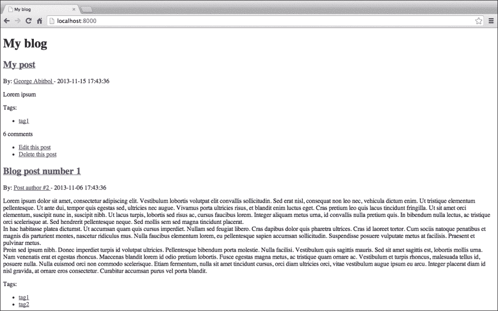

# 第一章：开始使用 Doctrine 2

Doctrine 项目是一组库，提供了在 PHP 应用程序中轻松实现数据持久性的实用程序。它使得可以在很短的时间内创建与流行的 DBMS 兼容的复杂模型层，包括 SQLite、MySQL 和 PostgreSQL。为了发现和理解 Doctrine，我们将在本书中从头开始创建一个小型博客，主要使用以下 Doctrine 组件：

+   **Common**提供了 PHP 标准库中没有的实用程序，包括类自动加载器、注解解析器、集合结构和缓存系统。

+   **数据库抽象层**（**DBAL**）公开了一个独特的接口，用于访问流行的 DBMS。其 API 类似于 PDO（在可能的情况下使用 PDO）。DBAL 组件还能够通过内部重写查询来使用特定构造和模拟缺失功能，在不同的 DBMS 上执行相同的 SQL 查询。

+   **对象关系映射器**（**ORM**）允许通过面向对象的 API 访问和管理关系数据库表和行。借助它，我们将直接操作 PHP 对象，并且它将透明地生成 SQL 查询来填充、持久化、更新和删除它们。它是建立在 DBAL 之上的，并且将是本书的主要主题。

### 注意

有关 PHP 数据对象和 PHP 提供的数据访问抽象层的更多信息，请参考以下链接：[`php.net/manual/en/book.pdo.php`](http://php.net/manual/en/book.pdo.php)

为了学习 Doctrine，我们将一起构建一个具有以下高级功能的微型博客引擎：

+   帖子列表、创建、编辑和删除

+   评论

+   标签过滤

+   帖子和评论作者的配置文件

+   统计

+   数据夹具

以下是博客的屏幕截图：



在本章中，我们将学习以下主题：

+   理解 Doctrine 背后的概念

+   创建项目的结构

+   安装 Composer

+   通过 Compose 安装 Doctrine ORM、DBAL 和 Common

+   引导应用程序

+   使用 Doctrine 的实体管理器

+   配置 Doctrine 命令行工具

# 先决条件

为了跟随本教程，我们需要正确安装 PHP 5.4 或更高版本的 CLI。我们还将使用`curl`命令来下载 Composer 存档和 SQLite 3 客户端。

### 注意

有关 PHP CLI、curl 和 SQLite 的更多信息，请参考以下链接：[`www.php.net/manual/en/features.commandline.php, http://curl.haxx.se`](http://www.php.net/manual/en/features.commandline.php, http://curl.haxx.se)和[`www.sqlite.org`](http://www.sqlite.org)

在示例中，我们将使用 PHP 内置的 Web 服务器和 SQLite 作为 DBMS。Doctrine 是一个纯 PHP 库。它与支持 PHP 的任何 Web 服务器兼容，但不限于 Apache 和 Nginx。当然，它也可以用于不打算在 Web 服务器上运行的应用程序，例如命令行工具。在数据库方面，官方支持 SQLite、MySQL、PostgreSQL、Oracle 和 Microsoft SQL Server。

由于 DBAL 组件，我们的博客应该可以在所有这些 DBMS 上正常工作。它已经在 SQLite 和 MySQL 上进行了测试。

Doctrine 项目还为 NoSQL 数据库（包括 MongoDB、CouchDB、PHPCR 和 OrientDB）提供了**对象文档映射器**（**ODM**）。这些主题不在本书中涵盖。

### 注意

在阅读本书时，请随时查阅以下链接中指定的 Doctrine 文档：[`www.doctrine-project.org`](http://www.doctrine-project.org)

# 理解 Doctrine 背后的概念

Doctrine ORM 实现了**数据映射器**和**工作单元**设计模式。

数据映射器是一个设计用来同步数据库中存储的数据与其领域层相关对象的层。换句话说，它执行以下操作：

+   从对象属性中插入和更新数据库中的行

+   当相关实体标记为删除时，删除数据库中的行

+   使用从数据库检索的数据来**水合**内存中的对象

### 注意

有关数据映射器和工作单元设计模式的更多信息，您可以参考以下链接：[`martinfowler.com/eaaCatalog/dataMapper.html`](http://martinfowler.com/eaaCatalog/dataMapper.html)和[`martinfowler.com/eaaCatalog/unitOfWork.html`](http://martinfowler.com/eaaCatalog/unitOfWork.html)

在 Doctrine 术语中，数据映射器称为**实体管理器**。实体是领域层的普通旧 PHP 对象。

由于实体管理器，它们不必知道它们将存储在数据库中。实际上，他们不需要知道实体管理器本身的存在。这种设计模式允许重用实体类，而不受持久性系统的影响。

出于性能和数据一致性的考虑，实体管理器不会在每次修改实体时将实体与数据库同步。工作单元设计模式用于保持数据映射器管理的对象的状态。只有在通过调用实体管理器的`flush()`方法请求时，数据库同步才会发生，并且在事务中进行（如果在将实体同步到数据库时出现问题，则数据库将回滚到同步尝试之前的状态）。

想象一个具有公共`$name`属性的实体。想象执行以下代码：

```php
  $myEntity->name = 'My name';
  $myEntity->name = 'Kévin';
  $entityManager->flush($myEntity);
```

由于工作单元设计模式的实现，Doctrine 只会发出类似以下的一个 SQL 查询：

```php
 **UPDATE MyEntity SET name='Kévin' WHERE id=1312;**

```

### 注意

出于性能原因，Doctrine 使用预处理语句，因此查询是相似的。

我们将以简要概述实体管理器方法及其相关实体状态来完成理论部分。

以下是表示实体及其实体管理器的类图的摘录：


+   `find()`方法**水合**并返回第一个参数中**传递**的类型的实体，其第二个参数作为**标识符**。数据通过`SELECT`查询从数据库中检索。返回实体的状态为**受控**。这意味着在调用`flush()`方法时，对其进行的更改将同步到数据库。`find()`方法是一个方便的方法，它在内部使用**实体存储库**从数据库中检索数据并水合实体。受控实体的状态可以通过调用`detach()`方法更改为**分离**。对分离实体所做的修改将不会同步到数据库（即使调用`flush()`方法时也是如此），直到通过调用`merge()`方法将其状态设置回**受控**为止。

### 注意

第三章*关联*的开始将专门用于实体存储库。

+   `persist()`方法告诉 Doctrine 将传递的实体状态设置为受控。这仅对尚未至少一次同步到数据库的实体有用（新创建对象的默认状态为**new**），因为从现有数据中水合的实体自动具有受控状态。

+   `remove()`方法将传入实体的状态设置为**已删除**。与此实体相关的数据将在下次调用`flush()`方法时通过`DELETE` SQL 查询有效地从数据库中删除。

+   `flush()`方法将实体的数据与**受控**和**已删除**状态同步到数据库。Doctrine 将为同步发出`INSERT`，`UPDATE`和`DELETE` SQL 查询。在调用该方法之前，所有更改都仅在内存中，并且从未同步到数据库。

### 注意

Doctrine 的实体管理器有很多其他有用的方法，这些方法在 Doctrine 网站上有文档，[`www.doctrine-project.org/api/orm/2.4/class-Doctrine.ORM.EntityManager.html`](http://www.doctrine-project.org/api/orm/2.4/class-Doctrine.ORM.EntityManager.html)。

目前这是抽象的，但是我们将通过本书中的许多示例更好地理解实体管理器的工作原理。

# 创建项目结构

以下是我们应用程序的文件夹结构：

+   `blog/`：之前创建的应用根目录

+   `bin/`：我们博客应用程序的特定命令行工具

+   `config/`：我们应用程序的配置文件

+   `data/`：SQLite 数据库将存储在这里

+   `src/`：我们编写的所有 PHP 类将在这里

+   `vendor/`：这是**Composer**（见下一节）存储所有已下载依赖项的地方，包括 Doctrine 的源代码

+   `bin/`：这是由 Composer 安装的依赖项提供的命令行工具

+   `web/`：这是包含 PHP 页面和资产（如图像、CSS 和 JavaScript 文件）的公共目录

我们必须创建所有这些目录，除了`vendor/`，它将在以后自动生成。

# 安装 Composer

与大多数现代 PHP 库一样，Doctrine 可以通过 Composer 获得，这是一个强大的依赖管理器。还有一个 PEAR 频道可用。

### 注意

有关 Composer 和 Pear 软件包的更多信息，请参考以下链接：[`getcomposer.org`](http://getcomposer.org) 和 [`pear.doctrine-project.org`](http://pear.doctrine-project.org)

安装 Composer 应执行以下步骤：

1.  安装 Doctrine ORM 的第一步是获取最新版本的 Composer。

1.  打开您喜欢的终端，转到`blog/`目录（我们项目的根目录），并输入以下命令来安装 Composer：

```php
 **curl -sS https://getcomposer.org/installer | php**

```

一个名为`composer.phar`的新文件已经在目录中下载。这是 Composer 的一个自包含存档。

1.  现在输入以下命令：

```php
 **php composer.phar**

```

如果一切正常，将列出所有可用的命令。您的 Composer 安装已经准备就绪！

# 安装 Doctrine

安装 Doctrine 应执行以下步骤：

1.  要安装 Doctrine，我们需要在新的`blog`目录中创建一个名为`composer.json`的文件。它列出了我们项目的依赖项，如下面的代码所示：

```php
{
    "name": "myname/blog",
    "type": "project",
    "description": "My small blog to play with Doctrine",

    "require": {
 **"doctrine/orm": "2.4.*"**
    },

    "autoload": {
 **"psr-0": { "": "src/" }**
    }
} 
```

Composer 将解析这个标准的 JSON 文件，以下载和安装所有指定的依赖项。一旦安装完成，Composer 将自动加载这些库的所有类。

`name`、`type`和`description`属性是可选的，但最好总是填写它们。它们提供了关于我们正在开发的项目的一般信息。

这个`composer.json`文件更有趣的部分是`require`字段。为了让 Composer 安装它，我们应用程序使用的所有库都必须在这里列出。许多 PHP 库都可以在**Packagist**上找到，这是默认的 Composer 包存储库。当然，Doctrine 项目也是如此。

### 注意

有关 Packagist 的更多信息，请访问以下链接：[`packagist.org/`](https://packagist.org/)

我们指定需要 Doctrine ORM 2.4 分支的最新次要版本。您可以在这里设置主要或次要版本，甚至更复杂的东西。

### 注意

有关软件包版本的更多信息，请参考以下链接：[`getcomposer.org/doc/01-basic-usage.md#package-versions`](http://getcomposer.org/doc/01-basic-usage.md#package-versions)

`autoload`字段在这里告诉 Composer 自动加载我们应用程序的类。我们将把我们的特定代码放在一个名为`src/`的目录中。我们的文件和类将遵循`PSR-0`命名空间和文件命名标准。

### 注意

PHP 规范请求是为了改进 PHP 应用程序和库的互操作性而尝试的。它们可以在[`www.php-fig.org/`](http://www.php-fig.org/)找到。

1.  现在是使用 Composer 来安装 ORM 的时候了。运行以下命令：

```php
 **php composer.phar install**

```

`vendor/`目录中出现了新文件。Doctrine ORM 已经安装，Composer 足够智能，可以获取所有它的依赖，包括 Doctrine DBAL 和 Doctrine Common。

还创建了一个`composer.lock`文件。它包含已安装库的确切版本。这对于部署应用程序很有用。有了这个文件，运行`install`命令时，Composer 将能够检索与开发中使用的相同版本。

Doctrine 现在已经正确安装。很容易，不是吗？

1.  要在 2.4 分支中有新版本发布时更新库，我们只需要输入以下命令：

```php
 **php composer.phar update**

```

# 引导应用程序

需要执行以下步骤来引导应用程序：

1.  创建一个名为`config/config.php`的新文件，其中包含我们应用程序的配置参数，如下所示：

```php
  <?php

  // App configuration
  $dbParams = [
    'driver' => 'pdo_sqlite',
    'path' => __DIR__.'/../data/blog.db'
  ];

  // Dev mode?
  $dev = true;
```

Doctrine 的配置参数存储在`$dbParams`数组中。我们将使用一个名为`blog.db`的 SQLite 数据库，存储在`data/`目录中。如果你想使用 MySQL 或任何其他 DBMS，你将在这里配置要使用的驱动程序、数据库名称和访问凭据。

### 注意

以下是使用 MySQL 而不是 SQLite 的示例配置：

```php
$dbParams = [
    'driver' => 'pdo_mysql',
    'host' => '127.0.0.1',
    'dbname' => 'blog',
    'user' => 'root',
    'password' => ''
];
```

配置键是不言自明的。

如果`$dev`变量为`true`，一些优化将被禁用以便于调试。禁用`dev`模式允许 Doctrine 将大量数据（如元数据）放入强大的缓存中，以提高应用程序的整体性能。

### 注意

它需要缓存驱动程序的安装和额外的配置，可在[`docs.doctrine-project.org/en/latest/reference/caching.html`](http://docs.doctrine-project.org/en/latest/reference/caching.html)找到。

1.  接下来，我们需要一种方法来引导我们的应用程序。在`src/`目录中创建一个名为`bootstrap.php`的文件。这个文件将加载我们需要的一切，如下面的代码所示：

```php
  <?php

  require_once __DIR__.'/../vendor/autoload.php';
  require_once __DIR__.'/../config/config.php';
```

第一行需要 Composer 自动加载程序。它允许您自动加载 Doctrine 的类、项目的类（将在`src/`目录中），以及使用 Composer 安装的任何库的类。

第二行导入了应用程序的配置文件。项目结构已创建，应用程序的初始化过程已完成。我们准备开始使用 Doctrine。

# 使用 Doctrine 的实体管理器

ORM 的原则是通过面向对象的 API 管理存储在关系数据库中的数据。我们在本章的前面已经了解了它的基本概念。

每个实体类都映射到相关的数据库表。实体类的属性映射到表的列。

因此，数据库表的行在 PHP 应用程序中由一组实体表示。

Doctrine ORM 能够从数据库中检索数据并用它们填充实体。这个过程称为水合。

### 注意

Doctrine 可以以不同的方式填充 PHP 数组（使用对象图、使用矩形结果集等）。还可以通过参考以下链接创建自定义水合器：[`docs.doctrine-project.org/en/latest/reference/dql-doctrine-query-language.html#hydration-modes`](http://docs.doctrine-project.org/en/latest/reference/dql-doctrine-query-language.html#hydration-modes)

正如我们在数据映射器设计模式中学到的，它也做了相反的工作：将实体持有的数据持久化到数据库中。

我们以后会大量使用实体。

Doctrine 附带以下文件来将实体映射到表：

+   注释块中的注解直接嵌入实体

+   XML 配置文件

+   YAML 配置文件

+   纯 PHP 文件

注释在 PHP 世界中是相当新的（它们在 Java 中很受欢迎），但它们已经被 Doctrine 和 Symfony 社区广泛使用。这种方法的优势在于代码旁边的映射信息，使得代码易读且易于维护。但是，在某些情况下，直接将映射信息放入代码中也可能是一个缺点，特别是对于使用多个持久性系统的大型项目。

在本书中，我们将使用注释方法，但 Doctrine 文档中还描述了其他方法。我们将在第二章中返回它们，*实体和映射信息*。

在下一章，第二章中，*实体和映射信息*，我们将发现 Doctrine 足够智能，可以使用映射信息自动创建相关的数据库模式。

现在，我们将专注于检索实体管理器。因为实体是通过它检索、持久化、更新和删除的，这是 Doctrine ORM 的入口点。

编辑`src/bootstrap.php`文件以检索 Doctrine 的实体管理器。在文件末尾添加以下代码：

```php
  $entitiesPath = array(__DIR__.'/Blog/Entity');
  $config = **Setup::createAnnotationMetadataConfiguration**    **($entitiesPath, $dev);**
  $entityManager = **EntityManager::create**($dbParams, $config);
```

### 提示

**下载示例代码**

您可以从您在[`www.packtpub.com`](http://www.packtpub.com)购买的所有 Packt 图书的帐户中下载示例代码文件。如果您在其他地方购买了本书，您可以访问[`www.packtpub.com/support`](http://www.packtpub.com/support)注册并直接通过电子邮件接收文件。

`$entitiesPath`属性包含存储实体类的目录路径列表。我们已经提到我们的应用程序将遵循`PSR-0`命名空间约定。`\Blog`文件夹将是根命名空间，实体类将在`\Blog\Entity`文件夹中。

创建了一个 Doctrine 配置，用于使用注释进行映射信息，并能够定位我们将创建的博客实体。

创建并配置了一个新的`EntityManager`，以使用我们的数据库和 Doctrine 设置。

为简单起见，我们创建了一个在整个应用程序中将被使用的唯一实体管理器。对于真实世界的应用程序，您应该查看依赖注入设计模式。

### 注意

在以下链接找到有关依赖注入模式的更多信息：[`en.wikipedia.org/wiki/Dependency_injection`](http://en.wikipedia.org/wiki/Dependency_injection)

# 配置 Doctrine 命令行工具

Doctrine 库捆绑了一些有用的命令行工具。它们提供了许多有用的功能，包括但不限于根据实体映射创建数据库模式的能力。

Composer 已经在`vendor/bin/`目录中安装了 Doctrine 的命令行工具。但是，在能够使用它们之前，必须进行一些配置。命令行工具内部使用实体管理器。我们需要告诉它们如何检索它。

在这里，我们只需要在`config/`目录中创建一个名为`cli-config.php`的文件，如下所示：

```php
  <?php

// Doctrine CLI configuration file

use Doctrine\ORM\Tools\Console\ConsoleRunner;

require_once __DIR__.'/../src/bootstrap.php';

return ConsoleRunner::createHelperSet($entityManager);
```

由于 Doctrine 的约定，该文件将被自动检测并被 Doctrine CLI 使用。

### 注意

命令行工具将在当前目录和`config/`目录中查找名为`cli-config.php`的文件。

该文件只是使用我们之前创建的实用类获取一个新的实体管理器，并配置 Doctrine CLI 以使用它。

键入以下命令以获取可用的 Doctrine 命令列表：

```php
 **php vendor/bin/doctrine.php**

```

# 总结

在本章中，我们了解了 Doctrine 的基础知识。我们现在知道了实体和实体管理器是什么，我们已经使用 Composer 依赖管理器安装了 Doctrine，创建了博客应用程序的框架，并成功运行了命令行工具。

在下一章中，我们将创建我们的第一个实体类，发现许多注解来将其映射到数据库，生成数据库架构，并开始处理实体。到下一章结束时，我们博客的发布系统将会运作！
