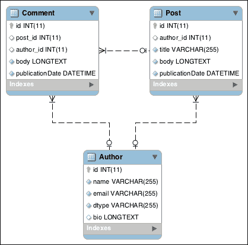
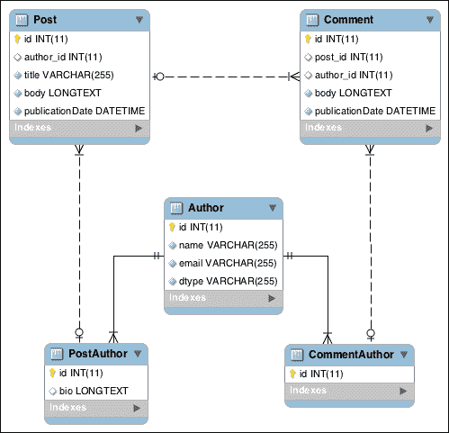

# 第五章。进一步

在之前的章节中，我们学习了 Doctrine ORM 的基础知识。我们现在能够创建复杂的领域类，生成底层 SQL 表，加载数据固定装置，并执行高级查询。我们知道了开发小型 Web 应用程序的模型层所需的一切知识。

然而，该库提供了更高级的功能。在本章中，我们将简要介绍以前未涉及的各种主题：继承、生命周期回调和本机查询。

# 实现继承

像所有面向对象的编程语言一样，PHP 是建立在继承概念之上的；然而，关系数据库不是。这是将类映射到表时的常见问题。

Doctrine ORM 提供了以下三种实现继承的方式：

+   映射的超类

+   单表继承

+   类表继承

要了解它们，我们将创建相同模型的三个实现，即内容作者。

帖子和评论都有作者。作者必须有姓名和电子邮件地址。帖子的作者（仅他们）还可以有一个可选的传记。

为了表示这一点，我们将创建两个类：`PostAuthor`和`CommentAuthor`。它们都扩展了一个抽象的`Author`类。每个`Comment`实体都与一个`CommentAuthor`类相关联，每个`Post`实体都与一个`PostAuthor`类相关联。

## 使用映射的超类

映射的超类是简单的 PHP 类，它们共享由它们的后代实体使用的映射属性。映射的超类本身不是实体。它们被实体扩展。

映射的超类永远不会直接持久化到数据库。它们不能通过查询构建器检索，并且不能成为关联的反向方。

它们就像任何其他 PHP 类一样，被实体扩展，只是它们可以持有将由它们的后代持久化的属性。

### 注意

这种类型的继承不适合这种用例。单表继承在这里更好。

1.  首先创建映射的超类。在`src/Blog/Entity/`位置的`Author.php`文件中创建一个名为`Author`的新抽象类，如下所示：

```php
  <?php

  namespace Blog\Entity;

  use Doctrine\ORM\Mapping\MappedSuperclass;
  use Doctrine\ORM\Mapping\Id;
  use Doctrine\ORM\Mapping\GeneratedValue;
  use Doctrine\ORM\Mapping\Column;

  /**
  * Author superclass
  *
  * @**MappedSuperclass**
  */
  abstract class Author
{
    /**
     * @var int
     *
     * @Id
     * @GeneratedValue
     * @Column(type="integer")
     */
    protected $id;
    /**
     * @var string
     *
     * @Column(type="string")
     */
    protected $name;
    /**
     * @var string
     *
     * @Column(type="string")
     */
    protected $email;
}
```

由于`@MappedSuperclass`注释，`Author`类的映射属性被`PostAuthor`和`CommentAuthor`类继承的属性将被 Doctrine 考虑在内。

1.  为所有属性编写 getter，并为除`$id`实例之外的所有属性编写 setter。

### 注意

在撰写本文时，Doctrine 命令行工具无法为映射的超类生成 getter 和 setter，并且在为子类生成 getter 和 setter 时存在错误。

1.  在包含`PostAuthor`类的相同目录中创建一个名为`PostAuthor.php`的文件，如下所示：

```php
<?php

namespace Blog\Entity;

use Doctrine\Common\Collections\ArrayCollection;
use Doctrine\ORM\Mapping\Entity;
use Doctrine\ORM\Mapping\OneToMany;
use Doctrine\ORM\Mapping\Column;

/**
 * Post author entity
 *
 * @Entity
 */
class PostAuthor **extends Author**
{
    /**
     * @var string
     *
     * @Column(type="text", nullable=true)
     */
    protected $bio;
    /**
     * @var Post[]
     *
     * @OneToMany(targetEntity="Post", mappedBy="postAuthor")
     */
    protected $posts;

    /**
     * Initializes collections
     */
    public function __construct()
    {
        $this->posts = new ArrayCollection();
    }
}
```

`PostAuthor`实体类扩展了`Author`映射的超类。`PostAuthor`保存了帖子作者的特定数据：一个`bio`属性和一个对帖子的一对多关联。

在数据库级别，将创建一个名为`PostAuthor`的表，其中包含`Author`和`PostAuthor`类中使用`@Column`注释定义的所有列。

1.  为这个类编写 getter 和 setter。

1.  为了使这个关联工作，我们需要将关联的拥有方的代码添加到`src/Blog/Entity/Post.php`文件中。为此，请添加以下属性：

```php
    /**
     * @var PostAuthor
     *
     * @ManyToOne(targetEntity="PostAuthor", inversedBy="posts")
     */
    protected $author;
```

1.  你猜对了！为上述属性编写 getter 和 setter。

1.  现在在包含`CommentAuthor`实体类的相同目录中创建一个名为`CommentAuthor.php`的文件，如下所示：

```php
  <?php

  namespace Blog\Entity;

  use Doctrine\ORM\Mapping\Entity;

  /**
  * Comment author entity
  *
  * @Entity
  */
  class CommentAuthor extends Author
{
    /**
     * @var Comment[]
     *
     * @OneToMany(targetEntity="Comment", mappedBy="commentAuthor")
     */
    protected $comments;
}
```

这个实体类与`PostAuthor`类非常相似，只是它的关联与`Post`相关而不是`Comment`，并且它没有`bio`属性。

数据库中将创建另一个名为`CommentAuthor`的表。这个表将完全独立于`PostAuthor`表。

1.  在添加上述代码后，为相同属性编写 getter 和 setter。

1.  我们还需要添加关联的拥有方。打开`src/Blog/Entity/Comment.php`文件并添加以下属性：

```php
    /**
     * @var CommentAuthor
     *
     * @ManyToOne(targetEntity="CommentAuthor", inversedBy="comments")
     */
    protected $author;
```

1.  完成上一步后，添加 getter 和 setter。

1.  为了了解 Doctrine 如何处理这种类型的继承，并测试我们的代码，我们将通过在`src/DataFixtures/LoadAuthorData.php`文件中插入示例数据来创建一个 fixture，如下所示：

```php
<?php

namespace Blog\DataFixtures;

use Blog\Entity\Comment;
use Blog\Entity\CommentAuthor;
use Blog\Entity\Post;
use Blog\Entity\PostAuthor;
use Doctrine\Common\DataFixtures\Doctrine;
use Doctrine\Common\DataFixtures\FixtureInterface;
use Doctrine\Common\Persistence\ObjectManager;

/**
 * Author fixtures
 */
class LoadAuthorData implements FixtureInterface
{
    /**
     * {@inheritDoc}
     */
    public function load(ObjectManager $manager)
    {
        $postAuthor = new PostAuthor();
        $postAuthor->setName('George Abitbol');
        $postAuthor->setEmail('gabitbol@example.com');
        $postAuthor->setBio('L\'homme le plus classe du monde');

        $manager->persist($postAuthor);

        $post = new Post();
        $post->setTitle('My post');
        $post->setBody('Lorem ipsum');
        $post->setPublicationDate(new \DateTime());
        $post->setauthor($postAuthor);

        $manager->persist($post);

        $commentAuthor = new CommentAuthor();
        $commentAuthor->setName('Kévin Dunglas');
        $commentAuthor->setEmail('dunglas@gmail.com');

        $manager->persist($commentAuthor);

        $comment = new Comment();
        $comment->setBody('My comment');
        $comment->setAuthor($commentAuthor);
        $comment->setPublicationDate(new \DateTime());

        $post->addComment($comment);
        $manager->persist($comment);

        $manager->flush();
    }
}
```

这个 fixture 创建了`Post`、`PostAuthor`、`Comment`和`CommentAuthor`的实例，然后将它们持久化到数据库中。

1.  更新以下模式：

```php
 **php vendor/bin/doctrine orm:schema-tool:update --force**

```

以下 ER 图表示在使用 MySQL 作为 DBMS 时将生成的模式：


即使`PostAuthor`和`CommentAuthor`类都继承自`Author`映射超类，它们对应的 SQL 模式没有共享任何内容，也没有关联。

1.  然后使用以下命令加载 fixture：

```php
 **php bin/load-fixtures.php**

```

1.  使用 SQLite 客户端使用以下命令显示每个表中插入的内容：

```php
 **sqlite3 data/blog.db "SELECT * FROM PostAuthor; SELECT * FROM CommentAuthor;"**

```

在上述步骤之后，George 和我的详细信息应该如下所示：

**1|L'homme le plus classe du monde|George Abitbol|gabitbol@example.com**

**1|Kévin Dunglas|dunglas@gmail.com**

### 注意

为了练习，使用了作者功能的 UI。在 Packt 网站上提供了示例代码。

## 使用单表继承

使用单表继承，层次结构的所有类的数据将存储在同一个数据库表中。将为每个子类的每个属性创建一列。

这种映射策略非常适合简单类型的层次结构，并且在查询相同类型和不同类型的实体时表现良好。

要从映射超类更改为单表继承，我们只需对刚刚创建的类进行一些修改：

1.  打开`src/Blog/Entity/Author.php`文件并找到以下片段：

```php
  use Doctrine\ORM\Mapping\MappedSuperclass;
  use Doctrine\ORM\Mapping\Id;
  use Doctrine\ORM\Mapping\GeneratedValue;
  use Doctrine\ORM\Mapping\Column;

  /**
  * Author mapped superclass
  *
  * @MappedSuperclass
```

1.  用以下片段替换上述片段：

```php
  use Doctrine\ORM\Mapping\Entity;
  use Doctrine\ORM\Mapping\InheritanceType;
  use Doctrine\ORM\Mapping\Id;
  use Doctrine\ORM\Mapping\GeneratedValue;
  use Doctrine\ORM\Mapping\Column;

  /**
  * Author superclass
  *
  * @Entity
  * @InheritanceType("SINGLE_TABLE")
```

1.  使用以下查询更新模式并再次加载 fixture：

```php
 **php vendor/bin/doctrine orm:schema-tool:update --force**
 **php bin/load-fixtures.php**

```

以下截图是单表继承类型的 ER 图：



现在`PostAuthor`和`CommentAuthor`实体的数据都存储在名为`Author`的唯一数据库表中。

实体类型在表中通过**鉴别器列**进行标识，并由 Doctrine 自动管理。

默认情况下，这个鉴别器列被称为`dtype`，Doctrine 类型为`string`。这些值可以通过`@DiscriminatorColumn`注释进行覆盖。这个注释应该用在标有`@InheritanceType`注释的实体类上（这里是`Author`类）。

存储在此列中的值由 Doctrine 用于确定要为给定数据库行水合的实体类的类型。默认情况下，它是实体类的名称（不是完全限定的）的小写形式。每个实体类的使用值也可以通过在父实体类上添加注释`@DiscriminatorMap`来覆盖。

所有这些注释和单表继承类型都在以下文档中有说明：

`http://docs.doctrine-project.org/en/latest/reference/inheritance-mapping.html#single-table-inheritance`

要查看我们在`Author`表中插入的数据，运行以下命令：

```php
 **sqlite3 data/blog.db "SELECT * FROM Author"**

```

结果应该如下：

**1|Kévin Dunglas|dunglas@gmail.com|commentauthor|**

**2|George Abitbol|gabitbol@example.com|postauthor|L'homme le plus classe du monde**

## 使用类表继承

Doctrine 提供的最后一种策略是类表继承。层次结构的每个类的数据存储在特定的数据库表中。在数据检索时，层次结构的所有表都会被连接。

由于联接的大量使用，这种策略不如单表继承高效，特别是在处理大数据时。您添加的后代类越多，检索数据所需的联接就越多，查询速度就越慢。

但是因为层次结构的每个实体类都映射到自己的表，这种策略也允许很大的灵活性。创建或修改实体类只会影响其直接相关的数据库表。在性能不是首要考虑因素，数据模型复杂的情况下，这种继承类型可以是限制或避免复杂甚至有风险的迁移的解决方案。

至于单表继承，我们只需要进行一些小的更改，就可以使用类表继承创建我们的`Author`数据模型，具体步骤如下：

1.  打开`src/Blog/Entity/Author.php`文件，并找到我们添加的`@InheritanceType`注释，以使用单表继承：

```php
  * @InheritanceType("SINGLE_TABLE")
```

1.  将参数`SINGLE_TABLE`替换为以下参数：

```php
  * @InheritanceType("JOINED")
```

1.  再次使用以下查询更新模式并加载数据：

```php
 **php vendor/bin/doctrine orm:schema-tool:update --force**
 **php bin/load-fixtures.php**

```

以下 ER 图表示生成的模式，再次使用 MySQL：



`Author`表包含`PostAuthor`和`CommentAuthor`实体类之间的共享数据。这些子类只保存它们特定的数据。它们的`id`列是引用`Author`表的`id`列的外键。这允许数据链接，因为存储后代类数据的表中的 ID 与存储顶级类数据的表中的 ID 相同。

至于单表继承，鉴别器列允许 Doctrine 识别与数据库表行对应的实体类。它们的默认名称和值相同。它们也可以通过层次结构的顶级实体类（这里是`Author`）上的`@DicriminatorColumn`和`@DicriminatorMap`注释进行覆盖。

### 注意

类表继承允许在关联中引用层次结构的顶级类，但加载功能将不再起作用。

有关类表继承的更多信息，请参阅[`docs.doctrine-project.org/en/latest/reference/inheritance-mapping.html#class-table-inheritance`](http://docs.doctrine-project.org/en/latest/reference/inheritance-mapping.html#class-table-inheritance)上可用的文档。

1.  要显示我们在`Author`、`CommentAuthor`和`PostAuthor`表中插入的数据，使用 SQLite 客户端运行以下查询：

```php
 **sqlite3 data/blog.db "SELECT * FROM Author; SELECT * FROM PostAuthor; SELECT * FROM CommentAuthor;"**

```

以下是预期结果：

**1|Kévin Dunglas|dunglas@gmail.com|commentauthor**

**2|George Abitbol|gabitbol@example.com|postauthor**

**2|世界上最有品味的人**

**1**

# 开始使用事件

Doctrine Common 组件带有内置的事件系统。它允许分发和订阅自定义事件，但其主要目的是管理与实体相关的事件。

在第一章中，*开始使用 Doctrine 2*，我们学习了实体管理器、实体状态和工作单元。当实体的状态发生变化以及数据存储、更新和从数据库中删除时，实体管理器（及其底层的`UnitOfWork`对象）会分发事件。它们被称为生命周期事件。

### 注意

Doctrine 还发出一些与实体生命周期无直接关的事件。

Doctrine ORM 提供了以下一系列的生命周期事件：

+   `preRemove`：此事件发生在实体的状态被设置为`removed`时

+   `postRemove`：此事件发生在从数据库中删除实体数据之后

+   `prePersist`：此事件发生在实体的状态从`new`变为`managed`时

+   `postPersist`：此事件发生在`INSERT` SQL 查询执行之后

+   `preUpdate`：此事件发生在`UPDATE` SQL 查询之前

+   `postUpdate`：此事件发生在`UPDATE` SQL 查询之后

+   `postLoad`：此事件发生在`EntityManager`中的实体加载或刷新之后

### 注意

Doctrine ORM 的事件的完整文档（包括非生命周期事件）可在在线文档中找到：[`docs.doctrine-project.org/en/latest/reference/events.html`](http://docs.doctrine-project.org/en/latest/reference/events.html)。

## 生命周期回调

生命周期回调是使用这些事件的最简单方法。它允许在生命周期事件发生时直接执行实体类中定义的方法。

在我们的博客中，我们存储了帖子和评论的发布日期。由于生命周期回调和`prePersist`事件，可以在实体首次通过其实体管理器的`persist()`方法传递时自动设置此日期（当状态从`new`变为`managed`时）：

1.  打开`src/Blog/Entity/`文件夹中的`Post.php`文件和`src/Blog/Entity/`文件夹中的`Comment.php`文件。

1.  将以下使用语句添加到这两个文件中：

```php
  use Doctrine\ORM\Mapping\HasLifecycleCallbacks;
  use Doctrine\ORM\Mapping\PrePersist;
```

1.  在这两个文件的`@Entity`旁边添加`@HasLifecycleCallbacks`注释。这将在这两个实体类中启用生命周期回调。

1.  然后，在这两个文件中添加以下方法，当`prePersist`事件发生时设置发布日期：

```php
    /**
     * Sets publication date to now at persist time
     * 
     * @PrePersist
     */
    public function setPublicationDateOnPrePersist()
    {
        if (!$this->publicationDate) {
            $this->publicationDate = new \DateTime();
        }
    }
```

当`Comment`或`Post`实体通过实体管理器的`persist()`方法传递时，将执行此方法。如果尚未执行，它将`publicationDate`属性设置为当前时间。

### 注意

这些回调方法可以接受一个可选参数，允许访问与实体相关的`EntityManager`和`UnitOfWork`（提供对底层更改集的访问）对象，可以在以下位置引用：

[`docs.doctrine-project.org/en/latest/reference/events.html#lifecycle-callbacks-event-argument`](http://docs.doctrine-project.org/en/latest/reference/events.html#lifecycle-callbacks-event-argument)

通过这种调整，我们可以删除`web/view-post.php`和`web/edit-post.php`中使用`setPublicationDate()`方法的调用。

### 注意

您应该尝试的一个受欢迎的库是*Gediminas Morkevičius*的`DoctrineExtensions`。它包含了许多对 Doctrine 有用的行为，包括但不限于时间戳，翻译，软删除和嵌套集。Doctrine 扩展可以在以下位置找到：

[`github.com/l3pp4rd/DoctrineExtensions`](https://github.com/l3pp4rd/DoctrineExtensions)

## 了解事件监听器和事件订阅者

Doctrine 提供了更强大的处理事件的方式：**事件订阅者**和**事件监听器**。与生命周期回调直接在实体类中定义不同，这两者都必须在外部类中定义。我们将快速浏览一下它们。

监听器和订阅者之间的主要区别在于监听器附加到事件，而订阅者注册自己到事件。

让我们创建一个监听器，它将从`src/Blog/Event/InsultEventListener.php`文件中的已发布评论中删除一些法语侮辱词：

```php
<?php

namespace Blog\Event;

use Blog\Entity\Comment;
use Doctrine\Common\Persistence\Event\LifecycleEventArgs;

/**
 * Censors French insults in comments
 */
class InsultEventListener
{
    /**
     * Censors on the prePersist event
     *
     * @param LifecycleEventArgs $args
     */
    public function **prePersist(LifecycleEventArgs $args)**
    {
 **$entity = $args->getObject();**

        if (**$entity instanceof Comment**) {
            // Use a black list instead, or better don't do that, it's useless
            $entity->setBody(str_ireplace(['connard', 'lenancker'], 'censored', $entity->getBody()));
        }
    }
}
```

现在，我们将创建一个事件订阅者，当在`src/Blog/Event/MailAuthorOnCommentEventSubscriber.php`文件中发布评论时，将向帖子作者发送电子邮件，如下所示：

```php
<?php

namespace Blog\Event;

use Doctrine\Common\EventSubscriber;
use Doctrine\ORM\Event\LifecycleEventArgs;
use Doctrine\ORM\Events;
use Blog\Entity\Comment;

/**
 * Mails a post author when a new comment is published
 */
class MailAuthorOnCommentEventSubscriber **implements EventSubscriber**
{

    /**
     * {@inheritDoc}
     */
 **public function getSubscribedEvents()**
 **{**
 **return [Events::postPersist];**
 **}**

    /**
     * Mails the Post's author when a new Comment is published
     *
     * @param LifecycleEventArgs $args
     */
    public function **postPersist(LifecycleEventArgs $args)**
    {
        $entity = $args->getObject();

        if **($entity instanceof Comment**) {
            if ($entity->getPost()->getAuthor() && $entity->getAuthor()) {
                mail(
                    $entity->getPost()->getAuthor()->getEmail(),'New comment!',
                    sprintf('%s published a new comment on your post %s', $entity->getAuthor()->getName(), $entity->getPost()->getTitle())
                );
            }
        }

    }
}
```

事件的监听器和订阅者方法的名称必须与它们想要捕获的事件的名称匹配。与事件相关的实体及其实体管理器可通过`$args`参数获得。在我们的示例中，我们只使用了实体。

事件的监听器和订阅者只有在它们订阅的事件被分派时才会被调用，无论实体的类型如何。它们的责任是按类型过滤实体。这就是为什么我们使用`instanceof`关键字来检查实体是否是`Comment`类型。

与事件监听器不同，事件订阅者必须实现`EventSubscriber`接口。`getSubscribedEvents()`方法必须返回要监听的事件数组。

最后一步是通过事件管理器注册这些事件的监听器和订阅者。与生命周期回调不同，这不是自动处理的。

打开`src/bootstrap.php`文件并添加以下使用语句：

```php
  use Doctrine\ORM\Events;
  use Doctrine\Common\EventManager;
  use Blog\Event\InsultEventListener;
  use Blog\Event\MailAuthorOnCommentEventSubscriber;
```

然后找到以下代码行：

```php
  $entityManager = EntityManager::create($dbParams, $config, $eventManager);
```

用以下代码片段替换上述行：

```php
**$eventManager = new EventManager();**
**$eventManager->addEventListener([Events::prePersist], new InsultEventListener());**
**$eventManager->addEventSubscriber(new MailAuthorOnCommentEventSubscriber());**

  $entityManager = EntityManager::create($dbParams, $config, **$eventManager**);
```

我们实例化一个事件管理器，并注册我们的监听器和订阅者。对于监听器，我们需要告诉它应该调用哪些事件。订阅者会注册自己对其感兴趣的事件。

当创建事件管理器对象时，它必须与实体管理器关联；这就是为什么它作为`EntityManager::create()`静态方法的第三个参数传递的（参见第一章，“开始使用 Doctrine 2”）。

# 编写本地查询

在上一章中，我们学习了如何通过`QueryBuilder`创建 DQL 查询。但是 DQL 有一些限制（即查询不能包含`FROM`和`JOIN`子句中的子查询），有时您希望使用 DBMS 的特定功能（即 MySQL 全文搜索）。在这种情况下，您需要编写本地 SQL 查询。

## NativeQuery 类

`NativeQuery`类允许您执行本地 SQL 查询并将其结果作为 Doctrine 实体获取。仅支持`SELECT`查询。

为了尝试此功能，我们将创建一个新命令，显示最近的 100 条评论。这对于审核它们可能很有用。

在应用程序的`bin/`目录中创建一个名为`last-comments.php`的文件，其中包含此新命令。

```php
<?php

require_once __DIR__.'/../src/bootstrap.php';

use Doctrine\ORM\Query\ResultSetMappingBuilder;

const NUMBER_OF_RESULTS = 100;

 **$resultSetMappingBuilder = new ResultSetMappingBuilder($entityManager);**
 **$resultSetMappingBuilder->addRootEntityFromClassMetadata('Blog\Entity\Comment', 'c');**
 **$resultSetMappingBuilder->addJoinedEntityFromClassMetadata(**
 **'Blog\Entity\Post','p','c','post',[**
 **'id' => 'post_id','body' => 'post_body','publicationDate' => 'post_publication_date','author_id' => 'post_author_id'**
 **])**
 **;**

 **$sql = <<<SQL**
 **SELECT id, publicationDate, body, post_id**
 **FROM Comment**
 **ORDER BY publicationDate DESC**
 **LIMIT :limit**
 **SQL;**

 **$query = $entityManager->createNativeQuery($sql, $resultSetMappingBuilder);**
  $query->setParameter('limit', NUMBER_OF_RESULTS);
  $comments = $query->getResult();

  foreach ($comments as $comment) {
    echo sprintf('Comment #%s%s', $comment->getId(), PHP_EOL);
    echo sprintf('Post #%s%s', $comment->getPost()->getId(), PHP_EOL);
    echo sprintf('Date of publication: %s%s', $comment->getPublicationDate()->format('r'), PHP_EOL);
    echo sprintf('Body: %s%s', $comment->getBody(), PHP_EOL);
    echo PHP_EOL;
}
```

`ResultSetMappingBuilder`类旨在将 SQL 查询结果映射到 Doctrine 实体。对其`addRootEntityFromClassMetadata()`方法的调用指定了将被填充的主实体类（第一个参数）以及其内部别名（第二个参数）。这里是`Comment`。

`addJoinedEntityFromClassMetadata()`方法允许您填充根实体的关联。第一个参数是实体类。第二个是此实体的内部别名。第三个是其父实体的内部别名。第四个是其父实体类中关系的名称。最后一个是实体属性和 SQL 查询别名之间的映射数组。

当 SQL 列名与实体的属性名不匹配时，这个最后一个参数非常有用。在这里，我们使用它来用`Comment`表的`post_id`列填充相关帖子的`id`属性。

`Comment`和`Post`数据库表都有名为`body`，`publication_date`和`author_id`的列。为了解决这个冲突，我们将`Post`实体属性分别映射到`post_body`，`post_publication_date`和`post_author_id`列。您注意到 SQL 查询没有返回这些列。这不是问题；它们将被忽略。

`EntityManager`的`createNativeQuery()`方法接受 SQL 查询和`ResultSetMappingBuilder`作为参数。与 DQL 查询一样，SQL 查询可以使用命名参数。它们将自动转义以防止 SQL 注入攻击。

由于`NativeQuery`和`ResultSetMappingBuilder`类，查询的结果是一组`Comment`实体（部分填充），以及它们相关的`Post`实体（只填充`id`属性）。

运行以下代码以查看最近的 100 条评论：

```php
 **php bin/list-comments.php**

```

## Doctrine DBAL

Doctrine 提供了一种更低级的方法来发出本地 SQL 查询。您可以通过`EntityManager`检索底层的 DBAL 连接并直接使用它。

这对于执行本地的`UPDATE`和`DELETE`查询以及检索不打算填充实体的数据非常有用。当然，只有在有充分理由或使用 DQL 的`SELECT`，`UPDATE`或`DELETE`查询时才这样做。

为了通过 DBAL 说明本地查询，我们将创建另一个命令，显示有关我们的博客的一些简单统计信息。

### 注意

由于它们不使用任何特定于 DBMS 的查询，因此应通过 ORM 执行此命令。本例中仅使用本机查询来说明此功能。

在`bin/`目录中创建一个名为`stats.php`的新命令文件，其中包含以下代码：

```php
<?php

require_once __DIR__.'/../src/bootstrap.php';

$sql = <<<SQL
SELECT
  COUNT(id) AS nb,
  MAX(publicationDate) AS latest
FROM Post
UNION
SELECT
  COUNT(id),
  MAX(publicationDate)
FROM Comment
SQL;

**$query = $entityManager->getConnection()->query($sql);**
**$result = $query->fetchAll();**

  echo sprintf('Number of posts: %d%s', $result[0]['nb'], PHP_EOL);
  echo sprintf('Last post: %s%s', $result[0]['latest'], PHP_EOL);
  echo sprintf('Number of comments: %d%s', $result[1]['nb'], PHP_EOL);
  echo sprintf('Last comment: %s%s', $result[1]['latest'], PHP_EOL);
```

我们使用`EntityManager`通过`getConnection()`方法检索底层的`Doctrine\DBAL\Connection`。DBAL 的`Connection`只是`PDO`的一个薄包装，其 API 非常相似。我们用它来计算帖子和评论的总数以及最后的发布日期。

要显示它们，请运行以下命令：

```php
 **php bin/stats.php**

```

# 摘要

最后一章是 Doctrine 的一些高级功能的快速概述：通过映射的超类、单表继承和类表继承来处理继承；Doctrine 事件系统，包括生命周期回调、监听器和订阅者；最后，如何利用底层 DBMS 的强大功能来处理特定用例的本机查询。

在整本书中，我们学习了如何使用 Doctrine ORM 在我们的 PHP 应用程序中创建稳定的模型层。我们现在熟悉了 Doctrine 组件背后的概念，并且能够巧妙地使用其 ORM。我们还研究了最强大（但也最复杂）的功能，包括实体管理器和实体状态、映射信息、关联、DQL、水合、继承、事件和本机查询。还有很多东西要学，其中许多主题都值得有专门的书籍。

再次强调，Doctrine 项目的在线文档（可在[`www.doctrine-project.org/`](http://www.doctrine-project.org/)上找到）内容全面，包含了许多高级示例。

回想一下最后一次，在生产中高效使用 Doctrine，必须使用缓存系统（APC，Memcache 和 Reddis），这取决于您的需求和服务器平台上可用的内容。

最后一件事，Doctrine 是免费和开源软件，欢迎您的贡献：错误报告和修复、文档和添加新功能。
