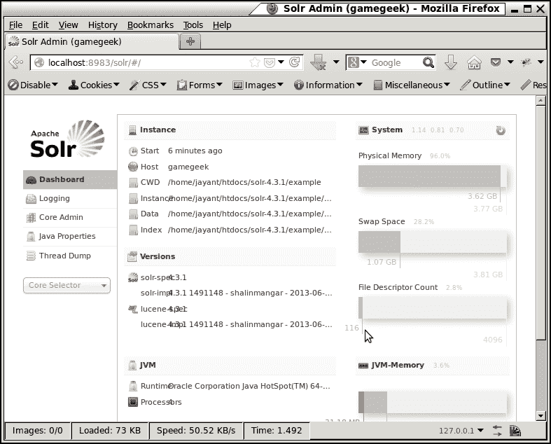
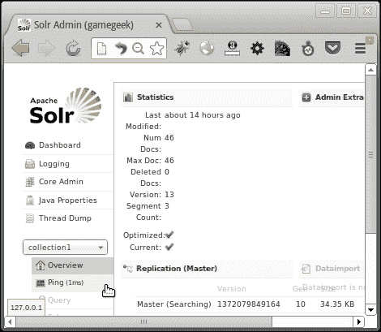
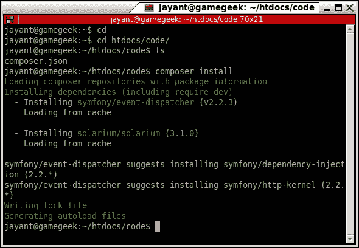

# 第一章：安装和集成 Solr 和 PHP

您是 PHP 程序员吗？您是否感到有必要在您的应用程序中整合搜索？您是否知道 Apache Solr？您是否觉得将 Solr 整合到您的 PHP 应用程序中是一项非常繁琐的工作？本书将为您简化整合过程。我们将全面整合 Apache Solr 与 PHP。我们将从 Solr 安装开始。我们将看看如何将 Solr 与 PHP 集成。然后，我们将通过 PHP 代码探索 Solr 提供的功能。阅读本书后，您应该能够将 Solr 提供的几乎所有功能整合到您的 PHP 应用程序中。

本章将帮助我们在两个主要环境中安装 Apache Solr：Windows 和 Linux。我们还将继续探索将 Solr 作为 Apache Tomcat 服务器的一部分进行安装。我们将讨论通过 PHP 与 Solr 通信的可用选项，并学习如何为 Solr PHP 集成设置 Solarium 库。

本章将涵盖以下主题：

+   什么是 Solr？

+   在 Windows 和 Linux 上下载和安装 Solr

+   配置 Tomcat 以运行 Solr。

+   使用 PHP 在 Solr 上执行 ping 查询

+   讨论 Solr PHP 集成的不同库

+   在 Windows 和 Linux 上安装 Solarium

+   使用 Solarium 将 PHP 连接到 Solr

+   使用 PHP 和 Solarium 运行 ping 查询

+   检查 Solr 日志

# Solr

您是 PHP 程序员，您构建网站，如招聘网站、电子商务网站、内容网站或其他网站。您需要为网站提供一个搜索框，用于搜索工作、产品或网站中的其他内容。您会如何处理？您是否在数据库中进行“like”搜索，或者可能使用 MySQL 中提供的全文搜索——如果您使用的是 MySQL。您是否愿意使用其他平台来为您进行搜索，并为您提供一系列功能，以根据您的要求调整搜索？

Solr 是一个开源的 Java 应用程序，提供了一个名为 Lucene 的全文搜索库的接口。Solr 和 Lucene 都是 Apache Lucene 项目的一部分。Apache Solr 使用 Apache Lucene 作为其搜索的核心。Apache Lucene 是一个用 Java 构建的开源搜索 API。除了全文搜索，Solr 还提供了一系列功能，如命中高亮和分面搜索。

# 安装 Solr

Solr 需要您的系统上安装有 Java。要检查系统上是否安装了 Java，请在 Linux 控制台或 Windows 命令提示符中运行`java –version`。如果 Java 的版本大于 1.6，则我们已经准备就绪。最好使用官方的 Java 运行环境，而不是 OpenJDK 提供的运行环境。

```php
**c:\>java -version**
**java version "1.6.0_18"**
**Java(TM) SE Runtime Environment (build 1.6.0_18-b07)**
**Java HotSpot(TM) Client VM (build 16.0-b13, mixed mode, sharing)**

```

让我们下载最新的 Solr。对于本书，我们使用的是 Solr 版本 4.3.1，可以从以下链接下载：

[`lucene.apache.org/solr/downloads.html`](http://lucene.apache.org/solr/downloads.html)

在 Windows 或 Linux 上安装 Solr 只需将`solr-4.3.1.zip`文件解压缩到一个文件夹中。Windows 和 Linux 的安装过程如下：

+   对于 Windows 的安装，只需右键单击 zip 文件并将其解压缩到`C:\solr-4.3.1`文件夹中。要启动 Solr，请转到 Windows 命令提示符**开始** | **运行**。在**运行**窗口中，键入`cmd`。在 Windows 命令提示符中键入以下内容：

```php
**cd C:\solr-4.3.1\example**
**java –jar start.jar**

```

+   对于 Linux 的安装，只需在您的主文件夹中解压缩 zip 文件。按照以下命令在控制台中提取和运行 Solr：

```php
**unzip solr-4.3.1.zip**
**cd ~/solr-4.3.1/example**
**java –jar start.jar**

```

当我们使用`java –jar start.jar`选项启动 Solr 时，Solr 运行在端口 8983 上。它使用一个名为 jetty 的内置 Web 服务器。要查看 Solr 的工作情况，只需将浏览器指向以下地址：

```php
http://localhost:8983/solr/
```

您将能够看到以下界面。这意味着 Solr 运行正常。以下屏幕截图显示了**Solr 管理**界面：



# 配置 Tomcat 以运行 Solr

默认情况下 Solr 使用的 web 服务器 jetty 仅用于开发目的。对于生产环境，我们希望 Solr 作为更方便的设置的一部分运行，涉及更可靠的 web 服务器。Solr 可以配置为在任何 J2EE 容器上运行，例如 IBM Websphere 或 JBoss 或任何其他服务器。Apache Tomcat 是最常用的服务器。让我们看看如何将 Solr 设置为 Apache Tomcat web 服务器的一部分。我们在 Windows 或 Linux 环境中安装了 Apache Tomcat。

要将 Solr 作为 Apache Tomcat web 服务器的一部分运行，您需要在配置中为`/solr`创建一个上下文。需要将以下`solr.xml`文件放在 Windows 和 Linux 中适当的位置，放在 Tomcat 配置文件夹`<tomcat_home>/conf/Catalina/localhost`中。

```php
<?xml version="1.0" encoding="UTF-8"?>
<Context docBase="/home/jayant/solr-4.3.1/example/webapps/solr.war" >
<Environment name="solr/home" type="java.lang.String" value="/home/jayant/solr-4.3.1/example/solr" override="true" />
</Context>
```

将`docBase`更改为`<solr_path>/example/webapps/solr.war`，并将`Environment`中的 value 属性更改为`<solr_path>/example/solr`。名为`solr/home`的环境告诉 Tomcat 可以找到 Solr 配置文件的位置。除此之外，让我们更改`<solr_path>/example/solr/solr.xml`文件中 Solr 的配置。搜索`hostPort`并将其更改为匹配 Tomcat 的端口`8080`。同样搜索`hostContext`并将其更更改为`solr`。

### 注意

Windows 用户在配置 XML 文件中的路径变量中使用`\`而不是`/`。不要更改`solr/home`中的`/`。

重新启动 Tomcat 服务器，您应该能够转到以下 URL 以查看 Solr 与 Tomcat 一起工作：

```php
http://localhost:8080/solr/
```

### 提示

如果在上述 URL 上看到错误“404 未找到”，可能是因为 Tomcat 无法找到 Solr 的某些库。您可以在`<tomcat_home>/logs/catalina.out`文件夹中的 Tomcat 错误日志中检查确切的错误。要解决缺少库的问题，请将所有 JAR 文件从`<solr_home>/example/lib/ext`复制到`<tomcat_home>/lib`文件夹。

您还可以通过将`<solr_home>/example/resources`文件夹中的`log4j.properties`文件复制到`<tomcat_home>/lib`文件夹中来在 Tomcat 日志中启用高级日志记录。

# 使用 PHP 在 Solr 上执行 ping 查询

在 Solr 中使用 ping 查询来监视 Solr 服务器的健康状况。让我们首先看看在**Solr Admin** web 界面上 ping 查询是如何工作的：

1.  打开浏览器并转到 Solr 的 URL。

1.  从左侧面板的下拉菜单中选择**collection1**。

1.  单击**Ping**，您将看到以毫秒为单位的 ping 时间出现在 ping 链接旁边。我们的 ping 正常工作。

让我们检查已安装的 PHP 版本。我们需要版本 5.3.2 及以上。要检查版本，请在 Windows 或 Linux 命令行上运行`php -v`，如下所示：

```php
**c:\>php -v**
**PHP 5.4.16 (cli) (built: Jun  5 2013 21:01:46)**
**Copyright (c) 1997-2013 The PHP Group**
**Zend Engine v2.4.0, Copyright (c) 1998-2013 Zend Technologies**

```

要使我们的 PHP 代码中的 ping 正常工作，我们将需要一个名为 cURL 的实用程序。对于 Linux 环境，我们需要安装`curl`，`libcurl`和`php5-curl`软件包。在 Linux 的 Ubuntu 发行版上，可以使用以下命令进行安装：

```php
**sudo apt-get install curl php5-curl**

```

要在 Windows 上启用 cURL，我们需要编辑 PHP 安装中的`php.ini`文件。搜索扩展目录设置并将其更改为`php_curl.dll`所在的位置。还要取消注释加载`php_curl.dll`的行：

```php
**extension=php_curl.dll**
**extension_dir = "C:\php\ext"**

```

以下 URL 是用于执行 ping 查询的 URL。访问此 URL，我们可以看到包含响应头和状态（OK）的响应。

```php
http://localhost:8080/solr/collection1/admin/ping
```

我们可以看到响应是 XML 格式的。要将响应转换为 JSON，只需在先前的 URL 中添加`wt=json`：

```php
http://localhost:8080/solr/collection1/admin/ping/?wt=json
```

Linux 用户可以使用以下命令检查 curl 调用的响应：

```php
**curl http://localhost:8080/solr/collection1/admin/ping/?wt=json**
**{"responseHeader":{"status":0,"QTime":7,"params":{"df":"text","echoParams":"all","rows":"10","echoParams":"all","wt":"json","q":"solrpingquery","distrib":"false"}},"status":"OK"}**

```

通过 PHP 直接调用 Solr 需要我们通过 cURL 调用带有 JSON 响应的 ping，并解码 JSON 响应以显示结果。以下是执行相同操作的一段代码。可以使用 PHP 命令行执行此代码：

```php
$curl = curl_init("http://localhost:8080/solr/collection1/admin/ping/?wt=json");
curl_setopt($curl, CURLOPT_RETURNTRANSFER, 1);
$output = curl_exec($curl);
$data = json_decode($output, true);
echo "Ping Status : ".$data["status"]."\n";
```

通过命令行执行上述代码，我们将得到以下输出：

```php
**Ping Status : OK**

```

### 提示

**下载示例代码**

您可以从您在[`www.PacktPub.com`](http://www.PacktPub.com)账户中下载您购买的所有 Packt 图书的示例代码文件。如果您在其他地方购买了这本书，您可以访问[`www.PacktPub.com/support`](http://www.PacktPub.com/support)并注册以直接通过电子邮件接收文件。

# 可用于 PHP-Solr 集成的库

对 Solr 执行任何任务的每次调用最终都是一个 URL，具体参数取决于我们需要完成的任务。因此，向 Solr 添加文档，从 Solr 中删除文档以及搜索文档都可以通过构建具有其各自命令参数的 URL 来完成。我们可以使用 PHP 和 cURL 调用这些 URL 并以 JSON 格式解释响应。但是，我们可以使用库来创建 Solr URL 并解释响应，而不是记住要在 URL 中发送的每个命令。以下是一些可用的库：

+   Solr-PHP-client

+   Apache Solr-PHP 扩展

+   Solarium

Solr-PHP-client 可以从以下位置获得：

[`code.google.com/p/solr-php-client/`](https://code.google.com/p/solr-php-client/)

可以看到，该库的最新发布日期是 2009 年 11 月。自 2009 年以来，该库没有任何发展。这是一个非常基本的客户端，不支持 Solr 中现有的许多功能。

Apache SolrPhp 扩展可以从以下位置获得：

[`pecl.php.net/package/solr`](http://pecl.php.net/package/solr)

该库的最新发布日期是 2011 年 11 月。这是一个相对更好的库。并且也是与[www.php.net](http://www.php.net)集成 Solr 建议的库。它旨在比其他库更快速和轻量级。该库的完整 API 可以从以下位置获得：

[`php.net/manual/en/book.solr.php`](http://php.net/manual/en/book.solr.php)

Solarium 是 Solr PHP 集成的最新库。它是开源的，并且不断更新。它是完全面向对象的，并且几乎在 Solr 中提供功能。它是完全灵活的，您可以添加您认为缺少的功能。还可以使用自定义参数来实现几乎任何任务。不过，该库有许多文件，因此有些沉重。Solarium 在某种程度上复制了 Solr 的概念。并且正在积极开发中。我们将安装 Solarium 并使用 Solarium 库通过 PHP 代码探索 Solr 的全面功能列表。

# 安装 Solarium

Solarium 可以直接下载和使用，也可以使用名为 Composer 的 PHP 包管理器进行安装。如果我们直接下载 Solarium 库，我们将不得不获取其他安装所需的依赖项。另一方面，Composer 可以自行管理所有依赖项。让我们快速看一下在 Windows 和 Linux 环境中安装 Composer。

对于 Linux，以下命令将有助于安装 Composer：

```php
**curl https://getcomposer.org/installer | php**
**mv** **composer.phar composer**

```

这些命令下载 Composer 安装程序 PHP 脚本，并将输出传递给 PHP 程序进行解释和执行。在执行过程中，PHP 脚本将 Composer 代码下载到单个可执行的 PHP 程序`composer.phar`（PHP 存档）中。出于方便使用的目的，我们将`composer.phar`可执行文件重命名为 Composer。在 Linux 上，Composer 可以安装在用户级别或全局级别。要在用户级别安装 Composer，只需使用以下命令将其添加到您的环境路径中：

```php
**export PATH=<path to composer>:$PATH**

```

要在全局级别安装 Composer，只需将其移动到系统路径，例如`/usr/bin`或`/usr/local/bin`。要检查 Composer 是否已成功安装，只需在控制台上运行 Composer 并检查 Composer 提供的各种选项。


Windows 用户可以从以下链接下载`composer-setup.exe`：

[`getcomposer.org/Composer-Setup.exe`](http://getcomposer.org/Composer-Setup.exe)

双击可执行文件，并按照说明安装 Composer。

### 注意

我们需要安装一个 Web 服务器——主要是 Apache，并配置它以在上面执行 PHP 脚本。

或者，我们可以使用 PHP 5.4 中内置的 Web 服务器。可以通过转到所有 HTML 和 PHP 文件所在的目录，并使用`php –S localhost:8000`命令在本地机器上的端口`8000`上启动 PHP 开发服务器来启动此服务器。

一旦 Composer 就位，安装 Solarium 就非常容易。让我们在 Linux 和 Windows 机器上都安装 Solarium。

对于 Linux 机器，打开控制台并导航到 Apache `documentRoot`文件夹。这是我们所有 PHP 代码和 Web 应用程序将驻留的文件夹。在大多数情况下，它是`/var/www`，或者可以通过更改 Web 服务器的配置来更改为任何文件夹。创建一个单独的文件夹，您希望您的应用程序驻留在其中，并在此文件夹内创建一个`composer.json`文件，指定要安装的 Solarium 版本。

```php
{
  "require": {
    "solarium/solarium": "3.1.0"
  }
}
```

现在通过运行`composer install`命令来安装 Solarium。Composer 会自动下载和安装 Solarium 及其相关依赖项，如 symfony 事件分发器。这可以在 Composer 的输出中看到。



对于 Windows 的安装，打开命令提示符并导航到 Apache `documentRoot`文件夹。在`documentRoot`文件夹内创建一个新文件夹，并在文件夹内运行`composer install`。

我们可以看到在安装过程中，`symfony event dispatcher`和`solarium library`被下载到一个名为`vendor`的单独文件夹中。让我们检查`vendor`文件夹的内容。它包括一个名为`autoload.php`的文件和三个文件夹，分别是`composer`、`symfony`和`solarium`。`autoload.php`文件包含了在我们的 PHP 代码中加载 Solarium 库的代码。其他文件夹都是不言自明的。`solarium`文件夹是库，`symfony`文件夹包含一个名为事件分发器的依赖项，这是 Solarium 正在使用的。`composer`文件夹包含帮助在 PHP 中加载所有所需库的文件。

# 使用 PHP 和 Solarium 库在 Solr 上执行 ping 查询

要使用 Solarium 库，我们需要在我们的 PHP 代码中加载 Solarium 库。让我们看看如何使用 PHP 和 Solarium 执行与之前发出的相同的 ping 查询。

### 注意

我们已经在 Apache `documentroot`的`code`文件夹内安装了 Solarium。Apache `documentRoot`指向`~/htdocs`（在我们的主文件夹内）。

首先在我们的代码中包含 Solarium 库，使用以下代码行：

```php
include_once("vendor/autoload.php");
```

创建一个 Solarium 配置数组，定义如何连接到 Solr。

```php
$config = array(
  "endpoint" => array("localhost" => array("host"=>"127.0.0.1",
  "port"=>"8080", "path"=>"/solr", "core"=>"collection1",)
) );
```

Solarium 有端点的概念。**端点**基本上是一组设置，可用于连接到 Solr 服务器和核心。对于我们通过 Solarium 执行的每个查询，我们可以指定一个端点，使用该端点执行查询。如果未指定端点，则使用第一个端点执行查询，即默认端点。使用端点的好处是，我们需要创建一个 Solarium 客户端实例，而不管我们使用的服务器或核心数量如何。

使用我们之前创建的配置创建 Solarium 客户端。并调用`createPing()`函数创建 ping 查询。

```php
**$client = new Solarium\Client($config);**
**$ping = $client->createPing();**

```

最后执行 ping 查询并使用以下命令获取结果：

```php
**$result = $client->ping($ping);**
**$result->getStatus();**

```

可以看到结果是一个数组。但是我们也可以调用`getStatus()`函数来获取 ping 的状态。我们可以使用 PHP 命令行执行代码，或者调用以下 URL 来查看结果：

```php
http://localhost/code/pingSolarium.php
```

# 更多关于端点的信息

Solarium 为我们提供了在多个 Solr 服务器上添加多个端点并使用单个 Solarium 客户端在任何 Solr 服务器上执行查询的灵活性。要为运行在`localhost`上的另一个端口`8983`上的 Solr 添加另一个端点，并使用它来执行我们的查询，我们将使用以下代码：

```php
$config = array(
  "endpoint" => array(
    "localhost" => array("host"=>"127.0.0.1","port"=>"8080","path"=>"/solr", "core"=>"collection1",),
    "localhost2" => array("host"=>"127.0.0.1","port"=>"8983","path"=>"/solr", "core"=>"collection1",)
  ) );
$result = $client->ping($ping, "localhost2");
```

Solarium 客户端提供了使用`addEndpoint(array $endpointConfig)`和`removeEndpoint(string $endpointName)`函数添加和删除端点的功能。要在运行时修改端点，我们可以调用`getEndpoint(String $endPointName)`来获取端点，然后使用`setHost(String $host)`、`setPort(int $port)`、`setPath(String $path)`和`setCore(String $core)`等函数来更改端点设置。端点提供的其他设置有：

+   `setTimeout(int $timeout)`设置用于指定 Solr 连接的超时时间

+   `setAuthentication(string $username, string $password)`设置用于在 Solr 或 Tomcat 需要 HTTP 身份验证时提供身份验证

+   `setDefaultEndpoint(string $endpoint)`设置可用于为 Solarium 客户端设置默认端点

# 检查 Solr 查询日志

我们现在已经能够使用 Solarium 库在 Solr 上执行 ping 查询。要了解这是如何工作的，请打开 Tomcat 日志。它可以在`<tomcat_path>/logs/solr.log`或`<tomcat_path>/logs/catalina.out`中找到。在 Linux 上，我们可以对日志进行 tail 操作，以查看新条目的出现：

```php
**tail –f solr.log**

```

运行我们之前编写的基于 cURL 的 PHP 代码后，我们可以在日志中看到以下命中：

```php
**INFO  - 2013-06-25 19:51:16.389; org.apache.solr.core.SolrCore; [collection1] webapp=/solr path=/admin/ping/ params={wt=json} hits=0 status=0 QTime=2**
**INFO  - 2013-06-25 19:51:16.390; org.apache.solr.core.SolrCore; [collection1] webapp=/solr path=/admin/ping/ params={wt=json} status=0 QTime=3**

```

运行基于 Solarium 的代码后，我们得到了类似的输出，但是还有一个额外的参数`omitHeader=true`。这个参数会导致忽略输出中的响应头。

```php
**INFO  - 2013-06-25 19:53:03.534; org.apache.solr.core.SolrCore; [collection1] webapp=/solr path=/admin/ping params={omitHeader=true&wt=json} hits=0 status=0 QTime=1**
**INFO  - 2013-06-25 19:53:03.534; org.apache.solr.core.SolrCore; [collection1] webapp=/solr path=/admin/ping params={omitHeader=true&wt=json} status=0 QTime=1**

```

最终，Solarium 也会创建一个 Solr URL 并向 Solr 发出 cURL 调用以获取结果。Solarium 如何知道要访问哪个 Solr 服务器？这些信息是在`$config`参数中的端点设置中提供的。

# Solarium 适配器

那些没有安装 cURL 的系统怎么办？Solarium 具有**适配器**的概念。适配器定义了 PHP 与 Solr 服务器通信的方式。默认适配器是 cURL，我们之前使用过。但是在没有 cURL 的情况下，适配器可以切换到 HTTP。**CurlAdapter**依赖于 curl 实用程序，需要单独安装或启用。另一方面，**HttpAdapter**使用`file_get_contents()` PHP 函数来获取 Solr 响应。这会使用更多的内存，在 Solr 上的查询数量很大时不建议使用。让我们看看在 Solarium 中切换适配器的代码：

```php
$client->setAdapter('Solarium\Core\Client\Adapter\Http');
var_dump($client->getAdapter());
```

我们可以调用`getAdapter()`来检查当前的适配器。还有其他可用的适配器——**ZendHttp**适配器与 Zend Framework 一起使用。还有一个**PeclHttp**适配器，它使用`pecl_http`包来向 Solr 发出 HTTP 调用。HTTP、Curl 和 Pecl 适配器支持身份验证，可以通过之前讨论的`setAuthentication()`函数来使用。**CurlAdapter**还支持使用代理。如果需要，您还可以使用适配器接口创建自定义适配器。

# 摘要

我们已经成功地将 Solr 安装为 Apache Tomcat 服务器的一部分。我们看到了如何使用 PHP 和 cURL 与 Solr 通信，但没有使用库。我们讨论了一些库，并得出结论，Solarium 功能丰富，是一个积极开发和维护的库。我们能够安装 Solarium 并能够使用 PHP 和 Solarium 库与 Solr 通信。我们能够在 Solr 日志中看到实际的查询被执行。我们探索了 Solarium 客户端库的一些功能，如端点和适配器。

在下一章中，我们将看到如何使用 Solarium 库来使用我们的 PHP 代码向 Solr 插入、更新和删除文档。
