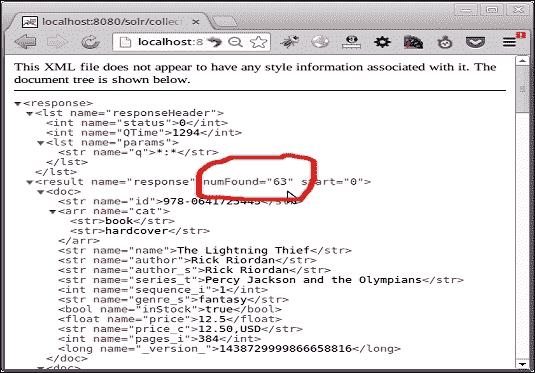
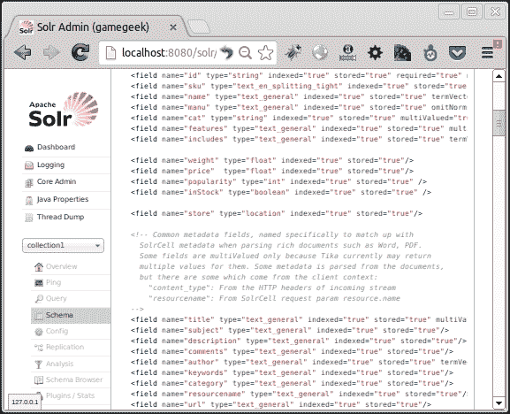

# 第二章：向 Solr 插入、更新和删除文档

我们将从讨论 Solr 模式开始这一章。我们将探索 Solr 提供的默认模式。此外，我们将探讨：

+   将示例数据推送到 Solr

+   将示例文档添加到 Solr 索引

+   使用 PHP 向 Solr 索引添加文档

+   使用 PHP 在 Solr 中更新文档

+   使用 PHP 在 Solr 中删除文档

+   使用提交、回滚和索引优化

# Solr 模式

Solr 模式主要由字段和字段类型组成。它定义了要存储在 Solr 索引中的字段以及在对这些字段进行索引或搜索时应该发生的处理。在内部，模式用于为使用 Lucene API 创建要进行索引的文档分配属性。Solr 提供的默认模式可以在`<solr_home>/example/solr/collection1/conf/schema.xml`中找到。在这里，`collection1`是核心的名称。

### 注意

Solr 服务器可以有多个核心，每个核心可以有自己的模式。

让我们打开`schema.xml`文件并仔细阅读。在 XML 文件中，我们可以看到有一个字段的部分，在其中有多个字段。另外，还有一个类型的部分。类型部分包含不同的`fieldType`条目，定义了字段的类型，以及在索引和查询期间如何处理字段。让我们了解如何创建`fieldType`条目。

`fieldType`条目包括一个用于字段定义的名称属性。类属性定义了`fieldType`条目的行为。还有一些其他属性：

+   `sortMissingLast`：如果设置为 true，此属性将导致没有该字段的文档出现在具有该字段的文档之后。

+   `sortMissingFirst`：如果设置为 true，此属性将导致没有该字段的文档出现在具有该字段的文档之前。

+   `precisionStep`：`precisionstep`的较低值意味着更高的精度，索引中的更多术语，更大的索引和更快的范围查询。`0`禁用在不同精度级别进行索引。

+   `positionIncrementGap`：它定义了多值字段中一个条目的最后一个标记和下一个条目的第一个标记之间的位置。让我们举个例子。

假设文档中的多值字段中有两个值。第一个值是`aa bb`，第二个值是`xx yy`。理想情况下，在索引期间分配给这些标记的位置将分别为`0`、`1`、`2`和`3`，对应于标记`aa`、`bb`、`xx`和`yy`。

搜索`bb xx`将在其结果中给出此文档。为了防止这种情况发生，我们必须给出一个较大的`positionIncrementGap`，比如`100`。现在，分配给这些标记的位置将分别为`0`、`1`、`100`和`101`，对应于标记`aa`、`bb`、`xx`和`yy`。搜索`bb xx`将不会给出结果，因为`bb`和`xx`不相邻。

`FieldType`条目可以是原始的，如`String`、`Int`、`Boolean`、`Double`、`Float`，也可以是派生的字段类型。派生字段类型可以包含用于定义在索引或查询期间将发生的处理的分析器部分。每个分析器部分包含一个**分词器**和多个过滤器。它们定义了数据的处理方式。例如，有一个`fieldType text_ws`，其中**分析器**是`WhiteSpaceTokenizerFactory`。因此，在`text_ws`类型的字段中进行索引或搜索的任何数据都将在空格上被分割成多个标记。另一个`fieldType text_general`具有用于索引和查询的单独的分析器条目。在索引数据的分析过程中，数据通过一个称为`StandardTokenizerFactory`的分词器，然后通过多个过滤器。以下是我们使用的过滤器：

+   `StopFilterFactory`：这些过滤器用于删除在`stopwords.txt`中定义的停用词

+   `SynonymFilterFactory`：这些过滤器用于为在`index_synonyms.txt`中定义的单词分配同义词

+   `LowerCaseFilterFactory`：此过滤器用于将所有标记中的文本转换为小写

同样，在搜索期间，对该字段的查询进行了不同的分析。这由类型查询的分析器定义。

大多数所需的字段类型通常在默认模式中提供。但是，如果我们觉得有必要，我们可以继续创建新的字段类型。

每个字段都包括名称和类型，这是必需的，还有一些其他属性。让我们来看看这些属性：

+   `name`：此属性显示字段的名称。

+   `type`：此属性定义字段的类型。所有类型都定义为我们之前讨论的`fieldType`条目。

+   `indexed`：如果此字段中的数据需要被索引，则此属性为 true。已索引字段中的文本被分解为标记，并从这些标记创建索引，可以根据这些标记搜索文档。

+   `stored`：如果此字段中的数据也需要存储，则此属性为 true。已索引的数据不能用于构建原始文本。因此，字段中的文本是单独存储的，以检索文档的原始文本。

+   `multivalued`：如果字段在单个文档中包含多个值，则此属性为 true。**标签**就是文档关联的多个值的一个例子。一个文档可以有多个标签，对于任何标签的搜索，都必须返回相同的文档。

+   `required`：如果字段在索引创建期间对每个文档都是必需的，则此属性为 true。

除了普通字段外，模式还包括一些动态字段，这些字段增加了定义字段名称的灵活性。例如，名为`*_i`的动态字段将匹配以`_i`结尾的任何字段，例如`genre_i`或`xyz_i`。

模式中的其他部分有：

+   **uniqueKey**：此部分定义一个字段为唯一且必需的。此字段将用于在所有文档中强制执行唯一性。

+   **copyField**：此部分可用于将多个字段复制到单个字段中。因此，我们可以有多个具有不同字段类型的文本字段，以及一个超级字段，其中所有文本字段都被复制，以便在所有字段中进行通用搜索。

# 向 Solr 索引添加示例文档

让我们将一些示例数据推送到 Solr 中。转到`<solr_dir>/example/exampledocs`。执行以下命令将所有示例文档添加到我们的 Solr 索引中：

```php
**java -Durl=http://localhost:8080/solr/update -Dtype=application/csv -jar post.jar books.csv**
**java -Durl=http://localhost:8080/solr/update  -jar post.jar *.xml**
**java -Durl=http://localhost:8080/solr/update -Dtype=application/json -jar post.jar books.json**

```

要检查已索引多少文档，请转到以下网址：

```php
http://localhost:8080/solr/collection1/select/?q=*:*
```

这是一个向 Solr 查询，要求返回索引中的所有文档。XML 输出中的`numFound`字段指定了我们 Solr 索引中的文档数量。



我们正在使用默认模式。要检查模式，请转到以下网址：

```php
http://localhost:8080/solr/#/collection1/schema
```

以下截图显示了示例模式文件`schema.xml`的内容：



我们可以看到有多个字段：`id`、`title`、`subject`、`description`、`author`等。配置 Solr 就是为了设计模式以满足字段的要求。我们还可以看到`id`字段是唯一的。

我们可以通过`post.jar`程序向 Solr 插入文档，就像之前看到的那样。为此，我们需要创建一个指定文档中字段和值的 XML、CSV 或 JSON 文件。一旦文件准备好，我们可以简单地调用前面提到的命令之一，将文件中的文档插入 Solr。文件的 XML 格式如下：

```php
<add>
  <doc>
      <field name="id">0553573403</field>
      <field name="cat">book</field>
      <field name="name">A game of thrones</field>
      <!--add more fields -->
  </doc>
  <!-- add more docs here -->
</add>
```

`post.jar`文件是用于处理文件中的多个文档的程序。如果我们有大量文档要插入，而且文档是以 CSV、XML 或 JSON 格式存在的，我们可以使用它。用于向 Solr 插入文档的 PHP 代码反过来创建一个 Solr URL，并使用适当的数据进行`curl`调用。

```php
curl http://localhost:8080/solr/update?commit=true -H "Content-Type: text/xml" --data-binary '<add><doc><field name="id">...</field></doc>...</add>'
```

# 使用 PHP 向 Solr 索引添加文档

让我们看看使用 Solarium 库向 Solr 添加文档的代码。当我们执行以下查询时，我们可以看到在我们的 Solr 索引中有三本作者*George R R Martin*的书：

```php
http://localhost:8080/solr/collection1/select/?q=martin
```

让我们添加剩下的两本书，这些书也已经发布到我们的索引中：

1.  使用以下代码创建一个 solarium 客户端：

```php
$client = new Solarium\Client($config);
```

1.  使用以下代码创建更新查询的实例：

```php
$updateQuery = $client->createUpdate();
```

1.  创建要添加的文档并向文档添加字段。

```php
$doc1 = $updateQuery->createDocument();
$doc1->id = 112233445;
$doc1->cat = 'book';
$doc1->name = 'A Feast For Crows';
$doc1->price = 8.99;
$doc1->inStock = 'true';
$doc1->author = 'George R.R. Martin';
$doc1->series_t = '"A Song of Ice and Fire"';
$doc1->sequence_i = 4;
$doc1->genre_s = 'fantasy';
```

1.  同样，可以创建另一个文档`$doc2`。

### 注意

请注意，`id`字段是唯一的。因此，我们必须为添加到 Solr 的不同文档保留不同的`id`字段。

1.  将文档添加到更新查询中，然后使用`commit`命令：

```php
$updateQuery->addDocuments(array($doc1, $doc2));
$updateQuery->addCommit();
```

1.  最后，执行以下查询：

```php
$result = $client->update($updateQuery);
```

1.  让我们使用以下命令执行代码：

```php
php insertSolr.php
```

执行代码后，搜索马丁得到了五个结果

1.  要添加单个文档，我们可以使用以下代码行将`addDocument`函数调用更新查询实例：

```php
$updateQuery->addDocument($doc1);
```

# 使用 PHP 更新 Solr 中的文档

让我们看看如何使用 PHP 代码以及 Solarium 库来更新 Solr 中的文档。

1.  首先检查我们的索引中是否有任何包含`smith`这个词的文档。

```php
http://localhost:8080/solr/collection1/select/?q=smith
```

1.  我们可以看到`numFound=0`，这意味着没有这样的文档。让我们在我们的索引中添加一本作者姓氏为`smith`的书。

```php
$updateQuery = $client->createUpdate();
$testdoc = $updateQuery->createDocument();
$testdoc->id = 123456789;
$testdoc->cat = 'book';
$testdoc->name = 'Test book';
$testdoc->price = 5.99;
$testdoc->author = 'Hello Smith';
$updateQuery->addDocument($testdoc);
$updateQuery->addCommit();
$client->update($updateQuery);
```

1.  如果我们再次运行相同的选择查询，我们可以看到现在我们的索引中有一个作者名为`Smith`的文档。现在让我们将作者的名字更新为`Jack Smith`，价格标签更新为`7.59`：

```php
$testdoc = $updateQuery->createDocument();
$testdoc->id = 123456789;
$testdoc->cat = 'book';
$testdoc->name = 'Test book';
$testdoc->price = 7.59;
$testdoc->author = 'Jack Smith';
$updateQuery->addDocument($testdoc, true);
$updateQuery->addCommit();
$client->update($updateQuery);
```

1.  再次运行相同的查询，我们可以看到现在在 Solr 的索引中作者姓名和价格已经更新。

更新 Solr 中的文档的过程与向 Solr 中添加文档的过程类似，只是我们必须将`overwrite`标志设置为`true`。如果没有设置参数，Solarium 将不会向 Solr 传递任何标志。但在 Solr 端，`overwrite`标志默认设置为`true`。因此，向 Solr 添加任何文档都将替换具有相同唯一键的先前文档。

Solr 内部没有更新命令。为了更新文档，当我们提供唯一键和覆盖标志时，Solr 内部会删除并再次插入文档。

我们需要再次添加文档的所有字段，即使不需要更新的字段也要添加。因为 Solr 将删除完整的文档并插入新文档。

方法签名中的另一个有趣的参数是在时间内提交。

```php
$updateQuery->addDocument($doc1, $overwrite=true, $commitwithin=10000)
```

上述代码要求 Solr 覆盖文档并在 10 秒内提交。这将在本章后面进行解释。

我们还可以使用`addDocuments(array($doc1, $doc2))`命令一次更新多个文档。

# 使用 PHP 在 Solr 中删除文档

现在让我们继续从 Solr 中删除这个文档。

```php
$deleteQuery = $client->createUpdate();
$deleteQuery->addDeleteQuery('author:Smith');
$deleteQuery->addCommit();
$client->update($deleteQuery);
```

现在，如果我们在 Solr 上运行以下查询，将找不到文档：

```php
http://localhost:8080/solr/collection1/select/?q=smith
```

我们在这里做的是在 Solr 中创建一个查询，搜索作者字段包含`smith`单词的所有文档，然后将其作为删除查询传递。

我们可以通过`addDeleteQueries`方法添加多个删除查询。这可以用于一次删除多组文档。

```php
$deleteQuery->addDeleteQuery(array('author:Burst', 'author:Alexander'));
```

执行此查询时，所有作者字段为`Burst`或`Alexander`的文档都将从索引中删除。

除了通过查询删除，我们还可以通过 ID 删除。我们添加到索引的每本书都有一个`id`字段，我们将其标记为唯一。要按 ID 删除，只需调用`addDeleteById($id)`函数。

```php
$deleteQuery->addDeleteById('123456789');
```

我们还可以使用`addDeleteByIds(array $ids)`一次删除多个文档。

### 注意

除了使用 PHP 代码删除文档，我们还可以使用`curl`调用通过 ID 或查询删除文档。按 ID 删除的 curl 调用如下：

```php
curl http://localhost:8080/solr/collection1/update?commitWithin=1000 -H "Content-Type: text/xml" --data-binary '<delete><id>123456789</id></delete>'
```

通过查询删除的`curl`调用如下：

```php
curl http://localhost:8080/solr/collection1/update?commitWithin=1000 -H "Content-Type: text/xml" --data-binary '<delete><query>author:smith</query></delete>'
```

以下是从 Solr 索引中删除所有文档的简单方法：

```php
**curl http://localhost:8080/solr/collection1/update?commitWithin=1000 -H "Content-Type: text/xml" --data-binary '<delete><query>*:*</query></delete>'**

```

# 提交、回滚和索引优化

我们一直作为参数传递给`addDocument()`函数的`commitWithin`参数指定了此添加文档操作的提交时间。这将提交的控制权留给 Solr 本身。Solr 会在满足更新延迟要求的同时将提交次数优化到最低。

回滚选项通过`addRollback()`函数公开。回滚可以在上次提交之后和当前提交之前进行。一旦提交完成，就无法回滚更改。

```php
$rollbackQuery = $client->createUpdate();
$rollbackQuery->addRollback();
```

索引优化并不一定是必需的任务。但是优化后的索引比未优化的索引性能更好。要使用 PHP 代码优化索引，我们可以使用`addOptimize(boolean $softCommit, boolean $waitSearcher, int $maxSegments)`函数。它具有启用软提交、等待新搜索器打开和优化段数的参数。还要注意，索引优化会减慢 Solr 上所有其他查询的执行速度。

```php
$updateQuery = $client->createUpdate();
$updateQuery->addOptimize($softcommit=true, $waitSearcher=false, $maxSegments=10)
```

对于更高级的选项，我们还可以使用`addParam()`函数向查询字符串添加键值对。

```php
$updateQuery->addParam('name', 'value');
```

通常建议将多个命令组合在一个请求中。这些命令按照它们添加到请求中的顺序执行。但是我们也要注意不要构建超出请求限制的大型查询。在运行大量查询时，在异常情况下使用回滚来避免部分更新/删除，并单独执行提交。

```php
  try
  {
      $client->update($updateQuery);
  }catch(Solarium\Exception $e)
  {
      $rollbackQuery = $client->createUpdate();
      $rollbackQuery->addRollback();
      $client->update($rollbackQuery);
  }
  $commitQry = $client->createUpdate();
  $commitQry->addCommit();
  $client->update($commitQry);
```

在上述代码片段中，如果`update`查询抛出异常，那么它将被回滚。

# 总结

在本章中，我们首先讨论了 Solr 模式。我们对 Solr 模式的工作原理有了基本的了解。然后我们向 Solr 索引中添加了一些示例文档。然后我们看到了多个代码片段，用于向 Solr 索引添加、更新和删除文档。我们还看到了如何使用 cURL 删除文档。我们讨论了提交和回滚在 Solr 索引上的工作原理。我们还看到了如何在我们的代码中使用回滚的示例。我们讨论了使用 PHP 代码进行索引优化以及优化 Solr 索引的好处。

在下一章中，我们将看到如何使用 PHP 代码在 Solr 上执行搜索查询，并探索 Solr 提供的不同查询模式。
