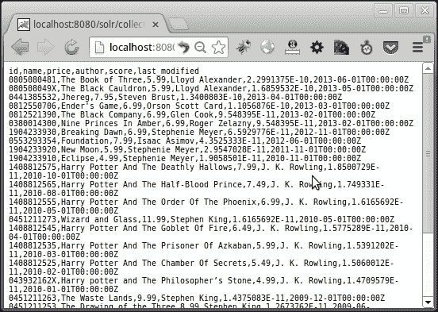

# 第三章：在 Solr 上执行选择查询和查询模式（DisMax/eDisMax）

本章将介绍如何使用 PHP 和 Solarium 库在 Solr 索引上执行基本的 select 查询。我们将指定不同的查询参数，如要获取的行数，获取特定字段，排序以及 Solarium 查询中的一些其他参数。我们将讨论 Solr 中的查询模式（查询解析器）是什么，并且还将介绍 Solr 中可用的不同查询模式及其用法。我们将查看不同的功能，以改进我们的查询结果或从我们的查询中获得更具体的结果。将涵盖的主题如下：

+   创建一个带有排序和返回字段的基本 select 查询

+   使用 select 配置运行查询

+   重复使用查询

+   DisMax 和 eDisMax 查询模式

+   Solarium 的基于组件的架构

+   使用 DisMax 和 eDisMax 执行查询

+   在 eDisMax 中对日期进行提升

+   高级调整参数

# 创建一个带有排序和返回字段的基本 select 查询

使用以下查询，让我们搜索索引中的所有书籍，并以 JSON 格式返回前五个结果：

```php
http://localhost:8080/solr/collection1/select/?q=cat:book&rows=5&wt=json
```

如前所述，我们可以形成一个查询 URL 并使用 cURL 通过 PHP 发出查询。解码 JSON 响应并将其用作结果。

让我们看一下 Solarium 代码，以在 Solr 上执行`select`查询。从 Solarium 客户端创建一个`select`查询，如下所示：

```php
$query = $client->createSelect();
```

创建一个搜索所有书籍的查询：

```php
$query->setQuery('cat:book');
```

假设我们每页显示三个结果。因此在第二页，我们将从第四个开始显示接下来的三个结果。

```php
$query->setStart(3)->setRows(3);
```

使用以下代码设置应返回哪些字段：

```php
$query->setFields(array('id','name','price','author'));
```

### 提示

PHP 5.4 用户可以使用方括号构造数组，而不是之前的`array(...)`构造。

```php
$query->setFields(['id','name','price','author']);
```

让我们使用以下查询按价格对结果进行排序：

```php
$query->addSort('price',$query::SORT_ASC);
```

最后，执行以下`select`查询并获取结果：

```php
$resultSet = $client->select($query);
```

结果集包含一个文档数组。每个文档都是一个包含字段和值的对象。对于 Solr 中的多值字段，所有值都将作为数组返回。我们需要相应地处理这些值。除了使用查询检索的四个字段之外，我们还会得到文档的分数。文档分数是由 Lucene 计算的一个数字，用于根据其与输入查询相关性对文档进行排名。我们将在后面的章节中深入讨论评分。让我们遍历结果集并显示字段。

```php
foreach($resultSet as $doc)
{
  echo PHP_EOL."-------".PHP_EOL;
  echo PHP_EOL."ID : ".$doc->id;
  echo PHP_EOL."Name : ".$doc->name;
  echo PHP_EOL."Author : ".$doc->author;
  echo PHP_EOL."Price : ".$doc->price;
  echo PHP_EOL."Score : ".$doc->score;
}
```

从结果集中，我们还可以使用`getNumFound()`函数获取找到的文档数量，如下所示：

```php
$found = $resultSet->getNumFound();
```

在内部，我们设置的参数用于形成一个 Solr 查询，并且相同的查询在 Solr 上执行。我们可以从 Solr 日志中检查正在执行的查询。

### 注意

Solr 日志位于`<tomcat_home>/logs`文件夹中的`catalina.out`文件中。

执行的查询如下所示：

```php
7643159 [http-bio-8080-exec-2] INFO  org.apache.solr.core.SolrCore  – [collection1] webapp=/solr path=/select params={omitHeader=true&sort=price+asc&fl=id,name,price,author&start=2&q=cat:book&wt=json&rows=5} hits=15 status=0 QTime=1
```

`setQuery()`函数的参数应该等于我们 Solr 查询中的`q`参数。如果我们想要在 Solr 索引中搜索多个字段，我们将不得不使用所需字段创建搜索查询。例如，如果我们想要搜索`Author`为`Martin`和`Category`为`book`，我们的`setQuery()`函数将如下所示：

```php
$query->setQuery('cat:book AND author:Martin');
```

# 使用 select 配置运行查询

除了通过函数构建`select`查询之外，还可以使用键值对数组构建`select`查询。以下是带有前述查询参数的`selectconfig`查询：

```php
$selectConfig = array(
  'query' => 'cat:book AND author:Martin',
  'start' => 3,
  'rows' => 3,
  'fields' => array('id','name','price','author'),
  'sort' => array('price' => 'asc')
);
```

我们还可以使用`addSorts(array $sorts)`函数将多个排序字段作为数组添加。要按价格排序，然后按分数排序，我们可以在`addSorts()`函数中使用以下参数：

```php
$query->addSorts(array('price'=>'asc','score'=>'desc'));
```

我们可以使用`getQuery()`函数获取查询参数。使用`getSorts()`函数从我们的 select 查询中获取排序参数。我们还可以使用`removeField($fieldStr)`和`removeSort($sortStr)`函数从查询的字段列表和排序列表中删除参数。

我们可以使用`setQueryDefaultField(String $field)`和`setQueryDefaultOperator(String $operator)`函数来更改 Solr 查询中的默认查询字段和默认运算符。如果没有提供这些函数，则默认的查询字段和默认的查询运算符将从 Solr 配置中获取。默认搜索字段从`solrconfig.xml`中的`df`参数中获取。如果没有提供，默认运算符为`OR`。可以通过在查询中传递`q.op`参数来覆盖它。

# 重用查询

在大多数情况下，作为应用程序的一部分构建的查询可以被重用。重用查询而不是再次创建它们会更有意义。Solarium 接口提供的函数有助于修改 Solarium 查询以便重用。让我们看一个重用查询的例子。

假设我们根据输入参数形成了一个复杂的查询。出于分页目的，我们希望使用相同的查询但更改`start`和`rows`参数以获取下一页或上一页。另一个可以重用查询的情况是排序。假设我们想按价格升序排序，然后再按降序排序。

首先，让我们定义并创建我们在代码中将要使用的 Solarium 命名空间的别名。

```php
use Solarium\Client;
use Solarium\QueryType\Select\Query\Query as Select;
```

接下来，创建一个扩展 Solarium 查询接口的类：

```php
Class myQuery extends Select
{
```

在类内部，我们将创建`init()`函数，它将覆盖`parent`类中的相同函数并在那里添加我们的默认查询参数，如下所示：

```php
protected function init()
{
  parent::init();
  $this->setQuery('*:*');
  $this->setFields(array('id','name','price','author','score'));
  $this->setStart($this->getPageStart(1));
  $this->setRows($this->RESULTSPERPAGE);
  $this->addSort('price', $this->getSortOrder('asc'));
}
```

`RESULTSPERPAGE`是一个私有变量，可以声明为`5`。创建一个单独的函数来设置查询。

```php
function setMyQuery($query)
{
  $this->setQuery($query);
}
```

创建一个函数来重置排序。重置意味着删除所有先前的排序参数。

```php
private function resetSort()
{
  $sorts = $this->getSorts();
  foreach($sorts as $sort)
  {
    $this->removeSort($sort);
  }
}
```

更改排序参数包括重置当前排序和添加新的排序参数。

```php
function changeSort($sortField, $sortOrder)
{
  $this->resetSort();
  $this->addSort($sortField, $this->getSortOrder($sortOrder));
}
```

添加额外排序参数的函数如下所示：

```php
function addMoreSort($sortField, $sortOrder)
{
  $this->addSort($sortField, $this->getSortOrder($sortOrder));
}
```

更改页面的函数如下所示：

```php
function goToPage($pgno)
{
  $this->setStart($this->getPageStart($pgno));
}
```

一旦类被定义，我们可以创建类的实例并设置我们的初始查询。这将给我们来自第一页的结果。

```php
$query = new myQuery();
$query->setMyQuery('cat:book');
echo "<b><br/>Searching for all books</b>".PHP_EOL;
$resultSet = $client->select($query);
displayResults($resultSet);
```

要前往任何其他页面，只需调用我们创建的`goToPage()`函数并传入我们想要前往的页面。它将改变 Solarium 查询，并将`Start`参数更改为与页面结果相符。

```php
$query->goToPage(3);
echo "<b><br/>Going to page 3</b>".PHP_EOL;
$resultSet = $client->select($query);
displayResults($resultSet);
```

完整的代码可以作为下载的一部分。我们在这里所做的是扩展查询接口并添加我们自己的函数来更改查询、重置和添加排序参数以及分页。一旦我们有了`myQuery`类的对象，我们所要做的就是根据需要不断改变参数并使用更改后的参数执行查询。

# DisMax 和 eDisMax 查询模式

**DisMax**（**Disjunction Max**）和**eDisMax**（**Extended Disjunction Max**）是 Solr 中的查询模式。它们定义了 Solr 如何解析用户输入以查询不同字段和不同相关权重。eDisMax 是对 DisMax 查询模式的改进。DisMax 和 eDisMax 默认启用在我们的 Solr 配置中。要切换查询类型，我们需要在我们的 Solr 查询中指定`defType=dismax`或`defType=edismax`。

让我们向我们的索引中添加一些更多的书籍。在我们的`<solr dir>/example/exampledocs`文件夹中执行以下命令（`books.csv`在代码下载中可用）：

```php
**java -Durl=http://localhost:8080/solr/update -Dtype=application/csv -jar post.jar books.csv**

```

DisMax 处理大多数查询。但仍有一些情况下 DisMax 无法提供结果。建议在这些情况下使用 eDisMax。DisMax 查询解析器不支持默认的 Lucene 查询语法。但该语法在 eDisMax 中得到支持。让我们来看看。

要在`cat`中搜索`books`，让我们执行以下查询：

```php
http://localhost:8080/solr/collection1/select?start=0&q=cat:book&rows=15&defType=dismax
```

我们将得到零结果，因为`q=cat:book`查询在 DisMax 中不受支持。要在 DisMax 中执行此查询，我们将不得不指定额外的查询参数`qf`（查询字段），如下所示：

```php
http://localhost:8080/solr/collection1/select?start=0&q=book&qf=cat&rows=15&defType=dismax
```

但`q=cat:book`将在 eDisMax 上起作用：

```php
http://localhost:8080/solr/collection1/select?start=0&q=cat:book&rows=15&defType=edismax
```

要了解 Solarium 库如何用于执行 DisMax 和 eDisMax 查询，我们需要介绍**组件**的概念。Solr 查询有很多选项。将所有选项放在单个查询模型中可能会导致性能下降。因此，额外的功能被分解为组件。Solarium 的查询模型处理基本查询，并且可以通过使用组件向查询添加附加功能。组件仅在使用时加载，从而提高性能。组件结构允许轻松添加更多组件。

# 使用 DisMax 和 eDisMax 执行查询

让我们探讨如何使用 Solarium 库执行 DisMax 和 eDisMax 查询。首先，使用以下代码从我们的选择查询中获取一个 DisMax 组件：

```php
$dismax = $query->getDisMax();
```

在 Solr 中使用 Boosting 来改变结果集中某些文档的得分，以便基于其内容对某些文档进行排名。增强查询是一个原始查询字符串，它与用户的查询一起插入以提高结果中的某些文档。我们可以在`author = martin`上设置一个增强。这个查询将通过`2`来增强包含`martin`的作者的结果。

```php
$dismax->setBoostQuery('author:martin²');
```

查询字段指定要使用某些增强进行查询的字段。传递给`setQuery`函数的查询字符串与这些字段中的文本进行匹配。当字段被增强时，对于该字段中的查询文本的匹配更加重要，因此该文档排名更高。在下面的函数中，作者字段中的匹配被增强了`3`，而名称中的匹配被增强了`2`，而`cat`字段没有增强。因此，在搜索期间，与作者中的输入查询文本匹配的文档将比在`name`或`cat`字段中找到文本的文档排名更高。

```php
$dismax->setQueryFields('cat name² author³');
```

默认情况下，默认 Solr 查询中的所有子句都被视为可选的，除非它们由`+`或`-`符号指定。可选子句被解释为查询中的任何一个子句应该与文档中指定字段中的文本匹配，以便将该文档视为搜索结果的一部分。在处理可选子句时，最小匹配参数表示必须匹配一些最小数量的子句。子句的最小数量可以是一个数字或一个百分比。在数字的情况下，不管查询中的子句数量如何，都必须匹配指定的最小数量。在百分比的情况下，从可用的子句数量和百分比计算出一个数字，然后将其向下舍入到最接近的整数，然后使用它。

```php
$dismax->setMinimumMatch('70%');
```

短语查询字段用于在查询参数中的术语在靠近的情况下提高文档的得分。短语查询字段中的查询术语越接近，文档的得分就越高。在下面的代码中，通过`5`来增强这个分数，从而提高了这些文档的相关性：

```php
$dismax->setPhraseFields('series_t⁵');
```

短语斜率是一个标记相对于另一个标记必须移动的位置数，以匹配查询中指定的短语。在索引期间，输入文本被分析并分解为更小的单词或短语，称为**标记**。同样，在搜索期间，输入查询被分解为与索引中的标记匹配的标记。这与`Phrase`字段一起使用，用于指定要应用于具有设置`Phrase`字段的查询的斜率。

```php
$dismax->setPhraseSlop('2');
```

查询斜率指定用户输入查询中短语中允许的斜率。

```php
$dismax->setQueryPhraseSlop('1');
```

eDisMax 具有 DisMax 解析器的所有功能并对其进行了扩展。

所有前述提到的功能也适用于 eDisMax 查询。我们所要做的就是获取 eDisMax 组件，并在 eDisMax 组件上调用这些功能。要获取 eDisMax 组件，请调用`getEDisMax()`函数如下：

```php
$edismax = $query->getEDisMax();
```

除此之外，eDisMax 还支持基本 Solr 查询解析器支持的基于字段的查询，并且在创建我们的搜索查询时给我们更好的灵活性。

eDisMax 为我们提供了应用具有乘法效应的增强函数的选项。我们可以使用`setBoostFunctionsMult()`函数来提供一个将与分数相乘的增强函数。另一方面，DisMax 解析器提供了`setBoostFunctions()`函数，它可以通过将函数的结果增强添加到查询的分数中来影响分数。

eDisMax 提供了一些其他函数，例如`setPhraseBigramFields()`，它将用户查询切成二元组，并查询指定的字段与相关的增强。例如，如果用户输入了`hello world solr`，它将被分解为`hello world`和`world solr`，并在这些函数中指定的字段上执行。类似地，另一个`setPhraseTrigramFields()`函数可以用于将用户输入分解为三元组，而不是二元组。三元组将包含三个词组，而不是我们之前在二元组中看到的两个词组。eDisMax 还提供了函数，如`setPhraseBigramSlop()`和`setPhraseTrigramSlop()`，用于在搜索期间指定与二元组和三元组字段相关的自定义 slop。

**Slop**是一个标记必须相对于另一个标记移动的位置数。标记`t1`和`t2`之间的`slop`为`5`意味着`t1`应该在`t2`的五个标记内出现。

让我们查看 DisMax 和 eDisMax 查询的 Solr 查询日志。

```php
43782622 [http-bio-8080-exec-5] INFO  org.apache.solr.core.SolrCore  – [collection1] webapp=/solr path=/select params={mm=70%25&tie=0.1&qf=cat+name²+author³&q.alt=*:*&wt=json&rows=25&defType=edismax&omitHeader=true&pf=series_t⁵&bq=author:martin²&fl=id,name,price,author,score&start=0&q=book+-harry+"dark+tower"&qs=1&ps=2} hits=24 status=0 QTime=55 

43795018 [http-bio-8080-exec-1] INFO  org.apache.solr.core.SolrCore  – [collection1] webapp=/solr path=/select params={mm=70%25&tie=0.1&qf=cat+name²+author³&q.alt=*:*&wt=json&rows=25&defType=dismax&omitHeader=true&pf=series_t⁵&bq=author:martin²&fl=id,name,price,author,score&start=0&q=book+-harry+"dark+tower"&qs=1&ps=2} hits=24 status=0 QTime=2
```

我们可以看到，除了 Solr 查询的常规参数之外，还有一个`defType`参数，用于指定查询的类型。在前面的情况下，我们可以看到`defType`是 DisMax 或 eDisMax，具体取决于我们执行的查询类型。

# 在 eDisMax 查询中的日期增强

让我们使用 eDisMax 根据日期增强搜索结果，以便最近的书籍出现在顶部。我们将使用`setBoostFunctionsMult()`函数来指定对`modified_date`的增强，在我们的情况下，它存储了记录最后添加或更新的日期。

```php
$query = $client->createSelect();
$query->setQuery('cat:book -author:martin');
$edismax = $query->getedismax();
$edismax->setBoostFunctionsMult('recip(ms(NOW,last_modified),1,1,1)');
$resultSet = $client->select($query);
```

在这里，我们正在搜索所有作者不是 Martin（`martin`）的书籍。`-`（负号）用于*非查询*。我们还对今天和上次修改日期之间的倒数进行了乘法增强。Solr 提供的`recip`函数定义如下：

```php
recip(x,m,a,b) = a/(m*x+b) which in our case becomes 1/(1*ms(NOW,last_modified)+1)
```

在这里，`m`，`a`和`b`是常数，`x`可以是任何数值或复杂函数。在我们的情况下，`x`是`NOW`和`last_modified`之间的毫秒数。我们在分母中添加`1`以避免在`last_modified`不存在的情况下出现错误。这表明随着`NOW`和`last_modified`之间的差异增加，该文档的增强减少。最近的文档具有更高的`last_modified`，因此与`NOW`相关的差异较小，因此增强更多。让我们检查查询的 Solr 日志。

```php
**2889948 [http-bio-8080-exec-4] INFO  org.apache.solr.core.SolrCore  – [collection1] webapp=/solr path=/select params={mm=70%25&tie=0.1&pf2=name²+author¹.8+series_t¹.3&q.alt=*:*&wt=json&rows=25&defType=edismax&omitHeader=true&pf=series_t⁵&fl=id,name,price,author,score,last_modified&start=0&q=cat:book+-author:martin&boost=recip(ms(NOW,last_modified),1,1,1)} hits=26 status=0 QTime=59**

```

复制并粘贴 Solr 日志中的查询参数，并附加到 Solr `select` URL。还将`wt=json`更改为`wt=csv`。这将给出结果的逗号分隔视图。

```php
**http://localhost:8080/solr/collection1/select?mm=70%25&tie=0.1&pf2=name²+author¹.8+series_t¹.3&q.alt=*:*&wt=csv&rows=25&defType=edismax&omitHeader=true&pf=series_t⁵&fl=id,name,price,author,score,last_modified&start=0&q=cat:book+-author:martin&boost=recip(ms(NOW,last_modified),1,1,1)**

```



可以进一步修改 URL 以根据我们的要求调整/修改查询。

# 高级查询参数

备用查询在查询参数为空或未指定时使用。Solarium 默认将查询参数设置为`*:*`。备用查询可用于从索引中获取所有文档以进行分面目的。

```php
$dismax->setQueryAlternative('*:*');
```

对于选择所有 DisMax/eDisMax 中的文档，正常的查询语法`*:*`不起作用。要选择所有文档，请将 Solarium 查询中的默认查询值设置为空字符串。这是因为 Solarium 中的默认查询是`*:*`。还将备用查询设置为`*:*`。DisMax/eDisMax 正常查询语法不支持`*:*`，但备用查询语法支持。

# 摘要

我们能够使用 Solarium 库在 Solr 上执行选择查询。我们探索了`select`查询的基本参数。我们看到如何使用配置数组来创建 Solarium 查询。我们能够在执行查询后遍历结果。我们扩展了查询类以重复使用查询。我们能够对现有查询进行分页，并能够在不重新创建完整查询的情况下更改排序参数。我们在 Solr 中看到了 DisMax 和 eDisMax 查询模式。我们还对 Solarium 库的基于组件的结构有了一些了解。我们探索了 DisMax 和 eDisMax 查询的查询参数。我们还看到了如何使用 eDisMax 查询在 Solr 上进行“最近优先”日期提升。最后，我们在 Solarium 中看到了一些高级查询参数，用于 DisMax 和 eDisMax。

在下一章中，我们将深入研究基于查询结果不同标准的高级查询。
