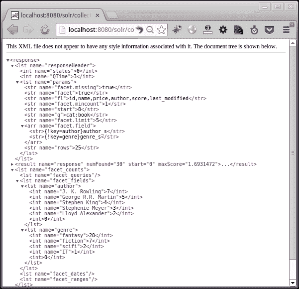
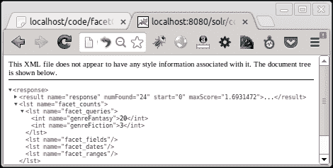
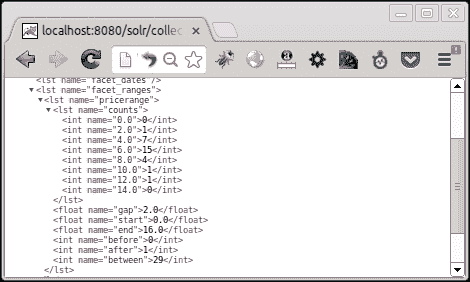
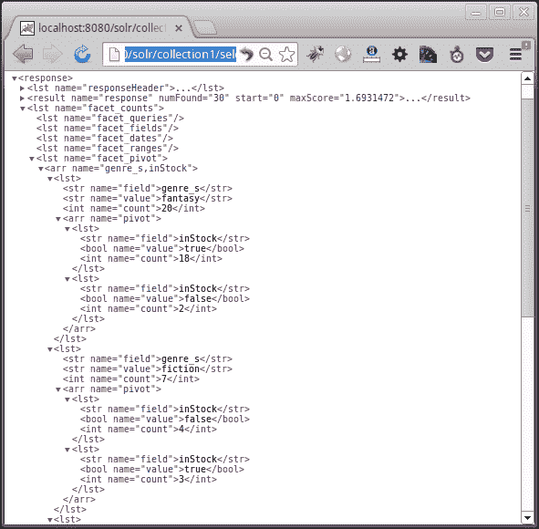

# 第四章：高级查询-过滤器查询和分面

本章首先定义了过滤器查询及其与我们之前使用的普通搜索查询相比的优点。我们将看到如何在 Solr 中使用 PHP 和 Solarium 库使用过滤器查询。然后我们将探讨 Solr 中的分面。我们还将看到如何使用 PHP 在 Solr 中进行分面。我们将探索按字段进行分面、按查询进行分面和按范围进行分面。我们还将看看如何使用枢轴进行分面。将涵盖的主题如下：

+   过滤器查询及其优点

+   使用 PHP 和 Solarium 执行过滤器查询

+   创建过滤器查询配置

+   分面

+   按字段、查询和范围进行分面

+   分面枢轴

# 过滤器查询及其优点

过滤器查询用于在不影响评分的情况下对 Solr 查询的结果进行**过滤**。假设我们正在寻找所有有库存的书籍。相关查询将是`q=cat:book AND inStock:true`。

```php
http://localhost:8080/solr/collection1/select/?q=cat:book%20AND%20inStock:true&fl=id,name,price,author,score,inStock&rows=50&defType=edismax
```

处理相同查询的另一种方法是使用过滤器查询。查询将变为`q=cat:book&fq=inStock:true`。

```php
http://localhost:8080/solr/collection1/select/?q=cat:book&fl=id,name,price,author,score,inStock&rows=50&fq=inStock:true&defType=edismax
```

尽管结果相同，但使用过滤器查询有一定的好处。过滤器查询仅存储文档 ID。这使得在查询中应用过滤器以包括或排除文档非常快速。另一方面，普通查询具有复杂的评分函数，导致性能降低。过滤器查询不进行评分或相关性计算和排名。使用过滤器查询的另一个好处是它们在 Solr 级别被缓存，从而获得更好的性能。建议使用过滤器查询而不是普通查询。

# 执行过滤器查询

要向现有查询添加过滤器查询，首先需要从我们的 Solr 查询模块创建一个过滤器查询。

```php
$query = $client->createSelect();
$query->setQuery('cat:book');
$fquery = $query->createFilterQuery('Availability');
```

作为`createFilterQuery()`函数的参数提供的字符串被用作过滤器查询的*key*。此键可用于检索与此查询关联的过滤器查询。一旦过滤器查询模块可用，我们可以使用`setQuery()`函数为此 Solarium 查询设置过滤器查询。

在上面的代码片段中，我们创建了一个名为`Availability`的过滤器查询。我们将为键`Availability`设置过滤器查询为`instock:true`，然后执行完整的查询如下：

```php
$fquery->setQuery('inStock:true');
$resultSet = $client->select($query);
```

一旦结果集可用，就可以迭代它以获取和处理结果。

让我们检查 Solr 日志，看看发送到 Solr 的查询。

```php
70981712 [http-bio-8080-exec-8] INFO  org.apache.solr.core.SolrCore  – [collection1] webapp=/solr path=/select params={mm=70%25&tie=0.1&pf2=name²+author¹.8+series_t¹.3&q.alt=*:*&wt=json&rows=25&defType=edismax&omitHeader=true&pf=series_t⁵&fl=id,name,price,author,score,last_modified&start=0&q=cat:book+-author:martin&boost=recip(ms(NOW,last_modified),1,1,1)&**fq=inStock:true**} hits=19 status=0 QTime=4
```

我们可以看到`fq`参数`inStock:true`附加到我们 Solr 查询的参数列表中。

`getFilterQuery(string $key)`函数可用于检索与 Solarium 查询关联的过滤器查询。

```php
echo $fquery->getFilterQuery('Availability')->getQuery();
```

# 创建过滤器查询配置

我们还可以使用`addFilterQuery()`函数将过滤器查询作为配置参数传递给 Solarium 查询。为此，我们需要首先将过滤器查询定义为配置数组，然后将其添加到 Solarium 查询中。

```php
$fqconfig = array(
          "query"=>"inStock:true",
          "key"=>"Availability",
  );
$query = $client->createSelect();
$query->addFilterQuery($fqconfig);
```

上述配置创建的 Solr 查询与之前创建的查询类似。使用过滤器查询配置的好处是我们可以将多个标准过滤器查询定义为配置，并根据需要将它们添加到我们的 Solr 查询中。`addTag(String $tag)`和`addTags(array $tags)`函数用于在过滤器查询中定义标签。我们可以使用这些标签在分面中排除某些过滤器查询。稍后我们将通过一个示例进行说明。

# 分面

分面搜索将搜索结果分成多个类别，显示每个类别的计数。分面用于搜索以深入查询结果的子集。要了解分面有多么有用，让我们转到[www.amazon.com](http://www.amazon.com)搜索手机。我们将在左侧看到分面，如品牌、显示尺寸和运营商。一旦选择一个分面进行深入，我们将看到更多的分面，这将帮助我们缩小我们想购买的手机范围。

facet 通常用于预定义的人类可读文本，例如位置、价格和作者姓名。对这些字段进行标记化是没有意义的。因此，*facet 字段*在 Solr 模式中与搜索和排序字段分开。它们也不转换为小写，而是保留原样。facet 是在 Solr 上索引字段上完成的。因此，不需要存储 facet 字段。

Solarium 引入了**facetset**的概念，这是一个中央组件，可用于创建和管理 facet，并设置全局 facet 选项。让我们将本章的`books.csv`文件推送到 Solr 索引中。我们可以使用与第二章中使用的相同命令，*向 Solr 插入、更新和删除文档*，如下所示：

```php
**java -Durl=http://localhost:8080/solr/update -Dtype=application/csv -jar post.jar books.csv**

```

# 按字段 facet

按字段 facet 计算特定字段中术语的出现次数。让我们在**作者**和**流派**上创建 facet。在我们的 Solr 索引中，有专门的字符串字段用于索引与 facet 相关的字符串，而不进行任何标记。在这种情况下，字段是`author_s`和`genre_s`。

### 注意

以`_s`结尾的字段是在我们的 Solr `schema.xml`中定义的动态字段。定义为`*_s`的动态字段匹配以`_s`结尾的任何字段，并且字段定义中的所有属性都应用在这个字段上。

创建一个在我们的`author_s`字段上的 facet，我们需要从 Solarium 查询中获取`facetset`组件，创建一个`facet field`键，并使用将要创建的 facet 来设置实际字段。

```php
$query->setQuery('cat:book');
$facetset = $query->getFacetSet();
$facetset->createFacetField('author')->setField('author_s');
```

使用以下代码设置要获取的 facet 数量：

```php
$facetset->setLimit(5);
```

返回至少有一个术语的所有 facet。

```php
$facetset->setMinCount(1);
```

还返回没有 facet 字段值的文档。

```php
$facetset->setMissing(true);
```

执行查询后，我们将需要通过 facet 字段键获取 facet 和计数。

```php
$resultSet = $client->select($query);
$facetData = $resultSet->getFacetSet()->getFacet('author');
foreach($facetData as $item => $count)
{
  echo $item.": [".$count."] <br/>".PHP_EOL;
}
```

此外，我们可以使用`setOffset(int $offset)`函数从此偏移开始显示 facet。`setOffset(int $offset)`和`setLimit(int $limit)`函数可用于 facet 内的分页。

通过 Solr 日志，我们可以看到在 Solr 上执行的查询。

```php
928567 [http-bio-8080-exec-9] INFO  org.apache.solr.core.SolrCore  – [collection1] webapp=/solr path=/select params={omitHeader=true&**facet.missing=true&facet=true**&fl=id,name,price,author,score,last_modified&**facet.mincount=1**&start=0&q=cat:book&**facet.limit=5&facet.field={!key%3Dauthor}author_s&facet.field={!key%3Dgenre}genre_s**&wt=json&rows=25} hits=30 status=0 QTime=2 
```

传递参数`facet=true`以启用 facet。需要 facet 的字段作为多个`facet.field`值传递。我们在这里看到的其他参数是`facet.missing`，`facet.mincount`和`facet.limit`。要检查 Solr 对 facet 查询的响应，让我们从日志中复制查询，将其粘贴到我们的 Solr URL 中，并删除`omitHeaders`和`wt`参数。

```php
http://localhost:8080/solr/collection1/select/?facet.missing=true&facet=true&fl=id,name,price,author,score,last_modified&facet.mincount=1&start=0&q=cat:book&facet.limit=5&facet.field={!key%3Dauthor}author_s&facet.field={!key%3Dgenre}genre_s&rows=25
```



facet 是在字段上的-作者和流派。不同作者和流派的计数是可见的。

# 按查询 facet

我们可以使用 facet 查询来获取与 facet 查询相关的计数，而不受主查询的影响，并且可以排除过滤查询。让我们看看获取`genre`为`fantasy`的 facet 计数的代码，并且还看一个排除过滤查询的示例。

让我们首先创建一个查询，以选择我们索引中的所有书籍。

```php
$query->setQuery('cat:book');
```

为库存中的书籍创建一个过滤查询并对其进行标记。

```php
$fquery = $query->createFilterQuery('inStock');
$fquery->setQuery('inStock:true');
$fquery->addTag('inStockTag');
```

使用以下代码从我们的查询中获取`facetset`组件：

```php
$facetset = $query->getFacetSet();
```

创建一个 facet 查询，以计算特定流派的书籍数量。还要排除我们之前添加的过滤查询。

```php
$facetqry = $facetset->createFacetQuery('genreFantasy');
$facetqry->setQuery('genre_s: fantasy');
$facetqry->addExclude('inStockTag');
```

让我们添加另一个 facet 查询，其中不排除过滤查询：

```php
$facetqry = $facetset->createFacetQuery('genreFiction');
$facetqry->setQuery('genre_s: fiction');
```

执行查询后，我们可以从结果集中获取计数。

```php
$fantasyCnt = $resultSet->getFacetSet()->getFacet('genreFantasy')->getValue();
$fictionCnt = $resultSet->getFacetSet()->getFacet('genreFiction')->getValue();
```

在这里，`fantasy` facet 的计数包含了不在库存中的书籍，因为我们已经排除了获取库存中的书籍的过滤查询。而`fiction` facet 只包含库存中的书籍，因为在这个 facet 查询中没有排除过滤查询。

```php
1973307 [http-bio-8080-exec-9] INFO  org.apache.solr.core.SolrCore  – [collection1] webapp=/solr path=/select params={omitHeader=true&facet=true&fl=id,name,price,author,score,last_modified&**facet.query={!key%3DgenreFantasy+ex%3DinStockTag}genre_s:+fantasy&facet.query={!key%3DgenreFiction}genre_s:+fiction**&start=0&q=cat:book&wt=json&fq={!tag%3DinStockTag}inStock:true&rows=25} hits=24 status=0 QTime=2 
```

从 Solr 日志中，我们可以看到传递用于使用查询创建 facet 的参数是`facet.query`。



流派幻想和小说的查询计数

我们可以创建多个 facet 查询来获取不同查询 facet 的计数。但使用 Solarium 提供的**facet multiquery**功能更容易。让我们看看使用 facet multiquery 功能获取`genre`为`fantasy`和`fiction`的 facet 计数的代码：

```php
$facetmqry = $facetset->createFacetMultiQuery('genre');
$facetmqry->createQuery('genre_fantasy','genre_s: fantasy');
$facetmqry->createQuery('genre_fiction','genre_s: fiction');
```

以下是在执行主查询后获取所有 facet 查询的 facet 计数的代码。

```php
$facetCnts = $resultSet->getFacetSet()->getFacet('genre');
foreach($facetCnts as $fct => $cnt){
  echo $fct.': ['.$cnt.']'."<br/>".PHP_EOL;
}
```

使用`facetMultiQuery`和`facetQuery`创建的 Solr 查询是相同的。

# 按范围分面

分面也可以基于范围进行。例如，我们可以为每两美元的书籍创建 facet 计数。使用范围分面，我们可以给出价格在 0-2 美元之间的书籍的计数，以及 2-4 美元之间的书籍的计数，依此类推。

```php
$facetqry = $facetset->createFacetRange('pricerange');
$facetqry->setField('price');
$facetqry->setStart(0);
$facetqry->setGap(2);
$facetqry->setEnd(16);
```

在上述代码中，我们从价格`0`美元开始进行分面，直到`16`美元。在执行查询后，将使用以下代码显示范围 facet 及其计数：

```php
$facetCnts = $resultSet->getFacetSet()->getFacet('pricerange');
foreach($facetCnts as $range => $cnt){
  echo $range.' to '.($range+2).': ['.$cnt.']'."<br/>".PHP_EOL;
}
```



按范围输出的分面

```php
5481523 [http-bio-8080-exec-4] INFO  org.apache.solr.core.SolrCore  – [collection1] webapp=/solr path=/select params={facet=true&f.price.facet.range.gap=2&**facet.range={!key%3Dpricerange+ex%3DinStockTag}price**&wt=json&rows=5&omitHeader=true&f.price.facet.range.other=all&fl=id,name,price,author,score,last_modified&start=0&q=cat:book&f.price.facet.range.end=16&fq={!tag%3DinStockTag}inStock:true&f.price.facet.range.start=0} hits=24 status=0 QTime=29
```

在这种情况下 Solr 查询中使用的参数是`facet.range`。可以同时提供多个 facet 参数。例如，我们可以在单个查询中进行按查询分面和按范围分面。

# 按枢轴分面

除了创建 facet 的不同方式之外，Solr 还提供了**按枢轴分面**的概念，并通过 Solarium 公开。枢轴分面允许我们在父 facet 的结果中创建 facet。枢轴分面的输入是一组要进行枢轴的字段。多个字段在响应中创建多个部分。

以下是在`genre`和`availability`（有库存）上创建 facet 枢轴的代码：

```php
$facetqry = $facetset->createFacetPivot('genre-instock');
$facetqry->addFields('genre_s,inStock');
```

要显示枢轴，我们必须从结果集中获取所有的 facet。

```php
$facetResult = $resultSet->getFacetSet()->getFacet('genre-instock');
```

对于每个 facet，获取 facet 的字段、值和计数，以及 facet 内的更多 facet 枢轴。

```php
  echo 'Field: '.$pivot->getField().PHP_EOL;
  echo 'Value: '.$pivot->getValue().PHP_EOL;
  echo 'Count: '.$pivot->getCount().PHP_EOL;
```

还要获取此 facet 内的所有枢轴，并在需要时以相同的方式进行递归调用处理。

```php
  $pivot->getPivot();
```

这个功能在创建数据的完整分类方面非常有帮助，可以在不同级别上进行 facet。从 Solr 查询日志中可以看到，这里使用的参数是`facet.pivot`。

```php
6893766 [http-bio-8080-exec-10] INFO  org.apache.solr.core.SolrCore  – [collection1] webapp=/solr path=/select params={omitHeader=true&facet=true&fl=id,name,price,author,score,last_modified&start=0&q=cat:book&facet.pivot.mincount=0&wt=json&**facet.pivot=genre_s,inStock**&rows=5} hits=30 status=0 QTime=9
```

在 Solr 界面上执行相同的查询时，我们得到以下输出。

```php
http://localhost:8080/solr/collection1/select/?facet=true&fl=id,name,price,author,score,last_modified&start=0&q=cat:book&facet.pivot.mincount=0&facet.pivot=genre_s,inStock&rows=5
```



第一级分类发生在 genre 字段上。在 genre 内部，第二级分类发生在 inStock 字段上。

# 总结

在本章中，我们看到了 Solr 的高级查询功能。我们定义了过滤查询，并看到了使用过滤查询而不是普通查询的好处。我们看到了如何使用 PHP 和 Solarium 在 Solr 上进行分面处理。我们看到了不同的分面结果的方式，如按字段分面、按查询分面、按范围分面以及创建分面枢轴。我们还看到了在 Solr 上执行的实际查询，并在某些情况下执行了 Solr 上的查询并查看了结果。

在下一章中，我们将探讨使用 PHP 和 Solr 对搜索结果进行高亮显示。
