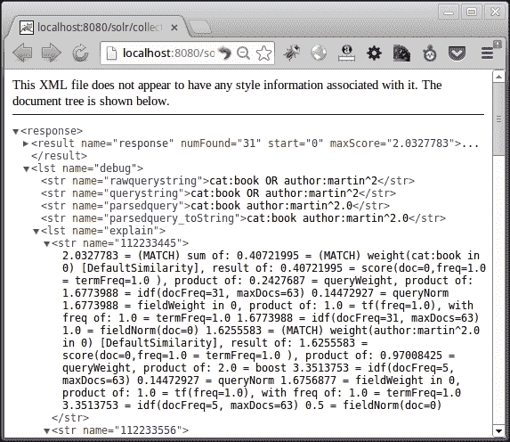
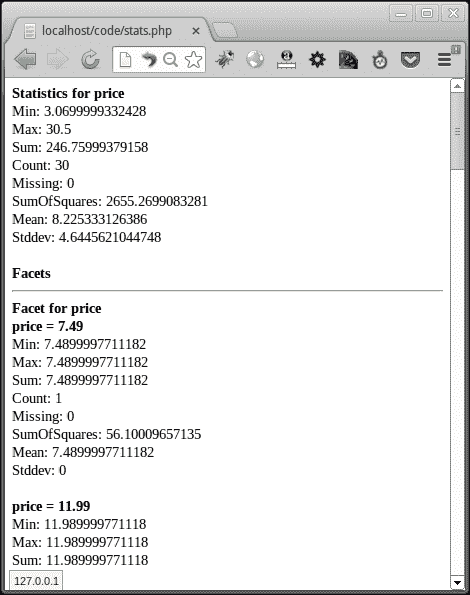
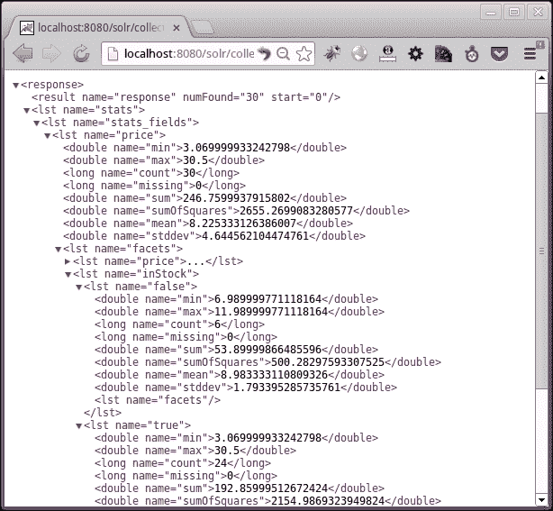

# 第六章：调试和统计组件

调试和统计是 Solarium 中用于获取有关索引统计信息以及查询执行和结果返回方式的两个组件。在本章中，我们将探讨这两个组件，并深入介绍如何使用 stats 组件检索索引统计信息。我们还将看看 Solr 如何计算相关性分数，以及如何使用 PHP 获取和显示 Solr 返回的查询解释。我们将探讨：

+   Solr 如何进行相关性排名

+   通过 PHP 代码执行调试

+   在 Solr 界面上运行调试

+   显示调试查询的输出

+   使用 stats 组件显示查询结果统计信息

你可能会问为什么我要深入研究这些组件的理论？这会帮助我实现什么？使用调试组件的好处在于理解和分析搜索结果的排名方式。为什么某个文档排在前面，另一个文档排在最后？此外，如果您想要修改排名以适应您希望结果显示的方式，您必须提升某些字段，并再次调试和分析应用提升后查询的执行情况。简而言之，调试组件帮助我们分析和修改排名以满足我们的需求。统计组件主要用于显示索引统计信息，这可以用来展示正在处理的索引的复杂性。

# Solr 相关性排名

当查询传递给 Solr 时，它会转换为适当的查询字符串，然后由 Solr 执行。对于结果中的每个文档，Solr 根据文档的相关性得分进行排序。默认情况下，得分较高的文档在结果中优先考虑。

Solr 相关性算法被称为**tf-idf 模型**，其中**tf**代表**术语频率**，**idf**代表**逆文档频率**。解释调试查询输出所使用的相关性计算参数的含义如下：

+   **tf**：术语频率是术语在文档中出现的频率。更高的术语频率会导致更高的文档得分。

+   **idf**：逆文档频率是术语出现在的文档数量的倒数。它表示索引中所有文档中术语的稀有程度。具有稀有术语的文档得分较高。

+   **coord**：这是协调因子，表示文档中找到了多少查询术语。具有更多查询术语的文档将得到更高的分数。

+   **queryNorm**：这是一个用于使跨查询的得分可比较的归一化因子。由于所有文档都乘以相同的 queryNorm，它不会影响文档排名。

+   **fieldNorm**：字段规范化惩罚具有大量术语的字段。如果一个字段包含的术语比其他字段多，那么它的得分就低于其他字段。

我们之前已经看到了查询时间提升。调试查询的目的是查看如何计算相关性，并利用我们对查询时间提升的了解来根据我们的需求调整输出。

# 通过 PHP 代码执行调试

要使用 PHP 启用对 Solr 查询的调试，我们需要从我们的查询中获取调试组件。

除了获取默认查询的调试信息外，我们还可以调用`explainOther()`函数来获取与主查询相关的指定查询的某些文档的分数，如下面的查询所示：

```php
  $query->setQuery('cat:book OR author:martin²');
  $debugq = $query->getDebug();
  $debugq->setExplainOther('author:king');
```

在上面的代码片段中，我们正在搜索所有的书籍，并通过`2`来提升作者`martin`的书籍。除此之外，我们还获取了作者`king`的书籍的调试信息。

运行查询后，我们需要从`ResultSet`中获取调试组件。然后我们使用它来获取查询字符串、解析的查询字符串、查询解析器以及调试其他查询的信息，如下面的代码所示：

```php
  echo 'Querystring: ' . $dResultSet->getQueryString() . '<br/>';
  echo 'Parsed query: ' . $dResultSet->getParsedQuery() . '<br/>';
  echo 'Query parser: ' . $dResultSet->getQueryParser() . '<br/>';
  echo 'Other query: ' . $dResultSet->getOtherQuery() . '<br/>';
```

我们需要遍历调试结果集，对于每个文档，我们需要获取总得分值，匹配和得分计算描述。我们还可以深入了解调试信息，并获取查询中每个术语相对于文档的值，匹配和计算描述，如下面的代码所示：

```php
  foreach ($dResultSet->getExplain() as $key => $explanation) {
  echo '<h3>Document key: ' . $key . '</h3>';
  echo 'Value: ' . $explanation->getValue() . '<br/>';
  echo 'Match: ' . (($explanation->getMatch() == true) ? 'true' : 'false')  . '<br/>';
  echo 'Description: ' . $explanation->getDescription() . '<br/>';
  echo '<h4>Details</h4>';
  foreach ($explanation as $detail) {
  echo 'Value: ' . $detail->getValue() . '<br/>';
  echo 'Match: ' . (($detail->getMatch() == true) ? 'true' : 'false')  . '<br/>';
  echo 'Description: ' . $detail->getDescription() . '<br/>';
  echo '<hr/>';
}
}
```

要获取其他查询的调试信息，我们需要调用`getExplainOther()`函数并按照上述相同的过程进行。除了得分信息之外，我们还可以获得每个查询执行阶段所花费的时间。可以使用以下`getTiming()`函数来获得。

```php
  echo 'Total time: ' . $dResultSet->getTiming()->getTime() . '<br/>';
```

要获取查询的每个阶段花费的时间，我们需要遍历`getPhases()`函数的输出并获取与阶段名称相关的数据。

```php
  foreach ($dResultSet->getTiming()->getPhases() as $phaseName => $phaseData) {
  echo '<h4>' . $phaseName . '</h4>';
  foreach ($phaseData as $subType => $time) {
  echo $subType . ': ' . $time . '<br/>';
}
}
```

# 在 Solr 界面上运行调试

我们示例中附加到 Solr 查询 URL 的参数是`debugQuery=true`，`explainOther=author:king`和`debug.explain.structured=true`。让我们通过访问 URL`http://localhost:8080/solr/collection1/select/?omitHeader=true&debugQuery=true&fl=id,name,author,series_t,score,price&start=0&q=cat:book+OR+author:martin²&rows=5`来检查调试查询的 Solr 输出

以下是上一个查询的输出截图：



我们可以在 Solr 查询结果界面中的结果组件之后看到调试组件。它包含原始查询和解析查询。调试组件中的解释元素包含得分和为实现得分而进行的计算

由于调试 Solr 查询需要调整相关性，因此更有意义的是使用 Solr 界面查看调试输出。可以使用 PHP 接口来创建交互式用户界面，其中字段级别的增强来自用户并用于计算和显示相关性。这样的界面可以用于查看增强如何影响相关性得分并调整相同。

# 统计组件

统计组件可用于返回 Solr 查询返回的文档集中索引的数值字段的简单统计信息。让我们获取索引中所有书的价格的统计信息。我们还将在`price`和可用性(`inStock`)上进行 facet，并查看输出。

### 提示

建议使用模板引擎而不是在 PHP 中编写 HTML 代码。

创建查询以获取所有书籍，并将行数设置为`0`，因为我们对结果不感兴趣，只对统计信息感兴趣，这将作为单独的组件获取，如下面的查询所示：

```php
  $query->setQuery('cat:book');
  $query->setRows(0);
```

获取统计组件并为字段`price`创建统计信息，并在`price`和`inStock`字段上创建 facet。

```php
  $statsq = $query->getStats();
  $statsq->createField('price')->addFacet('price')->addFacet('inStock');
```

执行查询并从结果集中获取统计组件，如下面的查询所示：

```php
  $resultset = $client->select($query);
  $statsResult = $resultset->getStats();
```

循环遍历我们之前在统计组件中获取的字段。获取每个字段的所有统计信息，如下面的代码所示：

```php
  foreach($statsResult as $field) {
  echo '<b>Statistics for '.$field->getName().'</b><br/>';
  echo 'Min: ' . $field->getMin() . '<br/>';
  echo 'Max: ' . $field->getMax() . '<br/>';
  echo 'Sum: ' . $field->getSum() . '<br/>';
  echo 'Count: ' . $field->getCount() . '<br/>';
  echo 'Missing: ' . $field->getMissing() . '<br/>';
  echo 'SumOfSquares: ' . $field->getSumOfSquares() . '<br/>';
  echo 'Mean: ' . $field->getMean() . '<br/>';
  echo 'Stddev: ' . $field->getStddev() . '<br/>';
```

获取统计结果集中每个字段的 facet，并获取 facet 结果中每个元素的统计信息，如下面的代码所示：

```php
  foreach ($field->getFacets() as $fld => $fct) {
  echo '<hr/><b>Facet for '.$fld.'</b><br/>';
  foreach ($fct as $fctStats) {
  echo '<b>' . $fld . ' = ' . $fctStats->getValue() . '</b><br/>';
  echo 'Min: ' . $fctStats->getMin() . '<br/>';
  echo 'Max: ' . $fctStats->getMax() . '<br/>';
  echo 'Sum: ' . $fctStats->getSum() . '<br/>';
  echo 'Count: ' . $fctStats->getCount() . '<br/>';
  echo 'Missing: ' . $fctStats->getMissing() . '<br/>';
  echo 'SumOfSquares: ' . $fctStats->getSumOfSquares() . '<br/>';
  echo 'Mean: ' . $fctStats->getMean() . '<br/>';
  echo 'Stddev: ' . $fctStats->getStddev() . '<br/><br/>';
}
}
```

我们脚本的输出如下截图所示：



在检查 Solr 日志时，我们可以看到执行的查询如下：

```php
4105213 [http-bio-8080-exec-2] INFO  org.apache.solr.core.SolrCore  – [collection1] webapp=/solr path=/select params={omitHeader=true&fl=*,score&start=0&**stats.field=price&stats=true**&q=cat:book&**f.price.stats.facet=price&f.price.stats.**
**facet=inStock**&wt=json&rows=0} hits=30 status=0 QTime=7
```

启用统计信息，我们必须传递`stats=true`以及`stats.field`和 faceting 参数。我们可以在 Solr 上使用以下 URL`http://localhost:8080/solr/collection1/select/?omitHeader=true&rows=0&stats.field=price&stats=true&q=cat:book&f.price.stats.facet=price&f.price.stats.facet=inStock`看到相同的统计输出，如下面的截图所示：



在上一张截图中，我们可以看到**价格**的统计数据以及**价格**和**库存**的统计分面。在我们完整的图书库存中，最低价格为**3.06**，最高价格为**30.5**。所有价格的总和为**246.76**，平均值为**8.225**。我们可以看到我们的分面输出中每个元素的类似信息。

# 摘要

本章让我们对我们的索引有了一些了解，以及结果如何排名。我们看到了用于计算相关性得分的参数，以及如何使用 PHP 从 Solr 中提取计算。我们讨论了调试查询的用途。我们看到了如何从我们的索引中提取数值字段的查询统计信息，并如何使用 PHP 显示这些信息。从这些模块中检索到的信息用于分析和改进 Solr 搜索结果。统计数据也可以用于报告目的。

在下一章中，我们将探讨如何使用 Solr 和 PHP 构建拼写建议。我们还将构建自动完成功能，以在搜索过程中建议查询选项。
