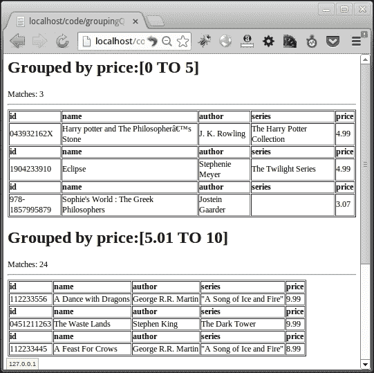
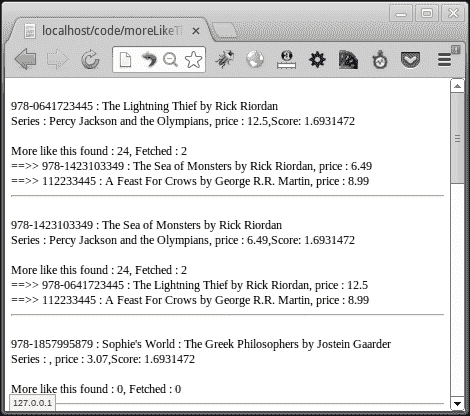

# 第八章。高级 Solr-分组、MoreLikeThis 查询和分布式搜索

在本章中，我们将研究 Solr 的一些高级概念。我们将根据某些标准查看基于分组的结果。我们还将查找类似于特定文档的结果，这些结果基于文档内的某些术语。我们将探索分布式搜索，可用于水平扩展 Solr 搜索基础架构。本章将涵盖的主题包括

+   按字段分组的结果

+   按查询分组的结果

+   使用 PHP 运行 morelikethis 查询

+   调整 morelikethis 查询的参数

+   分布式搜索

+   设置分布式搜索

+   使用 PHP 执行分布式搜索

+   设置 Solr 主从

+   使用 PHP 进行 Solr 查询的负载平衡

# 按字段分组的结果

结果分组是一种根据某些标准将结果合并在一起的功能。Solr 根据字段或查询为我们提供分组。让我们搜索所有书籍，并根据作者姓名和流派对结果进行分组。应该在非标记化字段上进行分组，因为分组输出对于完整字段值而不是单个标记更有意义。作者姓名和流派的非标记化字符串字段分别为`author_s`和`genre_s`。为什么？记得我们在第二章中讨论过一个概念，即动态字段，*向 Solr 插入、更新和删除文档*。类型为`*_s`的动态字段被定义为`string`，如下所示，它在 Solr 中没有标记化：

```php
  <dynamicField name="*_s"  type="string"  indexed="true"  stored="true" />
```

我们将不得不获取分组组件，并添加我们需要按组分组的字段，如下查询所示：

```php
  $grp = $query->getGrouping();
  $grp->addField('author_s');
  $grp->addField('genre_s');
```

让我们还使用以下查询设置 Solr 应为每个组返回的项目数：

```php
  $grp->setLimit(3);
```

还可以使用以下查询返回组的总数：

```php
  $grp->setNumberOfGroups(true);
```

显示分组信息，我们首先需要使用以下查询从结果集中获取分组组件：

```php
  $groups = $resultSet->getGrouping();
```

由于我们对多个字段进行了分组，因此在结果集中会得到多个分组。对于 groups 数组中的每个组，我们将使用以下代码获取匹配数和组元素数：

```php
  foreach($groups as $grpName => $grpFld)  {
  echo '<h1> Grouped by ' . $grpName . '</h1>';
  echo 'Total Matches: ' . $grpFld->getMatches();
  echo 'Number of groups: ' . $grpFld->getNumberOfGroups();
  foreach($grpFld as $grpVal)     {
  echo '<h2>Grouping for ' . $grpVal->getValue() . ' : ' . $grpVal->getNumFound() . '</h2>';
  foreach($grpVal as $doc){
  echo $doc->id;
  echo $doc->name;
  echo $doc->author;
        }
    }
}
```

我们正在迭代组元素的数量，以查找组中的名称/标题和元素数量。对于每个组元素，获取该组元素的文档。

Solr 查询日志中的查询如下：

```php
1013311 [http-bio-8080-exec-2] INFO  org.apache.solr.core.SolrCore  – [collection1] webapp=/solr path=/select params={omitHeader=true&**group.ngroups=true**&fl=id,name,author,series_t,score,last_modified&start=0&q=cat:book&**group.limit=3&group.field=author_s&group.field=genre_s&group=true&**wt=json&rows=25} hits=30 status=0 QTime=4

```

传递的参数是`group=true`以启用分组，对于每个字段，我们有一个`group.field=<field_name>`参数。`group.limit`参数用于指定要检索的每个组元素的文档数。输出如下图所示：


按字段分组的输出。

# 按查询分组的结果

我们还可以按查询分组，而不是按字段分组。让我们为不同的价格范围创建组。在分组组件上不使用`addField()`函数，而是使用`addQuery()`函数，并在函数中指定我们的查询作为参数，如下所示：

```php
  $grp->addQuery('price:[0 TO 5]');
  $grp->addQuery('price:[5.01 TO 10]');
  $grp->addQuery('price:[10.01 TO *]');
```

在这里，我们为价格范围$0 至$5、$5.01 至$10 和超过$10 创建了 3 个组。

我们还可以使用`setSort()`函数在组内设置排序，如下查询所示：

```php
  $grp->setSort('price desc');
```

显示组的代码与之前讨论的类似。我们代码的输出如下图所示：



从 Solr 日志中，我们可以看到我们得到了多个`group.query`参数，而不是`group.field`参数。

```php
  1404903 [http-bio-8080-exec-4] INFO  org.apache.solr.core.SolrCore  – [collection1] webapp=/solr path=/select params={omitHeader=true&**group.ngroups=true**&fl=id,name,author,series_t,score,price&start=0&q=cat:book&**group.limit=3&group.query=price:[0+TO+5]&group.query=price:[5.01+TO+10]&group.query=price:[10.01+TO+*]**    **&group.sort=price+desc&group=true&**wt=json&rows=25} hits=30 status=0 QTime=38
```

# 使用 PHP 运行更多类似此查询

Solr 的**更多类似此**功能可用于基于文档内部的术语构造查询。此功能帮助我们检索与我们查询结果中的文档类似的文档。我们必须指定运行更多类似此功能的字段。出于效率目的，建议我们为这些字段设置`termVectors=true`。让我们通过查看一个示例来了解此功能的工作原理。假设我们想要与结果中出现的书籍类似的书籍。书籍的相似性来自作者和它们所属的系列。因此，我们必须告诉 Solr 根据字段`author`和`series`获取与当前选择的书籍相似的书籍。Solr（Lucene）在索引中内部比较所选书籍的字段中的所有标记与所有文档（在我们的案例中是书籍）中指定字段的标记。根据匹配的标记数量，它检索结果并对其进行排名，以便具有最大标记匹配的文档排在前面。

让我们将`termVectors=true`添加到我们的字段`author`和`*_t`（对于`series_t`）。术语向量是一组术语频率对，可选地包含位置信息。术语向量是 Solr/Lucene 索引的基本构建块。我们需要重新索引文档。

### 注意

有关 Lucene 索引工作原理的更多信息，请查看[`lucene.apache.org/core/4_5_1/core/org/apache/lucene/codecs/lucene45/package-summary.html`](http://lucene.apache.org/core/4_5_1/core/org/apache/lucene/codecs/lucene45/package-summary.html)

在我们的 PHP 代码中，我们将不得不从查询中获取`MoreLikeThis`组件，并添加我们想要运行此功能的字段，如下所示：

```php
  $mltquery = $query->getMoreLikeThis();
  $mltquery->setFields('author,series_t');
```

此代码表示我们要在字段`author`和`series_t`上运行更多类似此相似功能。这对于相当大的数据集应该有效，但让我们进行一些调整，以使其适用于我们的小书籍索引，使用以下查询：

```php
  $mltquery->setMinimumDocumentFrequency(1);
  $mltquery->setMinimumTermFrequency(1);
```

这设置了将文档分类为相似文档的最低限制。我们将在“调整更多类似此查询参数”部分讨论这些参数的更多信息。

运行查询后，我们需要从结果集中获取更多类似此组件。然后，在处理结果集中的文档时，我们需要从更多类似此`resultset`组件中获取相似的文档，如下所示的代码：

```php
  $resultset = $client->select($query);
  $mltResult = $resultset->getMoreLikeThis();
  foreach($resultset as $doc) {
  echo $doc->id.', '.$doc->name.', '.$doc->author;
  $mltdocs = $mltResult->getResult($doc->id);
  if($mltdocs)   {
  echo "\n".$mltdocs->getMaximumScore();
  echo "\n".$mltdocs->getNumFound();
  echo 'Docs fetched : '.count($mltdocs);
  foreach($mltdocs as $mltdoc){
  echo "\n".$mltdoc->id.' : '.$mltdoc->name.' ['.$mltdoc->score.'] ';
        }
    }
}
```

一旦我们为文档获取了类似的文档，我们可以循环遍历文档并获取类似文档的详细信息。以下屏幕截图显示了此程序的输出：



我们可以在 Solr 日志中看到传递给 Solr 的两个主要参数是`mlt=true`和`mlt.fl=author,series_t`。要直接从 Solr 中看到相同的结果，我们可以在`http://localhost:8080/solr/collection1/select/?mlt=true&rows=10&mlt.count=2&mlt.mindf=1&mlt.fl=author,series_t&fl=id,name,author,series_t,score,price&start=0&q=cat:book&mlt.mintf=1`使用以下查询。

这里解释了以下参数：

+   **mlt.count**：这指定我们要为结果集中的每个文档获取的相似文档的数量

+   **mlt.mindf**：这是忽略词语的最小文档频率，这些词语在至少这么多文档中不出现

+   **mlt.mintf**：这是源文档中忽略术语的最小频率

# 更多类似此调整参数

让我们看一些可以用来调整更多类似此功能的附加功能。我们可以使用以下功能：

+   **setMinimumDocumentFrequency()**和**setMinimumTermFrequency()**：这些是用于设置我们之前看到的最小文档频率和最小术语频率的方法。如果未设置变量，则它们不会传递给 Solr，Solr 将使用`minimumDocumentFrequency`的默认参数为`5`，`minimumTermFrequency`的默认参数为`2`。

+   **setMinimumWordLength()**：可用于设置最小词长，低于该长度的单词将被忽略。

+   **setMaximumWordLength()**：可用于设置最大词长，高于该长度的单词将被忽略。

+   **setMaximumQueryTerms()**：可用于设置将包括在任何生成的查询中的最大查询项数。如果未设置，它将不会传递给 Solr，在这种情况下，Solr 的默认值为 25。

+   **setMaximumNumberOfTokens()**：可用于设置每个未存储`TermVector`支持的文档字段中要解析的最大标记数。默认值为 5000，如果不向 Solr 传递任何参数，则将应用该值。

+   **setBoost()**：如果为`true`，则通过有趣的术语相关性提升查询。默认值为`false`。

+   **setCount()**：可用于设置 Solr 中的`mlt.count`参数。它指定要为结果集中的每个文档获取多少相似文档。

+   **setQueryFields()**：可用于指定查询字段及其增强。这些字段也必须在`setFields()`函数中设置。

# 分布式搜索

当索引变得太大而无法放入单台机器时，我们可以对其进行分片，并将其分布到多台机器上。分片需要一个策略，根据某些字段中的某些值决定要将文档索引到哪个分片。这个策略可以基于日期、文档类型等。虽然必须分别为多个分片进行索引，但搜索必须通过单个接口进行。我们应该能够指定分片，并且查询应该在所有分片上运行并返回所有分片的结果。Solarium 使跨多个分片进行搜索变得容易。Solarium 通过`DistributedSearch`组件支持分布式搜索。这允许我们使用单个接口查询多个分片，并从所有分片获取结果。

另一种扩展搜索基础架构的方法是创建主从 Solr 架构。主服务器用于向索引中添加文档，从服务器用于提供搜索。这种架构可以帮助在大量服务器上扩展搜索。通常建议创建既有副本又有分片的基础架构。Solr 云是一个提供这样的基础架构的解决方案，具有易于管理和监控的特点。

# 设置分布式搜索

让我们创建一个新的 Solr 实例，作为一个独立的分片。转到安装 Solr 的目录，并创建`example`文件夹的副本，`example2`。这将创建一个新的 Solr 实例，其中包含复制的索引和模式。现在在`example2`文件夹中启动 Solr 服务器。我们在端口 8983 上运行一个新的 Solr 实例。我们之前的实例在端口 8080 上运行。

### 注意

Linux 用户的相应命令是：

```php
  cd <Solr home>
  cp –r example example2
  cd example2
  java -jar start.jar –Djetty.port=8983
```

对于 Windows 用户，您可以使用 Windows 资源管理器简单地复制`example`文件夹，然后在`example2`文件夹中`cd`后在命令提示符中运行`java-jar start.jar –Djetty.port=8983`。

要终止现有服务器，请在运行 Solr 服务器的命令提示符上按下*Ctrl* + *C*。

要检查 Solr 实例，请转到`http://localhost:8983/solr/`。

由于我们已经复制了索引，新的 Solr 实例将包含我们之前的所有文档。让我们从索引中删除所有文档，并向索引中添加一些新文档。

`http://localhost:8983/solr/update?stream.body=<delete><query>*:*</query></delete>`

`http://localhost:8983/solr/update?stream.body=<commit/>`

使用以下命令从`books2.csv`文件添加更多书籍：

```php
  java -Durl=http://localhost:8983/solr/update -Dtype=application/csv -jar post.jar <path/to/file/>books2.csv
```

# 使用 PHP 执行分布式搜索

要在多个分片上进行搜索，首先需要从 Solr 获取分布式搜索组件。然后按照以下代码添加分片进行搜索：

```php
  $dSearch = $query->getDistributedSearch();
  $dSearch->addShard('shard1','localhost:8080/solr');
  $dSearch->addShard('shard2','localhost:8983/solr');
  $resultSet = $client->select($query);
```

执行搜索后，我们会得到一个结果集，其中包含来自所有分片的结果，可以像之前使用结果集一样使用它。

当我们执行搜索时，我们可以看到两个服务器的 Solr 日志都接收到与此搜索相关的条目。传递的参数是`shard.url`（包含 Solr 的 URL）和`isShard=true`。

我们可以使用`addShards()`函数一次性添加多个分片，而不是一个接一个地添加分片，如下所示：

```php
  $dSearch->addShards(array(
    'shard1' => 'localhost:8080/solr',
    'shard2' => 'localhost:8983/solr'
));
```

Solr 推出了 Solr 云。因此，我们可以设置 Solr 云，而不是使用分片，其中数据会自动分片，并且我们可以与任何 Solr 实例联系以获取我们的查询结果。

Solr 云有一个集合的概念。因此，我们将需要使用`addCollection()`或`addCollections()`函数添加集合，而不是添加核心。此功能在 Solarium 3.1 及更高版本中可用。

# 设置 Solr 主从复制

我们可以设置 Solr 复制，其中主 Solr 服务器用于索引，主服务器和从服务器都可以用于搜索。在 Solr 中设置复制非常简单。查看名为`replication`的`requestHandler`。只需将 Solr 中的`example`文件夹复制为`example3`，并使用以下命令从`example3`文件夹中清空索引文件：

```php
 **cp -r example example3**
 **rm -rf example3/solr/collection1/data**

```

在主服务器（`example`文件夹）中，更改`solrconfig.xml`文件以添加复制主服务器的配置参数，使用以下代码：

```php
  <lst name="master">
  <str name="replicateAfter">commit</str>
  <str name="replicateAfter">startup</str>
  <str name="confFiles">schema.xml,stopwords.txt</str>
  </lst>
```

在这里，我们指定了复制应该在启动后和 Solr 提交后发生。`schema.xml`和`stopwords.txt`文件应该被复制。

在`slave` Solr（`example3`文件夹）中，更改`solrconfig.xml`文件以添加从 Solr 配置参数。需要指定的参数是主 Solr 服务器的 URL 和检查 Solr 的轮询间隔。这里的轮询间隔定义为 HH:MM:SS（小时:分钟:秒），如下所示的代码：

```php
  <lst name="slave">
  <str name="masterUrl">http://localhost:8080/solr</str>
  <str name="pollInterval">00:00:60</str>
  </lst>
```

重新启动 Tomcat，并使用我们之前使用的`java –jar start.jar`命令在`example3`文件夹中启动 Solr 服务器。这将在端口 8983 上启动 Solr。这个 Solr 服务器将充当从服务器，并轮询主服务器进行更新。所有索引文件都会在从服务器上复制，如下截图所示：


主服务器的 Solr 界面。

在前面的截图中，我们可以看到主服务器的 Solr 界面中定义了复制主服务器，并带有索引的版本号。在下面的从服务器的 Solr 界面中，我们可以看到有一个从服务器和对主服务器的引用。请注意，截图中的版本号是匹配的：


从服务器的 Solr 界面。

# 使用 PHP 进行 Solr 查询的负载均衡

Solarium 带有一个负载均衡器插件，可用于在多个 Solr 服务器之间建立冗余。负载均衡器插件具有以下功能：

+   支持多个服务器，每个服务器都有自己的权重。

+   使用故障转移模式的能力——如果查询失败，则尝试另一个 Solr 服务器。

+   阻止某些查询类型。更新默认被阻止。

+   强制下一个查询使用特定服务器。

将要分发查询的所有 Solr 服务器添加到您的 Solarium 客户端配置中。在我们的情况下，我们将使用以下代码添加最近设置的主服务器和从服务器：

```php
$config = array(
    "master" => array(
        "master" => array(
            "host"=>"127.0.0.1",
            "port"=>"8080",
            "path"=>"/solr",
            "core"=>"collection1",
        ),      
    ),
    "slave" => array(
        "slave" => array(
            "host"=>"127.0.0.1",
            "port"=>"8983",
            "path"=>"/solr",
            "core"=>"collection1",
        ),
    )
);
```

接下来，我们需要从 Solarium 客户端创建端点，从客户端获取负载均衡器插件，并将端点添加到负载均衡器中，并显示相应的权重，如下所示的代码：

```php
  $masterEndpoint = $client->createEndpoint("master");
  $slaveEndpoint = $client->createEndpoint("slave");
  $lb = $client->getPlugin('loadbalancer');
  $lb->addEndpoint($masterEndpoint, 1);
  $lb->addEndpoint($slaveEndpoint, 5);
```

在任何服务器上的查询失败后，启用故障转移到另一个 Solr 服务器。在将 Solr 服务器声明为不可达并故障转移到另一个服务器之前，将最大重试次数限制为 2 次，使用以下查询：

```php
  $lb->setFailoverEnabled(true);
  $lb->setFailoverMaxRetries(2);
```

在这里，我们将主服务器的权重设置为`1`，从服务器的权重设置为`5`。因此，平均每 6 个查询中就有 1 个会发送到主服务器。如果我们想要强制查询主服务器，我们可以使用`setForcedEndpointForNextQuery()`函数，如下面的查询所示：

```php
  $lb->setForcedEndpointForNextQuery('master');
```

# 总结

在本章中，我们讨论了 Solr 和 Solarium 库中可用的一些高级功能。我们看到了基于字段和查询的结果分组。我们还看到了一个称为更多类似的功能，它可以根据原始文档的一些字段从 Solr 中提取类似于特定文档的结果。我们看到了如何使用复制和分片将 Solr 扩展到单个机器之外。我们还看到了 Solarium 为扩展 Solr 提供的功能。
